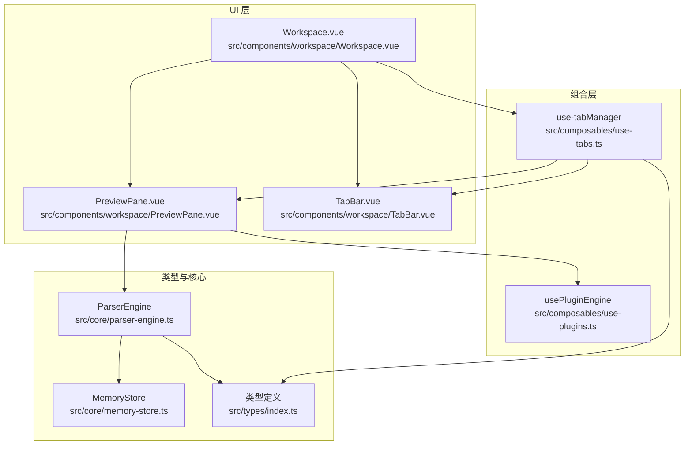
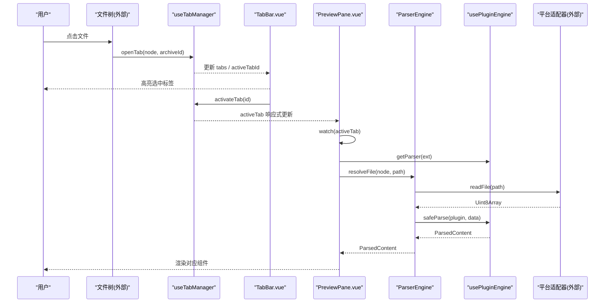
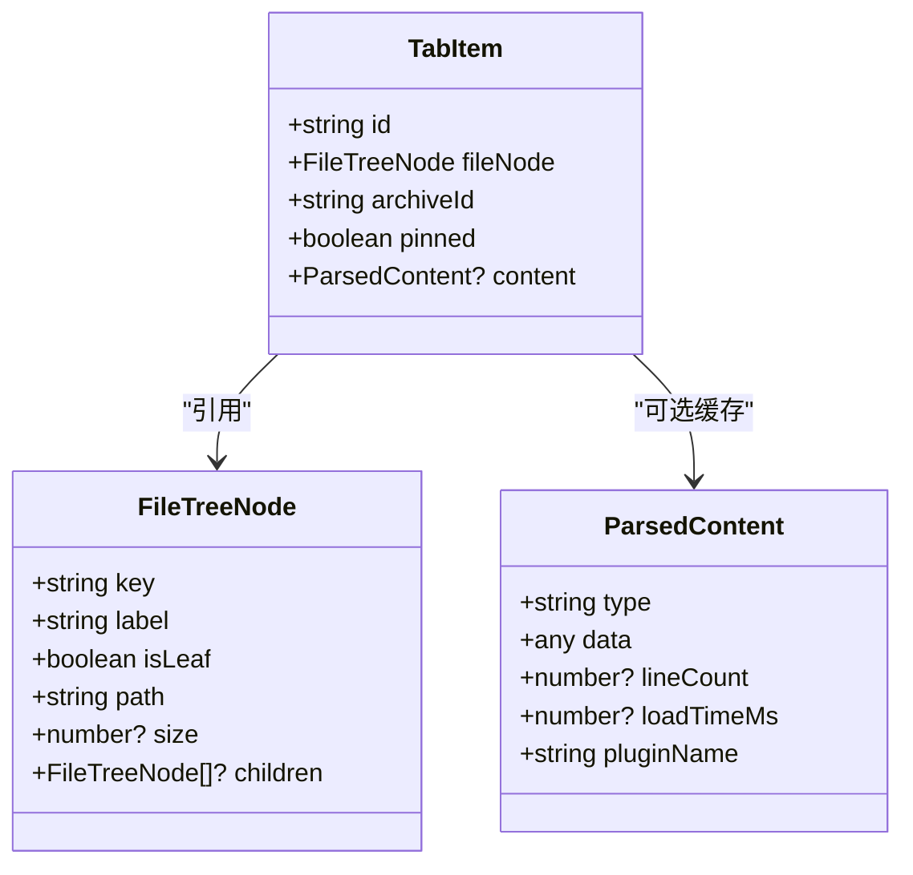
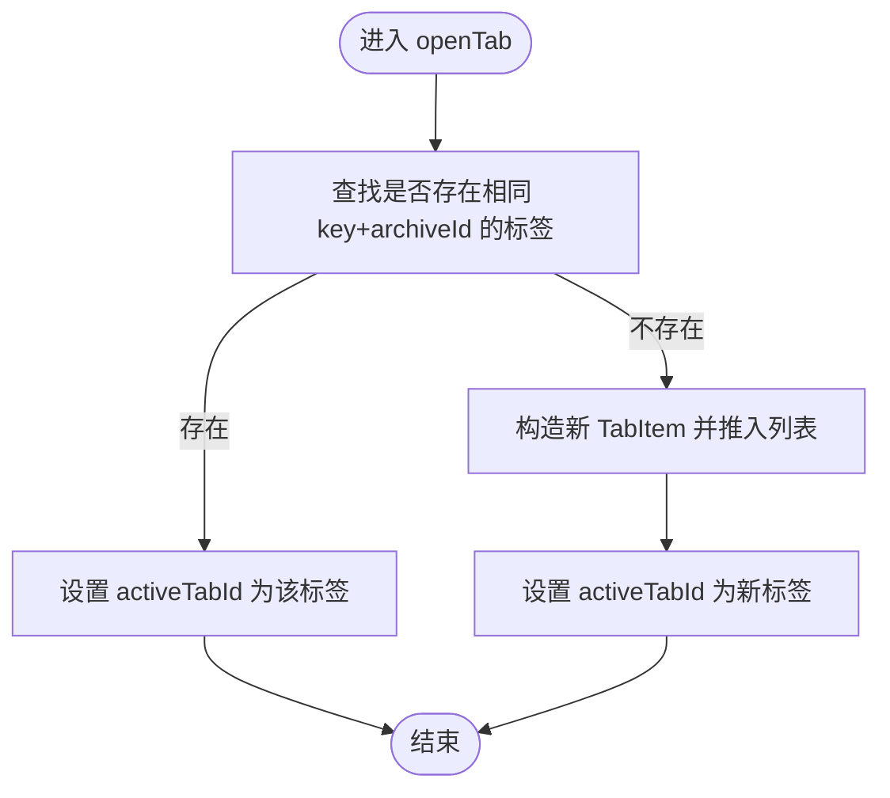
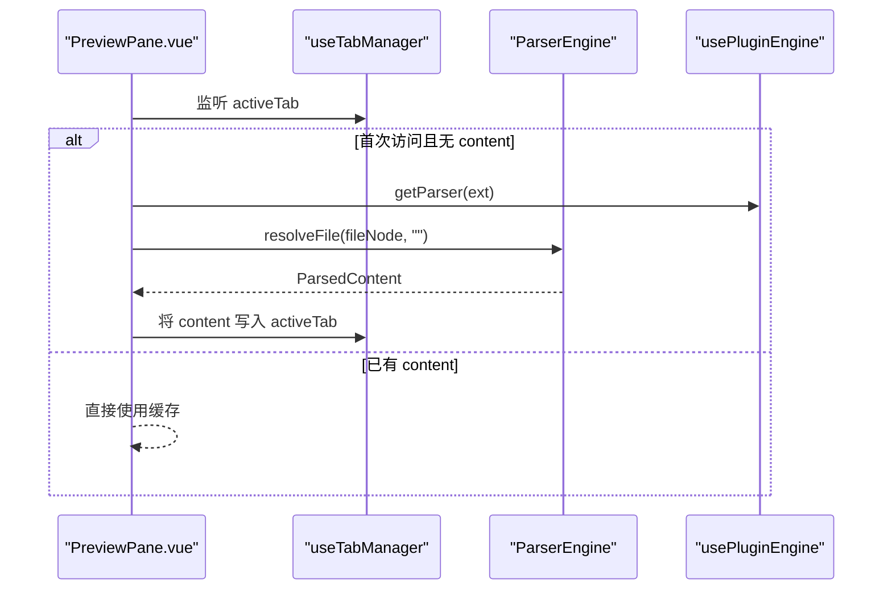
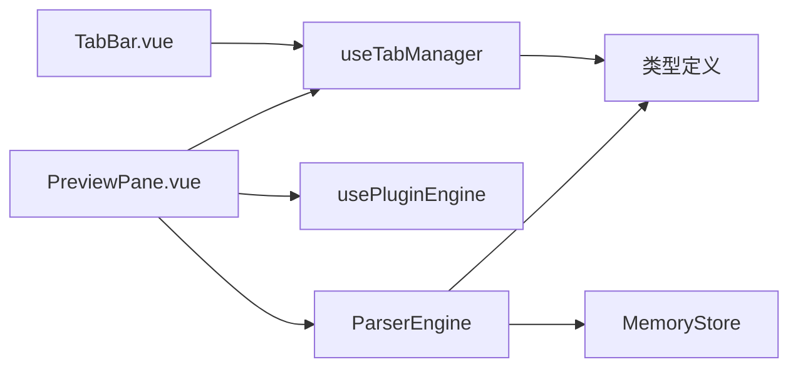

# 标签页管理组合函数

<cite>
**本文引用的文件**
- [use-tabs.ts](file://src/composables/use-tabs.ts)
- [TabBar.vue](file://src/components/workspace/TabBar.vue)
- [PreviewPane.vue](file://src/components/workspace/PreviewPane.vue)
- [Workspace.vue](file://src/components/workspace/Workspace.vue)
- [index.ts（类型定义）](file://src/types/index.ts)
- [parser-engine.ts](file://src/core/parser-engine.ts)
- [use-plugins.ts](file://src/composables/use-plugins.ts)
- [memory-store.ts](file://src/core/memory-store.ts)
- [use-tabs.test.ts](file://src/__tests__/composables/use-tabs.test.ts)
</cite>

## 目录
1. [简介](#简介)
2. [项目结构](#项目结构)
3. [核心组件](#核心组件)
4. [架构总览](#架构总览)
5. [详细组件分析](#详细组件分析)
6. [依赖关系分析](#依赖关系分析)
7. [性能考量](#性能考量)
8. [故障排查指南](#故障排查指南)
9. [结论](#结论)
10. [附录](#附录)

## 简介
本技术文档围绕 useTabs 组合函数，系统化阐述标签页管理系统的数据结构设计、生命周期管理、多文件同时打开的实现原理、切换与焦点控制、持久化机制现状与扩展建议，以及组件集成示例与最佳实践。目标是帮助开发者快速理解并高效扩展该模块。

## 项目结构
标签页相关代码主要分布在以下位置：
- 组合函数：src/composables/use-tabs.ts
- 类型定义：src/types/index.ts
- UI 展示：src/components/workspace/TabBar.vue
- 内容渲染：src/components/workspace/PreviewPane.vue
- 工作区编排：src/components/workspace/Workspace.vue
- 解析引擎：src/core/parser-engine.ts
- 插件注册：src/composables/use-plugins.ts
- 内存存储：src/core/memory-store.ts
- 单元测试：src/__tests__/composables/use-tabs.test.ts

图表来源
- [use-tabs.ts:1-64](file://src/composables/use-tabs.ts#L1-L64)
- [TabBar.vue:1-33](file://src/components/workspace/TabBar.vue#L1-L33)
- [PreviewPane.vue:1-58](file://src/components/workspace/PreviewPane.vue#L1-L58)
- [Workspace.vue:1-36](file://src/components/workspace/Workspace.vue#L1-L36)
- [index.ts（类型定义）:1-71](file://src/types/index.ts#L1-L71)
- [parser-engine.ts:1-35](file://src/core/parser-engine.ts#L1-L35)
- [use-plugins.ts:1-17](file://src/composables/use-plugins.ts#L1-L17)
- [memory-store.ts:1-25](file://src/core/memory-store.ts#L1-L25)

章节来源
- [use-tabs.ts:1-64](file://src/composables/use-tabs.ts#L1-L64)
- [TabBar.vue:1-33](file://src/components/workspace/TabBar.vue#L1-L33)
- [PreviewPane.vue:1-58](file://src/components/workspace/PreviewPane.vue#L1-L58)
- [Workspace.vue:1-36](file://src/components/workspace/Workspace.vue#L1-L36)
- [index.ts（类型定义）:1-71](file://src/types/index.ts#L1-L71)
- [parser-engine.ts:1-35](file://src/core/parser-engine.ts#L1-L35)
- [use-plugins.ts:1-17](file://src/composables/use-plugins.ts#L1-L17)
- [memory-store.ts:1-25](file://src/core/memory-store.ts#L1-L25)

## 核心组件
- 组合函数 useTabManager：提供标签页的创建、激活、关闭、置顶、批量关闭与重置等能力，维护当前激活标签页 ID 与标签列表。
- TabBar 组件：基于 Naive UI 的 Tabs 组件，绑定 activeTabId，处理用户交互（切换、关闭、置顶显示）。
- PreviewPane 组件：监听 activeTab 变化，按需加载并缓存内容，根据文件扩展名选择渲染器。
- Workspace 组件：编排 TabBar、预览工具栏、预览面板与状态栏，暴露字体大小、换行、行号、编码等视图配置。
- 类型定义：TabItem、FileTreeNode、ParsedContent 等，描述标签项、文件树节点与解析结果的结构。
- ParserEngine：统一读取文件、解析数据、记录耗时与插件信息，供预览面板使用。
- MemoryStore：进程内键值存储，用于演示或扩展内容缓存策略。

章节来源
- [use-tabs.ts:1-64](file://src/composables/use-tabs.ts#L1-L64)
- [TabBar.vue:1-33](file://src/components/workspace/TabBar.vue#L1-L33)
- [PreviewPane.vue:1-58](file://src/components/workspace/PreviewPane.vue#L1-L58)
- [Workspace.vue:1-36](file://src/components/workspace/Workspace.vue#L1-L36)
- [index.ts（类型定义）:1-71](file://src/types/index.ts#L1-L71)
- [parser-engine.ts:1-35](file://src/core/parser-engine.ts#L1-L35)
- [memory-store.ts:1-25](file://src/core/memory-store.ts#L1-L25)

## 架构总览
标签页系统采用“组合函数 + 组件”的轻量级状态管理模式：
- 状态集中：useTabManager 在模块级别维护 tabs 与 activeTabId，通过 computed 派生 activeTab。
- 组件驱动：TabBar 负责用户操作，PreviewPane 负责内容加载与渲染。
- 解析解耦：PreviewPane 通过 ParserEngine 与插件注册中心协作，按扩展名选择解析器。

图表来源
- [use-tabs.ts:1-64](file://src/composables/use-tabs.ts#L1-L64)
- [TabBar.vue:1-33](file://src/components/workspace/TabBar.vue#L1-L33)
- [PreviewPane.vue:1-58](file://src/components/workspace/PreviewPane.vue#L1-L58)
- [parser-engine.ts:1-35](file://src/core/parser-engine.ts#L1-L35)
- [use-plugins.ts:1-17](file://src/composables/use-plugins.ts#L1-L17)

## 详细组件分析

### 数据结构设计
- FileTreeNode：表示文件树节点，包含 key、label、isLeaf、path 等字段，作为标签页的文件引用源。
- ParsedContent：表示解析后的内容，包含 type、data、lineCount、loadTimeMs、pluginName。
- TabItem：标签项模型，包含 id、fileNode、archiveId、pinned、content（可选），其中 content 为懒加载的内容缓存。

图表来源
- [index.ts（类型定义）:17-54](file://src/types/index.ts#L17-L54)

章节来源
- [index.ts（类型定义）:17-54](file://src/types/index.ts#L17-L54)

### 标签页生命周期管理
- 创建：openTab 接收 FileTreeNode 与 archiveId，若已存在相同 key+archiveId 的标签则直接激活；否则生成新 TabItem 并加入列表，设置为活动标签。
- 激活：activateTab 仅更新 activeTabId，由 computed 派生 activeTab。
- 切换：TabBar 通过 @update:value 调用 activateTab，实现 UI 与状态同步。
- 关闭：closeTab 从数组移除指定标签，若关闭的是活动标签，则将活动标签切换到相邻项或置空。
- 置顶：togglePin 切换 pinned 标志，影响 closeAll 行为与 UI 显示。
- 批量关闭：closeAll 保留 pinned 标签，并将活动标签指向首个保留项或置空。
- 重置：reset 清空所有状态，便于测试或会话恢复。

图表来源
- [use-tabs.ts:14-31](file://src/composables/use-tabs.ts#L14-L31)

章节来源
- [use-tabs.ts:14-31](file://src/composables/use-tabs.ts#L14-L31)
- [use-tabs.ts:33-40](file://src/composables/use-tabs.ts#L33-L40)
- [use-tabs.ts:42-44](file://src/composables/use-tabs.ts#L42-L44)
- [use-tabs.ts:46-49](file://src/composables/use-tabs.ts#L46-L49)
- [use-tabs.ts:51-54](file://src/composables/use-tabs.ts#L51-L54)
- [use-tabs.ts:56-60](file://src/composables/use-tabs.ts#L56-L60)

### 多文件同时打开与内容缓存
- 多文件支持：tabs 数组可容纳多个 TabItem，每个 TabItem 独立引用一个 FileTreeNode，并通过 archiveId 区分不同压缩包上下文。
- 内容缓存：TabItem.content 为可选字段，PreviewPane 在首次访问时通过 ParserEngine 解析并写入 content，后续直接复用，避免重复 I/O 与解析。
- 状态同步：activeTab 是 computed，当 activeTabId 变化时自动派生新的 activeTab，PreviewPane 的 watch 会触发内容加载逻辑。

图表来源
- [PreviewPane.vue:24-35](file://src/components/workspace/PreviewPane.vue#L24-L35)
- [parser-engine.ts:11-33](file://src/core/parser-engine.ts#L11-L33)
- [use-plugins.ts:7-16](file://src/composables/use-plugins.ts#L7-L16)

章节来源
- [PreviewPane.vue:24-35](file://src/components/workspace/PreviewPane.vue#L24-L35)
- [parser-engine.ts:11-33](file://src/core/parser-engine.ts#L11-L33)
- [use-plugins.ts:7-16](file://src/composables/use-plugins.ts#L7-L16)

### 标签页切换与焦点管理
- 焦点管理：activeTabId 作为单一事实来源，TabBar 通过 value 双向绑定，确保 UI 与状态一致。
- 历史记录：当前实现未维护历史栈，切换仅更新 activeTabId。如需前进/后退，可在组合函数中增加 history 数组与指针。
- 键盘导航：当前未内置键盘快捷键（如 Ctrl+Tab、Ctrl+W）。可在 TabBar 或应用根层添加全局键盘事件监听，调用 activateTab/closeTab/togglePin。

章节来源
- [TabBar.vue:6-18](file://src/components/workspace/TabBar.vue#L6-L18)
- [use-tabs.ts:42-44](file://src/composables/use-tabs.ts#L42-L44)

### 持久化机制
- 现状：useTabManager 未实现本地持久化，reset 仅清理内存状态。
- 建议方案：
  - 保存：在 closeTab/openTab/activateTab/togglePin/closeAll 后，序列化 tabs 与 activeTabId 到 localStorage/sessionStorage。
  - 恢复：应用启动时读取持久化数据，重建 tabs 与 activeTabId，必要时校验 fileNode 有效性。
  - 清理：在 closeAll/reset 时同步清理持久化数据。
  - 安全：对敏感路径或大对象进行脱敏与压缩，限制存储体积。

章节来源
- [use-tabs.ts:56-60](file://src/composables/use-tabs.ts#L56-L60)

### 组件集成示例与最佳实践
- 与预览面板协作：
  - 在 TabBar 中调用 openTab/activateTab/closeTab/togglePin。
  - 在 PreviewPane 中监听 activeTab，按需加载并缓存 content。
- 性能优化技巧：
  - 延迟解析：仅在 activeTab 首次访问时解析，避免一次性加载全部文件。
  - 内容去重：基于 fileNode.key + archiveId 去重，防止重复打开同一文件。
  - 渲染隔离：使用 ErrorBoundary 包裹渲染组件，提升稳定性。
- 用户体验增强：
  - 置顶标签：支持 pinned 标记，避免误关重要文件。
  - 批量关闭：closeAll 保留置顶标签，减少用户操作成本。
  - 空态提示：无标签时显示引导文案，提升可用性。

章节来源
- [TabBar.vue:11-32](file://src/components/workspace/TabBar.vue#L11-L32)
- [PreviewPane.vue:45-57](file://src/components/workspace/PreviewPane.vue#L45-L57)
- [use-tabs.ts:46-54](file://src/composables/use-tabs.ts#L46-L54)

## 依赖关系分析
- useTabManager 依赖类型定义（TabItem、FileTreeNode）。
- TabBar 依赖 useTabManager 提供的状态与方法。
- PreviewPane 依赖 useTabManager、usePluginEngine、ParserEngine。
- ParserEngine 依赖平台适配器与插件注册中心。
- MemoryStore 可作为未来内容缓存的扩展点。

图表来源
- [use-tabs.ts:1-64](file://src/composables/use-tabs.ts#L1-L64)
- [TabBar.vue:1-33](file://src/components/workspace/TabBar.vue#L1-L33)
- [PreviewPane.vue:1-58](file://src/components/workspace/PreviewPane.vue#L1-L58)
- [parser-engine.ts:1-35](file://src/core/parser-engine.ts#L1-L35)
- [use-plugins.ts:1-17](file://src/composables/use-plugins.ts#L1-L17)
- [memory-store.ts:1-25](file://src/core/memory-store.ts#L1-L25)
- [index.ts（类型定义）:1-71](file://src/types/index.ts#L1-L71)

章节来源
- [use-tabs.ts:1-64](file://src/composables/use-tabs.ts#L1-L64)
- [TabBar.vue:1-33](file://src/components/workspace/TabBar.vue#L1-L33)
- [PreviewPane.vue:1-58](file://src/components/workspace/PreviewPane.vue#L1-L58)
- [parser-engine.ts:1-35](file://src/core/parser-engine.ts#L1-L35)
- [use-plugins.ts:1-17](file://src/composables/use-plugins.ts#L1-L17)
- [memory-store.ts:1-25](file://src/core/memory-store.ts#L1-L25)
- [index.ts（类型定义）:1-71](file://src/types/index.ts#L1-L71)

## 性能考量
- 解析时机：仅在 activeTab 首次访问时解析，避免不必要的 I/O 与 CPU 开销。
- 内容缓存：利用 TabItem.content 缓存解析结果，减少重复计算。
- 渲染隔离：使用错误边界捕获渲染异常，避免崩溃扩散。
- 内存管理：结合 MemoryStore 可扩展为更细粒度的缓存策略（LRU、按标签粒度释放等）。

[本节为通用指导，不直接分析具体文件]

## 故障排查指南
- 问题：打开重复标签导致列表膨胀
  - 排查：确认 openTab 的去重逻辑是否生效（key + archiveId）。
  - 参考：[use-tabs.ts:14-21](file://src/composables/use-tabs.ts#L14-L21)
- 问题：关闭活动标签后界面空白
  - 排查：检查 closeTab 的活动标签切换逻辑是否正确。
  - 参考：[use-tabs.ts:33-40](file://src/composables/use-tabs.ts#L33-L40)
- 问题：预览面板未渲染
  - 排查：确认 activeTab 是否有 content；查看 ParserEngine 返回是否为 null。
  - 参考：[PreviewPane.vue:24-35](file://src/components/workspace/PreviewPane.vue#L24-L35)、[parser-engine.ts:11-33](file://src/core/parser-engine.ts#L11-L33)
- 问题：置顶标签无法关闭
  - 排查：确认 togglePin 与 closeAll 的行为是否符合预期。
  - 参考：[use-tabs.ts:46-54](file://src/composables/use-tabs.ts#L46-L54)

章节来源
- [use-tabs.ts:14-21](file://src/composables/use-tabs.ts#L14-L21)
- [use-tabs.ts:33-40](file://src/composables/use-tabs.ts#L33-L40)
- [PreviewPane.vue:24-35](file://src/components/workspace/PreviewPane.vue#L24-L35)
- [parser-engine.ts:11-33](file://src/core/parser-engine.ts#L11-L33)
- [use-tabs.ts:46-54](file://src/composables/use-tabs.ts#L46-L54)

## 结论
useTabManager 提供了简洁高效的标签页管理能力，配合 TabBar 与 PreviewPane 实现了完整的“打开—激活—渲染—关闭”闭环。当前实现聚焦于基础功能与内容懒加载缓存，建议在后续迭代中补充历史记录、键盘导航与持久化机制，以进一步提升可用性与健壮性。

[本节为总结性内容，不直接分析具体文件]

## 附录
- 单元测试覆盖场景：
  - 打开新标签、避免重复打开、关闭标签、关闭活动标签后激活下一个、置顶切换、批量关闭保留置顶、无置顶时清空活动标签。
  - 参考：[use-tabs.test.ts:15-75](file://src/__tests__/composables/use-tabs.test.ts#L15-L75)

章节来源
- [use-tabs.test.ts:15-75](file://src/__tests__/composables/use-tabs.test.ts#L15-L75)