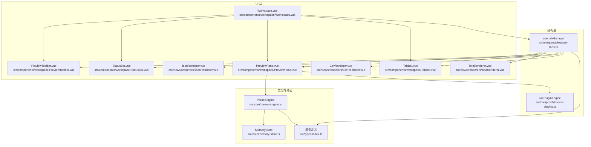
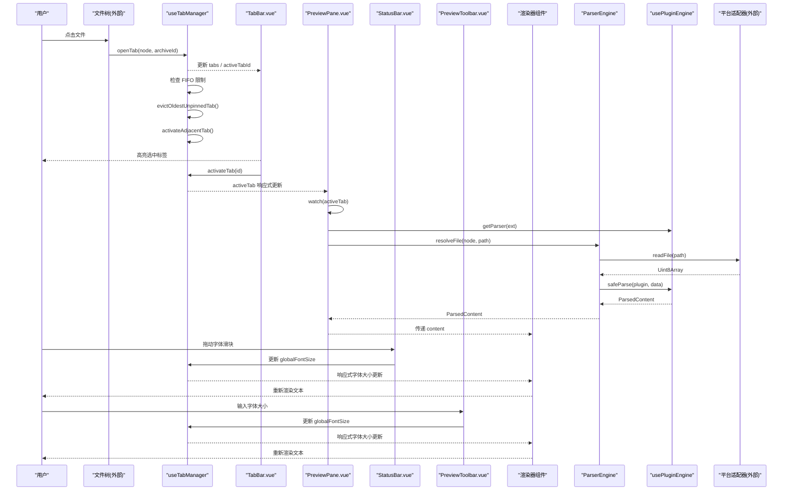
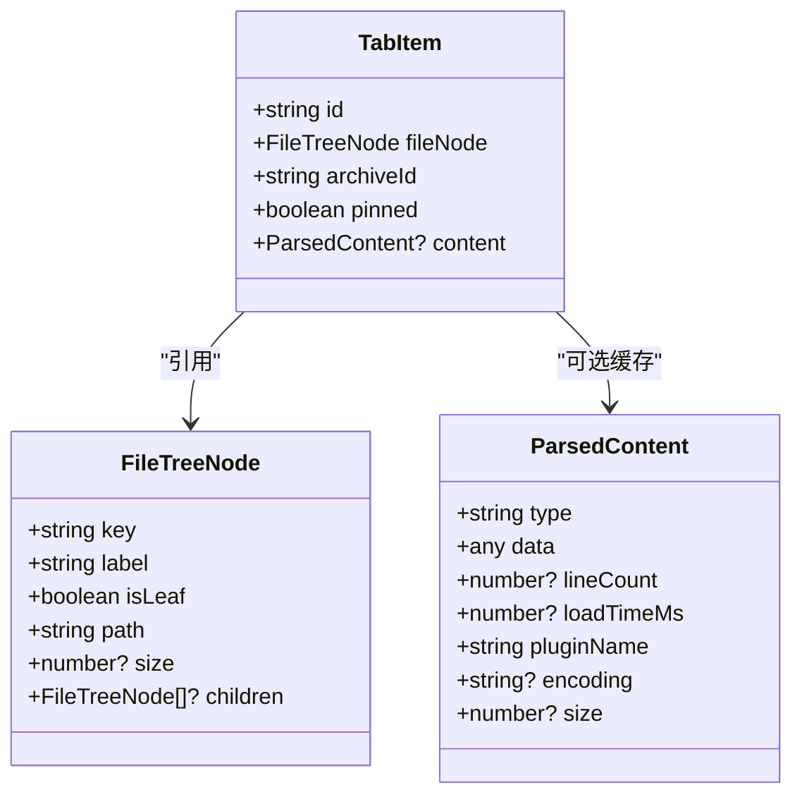
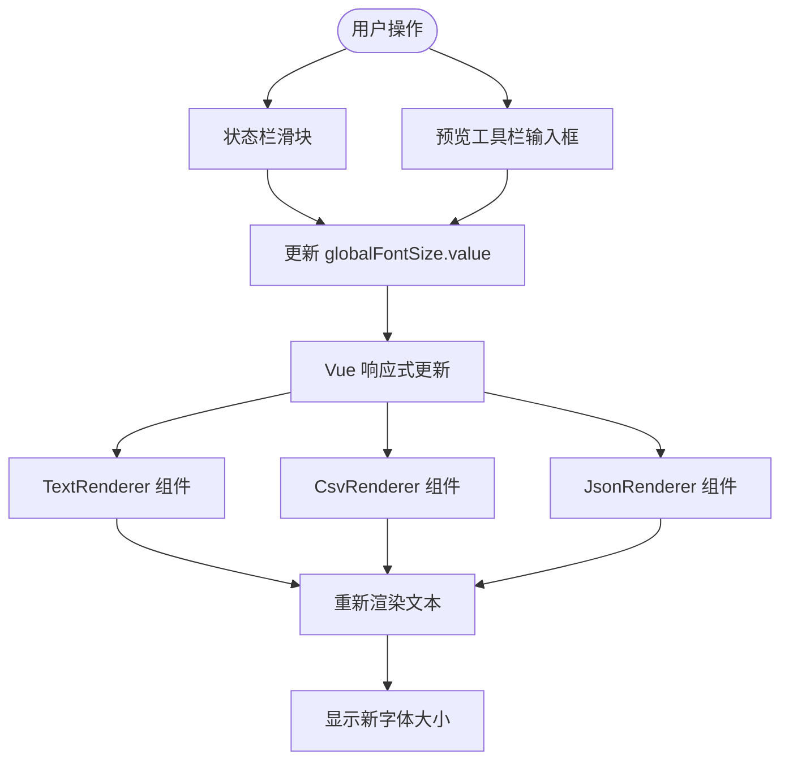
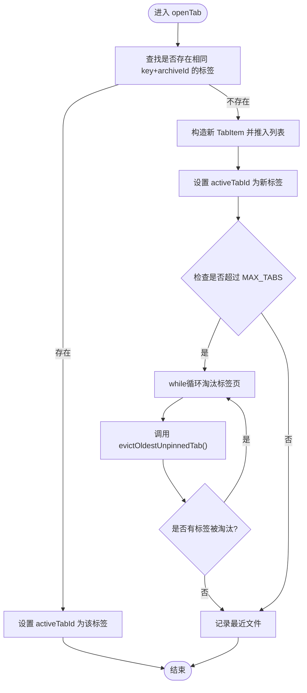
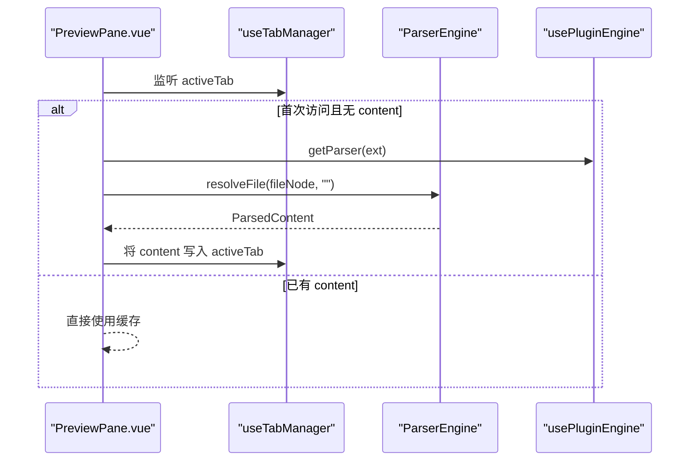
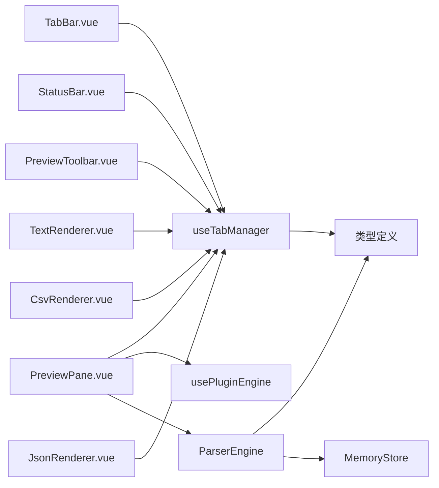

# 标签页管理组合函数

<cite>
**本文引用的文件**
- [use-tabs.ts](file://src/composables/use-tabs.ts)
- [TabBar.vue](file://src/components/workspace/TabBar.vue)
- [PreviewPane.vue](file://src/components/workspace/PreviewPane.vue)
- [Workspace.vue](file://src/components/workspace/Workspace.vue)
- [StatusBar.vue](file://src/components/workspace/StatusBar.vue)
- [PreviewToolbar.vue](file://src/components/workspace/PreviewToolbar.vue)
- [TextRenderer.vue](file://src/views/renderers/TextRenderer.vue)
- [CsvRenderer.vue](file://src/views/renderers/CsvRenderer.vue)
- [JsonRenderer.vue](file://src/views/renderers/JsonRenderer.vue)
- [index.ts（类型定义）](file://src/types/index.ts)
- [parser-engine.ts](file://src/core/parser-engine.ts)
- [use-plugins.ts](file://src/composables/use-plugins.ts)
- [memory-store.ts](file://src/core/memory-store.ts)
- [use-tabs.test.ts](file://src/__tests__/composables/use-tabs.test.ts)
</cite>

## 更新摘要
**所做更改**
- 新增全局字体大小管理功能，提供统一的文本显示控制
- 添加响应式 globalFontSize 状态，支持实时字体缩放
- 集成状态栏滑块和预览工具栏数字输入框进行字体大小调节
- 扩展所有渲染器组件以支持动态字体大小设置
- 增强用户体验，提供更灵活的文本显示控制选项

## 目录
1. [简介](#简介)
2. [项目结构](#项目结构)
3. [核心组件](#核心组件)
4. [架构总览](#架构总览)
5. [详细组件分析](#详细组件分析)
6. [依赖关系分析](#依赖关系分析)
7. [性能考量](#性能考量)
8. [故障排查指南](#故障排查指南)
9. [结论](#结论)
10. [附录](#附录)

## 简介
本技术文档围绕 useTabs 组合函数，系统化阐述标签页管理系统的数据结构设计、生命周期管理、多文件同时打开的实现原理、切换与焦点控制、持久化机制现状与扩展建议，以及组件集成示例与最佳实践。目标是帮助开发者快速理解并高效扩展该模块。

**更新** 新增了全局字体大小管理功能，通过响应式状态实现跨组件的字体大小同步控制，支持用户通过状态栏滑块或预览工具栏数字输入框实时调整字体大小（10-24px范围），提升了文本内容的可读性和用户体验。

## 项目结构
标签页相关代码主要分布在以下位置：
- 组合函数：src/composables/use-tabs.ts
- 类型定义：src/types/index.ts
- UI 展示：src/components/workspace/TabBar.vue
- 内容渲染：src/components/workspace/PreviewPane.vue
- 工作区编排：src/components/workspace/Workspace.vue
- 状态栏控制：src/components/workspace/StatusBar.vue
- 预览工具栏：src/components/workspace/PreviewToolbar.vue
- 文本渲染器：src/views/renderers/TextRenderer.vue
- CSV 渲染器：src/views/renderers/CsvRenderer.vue
- JSON 渲染器：src/views/renderers/JsonRenderer.vue
- 解析引擎：src/core/parser-engine.ts
- 插件注册：src/composables/use-plugins.ts
- 内存存储：src/core/memory-store.ts
- 单元测试：src/__tests__/composables/use-tabs.test.ts

图表来源
- [use-tabs.ts:1-161](file://src/composables/use-tabs.ts#L1-L161)
- [TabBar.vue:1-265](file://src/components/workspace/TabBar.vue#L1-L265)
- [PreviewPane.vue:1-99](file://src/components/workspace/PreviewPane.vue#L1-L99)
- [Workspace.vue:1-38](file://src/components/workspace/Workspace.vue#L1-L38)
- [StatusBar.vue:1-50](file://src/components/workspace/StatusBar.vue#L1-L50)
- [PreviewToolbar.vue:1-44](file://src/components/workspace/PreviewToolbar.vue#L1-L44)
- [TextRenderer.vue:1-50](file://src/views/renderers/TextRenderer.vue#L1-L50)
- [CsvRenderer.vue:1-53](file://src/views/renderers/CsvRenderer.vue#L1-L53)
- [JsonRenderer.vue:1-32](file://src/views/renderers/JsonRenderer.vue#L1-L32)
- [index.ts（类型定义）:1-148](file://src/types/index.ts#L1-L148)
- [parser-engine.ts:1-35](file://src/core/parser-engine.ts#L1-L35)
- [use-plugins.ts:1-17](file://src/composables/use-plugins.ts#L1-L17)
- [memory-store.ts:1-25](file://src/core/memory-store.ts#L1-L25)

章节来源
- [use-tabs.ts:1-161](file://src/composables/use-tabs.ts#L1-L161)
- [TabBar.vue:1-265](file://src/components/workspace/TabBar.vue#L1-L265)
- [PreviewPane.vue:1-99](file://src/components/workspace/PreviewPane.vue#L1-L99)
- [Workspace.vue:1-38](file://src/components/workspace/Workspace.vue#L1-L38)
- [StatusBar.vue:1-50](file://src/components/workspace/StatusBar.vue#L1-L50)
- [PreviewToolbar.vue:1-44](file://src/components/workspace/PreviewToolbar.vue#L1-L44)
- [TextRenderer.vue:1-50](file://src/views/renderers/TextRenderer.vue#L1-L50)
- [CsvRenderer.vue:1-53](file://src/views/renderers/CsvRenderer.vue#L1-L53)
- [JsonRenderer.vue:1-32](file://src/views/renderers/JsonRenderer.vue#L1-L32)
- [index.ts（类型定义）:1-148](file://src/types/index.ts#L1-L148)
- [parser-engine.ts:1-35](file://src/core/parser-engine.ts#L1-L35)
- [use-plugins.ts:1-17](file://src/composables/use-plugins.ts#L1-L17)
- [memory-store.ts:1-25](file://src/core/memory-store.ts#L1-L25)

## 核心组件
- 组合函数 useTabManager：提供标签页的创建、激活、关闭、置顶、批量关闭与重置等能力，维护当前激活标签页 ID 与标签列表，支持 FIFO 限制和最近文件记录，**新增** 全局字体大小管理功能。
- TabBar 组件：基于 Naive UI 的 Tabs 组件，绑定 activeTabId，处理用户交互（切换、关闭、置顶显示），支持溢出滚动和右键菜单操作。
- PreviewPane 组件：监听 activeTab 变化，按需加载并缓存内容，根据文件扩展名选择渲染器。
- Workspace 组件：编排 TabBar、预览工具栏、预览面板与状态栏，暴露字体大小、换行、行号、编码等视图配置，**新增** 全局字体大小的双向绑定。
- StatusBar 组件：**新增** 字体大小滑块控件，提供直观的字体缩放界面，支持 10-24px 范围调节。
- PreviewToolbar 组件：**新增** 字体大小数字输入框，提供精确的字体大小设置。
- 渲染器组件：TextRenderer、CsvRenderer、JsonRenderer 等，**新增** 全局字体大小支持，动态应用字体样式。
- 类型定义：TabItem、FileTreeNode、ParsedContent 等，描述标签项、文件树节点与解析结果的结构。
- ParserEngine：统一读取文件、解析数据、记录耗时与插件信息，供预览面板使用。
- MemoryStore：进程内键值存储，用于演示或扩展内容缓存策略。

**更新** 增强了全局字体大小管理功能，通过响应式状态实现了跨组件的字体大小同步控制，显著提升了用户体验和可访问性。

章节来源
- [use-tabs.ts:1-161](file://src/composables/use-tabs.ts#L1-L161)
- [TabBar.vue:1-265](file://src/components/workspace/TabBar.vue#L1-L265)
- [PreviewPane.vue:1-99](file://src/components/workspace/PreviewPane.vue#L1-L99)
- [Workspace.vue:1-38](file://src/components/workspace/Workspace.vue#L1-L38)
- [StatusBar.vue:1-50](file://src/components/workspace/StatusBar.vue#L1-L50)
- [PreviewToolbar.vue:1-44](file://src/components/workspace/PreviewToolbar.vue#L1-L44)
- [TextRenderer.vue:1-50](file://src/views/renderers/TextRenderer.vue#L1-L50)
- [CsvRenderer.vue:1-53](file://src/views/renderers/CsvRenderer.vue#L1-L53)
- [JsonRenderer.vue:1-32](file://src/views/renderers/JsonRenderer.vue#L1-L32)
- [index.ts（类型定义）:1-148](file://src/types/index.ts#L1-L148)
- [parser-engine.ts:1-35](file://src/core/parser-engine.ts#L1-L35)
- [memory-store.ts:1-25](file://src/core/memory-store.ts#L1-L25)

## 架构总览
标签页系统采用"组合函数 + 组件"的轻量级状态管理模式：
- 状态集中：useTabManager 在模块级别维护 tabs 与 activeTabId，通过 computed 派生 activeTab，**新增** globalFontSize 响应式状态。
- 组件驱动：TabBar 负责用户操作，PreviewPane 负责内容加载与渲染，StatusBar 和 PreviewToolbar 提供字体大小控制。
- 解析解耦：PreviewPane 通过 ParserEngine 与插件注册中心协作，按扩展名选择解析器。
- 资源管理：FIFO 限制确保内存使用可控，固定标签提供重要文件保护。
- **新增** 字体大小同步：通过响应式状态实现跨组件的字体大小实时更新。

图表来源
- [use-tabs.ts:1-161](file://src/composables/use-tabs.ts#L1-L161)
- [TabBar.vue:1-265](file://src/components/workspace/TabBar.vue#L1-L265)
- [PreviewPane.vue:1-99](file://src/components/workspace/PreviewPane.vue#L1-L99)
- [StatusBar.vue:1-50](file://src/components/workspace/StatusBar.vue#L1-L50)
- [PreviewToolbar.vue:1-44](file://src/components/workspace/PreviewToolbar.vue#L1-L44)
- [TextRenderer.vue:1-50](file://src/views/renderers/TextRenderer.vue#L1-L50)
- [parser-engine.ts:1-35](file://src/core/parser-engine.ts#L1-L35)
- [use-plugins.ts:1-17](file://src/composables/use-plugins.ts#L1-L17)

## 详细组件分析

### 数据结构设计
- FileTreeNode：表示文件树节点，包含 key、label、isLeaf、path 等字段，作为标签页的文件引用源。
- ParsedContent：表示解析后的内容，包含 type、data、lineCount、loadTimeMs、pluginName 等字段。
- TabItem：标签项模型，包含 id、fileNode、archiveId、pinned、content（可选），其中 content 为懒加载的内容缓存。

图表来源
- [index.ts（类型定义）:29-119](file://src/types/index.ts#L29-L119)

章节来源
- [index.ts（类型定义）:29-119](file://src/types/index.ts#L29-L119)

### 全局字体大小管理功能
**新增** 全局字体大小管理功能提供了跨组件的文本显示控制：

- **响应式状态**：`globalFontSize` 为 ref 响应式状态，默认值 14px，范围 10-24px。
- **状态同步**：通过 Vue 的响应式系统实现跨组件的状态同步。
- **控制接口**：
  - StatusBar 滑块：提供直观的拖拽调节界面
  - PreviewToolbar 数字输入框：提供精确的数值设置
  - 渲染器组件：自动应用字体大小样式
- **重置机制**：reset() 方法将字体大小重置为默认值 14px。

图表来源
- [use-tabs.ts:12-13](file://src/composables/use-tabs.ts#L12-L13)
- [StatusBar.vue:38-46](file://src/components/workspace/StatusBar.vue#L38-L46)
- [PreviewToolbar.vue:8](file://src/components/workspace/PreviewToolbar.vue#L8)
- [TextRenderer.vue:21](file://src/views/renderers/TextRenderer.vue#L21)
- [CsvRenderer.vue:15](file://src/views/renderers/CsvRenderer.vue#L15)
- [JsonRenderer.vue:16](file://src/views/renderers/JsonRenderer.vue#L16)

**更新** 新增了完整的全局字体大小管理功能，包括响应式状态、多控件支持和自动样式应用。

章节来源
- [use-tabs.ts:12-13](file://src/composables/use-tabs.ts#L12-L13)
- [use-tabs.ts:156](file://src/composables/use-tabs.ts#L156)
- [use-tabs.ts:159](file://src/composables/use-tabs.ts#L159)
- [StatusBar.vue:6](file://src/components/workspace/StatusBar.vue#L6)
- [StatusBar.vue:38-46](file://src/components/workspace/StatusBar.vue#L38-L46)
- [PreviewToolbar.vue:8](file://src/components/workspace/PreviewToolbar.vue#L8)
- [Workspace.vue:8](file://src/components/workspace/Workspace.vue#L8)
- [Workspace.vue:27](file://src/components/workspace/Workspace.vue#L27)
- [TextRenderer.vue:6](file://src/views/renderers/TextRenderer.vue#L6)
- [TextRenderer.vue:21](file://src/views/renderers/TextRenderer.vue#L21)
- [CsvRenderer.vue:6](file://src/views/renderers/CsvRenderer.vue#L6)
- [CsvRenderer.vue:15](file://src/views/renderers/CsvRenderer.vue#L15)
- [JsonRenderer.vue:7](file://src/views/renderers/JsonRenderer.vue#L7)
- [JsonRenderer.vue:16](file://src/views/renderers/JsonRenderer.vue#L16)

### 标签页生命周期管理
- 创建：openTab 接收 FileTreeNode 与 archiveId，若已存在相同 key+archiveId 的标签则直接激活；否则生成新 TabItem 并加入列表，设置为活动标签。
- **新增** FIFO 限制：当标签页数量超过 MAX_TABS（10个）时，自动调用 evictOldestUnpinnedTab() 淘汰最早的非固定标签页。
- 激活：activateTab 仅更新 activeTabId，由 computed 派生 activeTab。
- 切换：TabBar 通过 @update:value 调用 activateTab，实现 UI 与状态同步。
- 关闭：closeTab 从数组移除指定标签，若关闭的是活动标签，则调用 activateAdjacentTab() 切换到相邻项或置空。
- 置顶：togglePin 切换 pinned 标志，影响 closeAll 行为与 UI 显示。
- **新增** 批量关闭：closeOthers 关闭除指定标签外的所有非固定标签页，closeRight 关闭指定标签右侧的所有标签页。
- 批量关闭：closeAll 保留 pinned 标签，并将活动标签指向首个保留项或置空。
- **新增** 最近文件记录：recentFiles 维护最近打开的文件路径，去重且最多保留10条。
- 重置：reset 清空所有状态，便于测试或会话恢复，**新增** 重置字体大小为默认值。

**更新** 新增了 FIFO 限制机制、高级批量关闭功能和全局字体大小重置功能，并通过重构的辅助函数提升了代码的可维护性。

图表来源
- [use-tabs.ts:36-62](file://src/composables/use-tabs.ts#L36-L62)
- [use-tabs.ts:79-86](file://src/composables/use-tabs.ts#L79-L86)

章节来源
- [use-tabs.ts:36-62](file://src/composables/use-tabs.ts#L36-L62)
- [use-tabs.ts:92-97](file://src/composables/use-tabs.ts#L92-L97)
- [use-tabs.ts:103-105](file://src/composables/use-tabs.ts#L103-L105)
- [use-tabs.ts:111-114](file://src/composables/use-tabs.ts#L111-L114)
- [use-tabs.ts:120-122](file://src/composables/use-tabs.ts#L120-L122)
- [use-tabs.ts:128-132](file://src/composables/use-tabs.ts#L128-L132)
- [use-tabs.ts:135-138](file://src/composables/use-tabs.ts#L135-L138)
- [use-tabs.ts:150-157](file://src/composables/use-tabs.ts#L150-L157)

### 多文件同时打开与内容缓存
- 多文件支持：tabs 数组可容纳多个 TabItem，每个 TabItem 独立引用一个 FileTreeNode，并通过 archiveId 区分不同压缩包上下文。
- 内容缓存：TabItem.content 为可选字段，PreviewPane 在首次访问时通过 ParserEngine 解析并写入 content，后续直接复用，避免重复 I/O 与解析。
- 状态同步：activeTab 是 computed，当 activeTabId 变化时自动派生新的 activeTab，PreviewPane 的 watch 会触发内容加载逻辑。

图表来源
- [PreviewPane.vue:29-52](file://src/components/workspace/PreviewPane.vue#L29-L52)
- [parser-engine.ts:11-33](file://src/core/parser-engine.ts#L11-L33)
- [use-plugins.ts:7-16](file://src/composables/use-plugins.ts#L7-L16)

章节来源
- [PreviewPane.vue:29-52](file://src/components/workspace/PreviewPane.vue#L29-L52)
- [parser-engine.ts:11-33](file://src/core/parser-engine.ts#L11-L33)
- [use-plugins.ts:7-16](file://src/composables/use-plugins.ts#L7-L16)

### 标签页切换与焦点管理
- 焦点管理：activeTabId 作为单一事实来源，TabBar 通过 value 双向绑定，确保 UI 与状态一致。
- **新增** 溢出处理：TabBar 支持水平滚动，当标签页过多时显示左右滚动箭头，提供更好的用户体验。
- **新增** 右键菜单：支持关闭、关闭其他、关闭右侧、固定/取消固定等操作。
- **新增** 智能激活：通过 activateAdjacentTab() 函数实现智能的相邻标签页激活，确保用户操作的连贯性。
- 历史记录：当前实现未维护历史栈，切换仅更新 activeTabId。如需前进/后退，可在组合函数中增加 history 数组与指针。
- 键盘导航：当前未内置键盘快捷键（如 Ctrl+Tab、Ctrl+W）。可在 TabBar 或应用根层添加全局键盘事件监听，调用 activateTab/closeTab/togglePin。

**更新** 新增了溢出处理和右键菜单功能，并通过智能激活机制提升了用户体验。

章节来源
- [TabBar.vue:12-40](file://src/components/workspace/TabBar.vue#L12-L40)
- [TabBar.vue:42-81](file://src/components/workspace/TabBar.vue#L42-L81)
- [use-tabs.ts:69-73](file://src/composables/use-tabs.ts#L69-L73)
- [use-tabs.ts:103-105](file://src/composables/use-tabs.ts#L103-L105)

### 固定标签页保护机制
- **新增** 固定保护：pinned 标记的标签页不会被 FIFO 淘汰机制删除，也不会被 closeOthers 和 closeAll 操作关闭。
- **新增** 智能淘汰：当需要淘汰标签页时，系统会跳过所有固定标签页，只淘汰非固定的标签。
- **新增** 边界处理：如果所有标签页都是固定的，FIFO 限制将不再执行淘汰操作。

**更新** 新增了完整的固定标签页保护机制。

章节来源
- [use-tabs.ts:79-86](file://src/composables/use-tabs.ts#L79-L86)
- [use-tabs.ts:120-122](file://src/composables/use-tabs.ts#L120-L122)
- [use-tabs.ts:135-138](file://src/composables/use-tabs.ts#L135-L138)

### 最近文件记录
- **新增** recentFiles：维护最近打开的文件路径列表，自动去重且最多保留10条记录。
- **新增** 实时更新：每次打开新标签页时，都会更新最近文件列表。
- **用途**：可用于实现最近文件菜单、快速访问等功能。

**更新** 新增了最近文件记录功能。

章节来源
- [use-tabs.ts:15-16](file://src/composables/use-tabs.ts#L15-L16)
- [use-tabs.ts:60-61](file://src/composables/use-tabs.ts#L60-L61)
- [use-tabs.ts:155](file://src/composables/use-tabs.ts#L155)

### 持久化机制
- 现状：useTabManager 未实现本地持久化，reset 仅清理内存状态。
- 建议方案：
  - 保存：在 closeTab/openTab/activateTab/togglePin/closeAll 后，序列化 tabs 与 activeTabId 到 localStorage/sessionStorage。
  - 恢复：应用启动时读取持久化数据，重建 tabs 与 activeTabId，必要时校验 fileNode 有效性。
  - 清理：在 closeAll/reset 时同步清理持久化数据。
  - 安全：对敏感路径或大对象进行脱敏与压缩，限制存储体积。
  - **新增** 字体大小持久化：可将 globalFontSize 保存到用户偏好设置中。

**更新** 新增了字体大小持久化的建议方案。

章节来源
- [use-tabs.ts:150-157](file://src/composables/use-tabs.ts#L150-L157)

### 组件集成示例与最佳实践
- 与预览面板协作：
  - 在 TabBar 中调用 openTab/activateTab/closeTab/togglePin/closeOthers/closeRight。
  - 在 PreviewPane 中监听 activeTab，按需加载并缓存 content。
- 性能优化技巧：
  - 延迟解析：仅在 activeTab 首次访问时解析，避免一次性加载全部文件。
  - 内容去重：基于 fileNode.key + archiveId 去重，防止重复打开同一文件。
  - 渲染隔离：使用 ErrorBoundary 包裹渲染组件，提升稳定性。
  - **新增** 内存控制：利用 FIFO 限制确保内存使用可控。
  - **新增** 字体大小优化：响应式更新仅在值变化时触发，避免不必要的重渲染。
- 用户体验增强：
  - 置顶标签：支持 pinned 标记，避免误关重要文件。
  - 批量关闭：closeAll/closeOthers/closeRight 提供多种关闭选项，减少用户操作成本。
  - 空态提示：无标签时显示引导文案，提升可用性。
  - **新增** 溢出处理：标签页过多时支持滚动查看，避免界面拥挤。
  - **新增** 右键菜单：提供丰富的上下文操作选项。
  - **新增** 智能激活：通过 activateAdjacentTab() 确保标签页切换的流畅性。
  - **新增** 字体大小控制：提供滑块和数字输入两种调节方式，满足不同用户需求。

**更新** 新增了字体大小相关的性能优化和用户体验增强建议。

章节来源
- [TabBar.vue:48-74](file://src/components/workspace/TabBar.vue#L48-L74)
- [PreviewPane.vue:44-59](file://src/components/workspace/PreviewPane.vue#L44-L59)
- [StatusBar.vue:38-46](file://src/components/workspace/StatusBar.vue#L38-L46)
- [PreviewToolbar.vue:23-24](file://src/components/workspace/PreviewToolbar.vue#L23-L24)
- [use-tabs.ts:120-132](file://src/composables/use-tabs.ts#L120-L132)
- [use-tabs.ts:69-73](file://src/composables/use-tabs.ts#L69-L73)

## 依赖关系分析
- useTabManager 依赖类型定义（TabItem、FileTreeNode）。
- TabBar 依赖 useTabManager 提供的状态与方法。
- PreviewPane 依赖 useTabManager、usePluginEngine、ParserEngine。
- StatusBar 依赖 useTabManager 提供的 globalFontSize 状态。
- PreviewToolbar 依赖 useTabManager 提供的 globalFontSize 状态。
- 渲染器组件依赖 useTabManager 提供的 globalFontSize 状态。
- ParserEngine 依赖平台适配器与插件注册中心。
- MemoryStore 可作为未来内容缓存的扩展点。

图表来源
- [use-tabs.ts:1-161](file://src/composables/use-tabs.ts#L1-L161)
- [TabBar.vue:1-265](file://src/components/workspace/TabBar.vue#L1-L265)
- [PreviewPane.vue:1-99](file://src/components/workspace/PreviewPane.vue#L1-L99)
- [StatusBar.vue:1-50](file://src/components/workspace/StatusBar.vue#L1-L50)
- [PreviewToolbar.vue:1-44](file://src/components/workspace/PreviewToolbar.vue#L1-L44)
- [TextRenderer.vue:1-50](file://src/views/renderers/TextRenderer.vue#L1-L50)
- [CsvRenderer.vue:1-53](file://src/views/renderers/CsvRenderer.vue#L1-L53)
- [JsonRenderer.vue:1-32](file://src/views/renderers/JsonRenderer.vue#L1-L32)
- [parser-engine.ts:1-35](file://src/core/parser-engine.ts#L1-L35)
- [use-plugins.ts:1-17](file://src/composables/use-plugins.ts#L1-L17)
- [memory-store.ts:1-25](file://src/core/memory-store.ts#L1-L25)
- [index.ts（类型定义）:1-148](file://src/types/index.ts#L1-L148)

章节来源
- [use-tabs.ts:1-161](file://src/composables/use-tabs.ts#L1-L161)
- [TabBar.vue:1-265](file://src/components/workspace/TabBar.vue#L1-L265)
- [PreviewPane.vue:1-99](file://src/components/workspace/PreviewPane.vue#L1-L99)
- [StatusBar.vue:1-50](file://src/components/workspace/StatusBar.vue#L1-L50)
- [PreviewToolbar.vue:1-44](file://src/components/workspace/PreviewToolbar.vue#L1-L44)
- [TextRenderer.vue:1-50](file://src/views/renderers/TextRenderer.vue#L1-L50)
- [CsvRenderer.vue:1-53](file://src/views/renderers/CsvRenderer.vue#L1-L53)
- [JsonRenderer.vue:1-32](file://src/views/renderers/JsonRenderer.vue#L1-L32)
- [parser-engine.ts:1-35](file://src/core/parser-engine.ts#L1-L35)
- [use-plugins.ts:1-17](file://src/composables/use-plugins.ts#L1-L17)
- [memory-store.ts:1-25](file://src/core/memory-store.ts#L1-L25)
- [index.ts（类型定义）:1-148](file://src/types/index.ts#L1-L148)

## 性能考量
- 解析时机：仅在 activeTab 首次访问时解析，避免不必要的 I/O 与 CPU 开销。
- 内容缓存：利用 TabItem.content 缓存解析结果，减少重复计算。
- 渲染隔离：使用错误边界捕获渲染异常，避免崩溃扩散。
- 内存管理：结合 MemoryStore 可扩展为更细粒度的缓存策略（LRU、按标签粒度释放等）。
- **新增** 内存限制：FIFO 机制确保标签页数量不超过上限，防止内存无限增长。
- **新增** 智能淘汰：优先淘汰非固定标签页，保护重要文件的访问状态。
- **新增** 模块化设计：通过将复杂逻辑拆分为独立函数，提升了代码的可测试性和维护性。
- **新增** 字体大小优化：响应式更新仅在值变化时触发，避免不必要的组件重渲染。
- **新增** 样式应用优化：通过内联样式直接应用字体大小，减少 CSS 类切换开销。

**更新** 新增了字体大小相关的性能优化考虑，强调了响应式更新的效率优势。

[本节为通用指导，不直接分析具体文件]

## 故障排查指南
- 问题：打开重复标签导致列表膨胀
  - 排查：确认 openTab 的去重逻辑是否生效（key + archiveId）。
  - 参考：[use-tabs.ts:37-43](file://src/composables/use-tabs.ts#L37-L43)
- 问题：关闭活动标签后界面空白
  - 排查：检查 activateAdjacentTab() 的活动标签切换逻辑是否正确。
  - 参考：[use-tabs.ts:69-73](file://src/composables/use-tabs.ts#L69-L73)
- 问题：预览面板未渲染
  - 排查：确认 activeTab 是否有 content；查看 ParserEngine 返回是否为 null。
  - 参考：[PreviewPane.vue:30-42](file://src/components/workspace/PreviewPane.vue#L30-L42)、[parser-engine.ts:11-33](file://src/core/parser-engine.ts#L11-L33)
- 问题：置顶标签无法关闭
  - 排查：确认 togglePin 与 closeAll 的行为是否符合预期。
  - 参考：[use-tabs.ts:111-114](file://src/composables/use-tabs.ts#L111-L114)
- **新增** 问题：字体大小调整无效
  - 排查：确认 globalFontSize 响应式状态是否正确更新，检查各组件是否正确绑定。
  - 参考：[StatusBar.vue:42](file://src/components/workspace/StatusBar.vue#L42)、[PreviewToolbar.vue:8](file://src/components/workspace/PreviewToolbar.vue#L8)
- **新增** 问题：字体大小超出范围
  - 排查：检查滑块和输入框的 min/max 属性设置是否正确。
  - 参考：[StatusBar.vue:40-41](file://src/components/workspace/StatusBar.vue#L40-L41)、[PreviewToolbar.vue:24](file://src/components/workspace/PreviewToolbar.vue#L24)
- **新增** 问题：字体大小重置失败
  - 排查：确认 reset() 方法是否正确重置 globalFontSize 为默认值。
  - 参考：[use-tabs.ts:156](file://src/composables/use-tabs.ts#L156)
- 问题：标签页超过10个后无法正常打开新标签
  - 排查：检查 evictOldestUnpinnedTab() 的 FIFO 淘汰逻辑是否正确执行，确认是否有固定标签阻止了淘汰。
  - 参考：[use-tabs.ts:79-86](file://src/composables/use-tabs.ts#L79-L86)
- 问题：右键菜单操作无效
  - 排查：确认 contextMenuTabId 是否正确设置，handleContextMenuAction 是否正确调用相应方法。
  - 参考：[TabBar.vue:54-72](file://src/components/workspace/TabBar.vue#L54-L72)
- 问题：标签页激活逻辑异常
  - 排查：检查 activateAdjacentTab() 的索引计算和边界处理是否正确。
  - 参考：[use-tabs.ts:69-73](file://src/composables/use-tabs.ts#L69-L73)

**更新** 新增了与全局字体大小功能相关的故障排查指南。

章节来源
- [use-tabs.ts:37-43](file://src/composables/use-tabs.ts#L37-L43)
- [use-tabs.ts:69-73](file://src/composables/use-tabs.ts#L69-L73)
- [PreviewPane.vue:30-42](file://src/components/workspace/PreviewPane.vue#L30-L42)
- [parser-engine.ts:11-33](file://src/core/parser-engine.ts#L11-L33)
- [use-tabs.ts:111-114](file://src/composables/use-tabs.ts#L111-L114)
- [StatusBar.vue:40-42](file://src/components/workspace/StatusBar.vue#L40-L42)
- [PreviewToolbar.vue:24](file://src/components/workspace/PreviewToolbar.vue#L24)
- [use-tabs.ts:156](file://src/composables/use-tabs.ts#L156)
- [use-tabs.ts:79-86](file://src/composables/use-tabs.ts#L79-L86)
- [TabBar.vue:54-72](file://src/components/workspace/TabBar.vue#L54-L72)

## 结论
useTabManager 提供了简洁高效的标签页管理能力，配合 TabBar 与 PreviewPane 实现了完整的"打开—激活—渲染—关闭"闭环。当前实现聚焦于基础功能与内容懒加载缓存，现已增强 FIFO 限制、固定标签保护、右键菜单操作、溢出处理和全局字体大小管理等功能。通过架构重构，将复杂的标签页淘汰逻辑拆分为独立的辅助函数，显著提升了代码的可维护性和可测试性。新增的全局字体大小管理功能通过响应式状态实现了跨组件的字体大小同步控制，为用户提供了更好的文本阅读体验。建议在后续迭代中补充历史记录、键盘导航与持久化机制，以进一步提升可用性与健壮性。

**更新** 强调了新增的全局字体大小管理功能及其对用户体验的提升，同时保持了原有功能的完整性。

[本节为总结性内容，不直接分析具体文件]

## 附录
- 单元测试覆盖场景：
  - 打开新标签、避免重复打开、关闭标签、关闭活动标签后激活下一个、置顶切换、批量关闭保留置顶、无置顶时清空活动标签。
  - **新增** FIFO 限制测试：超过10个标签页时按先进先出淘汰最早的非固定标签页。
  - **新增** 固定标签保护测试：FIFO 淘汰时跳过固定标签页。
  - **新增** 右键菜单操作测试：closeOthers 和 closeRight 功能验证。
  - **新增** 智能激活测试：验证 activateAdjacentTab() 在不同场景下的行为。
  - **新增** 字体大小管理测试：验证 globalFontSize 状态的响应式更新和重置功能。
  - 参考：[use-tabs.test.ts:15-132](file://src/__tests__/composables/use-tabs.test.ts#L15-L132)

**更新** 新增了针对全局字体大小管理功能的测试用例，确保新功能的稳定性和可靠性。

章节来源
- [use-tabs.test.ts:15-132](file://src/__tests__/composables/use-tabs.test.ts#L15-L132)