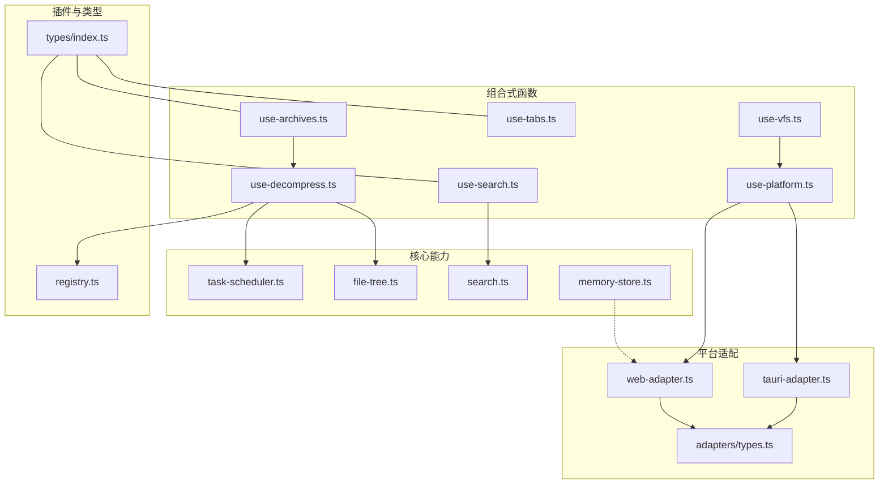
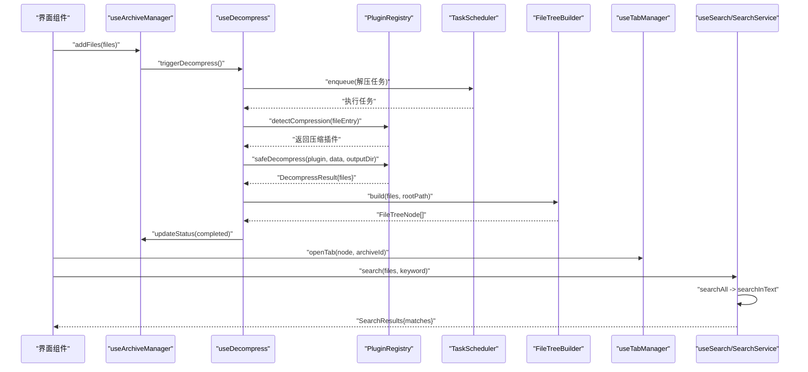
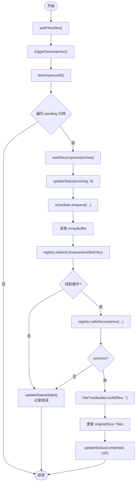
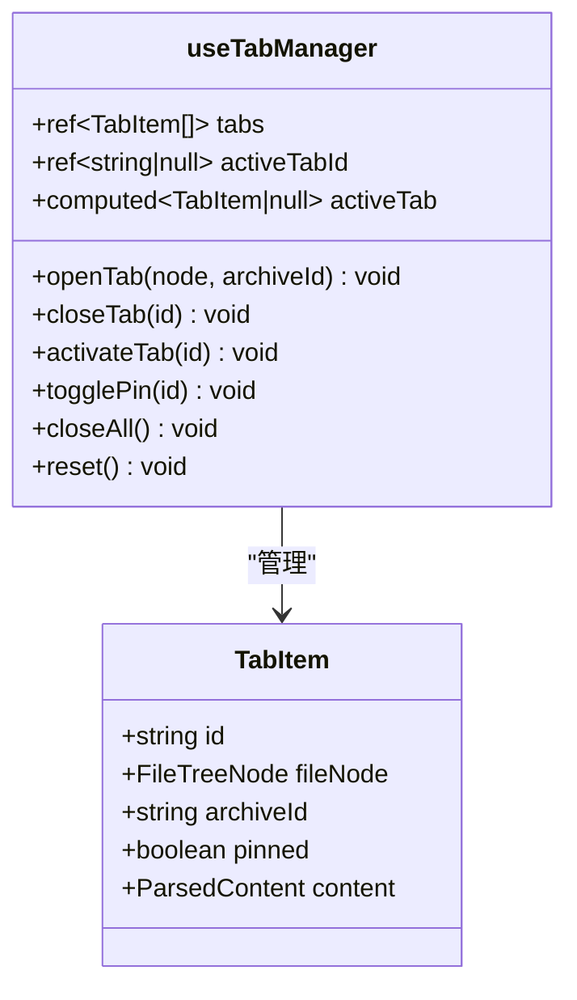
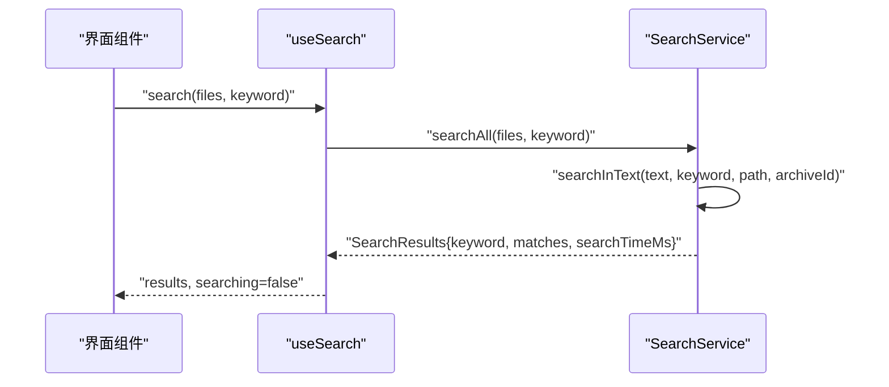
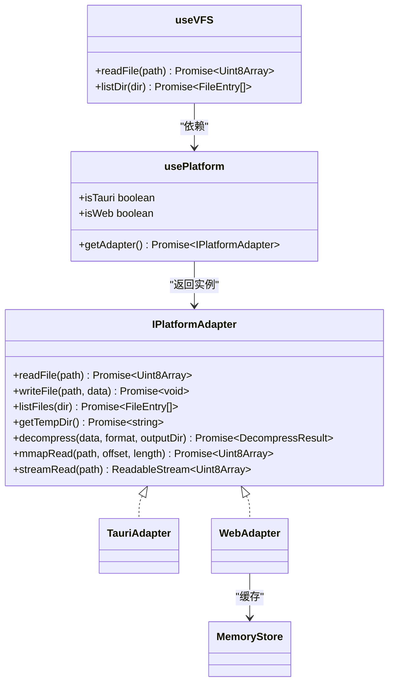
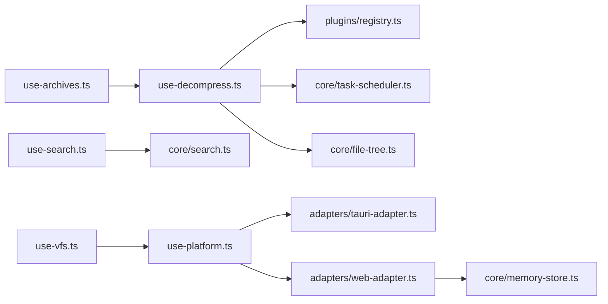

# 组合式函数数据逻辑

<cite>
**本文引用的文件**
- [use-archives.ts](file://src/composables/use-archives.ts)
- [use-decompress.ts](file://src/composables/use-decompress.ts)
- [use-tabs.ts](file://src/composables/use-tabs.ts)
- [use-search.ts](file://src/composables/use-search.ts)
- [use-vfs.ts](file://src/composables/use-vfs.ts)
- [use-platform.ts](file://src/composables/use-platform.ts)
- [tauri-adapter.ts](file://src/adapters/tauri-adapter.ts)
- [web-adapter.ts](file://src/adapters/web-adapter.ts)
- [types.ts](file://src/adapters/types.ts)
- [index.ts](file://src/types/index.ts)
- [file-tree.ts](file://src/core/file-tree.ts)
- [search.ts](file://src/core/search.ts)
- [task-scheduler.ts](file://src/core/task-scheduler.ts)
- [memory-store.ts](file://src/core/memory-store.ts)
- [registry.ts](file://src/plugins/registry.ts)
</cite>

## 目录
1. [引言](#引言)
2. [项目结构](#项目结构)
3. [核心组件](#核心组件)
4. [架构总览](#架构总览)
5. [详细组件分析](#详细组件分析)
6. [依赖关系分析](#依赖关系分析)
7. [性能考量](#性能考量)
8. [故障排查指南](#故障排查指南)
9. [结论](#结论)
10. [附录：使用示例与集成指南](#附录使用示例与集成指南)

## 引言
本文件聚焦 Hello-Tauri 项目中基于 Vue 3 Composition API 的数据逻辑封装，系统阐述 useArchives、useTabs、useSearch、useVFS 等组合函数的设计模式与实现细节。文档覆盖以下关键主题：
- 文件归档管理：上传、解压、树形结构构建的完整流程与状态流转
- 标签页管理系统：数据结构设计与多文件打开、切换、关闭的状态同步机制
- 全局搜索功能：索引构建、搜索算法与结果高亮的数据处理
- 虚拟文件系统（VFS）抽象层：路径解析、平台适配、缓存策略
- 组合函数复用模式与最佳实践：依赖注入、错误处理、并发控制与性能优化
- 实际使用示例与集成指南

## 项目结构
本项目采用“组合式函数 + 核心服务 + 插件注册 + 平台适配器”的分层组织方式：
- composables：组合式函数，封装业务状态与交互逻辑
- core：通用能力（任务调度、文件树构建、搜索、内存缓存）
- plugins：插件注册与超时保护
- adapters：平台适配（Tauri/Web），统一 I/O 接口
- types：跨模块共享类型定义

图表来源
- [use-archives.ts:1-60](file://src/composables/use-archives.ts#L1-L60)
- [use-decompress.ts:1-74](file://src/composables/use-decompress.ts#L1-L74)
- [use-tabs.ts:1-64](file://src/composables/use-tabs.ts#L1-L64)
- [use-search.ts:1-28](file://src/composables/use-search.ts#L1-L28)
- [use-vfs.ts:1-18](file://src/composables/use-vfs.ts#L1-L18)
- [use-platform.ts:1-25](file://src/composables/use-platform.ts#L1-L25)
- [tauri-adapter.ts:1-62](file://src/adapters/tauri-adapter.ts#L1-L62)
- [web-adapter.ts:1-73](file://src/adapters/web-adapter.ts#L1-L73)
- [types.ts:1-12](file://src/adapters/types.ts#L1-L12)
- [index.ts:1-71](file://src/types/index.ts#L1-L71)
- [file-tree.ts:1-69](file://src/core/file-tree.ts#L1-L69)
- [search.ts:1-49](file://src/core/search.ts#L1-L49)
- [task-scheduler.ts:1-79](file://src/core/task-scheduler.ts#L1-L79)
- [memory-store.ts:1-26](file://src/core/memory-store.ts#L1-L26)
- [registry.ts:1-118](file://src/plugins/registry.ts#L1-L118)

章节来源
- [README.md:71-127](file://README.md#L71-L127)

## 核心组件
本节对四个核心组合函数进行概览性说明，后续章节将展开深入分析。

- useArchiveManager（压缩包管理）
  - 职责：维护压缩包列表、添加/移除、更新状态与进度、统计信息
  - 关键点：通过动态导入触发解压；提供 stats 计算属性聚合指标
- useDecompress（解压管道）
  - 职责：读取文件、检测压缩插件、安全解压、构建文件树、更新归档状态
  - 关键点：TaskScheduler 控制并发；FileTreeBuilder 生成树；PluginRegistry 提供超时保护
- useTabManager（标签页管理）
  - 职责：打开/关闭/激活/置顶标签页，保持 activeTabId 与 tabs 同步
  - 关键点：避免重复打开同一节点；关闭时智能选择下一个活动标签
- useSearch（全局搜索）
  - 职责：调用 SearchService 执行全文搜索，暴露 results 与 searching 响应式状态
  - 关键点：支持按 archiveId 与 filePath 定位匹配项，便于前端高亮
- useVirtualFileSystem（VFS 抽象）
  - 职责：统一 readFile/listDir 接口，底层由 usePlatform 动态加载平台适配器
  - 关键点：Web 端支持 Range/mmap 与流式读取；Tauri 端通过 IPC 调用 Rust 命令

章节来源
- [use-archives.ts:1-60](file://src/composables/use-archives.ts#L1-L60)
- [use-decompress.ts:1-74](file://src/composables/use-decompress.ts#L1-L74)
- [use-tabs.ts:1-64](file://src/composables/use-tabs.ts#L1-L64)
- [use-search.ts:1-28](file://src/composables/use-search.ts#L1-L28)
- [use-vfs.ts:1-18](file://src/composables/use-vfs.ts#L1-L18)

## 架构总览
下图展示了从用户操作到数据落地的端到端流程，包括归档上传、解压、树构建、标签页打开与全局搜索。

图表来源
- [use-archives.ts:1-60](file://src/composables/use-archives.ts#L1-L60)
- [use-decompress.ts:1-74](file://src/composables/use-decompress.ts#L1-L74)
- [registry.ts:1-118](file://src/plugins/registry.ts#L1-L118)
- [task-scheduler.ts:1-79](file://src/core/task-scheduler.ts#L1-L79)
- [file-tree.ts:1-69](file://src/core/file-tree.ts#L1-L69)
- [use-tabs.ts:1-64](file://src/composables/use-tabs.ts#L1-L64)
- [use-search.ts:1-28](file://src/composables/use-search.ts#L1-L28)
- [search.ts:1-49](file://src/core/search.ts#L1-L49)

## 详细组件分析

### 压缩包管理与解压管线（useArchiveManager + useDecompress）
- 设计要点
  - 状态集中：archives 为全局 ref，配合 computed 的 stats 提供聚合视图
  - 异步编排：通过 TaskScheduler 限制并发，避免浏览器卡顿
  - 插件化：使用 PluginRegistry.detectCompression 与 safeDecompress 完成格式识别与超时保护
  - 树构建：FileTreeBuilder.build 将扁平 FileEntry[] 转换为层级 FileTreeNode[]
- 关键流程
  - addFiles → triggerDecompress → decompressAll → startDecompress
  - 读取 ArrayBuffer → 检测插件 → 安全解压 → 构建文件树 → 更新状态与统计
- 错误处理
  - 无可用插件或解压失败：标记 failed 并记录 error 消息
  - 队列满：直接标记 failed 并提示队列已满
  - 异常捕获：catch 分支统一设置 failed 与错误信息

图表来源
- [use-archives.ts:1-60](file://src/composables/use-archives.ts#L1-L60)
- [use-decompress.ts:1-74](file://src/composables/use-decompress.ts#L1-L74)
- [registry.ts:1-118](file://src/plugins/registry.ts#L1-L118)
- [task-scheduler.ts:1-79](file://src/core/task-scheduler.ts#L1-L79)
- [file-tree.ts:1-69](file://src/core/file-tree.ts#L1-L69)

章节来源
- [use-archives.ts:1-60](file://src/composables/use-archives.ts#L1-L60)
- [use-decompress.ts:1-74](file://src/composables/use-decompress.ts#L1-L74)
- [registry.ts:1-118](file://src/plugins/registry.ts#L1-L118)
- [task-scheduler.ts:1-79](file://src/core/task-scheduler.ts#L1-L79)
- [file-tree.ts:1-69](file://src/core/file-tree.ts#L1-L69)
- [index.ts:34-46](file://src/types/index.ts#L34-L46)

### 标签页管理（useTabManager）
- 数据结构
  - TabItem：包含唯一 id、关联的 FileTreeNode、所属 archiveId、是否固定、可选解析内容
  - activeTabId：当前活动标签标识
- 状态同步
  - openTab：若已存在相同 key+archiveId 则直接激活；否则创建新标签并设为活动
  - closeTab：删除后自动选择相邻标签作为活动；若无标签则清空活动
  - togglePin/closeAll：支持固定标签与批量关闭非固定标签
- 复杂度
  - 查找/插入/删除均为 O(n)，n 为标签数量；通常较小，满足交互需求

图表来源
- [use-tabs.ts:1-64](file://src/composables/use-tabs.ts#L1-L64)
- [index.ts:48-54](file://src/types/index.ts#L48-L54)

章节来源
- [use-tabs.ts:1-64](file://src/composables/use-tabs.ts#L1-L64)
- [index.ts:48-54](file://src/types/index.ts#L48-L54)

### 全局搜索（useSearch + SearchService）
- 索引与算法
  - 以文本行为单位逐行扫描，大小写不敏感匹配
  - 记录每个匹配的起始/结束位置，用于前端高亮
- 数据处理
  - searchAll 接收待搜索文件集合（含 archiveId、filePath、content），汇总所有匹配项
  - 返回 SearchResults，包含 keyword、matches 数组与耗时统计
- 组合式封装
  - useSearch 暴露 results 与 searching 响应式状态，简化组件使用

图表来源
- [use-search.ts:1-28](file://src/composables/use-search.ts#L1-L28)
- [search.ts:1-49](file://src/core/search.ts#L1-L49)
- [index.ts:56-70](file://src/types/index.ts#L56-L70)

章节来源
- [use-search.ts:1-28](file://src/composables/use-search.ts#L1-L28)
- [search.ts:1-49](file://src/core/search.ts#L1-L49)
- [index.ts:56-70](file://src/types/index.ts#L56-L70)

### 虚拟文件系统（useVFS + usePlatform + Adapters）
- 抽象层设计
  - useVFS 仅暴露 readFile/listDir，内部通过 usePlatform.getAdapter 获取具体实现
  - usePlatform 根据 __PLATFORM__ 动态懒加载 tauri-adapter 或 web-adapter
- 平台差异
  - WebAdapter：支持 fetch + Range 分块读取、ReadableStream 流式传输、内存缓存 memoryStore
  - TauriAdapter：通过 @tauri-apps/api invoke 调用 Rust 命令，实现本地文件读写、mmap 读取、解压等
- 权限与安全
  - 通过 IPlatformAdapter 统一接口约束能力边界；Web 模式下部分写入/解压能力不可用，抛出明确错误
- 缓存策略
  - WebAdapter 优先从 memoryStore 读取，命中则直接返回；未命中则发起网络请求并可选择缓存

图表来源
- [use-vfs.ts:1-18](file://src/composables/use-vfs.ts#L1-L18)
- [use-platform.ts:1-25](file://src/composables/use-platform.ts#L1-L25)
- [tauri-adapter.ts:1-62](file://src/adapters/tauri-adapter.ts#L1-L62)
- [web-adapter.ts:1-73](file://src/adapters/web-adapter.ts#L1-L73)
- [types.ts:1-12](file://src/adapters/types.ts#L1-L12)
- [memory-store.ts:1-26](file://src/core/memory-store.ts#L1-L26)

章节来源
- [use-vfs.ts:1-18](file://src/composables/use-vfs.ts#L1-L18)
- [use-platform.ts:1-25](file://src/composables/use-platform.ts#L1-L25)
- [tauri-adapter.ts:1-62](file://src/adapters/tauri-adapter.ts#L1-L62)
- [web-adapter.ts:1-73](file://src/adapters/web-adapter.ts#L1-L73)
- [types.ts:1-12](file://src/adapters/types.ts#L1-L12)
- [memory-store.ts:1-26](file://src/core/memory-store.ts#L1-L26)

## 依赖关系分析
- 低耦合高内聚
  - 组合式函数只关注状态与交互，核心算法下沉至 core 层
  - 平台差异通过适配器隔离，组合函数无需感知底层实现
- 外部依赖
  - Tauri IPC：仅在 TauriAdapter 中引入，运行时懒加载
  - fflate：在 README 中提及用于 Web 端 ZIP 回退（当前代码路径通过 PluginRegistry 与压缩插件扩展）
- 潜在循环依赖
  - 当前组合函数之间通过按需 import 或单例服务解耦，未发现显式循环引用

图表来源
- [use-archives.ts:1-60](file://src/composables/use-archives.ts#L1-L60)
- [use-decompress.ts:1-74](file://src/composables/use-decompress.ts#L1-L74)
- [registry.ts:1-118](file://src/plugins/registry.ts#L1-L118)
- [task-scheduler.ts:1-79](file://src/core/task-scheduler.ts#L1-L79)
- [file-tree.ts:1-69](file://src/core/file-tree.ts#L1-L69)
- [use-search.ts:1-28](file://src/composables/use-search.ts#L1-L28)
- [search.ts:1-49](file://src/core/search.ts#L1-L49)
- [use-vfs.ts:1-18](file://src/composables/use-vfs.ts#L1-L18)
- [use-platform.ts:1-25](file://src/composables/use-platform.ts#L1-L25)
- [tauri-adapter.ts:1-62](file://src/adapters/tauri-adapter.ts#L1-L62)
- [web-adapter.ts:1-73](file://src/adapters/web-adapter.ts#L1-L73)
- [memory-store.ts:1-26](file://src/core/memory-store.ts#L1-L26)

章节来源
- [use-archives.ts:1-60](file://src/composables/use-archives.ts#L1-L60)
- [use-decompress.ts:1-74](file://src/composables/use-decompress.ts#L1-L74)
- [use-search.ts:1-28](file://src/composables/use-search.ts#L1-L28)
- [use-vfs.ts:1-18](file://src/composables/use-vfs.ts#L1-L18)
- [use-platform.ts:1-25](file://src/composables/use-platform.ts#L1-L25)
- [tauri-adapter.ts:1-62](file://src/adapters/tauri-adapter.ts#L1-L62)
- [web-adapter.ts:1-73](file://src/adapters/web-adapter.ts#L1-L73)
- [memory-store.ts:1-26](file://src/core/memory-store.ts#L1-L26)

## 性能考量
- 并发控制
  - TaskScheduler 默认最大并发 3，队列上限 100，避免大量解压任务阻塞主线程
- 内存与缓存
  - WebAdapter 结合 memoryStore 减少重复网络请求；Range 请求降低大文件首屏压力
- 搜索优化
  - 当前为全量文本扫描，适合中小规模；未来可引入倒排索引或增量索引提升大规模检索性能
- 插件超时保护
  - PluginRegistry.safeDecompress/safeParse 内置 30 秒超时，防止长时间挂起影响用户体验

[本节为通用性能建议，不直接分析具体文件]

## 故障排查指南
- 解压失败
  - 现象：归档状态变为 failed，error 字段包含错误信息
  - 排查：确认压缩格式是否有对应插件；检查 safeDecompress 返回的错误字符串
- 队列已满
  - 现象：新增归档立即失败，提示队列已满
  - 排查：提高 TaskScheduler 并发或队列上限；分批提交任务
- Web 模式不支持写入/解压
  - 现象：调用 writeFile/decompress 抛出错误
  - 排查：切换到 Tauri 模式或使用 Web 兼容方案（如 WASM 解压）
- 搜索结果为空
  - 现象：results.matches 为空
  - 排查：确认传入 files 的 content 是否为文本；检查 keyword 大小写与编码一致性

章节来源
- [use-decompress.ts:1-74](file://src/composables/use-decompress.ts#L1-L74)
- [task-scheduler.ts:1-79](file://src/core/task-scheduler.ts#L1-L79)
- [web-adapter.ts:1-73](file://src/adapters/web-adapter.ts#L1-L73)
- [search.ts:1-49](file://src/core/search.ts#L1-L49)

## 结论
通过组合式函数将状态与逻辑解耦，配合核心服务与插件化架构，Hello-Tauri 实现了可扩展、可测试、跨平台的文件归档与搜索体验。useArchiveManager 与 useDecompress 协同完成解压流水线；useTabManager 提供稳定的标签页状态机；useSearch 封装了高效的文本匹配；useVFS 借助 usePlatform 与适配器屏蔽平台差异。整体设计遵循低耦合、高内聚原则，具备良好的可维护性与扩展性。

[本节为总结性内容，不直接分析具体文件]

## 附录：使用示例与集成指南
- 在组件中使用 useArchiveManager
  - 引入 useArchiveManager，调用 addFiles 传入 File[]，监听 archives 与 stats 变化
  - 参考路径：[use-archives.ts:1-60](file://src/composables/use-archives.ts#L1-L60)
- 在组件中使用 useDecompress
  - 引入 useDecompress，调用 decompressAll 启动所有 pending 归档的解压
  - 参考路径：[use-decompress.ts:1-74](file://src/composables/use-decompress.ts#L1-L74)
- 在组件中使用 useTabManager
  - 打开标签页：openTab(node, archiveId)
  - 关闭标签页：closeTab(id)
  - 切换活动标签：activateTab(id)
  - 参考路径：[use-tabs.ts:1-64](file://src/composables/use-tabs.ts#L1-L64)
- 在组件中使用 useSearch
  - 准备待搜索文件集合（含 archiveId、filePath、content），调用 search(keyword)
  - 渲染 results.matches 并进行高亮显示
  - 参考路径：[use-search.ts:1-28](file://src/composables/use-search.ts#L1-L28)、[search.ts:1-49](file://src/core/search.ts#L1-L49)
- 在组件中使用 useVFS
  - 读取文件：await readFile(path)
  - 列出目录：await listDir(dir)
  - 参考路径：[use-vfs.ts:1-18](file://src/composables/use-vfs.ts#L1-L18)

章节来源
- [use-archives.ts:1-60](file://src/composables/use-archives.ts#L1-L60)
- [use-decompress.ts:1-74](file://src/composables/use-decompress.ts#L1-L74)
- [use-tabs.ts:1-64](file://src/composables/use-tabs.ts#L1-L64)
- [use-search.ts:1-28](file://src/composables/use-search.ts#L1-L28)
- [search.ts:1-49](file://src/core/search.ts#L1-L49)
- [use-vfs.ts:1-18](file://src/composables/use-vfs.ts#L1-L18)