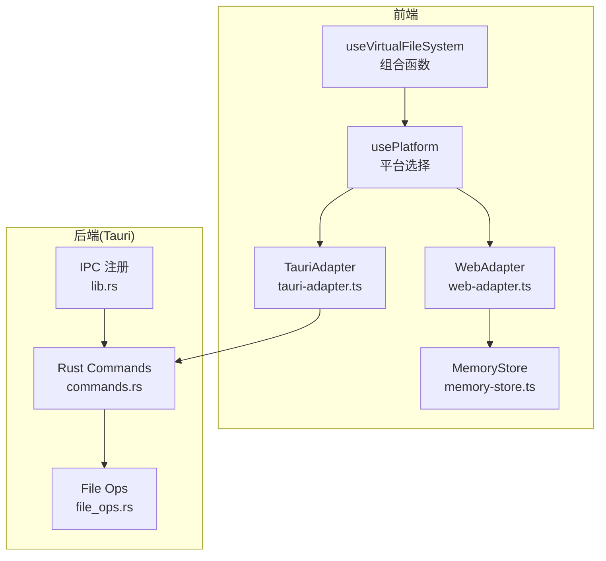
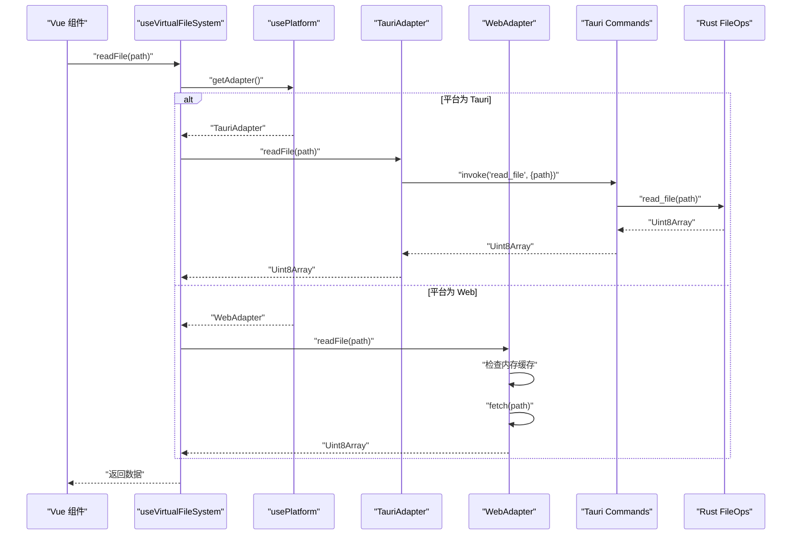
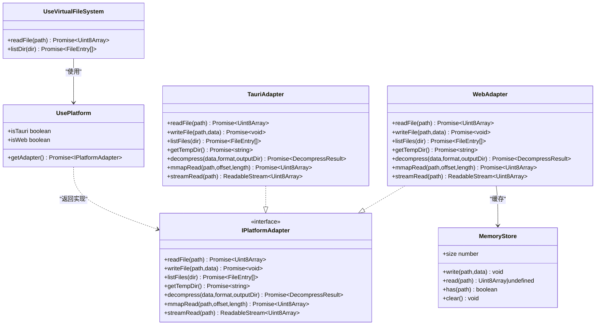

# 虚拟文件系统组合函数

<cite>
**本文引用的文件**   
- [use-vfs.ts](file://src/composables/use-vfs.ts)
- [use-platform.ts](file://src/composables/use-platform.ts)
- [tauri-adapter.ts](file://src/adapters/tauri-adapter.ts)
- [web-adapter.ts](file://src/adapters/web-adapter.ts)
- [types.ts](file://src/adapters/types.ts)
- [memory-store.ts](file://src/core/memory-store.ts)
- [index.ts](file://src/types/index.ts)
- [commands.rs](file://src-tauri/src/commands.rs)
- [file_ops.rs](file://src-tauri/src/file_ops.rs)
- [lib.rs](file://src-tauri/src/lib.rs)
</cite>

## 目录
1. [简介](#简介)
2. [项目结构](#项目结构)
3. [核心组件](#核心组件)
4. [架构总览](#架构总览)
5. [详细组件分析](#详细组件分析)
6. [依赖关系分析](#依赖关系分析)
7. [性能考量](#性能考量)
8. [故障排查指南](#故障排查指南)
9. [结论](#结论)
10. [附录：适配器开发指南与最佳实践](#附录适配器开发指南与最佳实践)

## 简介
本技术文档围绕 useVFS 组合函数及其配套的跨平台适配器体系，系统性阐述虚拟文件系统（VFS）抽象层的设计与实现。内容涵盖：
- 文件系统接口定义与适配器模式
- 跨平台兼容性策略（Tauri 与 Web）
- 路径解析与安全控制（相对路径、规范化、特殊字符处理）
- 权限控制与沙箱机制
- 缓存策略（内存缓存、磁盘映射读取、流式读取）
- 原子性与事务性保证现状与建议
- VFS 适配器的扩展指南与性能调优建议
- 使用示例与最佳实践

## 项目结构
本项目采用“组合函数 + 平台适配器”的解耦设计：
- 组合函数 useVirtualFileSystem 提供统一的 VFS API
- usePlatform 负责在运行时选择 Tauri 或 Web 适配器
- 具体适配器实现 IPlatformAdapter 接口，屏蔽底层差异
- Tauri 侧通过 IPC 调用 Rust 命令进行真实文件系统操作
- Web 侧基于 fetch 与内存缓存模拟只读访问

图表来源
- [use-vfs.ts:1-18](file://src/composables/use-vfs.ts#L1-L18)
- [use-platform.ts:1-25](file://src/composables/use-platform.ts#L1-L25)
- [tauri-adapter.ts:1-62](file://src/adapters/tauri-adapter.ts#L1-L62)
- [web-adapter.ts:1-73](file://src/adapters/web-adapter.ts#L1-L73)
- [memory-store.ts:1-26](file://src/core/memory-store.ts#L1-L26)
- [commands.rs:1-35](file://src-tauri/src/commands.rs#L1-L35)
- [file_ops.rs:1-87](file://src-tauri/src/file_ops.rs#L1-L87)
- [lib.rs:1-19](file://src-tauri/src/lib.rs#L1-L19)

章节来源
- [use-vfs.ts:1-18](file://src/composables/use-vfs.ts#L1-L18)
- [use-platform.ts:1-25](file://src/composables/use-platform.ts#L1-L25)
- [tauri-adapter.ts:1-62](file://src/adapters/tauri-adapter.ts#L1-L62)
- [web-adapter.ts:1-73](file://src/adapters/web-adapter.ts#L1-L73)
- [memory-store.ts:1-26](file://src/core/memory-store.ts#L1-L26)
- [commands.rs:1-35](file://src-tauri/src/commands.rs#L1-L35)
- [file_ops.rs:1-87](file://src-tauri/src/file_ops.rs#L1-L87)
- [lib.rs:1-19](file://src-tauri/src/lib.rs#L1-L19)

## 核心组件
- 组合函数 useVirtualFileSystem：对外暴露 readFile、listDir 等统一方法，内部委托给当前平台的适配器。
- 平台选择 usePlatform：根据 __PLATFORM__ 常量动态加载 Tauri 或 Web 适配器，并缓存实例。
- 平台适配器接口 IPlatformAdapter：定义跨平台一致的文件系统能力契约。
- TauriAdapter：通过 @tauri-apps/api/core.invoke 调用 Rust 命令，实现读写、列表、mmap 读取、解压等。
- WebAdapter：基于 fetch 实现只读访问，结合 MemoryStore 做内存缓存；部分写操作显式抛错以表明不支持。
- MemoryStore：进程内 Map 存储，用于 Web 环境下的内存缓存。
- Rust 命令与文件操作：commands.rs 暴露 IPC 命令，file_ops.rs 提供 mmap 读取与递归目录遍历。

章节来源
- [use-vfs.ts:1-18](file://src/composables/use-vfs.ts#L1-L18)
- [use-platform.ts:1-25](file://src/composables/use-platform.ts#L1-L25)
- [types.ts:1-12](file://src/adapters/types.ts#L1-L12)
- [tauri-adapter.ts:1-62](file://src/adapters/tauri-adapter.ts#L1-L62)
- [web-adapter.ts:1-73](file://src/adapters/web-adapter.ts#L1-L73)
- [memory-store.ts:1-26](file://src/core/memory-store.ts#L1-L26)
- [commands.rs:1-35](file://src-tauri/src/commands.rs#L1-L35)
- [file_ops.rs:1-87](file://src-tauri/src/file_ops.rs#L1-L87)

## 架构总览
下图展示了从组合函数到平台适配再到后端命令的完整调用链。

图表来源
- [use-vfs.ts:1-18](file://src/composables/use-vfs.ts#L1-L18)
- [use-platform.ts:1-25](file://src/composables/use-platform.ts#L1-L25)
- [tauri-adapter.ts:1-62](file://src/adapters/tauri-adapter.ts#L1-L62)
- [web-adapter.ts:1-73](file://src/adapters/web-adapter.ts#L1-L73)
- [commands.rs:1-35](file://src-tauri/src/commands.rs#L1-L35)
- [file_ops.rs:1-87](file://src-tauri/src/file_ops.rs#L1-L87)

## 详细组件分析

### 组合函数 useVirtualFileSystem
- 职责：封装平台无关的 VFS 调用入口，向上提供稳定 API。
- 关键行为：
  - 通过 usePlatform.getAdapter() 获取当前平台适配器
  - 将 readFile、listDir 等方法转发至适配器对应实现
- 扩展点：可在此处增加路径规范化、权限校验、重试与超时等横切逻辑。

章节来源
- [use-vfs.ts:1-18](file://src/composables/use-vfs.ts#L1-L18)
- [use-platform.ts:1-25](file://src/composables/use-platform.ts#L1-L25)

### 平台选择 usePlatform
- 职责：根据编译期常量 __PLATFORM__ 决定加载哪个适配器，并对适配器实例进行缓存，避免重复 import。
- 关键点：
  - 首次调用时按需动态导入模块
  - 暴露 isTauri/isWeb 布尔标志供上层判断

章节来源
- [use-platform.ts:1-25](file://src/composables/use-platform.ts#L1-L25)

### 适配器接口 IPlatformAdapter
- 定义的能力：
  - 读取：readFile、mmapRead、streamRead
  - 写入：writeFile
  - 目录：listFiles
  - 工具：getTempDir、decompress
- 类型约定：
  - 文件条目类型 FileEntry 与解压结果 DecompressResult 来自公共类型定义

章节来源
- [types.ts:1-12](file://src/adapters/types.ts#L1-L12)
- [index.ts:1-71](file://src/types/index.ts#L1-L71)

### TauriAdapter
- 读取流程：
  - 通过 invoke('read_file', { path }) 调用 Rust 命令
  - 将返回的字节数组包装为 Uint8Array
- 写入流程：
  - 通过 invoke('write_file', { path, data }) 写入
- 目录枚举：
  - 通过 invoke('list_files', { dir }) 获取递归目录项
- 临时目录：
  - 通过 invoke('get_temp_dir') 获取系统临时目录
- 大文件优化：
  - mmapRead 支持按偏移和长度读取，减少全量拷贝
- 流式读取：
  - streamRead 在当前实现中为“全量读取后包装为 ReadableStream”，注释指出后续可通过事件或插件实现分块传输

章节来源
- [tauri-adapter.ts:1-62](file://src/adapters/tauri-adapter.ts#L1-L62)
- [commands.rs:1-35](file://src-tauri/src/commands.rs#L1-L35)
- [file_ops.rs:1-87](file://src-tauri/src/file_ops.rs#L1-L87)

### WebAdapter
- 读取流程：
  - 优先从 MemoryStore 命中缓存，未命中则 fetch(path)
  - 错误时抛出 HTTP 状态相关错误
- 写入与目录枚举：
  - 明确抛出“不支持”的错误，体现 Web 环境的只读约束
- 临时目录：
  - 返回固定占位路径
- 大文件优化：
  - mmapRead 利用 Range 请求实现范围读取，并结合内存缓存
- 流式读取：
  - 若命中缓存直接推送一次数据
  - 否则使用 response.body.getReader() 逐块推送到 ReadableStream

章节来源
- [web-adapter.ts:1-73](file://src/adapters/web-adapter.ts#L1-L73)
- [memory-store.ts:1-26](file://src/core/memory-store.ts#L1-L26)

### Rust 命令与文件操作
- 安全限制：
  - read_file 命令对包含 ".." 的路径拒绝，防止路径穿越
- 文件操作：
  - write_file 直接写入
  - list_files 递归遍历目录，返回扁平化文件元信息
  - mmap_read 使用内存映射高效读取指定区间
- IPC 注册：
  - lib.rs 集中注册所有可用命令

章节来源
- [commands.rs:1-35](file://src-tauri/src/commands.rs#L1-L35)
- [file_ops.rs:1-87](file://src-tauri/src/file_ops.rs#L1-L87)
- [lib.rs:1-19](file://src-tauri/src/lib.rs#L1-L19)

## 依赖关系分析
- 组合函数依赖 usePlatform，usePlatform 依赖适配器模块
- TauriAdapter 依赖 @tauri-apps/api/core.invoke 与 Rust 命令
- WebAdapter 依赖浏览器 fetch 与 MemoryStore
- Rust 命令依赖 file_ops 提供的底层 IO 能力

图表来源
- [use-vfs.ts:1-18](file://src/composables/use-vfs.ts#L1-L18)
- [use-platform.ts:1-25](file://src/composables/use-platform.ts#L1-L25)
- [types.ts:1-12](file://src/adapters/types.ts#L1-L12)
- [tauri-adapter.ts:1-62](file://src/adapters/tauri-adapter.ts#L1-L62)
- [web-adapter.ts:1-73](file://src/adapters/web-adapter.ts#L1-L73)
- [memory-store.ts:1-26](file://src/core/memory-store.ts#L1-L26)

章节来源
- [use-vfs.ts:1-18](file://src/composables/use-vfs.ts#L1-L18)
- [use-platform.ts:1-25](file://src/composables/use-platform.ts#L1-L25)
- [types.ts:1-12](file://src/adapters/types.ts#L1-L12)
- [tauri-adapter.ts:1-62](file://src/adapters/tauri-adapter.ts#L1-L62)
- [web-adapter.ts:1-73](file://src/adapters/web-adapter.ts#L1-L73)
- [memory-store.ts:1-26](file://src/core/memory-store.ts#L1-L26)

## 性能考量
- 大文件读取
  - Tauri 端 mmapRead 通过内存映射避免整文件拷贝，适合随机片段读取
  - Web 端 mmapRead 使用 Range 请求，仅拉取所需字节段
- 流式读取
  - Web 端 streamRead 使用 ReadableStream 逐块推送，降低峰值内存占用
  - Tauri 端当前实现为“全量读取后包装为 ReadableStream”，存在一次性内存峰值风险；后续可考虑事件驱动的分块传输
- 缓存策略
  - Web 端 MemoryStore 提供进程内缓存，可显著减少重复网络请求
  - 建议引入 LRU/TTL 策略与容量上限，避免内存泄漏
- 并发与背压
  - 大量并发读取时应考虑限流与队列，避免阻塞主线程
- 序列化开销
  - Tauri 端二进制数据在 IPC 层需进行 ArrayBuffer/number[] 转换，注意在大对象时的序列化成本

[本节为通用性能讨论，不直接分析具体文件]

## 故障排查指南
- 常见错误来源
  - Web 端 fetch 失败：检查网络可达性与 CORS 配置
  - Web 端 Range 请求失败：确认服务端支持 Range 头
  - Tauri 端路径穿越拦截：确保传入路径不包含 ".."
  - 写入/列表在 Web 端不可用：这是预期行为，应改用 Tauri 环境
- 定位步骤
  - 在组合函数入口处打印路径与平台标识
  - 在适配器层捕获并记录异常堆栈
  - 在 Rust 命令层查看 AppError 的具体原因
- 恢复策略
  - 对网络请求增加重试与退避
  - 对超大文件优先使用 mmapRead/streamRead
  - 对缓存命中失败降级回原始读取

章节来源
- [web-adapter.ts:1-73](file://src/adapters/web-adapter.ts#L1-L73)
- [tauri-adapter.ts:1-62](file://src/adapters/tauri-adapter.ts#L1-L62)
- [commands.rs:1-35](file://src-tauri/src/commands.rs#L1-L35)

## 结论
useVFS 组合函数通过适配器模式实现了跨平台文件系统的统一抽象，结合 usePlatform 的动态加载机制，使同一套业务代码可在 Tauri 与 Web 环境下运行。Tauri 适配器具备完整的读写、目录枚举、mmap 与解压能力；Web 适配器提供只读访问与内存缓存，满足预览场景。当前实现已具备较好的可扩展性与性能基础，建议在路径规范化、权限控制、缓存失效与原子性方面进一步增强，以满足更严格的安全与一致性要求。

[本节为总结性内容，不直接分析具体文件]

## 附录：适配器开发指南与最佳实践

### 自定义适配器实现要点
- 遵循 IPlatformAdapter 接口，确保所有方法签名与语义一致
- 对于不支持的操作，抛出明确的错误信息，便于上层区分“未实现”与“运行时错误”
- 保持返回值类型一致（如 Uint8Array、FileEntry[]），避免上层出现类型不一致

章节来源
- [types.ts:1-12](file://src/adapters/types.ts#L1-L12)
- [index.ts:1-71](file://src/types/index.ts#L1-L71)

### 路径解析与规范化
- 相对路径处理
  - 建议在组合函数层统一将相对路径转换为绝对路径，再下发至适配器
- 路径规范化
  - 去除多余分隔符、合并 ".." 与 "." 节点，避免产生非法路径
- 特殊字符转义
  - 针对平台差异（Windows 反斜杠、URL 编码等）进行统一处理
- 安全校验
  - 禁止路径穿越（如包含 ".."）、白名单根目录校验、敏感路径过滤

章节来源
- [commands.rs:1-35](file://src-tauri/src/commands.rs#L1-L35)

### 权限控制与安全沙箱
- 读取权限验证
  - 在组合函数或适配器层校验目标路径是否在允许范围内
- 写入保护
  - 对写操作实施二次确认与最小权限原则，限制可写目录
- 沙箱机制
  - 在 Tauri 端通过白名单与路径前缀校验限制访问范围
  - 在 Web 端通过只读模式与 CSP 策略限制资源访问

章节来源
- [commands.rs:1-35](file://src-tauri/src/commands.rs#L1-L35)

### 缓存策略与失效
- 内存缓存
  - 使用 MemoryStore 作为 LRU/TTL 缓存，设置最大容量与单条大小上限
- 磁盘缓存
  - 在 Tauri 端可将热点文件持久化到 getTempDir 指向的目录
- 失效策略
  - 基于时间戳、文件大小变化或版本号触发失效
  - 提供 clear 与 has 接口以便监控与调试

章节来源
- [memory-store.ts:1-26](file://src/core/memory-store.ts#L1-L26)
- [web-adapter.ts:1-73](file://src/adapters/web-adapter.ts#L1-L73)

### 原子性与事务性
- 现状
  - 当前实现未提供显式的原子写入与事务回滚机制
- 建议方案
  - 先写入临时文件，校验成功后原子重命名替换
  - 提供事务 API：begin/commit/rollback，中间过程落盘快照，失败时回滚
  - 错误恢复：记录操作日志，支持断点续写与幂等提交

[本节为通用设计与建议，不直接分析具体文件]

### 监控与可观测性
- 指标采集
  - 记录各操作的耗时、命中率、错误率、缓存大小
- 日志上报
  - 在组合函数与适配器层埋点，输出结构化日志
- 告警规则
  - 对高延迟、高错误率、缓存命中率过低等情况设置阈值告警

[本节为通用建议，不直接分析具体文件]

### 实际使用示例与最佳实践
- 基本用法
  - 在 Vue 组件中引入 useVirtualFileSystem，调用 readFile 与 listDir
- 大文件读取
  - 优先使用 mmapRead 或 streamRead，避免一次性加载整个文件
- 错误处理
  - 对网络与 IO 错误进行分类处理，提示用户友好信息
- 平台切换
  - 通过 __PLATFORM__ 常量切换运行环境，无需修改业务代码

章节来源
- [use-vfs.ts:1-18](file://src/composables/use-vfs.ts#L1-L18)
- [use-platform.ts:1-25](file://src/composables/use-platform.ts#L1-L25)
- [tauri-adapter.ts:1-62](file://src/adapters/tauri-adapter.ts#L1-L62)
- [web-adapter.ts:1-73](file://src/adapters/web-adapter.ts#L1-L73)