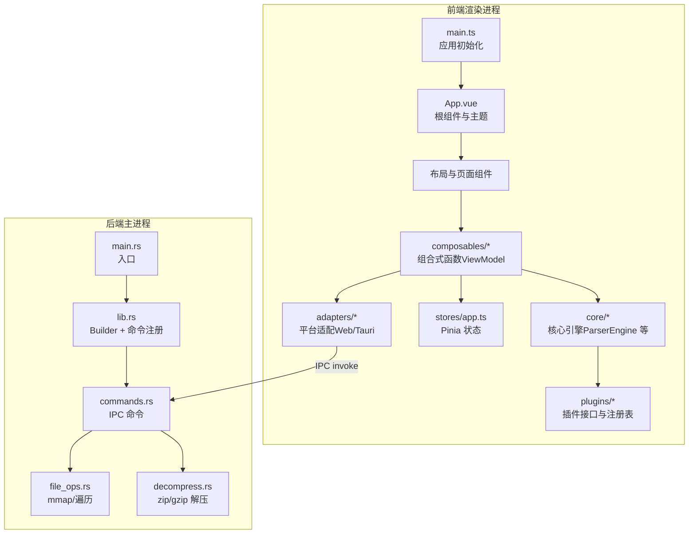
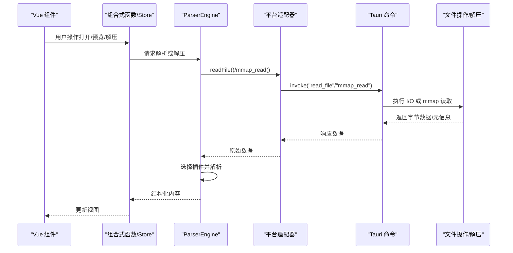
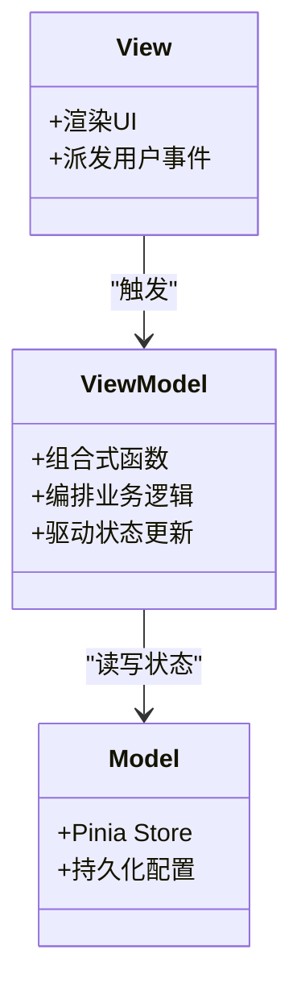
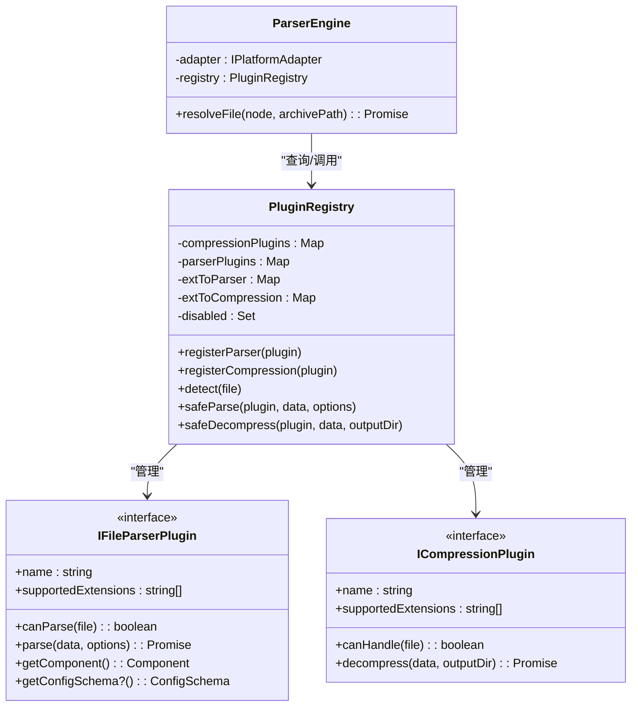
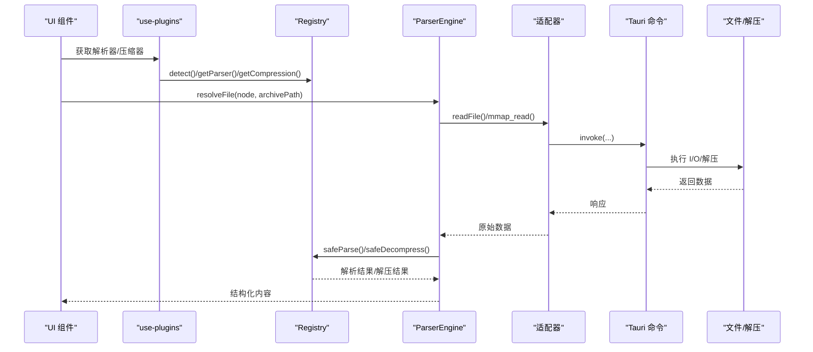
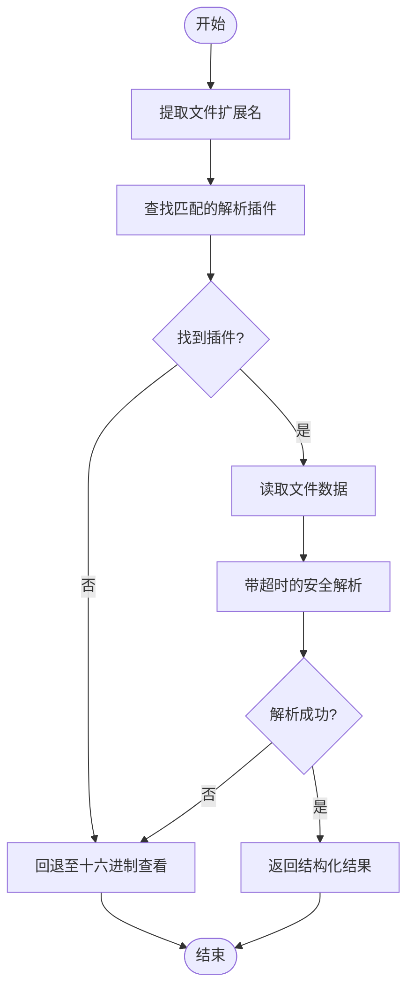
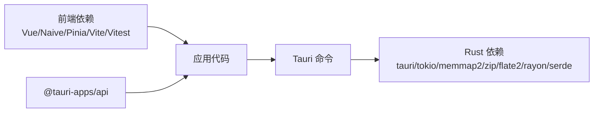

# 整体架构概览

<cite>
**本文引用的文件**   
- [README.md](file://README.md)
- [package.json](file://package.json)
- [src/main.ts](file://src/main.ts)
- [src/App.vue](file://src/App.vue)
- [src-tauri/src/lib.rs](file://src-tauri/src/lib.rs)
- [src-tauri/src/main.rs](file://src-tauri/src/main.rs)
- [src-tauri/src/commands.rs](file://src-tauri/src/commands.rs)
- [src-tauri/src/file_ops.rs](file://src-tauri/src/file_ops.rs)
- [src-tauri/src/decompress.rs](file://src-tauri/src/decompress.rs)
- [src/plugins/types.ts](file://src/plugins/types.ts)
- [src/plugins/registry.ts](file://src/plugins/registry.ts)
- [src/plugins/manifest.ts](file://src/plugins/manifest.ts)
- [src/composables/use-plugins.ts](file://src/composables/use-plugins.ts)
- [src/core/parser-engine.ts](file://src/core/parser-engine.ts)
</cite>

## 目录
1. [简介](#简介)
2. [项目结构](#项目结构)
3. [核心组件](#核心组件)
4. [架构总览](#架构总览)
5. [详细组件分析](#详细组件分析)
6. [依赖关系分析](#依赖关系分析)
7. [性能考量](#性能考量)
8. [故障排查指南](#故障排查指南)
9. [结论](#结论)
10. [附录](#附录)

## 简介
Hello-Tauri 是一个基于 Tauri 2.0 的跨平台桌面应用，采用“前端渲染进程（Vue 3）+ 原生主进程（Rust）”的双端架构。前端负责 UI 与交互逻辑，通过插件化机制扩展解析与压缩能力；后端提供文件系统、内存映射读取与解压等高性能能力。应用遵循 MVVM 模式：视图层由 Vue 组件构成，模型层由 Pinia Store 管理状态，组合式函数作为 ViewModel 桥接业务逻辑与数据持久化。

技术选型权衡要点：
- 选择 Tauri 而非 Electron：更小的二进制体积、更低内存占用、更好的启动性能；同时保留 Web 生态的前端开发体验。
- 使用 Rust 作为后端：在 I/O、并发与安全性方面具备优势，适合大文件处理、零拷贝读取与高吞吐解压场景。

章节来源
- [README.md:1-140](file://README.md#L1-L140)
- [package.json:1-42](file://package.json#L1-L42)

## 项目结构
项目分为前后端两大模块：
- 前端 src：包含组件、组合式函数、插件系统、核心引擎与适配器。
- 后端 src-tauri：Tauri 应用入口、命令注册、文件操作与解压实现。

图表来源
- [src/main.ts:1-8](file://src/main.ts#L1-L8)
- [src/App.vue:1-24](file://src/App.vue#L1-L24)
- [src-tauri/src/main.rs:1-4](file://src-tauri/src/main.rs#L1-L4)
- [src-tauri/src/lib.rs:1-19](file://src-tauri/src/lib.rs#L1-L19)
- [src-tauri/src/commands.rs:1-53](file://src-tauri/src/commands.rs#L1-L53)
- [src-tauri/src/file_ops.rs:1-88](file://src-tauri/src/file_ops.rs#L1-L88)
- [src-tauri/src/decompress.rs:1-83](file://src-tauri/src/decompress.rs#L1-L83)

章节来源
- [README.md:71-127](file://README.md#L71-L127)

## 核心组件
- 前端入口与根组件
  - main.ts：创建 Vue 应用并挂载 Pinia。
  - App.vue：配置 Naive UI 主题与全局错误边界，挂载布局。
- 后端入口与命令
  - main.rs：调用 lib::run 启动 Tauri。
  - lib.rs：注册 IPC 命令（read_file、write_file、get_temp_dir、mmap_read、list_files、decompress）。
- 文件与解压
  - file_ops.rs：mmap 零拷贝读取与递归目录遍历。
  - decompress.rs：zip/gzip 解压实现。
- 插件系统与解析引擎
  - plugins/types.ts：定义解析器与压缩插件接口。
  - plugins/registry.ts：插件注册、检测、超时保护与启用/禁用。
  - plugins/manifest.ts：内置插件注册入口。
  - composables/use-plugins.ts：暴露单例 registry 与便捷方法。
  - core/parser-engine.ts：根据文件扩展名选择插件并安全解析。

章节来源
- [src/main.ts:1-8](file://src/main.ts#L1-L8)
- [src/App.vue:1-24](file://src/App.vue#L1-L24)
- [src-tauri/src/main.rs:1-4](file://src-tauri/src/main.rs#L1-L4)
- [src-tauri/src/lib.rs:1-19](file://src-tauri/src/lib.rs#L1-L19)
- [src-tauri/src/commands.rs:1-53](file://src-tauri/src/commands.rs#L1-L53)
- [src-tauri/src/file_ops.rs:1-88](file://src-tauri/src/file_ops.rs#L1-L88)
- [src-tauri/src/decompress.rs:1-83](file://src-tauri/src/decompress.rs#L1-L83)
- [src/plugins/types.ts:1-37](file://src/plugins/types.ts#L1-L37)
- [src/plugins/registry.ts:1-118](file://src/plugins/registry.ts#L1-L118)
- [src/plugins/manifest.ts:1-20](file://src/plugins/manifest.ts#L1-L20)
- [src/composables/use-plugins.ts:1-17](file://src/composables/use-plugins.ts#L1-L17)
- [src/core/parser-engine.ts:1-35](file://src/core/parser-engine.ts#L1-L35)

## 架构总览
下图展示前后端职责分离与关键数据流：前端通过适配器调用 Tauri 命令，后端执行 I/O 与解压，结果返回给前端进行渲染。

图表来源
- [src/core/parser-engine.ts:1-35](file://src/core/parser-engine.ts#L1-L35)
- [src-tauri/src/commands.rs:1-53](file://src-tauri/src/commands.rs#L1-L53)
- [src-tauri/src/file_ops.rs:1-88](file://src-tauri/src/file_ops.rs#L1-L88)
- [src-tauri/src/decompress.rs:1-83](file://src-tauri/src/decompress.rs#L1-L83)

## 详细组件分析

### 前端渲染进程（Vue 3）
- 职责
  - 视图渲染与用户交互（组件层）。
  - 业务编排与状态同步（组合式函数层）。
  - 状态管理与持久化（Pinia Store）。
- 关键点
  - 根组件统一主题与错误边界，提升可维护性与健壮性。
  - 组合式函数封装复杂逻辑，避免组件臃肿。
  - Store 集中管理主题、面板宽度、插件禁用等全局状态。

章节来源
- [src/App.vue:1-24](file://src/App.vue#L1-L24)
- [src/main.ts:1-8](file://src/main.ts#L1-L8)

### 原生主进程（Rust）
- 职责
  - 暴露 IPC 命令供前端调用。
  - 执行高性能 I/O、内存映射读取与解压。
- 关键点
  - 命令注册集中在 Builder，便于权限控制与扩展。
  - 路径穿越防护与安全校验。
  - 解压结果以统一结构返回，便于前端消费。

章节来源
- [src-tauri/src/lib.rs:1-19](file://src-tauri/src/lib.rs#L1-L19)
- [src-tauri/src/commands.rs:1-53](file://src-tauri/src/commands.rs#L1-L53)
- [src-tauri/src/file_ops.rs:1-88](file://src-tauri/src/file_ops.rs#L1-L88)
- [src-tauri/src/decompress.rs:1-83](file://src-tauri/src/decompress.rs#L1-L83)

### MVVM 架构实现
- 视图层（View）
  - Vue 组件负责展示与事件派发。
- 模型层（Model）
  - Pinia Store 管理应用级状态与持久化。
- 视图模型层（ViewModel）
  - 组合式函数协调业务逻辑、调用核心引擎与适配器，驱动状态变更。

[本图为概念图，不直接映射具体源码文件]

### 插件化架构与策略模式
- 设计理念
  - 通过统一接口将“解析/压缩”能力抽象为插件，按扩展名动态匹配策略。
  - 注册表集中管理插件生命周期（注册、检测、启用/禁用、超时保护）。
- 可扩展的文件处理机制
  - 新增解析器：实现 IFileParserPlugin 接口，并在 manifest 中注册。
  - 新增压缩器：实现 ICompressionPlugin 接口，并在 manifest 中注册。
  - 解析引擎根据扩展名选择对应插件，失败时回退到十六进制查看。

图表来源
- [src/plugins/registry.ts:1-118](file://src/plugins/registry.ts#L1-L118)
- [src/plugins/types.ts:1-37](file://src/plugins/types.ts#L1-L37)
- [src/core/parser-engine.ts:1-35](file://src/core/parser-engine.ts#L1-L35)

章节来源
- [src/plugins/types.ts:1-37](file://src/plugins/types.ts#L1-L37)
- [src/plugins/registry.ts:1-118](file://src/plugins/registry.ts#L1-L118)
- [src/plugins/manifest.ts:1-20](file://src/plugins/manifest.ts#L1-L20)
- [src/composables/use-plugins.ts:1-17](file://src/composables/use-plugins.ts#L1-L17)
- [src/core/parser-engine.ts:1-35](file://src/core/parser-engine.ts#L1-L35)

### 解析流程时序

图表来源
- [src/composables/use-plugins.ts:1-17](file://src/composables/use-plugins.ts#L1-L17)
- [src/plugins/registry.ts:1-118](file://src/plugins/registry.ts#L1-L118)
- [src/core/parser-engine.ts:1-35](file://src/core/parser-engine.ts#L1-L35)
- [src-tauri/src/commands.rs:1-53](file://src-tauri/src/commands.rs#L1-L53)
- [src-tauri/src/file_ops.rs:1-88](file://src-tauri/src/file_ops.rs#L1-L88)
- [src-tauri/src/decompress.rs:1-83](file://src-tauri/src/decompress.rs#L1-L83)

### 复杂逻辑流程图（安全解析）

图表来源
- [src/core/parser-engine.ts:1-35](file://src/core/parser-engine.ts#L1-L35)
- [src/plugins/registry.ts:1-118](file://src/plugins/registry.ts#L1-L118)

## 依赖关系分析
- 前端依赖
  - Vue 3、Naive UI、Pinia、@vueuse/core、splitpanes、拖拽库等。
  - @tauri-apps/api 用于 IPC 调用。
- 后端依赖
  - tauri、tokio、memmap2、zip、flate2、rayon、serde、thiserror 等。

图表来源
- [package.json:1-42](file://package.json#L1-L42)
- [src-tauri/Cargo.toml:1-19](file://src-tauri/Cargo.toml#L1-L19)

章节来源
- [package.json:1-42](file://package.json#L1-L42)
- [src-tauri/Cargo.toml:1-19](file://src-tauri/Cargo.toml#L1-L19)

## 性能考量
- 大文件友好
  - 使用 mmap 零拷贝读取，减少内存拷贝与 GC 压力。
  - 虚拟滚动与分页加载，降低首屏渲染开销。
- 并发与队列
  - 任务调度器控制解压并发数，支持队列与重试，避免资源争用。
- 插件超时保护
  - 解析/解压过程设置超时，防止阻塞主线程。

章节来源
- [src-tauri/src/file_ops.rs:1-88](file://src-tauri/src/file_ops.rs#L1-L88)
- [src/plugins/registry.ts:1-118](file://src/plugins/registry.ts#L1-L118)
- [README.md:44-49](file://README.md#L44-L49)

## 故障排查指南
- 常见错误类型
  - I/O 错误：路径不存在、权限不足、范围越界。
  - 解压错误：格式不支持、压缩包损坏。
  - 插件错误：解析超时、未知异常。
- 定位建议
  - 检查 Tauri 命令返回值与错误枚举。
  - 确认插件是否被禁用或超时。
  - 验证输入路径与扩展名匹配。

章节来源
- [src-tauri/src/commands.rs:1-53](file://src-tauri/src/commands.rs#L1-L53)
- [src-tauri/src/file_ops.rs:1-88](file://src-tauri/src/file_ops.rs#L1-L88)
- [src-tauri/src/decompress.rs:1-83](file://src-tauri/src/decompress.rs#L1-L83)
- [src/plugins/registry.ts:1-118](file://src/plugins/registry.ts#L1-L118)

## 结论
本项目通过清晰的职责分离与插件化设计，实现了高性能、可扩展的日志解析工具。前端以 Vue 3 与组合式函数构建灵活 UI，后端以 Rust 提供稳定高效的 I/O 与解压能力。MVVM 模式使状态与逻辑解耦，插件系统通过策略模式实现可扩展的文件处理机制。整体架构兼顾性能与可维护性，适合持续演进与功能扩展。

## 附录
- 快速开始与脚本说明见 README。
- 架构设计与实现计划详见 docs/superpowers 目录。

章节来源
- [README.md:51-69](file://README.md#L51-L69)
- [README.md:129-136](file://README.md#L129-L136)