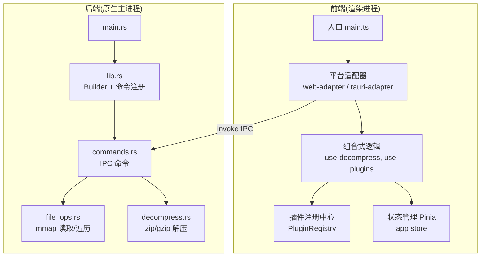
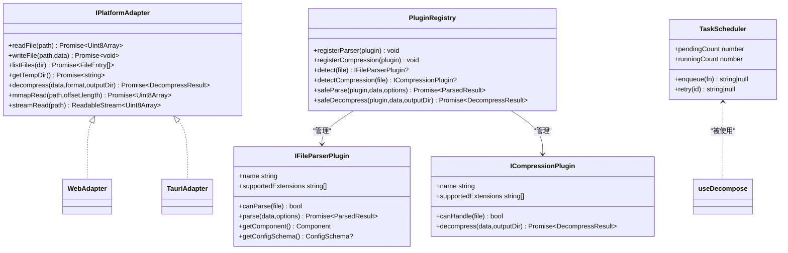
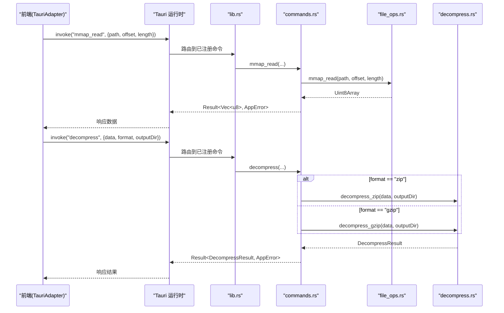
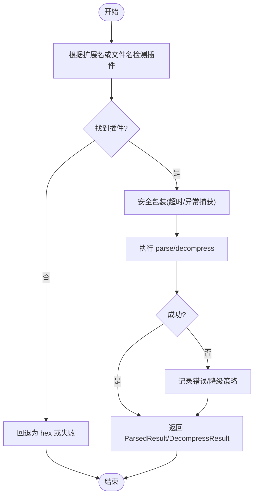
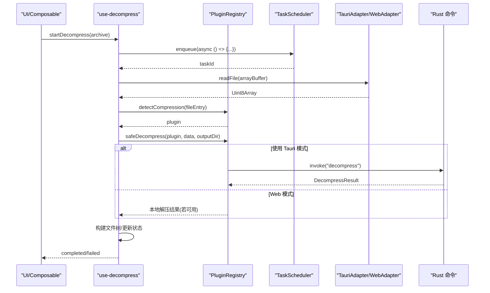
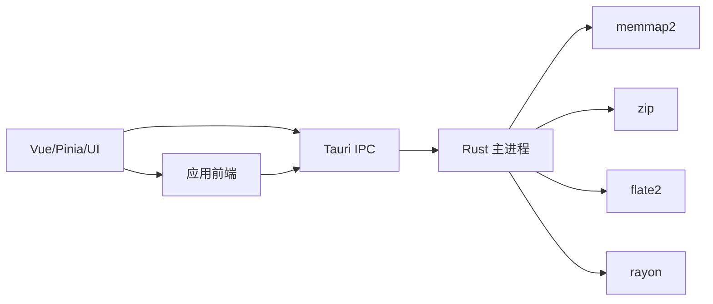

# 架构设计

<cite>
**本文引用的文件**   
- [README.md](file://README.md)
- [package.json](file://package.json)
- [src/main.ts](file://src/main.ts)
- [src-tauri/src/main.rs](file://src-tauri/src/main.rs)
- [src-tauri/src/lib.rs](file://src-tauri/src/lib.rs)
- [src-tauri/src/commands.rs](file://src-tauri/src/commands.rs)
- [src-tauri/src/file_ops.rs](file://src-tauri/src/file_ops.rs)
- [src-tauri/src/decompress.rs](file://src-tauri/src/decompress.rs)
- [src/adapters/types.ts](file://src/adapters/types.ts)
- [src/adapters/web-adapter.ts](file://src/adapters/web-adapter.ts)
- [src/adapters/tauri-adapter.ts](file://src/adapters/tauri-adapter.ts)
- [src/plugins/types.ts](file://src/plugins/types.ts)
- [src/plugins/registry.ts](file://src/plugins/registry.ts)
- [src/composables/use-plugins.ts](file://src/composables/use-plugins.ts)
- [src/composables/use-decompress.ts](file://src/composables/use-decompress.ts)
- [src/core/task-scheduler.ts](file://src/core/task-scheduler.ts)
- [src/stores/app.ts](file://src/stores/app.ts)
</cite>

## 目录
1. [引言](#引言)
2. [项目结构](#项目结构)
3. [核心组件](#核心组件)
4. [架构总览](#架构总览)
5. [详细组件分析](#详细组件分析)
6. [依赖关系分析](#依赖关系分析)
7. [性能考量](#性能考量)
8. [故障排查指南](#故障排查指南)
9. [结论](#结论)
10. [附录](#附录)

## 引言
本文件为 Hello-Tauri 项目的全面架构设计文档，聚焦前后端分离的架构模式、Tauri 2.0 IPC 通信机制、插件化架构与分层职责划分，并给出系统架构图与关键交互图。同时总结内存映射读取、虚拟滚动、并发控制等高级特性的架构考虑与权衡。

## 项目结构
项目采用“前端渲染进程 + Rust 原生主进程”的双端架构：
- 前端（Vue 3 + TypeScript + Vite）负责 UI 渲染、状态管理与业务编排；通过适配器抽象平台差异，在 Web 模式下使用浏览器能力，在桌面模式下通过 Tauri IPC 调用 Rust 命令。
- 后端（Rust + Tauri 2）提供文件系统访问、mmap 零拷贝读取、解压等原生能力，并通过命令注册表暴露给前端。

图示来源
- [src/main.ts:1-8](file://src/main.ts#L1-L8)
- [src/adapters/web-adapter.ts:1-73](file://src/adapters/web-adapter.ts#L1-L73)
- [src/adapters/tauri-adapter.ts:1-62](file://src/adapters/tauri-adapter.ts#L1-L62)
- [src/composables/use-decompress.ts:1-74](file://src/composables/use-decompress.ts#L1-L74)
- [src/plugins/registry.ts:1-118](file://src/plugins/registry.ts#L1-L118)
- [src/stores/app.ts:1-57](file://src/stores/app.ts#L1-L57)
- [src-tauri/src/main.rs:1-4](file://src-tauri/src/main.rs#L1-L4)
- [src-tauri/src/lib.rs:1-19](file://src-tauri/src/lib.rs#L1-L19)
- [src-tauri/src/commands.rs:1-53](file://src-tauri/src/commands.rs#L1-L53)
- [src-tauri/src/file_ops.rs:1-88](file://src-tauri/src/file_ops.rs#L1-L88)
- [src-tauri/src/decompress.rs:1-83](file://src-tauri/src/decompress.rs#L1-L83)

章节来源
- [README.md:1-140](file://README.md#L1-L140)
- [package.json:1-42](file://package.json#L1-L42)

## 核心组件
- 平台适配器层
  - IPlatformAdapter 统一抽象文件读写、列表枚举、临时目录获取、解压、mmap 读取与流式读取。
  - WebAdapter 基于 fetch + Range + ReadableStream 实现 Web 模式；TauriAdapter 通过 @tauri-apps/api invoke 调用 Rust 命令。
- 插件系统
  - 解析器插件 IFileParserPlugin 与压缩插件 ICompressionPlugin 定义标准接口；PluginRegistry 负责注册、检测、启用/禁用、超时保护与安全包装。
- 组合式业务层
  - use-decompress 编排上传 → 插件识别 → 解压 → 构建文件树 → 更新状态；TaskScheduler 控制并发队列与重试。
- 状态管理层
  - Pinia app store 管理主题、面板宽度、插件禁用列表等全局状态。

章节来源
- [src/adapters/types.ts:1-12](file://src/adapters/types.ts#L1-L12)
- [src/adapters/web-adapter.ts:1-73](file://src/adapters/web-adapter.ts#L1-L73)
- [src/adapters/tauri-adapter.ts:1-62](file://src/adapters/tauri-adapter.ts#L1-L62)
- [src/plugins/types.ts:1-37](file://src/plugins/types.ts#L1-L37)
- [src/plugins/registry.ts:1-118](file://src/plugins/registry.ts#L1-L118)
- [src/composables/use-plugins.ts:1-17](file://src/composables/use-plugins.ts#L1-L17)
- [src/composables/use-decompress.ts:1-74](file://src/composables/use-decompress.ts#L1-L74)
- [src/core/task-scheduler.ts:1-79](file://src/core/task-scheduler.ts#L1-L79)
- [src/stores/app.ts:1-57](file://src/stores/app.ts#L1-L57)

## 架构总览
整体采用“表现层（Vue 组件）— 业务层（Composables）— 数据/适配层（Adapters/Plugins）— 原生层（Tauri/Rust）”的分层架构。前端通过适配器屏蔽平台差异，插件系统以扩展点形式接入解析与压缩能力，Rust 侧提供高性能 IO 与解压能力。

图示来源
- [src/adapters/types.ts:1-12](file://src/adapters/types.ts#L1-L12)
- [src/adapters/web-adapter.ts:1-73](file://src/adapters/web-adapter.ts#L1-L73)
- [src/adapters/tauri-adapter.ts:1-62](file://src/adapters/tauri-adapter.ts#L1-L62)
- [src/plugins/types.ts:1-37](file://src/plugins/types.ts#L1-L37)
- [src/plugins/registry.ts:1-118](file://src/plugins/registry.ts#L1-L118)
- [src/core/task-scheduler.ts:1-79](file://src/core/task-scheduler.ts#L1-L79)

## 详细组件分析

### Tauri 2.0 IPC 通信原理与流程
- 前端通过 TauriAdapter 懒加载 @tauri-apps/api 的 invoke，将命令名与参数序列化后发送到主进程。
- 主进程 lib.rs 使用 Builder 注册命令处理函数，转发到 commands.rs 中的具体实现。
- commands.rs 调用 file_ops.rs 与 decompress.rs 完成 IO 与解压，返回结构化结果。

图示来源
- [src/adapters/tauri-adapter.ts:1-62](file://src/adapters/tauri-adapter.ts#L1-L62)
- [src-tauri/src/lib.rs:1-19](file://src-tauri/src/lib.rs#L1-L19)
- [src-tauri/src/commands.rs:1-53](file://src-tauri/src/commands.rs#L1-L53)
- [src-tauri/src/file_ops.rs:1-88](file://src-tauri/src/file_ops.rs#L1-L88)
- [src-tauri/src/decompress.rs:1-83](file://src-tauri/src/decompress.rs#L1-L83)

章节来源
- [src-tauri/src/main.rs:1-4](file://src-tauri/src/main.rs#L1-L4)
- [src-tauri/src/lib.rs:1-19](file://src-tauri/src/lib.rs#L1-L19)
- [src-tauri/src/commands.rs:1-53](file://src-tauri/src/commands.rs#L1-L53)
- [src-tauri/src/file_ops.rs:1-88](file://src-tauri/src/file_ops.rs#L1-L88)
- [src-tauri/src/decompress.rs:1-83](file://src-tauri/src/decompress.rs#L1-L83)
- [src/adapters/tauri-adapter.ts:1-62](file://src/adapters/tauri-adapter.ts#L1-L62)

### 插件化架构设计与实现
- 插件接口
  - 解析器插件：声明支持的文件扩展、解析入口、UI 组件与可选配置 Schema。
  - 压缩插件：声明支持的扩展、判断是否可处理、执行解压并返回目标文件清单。
- 注册中心
  - 维护解析器与压缩器映射，按扩展名快速匹配；支持启用/禁用、名称查询、文件名推断。
  - 安全包装：safeParse/safeDecompress 提供超时保护与异常兜底，避免单个插件影响整体稳定性。
- 生命周期与发现
  - 通过 usePluginEngine 暴露单例 registry，并在启动时注册内置插件；后续可扩展动态发现与热插拔。

图示来源
- [src/plugins/types.ts:1-37](file://src/plugins/types.ts#L1-L37)
- [src/plugins/registry.ts:1-118](file://src/plugins/registry.ts#L1-L118)
- [src/composables/use-plugins.ts:1-17](file://src/composables/use-plugins.ts#L1-L17)

章节来源
- [src/plugins/types.ts:1-37](file://src/plugins/types.ts#L1-L37)
- [src/plugins/registry.ts:1-118](file://src/plugins/registry.ts#L1-L118)
- [src/composables/use-plugins.ts:1-17](file://src/composables/use-plugins.ts#L1-L17)

### 分层架构的职责划分
- 表现层（Vue 组件）
  - 负责页面布局、用户交互与展示；通过 Composables 订阅状态与触发操作。
- 业务层（Composables）
  - 编排业务流程，如 use-decompress 串联上传、插件识别、解压、构建树与状态更新；use-tabs、use-search 等封装领域逻辑。
- 数据/适配层（Adapters/Plugins）
  - Adapters 屏蔽平台差异，统一文件与解压能力；Plugins 提供可扩展的解析与压缩能力。
- 状态层（Pinia Stores）
  - 集中管理应用级状态（主题、面板尺寸、插件禁用），驱动 UI 响应式更新。

章节来源
- [src/composables/use-decompress.ts:1-74](file://src/composables/use-decompress.ts#L1-L74)
- [src/stores/app.ts:1-57](file://src/stores/app.ts#L1-L57)
- [src/adapters/types.ts:1-12](file://src/adapters/types.ts#L1-L12)
- [src/adapters/web-adapter.ts:1-73](file://src/adapters/web-adapter.ts#L1-L73)
- [src/adapters/tauri-adapter.ts:1-62](file://src/adapters/tauri-adapter.ts#L1-L62)

### 解压流程时序（含并发控制）

图示来源
- [src/composables/use-decompress.ts:1-74](file://src/composables/use-decompress.ts#L1-L74)
- [src/plugins/registry.ts:1-118](file://src/plugins/registry.ts#L1-L118)
- [src/core/task-scheduler.ts:1-79](file://src/core/task-scheduler.ts#L1-L79)
- [src/adapters/tauri-adapter.ts:1-62](file://src/adapters/tauri-adapter.ts#L1-L62)

章节来源
- [src/composables/use-decompress.ts:1-74](file://src/composables/use-decompress.ts#L1-L74)
- [src/core/task-scheduler.ts:1-79](file://src/core/task-scheduler.ts#L1-L79)

## 依赖关系分析
- 前端依赖
  - Vue 3、Naive UI、Pinia、@vueuse/core、splitpanes、vue-draggable-plus、@tauri-apps/api、fflate（Web 端回退）。
- 后端依赖
  - Tauri 2、tokio、memmap2、zip、flate2、rayon、serde/serde_json、thiserror。

图示来源
- [package.json:1-42](file://package.json#L1-L42)
- [src-tauri/Cargo.toml:1-19](file://src-tauri/Cargo.toml#L1-L19)

章节来源
- [package.json:1-42](file://package.json#L1-L42)
- [src-tauri/Cargo.toml:1-19](file://src-tauri/Cargo.toml#L1-L19)

## 性能考量
- 内存映射读取（mmap）
  - 通过 Rust memmap2 实现零拷贝分段读取，避免大文件全量载入；前端按需请求偏移区间，降低内存峰值。
- 虚拟滚动与分页加载
  - 结合分块读取与 UI 虚拟滚动，仅渲染可视区域，提升大数据集浏览体验。
- 并发控制与任务队列
  - TaskScheduler 限制最大并发数与队列长度，防止资源争用与 OOM；支持重试与进度上报。
- 流式传输与缓存
  - WebAdapter 利用 fetch 的 ReadableStream 进行流式下载；对热点文件引入内存缓存以减少重复 IO。
- 线程与并行
  - Rust 侧使用 tokio 异步与 rayon 并行库，提高 CPU 密集型解压任务的吞吐。

[本节为通用性能建议，不直接分析具体文件]

## 故障排查指南
- 路径穿越防护
  - 后端 read_file 拒绝包含 ".." 的路径，防止越权访问。
- 范围越界检查
  - mmap_read 校验 offset+length 不超过文件大小，避免非法内存访问。
- 解压格式支持
  - 不支持的格式会返回 success=false 的错误信息，便于前端提示。
- 插件超时与异常
  - 插件执行带超时保护，异常时回退为 hex 视图，保障界面可用性。
- Web 模式限制
  - writeFile/listFiles/decompress 在 Web 模式默认不可用，需明确错误提示或提供替代方案。

章节来源
- [src-tauri/src/commands.rs:1-53](file://src-tauri/src/commands.rs#L1-L53)
- [src-tauri/src/file_ops.rs:1-88](file://src-tauri/src/file_ops.rs#L1-L88)
- [src-tauri/src/decompress.rs:1-83](file://src-tauri/src/decompress.rs#L1-L83)
- [src/plugins/registry.ts:1-118](file://src/plugins/registry.ts#L1-L118)
- [src/adapters/web-adapter.ts:1-73](file://src/adapters/web-adapter.ts#L1-L73)

## 结论
Hello-Tauri 通过清晰的分层与适配器抽象，实现了跨平台一致的前端体验与强大的原生能力；插件化体系使解析与压缩能力可插拔扩展；Tauri 2.0 IPC 提供了稳定高效的跨进程通信。配合 mmap、并发控制与流式传输，系统在大数据场景下具备良好的性能与稳定性。未来可在事件通道、分块传输与更细粒度的权限控制方面持续演进。

## 附录
- 技术栈概览
  - 前端：Vue 3 + TypeScript + Vite + Naive UI + Pinia
  - 桌面：Tauri 2 (Rust)
  - 测试：Vitest + Vue Test Utils
- 脚本与构建
  - dev/build/preview/test/typecheck/tauri:dev/tauri:build

章节来源
- [README.md:1-140](file://README.md#L1-L140)
- [package.json:1-42](file://package.json#L1-L42)