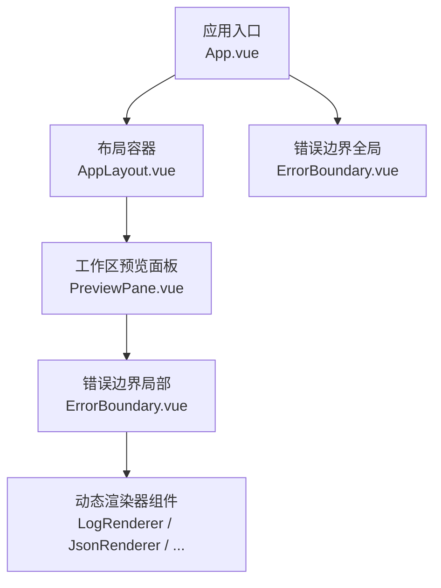
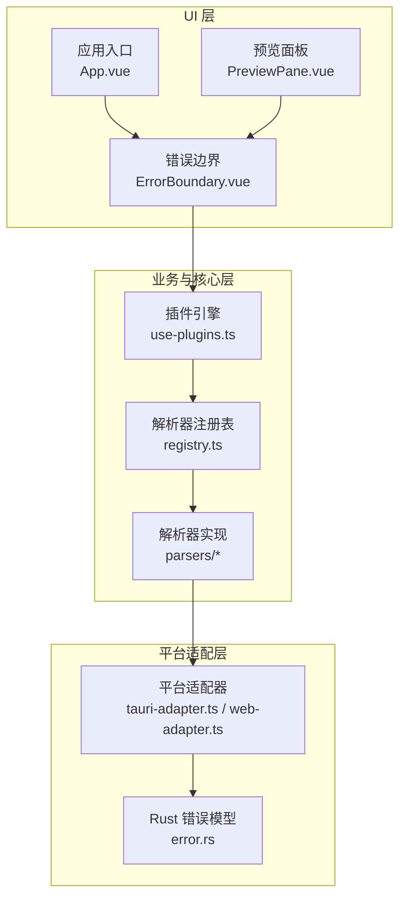
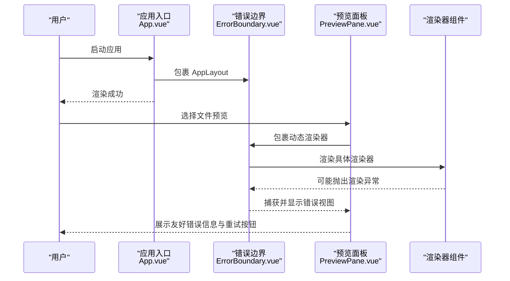
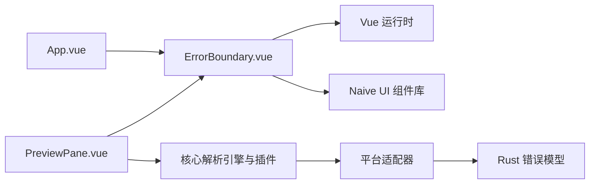

# 共享组件

<cite>
**本文引用的文件**   
- [ErrorBoundary.vue](file://src/components/shared/ErrorBoundary.vue)
- [App.vue](file://src/App.vue)
- [PreviewPane.vue](file://src/components/workspace/PreviewPane.vue)
- [系统架构设计.md](file://docs/superpowers/specs/2026-06-26-system-architecture-design.md)
- [error.rs](file://src-tauri/src/error.rs)
</cite>

## 目录
1. [简介](#简介)
2. [项目结构](#项目结构)
3. [核心组件](#核心组件)
4. [架构总览](#架构总览)
5. [详细组件分析](#详细组件分析)
6. [依赖分析](#依赖分析)
7. [性能考虑](#性能考虑)
8. [故障排查指南](#故障排查指南)
9. [结论](#结论)
10. [附录](#附录)

## 简介
本章节聚焦于 Hello-Tauri 项目的共享组件 ErrorBoundary.vue，系统性阐述其错误捕获与降级显示机制、安装与使用方式、错误恢复策略、用户友好的错误提示方案、错误日志记录与监控集成思路、自定义错误处理与重试机制实现方法、测试策略与调试技巧，以及与其它组件的集成模式与最佳实践。目标是帮助开发者快速理解并安全扩展该组件，提升应用整体健壮性与可维护性。

## 项目结构
ErrorBoundary 作为共享组件位于 src/components/shared 目录，被全局入口 App.vue 与预览面板 PreviewPane.vue 两处关键位置包裹使用，形成“全局兜底 + 局部隔离”的双重防护体系。

图示来源
- [App.vue:1-24](file://src/App.vue#L1-L24)
- [PreviewPane.vue:1-58](file://src/components/workspace/PreviewPane.vue#L1-L58)
- [ErrorBoundary.vue:1-30](file://src/components/shared/ErrorBoundary.vue#L1-L30)

章节来源
- [App.vue:1-24](file://src/App.vue#L1-L24)
- [PreviewPane.vue:1-58](file://src/components/workspace/PreviewPane.vue#L1-L58)
- [ErrorBoundary.vue:1-30](file://src/components/shared/ErrorBoundary.vue#L1-L30)

## 核心组件
本节深入解析 ErrorBoundary.vue 的实现要点：
- 错误捕获：基于 Vue 的 onErrorCaptured 钩子，拦截子树中抛出的同步或异步错误，统一收敛到本地状态。
- 降级展示：当捕获到错误时，使用 Naive UI 的 NResult 组件呈现友好错误信息；无错误时透传默认插槽内容。
- 恢复策略：提供 reset 方法清空错误状态，触发子组件重新渲染，实现“重试”能力。
- 类型安全：对非 Error 对象进行包装，确保后续逻辑稳定访问 message 等属性。

章节来源
- [ErrorBoundary.vue:1-30](file://src/components/shared/ErrorBoundary.vue#L1-L30)

## 架构总览
从系统层面看，错误处理贯穿平台适配层、插件注册层、核心服务层与 UI 层。ErrorBoundary 在 UI 层承担最后一道防线职责，将渲染期异常转化为可感知的降级界面，避免整个页面崩溃。

图示来源
- [系统架构设计.md:808-849](file://docs/superpowers/specs/2026-06-26-system-architecture-design.md#L808-L849)
- [error.rs:1-19](file://src-tauri/src/error.rs#L1-L19)
- [App.vue:1-24](file://src/App.vue#L1-L24)
- [PreviewPane.vue:1-58](file://src/components/workspace/PreviewPane.vue#L1-L58)
- [ErrorBoundary.vue:1-30](file://src/components/shared/ErrorBoundary.vue#L1-L30)

章节来源
- [系统架构设计.md:808-849](file://docs/superpowers/specs/2026-06-26-system-architecture-design.md#L808-L849)
- [error.rs:1-19](file://src-tauri/src/error.rs#L1-L19)

## 详细组件分析

### 错误捕获与降级显示机制
- 捕获时机：子组件在创建、更新或销毁阶段抛出的错误均可被 onErrorCaptured 捕获。
- 错误归一化：若捕获到的不是 Error 实例，则转换为标准 Error 对象，保证 message 字段可用。
- 阻断传播：返回 false 阻止错误继续向父级冒泡，避免全局崩溃。
- 降级 UI：通过条件渲染切换至 NResult 错误视图，包含标题与描述信息，并提供“重试”按钮。

图示来源
- [ErrorBoundary.vue:1-30](file://src/components/shared/ErrorBoundary.vue#L1-L30)

章节来源
- [ErrorBoundary.vue:1-30](file://src/components/shared/ErrorBoundary.vue#L1-L30)

### 安装与使用方式
- 全局兜底：在应用根节点 App.vue 中包裹 ErrorBoundary，用于捕获整个应用树的渲染异常。
- 局部隔离：在预览面板 PreviewPane.vue 中包裹动态渲染器组件，仅隔离单个渲染器的异常，避免影响其他区域。
- 插槽用法：ErrorBoundary 支持默认插槽，传入需要保护的子组件即可。

图示来源
- [App.vue:1-24](file://src/App.vue#L1-L24)
- [PreviewPane.vue:1-58](file://src/components/workspace/PreviewPane.vue#L1-L58)
- [ErrorBoundary.vue:1-30](file://src/components/shared/ErrorBoundary.vue#L1-L30)

章节来源
- [App.vue:1-24](file://src/App.vue#L1-L24)
- [PreviewPane.vue:1-58](file://src/components/workspace/PreviewPane.vue#L1-L58)
- [ErrorBoundary.vue:1-30](file://src/components/shared/ErrorBoundary.vue#L1-L30)

### 错误恢复策略与用户友好提示
- 恢复策略：通过 reset 方法清空错误状态，触发子组件重新渲染，适用于数据刷新、配置变更后的重试场景。
- 用户提示：NResult 提供标准化的错误图标、标题与描述，配合“重试”按钮，降低用户困惑。
- 建议增强：可在 reset 前增加二次确认或加载态，避免频繁重试导致抖动。

章节来源
- [ErrorBoundary.vue:1-30](file://src/components/shared/ErrorBoundary.vue#L1-L30)

### 错误日志记录与监控集成方案
- 前端侧：可在 onErrorCaptured 回调中接入日志上报或监控 SDK，记录错误堆栈、上下文信息与时间戳。
- 后端侧：结合 Rust 端 AppError 枚举，将平台层错误序列化后传递至前端，便于统一分析与告警。
- 链路追踪：在预览面板加载流程中，将错误事件与当前标签页、文件路径、渲染器类型关联，提高定位效率。

章节来源
- [system-architecture-design.md:808-849](file://docs/superpowers/specs/2026-06-26-system-architecture-design.md#L808-L849)
- [error.rs:1-19](file://src-tauri/src/error.rs#L1-L19)

### 自定义错误处理逻辑与重试机制
- 自定义处理：在 onErrorCaptured 中注入自定义逻辑，如上报、埋点、降级策略选择等。
- 重试机制：在 reset 基础上封装带退避的重试函数，限制最大重试次数，避免无限循环。
- 上下文携带：通过 props 或 provide/inject 向 ErrorBoundary 注入上下文（如当前文件路径），辅助错误诊断。

章节来源
- [ErrorBoundary.vue:1-30](file://src/components/shared/ErrorBoundary.vue#L1-L30)

### 测试策略与调试技巧
- 单元测试：使用 @vue/test-utils 挂载 ErrorBoundary，模拟子组件抛出异常，断言错误视图是否正确渲染。
- 行为验证：验证 reset 后子组件是否重新渲染，以及错误状态是否被正确清空。
- 调试技巧：在 onErrorCaptured 中临时输出错误信息，结合浏览器控制台与 Vue Devtools 观察组件生命周期与状态变化。

章节来源
- [ErrorBoundary.vue:1-30](file://src/components/shared/ErrorBoundary.vue#L1-L30)

### 与其他组件的集成模式与最佳实践
- 全局与局部结合：在 App.vue 提供全局兜底，在高风险区域（如动态渲染器）提供局部隔离，兼顾稳定性与用户体验。
- 最小侵入：ErrorBoundary 以插槽形式嵌入，无需改动现有组件内部逻辑，保持低耦合。
- 一致性体验：统一使用 NResult 的错误样式，确保全应用错误提示风格一致。

章节来源
- [App.vue:1-24](file://src/App.vue#L1-L24)
- [PreviewPane.vue:1-58](file://src/components/workspace/PreviewPane.vue#L1-L58)
- [ErrorBoundary.vue:1-30](file://src/components/shared/ErrorBoundary.vue#L1-L30)

## 依赖分析
- 直接依赖：Vue 运行时（ref、onErrorCaptured）、Naive UI（NResult、NButton）。
- 间接依赖：应用主题与消息/对话框提供者由 App.vue 注入，ErrorBoundary 不直接依赖这些提供者，保持独立。
- 外部错误源：平台适配层与 Rust 端错误通过上层 composable 与 core 模块向上抛出，最终由 UI 层 ErrorBoundary 兜底。

图示来源
- [ErrorBoundary.vue:1-30](file://src/components/shared/ErrorBoundary.vue#L1-L30)
- [App.vue:1-24](file://src/App.vue#L1-L24)
- [PreviewPane.vue:1-58](file://src/components/workspace/PreviewPane.vue#L1-L58)
- [error.rs:1-19](file://src-tauri/src/error.rs#L1-L19)

章节来源
- [ErrorBoundary.vue:1-30](file://src/components/shared/ErrorBoundary.vue#L1-L30)
- [App.vue:1-24](file://src/App.vue#L1-L24)
- [PreviewPane.vue:1-58](file://src/components/workspace/PreviewPane.vue#L1-L58)
- [error.rs:1-19](file://src-tauri/src/error.rs#L1-L19)

## 性能考虑
- 轻量实现：ErrorBoundary 仅维护一个错误状态，计算开销极低。
- 渲染切换：仅在发生错误时切换至 NResult，避免不必要的重渲染。
- 建议优化：如需频繁重试，可引入防抖或节流，减少重复渲染带来的性能损耗。

## 故障排查指南
- 现象：预览面板渲染器报错，页面出现错误视图。
- 定位步骤：
  - 检查 PreviewPane.vue 中的动态渲染器选择逻辑与数据绑定。
  - 查看 onErrorCaptured 捕获的错误信息，确认是否为渲染器内部异常。
  - 结合系统架构文档中的分层错误处理说明，判断错误来源层级。
- 常见原因：
  - 渲染器组件未正确处理空数据或异常数据结构。
  - 平台适配器 IO 失败或 IPC 断连导致上游抛出异常。
- 解决建议：
  - 在渲染器内增加输入校验与空值保护。
  - 在上层 composable 中捕获并转换错误，提供更清晰的错误语义。
  - 必要时在 ErrorBoundary 中接入日志上报，收集上下文信息。

章节来源
- [PreviewPane.vue:1-58](file://src/components/workspace/PreviewPane.vue#L1-L58)
- [ErrorBoundary.vue:1-30](file://src/components/shared/ErrorBoundary.vue#L1-L30)
- [系统架构设计.md:808-849](file://docs/superpowers/specs/2026-06-26-system-architecture-design.md#L808-L849)

## 结论
ErrorBoundary.vue 以极简实现提供了可靠的渲染期错误兜底能力，配合全局与局部的双重包裹策略，显著提升了应用的鲁棒性与用户体验。通过合理的日志上报、重试机制与测试覆盖，可进一步巩固其在复杂业务场景下的稳定性与可维护性。

## 附录
- 相关规范参考：系统架构设计中关于错误处理的分层策略与回退方案。
- 后端错误模型：Rust 端 AppError 枚举定义了 IO、解压、未找到等错误类型，便于前后端协同处理。

章节来源
- [系统架构设计.md:808-849](file://docs/superpowers/specs/2026-06-26-system-architecture-design.md#L808-L849)
- [error.rs:1-19](file://src-tauri/src/error.rs#L1-L19)