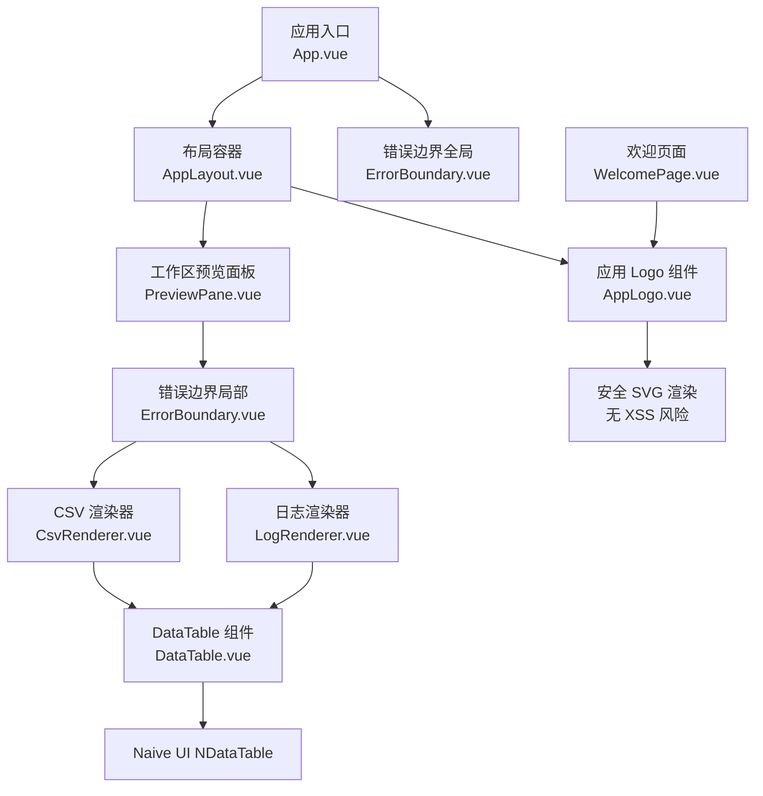
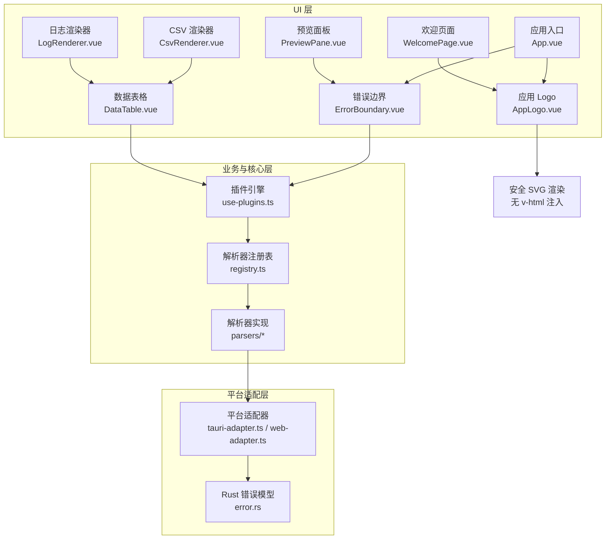
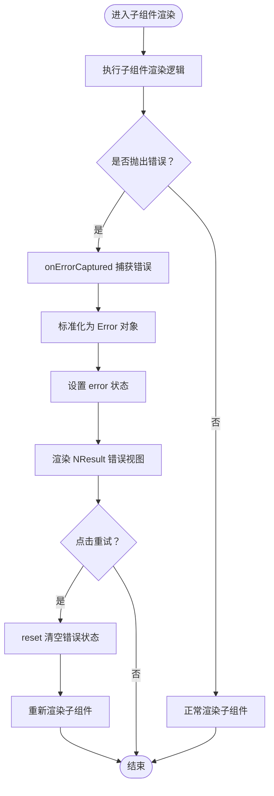
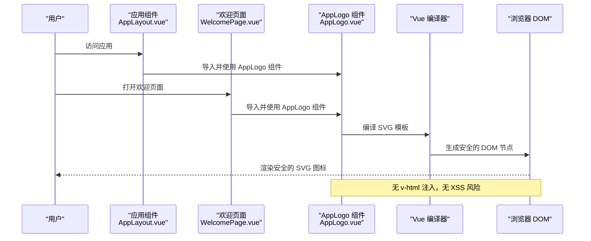
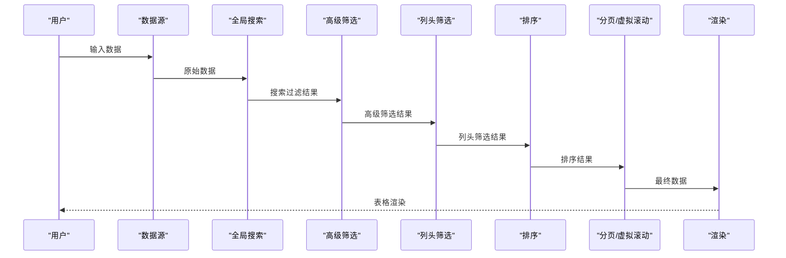
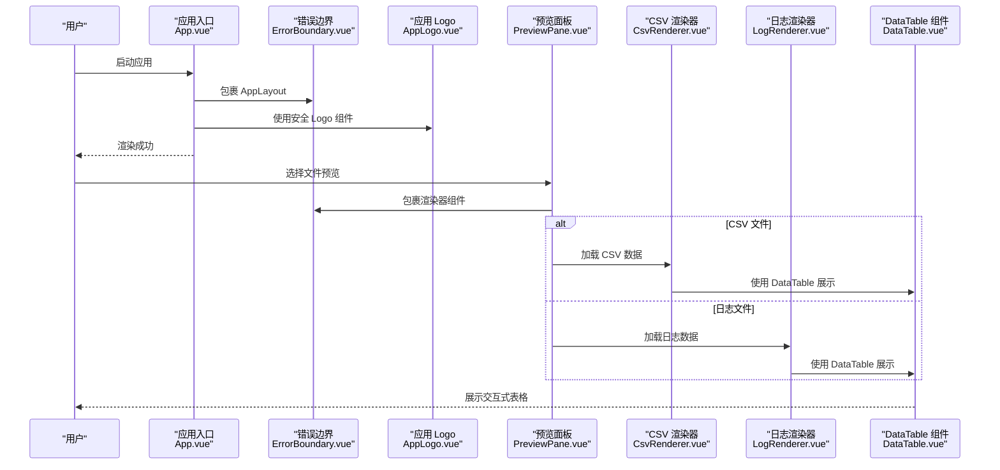
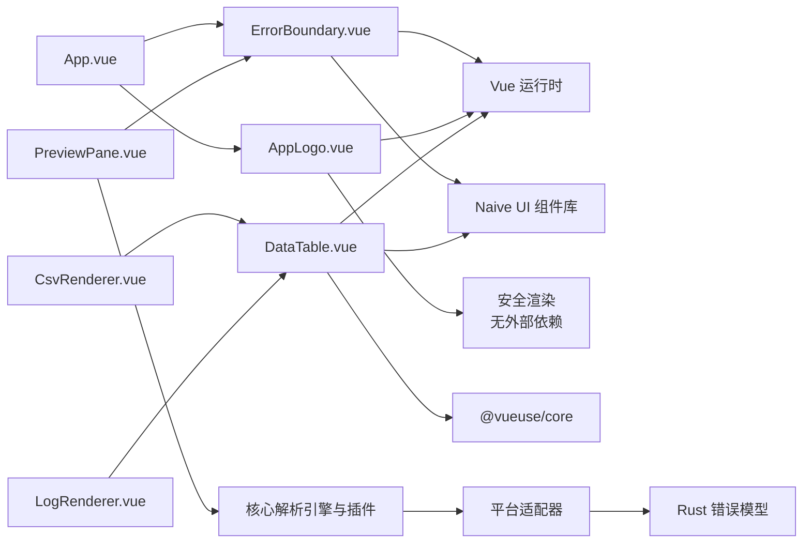

# 共享组件

<cite>
**本文引用的文件**   
- [ErrorBoundary.vue](file://src/components/shared/ErrorBoundary.vue)
- [AppLogo.vue](file://src/components/shared/AppLogo.vue)
- [DataTable.vue](file://src/components/shared/DataTable.vue)
- [App.vue](file://src/App.vue)
- [PreviewPane.vue](file://src/components/workspace/PreviewPane.vue)
- [CsvRenderer.vue](file://src/views/renderers/CsvRenderer.vue)
- [LogRenderer.vue](file://src/views/renderers/LogRenderer.vue)
- [AppLayout.vue](file://src/layout/AppLayout.vue)
- [WelcomePage.vue](file://src/components/workspace/WelcomePage.vue)
- [DataTable.test.ts](file://src/__tests__/components/DataTable.test.ts)
- [系统架构设计.md](file://docs/superpowers/specs/2026-06-26-system-architecture-design.md)
- [error.rs](file://src-tauri/src/error.rs)
- [DataTable 实施计划.md](file://docs/superpowers/plans/2026-07-08-datatable-implementation.md)
</cite>

## 更新摘要
**变更内容**   
- 新增 AppLogo 独立可复用组件的详细技术实现文档
- 更新组件架构重构说明，消除 v-html 指令注入的 XSS 风险
- 统一 logo 组件使用方式，提升代码可维护性
- 扩展共享组件架构图表以包含新组件的安全渲染机制
- 完善组件间的依赖关系和最佳实践指导

## 目录
1. [简介](#简介)
2. [项目结构](#项目结构)
3. [核心组件](#核心组件)
4. [架构总览](#架构总览)
5. [详细组件分析](#详细组件分析)
6. [依赖分析](#依赖分析)
7. [性能考虑](#性能考虑)
8. [故障排查指南](#故障排查指南)
9. [结论](#结论)
10. [附录](#附录)

## 简介
本章节聚焦于 Hello-Tauri 项目的共享组件体系，系统性阐述 ErrorBoundary.vue 错误边界组件的错误捕获与降级显示机制，以及全新实现的 DataTable.vue 数据表格组件的强大功能。同时重点介绍新提取的 AppLogo.vue 应用 Logo 组件，该组件通过替代 v-html 指令注入方式，有效消除了 XSS 安全风险。深入解释各组件的安装与使用方式、错误恢复策略、用户友好的错误提示方案、数据展示的最佳实践、安全渲染机制、错误日志记录与监控集成思路、自定义错误处理与重试机制实现方法、测试策略与调试技巧，以及与其他组件的集成模式与最佳实践。目标是帮助开发者快速理解并安全扩展这些共享组件，提升应用整体健壮性与可维护性。

## 项目结构
共享组件位于 src/components/shared 目录，包含三个核心组件：ErrorBoundary 错误边界组件、AppLogo 应用 Logo 组件和 DataTable 数据表格组件。这些组件被全局入口 App.vue、布局容器 AppLayout.vue、欢迎页面 WelcomePage.vue、预览面板 PreviewPane.vue 以及各种渲染器组件广泛使用，形成"全局兜底 + 安全图标 + 局部隔离 + 数据展示"的完整解决方案。

**图示来源**
- [App.vue:1-24](file://src/App.vue#L1-L24)
- [AppLayout.vue:1-331](file://src/layout/AppLayout.vue#L1-L331)
- [WelcomePage.vue:1-105](file://src/components/workspace/WelcomePage.vue#L1-L105)
- [PreviewPane.vue:1-99](file://src/components/workspace/PreviewPane.vue#L1-L99)
- [ErrorBoundary.vue:1-30](file://src/components/shared/ErrorBoundary.vue#L1-L30)
- [AppLogo.vue:1-30](file://src/components/shared/AppLogo.vue#L1-L30)
- [DataTable.vue:1-607](file://src/components/shared/DataTable.vue#L1-607)
- [CsvRenderer.vue:1-69](file://src/views/renderers/CsvRenderer.vue#L1-69)
- [LogRenderer.vue:1-78](file://src/views/renderers/LogRenderer.vue#L1-L78)

**章节来源**
- [App.vue:1-24](file://src/App.vue#L1-L24)
- [AppLayout.vue:1-331](file://src/layout/AppLayout.vue#L1-L331)
- [WelcomePage.vue:1-105](file://src/components/workspace/WelcomePage.vue#L1-L105)
- [PreviewPane.vue:1-99](file://src/components/workspace/PreviewPane.vue#L1-L99)
- [ErrorBoundary.vue:1-30](file://src/components/shared/ErrorBoundary.vue#L1-L30)
- [AppLogo.vue:1-30](file://src/components/shared/AppLogo.vue#L1-L30)
- [DataTable.vue:1-607](file://src/components/shared/DataTable.vue#L1-L607)

## 核心组件
本节深入解析共享组件的实现要点：

### ErrorBoundary.vue 错误边界组件
- **错误捕获**：基于 Vue 的 onErrorCaptured 钩子，拦截子树中抛出的同步或异步错误，统一收敛到本地状态
- **降级展示**：当捕获到错误时，使用 Naive UI 的 NResult 组件呈现友好错误信息；无错误时透传默认插槽内容
- **恢复策略**：提供 reset 方法清空错误状态，触发子组件重新渲染，实现"重试"能力
- **类型安全**：对非 Error 对象进行包装，确保后续逻辑稳定访问 message 等属性

### AppLogo.vue 应用 Logo 组件
- **安全渲染**：采用原生 SVG 元素直接渲染，完全替代 v-html 指令注入方式，彻底消除 XSS 安全风险
- **响应式设计**：支持通过 CSS 类名控制尺寸（w-10 h-10、w-[26px] h-[26px] 等），适配不同场景需求
- **主题适配**：使用 currentColor 属性自动继承父元素颜色，完美支持明暗主题切换
- **可复用性**：作为独立可复用组件，在应用布局头部和欢迎页面中统一使用，提升代码一致性

### DataTable.vue 数据表格组件
- **全局搜索**：支持 300ms 防抖的全局文本搜索，跨所有列进行不区分大小写的匹配
- **高级筛选**：提供多条件 AND 关系的复杂筛选面板，支持包含、等于、开头、结尾、范围、空值等操作符
- **CSV 导出**：内置 CSV 导出功能，支持 BOM + UTF-8 编码，确保 Excel 兼容性
- **自适应分页**：数据 ≤ 100 条时隐藏分页器，> 100 条时自动启用分页
- **虚拟滚动**：数据 > 500 条时自动启用虚拟滚动，优化大数据集性能
- **统计信息**：实时显示总数和筛选后数量，帮助用户了解数据状态
- **列头筛选**：集成 NDataTable 内置的 filter 和 sorter 回调，支持自定义排序函数和列头筛选选项

**章节来源**
- [ErrorBoundary.vue:1-30](file://src/components/shared/ErrorBoundary.vue#L1-L30)
- [AppLogo.vue:1-30](file://src/components/shared/AppLogo.vue#L1-L30)
- [DataTable.vue:1-607](file://src/components/shared/DataTable.vue#L1-L607)

## 架构总览
从系统层面看，共享组件贯穿平台适配层、插件注册层、核心服务层与 UI 层。ErrorBoundary 在 UI 层承担最后一道防线职责，将渲染期异常转化为可感知的降级界面；AppLogo 提供安全的图标渲染机制，避免 XSS 攻击向量；DataTable 则作为通用数据展示层，为各种渲染器提供一致的用户体验。

**图示来源**
- [系统架构设计.md:808-849](file://docs/superpowers/specs/2026-06-26-system-architecture-design.md#L808-L849)
- [error.rs:1-19](file://src-tauri/src/error.rs#L1-L19)
- [App.vue:1-24](file://src/App.vue#L1-L24)
- [AppLayout.vue:1-331](file://src/layout/AppLayout.vue#L1-L331)
- [WelcomePage.vue:1-105](file://src/components/workspace/WelcomePage.vue#L1-L105)
- [PreviewPane.vue:1-99](file://src/components/workspace/PreviewPane.vue#L1-L99)
- [ErrorBoundary.vue:1-30](file://src/components/shared/ErrorBoundary.vue#L1-L30)
- [AppLogo.vue:1-30](file://src/components/shared/AppLogo.vue#L1-L30)
- [DataTable.vue:1-607](file://src/components/shared/DataTable.vue#L1-L607)
- [CsvRenderer.vue:1-69](file://src/views/renderers/CsvRenderer.vue#L1-L69)
- [LogRenderer.vue:1-78](file://src/views/renderers/LogRenderer.vue#L1-L78)

**章节来源**
- [系统架构设计.md:808-849](file://docs/superpowers/specs/2026-06-26-system-architecture-design.md#L808-L849)
- [error.rs:1-19](file://src-tauri/src/error.rs#L1-L19)

## 详细组件分析

### ErrorBoundary.vue 错误捕获与降级显示机制
- **捕获时机**：子组件在创建、更新或销毁阶段抛出的错误均可被 onErrorCaptured 捕获
- **错误归一化**：若捕获到的不是 Error 实例，则转换为标准 Error 对象，保证 message 字段可用
- **阻断传播**：返回 false 阻止错误继续向父级冒泡，避免全局崩溃
- **降级 UI**：通过条件渲染切换至 NResult 错误视图，包含标题与描述信息，并提供"重试"按钮

**图示来源**
- [ErrorBoundary.vue:1-30](file://src/components/shared/ErrorBoundary.vue#L1-L30)

**章节来源**
- [ErrorBoundary.vue:1-30](file://src/components/shared/ErrorBoundary.vue#L1-L30)

### AppLogo.vue 安全渲染机制
AppLogo 组件代表了项目架构重构中的重要安全改进，通过以下方式消除 XSS 风险：

#### 安全渲染优势
- **原生 SVG 渲染**：直接使用 Vue 模板语法渲染 SVG 元素，避免字符串拼接和 innerHTML 注入
- **编译时验证**：Vue 编译器在构建时对模板进行静态分析，无法注入恶意脚本
- **类型安全**：TypeScript 提供完整的类型检查，防止运行时错误
- **样式隔离**：scoped CSS 确保样式不会泄漏到其他组件

#### 组件特性
- **响应式尺寸**：支持多种尺寸配置，从 26px 的小图标到 80px 的大图标
- **主题适配**：通过 currentColor 自动适配明暗主题
- **可访问性**：符合 WAI-ARIA 标准的语义化 SVG 结构
- **性能优化**：静态 SVG 内容在编译时被优化，减少运行时开销

**图示来源**
- [AppLogo.vue:1-30](file://src/components/shared/AppLogo.vue#L1-L30)
- [AppLayout.vue:157-158](file://src/layout/AppLayout.vue#L157-L158)
- [WelcomePage.vue:25-26](file://src/components/workspace/WelcomePage.vue#L25-L26)

**章节来源**
- [AppLogo.vue:1-30](file://src/components/shared/AppLogo.vue#L1-L30)
- [AppLayout.vue:157-158](file://src/layout/AppLayout.vue#L157-L158)
- [WelcomePage.vue:25-26](file://src/components/workspace/WelcomePage.vue#L25-L26)

### DataTable.vue 数据处理流水线
DataTable 组件实现了完整的数据处理流水线：原始 data → 全局搜索 → 高级筛选 → 列头筛选 → 排序 → 分页/虚拟滚动 → 渲染

#### 全局搜索过滤
- 使用 @vueuse/core 的 useDebounceFn 实现 300ms 防抖
- 跨所有列进行文本包含匹配（不区分大小写）
- 支持嵌套属性访问（如 'a.b.c' 路径）

#### 高级筛选面板
- 支持多种操作符：contains、equals、startsWith、endsWith、range、empty、notEmpty
- 多条件 AND 关系，支持动态添加和删除筛选条件
- 范围筛选支持数值比较，空值筛选支持 null 和空字符串检测

#### 列头筛选与排序
- 集成 NDataTable 内置的 filter 和 sorter 回调
- 支持自定义排序函数和列头筛选选项
- 保持与全局搜索和高级筛选的协同工作

**图示来源**
- [DataTable.vue:175-256](file://src/components/shared/DataTable.vue#L175-L256)

**章节来源**
- [DataTable.vue:1-607](file://src/components/shared/DataTable.vue#L1-L607)

### CsvRenderer 和 LogRenderer 的 DataTable 集成
两个渲染器都已重构为 DataTable 的薄封装层，负责将各自的数据格式转换为 DataTable 所需的 columns + data 格式。

#### CsvRenderer 集成特点
- 动态提取每列的唯一值作为筛选选项（限制最多 50 个以避免下拉列表过长）
- 自动转换 CSV headers 和 rows 为对象数组格式
- 支持列宽调整和列头筛选

#### LogRenderer 集成特点
- 定义专门的日志表格列配置，包括行号、时间戳、级别、模块、消息等
- 为日志级别提供颜色映射和自定义渲染
- 支持行点击事件，点击日志行时在编辑器中定位对应行号

**章节来源**
- [CsvRenderer.vue:1-69](file://src/views/renderers/CsvRenderer.vue#L1-L69)
- [LogRenderer.vue:1-78](file://src/views/renderers/LogRenderer.vue#L1-L78)

### 安装与使用方式
- **全局兜底**：在应用根节点 App.vue 中包裹 ErrorBoundary，用于捕获整个应用树的渲染异常
- **安全图标**：在 AppLayout.vue 和 WelcomePage.vue 中使用 AppLogo 组件，替代之前的 v-html 注入方式
- **局部隔离**：在预览面板 PreviewPane.vue 中包裹动态渲染器组件，仅隔离单个渲染器的异常，避免影响其他区域
- **DataTable 使用**：在 CsvRenderer 和 LogRenderer 中作为主要数据展示组件，传入 columns 和 data 配置即可

**图示来源**
- [App.vue:1-24](file://src/App.vue#L1-L24)
- [AppLayout.vue:157-158](file://src/layout/AppLayout.vue#L157-L158)
- [WelcomePage.vue:25-26](file://src/components/workspace/WelcomePage.vue#L25-L26)
- [PreviewPane.vue:1-99](file://src/components/workspace/PreviewPane.vue#L1-L99)
- [ErrorBoundary.vue:1-30](file://src/components/shared/ErrorBoundary.vue#L1-L30)
- [AppLogo.vue:1-30](file://src/components/shared/AppLogo.vue#L1-L30)
- [CsvRenderer.vue:1-69](file://src/views/renderers/CsvRenderer.vue#L1-L69)
- [LogRenderer.vue:1-78](file://src/views/renderers/LogRenderer.vue#L1-L78)
- [DataTable.vue:1-607](file://src/components/shared/DataTable.vue#L1-L607)

**章节来源**
- [App.vue:1-24](file://src/App.vue#L1-L24)
- [AppLayout.vue:157-158](file://src/layout/AppLayout.vue#L157-L158)
- [WelcomePage.vue:25-26](file://src/components/workspace/WelcomePage.vue#L25-L26)
- [PreviewPane.vue:1-99](file://src/components/workspace/PreviewPane.vue#L1-L99)
- [ErrorBoundary.vue:1-30](file://src/components/shared/ErrorBoundary.vue#L1-L30)
- [AppLogo.vue:1-30](file://src/components/shared/AppLogo.vue#L1-L30)
- [CsvRenderer.vue:1-69](file://src/views/renderers/CsvRenderer.vue#L1-L69)
- [LogRenderer.vue:1-78](file://src/views/renderers/LogRenderer.vue#L1-L78)

### 错误恢复策略与用户友好提示
- **ErrorBoundary 恢复策略**：通过 reset 方法清空错误状态，触发子组件重新渲染，适用于数据刷新、配置变更后的重试场景
- **用户提示**：NResult 提供标准化的错误图标、标题与描述，配合"重试"按钮，降低用户困惑
- **DataTable 用户体验**：提供丰富的交互功能，包括搜索、筛选、排序、导出等，提升数据探索效率
- **AppLogo 视觉一致性**：统一的 Logo 渲染确保应用品牌标识的一致性，支持主题切换时的视觉反馈

**章节来源**
- [ErrorBoundary.vue:1-30](file://src/components/shared/ErrorBoundary.vue#L1-L30)
- [AppLogo.vue:1-30](file://src/components/shared/AppLogo.vue#L1-L30)
- [DataTable.vue:1-607](file://src/components/shared/DataTable.vue#L1-L607)

### 错误日志记录与监控集成方案
- **前端侧**：可在 onErrorCaptured 回调中接入日志上报或监控 SDK，记录错误堆栈、上下文信息与时间戳
- **后端侧**：结合 Rust 端 AppError 枚举，将平台层错误序列化后传递至前端，便于统一分析与告警
- **链路追踪**：在预览面板加载流程中，将错误事件与当前标签页、文件路径、渲染器类型关联，提高定位效率
- **安全审计**：AppLogo 组件的使用消除了潜在的 XSS 攻击面，提升了应用的整体安全性

**章节来源**
- [system-architecture-design.md:808-849](file://docs/superpowers/specs/2026-06-26-system-architecture-design.md#L808-L849)
- [error.rs:1-19](file://src-tauri/src/error.rs#L1-L19)
- [AppLogo.vue:1-30](file://src/components/shared/AppLogo.vue#L1-L30)

### 自定义错误处理逻辑与重试机制
- **自定义处理**：在 onErrorCaptured 中注入自定义逻辑，如上报、埋点、降级策略选择等
- **重试机制**：在 reset 基础上封装带退避的重试函数，限制最大重试次数，避免无限循环
- **上下文携带**：通过 props 或 provide/inject 向 ErrorBoundary 注入上下文（如当前文件路径），辅助错误诊断
- **安全扩展**：如需动态图标功能，应遵循 AppLogo 的安全渲染模式，避免引入新的 XSS 风险

**章节来源**
- [ErrorBoundary.vue:1-30](file://src/components/shared/ErrorBoundary.vue#L1-L30)
- [AppLogo.vue:1-30](file://src/components/shared/AppLogo.vue#L1-L30)

### 测试策略与调试技巧
- **ErrorBoundary 测试**：使用 @vue/test-utils 挂载 ErrorBoundary，模拟子组件抛出异常，断言错误视图是否正确渲染
- **AppLogo 测试**：验证组件渲染正确性、主题适配性和响应式尺寸支持
- **DataTable 测试**：完整的单元测试覆盖，包括组件渲染、统计信息显示、导出按钮控制、高级筛选面板切换、行点击回调等功能验证
- **行为验证**：验证 reset 后子组件是否重新渲染，以及错误状态是否被正确清空
- **调试技巧**：在 onErrorCaptured 中临时输出错误信息，结合浏览器控制台与 Vue Devtools 观察组件生命周期与状态变化
- **安全测试**：使用安全扫描工具验证 AppLogo 组件不存在 XSS 漏洞

**章节来源**
- [ErrorBoundary.vue:1-30](file://src/components/shared/ErrorBoundary.vue#L1-L30)
- [AppLogo.vue:1-30](file://src/components/shared/AppLogo.vue#L1-L30)
- [DataTable.test.ts:1-128](file://src/__tests__/components/DataTable.test.ts#L1-L128)

### 与其他组件的集成模式与最佳实践
- **全局与局部结合**：在 App.vue 提供全局兜底，在高风险区域（如动态渲染器）提供局部隔离，兼顾稳定性与用户体验
- **最小侵入**：ErrorBoundary 以插槽形式嵌入，无需改动现有组件内部逻辑，保持低耦合
- **一致性体验**：统一使用 NResult 的错误样式，确保全应用错误提示风格一致
- **安全优先**：AppLogo 组件展示了如何安全地渲染 SVG 图标，避免使用 v-html 等危险 API
- **DataTable 复用**：通过薄封装层（CsvRenderer、LogRenderer）复用 DataTable 的核心功能，减少重复代码
- **组件解耦**：各共享组件之间保持松耦合，通过明确的接口进行通信

**章节来源**
- [App.vue:1-24](file://src/App.vue#L1-L24)
- [AppLayout.vue:157-158](file://src/layout/AppLayout.vue#L157-L158)
- [WelcomePage.vue:25-26](file://src/components/workspace/WelcomePage.vue#L25-L26)
- [PreviewPane.vue:1-99](file://src/components/workspace/PreviewPane.vue#L1-L99)
- [ErrorBoundary.vue:1-30](file://src/components/shared/ErrorBoundary.vue#L1-L30)
- [AppLogo.vue:1-30](file://src/components/shared/AppLogo.vue#L1-L30)
- [CsvRenderer.vue:1-69](file://src/views/renderers/CsvRenderer.vue#L1-L69)
- [LogRenderer.vue:1-78](file://src/views/renderers/LogRenderer.vue#L1-L78)

## 依赖分析
- **直接依赖**：Vue 运行时（ref、onErrorCaptured）、Naive UI（NResult、NButton、NDataTable、NInput、NSelect 等）
- **间接依赖**：应用主题与消息/对话框提供者由 App.vue 注入，ErrorBoundary 和 DataTable 不直接依赖这些提供者，保持独立
- **外部错误源**：平台适配层与 Rust 端错误通过上层 composable 与 core 模块向上抛出，最终由 UI 层 ErrorBoundary 兜底
- **第三方库**：DataTable 使用 @vueuse/core 的 useDebounceFn 实现搜索防抖
- **安全依赖**：AppLogo 组件零外部依赖，仅使用 Vue 模板语法和原生 SVG 元素

**图示来源**
- [ErrorBoundary.vue:1-30](file://src/components/shared/ErrorBoundary.vue#L1-L30)
- [AppLogo.vue:1-30](file://src/components/shared/AppLogo.vue#L1-L30)
- [DataTable.vue:1-607](file://src/components/shared/DataTable.vue#L1-L607)
- [App.vue:1-24](file://src/App.vue#L1-L24)
- [PreviewPane.vue:1-99](file://src/components/workspace/PreviewPane.vue#L1-L99)
- [CsvRenderer.vue:1-69](file://src/views/renderers/CsvRenderer.vue#L1-L69)
- [LogRenderer.vue:1-78](file://src/views/renderers/LogRenderer.vue#L1-L78)
- [error.rs:1-19](file://src-tauri/src/error.rs#L1-L19)

**章节来源**
- [ErrorBoundary.vue:1-30](file://src/components/shared/ErrorBoundary.vue#L1-L30)
- [AppLogo.vue:1-30](file://src/components/shared/AppLogo.vue#L1-L30)
- [DataTable.vue:1-607](file://src/components/shared/DataTable.vue#L1-L607)
- [App.vue:1-24](file://src/App.vue#L1-L24)
- [PreviewPane.vue:1-99](file://src/components/workspace/PreviewPane.vue#L1-L99)
- [CsvRenderer.vue:1-69](file://src/views/renderers/CsvRenderer.vue#L1-L69)
- [LogRenderer.vue:1-78](file://src/views/renderers/LogRenderer.vue#L1-L78)
- [error.rs:1-19](file://src-tauri/src/error.rs#L1-L19)

## 性能考虑
- **ErrorBoundary 轻量实现**：仅维护一个错误状态，计算开销极低
- **AppLogo 高效渲染**：静态 SVG 内容在编译时被优化，无运行时计算开销
- **DataTable 性能优化**：
  - 全局搜索使用 300ms 防抖，避免频繁计算
  - 自适应分页：数据 ≤ 100 条时隐藏分页器，减少不必要的 DOM 操作
  - 虚拟滚动：数据 > 500 条时自动启用，大幅提升大数据集渲染性能
  - 计算属性缓存：利用 Vue 的 computed 缓存中间计算结果
- **渲染切换优化**：仅在发生错误时切换至 NResult，避免不必要的重渲染
- **建议优化**：如需频繁重试，可引入防抖或节流，减少重复渲染带来的性能损耗

## 故障排查指南
- **现象**：预览面板渲染器报错，页面出现错误视图
- **定位步骤**：
  - 检查 PreviewPane.vue 中的动态渲染器选择逻辑与数据绑定
  - 查看 onErrorCaptured 捕获的错误信息，确认是否为渲染器内部异常
  - 结合系统架构文档中的分层错误处理说明，判断错误来源层级
  - 对于 DataTable 相关问题，检查 columns 配置和数据格式是否正确
  - 验证 AppLogo 组件是否正确导入和使用
- **常见原因**：
  - 渲染器组件未正确处理空数据或异常数据结构
  - 平台适配器 IO 失败或 IPC 断连导致上游抛出异常
  - DataTable 的 columns 配置与数据格式不匹配
  - AppLogo 组件路径错误或导入失败
- **解决建议**：
  - 在渲染器内增加输入校验与空值保护
  - 在上层 composable 中捕获并转换错误，提供更清晰的错误语义
  - 必要时在 ErrorBoundary 中接入日志上报，收集上下文信息
  - 使用 DataTable 提供的 expose 方法调试内部状态
  - 检查 AppLogo 组件的导入路径和 CSS 类名是否正确

**章节来源**
- [PreviewPane.vue:1-99](file://src/components/workspace/PreviewPane.vue#L1-L99)
- [ErrorBoundary.vue:1-30](file://src/components/shared/ErrorBoundary.vue#L1-L30)
- [AppLogo.vue:1-30](file://src/components/shared/AppLogo.vue#L1-L30)
- [DataTable.vue:327-334](file://src/components/shared/DataTable.vue#L327-L334)
- [系统架构设计.md:808-849](file://docs/superpowers/specs/2026-06-26-system-architecture-design.md#L808-L849)

## 结论
共享组件体系以 ErrorBoundary.vue、AppLogo.vue 和 DataTable.vue 为核心，提供了可靠的渲染期错误兜底能力、安全的图标渲染机制和强大的数据展示功能。ErrorBoundary 以极简实现提供了统一的错误处理机制，配合全局与局部的双重包裹策略，显著提升了应用的鲁棒性与用户体验。AppLogo 组件代表了项目架构重构的重要成果，通过消除 v-html 注入的 XSS 风险，大幅提升了应用的安全性。DataTable 则通过丰富的功能特性和完善的性能优化，为各种数据展示场景提供了统一的解决方案。通过合理的日志上报、重试机制与全面的测试覆盖，这些组件在复杂业务场景下展现了出色的稳定性与可维护性。

## 附录
- **相关规范参考**：系统架构设计中关于错误处理的分层策略与回退方案
- **后端错误模型**：Rust 端 AppError 枚举定义了 IO、解压、未找到等错误类型，便于前后端协同处理
- **DataTable 实施计划**：详细的组件开发计划和任务分解，指导逐步实现各项功能特性
- **安全最佳实践**：AppLogo 组件展示了如何在 Vue 应用中安全地渲染 SVG 内容，避免 XSS 攻击

**章节来源**
- [系统架构设计.md:808-849](file://docs/superpowers/specs/2026-06-26-system-architecture-design.md#L808-L849)
- [error.rs:1-19](file://src-tauri/src/error.rs#L1-L19)
- [DataTable 实施计划.md:1-1078](file://docs/superpowers/plans/2026-07-08-datatable-implementation.md#L1-L1078)
- [AppLogo.vue:1-30](file://src/components/shared/AppLogo.vue#L1-L30)