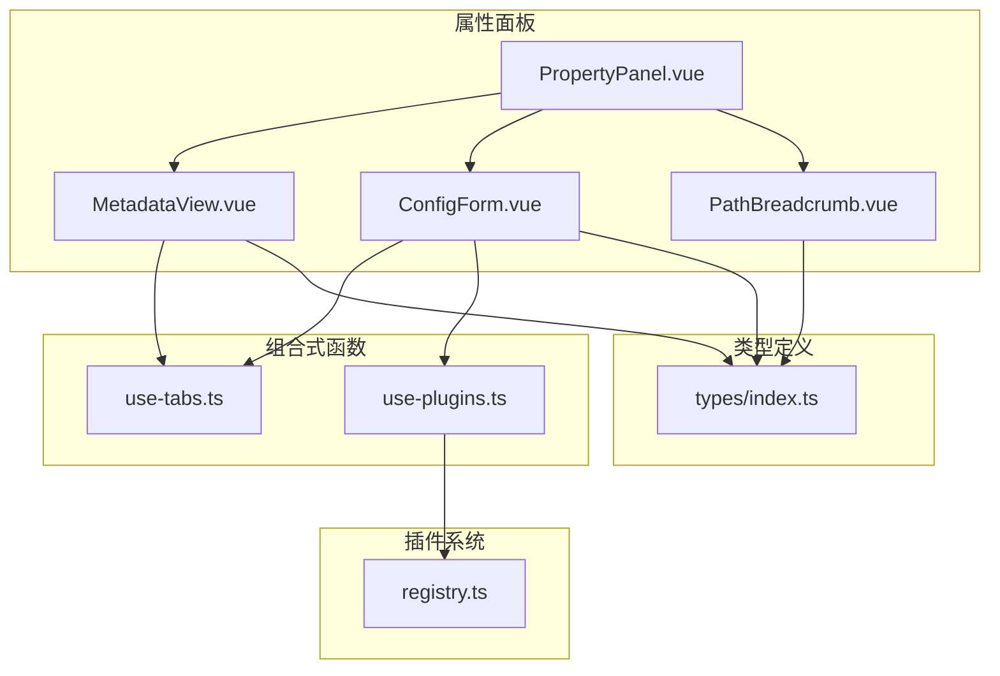
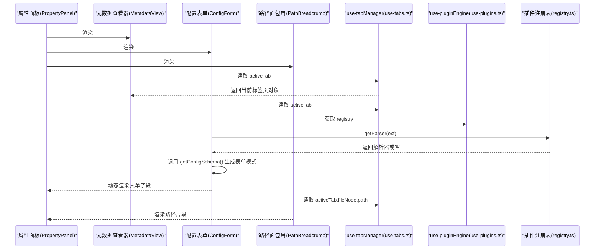
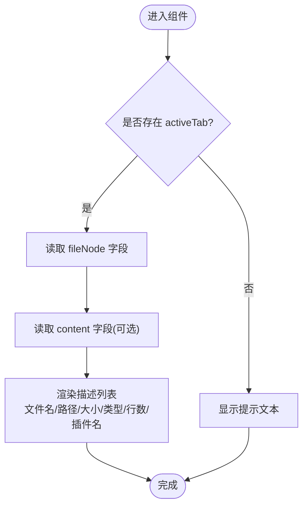
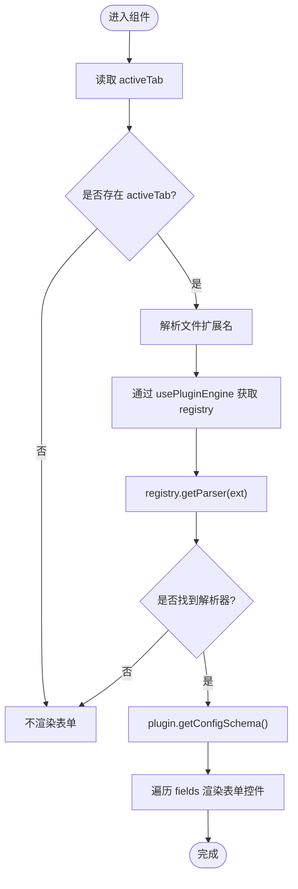
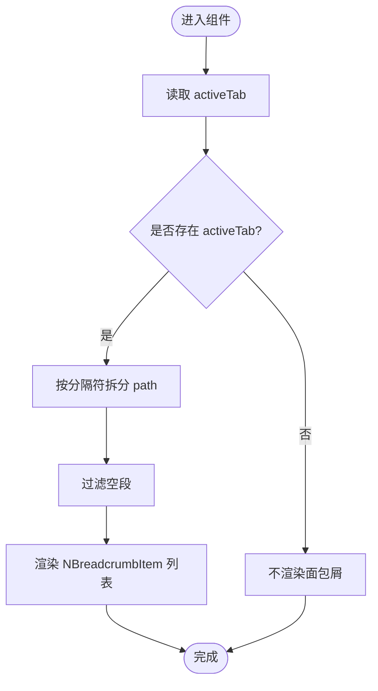
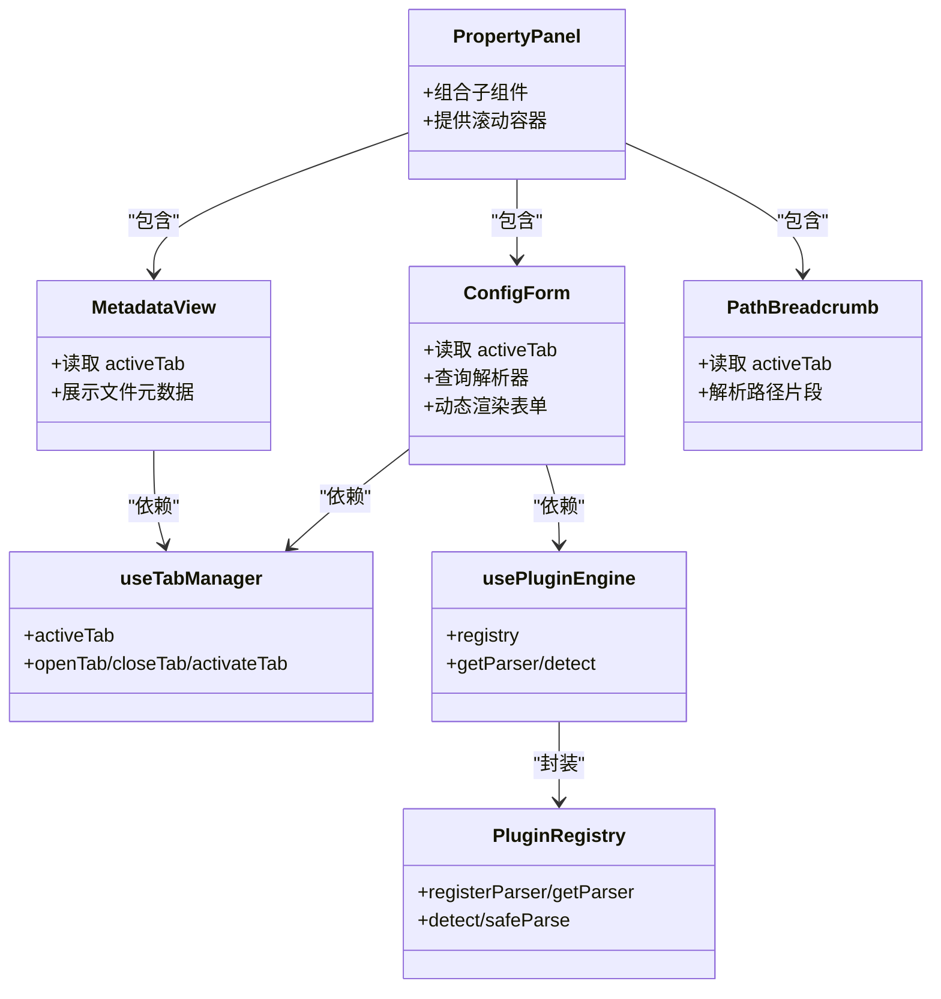

# 属性面板组件

<cite>
**本文引用的文件列表**
- [PropertyPanel.vue](file://src/components/property-panel/PropertyPanel.vue)
- [MetadataView.vue](file://src/components/property-panel/MetadataView.vue)
- [ConfigForm.vue](file://src/components/property-panel/ConfigForm.vue)
- [PathBreadcrumb.vue](file://src/components/property-panel/PathBreadcrumb.vue)
- [use-tabs.ts](file://src/composables/use-tabs.ts)
- [use-plugins.ts](file://src/composables/use-plugins.ts)
- [registry.ts](file://src/plugins/registry.ts)
- [index.ts（类型定义）](file://src/types/index.ts)
</cite>

## 目录
1. [简介](#简介)
2. [项目结构](#项目结构)
3. [核心组件](#核心组件)
4. [架构总览](#架构总览)
5. [详细组件分析](#详细组件分析)
6. [依赖关系分析](#依赖关系分析)
7. [性能与可维护性](#性能与可维护性)
8. [故障排查指南](#故障排查指南)
9. [结论](#结论)
10. [附录：表单定制与扩展](#附录表单定制与扩展)

## 简介
本文件面向 Hello-Tauri 项目的“属性面板”子模块，聚焦以下四个 Vue 单文件组件及其协作机制：
- PropertyPanel.vue：属性面板容器，负责组合元数据查看、配置表单与路径面包屑，并提供滚动容器。
- MetadataView.vue：元数据查看器，基于当前活动标签页展示文件基本信息与解析结果摘要。
- ConfigForm.vue：动态配置表单，根据当前文件的解析插件提供的配置模式渲染表单字段。
- PathBreadcrumb.vue：路径面包屑，将当前文件路径分段并以可导航的层级形式呈现。

文档将深入解释各组件的职责边界、数据绑定机制、实时更新策略、用户交互反馈，以及表单定制与验证的最佳实践。

## 项目结构
属性面板位于 src/components/property-panel 目录下，由一个容器组件和三个功能组件组成，并通过组合式函数 useTabManager 与 usePluginEngine 获取全局状态与插件能力。

图表来源
- [PropertyPanel.vue:1-17](file://src/components/property-panel/PropertyPanel.vue#L1-L17)
- [MetadataView.vue:1-35](file://src/components/property-panel/MetadataView.vue#L1-L35)
- [ConfigForm.vue:1-37](file://src/components/property-panel/ConfigForm.vue#L1-L37)
- [PathBreadcrumb.vue:1-21](file://src/components/property-panel/PathBreadcrumb.vue#L1-L21)
- [use-tabs.ts:1-64](file://src/composables/use-tabs.ts#L1-L64)
- [use-plugins.ts:1-17](file://src/composables/use-plugins.ts#L1-L17)
- [registry.ts:1-118](file://src/plugins/registry.ts#L1-L118)
- [index.ts（类型定义）:1-71](file://src/types/index.ts#L1-L71)

章节来源
- [PropertyPanel.vue:1-17](file://src/components/property-panel/PropertyPanel.vue#L1-L17)
- [MetadataView.vue:1-35](file://src/components/property-panel/MetadataView.vue#L1-L35)
- [ConfigForm.vue:1-37](file://src/components/property-panel/ConfigForm.vue#L1-L37)
- [PathBreadcrumb.vue:1-21](file://src/components/property-panel/PathBreadcrumb.vue#L1-L21)
- [use-tabs.ts:1-64](file://src/composables/use-tabs.ts#L1-L64)
- [use-plugins.ts:1-17](file://src/composables/use-plugins.ts#L1-L17)
- [registry.ts:1-118](file://src/plugins/registry.ts#L1-L118)
- [index.ts（类型定义）:1-71](file://src/types/index.ts#L1-L71)

## 核心组件
- PropertyPanel.vue：作为属性面板的容器，使用滚动条组件包裹并顺序渲染元数据查看器、配置表单与路径面包屑。其职责是布局与组合，不持有业务逻辑。
- MetadataView.vue：读取当前活动标签页的文件节点与解析内容，以描述列表的形式展示文件名、路径、大小、类型、行数与解析插件名称等元信息。
- ConfigForm.vue：根据当前活动标签页对应文件的扩展名，查询插件注册表中的解析器，若该解析器提供配置模式，则动态生成表单字段；支持输入框、下拉选择、开关与数字输入等基础控件。
- PathBreadcrumb.vue：将当前活动标签页的文件路径按分隔符切分为段，并以面包屑形式展示，便于快速定位层级。

章节来源
- [PropertyPanel.vue:1-17](file://src/components/property-panel/PropertyPanel.vue#L1-L17)
- [MetadataView.vue:1-35](file://src/components/property-panel/MetadataView.vue#L1-L35)
- [ConfigForm.vue:1-37](file://src/components/property-panel/ConfigForm.vue#L1-L37)
- [PathBreadcrumb.vue:1-21](file://src/components/property-panel/PathBreadcrumb.vue#L1-L21)

## 架构总览
属性面板通过组合式函数访问全局标签页状态与插件注册表，形成“视图层 → 组合式函数 → 插件系统 → 类型定义”的数据流。

图表来源
- [PropertyPanel.vue:1-17](file://src/components/property-panel/PropertyPanel.vue#L1-L17)
- [MetadataView.vue:1-35](file://src/components/property-panel/MetadataView.vue#L1-L35)
- [ConfigForm.vue:1-37](file://src/components/property-panel/ConfigForm.vue#L1-L37)
- [PathBreadcrumb.vue:1-21](file://src/components/property-panel/PathBreadcrumb.vue#L1-L21)
- [use-tabs.ts:1-64](file://src/composables/use-tabs.ts#L1-L64)
- [use-plugins.ts:1-17](file://src/composables/use-plugins.ts#L1-L17)
- [registry.ts:1-118](file://src/plugins/registry.ts#L1-L118)

## 详细组件分析

### PropertyPanel.vue：容器与滚动布局
- 职责：组合三个子组件并提供统一滚动区域，确保在内容较多时仍可流畅浏览。
- 数据绑定：自身不持有状态，仅透传子组件所需上下文（通过组合式函数）。
- 交互反馈：无直接交互逻辑，但为子组件提供稳定的渲染容器。

章节来源
- [PropertyPanel.vue:1-17](file://src/components/property-panel/PropertyPanel.vue#L1-L17)

### MetadataView.vue：元数据查看器
- 数据来源：从 useTabManager 获取 activeTab，再读取 fileNode 与 content 字段。
- 展示字段：文件名、路径、大小、类型、行数、解析插件名称；当无活动标签页时显示提示文本。
- 格式化输出：大小默认以字节单位展示；行数为可选字段；类型与插件名称仅在存在解析内容时显示。
- 更新机制：activeTab 变化时自动刷新展示内容。

图表来源
- [MetadataView.vue:1-35](file://src/components/property-panel/MetadataView.vue#L1-L35)
- [use-tabs.ts:1-64](file://src/composables/use-tabs.ts#L1-L64)
- [index.ts（类型定义）:1-71](file://src/types/index.ts#L1-L71)

章节来源
- [MetadataView.vue:1-35](file://src/components/property-panel/MetadataView.vue#L1-L35)
- [use-tabs.ts:1-64](file://src/composables/use-tabs.ts#L1-L64)
- [index.ts（类型定义）:1-71](file://src/types/index.ts#L1-L71)

### ConfigForm.vue：动态表单生成与验证
- 动态表单生成：
  - 从 activeTab 中解析文件扩展名。
  - 通过 usePluginEngine 获取 registry，并使用 getParser(ext) 查找对应解析器。
  - 若解析器暴露 getConfigSchema 方法，则将其返回的模式用于渲染表单字段。
- 支持的字段类型：input、select、switch、number，分别映射到 Naive UI 的对应控件。
- 验证逻辑：
  - 当前实现未内置表单校验规则；如需校验，可在后续引入表单库的 rules 或自定义校验函数。
- 更新机制：
  - 当 activeTab 或 registry 变化时，computed 会重新计算 configSchema，从而触发表单重建。

图表来源
- [ConfigForm.vue:1-37](file://src/components/property-panel/ConfigForm.vue#L1-L37)
- [use-plugins.ts:1-17](file://src/composables/use-plugins.ts#L1-L17)
- [registry.ts:1-118](file://src/plugins/registry.ts#L1-L118)
- [use-tabs.ts:1-64](file://src/composables/use-tabs.ts#L1-L64)

章节来源
- [ConfigForm.vue:1-37](file://src/components/property-panel/ConfigForm.vue#L1-L37)
- [use-plugins.ts:1-17](file://src/composables/use-plugins.ts#L1-L17)
- [registry.ts:1-118](file://src/plugins/registry.ts#L1-L118)
- [use-tabs.ts:1-64](file://src/composables/use-tabs.ts#L1-L64)

### PathBreadcrumb.vue：路径面包屑与路径解析
- 路径解析算法：
  - 读取 activeTab.fileNode.path。
  - 使用分隔符进行分割，过滤空段，得到路径片段数组。
- 导航功能：
  - 当前实现仅展示路径片段，未实现点击跳转逻辑；可扩展为点击某一段后跳转到对应目录或打开对应文件。
- 更新机制：
  - 当 activeTab 变化时，pathSegments 计算属性会重新计算并更新面包屑。

图表来源
- [PathBreadcrumb.vue:1-21](file://src/components/property-panel/PathBreadcrumb.vue#L1-L21)
- [use-tabs.ts:1-64](file://src/composables/use-tabs.ts#L1-L64)

章节来源
- [PathBreadcrumb.vue:1-21](file://src/components/property-panel/PathBreadcrumb.vue#L1-L21)
- [use-tabs.ts:1-64](file://src/composables/use-tabs.ts#L1-L64)

## 依赖关系分析
- 组件耦合度：
  - 三个子组件均依赖 useTabManager 获取当前活动标签页，属于松耦合的状态共享。
  - ConfigForm 额外依赖 usePluginEngine 与 registry，用于动态表单生成。
- 外部依赖：
  - Naive UI 组件库用于描述列表、表单控件与面包屑。
  - 插件系统通过 registry 管理解析器与压缩器的发现与调用。
- 潜在循环依赖：
  - 当前结构清晰，未见循环导入；组合式函数与插件注册表之间单向依赖。

图表来源
- [PropertyPanel.vue:1-17](file://src/components/property-panel/PropertyPanel.vue#L1-L17)
- [MetadataView.vue:1-35](file://src/components/property-panel/MetadataView.vue#L1-L35)
- [ConfigForm.vue:1-37](file://src/components/property-panel/ConfigForm.vue#L1-L37)
- [PathBreadcrumb.vue:1-21](file://src/components/property-panel/PathBreadcrumb.vue#L1-L21)
- [use-tabs.ts:1-64](file://src/composables/use-tabs.ts#L1-L64)
- [use-plugins.ts:1-17](file://src/composables/use-plugins.ts#L1-L17)
- [registry.ts:1-118](file://src/plugins/registry.ts#L1-L118)

章节来源
- [PropertyPanel.vue:1-17](file://src/components/property-panel/PropertyPanel.vue#L1-L17)
- [MetadataView.vue:1-35](file://src/components/property-panel/MetadataView.vue#L1-L35)
- [ConfigForm.vue:1-37](file://src/components/property-panel/ConfigForm.vue#L1-L37)
- [PathBreadcrumb.vue:1-21](file://src/components/property-panel/PathBreadcrumb.vue#L1-L21)
- [use-tabs.ts:1-64](file://src/composables/use-tabs.ts#L1-L64)
- [use-plugins.ts:1-17](file://src/composables/use-plugins.ts#L1-L17)
- [registry.ts:1-118](file://src/plugins/registry.ts#L1-L118)

## 性能与可维护性
- 响应式更新：
  - 所有子组件通过 computed 或组合式函数的响应式状态驱动，避免不必要的重渲染。
- 计算开销：
  - 路径分割与扩展名解析均为轻量操作；在大量标签页切换场景下仍保持良好性能。
- 可扩展性：
  - 动态表单基于插件配置模式，新增字段类型只需扩展模板分支与控件映射。
- 建议优化：
  - 对大型路径或复杂配置模式，考虑分页或懒加载渲染。
  - 为表单字段增加防抖与校验缓存，减少频繁输入导致的重复计算。

[本节为通用指导，无需源码引用]

## 故障排查指南
- 无活动标签页时的空白显示：
  - 检查 useTabManager 是否正确初始化与激活标签页。
- 配置表单未渲染：
  - 确认文件扩展名解析正确且解析器已注册。
  - 检查解析器是否实现 getConfigSchema 方法。
- 路径面包屑为空：
  - 确认 fileNode.path 是否为有效字符串且包含分隔符。
- 插件超时或异常：
  - 插件注册表提供安全解析与解压包装，出现异常时会回退到十六进制视图或错误结果；可在上层捕获并提示用户。

章节来源
- [use-tabs.ts:1-64](file://src/composables/use-tabs.ts#L1-L64)
- [registry.ts:1-118](file://src/plugins/registry.ts#L1-L118)

## 结论
属性面板组件通过清晰的职责划分与响应式数据流，实现了元数据展示、动态表单与路径导航的有机整合。其设计具备良好的可扩展性与可维护性，适合在多种文件格式与插件生态下复用。后续可通过增强表单验证、完善面包屑导航与提升大体积数据的渲染性能来进一步优化用户体验。

[本节为总结，无需源码引用]

## 附录：表单定制与扩展
- 新增表单字段类型：
  - 在 ConfigForm 模板中添加新的条件分支，映射到合适的 Naive UI 控件。
  - 在插件配置模式中声明新字段的 key、label、type、default 与 options（如需要）。
- 表单验证最佳实践：
  - 引入表单库的 rules 机制，为必填、范围、格式等约束提供统一校验。
  - 对用户输入进行即时反馈，并在提交前进行整体校验。
- 错误提示规范：
  - 使用统一的错误消息结构与位置（如表单底部或字段旁）。
  - 区分用户输入错误与系统异常，提供可操作的修复建议。
- 实时同步与撤销：
  - 为表单值建立本地副本，支持撤销/重做与变更历史。
  - 在保存前进行差异对比，减少不必要的全量写入。

[本节为概念性指导，无需源码引用]