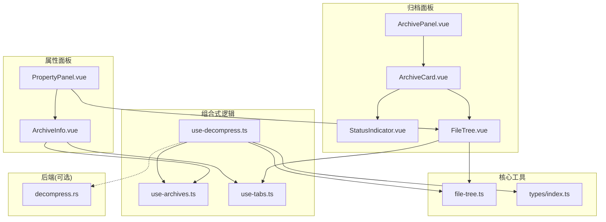
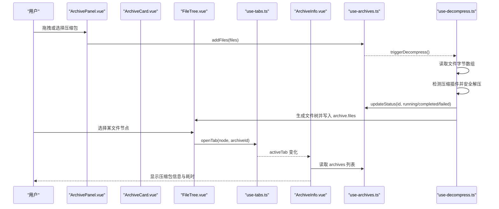
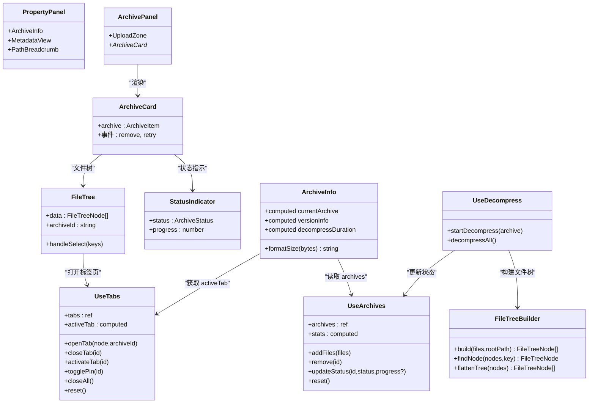
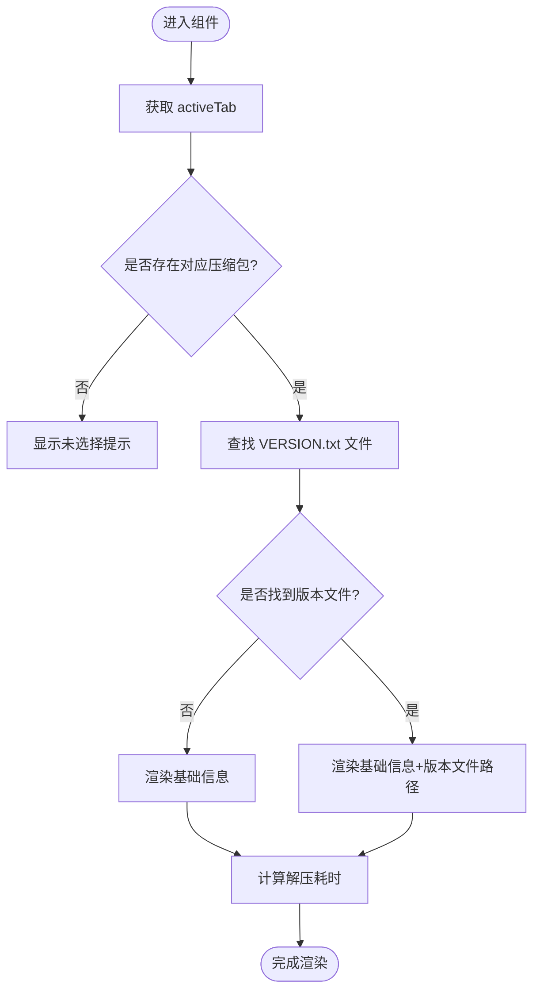
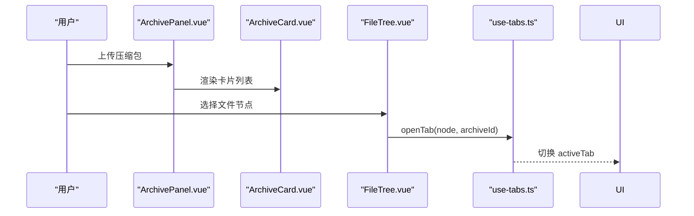
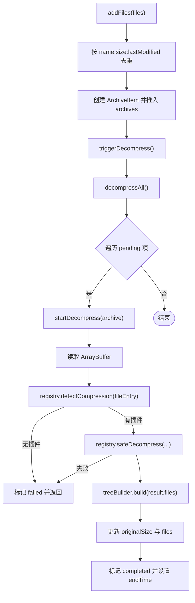
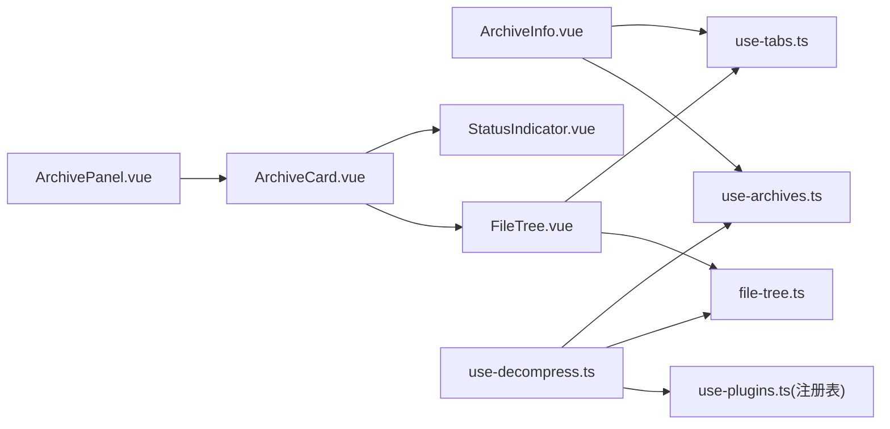

# 归档信息组件

<cite>
**本文引用的文件**
- [ArchiveInfo.vue](file://src/components/property-panel/ArchiveInfo.vue)
- [PropertyPanel.vue](file://src/components/property-panel/PropertyPanel.vue)
- [ArchivePanel.vue](file://src/components/archive-panel/ArchivePanel.vue)
- [ArchiveCard.vue](file://src/components/archive-panel/ArchiveCard.vue)
- [StatusIndicator.vue](file://src/components/archive-panel/StatusIndicator.vue)
- [FileTree.vue](file://src/components/archive-panel/FileTree.vue)
- [use-archives.ts](file://src/composables/use-archives.ts)
- [use-decompress.ts](file://src/composables/use-decompress.ts)
- [use-tabs.ts](file://src/composables/use-tabs.ts)
- [index.ts（类型定义）](file://src/types/index.ts)
- [file-tree.ts](file://src/core/file-tree.ts)
- [decompress.rs](file://src-tauri/src/decompress.rs)
</cite>

## 目录
1. [简介](#简介)
2. [项目结构](#项目结构)
3. [核心组件与数据流](#核心组件与数据流)
4. [架构总览](#架构总览)
5. [详细组件分析](#详细组件分析)
6. [依赖关系分析](#依赖关系分析)
7. [性能与可扩展性](#性能与可扩展性)
8. [故障排查指南](#故障排查指南)
9. [结论](#结论)

## 简介
本文件聚焦“归档信息组件”，即右侧属性面板中的压缩包信息与当前文件元数据展示模块。该模块通过组合式函数与状态管理，将压缩包列表、解压进度、文件树与标签页联动，形成从上传到解析再到展示的完整链路。其目标是：
- 清晰呈现每个压缩包的名称、状态、大小、文件数与耗时等关键指标
- 在选中文件时，提供路径面包屑与元数据视图
- 与左侧归档面板和中间预览区协同工作，支撑用户快速定位与查看内容

## 项目结构
归档信息相关的前端代码主要分布在以下位置：
- 属性面板（右侧）：ArchiveInfo.vue、PropertyPanel.vue
- 归档面板（左侧）：ArchivePanel.vue、ArchiveCard.vue、StatusIndicator.vue、FileTree.vue
- 组合式逻辑：use-archives.ts、use-decompress.ts、use-tabs.ts
- 核心工具：file-tree.ts（文件树构建与查找）
- 类型定义：types/index.ts
- 后端能力（可选）：decompress.rs（Rust 原生解压实现）

图表来源
- [ArchiveInfo.vue:1-121](file://src/components/property-panel/ArchiveInfo.vue#L1-L121)
- [PropertyPanel.vue:1-51](file://src/components/property-panel/PropertyPanel.vue#L1-L51)
- [ArchivePanel.vue:1-24](file://src/components/archive-panel/ArchivePanel.vue#L1-L24)
- [ArchiveCard.vue:1-41](file://src/components/archive-panel/ArchiveCard.vue#L1-L41)
- [StatusIndicator.vue:1-28](file://src/components/archive-panel/StatusIndicator.vue#L1-L28)
- [FileTree.vue:1-42](file://src/components/archive-panel/FileTree.vue#L1-L42)
- [use-archives.ts:1-81](file://src/composables/use-archives.ts#L1-L81)
- [use-decompress.ts:1-74](file://src/composables/use-decompress.ts#L1-L74)
- [use-tabs.ts:1-64](file://src/composables/use-tabs.ts#L1-L64)
- [file-tree.ts:1-69](file://src/core/file-tree.ts#L1-L69)
- [index.ts（类型定义）:1-71](file://src/types/index.ts#L1-L71)
- [decompress.rs:1-83](file://src-tauri/src/decompress.rs#L1-L83)

章节来源
- [README.md:71-127](file://README.md#L71-L127)

## 核心组件与数据流
- ArchiveInfo.vue：根据当前标签页找到所属压缩包，汇总并展示名称、状态、大小、文件数、耗时与版本文件信息；同时计算解压耗时。
- PropertyPanel.vue：聚合 ArchiveInfo 与文件元数据视图，构成右侧属性面板。
- use-archives.ts：维护压缩包列表、添加/删除、更新状态与统计信息。
- use-decompress.ts：编排解压流程，驱动任务调度器，更新进度与结果，构建文件树。
- FileTree.vue：渲染文件树，支持过滤与选择，点击叶子节点打开标签页。
- use-tabs.ts：管理标签页的打开、关闭、激活与固定。
- file-tree.ts：将扁平文件列表构造成树形结构，并提供查找与扁平化方法。
- types/index.ts：统一的数据模型，包括 FileEntry、ArchiveItem、TabItem 等。
- decompress.rs：Rust 侧 zip/gzip 解压实现（供 Tauri 模式使用）。

图表来源
- [ArchivePanel.vue:1-24](file://src/components/archive-panel/ArchivePanel.vue#L1-L24)
- [ArchiveCard.vue:1-41](file://src/components/archive-panel/ArchiveCard.vue#L1-L41)
- [FileTree.vue:1-42](file://src/components/archive-panel/FileTree.vue#L1-L42)
- [use-tabs.ts:1-64](file://src/composables/use-tabs.ts#L1-L64)
- [ArchiveInfo.vue:1-121](file://src/components/property-panel/ArchiveInfo.vue#L1-L121)
- [use-archives.ts:1-81](file://src/composables/use-archives.ts#L1-L81)
- [use-decompress.ts:1-74](file://src/composables/use-decompress.ts#L1-L74)

## 架构总览
归档信息组件采用“组合式函数 + 轻量状态”的架构，避免全局重状态库，保持高内聚低耦合：
- 状态层：use-archives.ts 集中管理压缩包集合与统计；use-tabs.ts 管理标签页；use-decompress.ts 负责解压流程与进度推进。
- 展示层：ArchiveInfo.vue 与 PropertyPanel.vue 负责信息聚合与渲染；ArchivePanel 系列组件负责上传、卡片与文件树交互。
- 工具层：file-tree.ts 提供树构建与查找；types/index.ts 提供统一类型契约。
- 扩展层：Rust 后端 decompress.rs 提供高性能解压能力（Tauri 模式下可被调用）。

图表来源
- [ArchiveInfo.vue:1-121](file://src/components/property-panel/ArchiveInfo.vue#L1-L121)
- [PropertyPanel.vue:1-51](file://src/components/property-panel/PropertyPanel.vue#L1-L51)
- [ArchivePanel.vue:1-24](file://src/components/archive-panel/ArchivePanel.vue#L1-L24)
- [ArchiveCard.vue:1-41](file://src/components/archive-panel/ArchiveCard.vue#L1-L41)
- [StatusIndicator.vue:1-28](file://src/components/archive-panel/StatusIndicator.vue#L1-L28)
- [FileTree.vue:1-42](file://src/components/archive-panel/FileTree.vue#L1-L42)
- [use-archives.ts:1-81](file://src/composables/use-archives.ts#L1-L81)
- [use-decompress.ts:1-74](file://src/composables/use-decompress.ts#L1-L74)
- [use-tabs.ts:1-64](file://src/composables/use-tabs.ts#L1-L64)
- [file-tree.ts:1-69](file://src/core/file-tree.ts#L1-L69)

## 详细组件分析

### ArchiveInfo 组件
职责与行为
- 基于当前活动标签页定位所属压缩包，展示名称、状态、压缩大小、原始大小、文件数、解压耗时与版本文件路径。
- 自动计算解压耗时，当 startTime/endTime 存在时进行格式化输出。
- 尝试识别 VERSION.txt 文件并展示其路径，便于定位版本信息。

关键实现要点
- 使用 computed 派生 currentArchive 与 versionInfo，保证响应式更新。
- 使用 NDescriptions/NTag 等 Naive UI 组件进行结构化展示与状态标签。
- 提供 formatSize 辅助函数，统一文件大小展示格式。

图表来源
- [ArchiveInfo.vue:1-121](file://src/components/property-panel/ArchiveInfo.vue#L1-L121)

章节来源
- [ArchiveInfo.vue:1-121](file://src/components/property-panel/ArchiveInfo.vue#L1-L121)

### PropertyPanel 组件
职责与行为
- 作为右侧属性面板容器，整合压缩包信息与当前文件元数据视图。
- 提供滚动区域与分区标题，增强可读性与导航体验。

章节来源
- [PropertyPanel.vue:1-51](file://src/components/property-panel/PropertyPanel.vue#L1-L51)

### ArchivePanel 与 ArchiveCard、StatusIndicator、FileTree
- ArchivePanel：承载上传区域与压缩包卡片列表，提供滚动容器。
- ArchiveCard：单个压缩包卡片，包含标题、状态指示、错误信息与文件树。
- StatusIndicator：以标签与进度条直观表达 pending/running/completed/failed 状态。
- FileTree：渲染文件树，支持过滤与选择，点击叶子节点触发打开标签页。

图表来源
- [ArchivePanel.vue:1-24](file://src/components/archive-panel/ArchivePanel.vue#L1-L24)
- [ArchiveCard.vue:1-41](file://src/components/archive-panel/ArchiveCard.vue#L1-L41)
- [StatusIndicator.vue:1-28](file://src/components/archive-panel/StatusIndicator.vue#L1-L28)
- [FileTree.vue:1-42](file://src/components/archive-panel/FileTree.vue#L1-L42)
- [use-tabs.ts:1-64](file://src/composables/use-tabs.ts#L1-L64)

章节来源
- [ArchivePanel.vue:1-24](file://src/components/archive-panel/ArchivePanel.vue#L1-L24)
- [ArchiveCard.vue:1-41](file://src/components/archive-panel/ArchiveCard.vue#L1-L41)
- [StatusIndicator.vue:1-28](file://src/components/archive-panel/StatusIndicator.vue#L1-L28)
- [FileTree.vue:1-42](file://src/components/archive-panel/FileTree.vue#L1-L42)

### 组合式函数：use-archives、use-decompress、use-tabs
- use-archives.ts
  - 维护 archives 列表与去重集合，提供 addFiles/remove/updateStatus/stats/reset 等方法。
  - 在状态变为 running/completed 时记录 startTime/endTime，用于后续耗时计算。
- use-decompress.ts
  - 读取文件为 Uint8Array，检测压缩插件并执行安全解压。
  - 通过 TaskScheduler 控制并发，逐步更新进度，最终构建文件树并设置 originalSize。
- use-tabs.ts
  - 管理标签页集合与活动标签，提供 open/close/activate/togglePin/closeAll/reset 等操作。

图表来源
- [use-archives.ts:1-81](file://src/composables/use-archives.ts#L1-L81)
- [use-decompress.ts:1-74](file://src/composables/use-decompress.ts#L1-L74)
- [file-tree.ts:1-69](file://src/core/file-tree.ts#L1-L69)

章节来源
- [use-archives.ts:1-81](file://src/composables/use-archives.ts#L1-L81)
- [use-decompress.ts:1-74](file://src/composables/use-decompress.ts#L1-L74)
- [use-tabs.ts:1-64](file://src/composables/use-tabs.ts#L1-L64)

### 核心工具：file-tree.ts
- build：将扁平文件列表转换为树形结构，处理父子关系与根节点收集。
- findNode：递归查找指定 key 的节点。
- flattenTree：将树扁平化为线性列表，便于搜索或批量操作。

章节来源
- [file-tree.ts:1-69](file://src/core/file-tree.ts#L1-L69)

### 类型定义：types/index.ts
- FileEntry：表示文件或目录的基本信息。
- DecompressResult：解压结果封装。
- ArchiveStatus：压缩包状态枚举。
- FileTreeNode：文件树节点。
- ParsedContent：解析后的内容载体。
- ArchiveItem：压缩包条目，包含状态、进度、文件树、时间戳与大小统计。
- TabItem：标签页条目，关联文件节点与所属压缩包。
- SearchMatch/SearchResults：搜索结果数据结构。

章节来源
- [index.ts（类型定义）:1-71](file://src/types/index.ts#L1-L71)

### 后端能力：decompress.rs（Tauri 模式）
- decompress_zip：读取 ZIP 数据，逐条目解压至输出目录，返回目录与文件清单。
- decompress_gzip：解压 GZIP 数据，写出单文件结果。
- 返回结构体使用 camelCase 序列化，便于前端消费。

章节来源
- [decompress.rs:1-83](file://src-tauri/src/decompress.rs#L1-L83)

## 依赖关系分析
- 组件间依赖
  - ArchiveInfo 依赖 use-tabs 与 use-archives，用于定位当前压缩包与读取列表。
  - FileTree 依赖 use-tabs 与 file-tree，用于打开标签页与查找节点。
  - ArchiveCard 依赖 StatusIndicator 与 FileTree，用于状态与文件树展示。
  - ArchivePanel 聚合 UploadZone 与 ArchiveCard，组织上传与列表。
- 组合式函数依赖
  - use-decompress 依赖 use-archives（更新状态）、use-plugins（注册表）、TaskScheduler（并发控制）、FileTreeBuilder（树构建）。
  - use-archives 提供统一的增删改查与统计接口，被多个组件复用。
- 类型契约
  - 所有组件与组合式函数围绕 types/index.ts 的类型定义协作，确保前后端数据一致。

图表来源
- [ArchiveInfo.vue:1-121](file://src/components/property-panel/ArchiveInfo.vue#L1-L121)
- [use-tabs.ts:1-64](file://src/composables/use-tabs.ts#L1-L64)
- [use-archives.ts:1-81](file://src/composables/use-archives.ts#L1-L81)
- [FileTree.vue:1-42](file://src/components/archive-panel/FileTree.vue#L1-L42)
- [file-tree.ts:1-69](file://src/core/file-tree.ts#L1-L69)
- [ArchiveCard.vue:1-41](file://src/components/archive-panel/ArchiveCard.vue#L1-L41)
- [StatusIndicator.vue:1-28](file://src/components/archive-panel/StatusIndicator.vue#L1-L28)
- [ArchivePanel.vue:1-24](file://src/components/archive-panel/ArchivePanel.vue#L1-L24)
- [use-decompress.ts:1-74](file://src/composables/use-decompress.ts#L1-L74)

## 性能与可扩展性
- 大文件友好
  - 使用虚拟滚动与分页加载策略（如 NTree 的 virtual-scroll），降低大数据量渲染开销。
  - 文件树构建采用 Map/Set 优化父子关系匹配，避免重复遍历。
- 并发控制
  - 通过 TaskScheduler 限制解压并发数，防止浏览器主线程阻塞。
- 内存占用
  - 按需读取 ArrayBuffer，避免一次性加载超大文件导致内存峰值过高。
- 可扩展性
  - 插件注册机制允许新增压缩与解析插件，无需改动现有组件。
  - 类型定义集中管理，便于前后端契约演进。

[本节为通用指导，不直接分析具体文件]

## 故障排查指南
常见问题与定位建议
- 压缩包无法解压
  - 检查是否检测到压缩插件；若无插件，会标记为 failed 并给出提示信息。
  - 查看 use-decompress 的错误分支，确认 registry.safeDecompress 返回值与错误消息。
- 进度不更新或卡住
  - 确认 TaskScheduler 队列是否已满；若满则 startDecompress 会立即标记失败。
  - 检查 updateStatus 调用链是否正确覆盖 running/completed/failed 状态。
- 文件树为空或无法选择
  - 验证 treeBuilder.build 的结果是否为空；检查 result.files 的结构是否符合 FileEntry 约定。
  - 确认 FileTree 的 pattern 过滤是否误屏蔽了目标节点。
- 版本文件未显示
  - 检查 VERSION.txt 是否在 files 列表中且路径匹配；确认 ArchiveInfo 的版本文件查找逻辑。

章节来源
- [use-decompress.ts:1-74](file://src/composables/use-decompress.ts#L1-L74)
- [use-archives.ts:1-81](file://src/composables/use-archives.ts#L1-L81)
- [file-tree.ts:1-69](file://src/core/file-tree.ts#L1-L69)
- [ArchiveInfo.vue:1-121](file://src/components/property-panel/ArchiveInfo.vue#L1-L121)

## 结论
归档信息组件通过清晰的职责划分与组合式函数，实现了从上传、解压、树构建到信息展示的完整链路。其优势在于：
- 低耦合：组件仅依赖必要的组合式函数与工具类，易于替换与测试。
- 高扩展：插件体系与类型契约使新增压缩/解析能力变得简单。
- 用户体验：状态可视化、进度反馈与文件树过滤提升了整体可用性。

未来可考虑的方向
- 引入更细粒度的进度回调，提升大文件解压的用户感知。
- 增加缓存策略，对已解析的文件内容做本地缓存，减少重复 IO。
- 完善错误边界与重试机制，提高健壮性。

[本节为总结性内容，不直接分析具体文件]