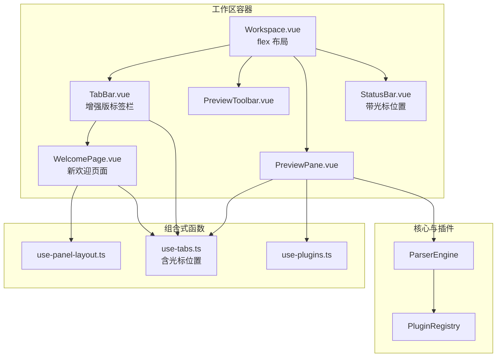
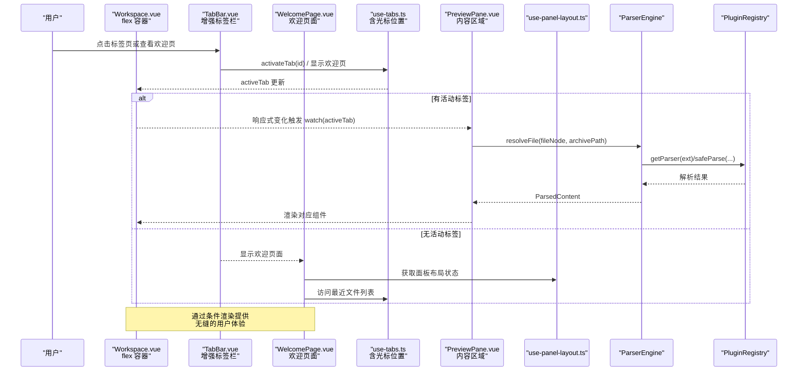
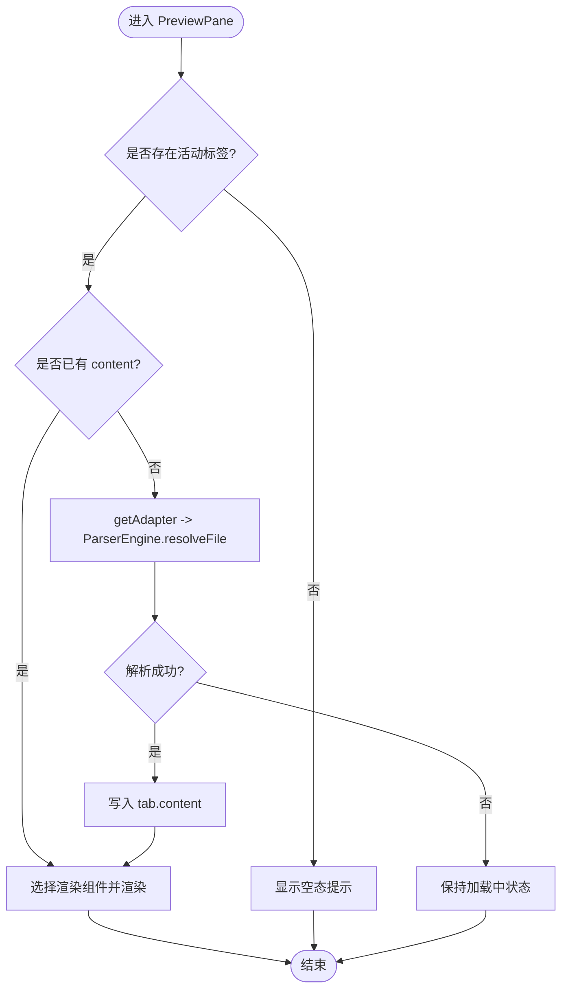
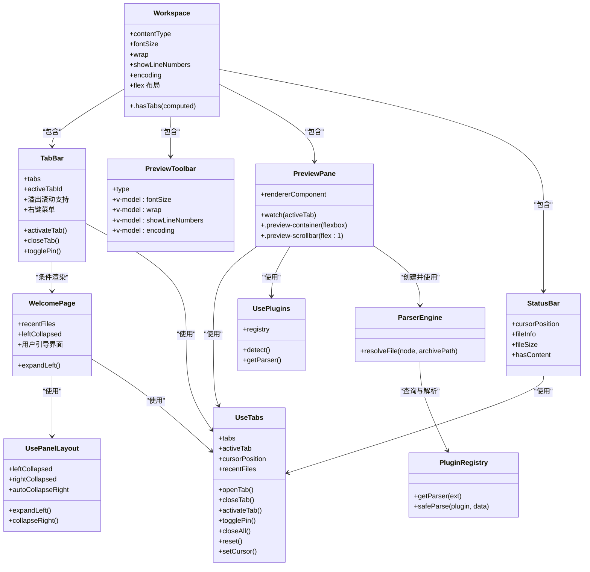

# 主工作区组件

<cite>
**本文引用的文件**   
- [Workspace.vue](file://src/components/workspace/Workspace.vue)
- [TabBar.vue](file://src/components/workspace/TabBar.vue)
- [PreviewPane.vue](file://src/components/workspace/PreviewPane.vue)
- [PreviewToolbar.vue](file://src/components/workspace/PreviewToolbar.vue)
- [StatusBar.vue](file://src/components/workspace/StatusBar.vue)
- [WelcomePage.vue](file://src/components/workspace/WelcomePage.vue)
- [use-tabs.ts](file://src/composables/use-tabs.ts)
- [use-plugins.ts](file://src/composables/use-plugins.ts)
- [use-panel-layout.ts](file://src/composables/use-panel-layout.ts)
- [parser-engine.ts](file://src/core/parser-engine.ts)
- [registry.ts](file://src/plugins/registry.ts)
- [index.ts（类型定义）](file://src/types/index.ts)
</cite>

## 更新摘要
**变更内容**   
- 集成了新的 WelcomePage 欢迎页面组件，提供友好的初始界面和快捷操作引导
- 增强了 TabBar 标签栏组件功能，包括溢出滚动支持、右键菜单、固定标签页等交互改进
- 改进了状态管理，新增光标位置跟踪和最近文件记录功能
- 优化了布局架构，采用更简洁的 flexbox 布局确保流畅的用户体验
- 完善了快捷键提示系统，支持 Ctrl+K 全局搜索快捷键显示

## 目录
1. [简介](#简介)
2. [项目结构](#项目结构)
3. [核心组件与职责](#核心组件与职责)
4. [架构总览](#架构总览)
5. [详细组件分析](#详细组件分析)
6. [依赖关系分析](#依赖关系分析)
7. [性能考量](#性能考量)
8. [故障排查指南](#故障排查指南)
9. [结论](#结论)
10. [附录：配置选项与最佳实践](#附录配置选项与最佳实践)

## 简介
本文件围绕主工作区组件 Workspace.vue，系统性阐述其作为"工作区容器"的核心职责：组织子组件、管理布局、维护渲染配置状态、根据活动标签页内容类型动态选择渲染模式，以及与标签页、插件引擎、平台适配器的协作流程。文档同时提供架构图、时序图、流程图和类图，帮助读者从高层到代码级全面理解该组件及其周边生态。

**更新** 组件现已集成全新的 WelcomePage 欢迎页面，提供更友好的用户引导体验，同时增强了标签栏的交互功能和状态管理能力。

## 项目结构
工作区相关的前端实现集中在 src/components/workspace 下，配合组合式函数 use-tabs、use-plugins、use-panel-layout 以及核心解析器 ParserEngine 与插件注册表 PluginRegistry，形成"标签页驱动 + 插件化渲染 + 欢迎页面引导"的完整架构。

**图表来源**
- [Workspace.vue:1-39](file://src/components/workspace/Workspace.vue#L1-L39)
- [TabBar.vue:1-254](file://src/components/workspace/TabBar.vue#L1-L254)
- [WelcomePage.vue:1-111](file://src/components/workspace/WelcomePage.vue#L1-L111)
- [PreviewPane.vue:1-94](file://src/components/workspace/PreviewPane.vue#L1-L94)
- [PreviewToolbar.vue:1-52](file://src/components/workspace/PreviewToolbar.vue#L1-L52)
- [StatusBar.vue:1-49](file://src/components/workspace/StatusBar.vue#L1-L49)
- [use-tabs.ts:1-80](file://src/composables/use-tabs.ts#L1-L80)
- [use-plugins.ts:1-17](file://src/composables/use-plugins.ts#L1-L17)
- [use-panel-layout.ts:1-48](file://src/composables/use-panel-layout.ts#L1-L48)
- [parser-engine.ts:1-35](file://src/core/parser-engine.ts#L1-L35)
- [registry.ts:1-118](file://src/plugins/registry.ts#L1-L118)

## 核心组件与职责
- **Workspace.vue**：工作区容器，负责整体布局、子组件编排、预览工具栏配置项的状态管理与传递、基于活动标签页内容类型的渲染模式计算。**简化** 采用更简洁的 flex 布局架构，通过 Tailwind CSS 类名实现响应式设计。
- **TabBar.vue**：**增强版** 标签页展示与交互，支持溢出滚动、右键菜单、固定标签页等功能，使用 use-tab-manager 提供的 tabs、activeTabId 等状态进行切换、关闭、置顶等操作。当无标签页时自动显示 WelcomePage。
- **PreviewToolbar.vue**：预览工具栏，暴露字号、换行、行号、编码等可配置项，通过 v-model 双向绑定至父组件状态。
- **PreviewPane.vue**：预览面板，监听活动标签页变化，按需加载文件内容并选择对应渲染组件；包含错误边界与滚动容器。
- **StatusBar.vue**：**增强版** 状态栏，汇总显示行数、编码、使用的插件名称、文件大小等信息，**新增** 实时光标位置显示。
- **WelcomePage.vue**：**全新** 欢迎页面组件，提供友好的初始界面，包含拖放文件提示、上传文件引导、搜索功能说明、最近文件列表和快捷键提示。

**章节来源**
- [Workspace.vue:1-39](file://src/components/workspace/Workspace.vue#L1-L39)
- [TabBar.vue:1-254](file://src/components/workspace/TabBar.vue#L1-L254)
- [PreviewToolbar.vue:1-52](file://src/components/workspace/PreviewToolbar.vue#L1-L52)
- [PreviewPane.vue:1-94](file://src/components/workspace/PreviewPane.vue#L1-L94)
- [StatusBar.vue:1-49](file://src/components/workspace/StatusBar.vue#L1-L49)
- [WelcomePage.vue:1-111](file://src/components/workspace/WelcomePage.vue#L1-L111)

## 架构总览
工作区采用"标签页驱动 + 插件化渲染 + 欢迎页面引导"的架构，通过简洁的 flex 布局确保良好的用户体验：
- **布局架构**：Workspace 作为根容器，使用 `flex flex-col h-full overflow-hidden` 垂直排列各子组件。
- **条件渲染**：当存在标签页时显示工具栏和预览面板，否则显示 WelcomePage 欢迎页面。
- **标签页由 use-tabs 统一管理**，决定当前活动标签与内容，并维护光标位置和最近文件记录。
- **预览面板在标签页激活时**，通过 Platform 适配器读取文件数据，交由 ParserEngine 结合 PluginRegistry 解析为结构化内容。
- **渲染组件由插件注册表按扩展名动态选择**，并通过 PreviewPane 以动态组件形式挂载。
- **工具栏配置项**（字号、换行、行号、编码）由 Workspace 集中维护，并以 v-model 传递给 PreviewToolbar，供渲染层消费。
- **欢迎页面提供用户引导**，集成面板布局管理和最近文件访问功能。

**图表来源**
- [Workspace.vue:22-38](file://src/components/workspace/Workspace.vue#L22-L38)
- [TabBar.vue:94-143](file://src/components/workspace/TabBar.vue#L94-L143)
- [WelcomePage.vue:19-110](file://src/components/workspace/WelcomePage.vue#L19-L110)
- [use-tabs.ts:15-78](file://src/composables/use-tabs.ts#L15-L78)
- [PreviewPane.vue:28-54](file://src/components/workspace/PreviewPane.vue#L28-L54)
- [use-panel-layout.ts:23-47](file://src/composables/use-panel-layout.ts#L23-L47)
- [parser-engine.ts:1-35](file://src/core/parser-engine.ts#L1-L35)
- [registry.ts:1-118](file://src/plugins/registry.ts#L1-L118)

## 详细组件分析

### Workspace.vue：工作区容器
- **子组件组织与布局**
  - **顶部**：TabBar 用于标签页导航。
  - **中部**：当存在标签页时显示 PreviewToolbar 和 PreviewPane，否则显示 WelcomePage 欢迎页面。
  - **底部**：StatusBar 显示统计信息。
- **Flex 布局架构**
  - **根容器**：使用 `flex flex-col h-full overflow-hidden` 确保整个工作区占满高度并防止整体滚动。
  - **条件渲染**：通过 `v-if="hasTabs"` 控制工具栏和预览面板的显示。
  - **内容区域**：使用 `flex-1 min-h-0 overflow-hidden` 确保预览面板正确填充剩余空间。
- **状态管理**
  - 本地响应式状态：fontSize、wrap、showLineNumbers、encoding，均通过 v-model 与 PreviewToolbar 双向绑定。
  - contentType 计算属性：基于 activeTab.value?.content?.type 推导，若为空则回退为 text，从而决定工具栏控件的可见性与行为。
  - hasTabs 计算属性：基于 tabs.value.length > 0 判断是否显示工具栏和预览面板。
- **生命周期与响应式**
  - 组件初始化即导入 useTabManager 获取 activeTab，随后 computed 与模板中的条件渲染自动响应。
  - 工具栏的显隐受 hasTabs 控制，避免无标签页时出现多余 UI。
- **与其他组件的集成**
  - 与 TabBar 共享标签页状态（通过 use-tabs）。
  - 与 PreviewToolbar 通过 props/type 与 v-model 传递配置。
  - 与 PreviewPane 共同消费 activeTab 的变化，后者负责内容加载与渲染。

**更新** 采用更简洁的 Tailwind CSS 类名实现布局，移除了复杂的 CSS 样式，提升了代码的可维护性。

**章节来源**
- [Workspace.vue:1-39](file://src/components/workspace/Workspace.vue#L1-L39)
- [PreviewToolbar.vue:1-52](file://src/components/workspace/PreviewToolbar.vue#L1-L52)
- [use-tabs.ts:1-80](file://src/composables/use-tabs.ts#L1-L80)

### TabBar.vue：增强版标签栏
- **溢出滚动支持**
  - 实现左右滚动箭头按钮，当标签页超出容器宽度时自动显示。
  - 使用 `scrollBy({ left: -200, behavior: 'smooth' })` 实现平滑滚动效果。
  - 监听窗口 resize 事件动态调整滚动箭头显示状态。
- **右键菜单功能**
  - 支持右键点击标签页显示上下文菜单。
  - 提供关闭、关闭其他、关闭右侧、固定/取消固定等操作选项。
  - 使用 Naive UI 的 NDropdown 组件实现下拉菜单。
- **标签页交互增强**
  - 支持标签页固定功能，固定标签不会被关闭。
  - 标签页点击时自动滚动到可视区域。
  - 非固定标签页显示关闭按钮，悬停时高亮显示。
- **欢迎页面集成**
  - 当没有标签页时自动显示 WelcomePage 欢迎页面。
  - 提供无缝的用户体验过渡。

**更新** 大幅增强了标签栏的功能性和用户体验，提供了完整的标签页管理功能。

**章节来源**
- [TabBar.vue:1-254](file://src/components/workspace/TabBar.vue#L1-L254)
- [use-tabs.ts:1-80](file://src/composables/use-tabs.ts#L1-L80)

### WelcomePage.vue：欢迎页面组件
- **用户引导界面**
  - 提供清晰的应用介绍和操作指引。
  - 包含拖放文件、上传文件、搜索内容等主要功能的视觉引导。
  - 显示常用快捷键提示，提升用户效率。
- **最近文件访问**
  - 集成 useTabManager 的 recentFiles 功能，显示最近打开的文件列表。
  - 智能截取前 5 条记录，只显示文件名便于快速识别。
  - 支持路径分割处理，提取最终文件名。
- **面板布局集成**
  - 使用 usePanelLayout 管理左侧面板的展开/折叠状态。
  - 提供一键展开左侧面板的快速入口。
- **响应式设计**
  - 采用 Flexbox 布局确保在不同屏幕尺寸下的良好显示效果。
  - 使用 Tailwind CSS 类名实现一致的视觉风格。

**新增** 全新的欢迎页面组件，为用户提供友好的初始体验和高效的操作引导。

**章节来源**
- [WelcomePage.vue:1-111](file://src/components/workspace/WelcomePage.vue#L1-L111)
- [use-panel-layout.ts:1-48](file://src/composables/use-panel-layout.ts#L1-L48)
- [use-tabs.ts:1-80](file://src/composables/use-tabs.ts#L1-L80)

### PreviewToolbar.vue：预览工具栏
- 暴露四个可配置项：
  - fontSize：数字输入，范围限制。
  - wrap：文本/十六进制模式下显示，控制是否换行。
  - showLineNumbers：文本/十六进制模式下显示，控制是否显示行号。
  - encoding：下拉选择，提供 UTF-8、GBK、Shift_JIS 等选项。
- 通过 defineModel 与父组件双向绑定，确保配置变更即时生效。
- 根据 type 动态显示部分控件，例如仅对 text/hex 类型显示换行与行号开关。

**章节来源**
- [PreviewToolbar.vue:1-52](file://src/components/workspace/PreviewToolbar.vue#L1-L52)
- [Workspace.vue:1-39](file://src/components/workspace/Workspace.vue#L1-L39)

### PreviewPane.vue：预览面板与渲染管线
- **监听 activeTab 变化**：
  - 若无活动标签或已有 content，直接跳过。
  - 否则调用 getAdapter 获取平台适配器，构造 ParserEngine，并调用 resolveFile 异步加载与解析文件。
  - 将解析结果写入 tab.content，以便渲染。
- **渲染组件选择**：
  - 根据活动标签的文件扩展名，查询 registry.getParser(ext)，得到渲染组件。
  - 使用动态组件 <component :is="..."> 挂载渲染器，并将 content.data 传入。
- **错误处理与用户体验**：
  - 外层包裹 ErrorBoundary，防止渲染异常影响整个工作区。
  - 使用 NScrollbar 提供滚动体验。
  - 空态与加载中状态分别给出友好提示。
- **内部布局优化**：
  - 采用独立的 flexbox 布局，`.preview-container` 设置 `height: 100%`、`display: flex`、`flex-direction: column`、`overflow: hidden`。
  - `.preview-scrollbar` 使用 `flex: 1`、`min-height: 0` 确保滚动容器正确填充空间。

**图表来源**
- [PreviewPane.vue:28-54](file://src/components/workspace/PreviewPane.vue#L28-L54)
- [use-platform.ts:1-25](file://src/composables/use-platform.ts#L1-L25)
- [parser-engine.ts:1-35](file://src/core/parser-engine.ts#L1-L35)
- [registry.ts:1-118](file://src/plugins/registry.ts#L1-L118)

**章节来源**
- [PreviewPane.vue:1-94](file://src/components/workspace/PreviewPane.vue#L1-L94)
- [use-platform.ts:1-25](file://src/composables/use-platform.ts#L1-L25)
- [parser-engine.ts:1-35](file://src/core/parser-engine.ts#L1-L35)
- [registry.ts:1-118](file://src/plugins/registry.ts#L1-L118)

### StatusBar.vue：增强版状态栏
- **基本信息显示**：
  - 基于 activeTab.content 聚合显示行数、编码、使用的插件名称等信息。
  - 新增文件大小显示，支持 B、KB、MB 单位的自动转换。
- **光标位置跟踪**：
  - **新增** 实时显示当前光标位置（行号，列号）。
  - 使用 cursorPosition 响应式状态，由渲染器实时更新。
  - 仅在存在内容时显示光标位置信息。
- **字体缩放控制**：
  - 提供滑块控件用于调整字体大小（80%-150%范围）。
  - 直观的数值显示和交互反馈。
- **条件渲染优化**：
  - 使用 hasContent 计算属性控制信息显示。
  - 分隔符和次要信息的透明度处理，提升视觉层次。

**更新** 新增了光标位置跟踪和文件大小显示功能，提供了更丰富的文件信息概览。

**章节来源**
- [StatusBar.vue:1-49](file://src/components/workspace/StatusBar.vue#L1-L49)
- [use-tabs.ts:1-80](file://src/composables/use-tabs.ts#L1-L80)
- [index.ts（类型定义）:26-32](file://src/types/index.ts#L26-L32)

## 依赖关系分析
- **组件耦合**
  - Workspace 与 TabBar、PreviewToolbar、PreviewPane、StatusBar 之间通过组合式函数 use-tabs 共享标签页状态，降低直接耦合。
  - PreviewPane 依赖 use-plugins 与 use-platform 获取插件与平台能力，再通过 ParserEngine 与 PluginRegistry 完成解析与渲染。
  - **新增** WelcomePage 依赖 use-panel-layout 和 use-tabs，提供面板管理和最近文件访问功能。
- **外部依赖**
  - Naive UI 提供基础 UI 组件（NDropdown、NInputNumber、NSwitch、NSelect、NText、NEmpty、NScrollbar）。
  - VueUse 提供响应式断点检测功能（useBreakpoints）。
  - splitpanes 提供 SplitView 能力（当前未在主工作区直接使用，但已具备复用能力）。
- **潜在循环依赖**
  - 当前结构未见循环引用；use-tabs 为纯状态模块，被多个组件消费。

**图表来源**
- [Workspace.vue:1-39](file://src/components/workspace/Workspace.vue#L1-L39)
- [TabBar.vue:1-254](file://src/components/workspace/TabBar.vue#L1-L254)
- [WelcomePage.vue:1-111](file://src/components/workspace/WelcomePage.vue#L1-L111)
- [PreviewToolbar.vue:1-52](file://src/components/workspace/PreviewToolbar.vue#L1-L52)
- [PreviewPane.vue:1-94](file://src/components/workspace/PreviewPane.vue#L1-L94)
- [StatusBar.vue:1-49](file://src/components/workspace/StatusBar.vue#L1-L49)
- [use-tabs.ts:1-80](file://src/composables/use-tabs.ts#L1-L80)
- [use-plugins.ts:1-17](file://src/composables/use-plugins.ts#L1-L17)
- [use-panel-layout.ts:1-48](file://src/composables/use-panel-layout.ts#L1-L48)
- [parser-engine.ts:1-35](file://src/core/parser-engine.ts#L1-L35)
- [registry.ts:1-118](file://src/plugins/registry.ts#L1-L118)

**章节来源**
- [use-tabs.ts:1-80](file://src/composables/use-tabs.ts#L1-L80)
- [use-plugins.ts:1-17](file://src/composables/use-plugins.ts#L1-L17)
- [use-panel-layout.ts:1-48](file://src/composables/use-panel-layout.ts#L1-L48)
- [parser-engine.ts:1-35](file://src/core/parser-engine.ts#L1-L35)
- [registry.ts:1-118](file://src/plugins/registry.ts#L1-L118)

## 性能考量
- **懒加载与缓存**
  - PreviewPane 中通过 Promise 缓存 enginePromise，避免重复创建 ParserEngine 实例，减少初始化开销。
- **解析超时保护**
  - PluginRegistry.safeParse 内置超时机制，防止解析阻塞导致界面卡死，并在失败时回退为十六进制视图，保证可用性。
- **渲染优化**
  - 使用 NEmpty 与 NScrollbar 提升空态与大数据量场景下的体验。
  - 动态组件按需挂载，避免一次性渲染所有渲染器。
  - **新增** 条件渲染机制，仅在需要时显示 WelcomePage 或预览面板，减少不必要的 DOM 操作。
- **布局性能优化**
  - 使用 Tailwind CSS 类名实现高效的 flex 布局，避免复杂的 CSS 计算。
  - 使用 `min-h-0` 解决 flex 子元素溢出问题，提升滚动性能。
  - **新增** 标签栏溢出滚动优化，避免大量标签页时的性能问题。
- **建议**
  - 对于超大文件，可在 ParserEngine 层面引入分块读取与增量渲染策略。
  - 针对频繁切换标签页的场景，可对已解析的 content 做内存缓存，避免重复 I/O。
  - **新增** 考虑对最近文件列表进行分页加载，避免大量历史记录的渲染性能问题。

## 故障排查指南
- **标签页无法切换**
  - 检查 use-tabs 的 activeTabId 是否正确更新，确认 TabBar 的 @update:value 事件是否触发 activateTab。
- **预览面板一直显示"加载中..."**
  - 确认 activeTab.fileNode.path 有效，平台适配器能正确读取文件。
  - 查看 PluginRegistry.safeParse 是否因超时或异常回退为 hex。
- **渲染组件未显示**
  - 检查文件扩展名是否能匹配到注册的解析器，确认 registry.getParser(ext) 返回值。
- **工具栏配置无效**
  - 确认 Workspace 的 v-model 绑定与 PreviewToolbar 的 defineModel 字段一致。
  - 检查 contentType 计算属性是否正确反映 activeTab.content.type。
- **欢迎页面不显示**
  - **新增** 检查 hasTabs 计算属性是否正确返回 false。
  - 确认 tabs.value.length 是否为 0。
  - 验证 TabBar 的条件渲染逻辑是否正常。
- **标签栏功能异常**
  - **新增** 检查溢出滚动功能是否正确初始化。
  - 确认右键菜单的事件绑定是否正常。
  - 验证固定标签页功能是否正常工作。
- **光标位置不更新**
  - **新增** 检查渲染器是否正确调用 setCursor 方法。
  - 确认 cursorPosition 响应式状态是否正确更新。
  - 验证 StatusBar 的显示逻辑是否正常。
- **最近文件不显示**
  - **新增** 检查 recentFiles 数组是否正确维护。
  - 确认 WelcomePage 的计算属性 displayRecentFiles 是否正确处理路径分割。

**章节来源**
- [PreviewPane.vue:1-94](file://src/components/workspace/PreviewPane.vue#L1-L94)
- [registry.ts:1-118](file://src/plugins/registry.ts#L1-L118)
- [Workspace.vue:1-39](file://src/components/workspace/Workspace.vue#L1-L39)
- [TabBar.vue:1-254](file://src/components/workspace/TabBar.vue#L1-L254)
- [WelcomePage.vue:1-111](file://src/components/workspace/WelcomePage.vue#L1-L111)
- [StatusBar.vue:1-49](file://src/components/workspace/StatusBar.vue#L1-L49)
- [use-tabs.ts:1-80](file://src/composables/use-tabs.ts#L1-L80)

## 结论
Workspace.vue 作为工作区容器，承担了布局编排、状态集中管理与渲染模式决策的职责。**经过重大功能增强后**，通过集成全新的 WelcomePage 欢迎页面、增强 TabBar 标签栏功能、完善状态管理系统，显著提升了用户体验。组件间通过 use-tabs、use-plugins、use-panel-layout 及 ParserEngine/PluginRegistry 的协作，实现了"标签页驱动 + 插件化渲染 + 欢迎页面引导"的高内聚、低耦合架构。工具栏配置项通过 v-model 双向绑定，保证了配置的即时生效与一致性。整体设计具备良好的可扩展性、容错性和响应式特性，适合持续演进更多文件类型与渲染模式。

## 附录：配置选项与最佳实践

- **配置选项**
  - fontSize：数字，默认值 14，范围建议 10~24。
  - wrap：布尔，默认 false，适用于文本与十六进制模式。
  - showLineNumbers：布尔，默认 true，适用于文本与十六进制模式。
  - encoding：字符串，可选 utf-8、gbk、shift_jis，默认 utf-8。
- **使用示例**
  - 在 Workspace 中声明 ref 状态并通过 v-model 绑定至 PreviewToolbar，即可实现跨组件的配置同步。
  - 根据 contentType 动态显示工具栏控件，避免无关设置干扰用户。
- **最佳实践**
  - 将渲染相关的配置尽量上移至容器组件，便于统一管理与持久化。
  - 对解析过程增加超时与降级策略，保障稳定性。
  - 利用动态组件与插件注册表扩展新的文件类型，无需改动工作区核心逻辑。
  - 在大型项目中，考虑将配置持久化到本地存储，以提升用户体验。
  - **新增** 使用 Tailwind CSS 类名实现响应式布局，提升代码可维护性。
  - **新增** 通过条件渲染优化用户体验，避免不必要的组件渲染。
  - **新增** 充分利用组合式函数的响应式特性，实现组件间的状态同步。
  - **新增** 为新功能添加适当的错误处理和用户反馈，提升健壮性。
  - **新增** 考虑移动端适配，确保在不同设备上的良好显示效果。

**章节来源**
- [PreviewToolbar.vue:1-52](file://src/components/workspace/PreviewToolbar.vue#L1-L52)
- [Workspace.vue:1-39](file://src/components/workspace/Workspace.vue#L1-L39)
- [registry.ts:1-118](file://src/plugins/registry.ts#L1-L118)
- [WelcomePage.vue:1-111](file://src/components/workspace/WelcomePage.vue#L1-L111)
- [TabBar.vue:1-254](file://src/components/workspace/TabBar.vue#L1-L254)
- [StatusBar.vue:1-49](file://src/components/workspace/StatusBar.vue#L1-L49)