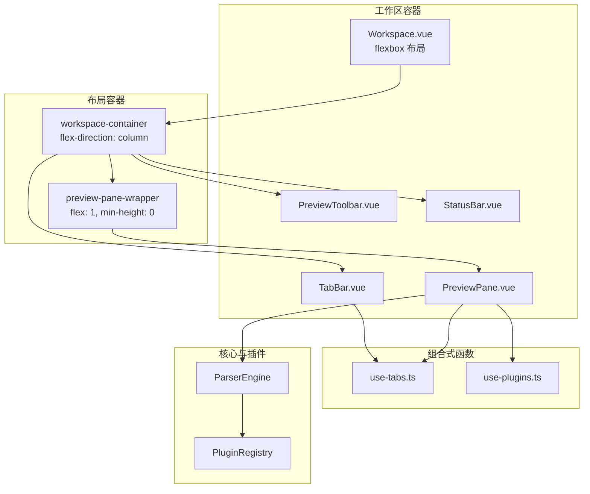
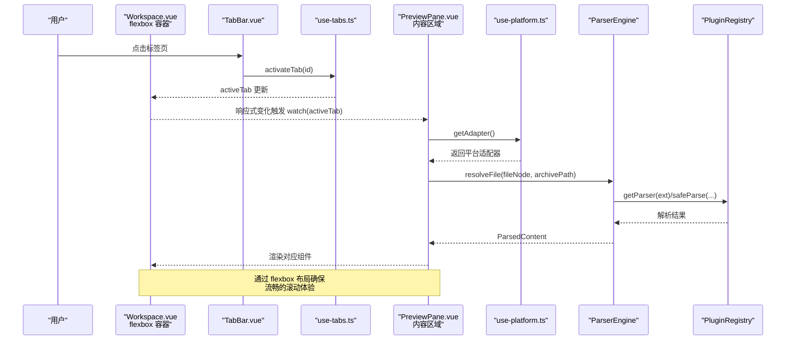
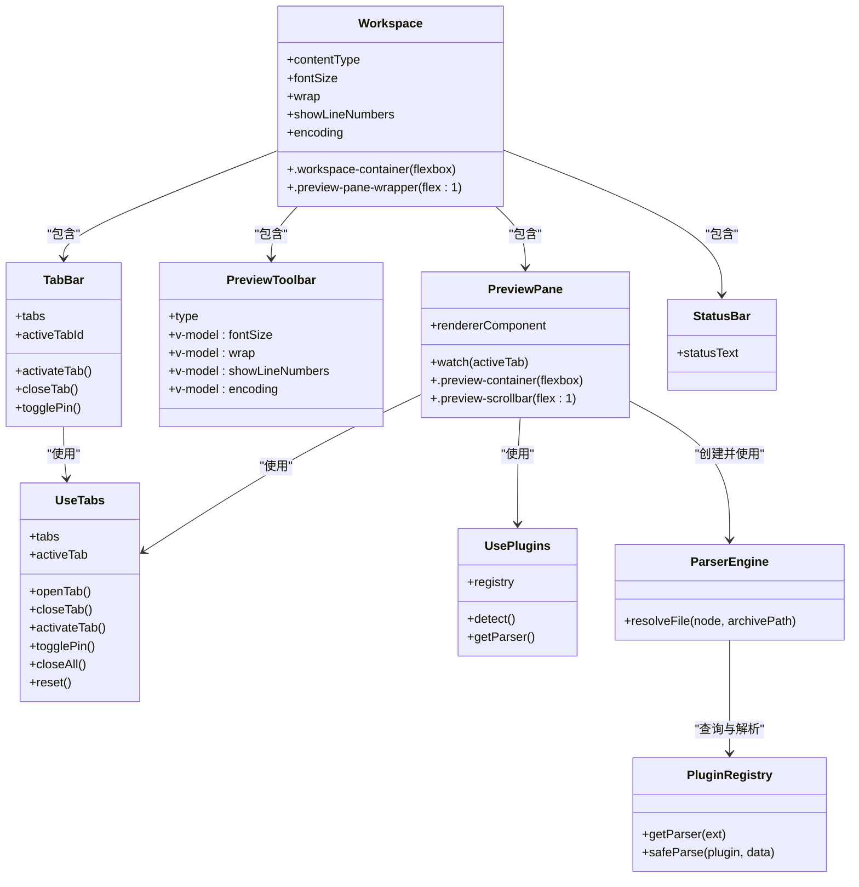

# 主工作区组件

<cite>
**本文引用的文件**   
- [Workspace.vue](file://src/components/workspace/Workspace.vue)
- [TabBar.vue](file://src/components/workspace/TabBar.vue)
- [PreviewPane.vue](file://src/components/workspace/PreviewPane.vue)
- [PreviewToolbar.vue](file://src/components/workspace/PreviewToolbar.vue)
- [StatusBar.vue](file://src/components/workspace/StatusBar.vue)
- [use-tabs.ts](file://src/composables/use-tabs.ts)
- [use-plugins.ts](file://src/composables/use-plugins.ts)
- [parser-engine.ts](file://src/core/parser-engine.ts)
- [registry.ts](file://src/plugins/registry.ts)
- [index.ts（类型定义）](file://src/types/index.ts)
</cite>

## 更新摘要
**变更内容**   
- 更新了 Workspace.vue 的布局架构，添加了结构性改进以确保流畅滚动和响应式行为
- 新增了 flexbox 布局配置，优化了组件间的空间分配
- 完善了预览面板的容器管理，提升了用户体验
- 增强了整体布局的响应式特性

## 目录
1. [简介](#简介)
2. [项目结构](#项目结构)
3. [核心组件与职责](#核心组件与职责)
4. [架构总览](#架构总览)
5. [详细组件分析](#详细组件分析)
6. [依赖关系分析](#依赖关系分析)
7. [性能考量](#性能考量)
8. [故障排查指南](#故障排查指南)
9. [结论](#结论)
10. [附录：配置选项与最佳实践](#附录配置选项与最佳实践)

## 简介
本文件围绕主工作区组件 Workspace.vue，系统性阐述其作为"工作区容器"的核心职责：组织子组件、管理布局、维护渲染配置状态、根据活动标签页内容类型动态选择渲染模式，以及与标签页、插件引擎、平台适配器的协作流程。文档同时提供架构图、时序图、流程图和类图，帮助读者从高层到代码级全面理解该组件及其周边生态。

**更新** 组件现已采用优化的 flexbox 布局架构，通过适当的包装容器和样式配置，确保了流畅的滚动体验和响应式行为。

## 项目结构
工作区相关的前端实现集中在 src/components/workspace 下，配合组合式函数 use-tabs、use-plugins 以及核心解析器 ParserEngine 与插件注册表 PluginRegistry，形成"标签页驱动 + 插件化渲染"的架构。

**图表来源**
- [Workspace.vue:21-36](file://src/components/workspace/Workspace.vue#L21-L36)
- [Workspace.vue:39-52](file://src/components/workspace/Workspace.vue#L39-L52)
- [TabBar.vue:1-33](file://src/components/workspace/TabBar.vue#L1-L33)
- [PreviewPane.vue:1-74](file://src/components/workspace/PreviewPane.vue#L1-L74)
- [PreviewToolbar.vue:1-52](file://src/components/workspace/PreviewToolbar.vue#L1-L52)
- [StatusBar.vue:1-35](file://src/components/workspace/StatusBar.vue#L1-L35)
- [use-tabs.ts:1-64](file://src/composables/use-tabs.ts#L1-L64)
- [use-plugins.ts:1-17](file://src/composables/use-plugins.ts#L1-L17)
- [parser-engine.ts:1-35](file://src/core/parser-engine.ts#L1-L35)
- [registry.ts:1-118](file://src/plugins/registry.ts#L1-L118)

## 核心组件与职责
- **Workspace.vue**：工作区容器，负责整体布局、子组件编排、预览工具栏配置项的状态管理与传递、基于活动标签页内容类型的渲染模式计算。**新增** 采用 flexbox 布局架构，通过 `.workspace-container` 和 `.preview-pane-wrapper` 容器确保流畅的滚动体验。
- **TabBar.vue**：标签页展示与交互，使用 use-tab-manager 提供的 tabs、activeTabId 等状态进行切换、关闭、置顶等操作。
- **PreviewToolbar.vue**：预览工具栏，暴露字号、换行、行号、编码等可配置项，通过 v-model 双向绑定至父组件状态。
- **PreviewPane.vue**：预览面板，监听活动标签页变化，按需加载文件内容并选择对应渲染组件；包含错误边界与滚动容器。**优化** 内部采用独立的 flexbox 布局，确保内容区域正确填充剩余空间。
- **StatusBar.vue**：状态栏，汇总显示行数、加载耗时、使用的插件名称等信息。

**章节来源**
- [Workspace.vue:1-53](file://src/components/workspace/Workspace.vue#L1-L53)
- [TabBar.vue:1-33](file://src/components/workspace/TabBar.vue#L1-L33)
- [PreviewToolbar.vue:1-52](file://src/components/workspace/PreviewToolbar.vue#L1-L52)
- [PreviewPane.vue:1-74](file://src/components/workspace/PreviewPane.vue#L1-L74)
- [StatusBar.vue:1-35](file://src/components/workspace/StatusBar.vue#L1-L35)

## 架构总览
工作区采用"标签页驱动 + 插件化渲染"的架构，并通过优化的 flexbox 布局确保良好的用户体验：
- **布局架构**：Workspace 作为根容器，使用 `flex-direction: column` 垂直排列各子组件，通过 `overflow: hidden` 防止整体滚动。
- **内容区域**：PreviewPane 包裹在 `.preview-pane-wrapper` 中，使用 `flex: 1` 和 `min-height: 0` 确保正确填充剩余空间。
- **标签页由 use-tabs 统一管理**，决定当前活动标签与内容。
- **预览面板在标签页激活时**，通过 Platform 适配器读取文件数据，交由 ParserEngine 结合 PluginRegistry 解析为结构化内容。
- **渲染组件由插件注册表按扩展名动态选择**，并通过 PreviewPane 以动态组件形式挂载。
- **工具栏配置项**（字号、换行、行号、编码）由 Workspace 集中维护，并以 v-model 传递给 PreviewToolbar，供渲染层消费。

**图表来源**
- [Workspace.vue:21-36](file://src/components/workspace/Workspace.vue#L21-L36)
- [Workspace.vue:39-52](file://src/components/workspace/Workspace.vue#L39-L52)
- [TabBar.vue:1-33](file://src/components/workspace/TabBar.vue#L1-L33)
- [use-tabs.ts:1-64](file://src/composables/use-tabs.ts#L1-L64)
- [PreviewPane.vue:1-74](file://src/components/workspace/PreviewPane.vue#L1-L74)
- [use-platform.ts:1-25](file://src/composables/use-platform.ts#L1-L25)
- [parser-engine.ts:1-35](file://src/core/parser-engine.ts#L1-L35)
- [registry.ts:1-118](file://src/plugins/registry.ts#L1-L118)

## 详细组件分析

### Workspace.vue：工作区容器
- **子组件组织与布局**
  - **顶部**：TabBar 用于标签页导航。
  - **中部**：PreviewToolbar 仅在存在活动标签且包含内容时显示，承载字体大小、换行、行号、编码等配置。
  - **主体**：PreviewPane 包裹在 `.preview-pane-wrapper` 容器中，负责实际内容渲染。
  - **底部**：StatusBar 显示统计信息。
- **Flexbox 布局架构**
  - **`.workspace-container`**：根容器，设置 `height: 100%`、`display: flex`、`flex-direction: column`、`overflow: hidden`，确保整个工作区占满高度并防止整体滚动。
  - **`.preview-pane-wrapper`**：内容区域容器，设置 `flex: 1`、`min-height: 0`、`overflow: hidden`，确保预览面板正确填充剩余空间并提供独立滚动。
- **状态管理**
  - 本地响应式状态：fontSize、wrap、showLineNumbers、encoding，均通过 v-model 与 PreviewToolbar 双向绑定。
  - contentType 计算属性：基于 activeTab.value?.content?.type 推导，若为空则回退为 text，从而决定工具栏控件的可见性与行为。
- **生命周期与响应式**
  - 组件初始化即导入 useTabManager 获取 activeTab，随后 computed 与模板中的条件渲染自动响应。
  - 工具栏的显隐受 activeTab?.content 控制，避免无内容时出现多余 UI。
- **与其他组件的集成**
  - 与 TabBar 共享标签页状态（通过 use-tabs）。
  - 与 PreviewToolbar 通过 props/type 与 v-model 传递配置。
  - 与 PreviewPane 共同消费 activeTab 的变化，后者负责内容加载与渲染。

**更新** 通过引入适当的包装容器和 flexbox 配置，显著改善了布局的响应性和滚动体验。

**章节来源**
- [Workspace.vue:1-53](file://src/components/workspace/Workspace.vue#L1-L53)
- [PreviewToolbar.vue:1-52](file://src/components/workspace/PreviewToolbar.vue#L1-L52)
- [use-tabs.ts:1-64](file://src/composables/use-tabs.ts#L1-L64)

### TabBar.vue：标签页导航
- 使用 NTabs 展示标签列表，支持关闭与置顶标记。
- 通过 use-tab-manager 暴露的 tabs、activeTabId、activateTab、closeTab、togglePin 等方法完成交互。
- 当没有标签页时，显示占位提示引导用户打开文件。

**章节来源**
- [TabBar.vue:1-33](file://src/components/workspace/TabBar.vue#L1-L33)
- [use-tabs.ts:1-64](file://src/composables/use-tabs.ts#L1-L64)

### PreviewToolbar.vue：预览工具栏
- 暴露四个可配置项：
  - fontSize：数字输入，范围限制。
  - wrap：文本/十六进制模式下显示，控制是否换行。
  - showLineNumbers：文本/十六进制模式下显示，控制是否显示行号。
  - encoding：下拉选择，提供 UTF-8、GBK、Shift_JIS 等选项。
- 通过 defineModel 与父组件双向绑定，确保配置变更即时生效。
- 根据 type 动态显示部分控件，例如仅对 text/hex 类型显示换行与行号开关。

**章节来源**
- [PreviewToolbar.vue:1-52](file://src/components/workspace/PreviewToolbar.vue#L1-L52)
- [Workspace.vue:1-53](file://src/components/workspace/Workspace.vue#L1-L53)

### PreviewPane.vue：预览面板与渲染管线
- **监听 activeTab 变化**：
  - 若无活动标签或已有 content，直接跳过。
  - 否则调用 getAdapter 获取平台适配器，构造 ParserEngine，并调用 resolveFile 异步加载与解析文件。
  - 将解析结果写入 tab.content，以便渲染。
- **渲染组件选择**：
  - 根据活动标签的文件扩展名，查询 registry.getParser(ext)，得到渲染组件。
  - 使用动态组件 <component :is="..."> 挂载渲染器，并将 content.data 传入。
- **错误处理与用户体验**：
  - 外层包裹 ErrorBoundary，防止渲染异常影响整个工作区。
  - 使用 NScrollbar 提供滚动体验。
  - 空态与加载中状态分别给出友好提示。
- **内部布局优化**：
  - 采用独立的 flexbox 布局，`.preview-container` 设置 `height: 100%`、`display: flex`、`flex-direction: column`、`overflow: hidden`。
  - `.preview-scrollbar` 使用 `flex: 1`、`min-height: 0` 确保滚动容器正确填充空间。

**图表来源**
- [PreviewPane.vue:1-74](file://src/components/workspace/PreviewPane.vue#L1-L74)
- [use-platform.ts:1-25](file://src/composables/use-platform.ts#L1-L25)
- [parser-engine.ts:1-35](file://src/core/parser-engine.ts#L1-L35)
- [registry.ts:1-118](file://src/plugins/registry.ts#L1-L118)

**章节来源**
- [PreviewPane.vue:1-74](file://src/components/workspace/PreviewPane.vue#L1-L74)
- [use-platform.ts:1-25](file://src/composables/use-platform.ts#L1-L25)
- [parser-engine.ts:1-35](file://src/core/parser-engine.ts#L1-L35)
- [registry.ts:1-118](file://src/plugins/registry.ts#L1-L118)

### StatusBar.vue：状态栏
- 基于 activeTab.content 聚合显示：
  - 行数（lineCount）
  - 加载耗时（loadTimeMs）
  - 使用的插件名称（pluginName）
- 当无内容时显示"无内容"。

**章节来源**
- [StatusBar.vue:1-35](file://src/components/workspace/StatusBar.vue#L1-L35)
- [index.ts（类型定义）:26-32](file://src/types/index.ts#L26-L32)

## 依赖关系分析
- **组件耦合**
  - Workspace 与 TabBar、PreviewToolbar、PreviewPane、StatusBar 之间通过组合式函数 use-tabs 共享标签页状态，降低直接耦合。
  - PreviewPane 依赖 use-plugins 与 use-platform 获取插件与平台能力，再通过 ParserEngine 与 PluginRegistry 完成解析与渲染。
- **外部依赖**
  - Naive UI 提供基础 UI 组件（NTabs、NInputNumber、NSwitch、NSelect、NText、NEmpty、NScrollbar）。
  - splitpanes 提供 SplitView 能力（当前未在主工作区直接使用，但已具备复用能力）。
- **潜在循环依赖**
  - 当前结构未见循环引用；use-tabs 为纯状态模块，被多个组件消费。

**图表来源**
- [Workspace.vue:1-53](file://src/components/workspace/Workspace.vue#L1-L53)
- [TabBar.vue:1-33](file://src/components/workspace/TabBar.vue#L1-L33)
- [PreviewToolbar.vue:1-52](file://src/components/workspace/PreviewToolbar.vue#L1-L52)
- [PreviewPane.vue:1-74](file://src/components/workspace/PreviewPane.vue#L1-L74)
- [StatusBar.vue:1-35](file://src/components/workspace/StatusBar.vue#L1-L35)
- [use-tabs.ts:1-64](file://src/composables/use-tabs.ts#L1-L64)
- [use-plugins.ts:1-17](file://src/composables/use-plugins.ts#L1-L17)
- [parser-engine.ts:1-35](file://src/core/parser-engine.ts#L1-L35)
- [registry.ts:1-118](file://src/plugins/registry.ts#L1-L118)

**章节来源**
- [use-tabs.ts:1-64](file://src/composables/use-tabs.ts#L1-L64)
- [use-plugins.ts:1-17](file://src/composables/use-plugins.ts#L1-L17)
- [parser-engine.ts:1-35](file://src/core/parser-engine.ts#L1-L35)
- [registry.ts:1-118](file://src/plugins/registry.ts#L1-L118)

## 性能考量
- **懒加载与缓存**
  - PreviewPane 中通过 Promise 缓存 enginePromise，避免重复创建 ParserEngine 实例，减少初始化开销。
- **解析超时保护**
  - PluginRegistry.safeParse 内置超时机制，防止解析阻塞导致界面卡死，并在失败时回退为十六进制视图，保证可用性。
- **渲染优化**
  - 使用 NEmpty 与 NScrollbar 提升空态与大数据量场景下的体验。
  - 动态组件按需挂载，避免一次性渲染所有渲染器。
- **布局性能优化**
  - **新增** 通过 flexbox 布局避免不必要的重排重绘，确保流畅的用户交互。
  - 使用 `min-height: 0` 解决 flex 子元素溢出问题，提升滚动性能。
- **建议**
  - 对于超大文件，可在 ParserEngine 层面引入分块读取与增量渲染策略。
  - 针对频繁切换标签页的场景，可对已解析的 content 做内存缓存，避免重复 I/O。

## 故障排查指南
- **标签页无法切换**
  - 检查 use-tabs 的 activeTabId 是否正确更新，确认 TabBar 的 @update:value 事件是否触发 activateTab。
- **预览面板一直显示"加载中..."**
  - 确认 activeTab.fileNode.path 有效，平台适配器能正确读取文件。
  - 查看 PluginRegistry.safeParse 是否因超时或异常回退为 hex。
- **渲染组件未显示**
  - 检查文件扩展名是否能匹配到注册的解析器，确认 registry.getParser(ext) 返回值。
- **工具栏配置无效**
  - 确认 Workspace 的 v-model 绑定与 PreviewToolbar 的 defineModel 字段一致。
  - 检查 contentType 计算属性是否正确反映 activeTab.content.type。
- **布局问题**
  - **新增** 检查 `.workspace-container` 和 `.preview-pane-wrapper` 的 flexbox 配置是否正确应用。
  - 确认 `overflow: hidden` 设置是否阻止了意外的滚动行为。
  - 验证 `flex: 1` 和 `min-height: 0` 是否正确解决了内容溢出问题。

**章节来源**
- [PreviewPane.vue:1-74](file://src/components/workspace/PreviewPane.vue#L1-L74)
- [registry.ts:1-118](file://src/plugins/registry.ts#L1-L118)
- [Workspace.vue:1-53](file://src/components/workspace/Workspace.vue#L1-L53)

## 结论
Workspace.vue 作为工作区容器，承担了布局编排、状态集中管理与渲染模式决策的职责。**经过结构性改进后**，通过引入适当的 flexbox 布局架构和容器管理，显著提升了用户体验。组件间通过 use-tabs、use-plugins 及 ParserEngine/PluginRegistry 的协作，实现了"标签页驱动 + 插件化渲染"的高内聚、低耦合架构。工具栏配置项通过 v-model 双向绑定，保证了配置的即时生效与一致性。整体设计具备良好的可扩展性、容错性和响应式特性，适合持续演进更多文件类型与渲染模式。

## 附录：配置选项与最佳实践

- **配置选项**
  - fontSize：数字，默认值 14，范围建议 10~24。
  - wrap：布尔，默认 false，适用于文本与十六进制模式。
  - showLineNumbers：布尔，默认 true，适用于文本与十六进制模式。
  - encoding：字符串，可选 utf-8、gbk、shift_jis，默认 utf-8。
- **使用示例**
  - 在 Workspace 中声明 ref 状态并通过 v-model 绑定至 PreviewToolbar，即可实现跨组件的配置同步。
  - 根据 contentType 动态显示工具栏控件，避免无关设置干扰用户。
- **最佳实践**
  - 将渲染相关的配置尽量上移至容器组件，便于统一管理与持久化。
  - 对解析过程增加超时与降级策略，保障稳定性。
  - 利用动态组件与插件注册表扩展新的文件类型，无需改动工作区核心逻辑。
  - 在大型项目中，考虑将配置持久化到本地存储，以提升用户体验。
  - **新增** 使用 flexbox 布局时，确保设置 `min-height: 0` 以避免 flex 子元素的溢出问题。
  - **新增** 通过 `overflow: hidden` 和适当的容器管理，确保滚动行为的可预测性。

**章节来源**
- [PreviewToolbar.vue:1-52](file://src/components/workspace/PreviewToolbar.vue#L1-L52)
- [Workspace.vue:1-53](file://src/components/workspace/Workspace.vue#L1-L53)
- [registry.ts:1-118](file://src/plugins/registry.ts#L1-L118)