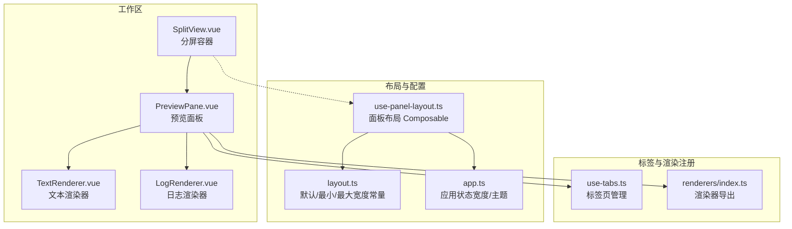
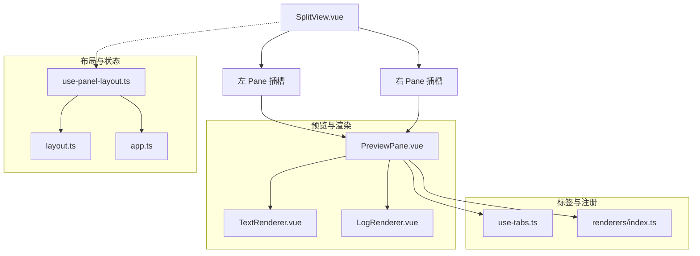
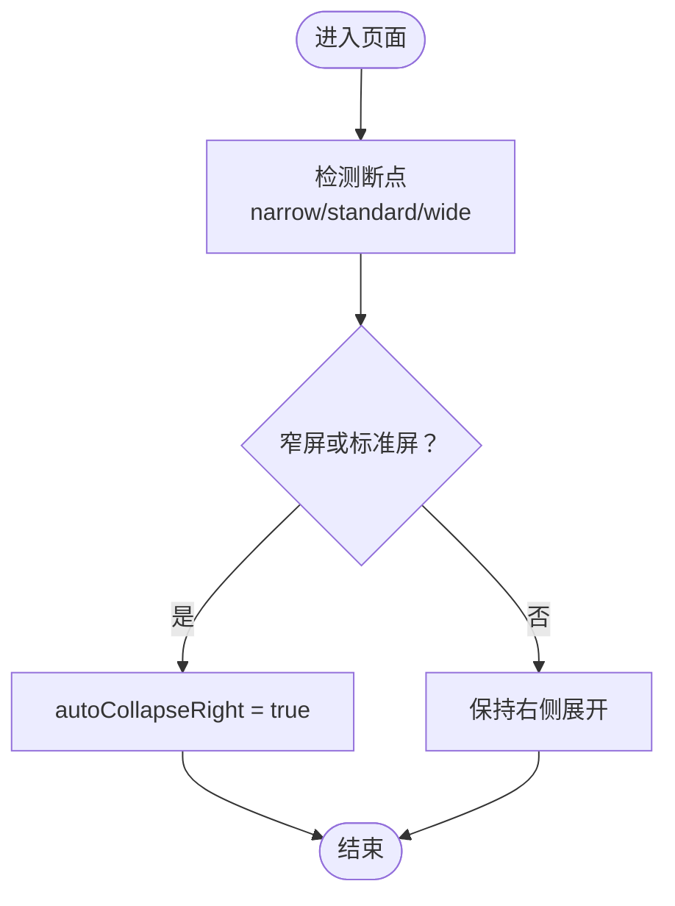
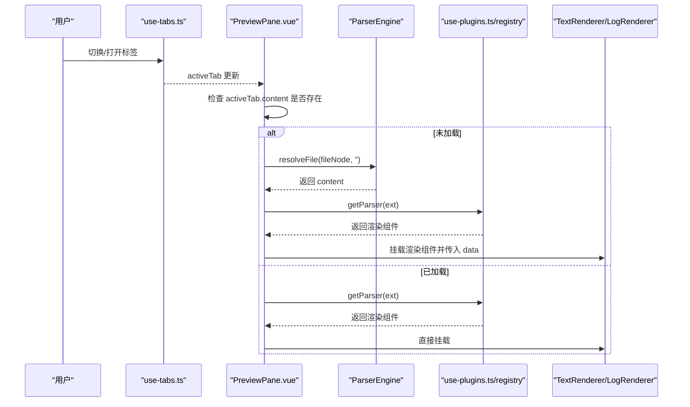
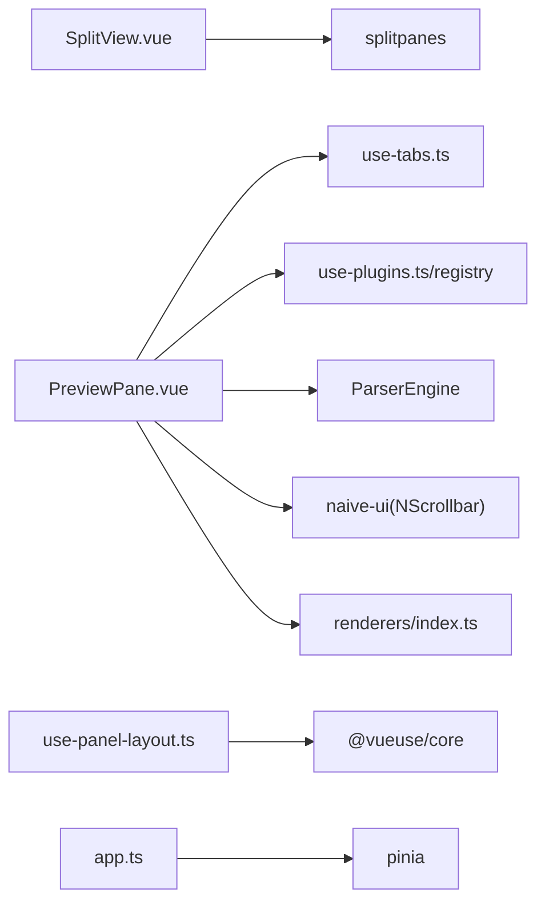

# 分屏视图组件

<cite>
**本文引用的文件**   
- [SplitView.vue](file://src/components/workspace/SplitView.vue)
- [use-panel-layout.ts](file://src/composables/use-panel-layout.ts)
- [layout.ts](file://src/config/layout.ts)
- [PreviewPane.vue](file://src/components/workspace/PreviewPane.vue)
- [TextRenderer.vue](file://src/views/renderers/TextRenderer.vue)
- [LogRenderer.vue](file://src/views/renderers/LogRenderer.vue)
- [index.ts（渲染器导出）](file://src/views/renderers/index.ts)
- [use-tabs.ts](file://src/composables/use-tabs.ts)
- [AppLayout.vue](file://src/layout/AppLayout.vue)
- [app.ts（应用状态存储）](file://src/stores/app.ts)
</cite>

## 目录
1. [简介](#简介)
2. [项目结构](#项目结构)
3. [核心组件与能力](#核心组件与能力)
4. [架构总览](#架构总览)
5. [详细组件分析](#详细组件分析)
6. [依赖关系分析](#依赖关系分析)
7. [性能优化策略](#性能优化策略)
8. [故障排查指南](#故障排查指南)
9. [结论](#结论)
10. [附录：配置与主题适配](#附录配置与主题适配)

## 简介
本文件围绕 SplitView.vue 分屏视图组件，系统化阐述其布局实现、面板分割比例调整与拖拽重定位机制、同步滚动联动方案、分屏状态管理与持久化策略、不同内容类型的对比展示方式（如代码差异比较与日志并行查看）、性能优化手段，以及自定义配置与主题适配、移动端与触摸设备适配方案。文档同时提供可视化图示与源码路径引用，便于快速定位实现细节。

## 项目结构
与分屏视图相关的核心文件分布如下：
- 分屏容器：SplitView.vue
- 布局控制 Composable：use-panel-layout.ts
- 布局常量配置：layout.ts
- 预览面板与渲染管线：PreviewPane.vue、各 Renderer
- 标签页管理：use-tabs.ts
- 全局样式与侧边面板布局：AppLayout.vue
- 应用级状态（宽度等）：app.ts

图表来源
- [SplitView.vue:1-14](file://src/components/workspace/SplitView.vue#L1-L14)
- [PreviewPane.vue:1-58](file://src/components/workspace/PreviewPane.vue#L1-L58)
- [TextRenderer.vue:1-38](file://src/views/renderers/TextRenderer.vue#L1-L38)
- [LogRenderer.vue:1-57](file://src/views/renderers/LogRenderer.vue#L1-L57)
- [use-panel-layout.ts:1-38](file://src/composables/use-panel-layout.ts#L1-L38)
- [layout.ts:1-9](file://src/config/layout.ts#L1-L9)
- [app.ts:1-56](file://src/stores/app.ts#L1-L56)
- [use-tabs.ts:1-64](file://src/composables/use-tabs.ts#L1-L64)
- [index.ts（渲染器导出）:1-5](file://src/views/renderers/index.ts#L1-L5)

章节来源
- [SplitView.vue:1-14](file://src/components/workspace/SplitView.vue#L1-L14)
- [use-panel-layout.ts:1-38](file://src/composables/use-panel-layout.ts#L1-L38)
- [layout.ts:1-9](file://src/config/layout.ts#L1-L9)
- [PreviewPane.vue:1-58](file://src/components/workspace/PreviewPane.vue#L1-L58)
- [TextRenderer.vue:1-38](file://src/views/renderers/TextRenderer.vue#L1-L38)
- [LogRenderer.vue:1-57](file://src/views/renderers/LogRenderer.vue#L1-L57)
- [use-tabs.ts:1-64](file://src/composables/use-tabs.ts#L1-L64)
- [index.ts（渲染器导出）:1-5](file://src/views/renderers/index.ts#L1-L5)
- [AppLayout.vue:288-331](file://src/layout/AppLayout.vue#L288-L331)
- [app.ts:1-56](file://src/stores/app.ts#L1-L56)

## 核心组件与能力
- 分屏容器 SplitView.vue
  - 基于 splitpanes 的左右双 Pane 布局，提供插槽 left/right 供上层注入内容。
  - 通过 min-size 约束最小尺寸，确保可交互性与可读性。
- 布局控制 use-panel-layout.ts
  - 暴露折叠/展开、宽度设置、断点判断等能力，支持自动收起右侧面板在窄屏/标准屏下。
- 配置 layout.ts
  - 定义默认宽度与最小/最大宽度常量，为 UI 与状态层提供统一边界。
- 预览与渲染 PreviewPane.vue + renderers/*
  - 根据当前激活标签的内容类型动态选择渲染器，使用 Naive UI 的滚动条包裹以提升滚动体验。
- 标签页 use-tabs.ts
  - 管理打开/关闭/激活标签，驱动预览面板加载对应内容。
- 应用状态 app.ts
  - 集中管理左侧/右侧面板宽度、主题开关、插件禁用列表等。
- 全局布局 AppLayout.vue
  - 定义侧面板宽度、折叠态样式与过渡动画，配合主题变量。

章节来源
- [SplitView.vue:1-14](file://src/components/workspace/SplitView.vue#L1-L14)
- [use-panel-layout.ts:1-38](file://src/composables/use-panel-layout.ts#L1-L38)
- [layout.ts:1-9](file://src/config/layout.ts#L1-L9)
- [PreviewPane.vue:1-58](file://src/components/workspace/PreviewPane.vue#L1-L58)
- [use-tabs.ts:1-64](file://src/composables/use-tabs.ts#L1-L64)
- [app.ts:1-56](file://src/stores/app.ts#L1-L56)
- [AppLayout.vue:288-331](file://src/layout/AppLayout.vue#L288-L331)

## 架构总览
下图展示了分屏视图与相关模块的协作关系：SplitView 作为容器承载左右两个 Pane；PreviewPane 负责根据标签页内容类型动态渲染；use-panel-layout 提供布局控制；app.ts 维护面板宽度等全局状态；AppLayout 提供侧边面板样式与过渡。

图表来源
- [SplitView.vue:1-14](file://src/components/workspace/SplitView.vue#L1-L14)
- [PreviewPane.vue:1-58](file://src/components/workspace/PreviewPane.vue#L1-L58)
- [TextRenderer.vue:1-38](file://src/views/renderers/TextRenderer.vue#L1-L38)
- [LogRenderer.vue:1-57](file://src/views/renderers/LogRenderer.vue#L1-L57)
- [use-panel-layout.ts:1-38](file://src/composables/use-panel-layout.ts#L1-L38)
- [layout.ts:1-9](file://src/config/layout.ts#L1-L9)
- [app.ts:1-56](file://src/stores/app.ts#L1-L56)
- [use-tabs.ts:1-64](file://src/composables/use-tabs.ts#L1-L64)
- [index.ts（渲染器导出）:1-5](file://src/views/renderers/index.ts#L1-L5)

## 详细组件分析

### 分屏容器 SplitView.vue
- 职责
  - 提供左右双 Pane 的分屏容器，通过插槽将具体业务内容注入到两侧。
  - 使用 splitpanes 提供的拖拽分隔条进行面板尺寸调整。
- 关键特性
  - 最小尺寸限制：min-size 保证面板不被拖至不可用状态。
  - 高度自适应：外层容器高度 100%，确保占满父区域。
- 扩展建议
  - 可在 Splitpanes 上绑定 on-resize 事件以持久化面板比例。
  - 可通过 props 传入方向（水平/垂直）或是否启用最大化双击行为。

章节来源
- [SplitView.vue:1-14](file://src/components/workspace/SplitView.vue#L1-L14)

### 布局控制 use-panel-layout.ts
- 职责
  - 管理左右面板的折叠/展开状态与宽度。
  - 基于断点计算是否需要自动收起右侧面板。
- 关键 API
  - collapseLeft / expandLeft / collapseRight / expandRight
  - setLeftWidth / setRightWidth（带最小/最大边界校验）
  - isNarrow / isStandard / autoCollapseRight
- 与配置的关系
  - 宽度边界与 layout.ts 中的常量保持一致，避免越界。

图表来源
- [use-panel-layout.ts:1-38](file://src/composables/use-panel-layout.ts#L1-L38)
- [layout.ts:1-9](file://src/config/layout.ts#L1-L9)

章节来源
- [use-panel-layout.ts:1-38](file://src/composables/use-panel-layout.ts#L1-L38)
- [layout.ts:1-9](file://src/config/layout.ts#L1-L9)

### 预览面板与渲染管线 PreviewPane.vue + renderers/*
- 职责
  - 监听 activeTab 变化，按需解析并缓存内容，再根据文件扩展名选择对应渲染器。
  - 使用 NScrollbar 包裹渲染内容，提升滚动体验。
- 渲染流程
  - 当 activeTab 变更且尚未加载 content 时，调用 ParserEngine 解析文件并写入 tab.content。
  - 根据扩展名从 registry 获取渲染组件并挂载。

图表来源
- [PreviewPane.vue:1-58](file://src/components/workspace/PreviewPane.vue#L1-L58)
- [use-tabs.ts:1-64](file://src/composables/use-tabs.ts#L1-L64)
- [index.ts（渲染器导出）:1-5](file://src/views/renderers/index.ts#L1-L5)
- [TextRenderer.vue:1-38](file://src/views/renderers/TextRenderer.vue#L1-L38)
- [LogRenderer.vue:1-57](file://src/views/renderers/LogRenderer.vue#L1-L57)

章节来源
- [PreviewPane.vue:1-58](file://src/components/workspace/PreviewPane.vue#L1-L58)
- [use-tabs.ts:1-64](file://src/composables/use-tabs.ts#L1-L64)
- [index.ts（渲染器导出）:1-5](file://src/views/renderers/index.ts#L1-L5)
- [TextRenderer.vue:1-38](file://src/views/renderers/TextRenderer.vue#L1-L38)
- [LogRenderer.vue:1-57](file://src/views/renderers/LogRenderer.vue#L1-L57)

### 分屏状态管理与持久化
- 状态来源
  - 面板宽度由 app.ts 中的 leftPanelWidth/rightPanelWidth 管理，并提供 setLeftPanelWidth/setRightPanelWidth 方法，内部对值进行最小/最大边界限制。
  - 布局常量来自 layout.ts，确保 UI 与逻辑一致。
- 持久化建议
  - 在 Splitpanes 的 on-resize 回调中调用 app.ts 的 setter，并将结果写入 localStorage/sessionStorage 或后端配置中心，下次启动时恢复。
  - 结合 use-panel-layout.ts 的断点逻辑，在窄屏下可强制收起右侧面板并在本地记录该偏好。

章节来源
- [app.ts:1-56](file://src/stores/app.ts#L1-L56)
- [layout.ts:1-9](file://src/config/layout.ts#L1-L9)

### 不同内容类型的分屏对比
- 文本对比
  - 左右 Pane 分别挂载 TextRenderer，用于对照两段文本的差异。
- 日志并行查看
  - 左右 Pane 分别挂载 LogRenderer，便于并行浏览两份日志流。
- 其他类型
  - 通过 registry 扩展新的渲染器（如 CSV/JSON），即可在分屏中进行并列对比。

章节来源
- [TextRenderer.vue:1-38](file://src/views/renderers/TextRenderer.vue#L1-L38)
- [LogRenderer.vue:1-57](file://src/views/renderers/LogRenderer.vue#L1-L57)
- [index.ts（渲染器导出）:1-5](file://src/views/renderers/index.ts#L1-L5)

### 同步滚动机制（两面板联动）
- 设计思路
  - 在 SplitView 的左右 Pane 内分别获取各自的可滚动容器（例如 NScrollbar 或渲染器根元素）。
  - 监听一侧容器的 scroll 事件，按行高或百分比映射到另一侧容器的 scrollTop，触发滚动。
- 注意事项
  - 防抖/节流：避免高频滚动事件导致重复渲染。
  - 行高一致性：文本/日志渲染需固定行高或使用等宽字体，以保证行号对齐。
  - 懒加载/虚拟滚动：大数据量场景下建议使用虚拟列表减少 DOM 节点数量。
  - 滚动锚点：在切换标签或重置内容后，必要时同步滚动位置。

[本节为通用实现指导，不直接分析具体文件]

### 触摸设备与移动端适配
- 断点与自动收起
  - use-panel-layout.ts 基于 @vueuse/core 的 useBreakpoints 提供 narrow/standard/wide 三种断点，并在窄屏/标准屏下自动收起右侧面板，提升小屏可用性。
- 手势与拖拽
  - splitpanes 原生支持触摸拖拽分隔条，无需额外处理。
- 布局与样式
  - AppLayout.vue 定义了侧面板宽度与折叠态过渡，配合 CSS 变量实现主题适配。

章节来源
- [use-panel-layout.ts:1-38](file://src/composables/use-panel-layout.ts#L1-L38)
- [AppLayout.vue:288-331](file://src/layout/AppLayout.vue#L288-L331)

## 依赖关系分析
- 组件耦合
  - SplitView.vue 仅依赖 splitpanes 库，低耦合，易于替换或扩展。
  - PreviewPane.vue 依赖 use-tabs.ts、use-plugins.ts（registry）、ParserEngine 与各渲染器。
- 外部依赖
  - splitpanes：分屏拖拽与尺寸计算。
  - naive-ui：NScrollbar 等基础 UI 组件。
  - @vueuse/core：断点工具。
- 潜在循环依赖
  - 当前结构未见循环导入；若后续引入跨模块双向通信，需注意解耦。

图表来源
- [SplitView.vue:1-14](file://src/components/workspace/SplitView.vue#L1-L14)
- [PreviewPane.vue:1-58](file://src/components/workspace/PreviewPane.vue#L1-L58)
- [use-panel-layout.ts:1-38](file://src/composables/use-panel-layout.ts#L1-L38)
- [app.ts:1-56](file://src/stores/app.ts#L1-L56)
- [index.ts（渲染器导出）:1-5](file://src/views/renderers/index.ts#L1-L5)

章节来源
- [SplitView.vue:1-14](file://src/components/workspace/SplitView.vue#L1-L14)
- [PreviewPane.vue:1-58](file://src/components/workspace/PreviewPane.vue#L1-L58)
- [use-panel-layout.ts:1-38](file://src/composables/use-panel-layout.ts#L1-L38)
- [app.ts:1-56](file://src/stores/app.ts#L1-L56)
- [index.ts（渲染器导出）:1-5](file://src/views/renderers/index.ts#L1-L5)

## 性能优化策略
- 渲染层面
  - 按需加载：仅在 activeTab 变更且无 content 时解析文件，避免重复 IO。
  - 错误边界：使用 ErrorBoundary 包裹渲染器，防止单个渲染失败影响整体。
  - 滚动容器：使用 NScrollbar 提升滚动性能与一致性。
- 数据层面
  - 行高稳定：文本/日志渲染采用等宽字体与固定行高，利于虚拟滚动与同步滚动。
  - 大文件分页/虚拟列表：对超长文本/日志采用虚拟滚动以减少 DOM 节点。
- 交互层面
  - 防抖/节流：对 resize、scroll 事件进行节流，降低重排重绘频率。
  - 延迟初始化：非首屏内容延迟加载或懒渲染。

章节来源
- [PreviewPane.vue:1-58](file://src/components/workspace/PreviewPane.vue#L1-L58)
- [TextRenderer.vue:1-38](file://src/views/renderers/TextRenderer.vue#L1-L38)
- [LogRenderer.vue:1-57](file://src/views/renderers/LogRenderer.vue#L1-L57)

## 故障排查指南
- 预览空白或加载中卡住
  - 检查 activeTab 是否正确设置，content 是否成功解析并写入。
  - 确认 registry 能根据扩展名找到对应渲染器。
- 分屏无法拖拽或尺寸异常
  - 检查 Splitpanes 容器高度是否为 100%。
  - 确认 min-size 设置合理，避免被父容器裁剪。
- 右侧面板在小屏显示异常
  - 核对 use-panel-layout.ts 的断点与 autoCollapseRight 逻辑是否符合预期。
- 主题不一致
  - 检查 AppLayout.vue 的 CSS 变量是否与主题系统一致。

章节来源
- [PreviewPane.vue:1-58](file://src/components/workspace/PreviewPane.vue#L1-L58)
- [SplitView.vue:1-14](file://src/components/workspace/SplitView.vue#L1-L14)
- [use-panel-layout.ts:1-38](file://src/composables/use-panel-layout.ts#L1-L38)
- [AppLayout.vue:288-331](file://src/layout/AppLayout.vue#L288-L331)

## 结论
SplitView.vue 以轻量容器形态集成 splitpanes，配合 use-panel-layout.ts 的断点与宽度控制、app.ts 的状态管理，形成可扩展的分屏体系。通过 PreviewPane.vue 的动态渲染管线，可便捷地实现多类型内容的分屏对比。建议在现有基础上补充同步滚动、持久化与虚拟滚动等增强能力，以获得更流畅的大数据对比体验。

## 附录：配置与主题适配
- 布局配置
  - 默认宽度与边界：DEFAULT_LEFT_PANEL_WIDTH、DEFAULT_RIGHT_PANEL_WIDTH、MIN_*、MAX_* 等常量位于 layout.ts。
  - 运行时控制：use-panel-layout.ts 提供折叠/展开与宽度设置方法。
- 主题适配
  - AppLayout.vue 使用 CSS 变量（如 --bg-surface、--border）控制颜色与边框，便于切换明暗主题。
  - 渲染器样式遵循深色背景与等宽字体风格，确保对比度与可读性。
- 移动端适配
  - 使用 use-panel-layout.ts 的断点能力，在窄屏/标准屏下自动收起右侧面板，提升可用空间。
  - 利用 splitpanes 的触摸拖拽能力，无需额外实现手势。

章节来源
- [layout.ts:1-9](file://src/config/layout.ts#L1-L9)
- [use-panel-layout.ts:1-38](file://src/composables/use-panel-layout.ts#L1-L38)
- [AppLayout.vue:288-331](file://src/layout/AppLayout.vue#L288-L331)
- [TextRenderer.vue:1-38](file://src/views/renderers/TextRenderer.vue#L1-L38)
- [LogRenderer.vue:1-57](file://src/views/renderers/LogRenderer.vue#L1-L57)