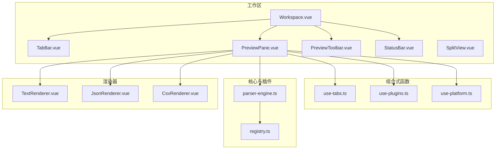
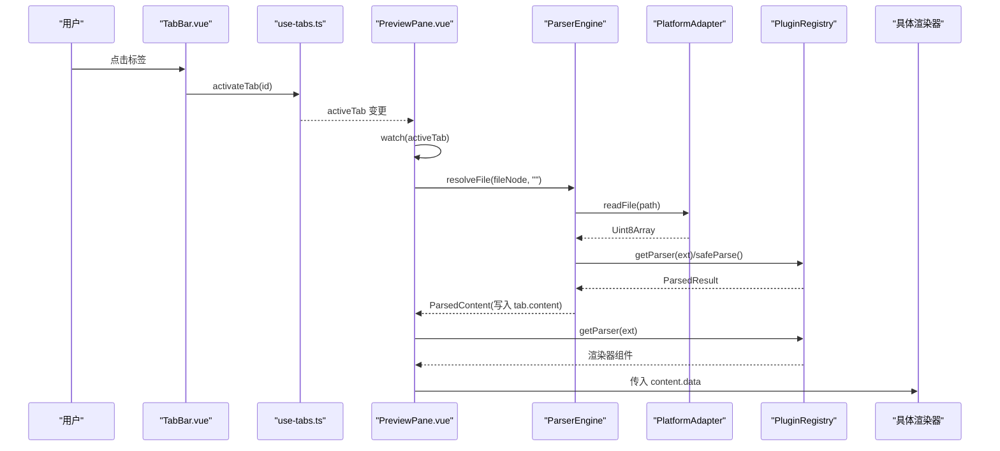
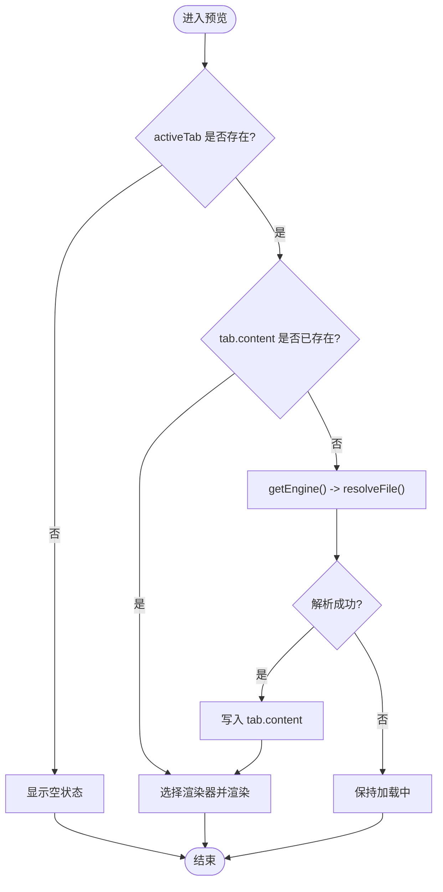
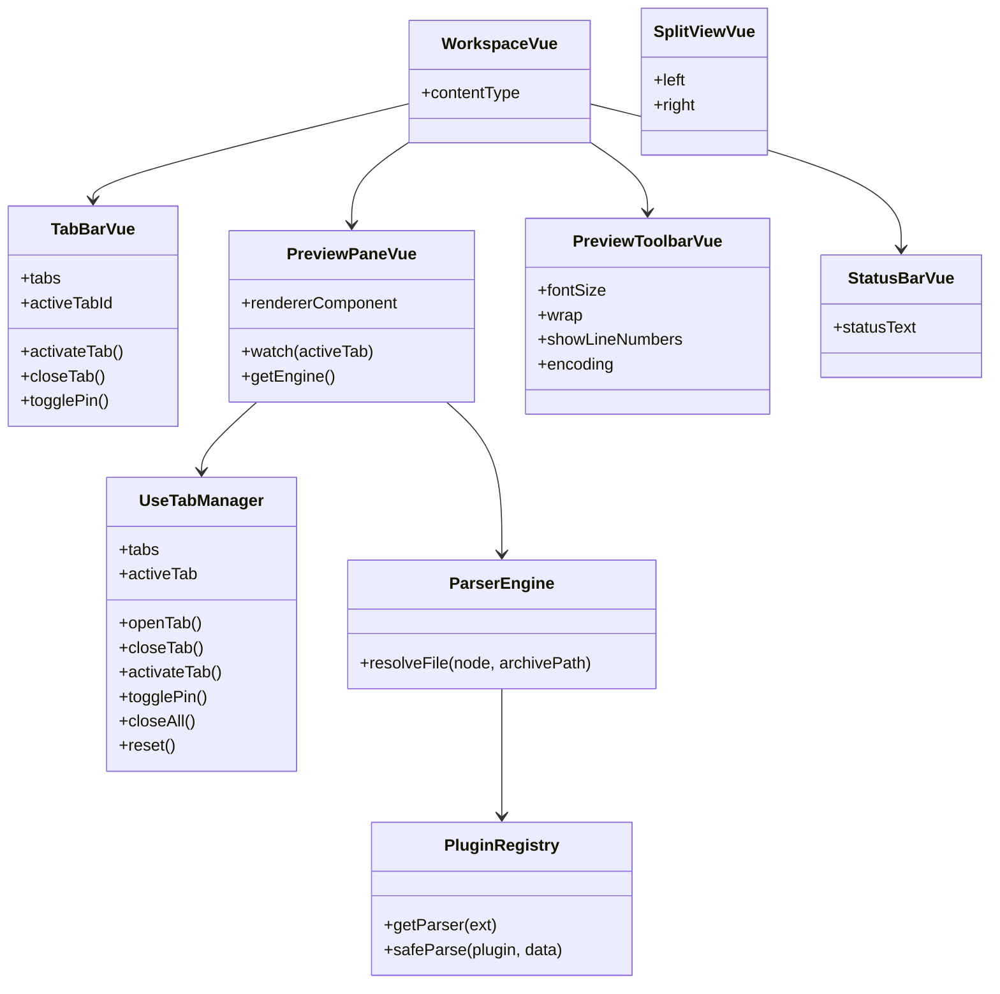

# 工作区组件

<cite>
**本文引用的文件**   
- [Workspace.vue](file://src/components/workspace/Workspace.vue)
- [TabBar.vue](file://src/components/workspace/TabBar.vue)
- [PreviewPane.vue](file://src/components/workspace/PreviewPane.vue)
- [PreviewToolbar.vue](file://src/components/workspace/PreviewToolbar.vue)
- [SplitView.vue](file://src/components/workspace/SplitView.vue)
- [StatusBar.vue](file://src/components/workspace/StatusBar.vue)
- [use-tabs.ts](file://src/composables/use-tabs.ts)
- [use-plugins.ts](file://src/composables/use-plugins.ts)
- [use-platform.ts](file://src/composables/use-platform.ts)
- [parser-engine.ts](file://src/core/parser-engine.ts)
- [registry.ts](file://src/plugins/registry.ts)
- [index.ts（类型定义）](file://src/types/index.ts)
- [ErrorBoundary.vue](file://src/components/shared/ErrorBoundary.vue)
- [TextRenderer.vue](file://src/views/renderers/TextRenderer.vue)
- [JsonRenderer.vue](file://src/views/renderers/JsonRenderer.vue)
- [CsvRenderer.vue](file://src/views/renderers/CsvRenderer.vue)
</cite>

## 目录
1. [简介](#简介)
2. [项目结构](#项目结构)
3. [核心组件](#核心组件)
4. [架构总览](#架构总览)
5. [详细组件分析](#详细组件分析)
6. [依赖关系分析](#依赖关系分析)
7. [性能与内存优化](#性能与内存优化)
8. [故障排查指南](#故障排查指南)
9. [结论](#结论)

## 简介
本文件面向 Hello-Tauri 项目的工作区子系统，聚焦以下组件与能力：
- Workspace.vue：主工作区容器，编排标签栏、预览工具栏、预览面板与状态栏。
- TabBar.vue：基于 Naive UI 的标签页管理，负责打开、切换、关闭与固定标签。
- PreviewPane.vue：根据当前活动标签动态加载并渲染内容，支持多格式插件化渲染。
- PreviewToolbar.vue：提供字号、换行、行号、编码等预览控制项。
- SplitView.vue：分屏布局容器（预留左右插槽）。
- StatusBar.vue：展示行数、加载耗时、插件名称等实时信息。

同时说明组件间数据流设计、状态同步策略，以及大文件处理与内存泄漏防护建议。

## 项目结构
工作区相关的前端代码位于 src/components/workspace 下，配合组合式函数 composables、解析引擎 core、插件注册表 plugins 与视图渲染器 views/renderers 协同工作。

图表来源
- [Workspace.vue:1-36](file://src/components/workspace/Workspace.vue#L1-L36)
- [TabBar.vue:1-33](file://src/components/workspace/TabBar.vue#L1-L33)
- [PreviewPane.vue:1-58](file://src/components/workspace/PreviewPane.vue#L1-L58)
- [PreviewToolbar.vue:1-44](file://src/components/workspace/PreviewToolbar.vue#L1-L44)
- [SplitView.vue:1-15](file://src/components/workspace/SplitView.vue#L1-L15)
- [StatusBar.vue:1-24](file://src/components/workspace/StatusBar.vue#L1-L24)
- [use-tabs.ts:1-64](file://src/composables/use-tabs.ts#L1-L64)
- [use-plugins.ts:1-17](file://src/composables/use-plugins.ts#L1-L17)
- [use-platform.ts:1-25](file://src/composables/use-platform.ts#L1-L25)
- [parser-engine.ts:1-35](file://src/core/parser-engine.ts#L1-L35)
- [registry.ts:1-118](file://src/plugins/registry.ts#L1-L118)
- [TextRenderer.vue:1-38](file://src/views/renderers/TextRenderer.vue#L1-L38)
- [JsonRenderer.vue:1-30](file://src/views/renderers/JsonRenderer.vue#L1-L30)
- [CsvRenderer.vue:1-52](file://src/views/renderers/CsvRenderer.vue#L1-L52)

章节来源
- [Workspace.vue:1-36](file://src/components/workspace/Workspace.vue#L1-L36)
- [TabBar.vue:1-33](file://src/components/workspace/TabBar.vue#L1-L33)
- [PreviewPane.vue:1-58](file://src/components/workspace/PreviewPane.vue#L1-L58)
- [PreviewToolbar.vue:1-44](file://src/components/workspace/PreviewToolbar.vue#L1-L44)
- [SplitView.vue:1-15](file://src/components/workspace/SplitView.vue#L1-L15)
- [StatusBar.vue:1-24](file://src/components/workspace/StatusBar.vue#L1-L24)

## 核心组件
- Workspace.vue：作为根容器，串联 TabBar、PreviewToolbar、PreviewPane、StatusBar；通过 useTabManager 获取 activeTab，并计算 contentType 以驱动工具栏显示。
- TabBar.vue：使用 NTabs/NTab 渲染标签列表，响应激活与关闭事件，支持固定标签不可关闭。
- PreviewPane.vue：监听 activeTab 变化，按需懒加载 ParserEngine，调用平台适配器读取文件，经插件解析后缓存到 tab.content，再根据扩展名选择对应渲染器。
- PreviewToolbar.vue：暴露 fontSize、wrap、showLineNumbers、encoding 双向绑定，按内容类型条件显示控件。
- SplitView.vue：基于 splitpanes 的分屏容器，提供 left/right 插槽，便于后续扩展对比视图或双栏编辑。
- StatusBar.vue：从 activeTab.content 中抽取行数、加载耗时、插件名，拼接为状态文本。

章节来源
- [Workspace.vue:1-36](file://src/components/workspace/Workspace.vue#L1-L36)
- [TabBar.vue:1-33](file://src/components/workspace/TabBar.vue#L1-L33)
- [PreviewPane.vue:1-58](file://src/components/workspace/PreviewPane.vue#L1-L58)
- [PreviewToolbar.vue:1-44](file://src/components/workspace/PreviewToolbar.vue#L1-L44)
- [SplitView.vue:1-15](file://src/components/workspace/SplitView.vue#L1-L15)
- [StatusBar.vue:1-24](file://src/components/workspace/StatusBar.vue#L1-L24)

## 架构总览
工作区采用“组合式函数 + 单例引擎 + 插件注册表”的轻量架构：
- 状态层：use-tab-manager 维护 tabs 与 activeTabId，提供 open/close/activate/pin/reset 等操作。
- 解析层：ParserEngine 封装平台适配与插件解析流程，统一返回 ParsedContent。
- 插件层：PluginRegistry 集中管理解析器与压缩器，提供安全解析与超时保护。
- 渲染层：PreviewPane 根据扩展名选择渲染器组件，并通过 ErrorBoundary 兜底异常。

图表来源
- [TabBar.vue:1-33](file://src/components/workspace/TabBar.vue#L1-L33)
- [use-tabs.ts:1-64](file://src/composables/use-tabs.ts#L1-L64)
- [PreviewPane.vue:1-58](file://src/components/workspace/PreviewPane.vue#L1-L58)
- [parser-engine.ts:1-35](file://src/core/parser-engine.ts#L1-L35)
- [registry.ts:1-118](file://src/plugins/registry.ts#L1-L118)

## 详细组件分析

### Workspace.vue 主工作区
- 职责：组织子组件布局，传递 activeTab 派生的 contentType 给工具栏，维持字体大小、换行、行号、编码等本地状态。
- 生命周期要点：
  - 初始化时导入各子组件与 useTabManager。
  - 通过 computed 将 activeTab.content.type 映射为工具栏可用的 type。
  - 模板侧按 activeTab?.content 存在性决定是否显示工具栏。
- 数据流：
  - 从 useTabManager 获取 activeTab。
  - 将 contentType 传递给 PreviewToolbar。
  - 其余子组件独立订阅 useTabManager 的状态。

章节来源
- [Workspace.vue:1-36](file://src/components/workspace/Workspace.vue#L1-L36)

### TabBar.vue 标签页管理
- 功能：
  - 渲染标签列表，支持关闭与切换。
  - 固定标签不可关闭。
  - 无标签时显示引导提示。
- 状态与交互：
  - 使用 useTabManager 提供的 tabs、activeTabId、activateTab、closeTab、togglePin。
  - 通过 v-model:value 与 @update:value/@close 事件同步激活态与关闭动作。
- 内存与健壮性：
  - 仅持有轻量元数据（id、fileNode、archiveId、pinned），不缓存大对象。
  - 关闭逻辑会更新 activeTabId，避免悬空引用。

章节来源
- [TabBar.vue:1-33](file://src/components/workspace/TabBar.vue#L1-L33)
- [use-tabs.ts:1-64](file://src/composables/use-tabs.ts#L1-L64)

### PreviewPane.vue 预览面板
- 功能：
  - 监听 activeTab 变化，首次或切换时按需加载文件内容。
  - 使用 ParserEngine 与 PlatformAdapter 读取并解析文件。
  - 根据扩展名从 PluginRegistry 获取渲染器组件并挂载。
  - 使用 ErrorBoundary 捕获渲染期异常并提供重试。
- 关键流程：
  - watch(activeTab, { immediate: true })：若 tab.content 为空则触发加载。
  - getEngine()：惰性创建 ParserEngine 实例，复用 Promise 避免重复构造。
  - engine.resolveFile(tab.fileNode, '')：读取文件、选择插件、安全解析并记录耗时。
  - 将结果写入 tab.content，随后由 computed 选择渲染器。
- 视图切换机制：
  - 通过 registry.getParser(ext) 获取渲染器组件，动态 <component :is="..."> 渲染。
  - 未找到渲染器时回退到空状态。

图表来源
- [PreviewPane.vue:1-58](file://src/components/workspace/PreviewPane.vue#L1-L58)
- [parser-engine.ts:1-35](file://src/core/parser-engine.ts#L1-L35)
- [registry.ts:1-118](file://src/plugins/registry.ts#L1-L118)

章节来源
- [PreviewPane.vue:1-58](file://src/components/workspace/PreviewPane.vue#L1-L58)
- [parser-engine.ts:1-35](file://src/core/parser-engine.ts#L1-L35)
- [registry.ts:1-118](file://src/plugins/registry.ts#L1-L118)
- [ErrorBoundary.vue:1-30](file://src/components/shared/ErrorBoundary.vue#L1-L30)

### PreviewToolbar.vue 预览工具栏
- 功能：
  - 提供字号、换行、行号、编码四个控制项。
  - 针对 text/hex 类型额外显示换行与行号开关。
- 数据绑定：
  - 使用 defineModel 实现与父组件的双向绑定。
  - 通过 props.type 控制控件可见性。
- 扩展点：
  - 可结合渲染器组件，将 wrap/showLineNumbers/encoding 透传给底层渲染逻辑。

章节来源
- [PreviewToolbar.vue:1-44](file://src/components/workspace/PreviewToolbar.vue#L1-L44)
- [Workspace.vue:1-36](file://src/components/workspace/Workspace.vue#L1-L36)

### SplitView.vue 分屏视图
- 功能：
  - 基于 splitpanes 提供左右两个 Pane，最小宽度 20%。
  - 通过插槽 left/right 注入内容，便于后续实现对比视图或双栏编辑。
- 同步滚动：
  - 当前未内置同步滚动逻辑，可在上层组件中通过 ref 获取两侧滚动容器并监听 scroll 事件进行联动。

章节来源
- [SplitView.vue:1-15](file://src/components/workspace/SplitView.vue#L1-L15)

### StatusBar.vue 状态栏
- 功能：
  - 从 activeTab.content 中提取 lineCount、loadTimeMs、pluginName，拼接为可读状态文本。
  - 当无内容时显示“无内容”。
- 实时更新：
  - 基于 computed 自动响应 activeTab.content 的变化。

章节来源
- [StatusBar.vue:1-24](file://src/components/workspace/StatusBar.vue#L1-L24)
- [index.ts（类型定义）:26-32](file://src/types/index.ts#L26-L32)

### 渲染器示例（Text/Json/Csv）
- TextRenderer.vue：逐行渲染文本，适合大文本场景的基础展示。
- JsonRenderer.vue：递归渲染 JSON 节点，默认展开。
- CsvRenderer.vue：表格形式展示 CSV，表头粘性定位。

章节来源
- [TextRenderer.vue:1-38](file://src/views/renderers/TextRenderer.vue#L1-L38)
- [JsonRenderer.vue:1-30](file://src/views/renderers/JsonRenderer.vue#L1-L30)
- [CsvRenderer.vue:1-52](file://src/views/renderers/CsvRenderer.vue#L1-L52)

## 依赖关系分析
- 组件耦合：
  - Workspace.vue 低耦合地组合子组件，子组件通过组合式函数共享状态。
  - PreviewPane.vue 依赖 useTabManager、usePlugins、usePlatform、ParserEngine、PluginRegistry。
- 外部依赖：
  - Naive UI 用于基础 UI 组件。
  - splitpanes 用于分屏布局。
- 潜在循环：
  - 当前未见循环依赖；组合式函数与类均单向被组件消费。

图表来源
- [Workspace.vue:1-36](file://src/components/workspace/Workspace.vue#L1-L36)
- [TabBar.vue:1-33](file://src/components/workspace/TabBar.vue#L1-L33)
- [PreviewPane.vue:1-58](file://src/components/workspace/PreviewPane.vue#L1-L58)
- [PreviewToolbar.vue:1-44](file://src/components/workspace/PreviewToolbar.vue#L1-L44)
- [SplitView.vue:1-15](file://src/components/workspace/SplitView.vue#L1-L15)
- [StatusBar.vue:1-24](file://src/components/workspace/StatusBar.vue#L1-L24)
- [use-tabs.ts:1-64](file://src/composables/use-tabs.ts#L1-L64)
- [parser-engine.ts:1-35](file://src/core/parser-engine.ts#L1-L35)
- [registry.ts:1-118](file://src/plugins/registry.ts#L1-L118)

章节来源
- [use-tabs.ts:1-64](file://src/composables/use-tabs.ts#L1-L64)
- [parser-engine.ts:1-35](file://src/core/parser-engine.ts#L1-L35)
- [registry.ts:1-118](file://src/plugins/registry.ts#L1-L118)

## 性能与内存优化
- 大文件读取与解析
  - 使用 PlatformAdapter 异步读取文件，避免阻塞 UI。
  - 解析过程通过 PluginRegistry.safeParse 包裹超时保护，防止长时间挂起。
  - 建议在更大数据量场景引入分页/虚拟滚动（例如对 CSV/日志的行级虚拟化）。
- 渲染优化
  - 文本渲染器按行分割渲染，对于超大文本建议改用虚拟列表或增量渲染。
  - JSON 树默认全展开，建议增加折叠与按需展开能力。
- 内存管理
  - 标签页仅保存必要元数据与解析后的结构化数据，避免重复缓存。
  - 关闭标签时移除引用，确保 GC 回收。
  - 在组件销毁前清理定时器/监听器（当前未使用全局监听，风险较低）。
- 错误边界
  - 使用 ErrorBoundary 捕获渲染异常，避免整个预览崩溃。
- 建议
  - 对频繁切换的标签，可考虑内容缓存策略（如 LRU），但需权衡内存占用。
  - 对编码切换，应重新触发解析并更新 tab.content，避免脏读。

[本节为通用指导，无需列出具体文件来源]

## 故障排查指南
- 预览空白或“加载中...”
  - 检查 activeTab 是否正确设置，确认 fileNode.path 有效。
  - 查看 PlatformAdapter 是否可用（Tauri/Web 环境差异）。
  - 确认 PluginRegistry 是否注册了对应扩展名的解析器。
- 渲染异常
  - 观察 ErrorBoundary 的错误信息，必要时重置渲染器。
  - 检查渲染器组件 props 是否与解析结果结构一致。
- 标签无法关闭
  - 确认标签是否被固定（pinned=true）。
- 状态栏信息缺失
  - 确认 tab.content 包含 lineCount/loadTimeMs/pluginName 字段。

章节来源
- [PreviewPane.vue:1-58](file://src/components/workspace/PreviewPane.vue#L1-L58)
- [ErrorBoundary.vue:1-30](file://src/components/shared/ErrorBoundary.vue#L1-L30)
- [StatusBar.vue:1-24](file://src/components/workspace/StatusBar.vue#L1-L24)
- [registry.ts:1-118](file://src/plugins/registry.ts#L1-L118)

## 结论
工作区组件以简洁的组合式函数为核心，围绕标签页管理与插件化解析构建出可扩展的预览体验。通过 ParserEngine 与 PluginRegistry 的解耦设计，新增文件格式只需注册新解析器即可无缝接入。未来可在分屏同步滚动、虚拟滚动与大文件缓存方面进一步增强，以提升大规模数据的交互流畅度与稳定性。