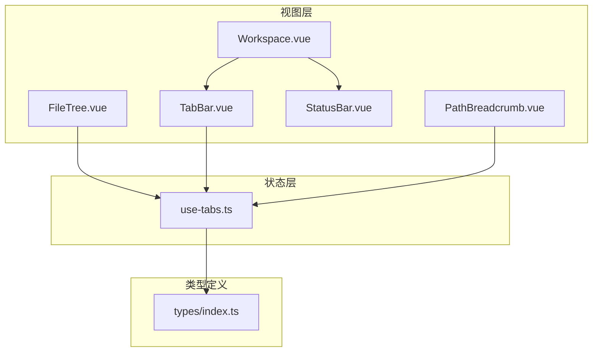
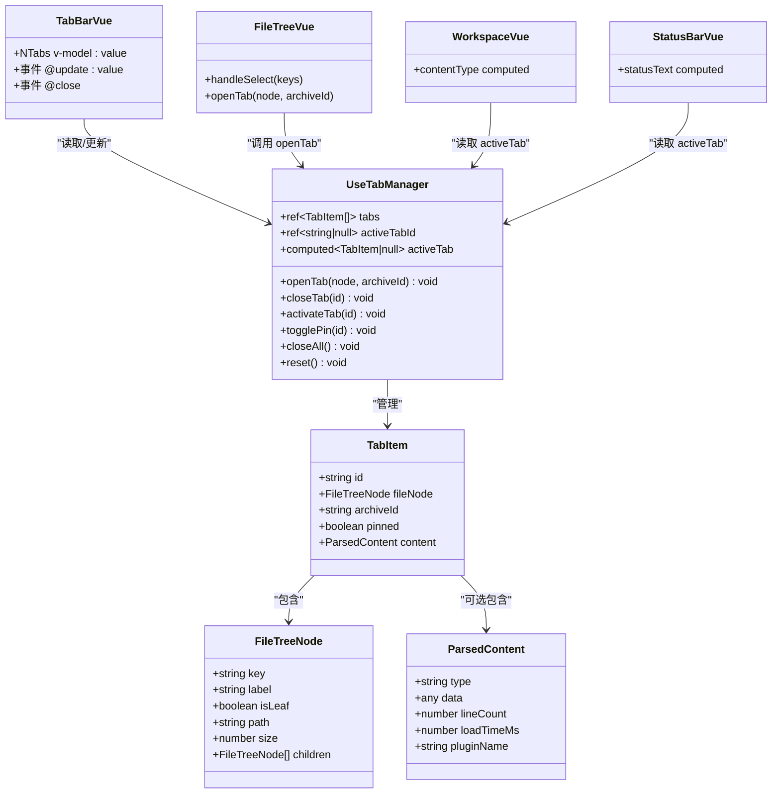
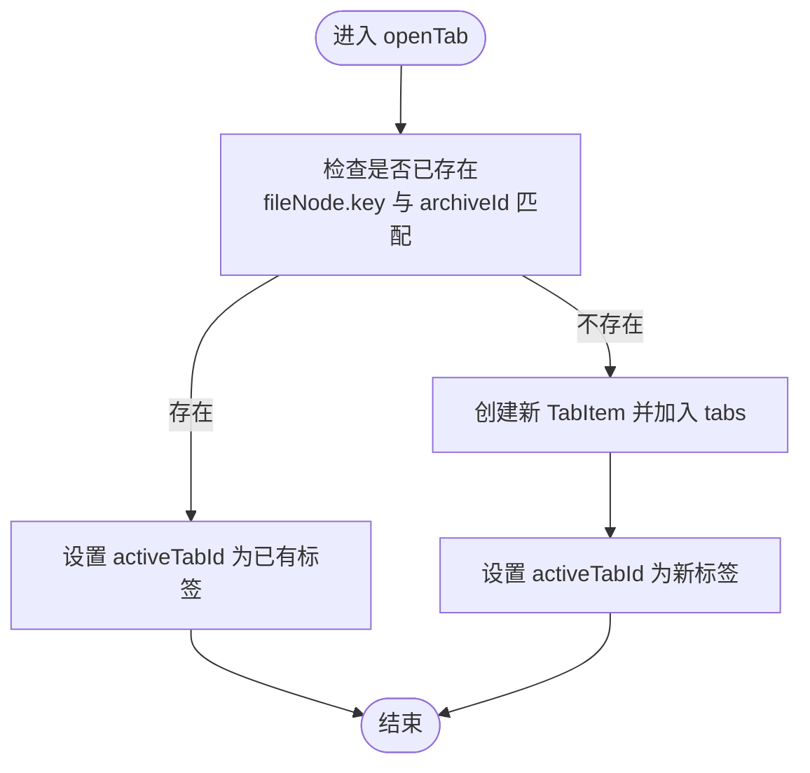
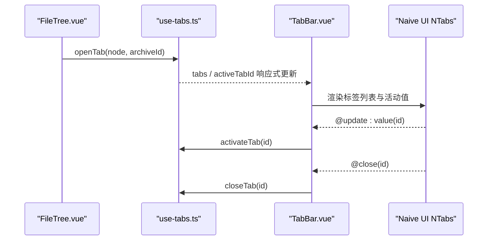
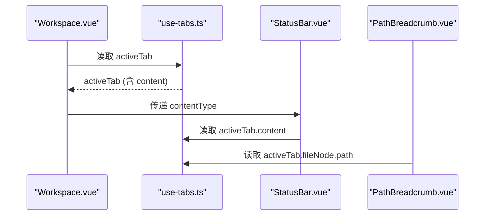
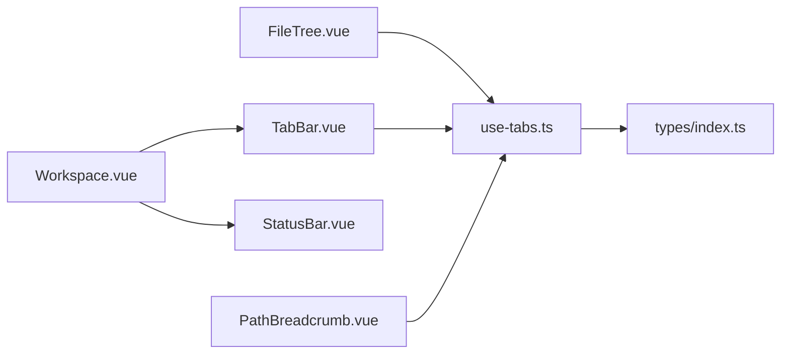

# 标签栏组件

<cite>
**本文引用的文件**
- [TabBar.vue](file://src/components/workspace/TabBar.vue)
- [use-tabs.ts](file://src/composables/use-tabs.ts)
- [index.ts（类型定义）](file://src/types/index.ts)
- [FileTree.vue（左侧文件树）](file://src/components/archive-panel/FileTree.vue)
- [Workspace.vue（工作区容器）](file://src/components/workspace/Workspace.vue)
- [StatusBar.vue（状态栏）](file://src/components/workspace/StatusBar.vue)
- [PathBreadcrumb.vue（路径面包屑）](file://src/components/property-panel/PathBreadcrumb.vue)
- [use-tabs.test.ts（单元测试）](file://src/__tests__/composables/use-tabs.test.ts)
</cite>

## 目录
1. [简介](#简介)
2. [项目结构](#项目结构)
3. [核心组件与能力](#核心组件与能力)
4. [架构总览](#架构总览)
5. [详细组件分析](#详细组件分析)
6. [依赖关系分析](#依赖关系分析)
7. [性能与内存管理](#性能与内存管理)
8. [用户交互设计](#用户交互设计)
9. [配置与样式定制](#配置与样式定制)
10. [错误处理与异常恢复](#错误处理与异常恢复)
11. [故障排查指南](#故障排查指南)
12. [结论](#结论)

## 简介
本文件围绕 TabBar.vue 标签栏组件，系统化阐述多标签页管理的核心功能与实现细节。内容涵盖：
- 标签的创建、切换、关闭与固定（pin）机制
- 活动标签识别与状态维护
- 标签与文件内容的关联关系及数据同步策略
- 当前已实现的交互能力与可扩展点（如拖拽排序、右键菜单、快捷键）
- 内存管理与大量标签页的性能优化建议
- 配置项与样式定制方法
- 错误处理与异常恢复机制

## 项目结构
标签栏相关代码主要分布在以下位置：
- 视图层：TabBar.vue 负责渲染 Naive UI 的卡片式标签页
- 状态管理层：use-tabs.ts 提供标签状态与操作 API
- 类型定义：types/index.ts 定义 TabItem、FileTreeNode、ParsedContent 等
- 触发入口：FileTree.vue 在用户选择叶子节点时调用 openTab
- 工作区容器：Workspace.vue 组合 TabBar、预览工具栏、预览面板与状态栏
- 辅助展示：StatusBar.vue、PathBreadcrumb.vue 消费 activeTab 信息

图表来源
- [TabBar.vue:1-33](file://src/components/workspace/TabBar.vue#L1-L33)
- [use-tabs.ts:1-63](file://src/composables/use-tabs.ts#L1-L63)
- [index.ts（类型定义）:48-54](file://src/types/index.ts#L48-L54)
- [FileTree.vue:1-42](file://src/components/archive-panel/FileTree.vue#L1-L42)
- [Workspace.vue:1-36](file://src/components/workspace/Workspace.vue#L1-L36)
- [StatusBar.vue:1-23](file://src/components/workspace/StatusBar.vue#L1-L23)
- [PathBreadcrumb.vue:1-20](file://src/components/property-panel/PathBreadcrumb.vue#L1-L20)

章节来源
- [TabBar.vue:1-33](file://src/components/workspace/TabBar.vue#L1-L33)
- [use-tabs.ts:1-63](file://src/composables/use-tabs.ts#L1-L63)
- [index.ts（类型定义）:1-71](file://src/types/index.ts#L1-L71)
- [FileTree.vue:1-42](file://src/components/archive-panel/FileTree.vue#L1-L42)
- [Workspace.vue:1-36](file://src/components/workspace/Workspace.vue#L1-L36)
- [StatusBar.vue:1-23](file://src/components/workspace/StatusBar.vue#L1-L23)
- [PathBreadcrumb.vue:1-20](file://src/components/property-panel/PathBreadcrumb.vue#L1-L20)

## 核心组件与能力
- 标签列表与活动标签
  - tabs：所有打开的标签集合
  - activeTabId：当前活动标签 ID
  - activeTab：基于 activeTabId 计算得到的活动标签对象
- 标签生命周期
  - openTab(node, archiveId)：按“文件 key + 所属归档”去重后打开新标签或激活已有标签
  - closeTab(id)：关闭指定标签；若关闭的是活动标签，自动切换到相邻标签
  - activateTab(id)：切换活动标签
  - togglePin(id)：切换标签固定状态
  - closeAll()：仅保留固定标签并重置活动标签
  - reset()：清空所有标签与活动状态
- 视图绑定
  - TabBar.vue 通过 NTabs 的 value/close 事件与 use-tab-manager 的双向联动
  - Workspace.vue 根据 activeTab.content.type 决定渲染器类型
  - StatusBar.vue 显示行数、加载耗时、插件名等信息
  - PathBreadcrumb.vue 解析 activeTab.fileNode.path 展示面包屑

章节来源
- [use-tabs.ts:9-62](file://src/composables/use-tabs.ts#L9-L62)
- [TabBar.vue:1-33](file://src/components/workspace/TabBar.vue#L1-L33)
- [Workspace.vue:1-36](file://src/components/workspace/Workspace.vue#L1-L36)
- [StatusBar.vue:1-23](file://src/components/workspace/StatusBar.vue#L1-L23)
- [PathBreadcrumb.vue:1-20](file://src/components/property-panel/PathBreadcrumb.vue#L1-L20)

## 架构总览
标签栏采用“轻量视图 + 集中状态”的架构：
- 视图层只负责展示与事件转发
- 状态层使用 Vue ref/computed 维护标签集合与活动标签
- 类型系统明确标签、文件节点与解析结果的结构

图表来源
- [use-tabs.ts:1-63](file://src/composables/use-tabs.ts#L1-L63)
- [index.ts（类型定义）:17-32](file://src/types/index.ts#L17-L32)
- [index.ts（类型定义）:48-54](file://src/types/index.ts#L48-L54)
- [TabBar.vue:1-33](file://src/components/workspace/TabBar.vue#L1-L33)
- [FileTree.vue:1-42](file://src/components/archive-panel/FileTree.vue#L1-L42)
- [Workspace.vue:1-36](file://src/components/workspace/Workspace.vue#L1-L36)
- [StatusBar.vue:1-23](file://src/components/workspace/StatusBar.vue#L1-L23)

## 详细组件分析

### 标签管理器（use-tabs.ts）
- 数据结构
  - tabs：数组存储所有标签
  - activeTabId：当前活动标签 ID
  - nextTabId：自增生成唯一 ID
- 关键逻辑
  - 打开标签：按 fileNode.key 与 archiveId 双重维度去重，避免重复打开同一文件在同一归档中的副本
  - 关闭标签：删除对应条目；若关闭的是活动标签，则尝试将活动切换到被删位置的相邻标签
  - 切换标签：直接设置 activeTabId
  - 固定标签：切换 pinned 标志
  - 关闭全部：仅保留 pinned 标签，并重置活动标签
  - 重置：清空所有状态与计数器
- 复杂度
  - openTab/closeTab/togglePin/closeAll 均为 O(n) 线性查找/过滤
  - 对于常见标签数量（数十到数百），性能可接受

图表来源
- [use-tabs.ts:14-31](file://src/composables/use-tabs.ts#L14-L31)

章节来源
- [use-tabs.ts:1-63](file://src/composables/use-tabs.ts#L1-L63)
- [use-tabs.test.ts:1-76](file://src/__tests__/composables/use-tabs.test.ts#L1-L76)

### 标签栏视图（TabBar.vue）
- 绑定与事件
  - 使用 NTabs 的 type="card" 呈现卡片式标签
  - closable 控制是否显示关闭按钮
  - v-model:value 与 @update:value 绑定活动标签切换
  - @close 事件委托给 closeTab 进行关闭
- 标签标题
  - 若 pinned 为真，显示前缀图标，随后显示文件节点 label
- 空态提示
  - 当无标签时显示引导文案

图表来源
- [FileTree.vue:16-23](file://src/components/archive-panel/FileTree.vue#L16-L23)
- [use-tabs.ts:14-44](file://src/composables/use-tabs.ts#L14-L44)
- [TabBar.vue:11-28](file://src/components/workspace/TabBar.vue#L11-L28)

章节来源
- [TabBar.vue:1-33](file://src/components/workspace/TabBar.vue#L1-L33)
- [FileTree.vue:1-42](file://src/components/archive-panel/FileTree.vue#L1-L42)

### 工作区与状态展示（Workspace.vue、StatusBar.vue、PathBreadcrumb.vue）
- Workspace.vue
  - 组合 TabBar、PreviewToolbar、PreviewPane、StatusBar
  - 根据 activeTab.content.type 动态确定渲染器类型
- StatusBar.vue
  - 读取 activeTab.content，展示行数、加载耗时、插件名称
- PathBreadcrumb.vue
  - 解析 activeTab.fileNode.path 分段展示路径

图表来源
- [Workspace.vue:16-18](file://src/components/workspace/Workspace.vue#L16-L18)
- [StatusBar.vue:8-16](file://src/components/workspace/StatusBar.vue#L8-L16)
- [PathBreadcrumb.vue:8-11](file://src/components/property-panel/PathBreadcrumb.vue#L8-L11)
- [use-tabs.ts:10-12](file://src/composables/use-tabs.ts#L10-L12)

章节来源
- [Workspace.vue:1-36](file://src/components/workspace/Workspace.vue#L1-L36)
- [StatusBar.vue:1-23](file://src/components/workspace/StatusBar.vue#L1-L23)
- [PathBreadcrumb.vue:1-20](file://src/components/property-panel/PathBreadcrumb.vue#L1-L20)

## 依赖关系分析
- 模块耦合
  - TabBar.vue 仅依赖 use-tabs.ts 暴露的读写接口，保持低耦合
  - FileTree.vue 作为触发源，通过 openTab 注入新标签
  - Workspace.vue 聚合各子组件并按 activeTab 动态渲染
- 外部依赖
  - Naive UI 的 NTabs/NTab 提供基础标签控件
  - Vue 的 ref/computed 提供响应式状态与派生值

图表来源
- [FileTree.vue:1-42](file://src/components/archive-panel/FileTree.vue#L1-L42)
- [TabBar.vue:1-33](file://src/components/workspace/TabBar.vue#L1-L33)
- [Workspace.vue:1-36](file://src/components/workspace/Workspace.vue#L1-L36)
- [StatusBar.vue:1-23](file://src/components/workspace/StatusBar.vue#L1-L23)
- [PathBreadcrumb.vue:1-20](file://src/components/property-panel/PathBreadcrumb.vue#L1-L20)
- [index.ts（类型定义）:1-71](file://src/types/index.ts#L1-L71)

章节来源
- [FileTree.vue:1-42](file://src/components/archive-panel/FileTree.vue#L1-L42)
- [TabBar.vue:1-33](file://src/components/workspace/TabBar.vue#L1-L33)
- [Workspace.vue:1-36](file://src/components/workspace/Workspace.vue#L1-L36)
- [StatusBar.vue:1-23](file://src/components/workspace/StatusBar.vue#L1-L23)
- [PathBreadcrumb.vue:1-20](file://src/components/property-panel/PathBreadcrumb.vue#L1-L20)
- [index.ts（类型定义）:1-71](file://src/types/index.ts#L1-L71)

## 性能与内存管理
- 当前实现
  - 标签以数组存储，查找与插入为 O(n)，适合中小规模标签页
  - 未实现虚拟滚动或分页，但标签数量通常有限
- 潜在优化方向
  - 对超大标签集可采用虚拟列表或按需渲染
  - 对大文件内容缓存与懒加载，避免一次性载入
  - 使用 Map 索引加速查找（例如以 fileNode.key+archiveId 为键）
  - 限制最大标签数并提供清理策略（如最近最少使用淘汰）
- 内存释放
  - 关闭标签会移除引用，配合 Vue 响应式垃圾回收
  - 建议在关闭标签时主动置空 content 引用，减少大对象驻留

[本节为通用性能建议，不直接分析具体文件]

## 用户交互设计
- 已实现
  - 点击标签切换活动标签
  - 点击关闭按钮关闭非固定标签
  - 固定标签不可被关闭（closable 由 pinned 控制）
  - 从文件树选择叶子节点打开标签
- 可扩展点（当前未实现）
  - 拖拽排序：可在 use-tabs.ts 中新增 reorderTabs(fromIndex, toIndex) 并在 TabBar 中启用拖拽
  - 右键菜单：可监听标签上下文菜单，支持关闭其他、关闭右侧、固定/取消固定等
  - 快捷键：可全局监听 Ctrl/Cmd+W 关闭当前标签、Ctrl/Cmd+Shift+T 重新打开上一个等

章节来源
- [TabBar.vue:11-28](file://src/components/workspace/TabBar.vue#L11-L28)
- [FileTree.vue:16-23](file://src/components/archive-panel/FileTree.vue#L16-L23)
- [use-tabs.ts:46-54](file://src/composables/use-tabs.ts#L46-L54)

## 配置与样式定制
- 组件级配置
  - NTabs 的 type="card" 与 closable 属性控制外观与行为
  - 可通过 props 扩展更多选项（如 maxTabs、tabSize 等）
- 主题与样式
  - 借助 Naive UI 的主题变量覆盖默认样式
  - 针对 pinned 标签可添加自定义图标或角标
- 行为配置
  - 在 use-tabs.ts 中增加配置项（如是否允许重复打开、关闭确认弹窗等）

章节来源
- [TabBar.vue:11-28](file://src/components/workspace/TabBar.vue#L11-L28)

## 错误处理与异常恢复
- 当前实现
  - 标签管理器本身不包含显式 try/catch，依赖上层调用方保证入参有效
  - 关闭活动标签时的边界处理：若无后续标签，activeTabId 置空
- 建议增强
  - 在 openTab/closeTab 中加入参数校验与日志记录
  - 对大对象 content 的写入/替换增加异常捕获，避免污染状态
  - 结合全局 ErrorBoundary 包裹工作区，防止单个标签渲染失败影响整体

章节来源
- [use-tabs.ts:33-40](file://src/composables/use-tabs.ts#L33-L40)

## 故障排查指南
- 常见问题
  - 重复打开同一文件：确认传入的 fileNode.key 与 archiveId 是否正确
  - 关闭后活动标签异常：检查 closeTab 的相邻标签选择逻辑
  - 固定标签仍可关闭：确认 pinned 与 closable 绑定是否正确
- 定位步骤
  - 在 use-tabs.ts 的关键函数处添加日志输出
  - 使用浏览器开发者工具观察 tabs 与 activeTabId 的变化
  - 运行单元测试验证基本流程

章节来源
- [use-tabs.test.ts:15-76](file://src/__tests__/composables/use-tabs.test.ts#L15-L76)

## 结论
TabBar.vue 与其配套的 use-tabs.ts 实现了简洁可靠的标签页管理能力：以最小耦合完成标签的创建、切换、关闭与固定，并通过类型系统与响应式机制确保视图与状态一致。当前版本聚焦于核心能力，未来可在交互体验（拖拽、右键、快捷键）、性能优化（虚拟列表、内容缓存）与健壮性（参数校验、异常捕获）方面持续演进。