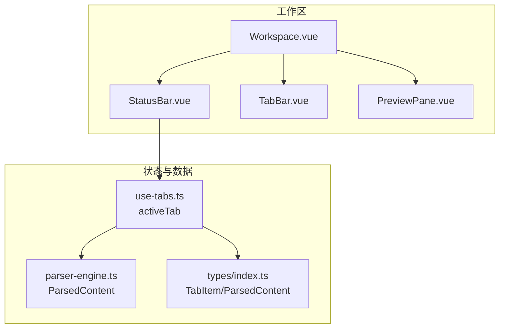
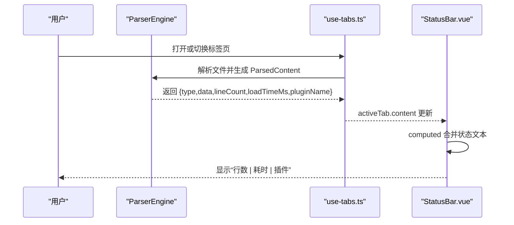
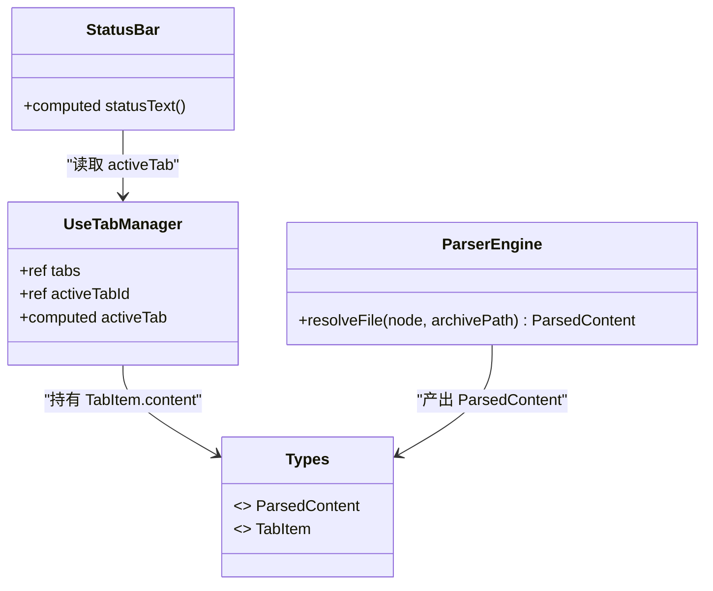
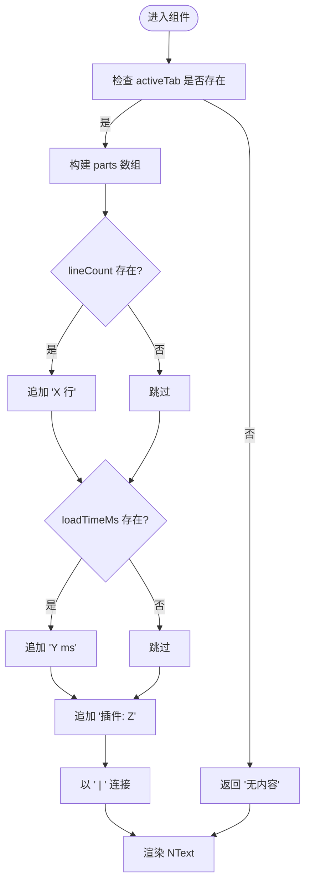

# 状态栏组件

<cite>
**本文引用的文件**
- [src/components/workspace/StatusBar.vue](file://src/components/workspace/StatusBar.vue)
- [src/components/workspace/Workspace.vue](file://src/components/workspace/Workspace.vue)
- [src/composables/use-tabs.ts](file://src/composables/use-tabs.ts)
- [src/core/parser-engine.ts](file://src/core/parser-engine.ts)
- [src/types/index.ts](file://src/types/index.ts)
- [src/styles/theme.ts](file://src/styles/theme.ts)
</cite>

## 目录
1. [简介](#简介)
2. [项目结构](#项目结构)
3. [核心组件](#核心组件)
4. [架构总览](#架构总览)
5. [详细组件分析](#详细组件分析)
6. [依赖分析](#依赖分析)
7. [性能考虑](#性能考虑)
8. [故障排查指南](#故障排查指南)
9. [结论](#结论)
10. [附录](#附录)

## 简介
本文件为 StatusBar.vue 状态栏组件的详细文档，聚焦以下方面：
- 状态信息的展示机制与实时更新（行数、加载耗时、插件名等）
- 布局设计与信息分组逻辑
- 状态更新触发机制与避免频繁重渲染的策略
- 不同文件类型的专用状态显示策略
- 可定制性与主题适配
- 扩展接口以支持自定义状态项
- 国际化支持与可访问性实现细节

## 项目结构
状态栏位于工作区组件树底部，与工作区容器、标签页管理、预览面板协同工作。其数据来源由标签页管理器提供，解析结果由解析引擎填充到标签页内容中。

图示来源
- [src/components/workspace/Workspace.vue:1-36](file://src/components/workspace/Workspace.vue#L1-L36)
- [src/components/workspace/StatusBar.vue:1-24](file://src/components/workspace/StatusBar.vue#L1-L24)
- [src/composables/use-tabs.ts:1-64](file://src/composables/use-tabs.ts#L1-L64)
- [src/core/parser-engine.ts:1-35](file://src/core/parser-engine.ts#L1-L35)
- [src/types/index.ts:1-71](file://src/types/index.ts#L1-L71)

章节来源
- [src/components/workspace/Workspace.vue:1-36](file://src/components/workspace/Workspace.vue#L1-L36)
- [src/components/workspace/StatusBar.vue:1-24](file://src/components/workspace/StatusBar.vue#L1-L24)
- [src/composables/use-tabs.ts:1-64](file://src/composables/use-tabs.ts#L1-L64)
- [src/core/parser-engine.ts:1-35](file://src/core/parser-engine.ts#L1-L35)
- [src/types/index.ts:1-71](file://src/types/index.ts#L1-L71)

## 核心组件
- 状态栏组件负责将当前活动标签页的元数据以紧凑文本形式呈现，包括行数、加载耗时、插件名称等。
- 通过计算属性聚合字段，仅在 activeTab.content 变化时重新计算并渲染，减少不必要的重绘。
- 使用 Naive UI 的 NText 进行轻量文本展示，保持视觉一致性。

章节来源
- [src/components/workspace/StatusBar.vue:1-24](file://src/components/workspace/StatusBar.vue#L1-L24)

## 架构总览
状态栏的数据流从解析引擎产出 ParsedContent，经由标签页管理器注入 TabItem.content，最终被状态栏读取并展示。

图示来源
- [src/core/parser-engine.ts:11-33](file://src/core/parser-engine.ts#L11-L33)
- [src/composables/use-tabs.ts:10-12](file://src/composables/use-tabs.ts#L10-L12)
- [src/components/workspace/StatusBar.vue:8-16](file://src/components/workspace/StatusBar.vue#L8-L16)

## 详细组件分析

### 状态信息展示机制
- 数据来源：activeTab.value?.content（类型为 ParsedContent），包含 lineCount、loadTimeMs、pluginName 等字段。
- 展示规则：
  - 若 content 为空，显示“无内容”。
  - 若存在 lineCount，追加“X 行”。
  - 若存在 loadTimeMs，追加“Y ms”（保留一位小数）。
  - 始终追加“插件: Z”。
  - 各段以“ | ”分隔。
- 更新时机：当 activeTab 或其 content 变化时，computed 自动重新计算，驱动视图更新。

章节来源
- [src/components/workspace/StatusBar.vue:8-16](file://src/components/workspace/StatusBar.vue#L8-L16)
- [src/types/index.ts:26-32](file://src/types/index.ts#L26-L32)

### 布局设计与信息分组逻辑
- 布局：固定高度 24px，左右内边距 8px，顶部边框分隔，内部使用 Flex 居中排列文本。
- 分组：采用单行拼接方式，按“行数 | 耗时 | 插件”顺序组合，便于快速扫视。
- 可扩展性：后续可按需拆分为多段区域（如左侧基础信息、右侧操作提示），但当前版本保持极简。

章节来源
- [src/components/workspace/StatusBar.vue:19-23](file://src/components/workspace/StatusBar.vue#L19-L23)

### 状态更新的触发机制
- 触发点：
  - 标签页打开/切换：use-tabs.ts 维护 activeTabId 与 tabs 列表，activeTab 为计算属性。
  - 解析完成：ParserEngine.resolveFile 写入 ParsedContent 到 TabItem.content。
- 传播路径：
  - 解析引擎产出 -> 标签页内容更新 -> activeTab 计算属性更新 -> 状态栏 computed 更新。
- 防抖与节流：
  - 当前未引入额外防抖/节流；由于仅对少量字符串进行拼接，开销极低。
  - 如需高频更新（如光标位置），建议在上层引入节流策略，避免频繁重渲染。

章节来源
- [src/composables/use-tabs.ts:10-12](file://src/composables/use-tabs.ts#L10-L12)
- [src/core/parser-engine.ts:11-33](file://src/core/parser-engine.ts#L11-L33)
- [src/components/workspace/StatusBar.vue:8-16](file://src/components/workspace/StatusBar.vue#L8-L16)

### 不同文件类型的专用状态信息显示
- 类型来源：ParsedContent.type（text/csv/json/hex/log）。
- 现状：状态栏不直接展示 type，但可通过扩展在拼接逻辑中加入类型标识或差异化文案。
- 建议：
  - 在 statusText 构建前根据 type 插入类型标签，例如“[CSV] 行数 | 耗时 | 插件”。
  - 针对 hex/log 等特殊类型，可增加“编码/字节数”等辅助信息。

章节来源
- [src/types/index.ts:26-32](file://src/types/index.ts#L26-L32)
- [src/components/workspace/StatusBar.vue:8-16](file://src/components/workspace/StatusBar.vue#L8-L16)

### 可定制性与主题适配
- 主题：组件使用 Naive UI 的 NText depth 与默认样式，遵循全局主题覆盖配置。
- 主题覆盖：应用级 themeOverrides 定义主色、错误色、字体族等，状态栏文本颜色与字体随主题联动。
- 定制建议：
  - 通过 CSS 变量或主题覆盖调整字号、间距、边框色。
  - 可在组件外层包裹容器，统一控制对齐与布局。

章节来源
- [src/components/workspace/StatusBar.vue:20-22](file://src/components/workspace/StatusBar.vue#L20-L22)
- [src/styles/theme.ts:1-13](file://src/styles/theme.ts#L1-L13)

### 扩展接口：添加自定义状态项
- 目标：在不破坏现有行为的前提下，允许外部注入更多状态片段。
- 设计建议：
  - 暴露 props 或 provide/inject 接口，接收自定义片段数组。
  - 在 statusText 构建阶段合并自定义片段，保持统一的“ | ”分隔风格。
  - 提供插槽（slot）用于更灵活的布局定制。
- 兼容性：默认行为保持不变，新增片段可选。

章节来源
- [src/components/workspace/StatusBar.vue:8-16](file://src/components/workspace/StatusBar.vue#L8-L16)

### 国际化支持与可访问性
- 国际化：
  - 当前硬编码中文文案（如“无内容”、“行”、“ms”、“插件”）。
  - 建议抽取 i18n key，并在 statusText 构建处替换为本地化函数调用。
- 可访问性：
  - 当前未设置 aria-* 属性。
  - 建议增加 role="status" 与 aria-live="polite"，以便屏幕阅读器播报变更。
  - 可为关键片段增加语义化描述（如“行数”、“加载耗时”）。

章节来源
- [src/components/workspace/StatusBar.vue:8-16](file://src/components/workspace/StatusBar.vue#L8-L16)
- [src/components/workspace/StatusBar.vue:20-22](file://src/components/workspace/StatusBar.vue#L20-L22)

## 依赖分析
- 组件依赖：
  - Vue 响应式：computed 用于派生状态文本。
  - Naive UI：NText 用于文本展示。
  - use-tab-manager：提供 activeTab 作为数据源。
- 数据模型：
  - TabItem.content 为 ParsedContent，来源于解析引擎。
- 耦合关系：
  - 低耦合：状态栏仅消费 activeTab.content，不修改数据。
  - 单向数据流：解析引擎 -> 标签页 -> 状态栏。

图示来源
- [src/components/workspace/StatusBar.vue:1-24](file://src/components/workspace/StatusBar.vue#L1-L24)
- [src/composables/use-tabs.ts:1-64](file://src/composables/use-tabs.ts#L1-L64)
- [src/core/parser-engine.ts:1-35](file://src/core/parser-engine.ts#L1-L35)
- [src/types/index.ts:1-71](file://src/types/index.ts#L1-L71)

章节来源
- [src/components/workspace/StatusBar.vue:1-24](file://src/components/workspace/StatusBar.vue#L1-L24)
- [src/composables/use-tabs.ts:1-64](file://src/composables/use-tabs.ts#L1-L64)
- [src/core/parser-engine.ts:1-35](file://src/core/parser-engine.ts#L1-L35)
- [src/types/index.ts:1-71](file://src/types/index.ts#L1-L71)

## 性能考虑
- 当前实现已具备良好性能特征：
  - 仅对少量字段进行字符串拼接，计算开销极小。
  - 使用 computed 确保仅在依赖变化时更新。
- 潜在优化点：
  - 若未来加入高频更新字段（如光标位置、搜索匹配计数），建议在数据层引入节流或增量更新策略。
  - 避免在模板中进行复杂计算，尽量下沉至 computed 或 composables。
  - 对于超大文件，lineCount 的计算应在解析阶段完成，避免重复统计。

章节来源
- [src/components/workspace/StatusBar.vue:8-16](file://src/components/workspace/StatusBar.vue#L8-L16)
- [src/core/parser-engine.ts:11-33](file://src/core/parser-engine.ts#L11-L33)

## 故障排查指南
- 症状：状态栏显示“无内容”
  - 可能原因：activeTab 不存在或 content 为空。
  - 排查步骤：检查标签页是否成功打开；确认解析流程是否返回 ParsedContent。
- 症状：状态栏不更新
  - 可能原因：activeTab 未正确更新；解析结果未写入 content。
  - 排查步骤：验证 use-tabs 的 activeTabId 与 tabs 状态；确认 ParserEngine 返回值。
- 症状：样式异常
  - 可能原因：主题覆盖冲突或全局样式影响。
  - 排查步骤：检查 themeOverrides 与全局 CSS；必要时在组件外层包裹容器隔离样式。

章节来源
- [src/components/workspace/StatusBar.vue:8-16](file://src/components/workspace/StatusBar.vue#L8-L16)
- [src/composables/use-tabs.ts:10-12](file://src/composables/use-tabs.ts#L10-L12)
- [src/core/parser-engine.ts:11-33](file://src/core/parser-engine.ts#L11-L33)

## 结论
StatusBar.vue 是一个轻量、低耦合的状态展示组件，基于 activeTab.content 的响应式数据流，提供行数、加载耗时与插件名等关键元数据的实时展示。当前实现简洁高效，具备良好的扩展空间，可通过 props/slots/i18n/a11y 增强以满足更复杂的业务需求。

## 附录

### 数据模型与字段说明
- ParsedContent
  - type：文件类型（text/csv/json/hex/log）
  - data：解析后的数据
  - lineCount：行数（可选）
  - loadTimeMs：解析耗时毫秒（可选）
  - pluginName：使用的插件名称
- TabItem
  - id：标签页唯一标识
  - fileNode：文件节点
  - archiveId：所属归档标识
  - pinned：是否固定
  - content：解析结果（可选）

章节来源
- [src/types/index.ts:26-54](file://src/types/index.ts#L26-L54)

### 状态栏渲染流程图

图示来源
- [src/components/workspace/StatusBar.vue:8-16](file://src/components/workspace/StatusBar.vue#L8-L16)