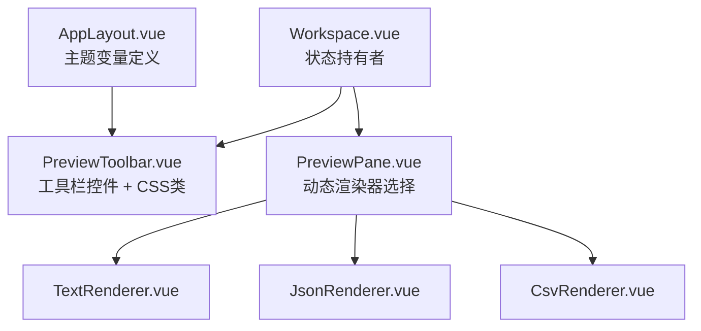
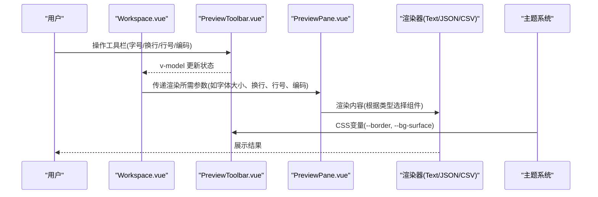
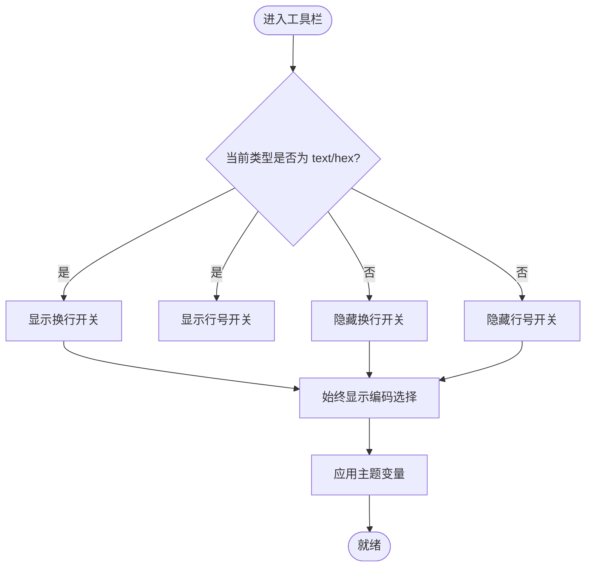
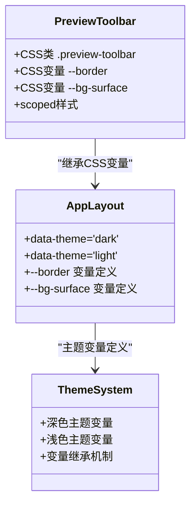
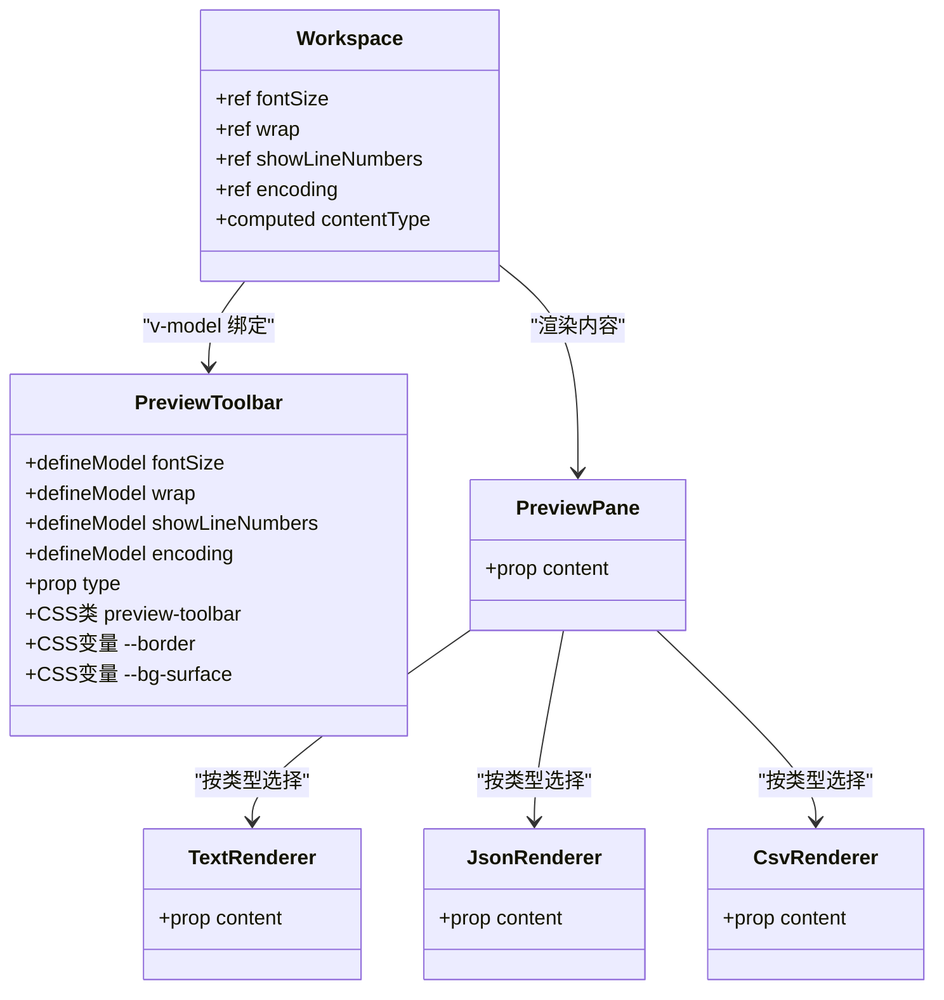
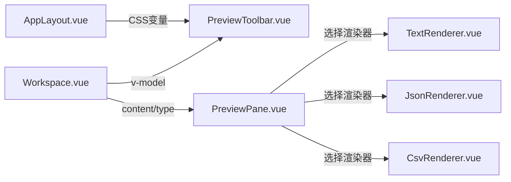

# 预览工具栏组件

<cite>
**本文引用的文件**   
- [PreviewToolbar.vue](file://src/components/workspace/PreviewToolbar.vue)
- [Workspace.vue](file://src/components/workspace/Workspace.vue)
- [PreviewPane.vue](file://src/components/workspace/PreviewPane.vue)
- [TextRenderer.vue](file://src/views/renderers/TextRenderer.vue)
- [JsonRenderer.vue](file://src/views/renderers/JsonRenderer.vue)
- [CsvRenderer.vue](file://src/views/renderers/CsvRenderer.vue)
- [AppLayout.vue](file://src/layout/AppLayout.vue)
- [theme.ts](file://src/styles/theme.ts)
- [use-tabs.ts](file://src/composables/use-tabs.ts)
- [index.ts（类型定义）](file://src/types/index.ts)
</cite>

## 更新摘要
**变更内容**   
- 新增 CSS 类支持和主题变量集成
- 增强视觉一致性和可维护性
- 改进深色/浅色主题适配能力
- 优化样式结构和命名规范

## 目录
1. [简介](#简介)
2. [项目结构](#项目结构)
3. [核心组件](#核心组件)
4. [架构总览](#架构总览)
5. [详细组件分析](#详细组件分析)
6. [依赖关系分析](#依赖关系分析)
7. [性能考量](#性能考量)
8. [故障排查指南](#故障排查指南)
9. [结论](#结论)
10. [附录](#附录)

## 简介
本文件为 PreviewToolbar.vue 预览工具栏组件的权威文档。该组件提供文本类预览的统一控制入口，包括字号调整、文本换行开关、行号显示控制与编码格式选择。**最新更新**：组件现已获得完整的 CSS 类和主题变量支持，提升了可维护性和视觉一致性，能够自动适配应用的深色/浅色主题系统。

## 项目结构
预览工具栏位于工作区组件树中，处于标签栏下方、预览面板上方，负责暴露可配置的预览行为。其状态由父组件集中管理，并通过 props 下发给具体渲染器。**新增**：组件现在使用语义化的 CSS 类名和 CSS 自定义属性，确保与全局主题系统的一致性。

**图表来源**
- [Workspace.vue:1-53](file://src/components/workspace/Workspace.vue#L1-L53)
- [PreviewToolbar.vue:1-52](file://src/components/workspace/PreviewToolbar.vue#L1-L52)
- [PreviewPane.vue:1-74](file://src/components/workspace/PreviewPane.vue#L1-L74)
- [TextRenderer.vue:1-38](file://src/views/renderers/TextRenderer.vue#L1-L38)
- [JsonRenderer.vue:1-30](file://src/views/renderers/JsonRenderer.vue#L1-L30)
- [CsvRenderer.vue:1-52](file://src/views/renderers/CsvRenderer.vue#L1-L52)
- [AppLayout.vue:146-176](file://src/layout/AppLayout.vue#L146-L176)

**章节来源**
- [Workspace.vue:1-53](file://src/components/workspace/Workspace.vue#L1-L53)
- [PreviewToolbar.vue:1-52](file://src/components/workspace/PreviewToolbar.vue#L1-L52)
- [PreviewPane.vue:1-74](file://src/components/workspace/PreviewPane.vue#L1-L74)

## 核心组件
- 预览工具栏（PreviewToolbar.vue）
  - 功能：提供字号、换行、行号、编码等常用预览控制项；根据当前内容类型动态显示部分控件。
  - 交互：使用 Naive UI 的输入数字、开关、下拉选择等控件，配合 defineModel 实现双向绑定。
  - **新增特性**：采用语义化 CSS 类名 `.preview-toolbar`，支持 CSS 自定义属性 `--border` 和 `--bg-surface`，实现主题自适应。
  - 状态：fontSize、wrap、showLineNumbers、encoding 四个模型值由父组件传入并监听更新。

- 工作区容器（Workspace.vue）
  - 职责：集中维护预览配置状态，计算当前内容类型，并将状态以 v-model 形式透传给工具栏与渲染器。
  - 联动：当 activeTab 切换时，contentType 随之变化，工具栏按钮可见性相应调整。

- 预览面板（PreviewPane.vue）
  - 职责：根据插件注册表选择对应渲染器，并将 content 数据注入渲染器。
  - 注意：当前版本未直接消费工具栏状态，需通过父组件或渲染器扩展完成联动。

**章节来源**
- [PreviewToolbar.vue:1-52](file://src/components/workspace/PreviewToolbar.vue#L1-L52)
- [Workspace.vue:1-53](file://src/components/workspace/Workspace.vue#L1-L53)
- [PreviewPane.vue:1-74](file://src/components/workspace/PreviewPane.vue#L1-L74)

## 架构总览
工具栏与预览面板之间的数据流遵循"父控子"的模式：父组件持有状态，子组件通过 v-model 上报变更，父组件再决定如何影响渲染器。**新增**：样式层现在通过 CSS 自定义属性与全局主题系统集成，实现无缝的主题切换。

**图表来源**
- [Workspace.vue:1-53](file://src/components/workspace/Workspace.vue#L1-L53)
- [PreviewToolbar.vue:1-52](file://src/components/workspace/PreviewToolbar.vue#L1-L52)
- [PreviewPane.vue:1-74](file://src/components/workspace/PreviewPane.vue#L1-L74)
- [AppLayout.vue:146-176](file://src/layout/AppLayout.vue#L146-L176)

## 详细组件分析

### 工具栏控件与交互逻辑
- 字号调整
  - 控件：NInputNumber
  - 范围：最小 10，最大 24
  - 绑定：v-model:fontSize
  - 用途：驱动渲染器的基础字号
- 文本换行
  - 控件：NSwitch
  - 绑定：v-model:wrap
  - 条件：仅在 type 为 text 或 hex 时显示
  - 用途：控制 white-space 行为，决定是否自动换行
- 行号显示
  - 控件：NSwitch
  - 绑定：v-model:showLineNumbers
  - 条件：仅在 type 为 text 或 hex 时显示
  - 用途：控制行号列的显隐
- 编码格式
  - 控件：NSelect
  - 选项：UTF-8、GBK、Shift_JIS
  - 绑定：v-model:encoding
  - 用途：用于解析层读取原始字节时的字符集选择

**图表来源**
- [PreviewToolbar.vue:27-41](file://src/components/workspace/PreviewToolbar.vue#L27-L41)

**章节来源**
- [PreviewToolbar.vue:1-52](file://src/components/workspace/PreviewToolbar.vue#L1-L52)

### CSS 类与主题变量支持
**新增功能**：组件现已集成完整的支持系统，提升可维护性和视觉一致性。

- **CSS 类命名**
  - 主容器类：`.preview-toolbar` - 语义化命名，便于样式管理和覆盖
  - 作用域：使用 `<style scoped>` 确保样式隔离

- **主题变量集成**
  - `--border`：边框颜色变量，支持深色/浅色主题切换
  - `--bg-surface`：背景表面色变量，提供透明回退值
  - 变量来源：AppLayout.vue 中的全局主题定义

- **样式特性**
  - 内边距：`padding: 4px 8px` - 紧凑的布局间距
  - 底部边框：`border-bottom: 1px solid var(--border, #333)` - 使用 CSS 变量并提供回退值
  - 背景色：`background: var(--bg-surface, transparent)` - 支持主题切换和透明回退

**图表来源**
- [PreviewToolbar.vue:45-51](file://src/components/workspace/PreviewToolbar.vue#L45-L51)
- [AppLayout.vue:146-176](file://src/layout/AppLayout.vue#L146-L176)

**章节来源**
- [PreviewToolbar.vue:45-51](file://src/components/workspace/PreviewToolbar.vue#L45-L51)
- [AppLayout.vue:146-176](file://src/layout/AppLayout.vue#L146-L176)

### 状态响应式与同步机制
- 父组件状态
  - fontSize、wrap、showLineNumbers、encoding 在 Workspace.vue 中以 ref 声明
  - contentType 基于 activeTab.content.type 计算得出，用于控制工具栏按钮可见性
- 子组件绑定
  - PreviewToolbar.vue 使用 defineModel 声明上述属性，形成父子双向绑定
- 渲染器联动
  - 当前 PreviewPane.vue 仅接收 content 数据，未直接消费工具栏状态
  - 建议：在父组件中将工具栏状态作为 props 传递给渲染器，或在渲染器内部订阅父级状态

**图表来源**
- [Workspace.vue:1-53](file://src/components/workspace/Workspace.vue#L1-L53)
- [PreviewToolbar.vue:1-52](file://src/components/workspace/PreviewToolbar.vue#L1-L52)
- [PreviewPane.vue:1-74](file://src/components/workspace/PreviewPane.vue#L1-L74)
- [TextRenderer.vue:1-38](file://src/views/renderers/TextRenderer.vue#L1-L38)
- [JsonRenderer.vue:1-30](file://src/views/renderers/JsonRenderer.vue#L1-L30)
- [CsvRenderer.vue:1-52](file://src/views/renderers/CsvRenderer.vue#L1-L52)

**章节来源**
- [Workspace.vue:1-53](file://src/components/workspace/Workspace.vue#L1-L53)
- [PreviewToolbar.vue:1-52](file://src/components/workspace/PreviewToolbar.vue#L1-L52)
- [PreviewPane.vue:1-74](file://src/components/workspace/PreviewPane.vue#L1-L74)

### 不同类型文件的专用工具项动态显示
- 文本与十六进制（text/hex）
  - 显示：换行、行号
  - 原因：这两类内容通常具备行结构，适合行号与换行控制
- CSV/JSON/Log
  - 不显示：换行、行号
  - 原因：表格/结构化/日志渲染对行号与换行的需求不同，默认隐藏以避免误用

**章节来源**
- [PreviewToolbar.vue:27-36](file://src/components/workspace/PreviewToolbar.vue#L27-L36)

### 快捷键绑定与键盘导航
- 现状
  - 当前工具栏未实现全局快捷键绑定
  - 各控件支持原生键盘交互（Tab 焦点移动、Enter/Space 触发开关等）
- 建议方案
  - 在父组件中监听组合键（例如 Ctrl/Cmd + +/- 调整字号，Ctrl/Cmd + Enter 切换换行，Ctrl/Cmd + L 切换行号）
  - 通过事件总线或共享状态更新工具栏模型值，保持与渲染器一致

[本节为通用建议，不涉及具体源码文件]

### 无障碍访问（a11y）与国际化（i18n）
- 无障碍
  - 建议为每个控件添加 aria-label 或关联 label，确保屏幕阅读器可读
  - 为开关和选择框设置 role 与 tabindex，保证键盘可达性与语义正确
- 国际化
  - 当前文案为中文硬编码（如"字号""换行""行号""编码"）
  - 建议抽取到 i18n 资源文件，并按 locale 动态渲染

[本节为通用建议，不涉及具体源码文件]

### 自定义与扩展方法
- 新增控制项
  - 在 PreviewToolbar.vue 中添加新的 defineModel 与 UI 控件
  - 在 Workspace.vue 中声明对应 ref 并以 v-model 透传
  - 在渲染器中消费新状态（例如在 TextRenderer 中根据 wrap 切换 white-space）
- 扩展类型分支
  - 修改 type 联合类型与条件渲染逻辑，为新类型增加专属控件
- **主题与样式定制**
  - **新增**：通过覆盖 CSS 自定义属性实现主题定制
    - 重写 `--border` 变量改变边框颜色
    - 重写 `--bg-surface` 变量改变背景色
  - 通过全局主题覆盖 Naive UI 样式变量，统一视觉风格
  - 利用 CSS 类的语义化命名进行精确样式覆盖

**章节来源**
- [PreviewToolbar.vue:1-52](file://src/components/workspace/PreviewToolbar.vue#L1-L52)
- [Workspace.vue:1-53](file://src/components/workspace/Workspace.vue#L1-L53)
- [TextRenderer.vue:1-38](file://src/views/renderers/TextRenderer.vue#L1-L38)

## 依赖关系分析
- 组件耦合
  - PreviewToolbar.vue 与 Workspace.vue 强耦合（通过 v-model 双向绑定）
  - PreviewPane.vue 与渲染器弱耦合（通过运行时选择）
  - **新增**：PreviewToolbar.vue 与 AppLayout.vue 通过 CSS 变量弱耦合（主题系统）
- 外部依赖
  - 使用 Naive UI 组件库提供输入、开关、选择等控件
- 潜在循环
  - 当前无循环依赖；若引入跨组件通信需注意避免环状引用

**图表来源**
- [Workspace.vue:1-53](file://src/components/workspace/Workspace.vue#L1-L53)
- [PreviewToolbar.vue:1-52](file://src/components/workspace/PreviewToolbar.vue#L1-L52)
- [PreviewPane.vue:1-74](file://src/components/workspace/PreviewPane.vue#L1-L74)
- [TextRenderer.vue:1-38](file://src/views/renderers/TextRenderer.vue#L1-L38)
- [JsonRenderer.vue:1-30](file://src/views/renderers/JsonRenderer.vue#L1-L30)
- [CsvRenderer.vue:1-52](file://src/views/renderers/CsvRenderer.vue#L1-L52)
- [AppLayout.vue:146-176](file://src/layout/AppLayout.vue#L146-L176)

**章节来源**
- [Workspace.vue:1-53](file://src/components/workspace/Workspace.vue#L1-L53)
- [PreviewToolbar.vue:1-52](file://src/components/workspace/PreviewToolbar.vue#L1-L52)
- [PreviewPane.vue:1-74](file://src/components/workspace/PreviewPane.vue#L1-L74)

## 性能考量
- 渲染开销
  - 文本渲染采用逐行分割与列表渲染，行数较大时应考虑虚拟滚动或分页
- 状态更新频率
  - 字号与编码变更可能触发重渲染，建议在渲染器内做必要的防抖或按需更新
- 内存占用
  - 大文件加载后应谨慎缓存，避免重复解析导致内存峰值
- **样式性能**
  - **新增**：CSS 变量使用不会带来额外性能开销
  - 主题切换通过 CSS 类切换实现，浏览器原生支持，性能优异

[本节为通用指导，不涉及具体源码文件]

## 故障排查指南
- 工具栏不显示
  - 检查 activeTab 是否存在且包含 content；若无则不会渲染工具栏
- 控件无效
  - 确认父组件是否正确声明对应 ref 并使用 v-model 绑定
- 渲染器未响应
  - 确认 PreviewPane.vue 是否已将工具栏状态作为 props 传递给渲染器
- 类型不匹配
  - 检查 contentType 的计算逻辑与 activeTab.content.type 的一致性
- **主题相关问题**
  - **新增**：如果边框或背景色显示异常，检查 AppLayout.vue 中的 CSS 变量定义
  - 确认 data-theme 属性是否正确设置在根元素上
  - 检查 CSS 变量的回退值是否正常工作

**章节来源**
- [Workspace.vue:1-53](file://src/components/workspace/Workspace.vue#L1-L53)
- [PreviewPane.vue:1-74](file://src/components/workspace/PreviewPane.vue#L1-L74)
- [PreviewToolbar.vue:45-51](file://src/components/workspace/PreviewToolbar.vue#L45-L51)
- [AppLayout.vue:146-176](file://src/layout/AppLayout.vue#L146-L176)

## 结论
PreviewToolbar.vue 提供了简洁直观的预览控制能力，并通过 v-model 与父组件保持状态同步。**最新改进**：组件现已获得完整的 CSS 类和主题变量支持，显著提升了可维护性和视觉一致性。通过语义化的 CSS 类命名和 CSS 自定义属性的使用，组件能够无缝适配应用的深色/浅色主题系统。当前版本尚未将工具栏状态直接传递给渲染器，建议在父组件中统一分发，并在渲染器中消费这些状态以实现完整的可视化控制闭环。后续可扩展快捷键、无障碍与国际化能力，进一步提升整体可用性与可维护性。

## 附录
- 相关类型定义
  - ParsedContent.type 决定了工具栏的显示策略与渲染器选择
  - TabItem.content 携带解析后的内容与元信息
- **主题变量参考**
  - `--border`：边框颜色，深色主题下为 `#ffffff1a`，浅色主题下为 `#0000000f`
  - `--bg-surface`：背景表面色，深色主题下为 `#1e1e24`，浅色主题下为 `#ffffff`

**章节来源**
- [index.ts（类型定义）:26-32](file://src/types/index.ts#L26-L32)
- [use-tabs.ts:1-64](file://src/composables/use-tabs.ts#L1-L64)
- [AppLayout.vue:146-176](file://src/layout/AppLayout.vue#L146-L176)