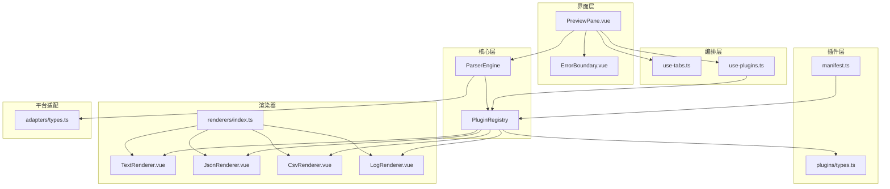
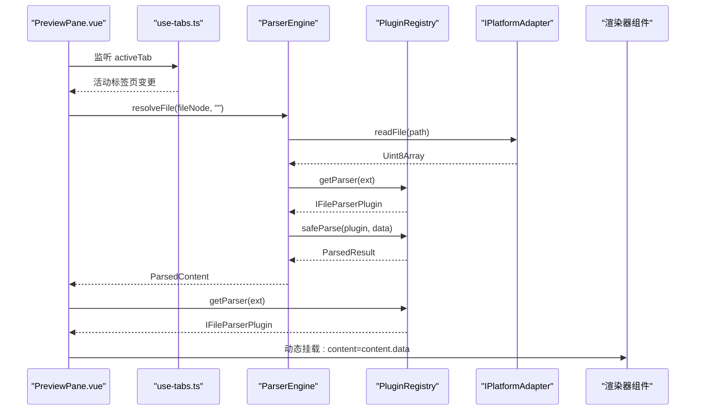
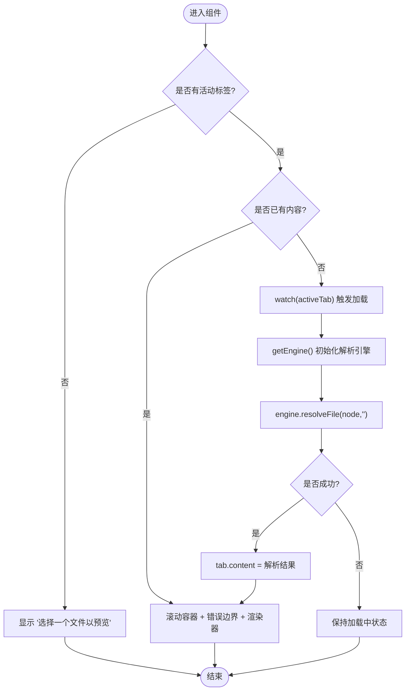
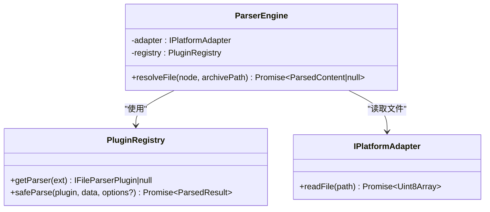
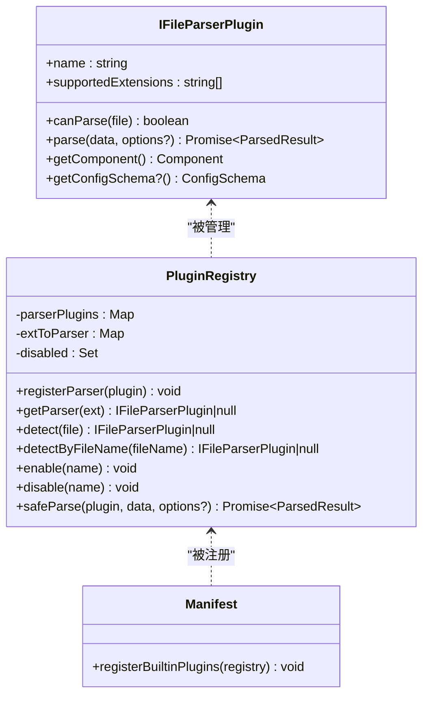
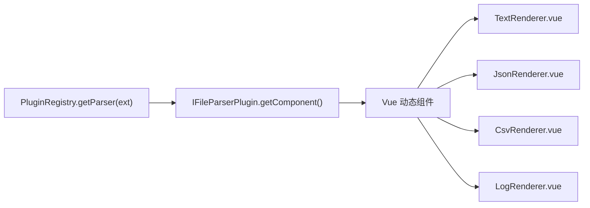
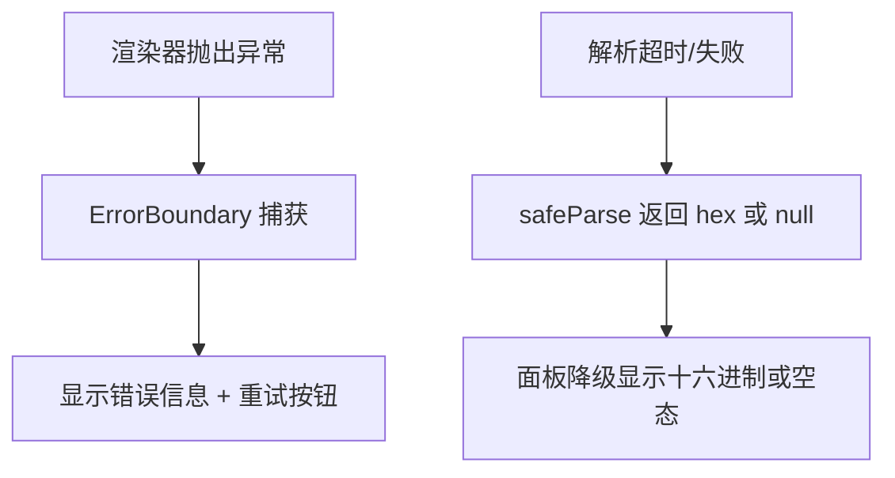
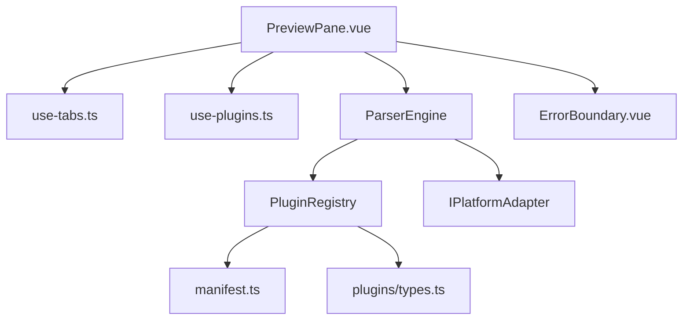

# 预览面板组件

<cite>
**本文引用的文件**   
- [PreviewPane.vue](file://src/components/workspace/PreviewPane.vue)
- [parser-engine.ts](file://src/core/parser-engine.ts)
- [registry.ts](file://src/plugins/registry.ts)
- [use-plugins.ts](file://src/composables/use-plugins.ts)
- [manifest.ts](file://src/plugins/manifest.ts)
- [types.ts](file://src/plugins/types.ts)
- [index.ts](file://src/views/renderers/index.ts)
- [TextRenderer.vue](file://src/views/renderers/TextRenderer.vue)
- [JsonRenderer.vue](file://src/views/renderers/JsonRenderer.vue)
- [CsvRenderer.vue](file://src/views/renderers/CsvRenderer.vue)
- [LogRenderer.vue](file://src/views/renderers/LogRenderer.vue)
- [ErrorBoundary.vue](file://src/components/shared/ErrorBoundary.vue)
- [use-tabs.ts](file://src/composables/use-tabs.ts)
- [types.ts](file://src/adapters/types.ts)
- [index.ts](file://src/types/index.ts)
</cite>

## 目录
1. [简介](#简介)
2. [项目结构](#项目结构)
3. [核心组件](#核心组件)
4. [架构总览](#架构总览)
5. [详细组件分析](#详细组件分析)
6. [依赖关系分析](#依赖关系分析)
7. [性能考虑](#性能考虑)
8. [故障排查指南](#故障排查指南)
9. [结论](#结论)
10. [附录](#附录)

## 简介
本文件为 PreviewPane.vue 预览面板组件的权威技术文档。内容围绕以下目标展开：
- 深入解释内容渲染的核心机制，包括不同文件格式的动态加载与渲染选择
- 详细描述视图切换逻辑，如何根据文件类型自动选择合适的渲染器组件
- 阐述大文件处理的性能优化策略（虚拟滚动、懒加载、内存映射等）
- 说明渲染器的注册与发现机制，支持插件化扩展的架构设计
- 解释错误边界与降级显示的实现，确保应用稳定性
- 提供自定义渲染器的开发指南与集成方法
- 包含渲染性能监控与优化建议

## 项目结构
预览系统由“面板容器 + 解析引擎 + 插件注册表 + 渲染器”构成。PreviewPane 作为容器负责监听标签页变化、驱动解析引擎、动态挂载渲染器；ParserEngine 负责读取文件并调用对应插件进行解析；PluginRegistry 管理所有解析与压缩插件；各渲染器以 Vue 组件形式暴露给注册表。

图表来源
- [PreviewPane.vue:1-58](file://src/components/workspace/PreviewPane.vue#L1-L58)
- [parser-engine.ts:1-35](file://src/core/parser-engine.ts#L1-L35)
- [registry.ts:1-118](file://src/plugins/registry.ts#L1-L118)
- [use-plugins.ts:1-17](file://src/composables/use-plugins.ts#L1-L17)
- [manifest.ts:1-20](file://src/plugins/manifest.ts#L1-L20)
- [types.ts:1-37](file://src/plugins/types.ts#L1-L37)
- [index.ts:1-5](file://src/views/renderers/index.ts#L1-L5)
- [TextRenderer.vue:1-38](file://src/views/renderers/TextRenderer.vue#L1-L38)
- [JsonRenderer.vue:1-30](file://src/views/renderers/JsonRenderer.vue#L1-L30)
- [CsvRenderer.vue:1-52](file://src/views/renderers/CsvRenderer.vue#L1-L52)
- [LogRenderer.vue:1-57](file://src/views/renderers/LogRenderer.vue#L1-L57)
- [ErrorBoundary.vue:1-30](file://src/components/shared/ErrorBoundary.vue#L1-L30)
- [use-tabs.ts:1-64](file://src/composables/use-tabs.ts#L1-L64)
- [types.ts:1-12](file://src/adapters/types.ts#L1-L12)

章节来源
- [PreviewPane.vue:1-58](file://src/components/workspace/PreviewPane.vue#L1-L58)
- [use-tabs.ts:1-64](file://src/composables/use-tabs.ts#L1-L64)
- [use-plugins.ts:1-17](file://src/composables/use-plugins.ts#L1-L17)
- [parser-engine.ts:1-35](file://src/core/parser-engine.ts#L1-L35)
- [registry.ts:1-118](file://src/plugins/registry.ts#L1-L118)
- [manifest.ts:1-20](file://src/plugins/manifest.ts#L1-L20)
- [types.ts:1-37](file://src/plugins/types.ts#L1-L37)
- [index.ts:1-5](file://src/views/renderers/index.ts#L1-L5)
- [ErrorBoundary.vue:1-30](file://src/components/shared/ErrorBoundary.vue#L1-L30)
- [types.ts:1-12](file://src/adapters/types.ts#L1-L12)

## 核心组件
- PreviewPane.vue：预览面板容器，负责监听活动标签页、按需加载内容、按扩展名选择渲染器、包裹错误边界与滚动容器。
- ParserEngine：解析引擎，封装平台适配器与插件注册表，完成“读取文件 -> 匹配插件 -> 安全解析 -> 返回结构化内容”的流程。
- PluginRegistry：插件注册中心，维护解析器与压缩器映射，提供检测、启用/禁用、超时保护与安全解析能力。
- use-plugins：组合式函数，提供全局单例注册表及便捷 API。
- ErrorBoundary：通用错误边界，捕获渲染异常并提供重试入口。
- 渲染器集合：Text/Json/Csv/Log 渲染器，分别处理文本、JSON、CSV、日志的结构化展示。

章节来源
- [PreviewPane.vue:1-58](file://src/components/workspace/PreviewPane.vue#L1-L58)
- [parser-engine.ts:1-35](file://src/core/parser-engine.ts#L1-L35)
- [registry.ts:1-118](file://src/plugins/registry.ts#L1-L118)
- [use-plugins.ts:1-17](file://src/composables/use-plugins.ts#L1-L17)
- [ErrorBoundary.vue:1-30](file://src/components/shared/ErrorBoundary.vue#L1-L30)
- [TextRenderer.vue:1-38](file://src/views/renderers/TextRenderer.vue#L1-L38)
- [JsonRenderer.vue:1-30](file://src/views/renderers/JsonRenderer.vue#L1-L30)
- [CsvRenderer.vue:1-52](file://src/views/renderers/CsvRenderer.vue#L1-L52)
- [LogRenderer.vue:1-57](file://src/views/renderers/LogRenderer.vue#L1-L57)

## 架构总览
预览面板采用“事件驱动 + 插件化”的架构：
- 标签页状态变更触发内容解析
- 解析引擎通过扩展名在注册表中查找对应解析器
- 解析器返回结构化数据与渲染组件引用
- 面板动态挂载渲染器，并由错误边界兜底

图表来源
- [PreviewPane.vue:1-58](file://src/components/workspace/PreviewPane.vue#L1-L58)
- [parser-engine.ts:1-35](file://src/core/parser-engine.ts#L1-L35)
- [registry.ts:1-118](file://src/plugins/registry.ts#L1-L118)
- [types.ts:1-12](file://src/adapters/types.ts#L1-L12)

## 详细组件分析

### PreviewPane.vue 分析与流程
- 职责
  - 监听活动标签页，首次或切换时按需加载内容
  - 基于文件扩展名从注册表获取解析器与渲染组件
  - 使用 NEmpty 展示空态与加载中状态
  - 使用 NScrollbar 提供滚动容器
  - 使用 ErrorBoundary 包裹渲染器，防止崩溃扩散
- 关键流程
  - 当 activeTab 存在且无 content 时，创建或复用 ParserEngine 实例，调用 resolveFile 异步加载
  - 解析成功后将结果写入 tab.content
  - 计算属性 rendererComponent 根据扩展名选择渲染器组件
  - 模板中动态挂载渲染器并传入 content.data

图表来源
- [PreviewPane.vue:1-58](file://src/components/workspace/PreviewPane.vue#L1-L58)
- [parser-engine.ts:1-35](file://src/core/parser-engine.ts#L1-L35)

章节来源
- [PreviewPane.vue:1-58](file://src/components/workspace/PreviewPane.vue#L1-L58)
- [use-tabs.ts:1-64](file://src/composables/use-tabs.ts#L1-L64)

### 解析引擎 ParserEngine
- 职责
  - 通过平台适配器读取文件字节
  - 依据扩展名选择解析器（含默认回退）
  - 调用注册表的 safeParse 执行带超时的解析
  - 返回包含类型、数据、行数、耗时与插件名的结构化内容
- 关键点
  - 使用 performance.now 记录加载耗时，便于后续监控
  - 对未找到解析器的情况直接返回 null，避免异常
  - 统一异常路径返回 null，上层可据此降级显示

图表来源
- [parser-engine.ts:1-35](file://src/core/parser-engine.ts#L1-L35)
- [registry.ts:1-118](file://src/plugins/registry.ts#L1-L118)
- [types.ts:1-12](file://src/adapters/types.ts#L1-L12)

章节来源
- [parser-engine.ts:1-35](file://src/core/parser-engine.ts#L1-L35)
- [registry.ts:1-118](file://src/plugins/registry.ts#L1-L118)
- [types.ts:1-12](file://src/adapters/types.ts#L1-L12)

### 插件注册与发现机制
- 注册入口
  - manifest.ts 集中注册内置解析器与压缩器
  - use-plugins.ts 提供全局单例注册表与便捷 API
- 发现与匹配
  - registry.getParser(ext) 通过扩展名精确匹配
  - registry.detect(file) 与 detectByFileName(fileName) 支持文件名后缀匹配
  - 支持启用/禁用插件，影响匹配结果
- 安全解析
  - safeParse 提供超时保护与失败降级（如回退到十六进制视图）

图表来源
- [registry.ts:1-118](file://src/plugins/registry.ts#L1-L118)
- [manifest.ts:1-20](file://src/plugins/manifest.ts#L1-L20)
- [types.ts:1-37](file://src/plugins/types.ts#L1-L37)

章节来源
- [registry.ts:1-118](file://src/plugins/registry.ts#L1-L118)
- [manifest.ts:1-20](file://src/plugins/manifest.ts#L1-L20)
- [use-plugins.ts:1-17](file://src/composables/use-plugins.ts#L1-L17)
- [types.ts:1-37](file://src/plugins/types.ts#L1-L37)

### 渲染器与动态挂载
- 渲染器集合
  - TextRenderer：逐行展示文本，适合代码、配置、日志等
  - JsonRenderer：递归渲染 JSON 节点，支持折叠展开
  - CsvRenderer：表格展示 CSV 数据，表头固定
  - LogRenderer：结构化日志行，按级别着色
- 动态挂载
  - PreviewPane 通过 computed(rendererComponent) 选择组件
  - 使用 Vue 的 <component :is="..."> 动态挂载
  - 向渲染器传入 content.data，具体数据结构由解析器决定

图表来源
- [registry.ts:1-118](file://src/plugins/registry.ts#L1-L118)
- [index.ts:1-5](file://src/views/renderers/index.ts#L1-L5)
- [TextRenderer.vue:1-38](file://src/views/renderers/TextRenderer.vue#L1-L38)
- [JsonRenderer.vue:1-30](file://src/views/renderers/JsonRenderer.vue#L1-L30)
- [CsvRenderer.vue:1-52](file://src/views/renderers/CsvRenderer.vue#L1-L52)
- [LogRenderer.vue:1-57](file://src/views/renderers/LogRenderer.vue#L1-L57)

章节来源
- [index.ts:1-5](file://src/views/renderers/index.ts#L1-L5)
- [TextRenderer.vue:1-38](file://src/views/renderers/TextRenderer.vue#L1-L38)
- [JsonRenderer.vue:1-30](file://src/views/renderers/JsonRenderer.vue#L1-L30)
- [CsvRenderer.vue:1-52](file://src/views/renderers/CsvRenderer.vue#L1-L52)
- [LogRenderer.vue:1-57](file://src/views/renderers/LogRenderer.vue#L1-L57)

### 错误边界与降级显示
- 错误边界
  - ErrorBoundary 捕获子树渲染异常，显示错误信息与重试按钮
  - 阻止异常冒泡，保障整体应用稳定
- 降级策略
  - 解析失败或超时：safeParse 回退为十六进制视图
  - 未找到解析器：返回 null，面板显示空态或加载中
  - 平台读取失败：统一返回 null，上层不抛错

图表来源
- [ErrorBoundary.vue:1-30](file://src/components/shared/ErrorBoundary.vue#L1-L30)
- [registry.ts:1-118](file://src/plugins/registry.ts#L1-L118)
- [parser-engine.ts:1-35](file://src/core/parser-engine.ts#L1-L35)

章节来源
- [ErrorBoundary.vue:1-30](file://src/components/shared/ErrorBoundary.vue#L1-L30)
- [registry.ts:1-118](file://src/plugins/registry.ts#L1-L118)
- [parser-engine.ts:1-35](file://src/core/parser-engine.ts#L1-L35)

## 依赖关系分析
- 组件耦合
  - PreviewPane 依赖 use-tabs 的状态与 use-plugins 的注册表
  - ParserEngine 依赖 PlatformAdapter 与 PluginRegistry
  - 渲染器仅依赖输入数据，低耦合
- 外部依赖
  - Naive UI 提供基础 UI 组件（NEmpty、NScrollbar、NResult、NButton）
  - 平台适配器抽象了文件系统与流式/内存映射读取能力

图表来源
- [PreviewPane.vue:1-58](file://src/components/workspace/PreviewPane.vue#L1-L58)
- [use-tabs.ts:1-64](file://src/composables/use-tabs.ts#L1-L64)
- [use-plugins.ts:1-17](file://src/composables/use-plugins.ts#L1-L17)
- [parser-engine.ts:1-35](file://src/core/parser-engine.ts#L1-L35)
- [registry.ts:1-118](file://src/plugins/registry.ts#L1-L118)
- [manifest.ts:1-20](file://src/plugins/manifest.ts#L1-L20)
- [types.ts:1-37](file://src/plugins/types.ts#L1-L37)
- [ErrorBoundary.vue:1-30](file://src/components/shared/ErrorBoundary.vue#L1-L30)

章节来源
- [PreviewPane.vue:1-58](file://src/components/workspace/PreviewPane.vue#L1-L58)
- [use-tabs.ts:1-64](file://src/composables/use-tabs.ts#L1-L64)
- [use-plugins.ts:1-17](file://src/composables/use-plugins.ts#L1-L17)
- [parser-engine.ts:1-35](file://src/core/parser-engine.ts#L1-L35)
- [registry.ts:1-118](file://src/plugins/registry.ts#L1-L118)
- [manifest.ts:1-20](file://src/plugins/manifest.ts#L1-L20)
- [types.ts:1-37](file://src/plugins/types.ts#L1-L37)
- [ErrorBoundary.vue:1-30](file://src/components/shared/ErrorBoundary.vue#L1-L30)

## 性能考虑
当前实现已具备良好扩展点，针对大文件与复杂渲染场景，建议如下优化：
- 虚拟滚动
  - 在文本与日志渲染器中使用虚拟列表，仅渲染可视区域行，显著降低 DOM 节点数量
  - 结合 NScrollbar 的滚动事件，按需更新可见窗口
- 懒加载与分页
  - 对超大 JSON/CSV 采用分块解析与分页渲染，首屏快速呈现，滚动时加载更多
  - 利用 Web Worker 在后台线程解析，避免阻塞主线程
- 内存映射与流式读取
  - 通过 IPlatformAdapter.mmapRead 与 streamRead 接口，实现零拷贝或增量读取
  - 对只读预览场景优先使用流式读取，减少一次性内存占用
- 解析超时与降级
  - 保留 safeParse 的超时保护，对异常格式快速回退至十六进制视图
- 缓存与去重
  - 基于文件路径与大小构建缓存键，避免重复解析
  - 对相同内容的多个标签页共享解析结果
- 渲染性能监控
  - 使用 loadTimeMs 指标统计解析耗时
  - 在渲染器内增加首帧渲染时间、DOM 节点数、内存占用等埋点
  - 提供可视化面板展示历史性能趋势

[本节为通用指导，无需特定文件来源]

## 故障排查指南
- 常见问题
  - 无法识别的文件类型：检查扩展名是否在插件 supportedExtensions 中，确认插件已注册且未被禁用
  - 解析超时：查看 safeParse 超时阈值，必要时调整或优化解析逻辑
  - 渲染崩溃：确认 ErrorBoundary 是否正确捕获，检查渲染器 props 数据结构是否与解析器输出一致
  - 大文件卡顿：引入虚拟滚动与懒加载，评估是否改用流式/内存映射读取
- 定位步骤
  - 打开浏览器控制台，观察网络与资源加载
  - 在 ParserEngine 与 Registry 的关键路径添加日志，确认解析链路与返回值
  - 使用 Performance 面板分析长任务与布局抖动
- 恢复手段
  - 使用 ErrorBoundary 的重试按钮重新渲染
  - 通过 registry.disable/enable 控制插件开关，隔离问题插件

章节来源
- [registry.ts:1-118](file://src/plugins/registry.ts#L1-L118)
- [ErrorBoundary.vue:1-30](file://src/components/shared/ErrorBoundary.vue#L1-L30)
- [parser-engine.ts:1-35](file://src/core/parser-engine.ts#L1-L35)

## 结论
PreviewPane 通过清晰的职责划分与插件化架构，实现了多格式文件的动态加载与渲染。借助 ParserEngine 与 PluginRegistry，系统具备良好的可扩展性与容错能力。未来可在虚拟滚动、流式读取与性能监控方面进一步演进，以提升大文件体验与可观测性。

[本节为总结性内容，无需特定文件来源]

## 附录

### 自定义渲染器开发指南
- 定义解析器插件
  - 实现 IFileParserPlugin 接口，声明 name、supportedExtensions、canParse、parse、getComponent
  - parse 返回 ParsedResult，包含 type、data、lineCount 等字段
  - getComponent 返回对应的 Vue 渲染器组件
- 注册插件
  - 在 manifest.ts 中调用 registerParser 注册新插件
  - 或通过 use-plugins 提供的 registry 在运行时动态注册
- 编写渲染器组件
  - 接收 content 属性，其结构与解析器输出的 data 保持一致
  - 处理空值与异常分支，保证健壮性
- 集成验证
  - 打开对应扩展名文件，确认自动匹配与渲染正常
  - 在性能面板下验证渲染开销与内存占用

章节来源
- [types.ts:1-37](file://src/plugins/types.ts#L1-L37)
- [manifest.ts:1-20](file://src/plugins/manifest.ts#L1-L20)
- [use-plugins.ts:1-17](file://src/composables/use-plugins.ts#L1-L17)
- [index.ts:1-5](file://src/views/renderers/index.ts#L1-L5)

### 数据类型与契约
- FileTreeNode：文件树节点，包含 key、label、path、size、children 等
- ParsedContent：解析后的内容，包含 type、data、lineCount、loadTimeMs、pluginName
- TabItem：标签项，关联 fileNode 与 content
- IPlatformAdapter：平台抽象，提供 readFile、mmapRead、streamRead 等能力

章节来源
- [index.ts:1-71](file://src/types/index.ts#L1-L71)
- [types.ts:1-12](file://src/adapters/types.ts#L1-L12)