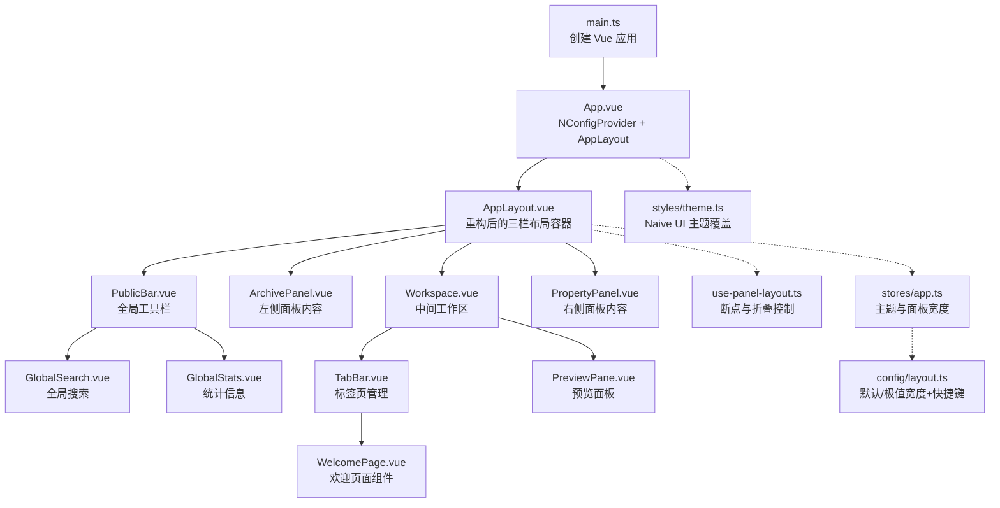
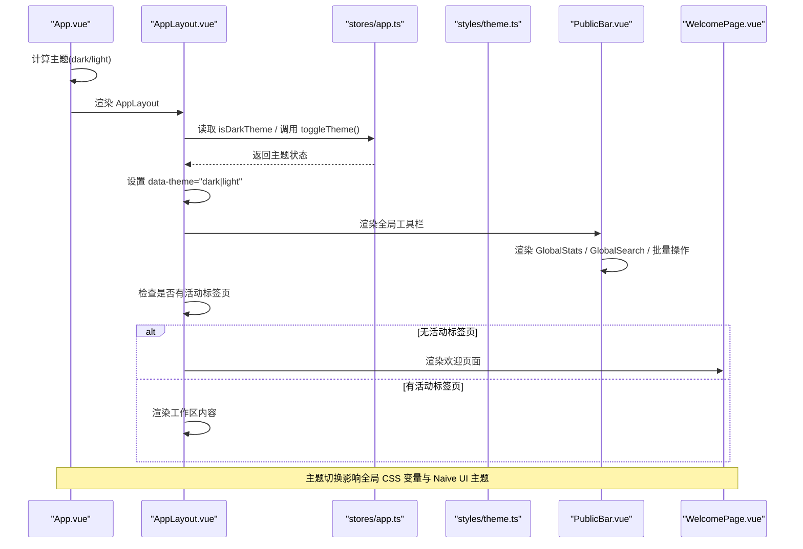
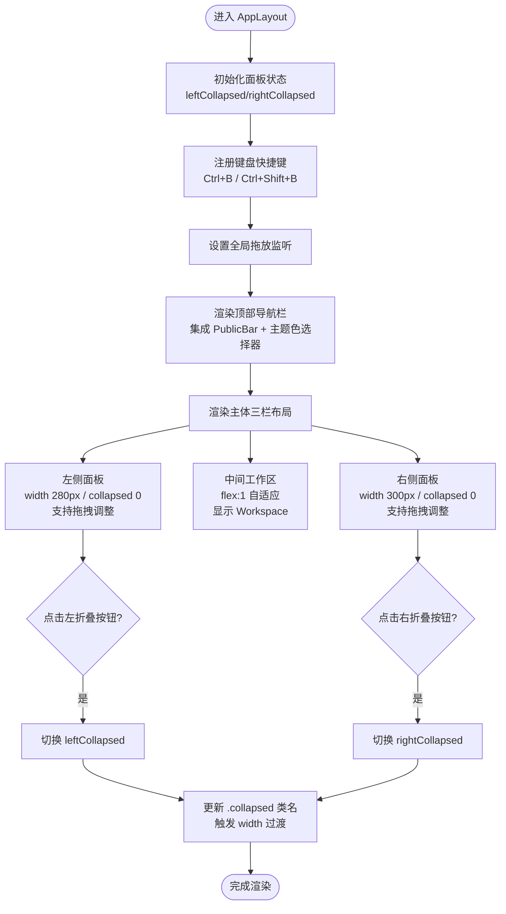
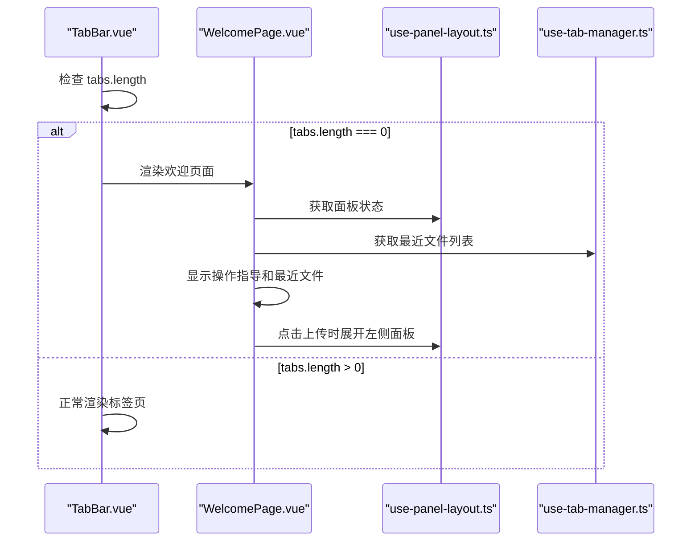
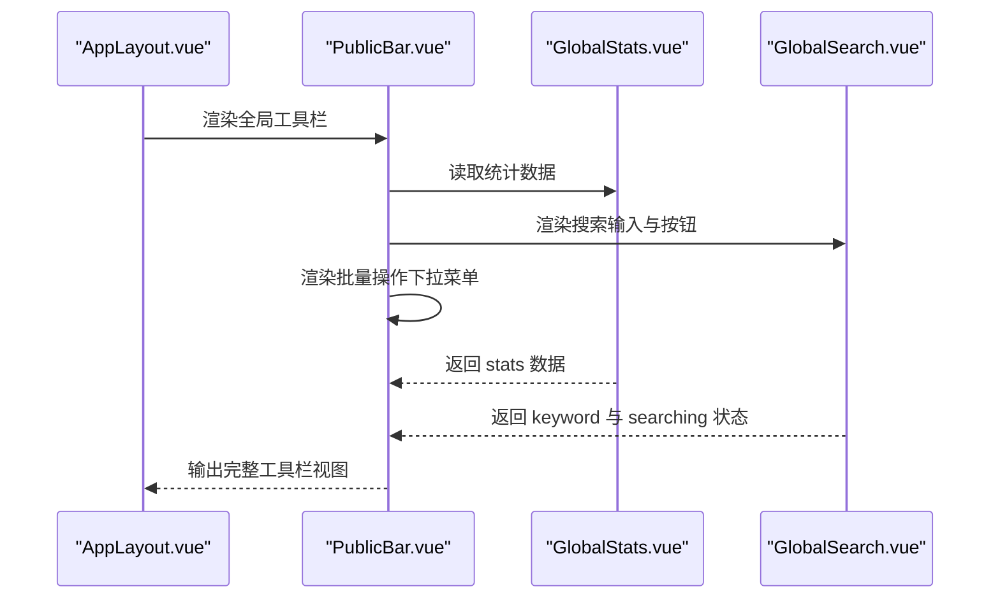
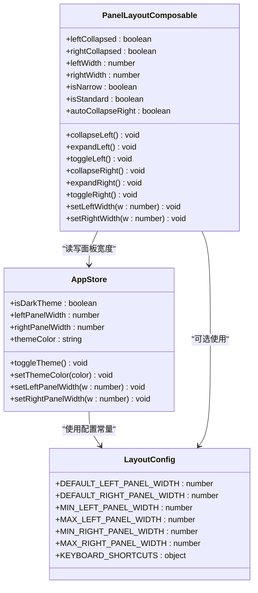
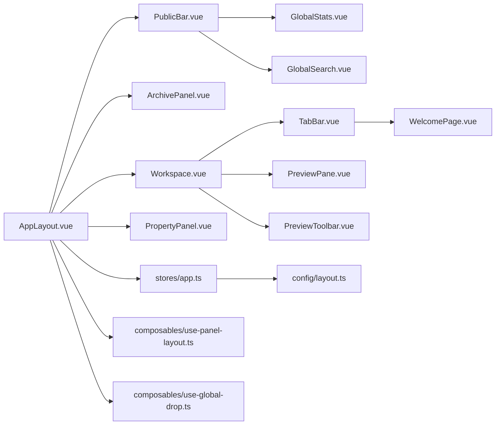

# 布局组件

<cite>
**本文引用的文件**
- [AppLayout.vue](file://src/layout/AppLayout.vue)
- [PublicBar.vue](file://src/components/public-bar/PublicBar.vue)
- [GlobalSearch.vue](file://src/components/public-bar/GlobalSearch.vue)
- [GlobalStats.vue](file://src/components/public-bar/GlobalStats.vue)
- [WelcomePage.vue](file://src/components/workspace/WelcomePage.vue)
- [Workspace.vue](file://src/components/workspace/Workspace.vue)
- [TabBar.vue](file://src/components/workspace/TabBar.vue)
- [PreviewPane.vue](file://src/components/workspace/PreviewPane.vue)
- [use-panel-layout.ts](file://src/composables/use-panel-layout.ts)
- [layout.ts](file://src/config/layout.ts)
- [index.ts](file://src/config/index.ts)
- [app.ts](file://src/stores/app.ts)
- [theme.ts](file://src/styles/theme.ts)
- [App.vue](file://src/App.vue)
- [main.ts](file://src/main.ts)
</cite>

## 更新摘要
**变更内容**
- AppLayout.vue 从449行重构为331行，实现响应式宽度适配和改进的面板管理
- 新增 WelcomePage.vue 欢迎页面组件，提供用户引导和快速操作入口
- 增强键盘快捷键支持，集成 @vueuse/core 的 useMagicKeys
- 改进全局拖放功能，使用 useGlobalDrop 组合式函数
- 优化面板折叠和拖拽调整宽度的交互体验

## 目录
1. [简介](#简介)
2. [项目结构](#项目结构)
3. [核心组件](#核心组件)
4. [架构总览](#架构总览)
5. [详细组件分析](#详细组件分析)
6. [依赖关系分析](#依赖关系分析)
7. [性能考虑](#性能考虑)
8. [故障排查指南](#故障排查指南)
9. [结论](#结论)
10. [附录](#附录)

## 简介
本章节面向 Hello-Tauri 项目的布局系统，聚焦于三栏式布局的实现与扩展。文档将深入解析 AppLayout.vue 的重构后布局结构与交互逻辑、PublicBar 全局工具栏的功能与集成方式、新增的 WelcomePage 欢迎页面组件、面板宽度与折叠状态的管理策略、主题适配机制，并提供配置选项、自定义样式方法以及性能优化建议。目标是帮助开发者快速理解并高效维护该布局体系。

## 项目结构
布局相关代码主要分布在以下位置：
- 布局容器：src/layout/AppLayout.vue（已重构优化）
- 全局工具栏：src/components/public-bar/PublicBar.vue（含 GlobalSearch.vue、GlobalStats.vue）
- 工作区组件：src/components/workspace/（含 Workspace.vue、TabBar.vue、PreviewPane.vue、WelcomePage.vue）
- 布局配置：src/config/layout.ts（默认宽度、最小/最大宽度、键盘快捷键）
- 布局组合式函数：src/composables/use-panel-layout.ts（响应式断点与折叠控制）
- 应用状态管理：src/stores/app.ts（主题切换、面板宽度设置）
- Naive UI 主题覆盖：src/styles/theme.ts
- 应用入口与根组件：src/main.ts、src/App.vue

**图表来源**
- [main.ts:1-8](file://src/main.ts#L1-L8)
- [App.vue:1-24](file://src/App.vue#L1-L24)
- [AppLayout.vue:1-331](file://src/layout/AppLayout.vue#L1-L331)
- [PublicBar.vue:1-33](file://src/components/public-bar/PublicBar.vue#L1-L33)
- [GlobalSearch.vue:1-31](file://src/components/public-bar/GlobalSearch.vue#L1-L31)
- [GlobalStats.vue:1-24](file://src/components/public-bar/GlobalStats.vue#L1-L24)
- [Workspace.vue:1-39](file://src/components/workspace/Workspace.vue#L1-L39)
- [TabBar.vue:1-254](file://src/components/workspace/TabBar.vue#L1-L254)
- [WelcomePage.vue:1-111](file://src/components/workspace/WelcomePage.vue#L1-L111)
- [PreviewPane.vue:1-94](file://src/components/workspace/PreviewPane.vue#L1-L94)
- [use-panel-layout.ts:1-48](file://src/composables/use-panel-layout.ts#L1-L48)
- [app.ts:1-65](file://src/stores/app.ts#L1-L65)
- [layout.ts:1-16](file://src/config/layout.ts#L1-L16)
- [theme.ts:1-13](file://src/styles/theme.ts#L1-L13)

## 核心组件
本节对布局系统的核心组件进行概览说明，重点包括：
- AppLayout.vue：重构后的应用外壳与三栏布局容器，负责顶部导航、主体区域、底部状态栏，以及左右面板的智能折叠按钮与主题变量注入。
- PublicBar.vue：全局工具栏，聚合全局统计、全局搜索与批量操作下拉菜单。
- WelcomePage.vue：新增的欢迎页面组件，提供拖拽上传指导、文件上传指引、搜索功能提示和最近文件访问卡片。
- use-panel-layout.ts：提供基于断点的自动折叠策略与面板宽度控制 API，支持响应式设计。
- stores/app.ts：集中管理主题切换与面板宽度设置，使用配置常量限制范围。
- config/layout.ts：定义默认与边界宽度及键盘快捷键配置，作为布局配置的单一事实来源。

**章节来源**
- [AppLayout.vue:1-331](file://src/layout/AppLayout.vue#L1-L331)
- [PublicBar.vue:1-33](file://src/components/public-bar/PublicBar.vue#L1-L33)
- [WelcomePage.vue:1-111](file://src/components/workspace/WelcomePage.vue#L1-L111)
- [use-panel-layout.ts:1-48](file://src/composables/use-panel-layout.ts#L1-L48)
- [app.ts:1-65](file://src/stores/app.ts#L1-L65)
- [layout.ts:1-16](file://src/config/layout.ts#L1-L16)

## 架构总览
整体架构采用"容器 + 子组件"的组合模式，经过重构后更加清晰和模块化：
- 顶层通过 NConfigProvider 注入 Naive UI 主题与覆盖项，AppLayout 在数据层通过 data-theme 属性驱动 CSS 变量实现深浅色主题。
- 主体区域使用 flex 布局实现三栏结构，左右面板通过 width 与 collapsed 类名控制显示与隐藏，中间工作区自适应填充剩余空间。
- PublicBar 作为全局工具栏嵌入到顶部导航中心区域，提供统计展示、搜索与批量操作能力。
- WelcomePage 作为无标签页时的默认视图，提供用户引导和快速操作入口。
- 布局状态由 Pinia store 与组合式函数共同管理，确保跨组件一致性与可测试性。
- 增强的键盘快捷键支持通过 @vueuse/core 的 useMagicKeys 实现。

**图表来源**
- [App.vue:1-24](file://src/App.vue#L1-L24)
- [AppLayout.vue:1-331](file://src/layout/AppLayout.vue#L1-L331)
- [app.ts:1-65](file://src/stores/app.ts#L1-L65)
- [theme.ts:1-13](file://src/styles/theme.ts#L1-L13)
- [PublicBar.vue:1-33](file://src/components/public-bar/PublicBar.vue#L1-L33)
- [WelcomePage.vue:1-111](file://src/components/workspace/WelcomePage.vue#L1-L111)

## 详细组件分析

### AppLayout.vue 重构后的三栏式布局实现
**更新** 经过全面重构，代码从449行精简至331行，提升了性能和可维护性。

- 布局结构
  - 顶部导航栏：包含 Logo、标题、徽章、PublicBar 全局工具栏、帮助菜单、主题色选择器与主题切换按钮。
  - 主体内容区：flex 三栏布局，左侧 ArchivePanel、中间 Workspace、右侧 PropertyPanel。
  - 底部状态栏：固定高度，居中显示全局状态信息。
- 增强的折叠交互
  - 左右面板各自拥有独立的折叠状态 ref，点击对应侧的折叠按钮切换 collapsed 类名。
  - 折叠按钮位于面板外侧，悬停时可见，避免遮挡面板内容。
  - 支持键盘快捷键 Ctrl+B（左面板）和 Ctrl+Shift+B（右面板）。
- 响应式设计
  - 使用 use-panel-layout.ts 提供的断点判断与自动折叠策略。
  - 支持面板宽度拖拽调整，提供直观的视觉反馈。
- 主题适配
  - 通过 data-theme 属性绑定 store.isDarkTheme，配合 CSS 变量实现深色/浅色主题切换。
  - 新增主题色选择器，支持蓝色、绿色、紫色、橙色四种主题色。
  - Naive UI 主题由 App.vue 的 NConfigProvider 统一注入，AppLayout 中的部分样式使用 CSS 变量以保持一致性。
- 全局拖放功能
  - 集成 useGlobalDrop 组合式函数，支持全局文件拖放上传。
  - 提供视觉反馈遮罩，提升用户体验。

**图表来源**
- [AppLayout.vue:25-331](file://src/layout/AppLayout.vue#L25-L331)

**章节来源**
- [AppLayout.vue:1-331](file://src/layout/AppLayout.vue#L1-L331)

### WelcomePage.vue 新增欢迎页面组件
**新增** 全新的欢迎页面组件，为用户提供友好的初始界面。

- 功能概述
  - 拖拽上传指导：清晰的拖放文件操作指引。
  - 文件上传指引：引导用户使用左侧面板上传区域。
  - 搜索功能提示：介绍全局搜索功能及快捷键。
  - 最近文件访问：显示最近打开的文件列表，支持快速访问。
  - 快捷键提示：展示常用快捷键操作。
- 集成方式
  - 在 TabBar 组件中，当没有活动标签页时自动显示。
  - 使用 Vue 组合式函数获取最近文件数据和面板状态。
- 交互设计
  - 点击"上传文件"提示会智能展开左侧面板。
  - 最近文件列表显示文件名，支持截断处理。
  - 响应式设计，适配不同屏幕尺寸。

**图表来源**
- [TabBar.vue:139-142](file://src/components/workspace/TabBar.vue#L139-L142)
- [WelcomePage.vue:1-111](file://src/components/workspace/WelcomePage.vue#L1-L111)
- [use-panel-layout.ts:1-48](file://src/composables/use-panel-layout.ts#L1-L48)

**章节来源**
- [WelcomePage.vue:1-111](file://src/components/workspace/WelcomePage.vue#L1-L111)
- [TabBar.vue:139-142](file://src/components/workspace/TabBar.vue#L139-L142)

### PublicBar 全局工具栏组件
- 功能概述
  - 全局统计：展示压缩包数量、压缩大小、已解压数量、总文件数等关键指标。
  - 全局搜索：提供输入框与搜索按钮，支持回车触发搜索。
  - 批量操作：下拉菜单提供清空、导出、批量重新解压等操作入口。
- 集成方式
  - 在 AppLayout 的顶部导航中心区域直接引入并渲染。
  - 使用 Naive UI 的 NSpace、NDropdown、NButton 等组件构建布局与交互。
- 数据流
  - 通过 useArchiveManager 获取 archives 与 stats，用于统计展示与批量操作。

**图表来源**
- [PublicBar.vue:1-33](file://src/components/public-bar/PublicBar.vue#L1-L33)
- [GlobalStats.vue:1-24](file://src/components/public-bar/GlobalStats.vue#L1-L24)
- [GlobalSearch.vue:1-31](file://src/components/public-bar/GlobalSearch.vue#L1-L31)

**章节来源**
- [PublicBar.vue:1-33](file://src/components/public-bar/PublicBar.vue#L1-L33)
- [GlobalStats.vue:1-24](file://src/components/public-bar/GlobalStats.vue#L1-L24)
- [GlobalSearch.vue:1-31](file://src/components/public-bar/GlobalSearch.vue#L1-L31)

### 布局状态管理与响应式策略
**更新** 增强了响应式设计和面板管理能力。

- 面板宽度控制
  - stores/app.ts 提供 setLeftPanelWidth/setRightPanelWidth，内部使用 config/layout.ts 的最小/最大宽度进行约束。
  - DEFAULT_LEFT_PANEL_WIDTH、DEFAULT_RIGHT_PANEL_WIDTH 作为初始宽度。
  - 支持实时拖拽调整面板宽度，提供平滑的视觉反馈。
- 折叠状态管理
  - AppLayout.vue 使用本地 ref 管理左右面板折叠状态。
  - use-panel-layout.ts 提供 collapseLeft/expandLeft/collapseRight/expandRight 等方法，并可结合断点进行自动折叠。
  - 支持键盘快捷键 Ctrl+B 和 Ctrl+Shift+B 进行面板切换。
- 响应式设计
  - use-panel-layout.ts 使用 @vueuse/core 的 useBreakpoints 定义 narrow/standard/wide 断点，并暴露 autoCollapseRight 计算属性，便于在小屏或标准屏下自动收起右侧面板。
  - 支持根据屏幕尺寸自动调整面板行为。
- 主题适配
  - App.vue 根据 store.isDarkTheme 动态选择 darkTheme/lightTheme，并通过 themeOverrides 统一覆盖 Naive UI 主题。
  - AppLayout.vue 通过 data-theme 绑定 CSS 变量，使非 Naive UI 的自定义样式也能跟随主题切换。
  - 新增主题色选择器，支持多种主题色动态切换。

**图表来源**
- [app.ts:1-65](file://src/stores/app.ts#L1-L65)
- [use-panel-layout.ts:1-48](file://src/composables/use-panel-layout.ts#L1-L48)
- [layout.ts:1-16](file://src/config/layout.ts#L1-L16)

**章节来源**
- [app.ts:1-65](file://src/stores/app.ts#L1-L65)
- [use-panel-layout.ts:1-48](file://src/composables/use-panel-layout.ts#L1-L48)
- [layout.ts:1-16](file://src/config/layout.ts#L1-L16)

### 布局配置选项与自定义样式
**更新** 新增了键盘快捷键配置和更多自定义选项。

- 配置选项
  - 默认宽度：DEFAULT_LEFT_PANEL_WIDTH、DEFAULT_RIGHT_PANEL_WIDTH
  - 边界宽度：MIN/MAX_LEFT_PANEL_WIDTH、MIN/MAX_RIGHT_PANEL_WIDTH
  - 键盘快捷键：KEYBOARD_SHORTCUTS 对象包含面板切换和搜索快捷键配置
  - 这些常量在 stores/app.ts 中用于面板宽度的设置与校验。
- 自定义样式
  - 主题变量：AppLayout.vue 通过 data-theme 切换 CSS 变量，可在不修改 Naive UI 的前提下定制背景、文本、边框、滚动条等视觉风格。
  - 面板尺寸：可通过调整 .left-panel/.right-panel 的 width 与 .panel-inner-wrap 的固定宽度来改变面板内容与容器的匹配关系。
  - 折叠按钮：.collapse-btn 的透明度、圆角、颜色均可按需调整，以实现更贴合产品风格的交互体验。
  - 主题色：支持动态切换主题色，通过 CSS 变量 --color-primary 控制。

**章节来源**
- [layout.ts:1-16](file://src/config/layout.ts#L1-L16)
- [app.ts:1-65](file://src/stores/app.ts#L1-L65)
- [AppLayout.vue:125-138](file://src/layout/AppLayout.vue#L125-L138)

## 依赖关系分析
**更新** 新增了 WelcomePage 组件和相关依赖。

- 组件耦合
  - AppLayout.vue 依赖 PublicBar、ArchivePanel、Workspace、PropertyPanel 三个子组件，形成清晰的父子关系。
  - PublicBar 依赖 GlobalStats 与 GlobalSearch，职责单一且内聚度高。
  - Workspace 依赖 TabBar、PreviewToolbar、PreviewPane，构成完整的工作区功能。
  - TabBar 依赖 WelcomePage，在无标签页时显示欢迎界面。
- 外部依赖
  - Naive UI：NButton、NTooltip、NSpace、NDropdown、NInput、NStatistic、NTag 等组件被广泛使用。
  - VueUse：useBreakpoints、useMagicKeys、whenever 提供响应式断点和键盘事件处理能力。
  - Pinia：useAppStore 管理主题与面板宽度。
- 潜在循环依赖
  - 当前布局模块之间为单向依赖，未发现循环引用风险。

**图表来源**
- [AppLayout.vue:1-331](file://src/layout/AppLayout.vue#L1-L331)
- [PublicBar.vue:1-33](file://src/components/public-bar/PublicBar.vue#L1-L33)
- [GlobalStats.vue:1-24](file://src/components/public-bar/GlobalStats.vue#L1-L24)
- [GlobalSearch.vue:1-31](file://src/components/public-bar/GlobalSearch.vue#L1-L31)
- [Workspace.vue:1-39](file://src/components/workspace/Workspace.vue#L1-L39)
- [TabBar.vue:1-254](file://src/components/workspace/TabBar.vue#L1-L254)
- [PreviewPane.vue:1-94](file://src/components/workspace/PreviewPane.vue#L1-L94)
- [WelcomePage.vue:1-111](file://src/components/workspace/WelcomePage.vue#L1-L111)
- [app.ts:1-65](file://src/stores/app.ts#L1-L65)
- [layout.ts:1-16](file://src/config/layout.ts#L1-L16)
- [use-panel-layout.ts:1-48](file://src/composables/use-panel-layout.ts#L1-L48)

**章节来源**
- [AppLayout.vue:1-331](file://src/layout/AppLayout.vue#L1-L331)
- [PublicBar.vue:1-33](file://src/components/public-bar/PublicBar.vue#L1-L33)
- [Workspace.vue:1-39](file://src/components/workspace/Workspace.vue#L1-L39)
- [TabBar.vue:1-254](file://src/components/workspace/TabBar.vue#L1-L254)
- [WelcomePage.vue:1-111](file://src/components/workspace/WelcomePage.vue#L1-L111)
- [app.ts:1-65](file://src/stores/app.ts#L1-L65)
- [use-panel-layout.ts:1-48](file://src/composables/use-panel-layout.ts#L1-L48)
- [layout.ts:1-16](file://src/config/layout.ts#L1-L16)

## 性能考虑
**更新** 针对重构后的布局系统提出新的性能优化建议。

- 减少不必要的重排与重绘
  - 面板折叠通过 width 与 transition 实现，避免频繁 DOM 操作；建议在大规模列表场景中使用虚拟滚动或分页加载。
  - 拖拽调整宽度时使用 requestAnimationFrame 优化性能，避免高频更新导致的卡顿。
- 主题切换开销
  - 主题切换仅变更 data-theme 与 Naive UI 主题对象，开销较小；若自定义样式较多，建议将常用变量抽离至 CSS 变量以减少重复计算。
  - 主题色切换通过 CSS 变量实时更新，性能开销极低。
- 全局搜索与统计
  - GlobalSearch 的搜索逻辑应加入防抖与节流，避免高频输入导致的全量扫描；GlobalStats 的数据源需保证增量更新而非全量重建。
- 组件懒加载
  - 对于 ArchivePanel、PropertyPanel 等大体积组件，可考虑按需加载或延迟初始化，提升首屏渲染速度。
  - WelcomePage 组件轻量级，无需特殊优化。
- 事件监听清理
  - 如 AppLayout 中的实时时钟定时器需在组件卸载时清理，避免内存泄漏。
  - 全局拖放事件监听器在组件卸载时正确移除。
- 键盘事件优化
  - 使用 @vueuse/core 的 useMagicKeys 提供高效的键盘事件处理，避免手动事件监听的性能开销。

## 故障排查指南
**更新** 增加了新功能的故障排查指导。

- 主题未生效
  - 检查 App.vue 是否正确传入 theme 与 theme-overrides。
  - 确认 AppLayout.vue 的 data-theme 是否随 store.isDarkTheme 变化。
  - 验证主题色选择器的 CSS 变量设置是否正确。
- 面板无法折叠
  - 检查左右面板的 collapsed 类名是否正确绑定。
  - 确认折叠按钮的点击事件是否触发了对应的状态切换。
  - 验证键盘快捷键是否正确注册。
- 面板宽度越界
  - 检查 stores/app.ts 的 setLeftPanelWidth/setRightPanelWidth 是否使用了正确的最小/最大宽度常量。
  - 确认拖拽调整宽度时的边界检查逻辑。
- 全局工具栏异常
  - 检查 PublicBar 的子组件是否正确引入与渲染。
  - 确认 useArchiveManager 的数据源是否正常更新。
- 欢迎页面不显示
  - 检查 TabBar 组件的标签页状态判断逻辑。
  - 确认 WelcomePage 组件是否正确导入和渲染。
- 键盘快捷键无效
  - 验证 useMagicKeys 是否正确初始化。
  - 检查快捷键配置是否与 layout.ts 中的配置一致。
  - 确认事件监听器是否在正确的生命周期注册。

**章节来源**
- [App.vue:1-24](file://src/App.vue#L1-L24)
- [AppLayout.vue:1-331](file://src/layout/AppLayout.vue#L1-L331)
- [app.ts:1-65](file://src/stores/app.ts#L1-L65)
- [PublicBar.vue:1-33](file://src/components/public-bar/PublicBar.vue#L1-L33)
- [TabBar.vue:139-142](file://src/components/workspace/TabBar.vue#L139-L142)
- [WelcomePage.vue:1-111](file://src/components/workspace/WelcomePage.vue#L1-L111)
- [layout.ts:1-16](file://src/config/layout.ts#L1-L16)

## 结论
Hello-Tauri 的布局系统经过重构后更加完善和现代化。以 AppLayout.vue 为核心，结合 PublicBar 全局工具栏、新增的 WelcomePage 欢迎页面组件与 Pinia 状态管理，实现了清晰、可扩展的三栏式桌面应用界面。通过 CSS 变量与 Naive UI 主题覆盖，主题适配简洁可靠；通过配置常量与组合式函数，面板宽度与折叠状态具备良好的一致性与可维护性。增强的键盘快捷键支持和全局拖放功能进一步提升了用户体验。建议在生产环境中继续优化响应式自动折叠、搜索防抖与组件懒加载，以提升用户体验与性能表现。

## 附录
- 关键路径参考
  - 布局容器：src/layout/AppLayout.vue
  - 全局工具栏：src/components/public-bar/PublicBar.vue
  - 欢迎页面：src/components/workspace/WelcomePage.vue
  - 工作区组件：src/components/workspace/（Workspace.vue、TabBar.vue、PreviewPane.vue）
  - 布局配置：src/config/layout.ts
  - 布局组合式函数：src/composables/use-panel-layout.ts
  - 应用状态：src/stores/app.ts
  - 主题覆盖：src/styles/theme.ts
  - 根组件与入口：src/App.vue、src/main.ts

**章节来源**
- [AppLayout.vue:1-331](file://src/layout/AppLayout.vue#L1-L331)
- [PublicBar.vue:1-33](file://src/components/public-bar/PublicBar.vue#L1-L33)
- [WelcomePage.vue:1-111](file://src/components/workspace/WelcomePage.vue#L1-L111)
- [Workspace.vue:1-39](file://src/components/workspace/Workspace.vue#L1-L39)
- [TabBar.vue:1-254](file://src/components/workspace/TabBar.vue#L1-L254)
- [PreviewPane.vue:1-94](file://src/components/workspace/PreviewPane.vue#L1-L94)
- [layout.ts:1-16](file://src/config/layout.ts#L1-L16)
- [use-panel-layout.ts:1-48](file://src/composables/use-panel-layout.ts#L1-L48)
- [app.ts:1-65](file://src/stores/app.ts#L1-L65)
- [theme.ts:1-13](file://src/styles/theme.ts#L1-L13)
- [App.vue:1-24](file://src/App.vue#L1-L24)
- [main.ts:1-8](file://src/main.ts#L1-L8)