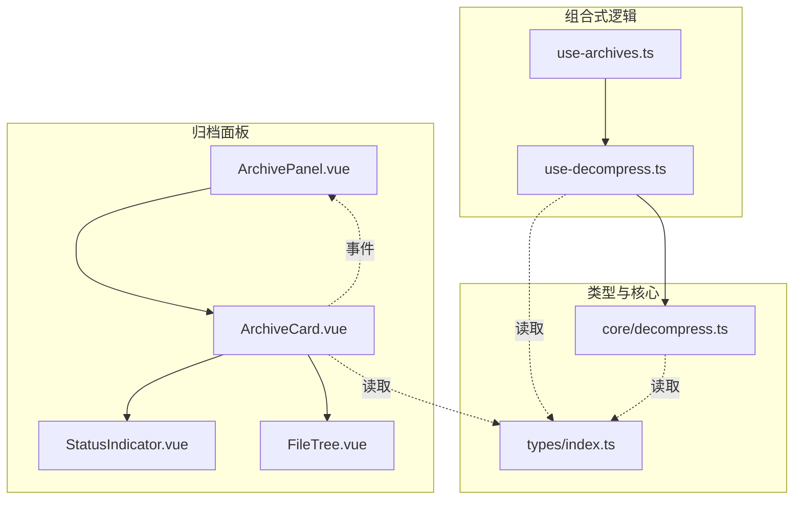
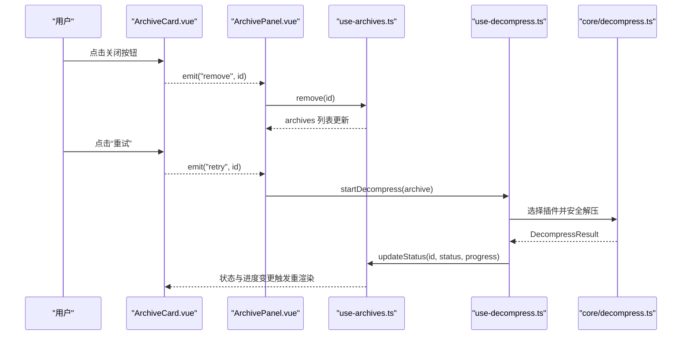
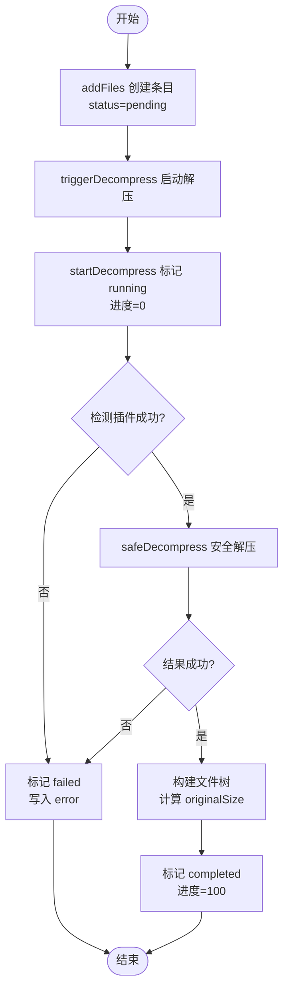
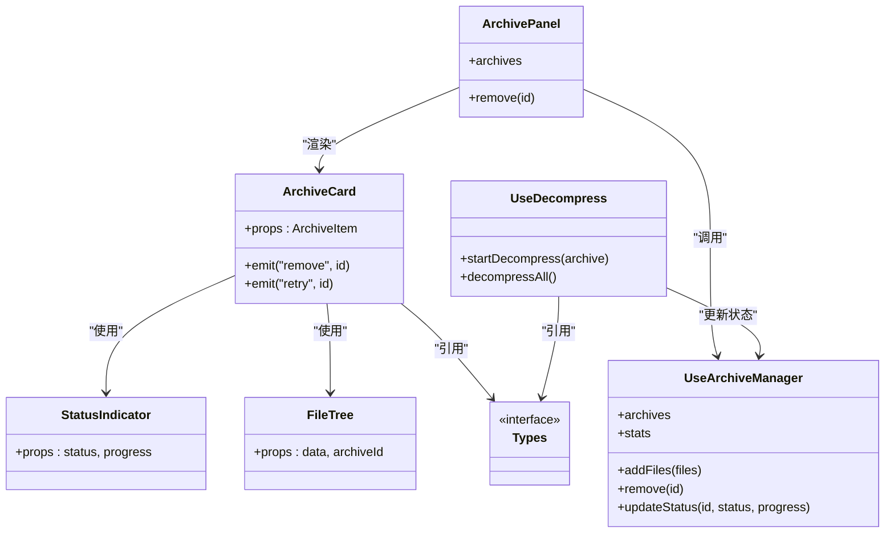

# ArchiveCard 压缩包卡片组件

<cite>
**本文引用的文件列表**
- [ArchiveCard.vue](file://src/components/archive-panel/ArchiveCard.vue)
- [ArchivePanel.vue](file://src/components/archive-panel/ArchivePanel.vue)
- [StatusIndicator.vue](file://src/components/archive-panel/StatusIndicator.vue)
- [FileTree.vue](file://src/components/archive-panel/FileTree.vue)
- [use-archives.ts](file://src/composables/use-archives.ts)
- [use-decompress.ts](file://src/composables/use-decompress.ts)
- [index.ts（类型定义）](file://src/types/index.ts)
- [decompress.ts（解压服务）](file://src/core/decompress.ts)
</cite>

## 目录
1. [简介](#简介)
2. [项目结构](#项目结构)
3. [核心组件与数据模型](#核心组件与数据模型)
4. [架构总览](#架构总览)
5. [详细组件分析](#详细组件分析)
6. [依赖关系分析](#依赖关系分析)
7. [性能与响应式特性](#性能与响应式特性)
8. [故障排查指南](#故障排查指南)
9. [结论](#结论)
10. [附录：扩展与自定义](#附录扩展与自定义)

## 简介
本文件围绕 ArchiveCard 压缩包卡片组件，系统化说明其元数据展示、解压状态管理与实时更新、删除与重试交互、错误反馈、以及与其他模块的事件通信和数据同步机制。同时给出可扩展点建议，帮助在现有实现基础上进行二次开发。

## 项目结构
ArchiveCard 位于归档面板子系统中，负责单条压缩包的可视化呈现与基础交互；其状态由组合式函数集中管理，并通过插件引擎完成解压流程。

图表来源
- [ArchivePanel.vue:1-23](file://src/components/archive-panel/ArchivePanel.vue#L1-L23)
- [ArchiveCard.vue:1-40](file://src/components/archive-panel/ArchiveCard.vue#L1-L40)
- [StatusIndicator.vue:1-27](file://src/components/archive-panel/StatusIndicator.vue#L1-L27)
- [FileTree.vue:1-42](file://src/components/archive-panel/FileTree.vue#L1-L42)
- [use-archives.ts:1-59](file://src/composables/use-archives.ts#L1-L59)
- [use-decompress.ts:1-73](file://src/composables/use-decompress.ts#L1-L73)
- [index.ts（类型定义）:1-71](file://src/types/index.ts#L1-L71)
- [decompress.ts（解压服务）:1-27](file://src/core/decompress.ts#L1-L27)

章节来源
- [ArchivePanel.vue:1-23](file://src/components/archive-panel/ArchivePanel.vue#L1-L23)
- [ArchiveCard.vue:1-40](file://src/components/archive-panel/ArchiveCard.vue#L1-L40)
- [use-archives.ts:1-59](file://src/composables/use-archives.ts#L1-L59)
- [use-decompress.ts:1-73](file://src/composables/use-decompress.ts#L1-L73)
- [index.ts（类型定义）:1-71](file://src/types/index.ts#L1-L71)
- [decompress.ts（解压服务）:1-27](file://src/core/decompress.ts#L1-L27)

## 核心组件与数据模型
- ArchiveItem：包含 id、name、file、status、progress、files、error、startTime、endTime、originalSize、compressedSize 等字段，用于驱动卡片渲染与状态更新。
- FileTreeNode：描述压缩包内文件的树形节点，供 FileTree 渲染。
- ArchiveStatus：枚举状态 pending、running、completed、failed，驱动 StatusIndicator 的标签与进度条显示。

章节来源
- [index.ts（类型定义）:1-71](file://src/types/index.ts#L1-L71)

## 架构总览
ArchiveCard 作为视图层，通过 props 接收 ArchiveItem，并向上抛出 remove 与 retry 事件；父级 ArchivePanel 订阅这些事件，调用 useArchiveManager 提供的 remove 等方法，从而修改全局 archives 列表。use-decompress 负责将任务加入调度器，执行解压流程，并通过 updateStatus 实时回写状态与进度。

图表来源
- [ArchiveCard.vue:1-40](file://src/components/archive-panel/ArchiveCard.vue#L1-L40)
- [ArchivePanel.vue:1-23](file://src/components/archive-panel/ArchivePanel.vue#L1-L23)
- [use-archives.ts:1-59](file://src/composables/use-archives.ts#L1-L59)
- [use-decompress.ts:1-73](file://src/composables/use-decompress.ts#L1-L73)
- [decompress.ts（解压服务）:1-27](file://src/core/decompress.ts#L1-L27)

## 详细组件分析

### 压缩包元数据展示逻辑
- 文件名：来自 ArchiveItem.name，直接作为卡片标题。
- 大小信息：
  - 压缩后大小：compressedSize，来源于添加时 file.size。
  - 解压后原始大小：originalSize，在解压成功后汇总计算。
- 类型：当前未显式展示 MIME 或扩展名类型，可在后续扩展中基于 name 后缀或 file.type 补充。
- 文件清单：当 archive.files 非空时，使用 FileTree 渲染内部文件树。

章节来源
- [ArchiveCard.vue:1-40](file://src/components/archive-panel/ArchiveCard.vue#L1-L40)
- [use-archives.ts:1-59](file://src/composables/use-archives.ts#L1-L59)
- [use-decompress.ts:1-73](file://src/composables/use-decompress.ts#L1-L73)
- [index.ts（类型定义）:1-71](file://src/types/index.ts#L1-L71)

### 解压状态管理与实时更新
- 状态机：pending → running → completed/failed。
- 进度更新：updateStatus 支持传入 progress，配合 StatusIndicator 的进度条实时反馈。
- 时间戳：running 时记录 startTime，completed 时记录 endTime，可用于时长统计。
- 失败处理：设置 error 消息，并在卡片中以红色文本提示。

图表来源
- [use-decompress.ts:1-73](file://src/composables/use-decompress.ts#L1-L73)
- [use-archives.ts:1-59](file://src/composables/use-archives.ts#L1-L59)
- [decompress.ts（解压服务）:1-27](file://src/core/decompress.ts#L1-L27)

章节来源
- [use-decompress.ts:1-73](file://src/composables/use-decompress.ts#L1-L73)
- [use-archives.ts:1-59](file://src/composables/use-archives.ts#L1-L59)
- [StatusIndicator.vue:1-27](file://src/components/archive-panel/StatusIndicator.vue#L1-L27)

### 删除操作：确认对话框与撤销功能
- 当前实现：ArchiveCard 关闭按钮直接触发 remove 事件，父级立即从列表中移除对应项，无确认弹窗与撤销能力。
- 建议增强：
  - 增加确认对话框：在触发 remove 前弹出确认框，避免误删。
  - 提供撤销能力：维护最近一次删除的快照，允许在一定时间内恢复。

章节来源
- [ArchiveCard.vue:1-40](file://src/components/archive-panel/ArchiveCard.vue#L1-L40)
- [ArchivePanel.vue:1-23](file://src/components/archive-panel/ArchivePanel.vue#L1-L23)
- [use-archives.ts:1-59](file://src/composables/use-archives.ts#L1-L59)

### 重试机制：网络错误处理与自动重试策略
- 当前实现：
  - 失败状态下显示错误信息与“重试”按钮，点击后向父级发出 retry 事件。
  - 父级目前对 retry 事件为空处理，未实际触发重新解压。
  - 解压过程使用任务调度器控制并发，但未见针对网络错误的指数退避或最大重试次数限制。
- 建议增强：
  - 在父级监听 retry 事件，调用 startDecompress 重新入队。
  - 引入可配置的重试策略（如最大重试次数、退避间隔），并对 IO/网络异常进行分类处理。

章节来源
- [ArchiveCard.vue:1-40](file://src/components/archive-panel/ArchiveCard.vue#L1-L40)
- [ArchivePanel.vue:1-23](file://src/components/archive-panel/ArchivePanel.vue#L1-L23)
- [use-decompress.ts:1-73](file://src/composables/use-decompress.ts#L1-L73)

### 卡片的响应式设计与自适应布局
- 当前实现：
  - 使用 NCard 小尺寸卡片，固定底部间距，适合纵向堆叠。
  - 文件树区域设置最大高度与虚拟滚动，提升大数据量下的渲染性能。
- 建议增强：
  - 根据容器宽度调整列数或切换为网格布局。
  - 在小屏设备上折叠次要信息（如 size、type），保留关键元数据。

章节来源
- [ArchiveCard.vue:1-40](file://src/components/archive-panel/ArchiveCard.vue#L1-L40)
- [FileTree.vue:1-42](file://src/components/archive-panel/FileTree.vue#L1-L42)

### 自定义操作按钮与扩展菜单
- 当前实现：
  - 卡片头部右侧仅显示状态指示器。
  - 失败状态下方提供“重试”按钮。
- 建议增强：
  - 在 header-extra 插槽中扩展更多操作（如导出、详情、复制路径）。
  - 结合下拉菜单统一收纳扩展动作，保持界面整洁。

章节来源
- [ArchiveCard.vue:1-40](file://src/components/archive-panel/ArchiveCard.vue#L1-L40)
- [StatusIndicator.vue:1-27](file://src/components/archive-panel/StatusIndicator.vue#L1-L27)

### 加载状态与错误状态的视觉反馈
- 加载状态：
  - 排队中：warning 标签。
  - 解压中：info 标签 + 线性进度条，百分比随 updateStatus 变化。
- 错误状态：
  - 失败：error 标签 + 红色错误文本，附带重试入口。
- 完成状态：
  - 成功：success 标签，隐藏错误区，展示文件树。

章节来源
- [StatusIndicator.vue:1-27](file://src/components/archive-panel/StatusIndicator.vue#L1-L27)
- [ArchiveCard.vue:1-40](file://src/components/archive-panel/ArchiveCard.vue#L1-L40)

### 与其他组件的事件通信与数据同步
- 事件通信：
  - ArchiveCard 向上抛出 remove 与 retry 事件。
  - ArchivePanel 订阅 remove 并调用 useArchiveManager.remove，实现列表即时更新。
- 数据同步：
  - useArchiveManager 维护全局 archives 列表，提供 addFiles、remove、updateStatus、stats 等能力。
  - use-decompress 通过 updateStatus 将运行期状态与进度回写至 archives，驱动 UI 刷新。

章节来源
- [ArchiveCard.vue:1-40](file://src/components/archive-panel/ArchiveCard.vue#L1-L40)
- [ArchivePanel.vue:1-23](file://src/components/archive-panel/ArchivePanel.vue#L1-L23)
- [use-archives.ts:1-59](file://src/composables/use-archives.ts#L1-L59)
- [use-decompress.ts:1-73](file://src/composables/use-decompress.ts#L1-L73)

## 依赖关系分析
- 组件依赖：
  - ArchiveCard 依赖 StatusIndicator 与 FileTree。
  - ArchivePanel 依赖 useArchiveManager 与 UploadZone。
- 组合式依赖：
  - use-decompress 依赖 useArchiveManager 与插件注册表，并使用任务调度器控制并发。
- 类型依赖：
  - 所有组件与逻辑均基于 types/index.ts 中的接口定义。

图表来源
- [ArchiveCard.vue:1-40](file://src/components/archive-panel/ArchiveCard.vue#L1-L40)
- [ArchivePanel.vue:1-23](file://src/components/archive-panel/ArchivePanel.vue#L1-L23)
- [StatusIndicator.vue:1-27](file://src/components/archive-panel/StatusIndicator.vue#L1-L27)
- [FileTree.vue:1-42](file://src/components/archive-panel/FileTree.vue#L1-L42)
- [use-archives.ts:1-59](file://src/composables/use-archives.ts#L1-L59)
- [use-decompress.ts:1-73](file://src/composables/use-decompress.ts#L1-L73)
- [index.ts（类型定义）:1-71](file://src/types/index.ts#L1-L71)

## 性能与响应式特性
- 虚拟滚动：FileTree 启用虚拟滚动，降低大文件树渲染开销。
- 并发控制：use-decompress 使用任务调度器限制并行解压数量，避免资源争用。
- 响应式更新：Vue 响应式系统确保状态变更后自动触发最小化重渲染。
- 建议优化：
  - 对超大压缩包采用懒加载文件树节点。
  - 在批量场景下合并多次 updateStatus 调用，减少频繁响应式更新。

章节来源
- [FileTree.vue:1-42](file://src/components/archive-panel/FileTree.vue#L1-L42)
- [use-decompress.ts:1-73](file://src/composables/use-decompress.ts#L1-L73)

## 故障排查指南
- 常见问题定位：
  - 状态停留在 pending：检查是否触发了 decompressAll 或 startDecompress。
  - 一直显示 failed：查看 archive.error 内容，确认插件是否能识别该格式。
  - 进度不更新：确认是否在关键阶段调用了 updateStatus 并传入了 progress。
- 调试建议：
  - 在 updateStatus 前后打印日志，观察状态流转。
  - 在 safeDecompress 返回结果处断点，核对 success 与 error 字段。

章节来源
- [use-decompress.ts:1-73](file://src/composables/use-decompress.ts#L1-L73)
- [use-archives.ts:1-59](file://src/composables/use-archives.ts#L1-L59)
- [ArchiveCard.vue:1-40](file://src/components/archive-panel/ArchiveCard.vue#L1-L40)

## 结论
ArchiveCard 以简洁的卡片形态承载了压缩包的核心元数据与状态反馈，并通过事件与组合式函数实现了与上层面板及解压流程的解耦。当前已具备基础的删除与重试交互骨架，建议在确认对话框、撤销、重试策略与扩展菜单方面进一步增强，以提升用户体验与可维护性。

## 附录：扩展与自定义
- 扩展元数据展示：
  - 在卡片副标题或行内展示 compressedSize/originalSize 与类型（基于 name 后缀或 file.type）。
- 扩展操作按钮：
  - 在 header-extra 插槽中添加导出、详情、复制路径等操作，必要时使用下拉菜单聚合。
- 增强重试策略：
  - 在父级实现重试计数与退避等待，避免无限重试导致资源耗尽。
- 增强删除体验：
  - 增加确认对话框与撤销功能，提升操作安全性。

章节来源
- [ArchiveCard.vue:1-40](file://src/components/archive-panel/ArchiveCard.vue#L1-L40)
- [ArchivePanel.vue:1-23](file://src/components/archive-panel/ArchivePanel.vue#L1-L23)
- [use-decompress.ts:1-73](file://src/composables/use-decompress.ts#L1-L73)