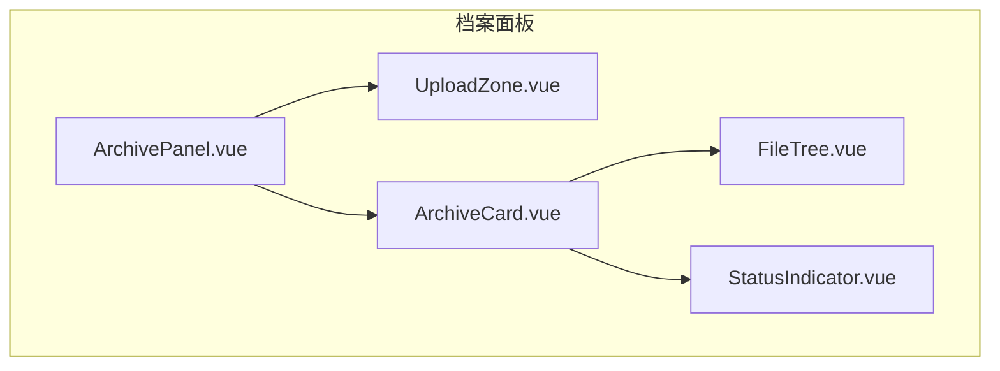
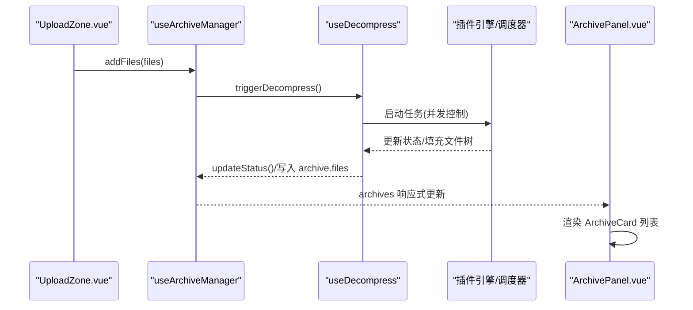
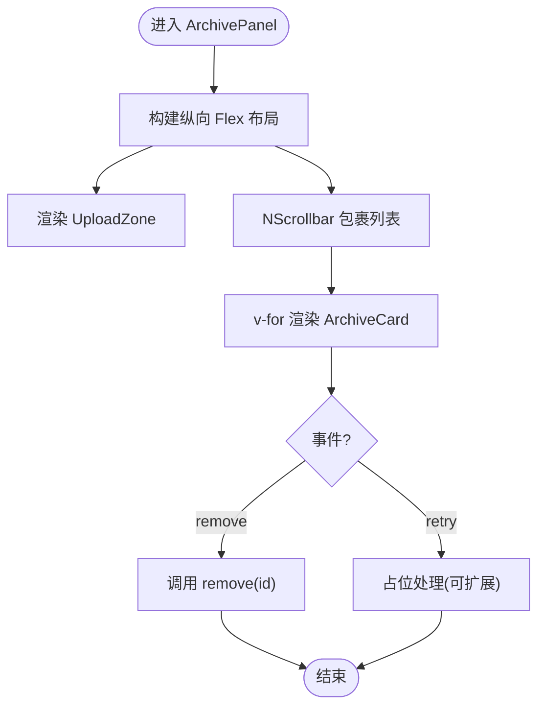
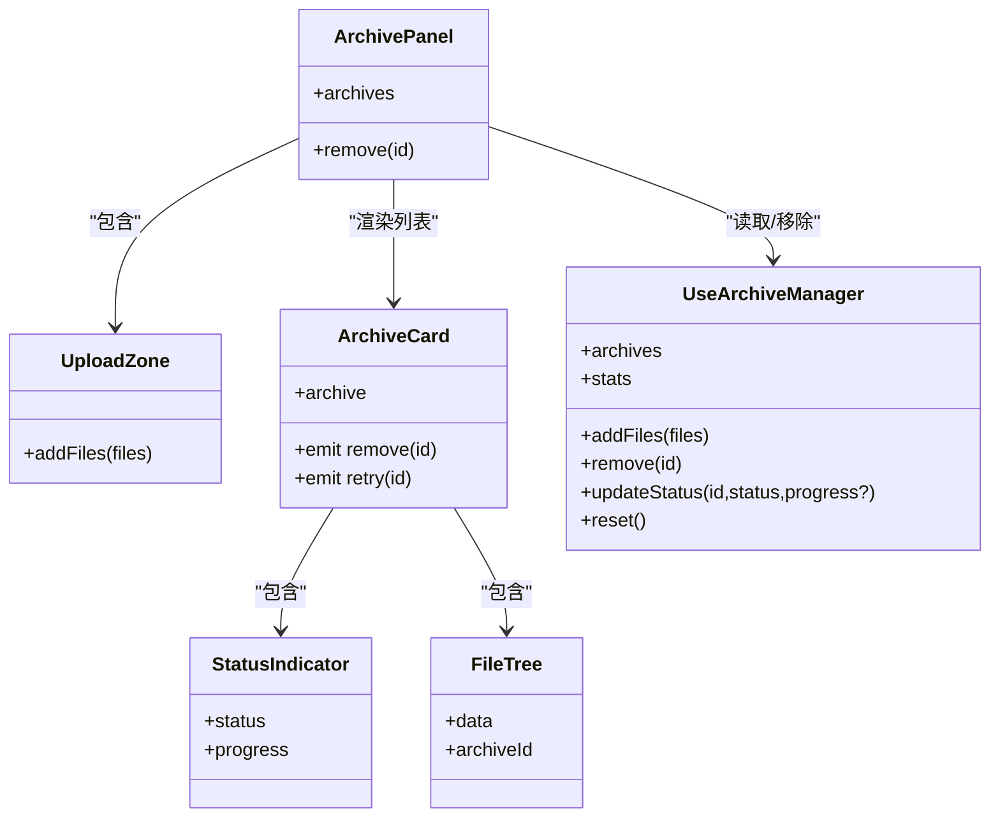
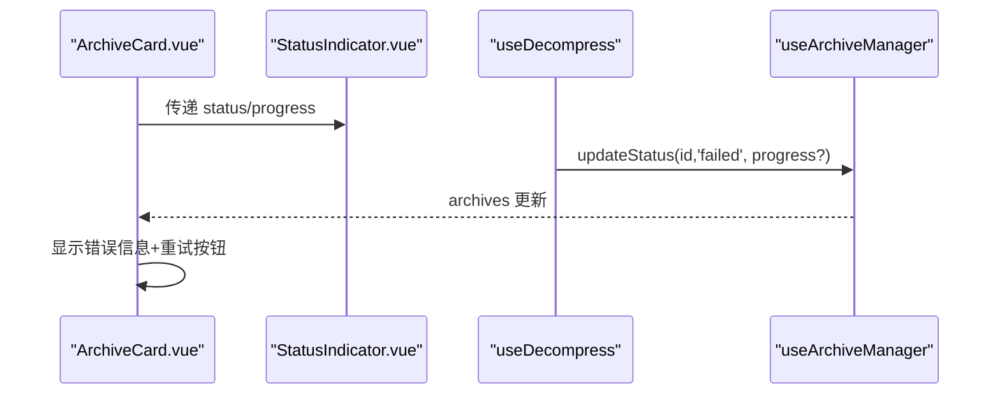

# ArchivePanel 容器组件

<cite>
**本文引用的文件**
- [ArchivePanel.vue](file://src/components/archive-panel/ArchivePanel.vue)
- [use-archives.ts](file://src/composables/use-archives.ts)
- [UploadZone.vue](file://src/components/archive-panel/UploadZone.vue)
- [ArchiveCard.vue](file://src/components/archive-panel/ArchiveCard.vue)
- [FileTree.vue](file://src/components/archive-panel/FileTree.vue)
- [StatusIndicator.vue](file://src/components/archive-panel/StatusIndicator.vue)
- [use-decompress.ts](file://src/composables/use-decompress.ts)
- [index.ts（类型定义）](file://src/types/index.ts)
- [ErrorBoundary.vue](file://src/components/shared/ErrorBoundary.vue)
</cite>

## 目录
1. [简介](#简介)
2. [项目结构](#项目结构)
3. [核心组件与职责](#核心组件与职责)
4. [架构总览](#架构总览)
5. [详细组件分析](#详细组件分析)
6. [依赖关系分析](#依赖关系分析)
7. [性能与滚动优化](#性能与滚动优化)
8. [配置项与扩展点](#配置项与扩展点)
9. [错误边界与用户反馈](#错误边界与用户反馈)
10. [故障排查指南](#故障排查指南)
11. [结论](#结论)

## 简介
本文件为 ArchivePanel 容器组件的详细文档。该组件作为“档案面板”的容器，负责：
- 组织上传区域与文件列表区域的布局
- 集成 useArchiveManager 组合式函数，管理 archives 状态与 remove 事件
- 通过 NScrollbar 提供高性能滚动体验
- 暴露可配置的扩展点，便于后续接入更多交互或展示能力

## 项目结构
ArchivePanel 位于 components/archive-panel 目录下，采用“容器 + 子组件”的组织方式：
- ArchivePanel.vue：容器组件，负责整体布局、滚动与事件分发
- UploadZone.vue：拖拽/点击上传压缩包
- ArchiveCard.vue：单个档案卡片，承载状态指示与文件树
- FileTree.vue：基于 Naive UI 的文件树，支持过滤与虚拟滚动
- StatusIndicator.vue：状态标签与进度条

图表来源
- [ArchivePanel.vue:1-24](file://src/components/archive-panel/ArchivePanel.vue#L1-L24)
- [UploadZone.vue:1-29](file://src/components/archive-panel/UploadZone.vue#L1-L29)
- [ArchiveCard.vue:1-41](file://src/components/archive-panel/ArchiveCard.vue#L1-L41)
- [FileTree.vue:1-42](file://src/components/archive-panel/FileTree.vue#L1-L42)
- [StatusIndicator.vue:1-28](file://src/components/archive-panel/StatusIndicator.vue#L1-L28)

章节来源
- [ArchivePanel.vue:1-24](file://src/components/archive-panel/ArchivePanel.vue#L1-L24)

## 核心组件与职责
- ArchivePanel.vue
  - 使用 useArchiveManager 获取 archives 与 remove
  - 顶部放置 UploadZone，下方用 NScrollbar 包裹 ArchiveCard 列表
  - 将 @remove 事件转发给 remove(id)，@retry 事件占位处理
- UploadZone.vue
  - 使用 NUpload/NUploadDragger 实现拖拽与点击上传
  - 调用 addFiles([file]) 触发解压流程
- ArchiveCard.vue
  - 显示档案名称、状态指示器、失败信息与重试按钮
  - 当 files 非空时渲染 FileTree
- FileTree.vue
  - 使用 NTree 展示文件树，支持 pattern 过滤与虚拟滚动
  - 选择叶子节点后打开对应标签页
- StatusIndicator.vue
  - 根据 status 显示不同标签与进度条

章节来源
- [ArchivePanel.vue:1-24](file://src/components/archive-panel/ArchivePanel.vue#L1-L24)
- [UploadZone.vue:1-29](file://src/components/archive-panel/UploadZone.vue#L1-L29)
- [ArchiveCard.vue:1-41](file://src/components/archive-panel/ArchiveCard.vue#L1-L41)
- [FileTree.vue:1-42](file://src/components/archive-panel/FileTree.vue#L1-L42)
- [StatusIndicator.vue:1-28](file://src/components/archive-panel/StatusIndicator.vue#L1-L28)

## 架构总览
从数据流角度，ArchivePanel 与 useArchiveManager、useDecompress 形成如下协作关系：

图表来源
- [use-archives.ts:1-60](file://src/composables/use-archives.ts#L1-L60)
- [use-decompress.ts:1-74](file://src/composables/use-decompress.ts#L1-L74)
- [ArchivePanel.vue:1-24](file://src/components/archive-panel/ArchivePanel.vue#L1-L24)
- [UploadZone.vue:1-29](file://src/components/archive-panel/UploadZone.vue#L1-L29)

## 详细组件分析

### ArchivePanel 容器
- 布局策略
  - 外层容器使用纵向 flex 布局，高度 100%
  - 顶部为 UploadZone，固定高度
  - 下方 NScrollbar 包裹 ArchiveCard 列表，flex: 1 自适应剩余空间
- 状态与事件
  - 通过 useArchiveManager 获取 archives 与 remove
  - 对每个 ArchiveCard 绑定 :archive、@remove、@retry
- 响应式行为
  - archives 变化驱动列表重渲染
  - NScrollbar 提供高效滚动

图表来源
- [ArchivePanel.vue:1-24](file://src/components/archive-panel/ArchivePanel.vue#L1-L24)

章节来源
- [ArchivePanel.vue:1-24](file://src/components/archive-panel/ArchivePanel.vue#L1-L24)

### UploadZone 上传区
- 功能要点
  - 接受多种压缩格式
  - 自定义请求回调中调用 addFiles([file])
- 与容器的关系
  - 仅负责输入，不关心列表渲染

章节来源
- [UploadZone.vue:1-29](file://src/components/archive-panel/UploadZone.vue#L1-L29)

### ArchiveCard 档案卡片
- 展示内容
  - 标题为档案名
  - 头部右侧 StatusIndicator
  - 失败时显示错误信息并提供重试按钮
  - 存在 files 时渲染 FileTree
- 事件
  - close 触发 remove(archive.id)
  - 重试触发 retry(archive.id)（当前为空实现）

章节来源
- [ArchiveCard.vue:1-41](file://src/components/archive-panel/ArchiveCard.vue#L1-L41)

### FileTree 文件树
- 能力
  - 文本过滤
  - 虚拟滚动提升大列表性能
  - 选择叶子节点后打开标签页
- 与容器关系
  - 由 ArchiveCard 按需渲染，避免不必要的开销

章节来源
- [FileTree.vue:1-42](file://src/components/archive-panel/FileTree.vue#L1-L42)

### StatusIndicator 状态指示
- 状态映射
  - completed：成功标签
  - running：进行中标签 + 进度条
  - pending：排队中
  - failed：失败
- 与容器关系
  - 在 ArchiveCard 头部显示，直观反馈任务状态

章节来源
- [StatusIndicator.vue:1-28](file://src/components/archive-panel/StatusIndicator.vue#L1-L28)

## 依赖关系分析
- 组件内聚与耦合
  - ArchivePanel 低耦合，仅依赖 useArchiveManager 与子组件
  - UploadZone 仅依赖 useArchiveManager.addFiles
  - ArchiveCard 依赖 StatusIndicator 与 FileTree
- 外部依赖
  - Naive UI 组件：NUpload、NTree、NProgress、NTag、NCard、NSpace、NScrollbar
  - 组合式函数：useArchiveManager、useDecompress（间接）
  - 类型定义：ArchiveItem、ArchiveStatus、FileTreeNode

图表来源
- [ArchivePanel.vue:1-24](file://src/components/archive-panel/ArchivePanel.vue#L1-L24)
- [use-archives.ts:1-60](file://src/composables/use-archives.ts#L1-L60)
- [ArchiveCard.vue:1-41](file://src/components/archive-panel/ArchiveCard.vue#L1-L41)
- [FileTree.vue:1-42](file://src/components/archive-panel/FileTree.vue#L1-L42)
- [StatusIndicator.vue:1-28](file://src/components/archive-panel/StatusIndicator.vue#L1-L28)

章节来源
- [use-archives.ts:1-60](file://src/composables/use-archives.ts#L1-L60)
- [index.ts（类型定义）:1-71](file://src/types/index.ts#L1-L71)

## 性能与滚动优化
- NScrollbar 的使用
  - 将 ArchiveCard 列表置于 NScrollbar 内部，利用 Naive UI 的滚动优化，避免整表重绘带来的卡顿
- 虚拟滚动
  - FileTree 启用 virtual-scroll，适合大型文件树场景
- 懒加载与按需渲染
  - FileTree 仅在 archive.files.length > 0 时渲染，减少初始渲染成本
- 任务并发控制
  - useDecompress 内部使用 TaskScheduler 限制并发，避免一次性大量 I/O 导致界面阻塞

章节来源
- [ArchivePanel.vue:1-24](file://src/components/archive-panel/ArchivePanel.vue#L1-L24)
- [FileTree.vue:1-42](file://src/components/archive-panel/FileTree.vue#L1-L42)
- [use-decompress.ts:1-74](file://src/composables/use-decompress.ts#L1-L74)

## 配置项与扩展点
- 容器级
  - 可通过向 ArchivePanel 传入 props 扩展（如是否显示统计、是否允许重复添加等），并在模板中透传给子组件
- 上传区
  - accept 属性决定支持的压缩格式；如需新增格式，修改 UploadZone 的 accept 即可
- 文件树
  - 可通过 FileTree 的 props 调整默认展开、过滤行为等
- 状态与进度
  - StatusIndicator 可根据业务需求扩展新的状态或样式
- 事件扩展
  - ArchiveCard 已暴露 remove 与 retry；可在 ArchivePanel 中对 retry 进行具体实现（例如重新入队解压任务）

章节来源
- [UploadZone.vue:1-29](file://src/components/archive-panel/UploadZone.vue#L1-L29)
- [ArchiveCard.vue:1-41](file://src/components/archive-panel/ArchiveCard.vue#L1-L41)
- [ArchivePanel.vue:1-24](file://src/components/archive-panel/ArchivePanel.vue#L1-L24)

## 错误边界与用户反馈
- 组件级错误捕获
  - ErrorBoundary 使用 onErrorCaptured 捕获子树异常，并以友好提示展示，提供“重试”重置
- 任务级错误处理
  - useDecompress 在任务执行过程中捕获异常并更新状态为 failed，同时记录 error 消息
- 用户可见反馈
  - StatusIndicator 实时反映 pending/running/completed/failed
  - ArchiveCard 在 failed 状态下显示错误信息并提供重试入口

图表来源
- [ArchiveCard.vue:1-41](file://src/components/archive-panel/ArchiveCard.vue#L1-L41)
- [StatusIndicator.vue:1-28](file://src/components/archive-panel/StatusIndicator.vue#L1-L28)
- [use-decompress.ts:1-74](file://src/composables/use-decompress.ts#L1-L74)
- [use-archives.ts:1-60](file://src/composables/use-archives.ts#L1-L60)
- [ErrorBoundary.vue:1-30](file://src/components/shared/ErrorBoundary.vue#L1-L30)

章节来源
- [ErrorBoundary.vue:1-30](file://src/components/shared/ErrorBoundary.vue#L1-L30)
- [use-decompress.ts:1-74](file://src/composables/use-decompress.ts#L1-L74)

## 故障排查指南
- 上传无反应
  - 检查 UploadZone 的 accept 是否包含目标格式
  - 确认 handleUpload 是否正确调用 addFiles
- 解压失败
  - 查看 ArchiveCard 的错误信息
  - 确认插件注册表是否能识别对应压缩类型
- 列表滚动卡顿
  - 确认 ArchiveCard 列表是否在 NScrollbar 内
  - 若文件树过大，确保 FileTree 开启 virtual-scroll
- 任务队列满
  - useDecompress 会在队列满时标记失败，适当降低并发或分批提交

章节来源
- [UploadZone.vue:1-29](file://src/components/archive-panel/UploadZone.vue#L1-L29)
- [ArchiveCard.vue:1-41](file://src/components/archive-panel/ArchiveCard.vue#L1-L41)
- [use-decompress.ts:1-74](file://src/composables/use-decompress.ts#L1-L74)

## 结论
ArchivePanel 以简洁的容器职责整合了上传、状态展示与文件浏览三大能力。通过与 useArchiveManager 的深度集成，实现了响应式的 archives 管理与 remove 事件处理；借助 NScrollbar 与虚拟滚动，保障了大数据量下的流畅体验。组件提供了清晰的扩展点，便于后续接入更丰富的交互与可视化能力。