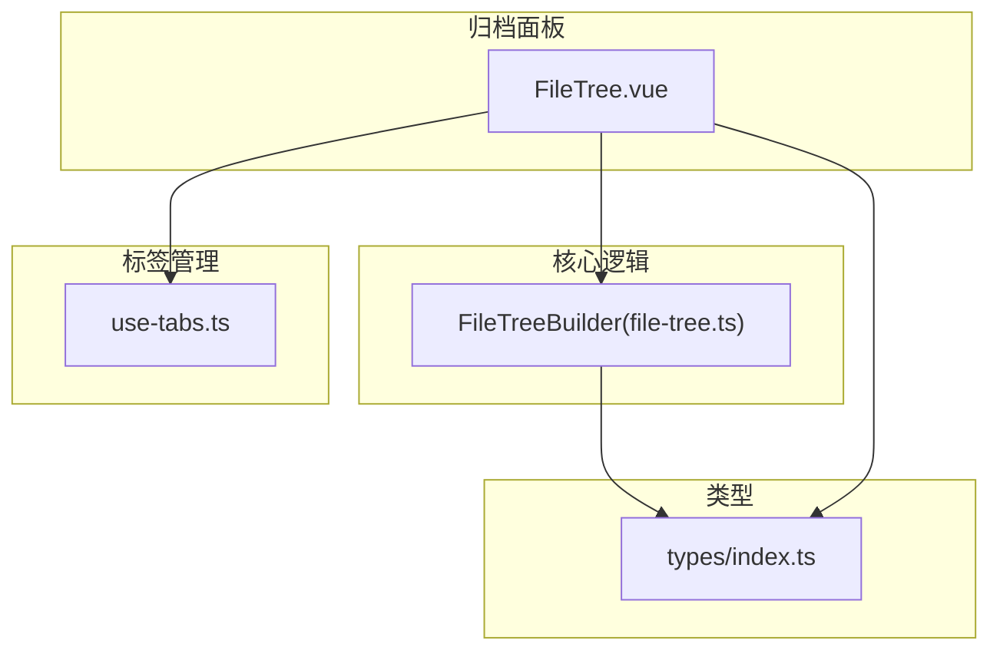
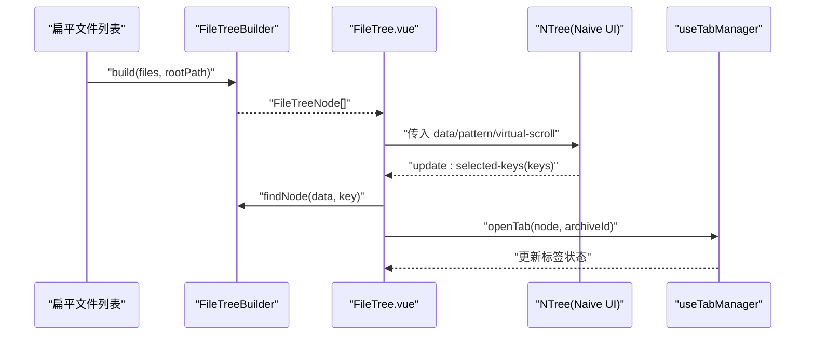
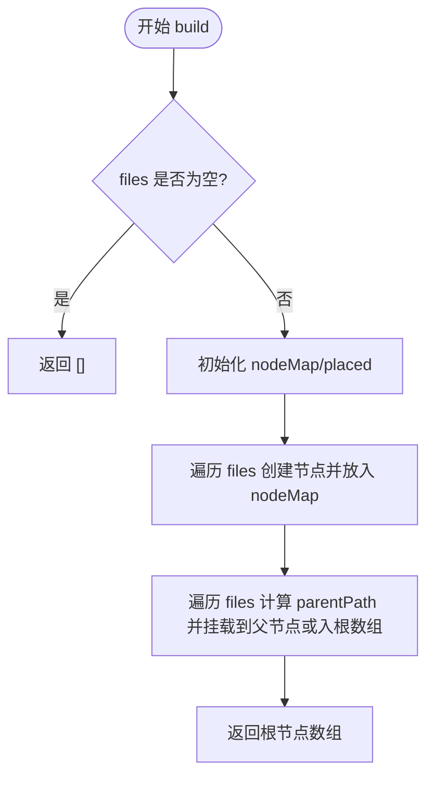
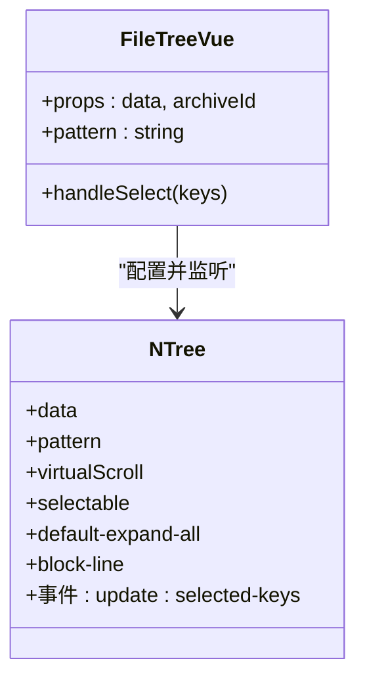
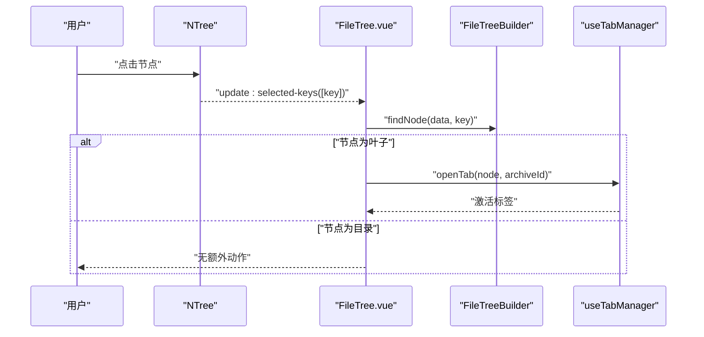
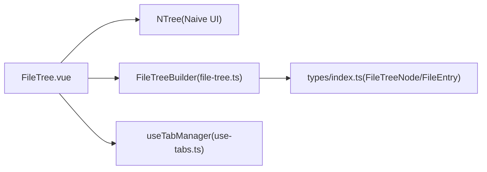
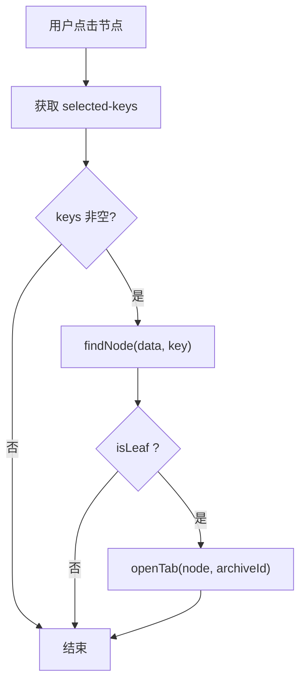

# FileTree 文件树组件

<cite>
**本文引用的文件**   
- [FileTree.vue](file://src/components/archive-panel/FileTree.vue)
- [file-tree.ts](file://src/core/file-tree.ts)
- [index.ts（类型定义）](file://src/types/index.ts)
- [use-tabs.ts](file://src/composables/use-tabs.ts)
- [file-tree.test.ts](file://src/__tests__/core/file-tree.test.ts)
</cite>

## 目录
1. [简介](#简介)
2. [项目结构](#项目结构)
3. [核心组件](#核心组件)
4. [架构总览](#架构总览)
5. [详细组件分析](#详细组件分析)
6. [依赖关系分析](#依赖关系分析)
7. [性能考量](#性能考量)
8. [故障排查指南](#故障排查指南)
9. [结论](#结论)
10. [附录](#附录)

## 简介
本文件为 FileTree 文件树组件的技术文档，围绕以下目标展开：
- 递归渲染算法与节点层级遍历的实现细节
- 虚拟滚动优化策略
- 节点展开/收起的交互逻辑与状态同步
- 拖拽排序机制（当前仓库未实现，提供扩展方案）
- 节点选择与多选模式处理
- 大文件树的性能优化（懒加载、内存管理）
- 节点自定义渲染与样式定制方法
- 键盘导航与无障碍访问支持

## 项目结构
FileTree 组件位于归档面板中，负责将扁平的文件列表构造成树形结构并渲染。核心代码分布在以下位置：
- 组件视图层：src/components/archive-panel/FileTree.vue
- 树构建与工具方法：src/core/file-tree.ts
- 数据模型与类型：src/types/index.ts
- 标签页联动：src/composables/use-tabs.ts
- 单元测试：src/__tests__/core/file-tree.test.ts

图表来源
- [FileTree.vue:1-41](file://src/components/archive-panel/FileTree.vue#L1-L41)
- [file-tree.ts:1-68](file://src/core/file-tree.ts#L1-L68)
- [index.ts（类型定义）:1-71](file://src/types/index.ts#L1-L71)
- [use-tabs.ts:1-64](file://src/composables/use-tabs.ts#L1-L64)

章节来源
- [FileTree.vue:1-41](file://src/components/archive-panel/FileTree.vue#L1-L41)
- [file-tree.ts:1-68](file://src/core/file-tree.ts#L1-L68)
- [index.ts（类型定义）:1-71](file://src/types/index.ts#L1-L71)
- [use-tabs.ts:1-64](file://src/composables/use-tabs.ts#L1-L64)

## 核心组件
- FileTree.vue：对外暴露 data 与 archiveId 两个属性；内部使用 Naive UI 的 NTree 进行渲染，启用虚拟滚动与过滤；在选中叶子节点时打开标签页。
- FileTreeBuilder：提供从扁平文件列表构建树的方法，以及按 key 查找节点和扁平化树的方法。
- useTabManager：维护标签集合与激活态，提供 openTab/closeTab 等方法。

章节来源
- [FileTree.vue:1-41](file://src/components/archive-panel/FileTree.vue#L1-L41)
- [file-tree.ts:1-68](file://src/core/file-tree.ts#L1-L68)
- [use-tabs.ts:1-64](file://src/composables/use-tabs.ts#L1-L64)

## 架构总览
下图展示了从数据到渲染的关键流程：扁平文件列表经 FileTreeBuilder 构建树，再由 FileTree.vue 通过 NTree 渲染，用户交互触发标签页打开。

图表来源
- [file-tree.ts:7-44](file://src/core/file-tree.ts#L7-L44)
- [file-tree.ts:46-55](file://src/core/file-tree.ts#L46-L55)
- [FileTree.vue:16-23](file://src/components/archive-panel/FileTree.vue#L16-L23)
- [use-tabs.ts:14-31](file://src/composables/use-tabs.ts#L14-L31)

## 详细组件分析

### 递归渲染与节点层级遍历
- 构建过程
  - 第一遍扫描：为每个文件条目创建节点对象，并以 path 作为 key 存入 Map，便于后续快速定位父节点。
  - 第二遍扫描：根据路径计算 parentPath，若存在父节点则将当前节点加入其 children；否则作为根节点收集。
  - 返回根节点数组供上层渲染。
- 查找与扁平化
  - findNode：深度优先遍历，按 key 匹配节点。
  - flattenTree：先序遍历将所有节点展平为数组，便于统计或批量操作。

图表来源
- [file-tree.ts:7-44](file://src/core/file-tree.ts#L7-L44)

复杂度分析
- 时间复杂度：O(n)，两次线性扫描，Map/Set 操作均摊 O(1)。
- 空间复杂度：O(n)，存储所有节点及辅助集合。

章节来源
- [file-tree.ts:7-44](file://src/core/file-tree.ts#L7-L44)
- [file-tree.ts:46-55](file://src/core/file-tree.ts#L46-L55)
- [file-tree.ts:57-67](file://src/core/file-tree.ts#L57-L67)
- [file-tree.test.ts:8-19](file://src/__tests__/core/file-tree.test.ts#L8-L19)
- [file-tree.test.ts:25-38](file://src/__tests__/core/file-tree.test.ts#L25-L38)
- [file-tree.test.ts:40-50](file://src/__tests__/core/file-tree.test.ts#L40-L50)

### 虚拟滚动优化
- 组件层面通过 NTree 的 virtual-scroll 开启虚拟滚动，限制容器最大高度，仅渲染可视区域节点，显著降低 DOM 数量与重排开销。
- pattern 过滤配合 show-irrelevant-nodes=false，可隐藏不相关节点，减少渲染量。

图表来源
- [FileTree.vue:29-39](file://src/components/archive-panel/FileTree.vue#L29-L39)

章节来源
- [FileTree.vue:29-39](file://src/components/archive-panel/FileTree.vue#L29-L39)

### 节点展开/收起与状态同步
- 默认行为：default-expand-all=false，初始全部折叠。
- 展开/收起由 NTree 内部管理，受 data 结构与 isLeaf 字段控制。
- 状态同步：当用户点击叶子节点时，组件通过 @update:selected-keys 回调获取选中 key，再调用 FileTreeBuilder.findNode 定位节点，最后交由 useTabManager.openTab 打开对应标签页。

图表来源
- [FileTree.vue:16-23](file://src/components/archive-panel/FileTree.vue#L16-L23)
- [file-tree.ts:46-55](file://src/core/file-tree.ts#L46-L55)
- [use-tabs.ts:14-31](file://src/composables/use-tabs.ts#L14-L31)

章节来源
- [FileTree.vue:16-23](file://src/components/archive-panel/FileTree.vue#L16-L23)
- [file-tree.ts:46-55](file://src/core/file-tree.ts#L46-L55)
- [use-tabs.ts:14-31](file://src/composables/use-tabs.ts#L14-L31)

### 拖拽排序功能（当前未实现，扩展建议）
- 现状：当前 FileTree.vue 未集成拖拽能力。
- 建议方案：
  - 引入 vue-draggable-plus 对 NTree 节点进行包裹，或在更高层级对树容器进行拖拽绑定。
  - 实现要点：
    - 拖拽目标检测：识别被拖拽节点与其父节点、兄弟节点边界。
    - 位置计算：基于拖拽时的相对坐标与节点尺寸，计算插入索引。
    - 数据结构更新：在 FileTreeBuilder 提供的树结构上执行 splice/insert，确保 key 唯一性与父子关系一致。
    - 状态同步：更新后重新赋值 data，保持 NTree 响应式刷新。
- 注意：需保证拖拽过程中 key 不变，避免子树引用断裂。

[本节为概念性说明，不涉及具体源码]

### 节点选择与多选模式
- 当前实现：selectable 启用单选，@update:selected-keys 仅取 keys[0] 进行处理。
- 如需多选：
  - 将 selectable 改为 multiple，并在 handleSelect 中遍历 keys 逐一查找并打开标签页（去重）。
  - 注意标签页重复打开的判断已在 useTabManager.openTab 中实现。

章节来源
- [FileTree.vue:29-39](file://src/components/archive-panel/FileTree.vue#L29-L39)
- [FileTree.vue:16-23](file://src/components/archive-panel/FileTree.vue#L16-L23)
- [use-tabs.ts:14-31](file://src/composables/use-tabs.ts#L14-L31)

### 大文件树的性能优化策略
- 虚拟滚动：已启用 NTree.virtual-scroll，大幅减少 DOM 节点数量。
- 过滤：pattern + show-irrelevant-nodes=false 可减少渲染分支。
- 懒加载（建议）：
  - 在 FileTreeBuilder 构建阶段，对于目录节点仅保留占位 children=[]，在首次展开时按需异步加载子项，再回填 children。
  - 结合 useVirtualFileSystem 提供的 listDir 接口，在展开回调中触发加载。
- 内存管理：
  - 避免持有不必要的中间引用，如临时 Map/Set 应在构建完成后释放。
  - 对超大树可考虑分页/分片渲染，或基于 key 缓存已加载的子树。

章节来源
- [FileTree.vue:29-39](file://src/components/archive-panel/FileTree.vue#L29-L39)
- [file-tree.ts:7-44](file://src/core/file-tree.ts#L7-L44)

### 节点自定义渲染与样式定制
- 自定义渲染：
  - 可通过 NTree 的 render 插槽或自定义节点模板替换默认图标/名称展示。
  - 结合 FileTreeNode 的 size、path 等字段显示附加信息。
- 样式定制：
  - 通过 CSS 变量或覆盖 Naive UI 主题变量调整颜色、行高、缩进等。
  - block-line 可增强行分隔视觉。

[本节为通用指导，不涉及具体源码]

### 键盘导航与无障碍访问
- 基础支持：NTree 内置键盘导航（方向键、Enter 选择等），无需额外配置。
- 增强建议：
  - 为搜索输入框添加 aria-label 与快捷键提示。
  - 在需要时设置 aria-expanded 以反映展开状态，提升屏幕阅读器体验。
  - 若实现多选，需提供 aria-multiselectable 与选中状态同步。

[本节为通用指导，不涉及具体源码]

## 依赖关系分析
- FileTree.vue 依赖：
  - Naive UI 的 NTree/NInput 用于渲染与过滤
  - FileTreeBuilder 用于查找节点
  - useTabManager 用于打开标签页
- FileTreeBuilder 依赖：
  - types/index.ts 中的 FileEntry、FileTreeNode 类型

图表来源
- [FileTree.vue:1-41](file://src/components/archive-panel/FileTree.vue#L1-L41)
- [file-tree.ts:1-68](file://src/core/file-tree.ts#L1-L68)
- [index.ts（类型定义）:1-71](file://src/types/index.ts#L1-L71)
- [use-tabs.ts:1-64](file://src/composables/use-tabs.ts#L1-L64)

章节来源
- [FileTree.vue:1-41](file://src/components/archive-panel/FileTree.vue#L1-L41)
- [file-tree.ts:1-68](file://src/core/file-tree.ts#L1-L68)
- [index.ts（类型定义）:1-71](file://src/types/index.ts#L1-L71)
- [use-tabs.ts:1-64](file://src/composables/use-tabs.ts#L1-L64)

## 性能考量
- 渲染性能
  - 虚拟滚动：仅渲染可视区节点，适合万级节点场景。
  - 过滤：提前缩小渲染范围。
- 构建性能
  - 两遍线性构建 + Map/Set 常数时间查找，整体 O(n)。
- 交互性能
  - 选择事件仅在叶子节点触发业务逻辑，避免多余计算。
- 内存占用
  - 避免长期持有中间结构；按需加载子树可降低常驻内存。

[本节为通用指导，不涉及具体源码]

## 故障排查指南
- 问题：选择目录节点无反应
  - 原因：当前仅对叶子节点执行打开标签页逻辑。
  - 解决：如需目录也触发动作，可在 handleSelect 中移除 isLeaf 判断。
- 问题：过滤后找不到节点
  - 原因：show-irrelevant-nodes=false 会隐藏不匹配节点，但 findNode 仍能在完整 data 中查找。
  - 验证：确认传入的 key 与节点 key 一致。
- 问题：标签重复打开
  - 原因：useTabManager.openTab 已做去重检查，通常不会重复。
  - 排查：确认 archiveId 与 fileNode.key 组合是否唯一。

章节来源
- [FileTree.vue:16-23](file://src/components/archive-panel/FileTree.vue#L16-L23)
- [use-tabs.ts:14-31](file://src/composables/use-tabs.ts#L14-L31)

## 结论
FileTree 组件在当前仓库中提供了稳定的树形展示与基础交互能力：
- 通过 FileTreeBuilder 高效构建层级结构
- 借助 NTree 的虚拟滚动与过滤获得良好性能
- 与标签管理器联动完成文件打开
- 可扩展方向包括：拖拽排序、懒加载、多选、自定义渲染与无障碍增强

[本节为总结，不涉及具体源码]

## 附录

### 关键流程图：选择与打开标签

图表来源
- [FileTree.vue:16-23](file://src/components/archive-panel/FileTree.vue#L16-L23)
- [file-tree.ts:46-55](file://src/core/file-tree.ts#L46-L55)
- [use-tabs.ts:14-31](file://src/composables/use-tabs.ts#L14-L31)