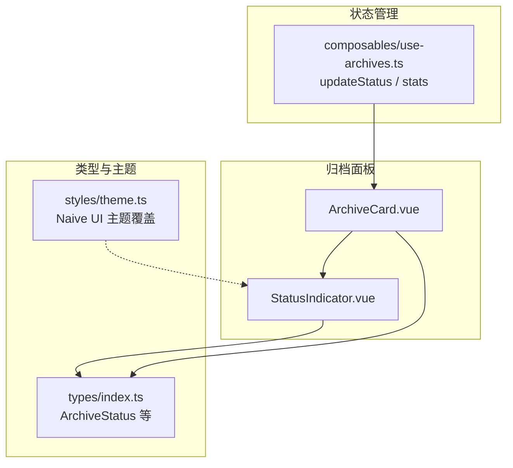
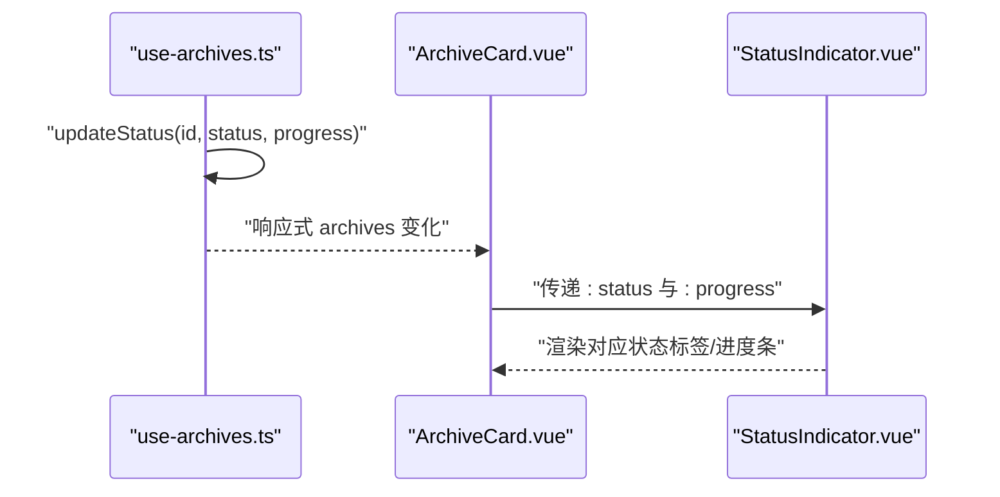
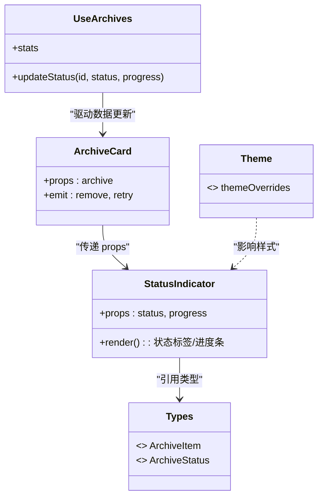

# StatusIndicator 状态指示器组件

<cite>
**本文引用的文件**
- [StatusIndicator.vue](file://src/components/archive-panel/StatusIndicator.vue)
- [ArchiveCard.vue](file://src/components/archive-panel/ArchiveCard.vue)
- [index.ts（类型定义）](file://src/types/index.ts)
- [theme.ts（主题配置）](file://src/styles/theme.ts)
- [use-archives.ts（归档管理组合式函数）](file://src/composables/use-archives.ts)
</cite>

## 目录
1. [简介](#简介)
2. [项目结构](#项目结构)
3. [核心组件](#核心组件)
4. [架构总览](#架构总览)
5. [详细组件分析](#详细组件分析)
6. [依赖关系分析](#依赖关系分析)
7. [性能考虑](#性能考虑)
8. [故障排查指南](#故障排查指南)
9. [结论](#结论)
10. [附录](#附录)

## 简介
StatusIndicator 是一个轻量的状态指示器组件，用于在归档任务卡片中展示解压任务的当前状态与进度。它基于 Naive UI 的标签与进度条组件，将“排队中、解压中、已完成、失败”四种状态以直观的视觉形式呈现，并与上层数据模型紧密耦合。

## 项目结构
该组件位于归档面板模块下，作为 ArchiveCard 的子组件被使用；其状态类型由全局类型定义提供，颜色主题通过 Naive UI 的主题覆盖进行统一配置。

图表来源
- [StatusIndicator.vue:1-28](file://src/components/archive-panel/StatusIndicator.vue#L1-L28)
- [ArchiveCard.vue:1-41](file://src/components/archive-panel/ArchiveCard.vue#L1-L41)
- [index.ts（类型定义）:15-46](file://src/types/index.ts#L15-L46)
- [theme.ts（主题配置）:1-13](file://src/styles/theme.ts#L1-L13)
- [use-archives.ts（归档管理组合式函数）:35-51](file://src/composables/use-archives.ts#L35-L51)

章节来源
- [StatusIndicator.vue:1-28](file://src/components/archive-panel/StatusIndicator.vue#L1-L28)
- [ArchiveCard.vue:1-41](file://src/components/archive-panel/ArchiveCard.vue#L1-L41)
- [index.ts（类型定义）:15-46](file://src/types/index.ts#L15-L46)
- [theme.ts（主题配置）:1-13](file://src/styles/theme.ts#L1-L13)
- [use-archives.ts（归档管理组合式函数）:35-51](file://src/composables/use-archives.ts#L35-L51)

## 核心组件
- 组件职责：根据传入的 status 与 progress 渲染对应的状态标签与进度条，保持简洁一致的视觉表达。
- 输入属性：
  - status：归档任务状态，来源于类型定义中的 ArchiveStatus。
  - progress：当前进度百分比，仅在运行态显示。
- 输出事件：无直接事件，仅负责展示。

章节来源
- [StatusIndicator.vue:5-8](file://src/components/archive-panel/StatusIndicator.vue#L5-L8)
- [index.ts（类型定义）:15-15](file://src/types/index.ts#L15-L15)

## 架构总览
StatusIndicator 处于视图层，接收来自父组件的数据并渲染。状态变更由 use-archives 提供的 updateStatus 驱动，进而触发 Vue 响应式更新，最终反映到 UI。

图表来源
- [use-archives.ts（归档管理组合式函数）:35-43](file://src/composables/use-archives.ts#L35-L43)
- [ArchiveCard.vue:25-27](file://src/components/archive-panel/ArchiveCard.vue#L25-L27)
- [StatusIndicator.vue:11-26](file://src/components/archive-panel/StatusIndicator.vue#L11-L26)

## 详细组件分析

### 状态类型与视觉表现
- 排队中（pending）：使用警告类型的标签，提示任务尚未开始。
- 解压中（running）：使用信息类型的标签配合线性进度条，实时反馈处理进度。
- 已完成（completed）：使用成功类型的标签，表示任务完成。
- 失败（failed）：使用错误类型的标签，表示任务出错。

这些映射由组件内部的条件渲染逻辑决定，确保每种状态都有明确的语义化文本与色彩。

章节来源
- [StatusIndicator.vue:13-25](file://src/components/archive-panel/StatusIndicator.vue#L13-L25)
- [index.ts（类型定义）:15-15](file://src/types/index.ts#L15-L15)

### 颜色主题与图标系统
- 颜色主题：通过 Naive UI 的全局主题覆盖设置 primary、error、warning、success 等基础色值，从而让 NTag 的 type 自动匹配相应颜色。
- 图标系统：当前实现未引入自定义图标，主要依赖 NTag 内置样式与文本描述传达状态。若需扩展图标，可在各分支内嵌入图标组件或 SVG。

明暗主题适配：
- 当前主题配置为固定色值，未包含明暗两套变量。如需支持明暗主题，可将主题色改为 CSS 变量或按 prefers-color-scheme 切换不同的 GlobalThemeOverrides。

章节来源
- [theme.ts（主题配置）:3-11](file://src/styles/theme.ts#L3-L11)
- [StatusIndicator.vue:13-25](file://src/components/archive-panel/StatusIndicator.vue#L13-L25)

### 动画效果与过渡
- 进度条动画：NProgress 自带进度条动画，随 percentage 变化平滑推进。
- 状态切换过渡：当前未显式添加过渡类或动画钩子，状态切换为即时渲染。若需要更柔和的切换体验，可结合 Vue Transition 对标签与进度条区域包裹过渡容器。

章节来源
- [StatusIndicator.vue:16-19](file://src/components/archive-panel/StatusIndicator.vue#L16-L19)

### 状态切换与用户体验优化
- 交互建议：
  - 在 running 状态下，优先展示进度条，减少文字冗余。
  - 在 failed 状态下，建议在父组件提供重试入口（已在 ArchiveCard 中实现）。
  - 在 pending 状态下，可考虑禁用相关操作按钮，避免误触。
- 可读性：所有状态均配有中文文案，便于无障碍阅读与国际化扩展。

章节来源
- [ArchiveCard.vue:29-32](file://src/components/archive-panel/ArchiveCard.vue#L29-L32)
- [StatusIndicator.vue:13-25](file://src/components/archive-panel/StatusIndicator.vue#L13-L25)

### 可配置的主题定制与样式覆盖
- 主题覆盖：通过 themeOverrides 统一设置品牌主色、错误色、警告色、成功色以及字体族，影响 NTag 与 NProgress 的默认外观。
- 局部覆盖：若需要对单个实例进行差异化样式，可通过外层容器注入 CSS 变量或使用 scoped 样式覆盖。

章节来源
- [theme.ts（主题配置）:3-11](file://src/styles/theme.ts#L3-L11)

### 无障碍访问支持
- 屏幕阅读器：当前使用 NTag 文本内容，具备基本可访问性。建议为关键状态增加 aria-live 区域，以便动态更新时主动播报。
- 键盘导航：组件本身不接收焦点，无需额外 tabindex。若后续加入交互元素（如重试按钮），应保证可聚焦与键盘操作。
- 语义化：建议为不同状态添加 role 或 aria-label，增强辅助技术识别度。

[本节为通用指导，不涉及具体代码片段]

### 性能优化策略
- 最小化重渲染：组件仅依赖两个简单 prop，且模板分支较少，开销极低。
- 列表级优化：当大量归档项同时存在时，建议使用 key 稳定绑定与虚拟滚动（在父列表层面）以减少 DOM 节点数量。
- 进度更新节流：若进度频繁更新，可在调用方对 updateStatus 的调用频率做节流，降低渲染压力。

[本节为通用指导，不涉及具体代码片段]

## 依赖关系分析
- 组件依赖：
  - 类型依赖：ArchiveStatus 与 ArchiveItem 字段。
  - UI 库依赖：Naive UI 的 NTag、NProgress、NSpace。
  - 父组件依赖：由 ArchiveCard 传入 status 与 progress。
- 数据流：
  - use-archives 维护 archives 列表并提供 updateStatus。
  - ArchiveCard 订阅 archives 变化并将单条记录的状态传递给 StatusIndicator。

图表来源
- [StatusIndicator.vue:1-28](file://src/components/archive-panel/StatusIndicator.vue#L1-L28)
- [ArchiveCard.vue:1-41](file://src/components/archive-panel/ArchiveCard.vue#L1-L41)
- [index.ts（类型定义）:15-46](file://src/types/index.ts#L15-L46)
- [theme.ts（主题配置）:1-13](file://src/styles/theme.ts#L1-L13)
- [use-archives.ts（归档管理组合式函数）:35-51](file://src/composables/use-archives.ts#L35-L51)

章节来源
- [StatusIndicator.vue:1-28](file://src/components/archive-panel/StatusIndicator.vue#L1-L28)
- [ArchiveCard.vue:1-41](file://src/components/archive-panel/ArchiveCard.vue#L1-L41)
- [index.ts（类型定义）:15-46](file://src/types/index.ts#L15-L46)
- [theme.ts（主题配置）:1-13](file://src/styles/theme.ts#L1-L13)
- [use-archives.ts（归档管理组合式函数）:35-51](file://src/composables/use-archives.ts#L35-L51)

## 性能考虑
- 组件粒度小、计算少，适合高频更新场景。
- 建议在上层列表中对大数组进行分页或虚拟化渲染。
- 进度更新可结合 requestAnimationFrame 或节流策略，避免过于频繁的 DOM 更新。

[本节为通用指导，不涉及具体代码片段]

## 故障排查指南
- 状态不更新：检查是否调用了 updateStatus 且 id 正确；确认 archives 响应式对象未被替换。
- 进度条不动：确认 progress 数值在 0-100 范围内且在 running 状态下持续递增。
- 颜色异常：检查 themeOverrides 是否正确注入到应用根；确认未被子级样式覆盖。
- 文本不可读：确认语言环境已设置为中文，或按需扩展 i18n。

章节来源
- [use-archives.ts（归档管理组合式函数）:35-43](file://src/composables/use-archives.ts#L35-L43)
- [theme.ts（主题配置）:3-11](file://src/styles/theme.ts#L3-L11)

## 结论
StatusIndicator 以极简的方式实现了归档任务状态的可视化表达，与类型系统与主题体系良好集成。当前版本满足基础需求，后续可在动画过渡、无障碍增强与明暗主题适配方面进一步演进。

## 附录

### 状态映射速查
- pending → 警告标签（排队中）
- running → 信息标签 + 线性进度条（解压中）
- completed → 成功标签（已完成）
- failed → 错误标签（失败）

章节来源
- [StatusIndicator.vue:13-25](file://src/components/archive-panel/StatusIndicator.vue#L13-L25)