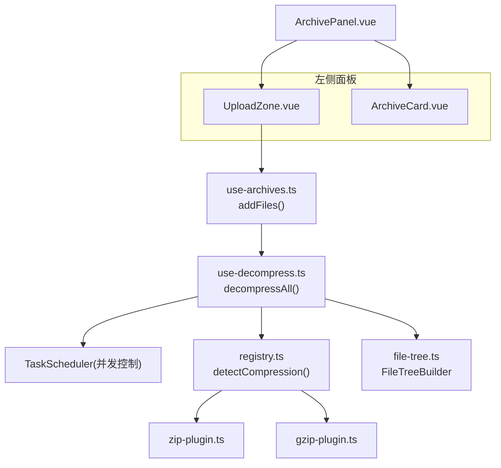
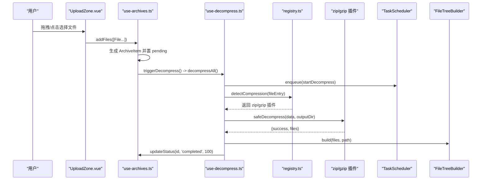
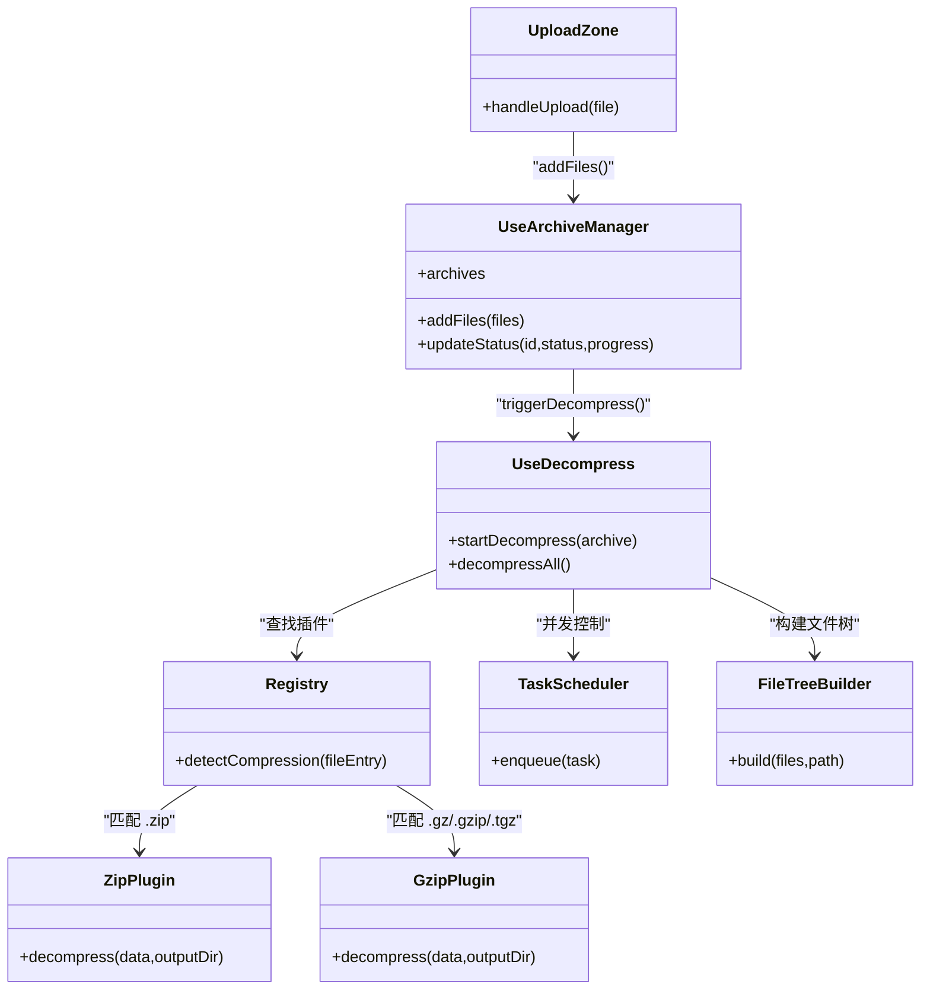
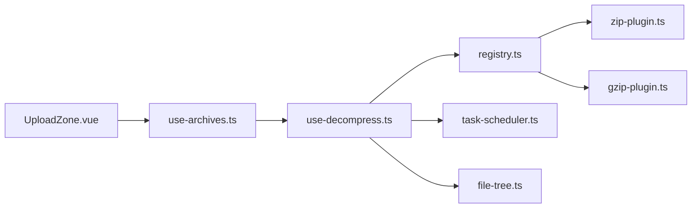

# UploadZone 上传区域组件

<cite>
**本文引用的文件**
- [UploadZone.vue](file://src/components/archive-panel/UploadZone.vue)
- [ArchivePanel.vue](file://src/components/archive-panel/ArchivePanel.vue)
- [use-archives.ts](file://src/composables/use-archives.ts)
- [use-decompress.ts](file://src/composables/use-decompress.ts)
- [zip-plugin.ts](file://src/plugins/compression/zip-plugin.ts)
- [gzip-plugin.ts](file://src/plugins/compression/gzip-plugin.ts)
- [registry.ts](file://src/plugins/registry.ts)
- [task-scheduler.ts](file://src/core/task-scheduler.ts)
- [file-tree.ts](file://src/core/file-tree.ts)
- [use-archives.test.ts](file://src/__tests__/_composables_/use-archives.test.ts)
</cite>

## 目录
1. [简介](#简介)
2. [项目结构](#项目结构)
3. [核心组件与数据流](#核心组件与数据流)
4. [架构总览](#架构总览)
5. [详细组件分析](#详细组件分析)
6. [依赖关系分析](#依赖关系分析)
7. [性能考量](#性能考量)
8. [故障排查指南](#故障排查指南)
9. [结论](#结论)
10. [附录：扩展与定制](#附录扩展与定制)

## 简介
本文件围绕 UploadZone 上传区域组件，系统性说明其拖拽上传、文件格式验证、多文件并发解压、进度跟踪与错误处理等实现细节。该组件基于 Naive UI 的 NUpload/NUploadDragger 构建，结合 useArchiveManager 与 useDecompress 完成“选择文件 -> 入队 -> 调度解压 -> 更新状态”的完整链路。

## 项目结构
UploadZone 位于左侧面板顶部，负责接收用户选择的压缩包并触发后续解压流程；下方列表由 ArchiveCard 渲染每个压缩包的卡片。

图示来源
- [UploadZone.vue:1-28](file://src/components/archive-panel/UploadZone.vue#L1-L28)
- [ArchivePanel.vue:1-23](file://src/components/archive-panel/ArchivePanel.vue#L1-L23)
- [use-archives.ts:1-60](file://src/composables/use-archives.ts#L1-L60)
- [use-decompress.ts:1-74](file://src/composables/use-decompress.ts#L1-L74)
- [registry.ts:41-96](file://src/plugins/registry.ts#L41-L96)
- [zip-plugin.ts:1-39](file://src/plugins/compression/zip-plugin.ts#L1-L39)
- [gzip-plugin.ts:1-43](file://src/plugins/compression/gzip-plugin.ts#L1-L43)
- [file-tree.ts](file://src/core/file-tree.ts)

章节来源
- [UploadZone.vue:1-28](file://src/components/archive-panel/UploadZone.vue#L1-L28)
- [ArchivePanel.vue:1-23](file://src/components/archive-panel/ArchivePanel.vue#L1-L23)

## 核心组件与数据流
- UploadZone 使用 NUpload 的 custom-request 接管上传回调，将 File 对象交给 useArchiveManager.addFiles。
- addFiles 为每个文件创建 ArchiveItem（包含 name、file、status、progress 等），随后调用 triggerDecompress。
- triggerDecompress 动态引入 useDecompress 并执行 decompressAll，遍历 pending 状态的条目逐个启动解压任务。
- useDecompress 通过 TaskScheduler 限制并发，读取 ArrayBuffer，根据文件名后缀匹配压缩插件（zip/gzip），完成后构建文件树并更新进度与时间戳。

图示来源
- [UploadZone.vue:7-12](file://src/components/archive-panel/UploadZone.vue#L7-L12)
- [use-archives.ts:9-29](file://src/composables/use-archives.ts#L9-L29)
- [use-decompress.ts:14-70](file://src/composables/use-decompress.ts#L14-L70)
- [registry.ts:56-63](file://src/plugins/registry.ts#L56-L63)
- [zip-plugin.ts:10-38](file://src/plugins/compression/zip-plugin.ts#L10-L38)
- [gzip-plugin.ts:10-42](file://src/plugins/compression/gzip-plugin.ts#L10-L42)

章节来源
- [use-archives.ts:1-60](file://src/composables/use-archives.ts#L1-L60)
- [use-decompress.ts:1-74](file://src/composables/use-decompress.ts#L1-L74)

## 架构总览
从交互到处理的端到端路径如下：
- 交互层：NUpload + NUploadDragger 提供拖拽与点击选择能力。
- 业务层：useArchiveManager 维护待处理队列与状态；useDecompress 编排解压流程。
- 插件层：registry 按扩展名分发至具体压缩插件（zip/gzip）。
- 基础设施：TaskScheduler 控制并发；FileTreeBuilder 构建可视化树。

图示来源
- [UploadZone.vue:1-28](file://src/components/archive-panel/UploadZone.vue#L1-L28)
- [use-archives.ts:1-60](file://src/composables/use-archives.ts#L1-L60)
- [use-decompress.ts:1-74](file://src/composables/use-decompress.ts#L1-L74)
- [registry.ts:41-96](file://src/plugins/registry.ts#L41-L96)
- [zip-plugin.ts:1-39](file://src/plugins/compression/zip-plugin.ts#L1-L39)
- [gzip-plugin.ts:1-43](file://src/plugins/compression/gzip-plugin.ts#L1-L43)
- [task-scheduler.ts](file://src/core/task-scheduler.ts)
- [file-tree.ts](file://src/core/file-tree.ts)

## 详细组件分析

### 拖拽事件与视觉反馈
- 事件模型：UploadZone 使用 NUpload 的 drag 能力，内部封装了 dragenter/dragover/drop 等浏览器原生事件。当前实现未显式监听这些事件，而是交由 NUploadDragger 默认行为处理。
- 视觉反馈：模板中仅包含提示文本，未对高亮边框或样式进行自定义。若需增强反馈，可在外层容器添加 CSS 类并在 dragenter/dragover 时切换样式。
- 提示信息：默认文案为“拖拽压缩包到此处，或点击上传”，可通过替换插槽内容调整。

章节来源
- [UploadZone.vue:15-27](file://src/components/archive-panel/UploadZone.vue#L15-L27)

### 文件格式验证与大小限制
- 格式白名单：通过 accept 属性限定可接受的文件扩展名，包括 .zip、.gz、.gzip、.tgz、.7z、.rar、.tar。
- 后端校验：实际解压阶段由 registry.detectCompression 根据文件名后缀匹配对应插件；若未找到插件则标记失败。
- 大小限制：当前实现未在前端做文件大小校验。如需限制，可在 handleUpload 中对 file.size 进行检查并给出提示。

章节来源
- [UploadZone.vue:16-21](file://src/components/archive-panel/UploadZone.vue#L16-L21)
- [use-decompress.ts:28-33](file://src/composables/use-decompress.ts#L28-L33)
- [registry.ts:56-63](file://src/plugins/registry.ts#L56-L63)

### 多文件上传与并发控制
- 多文件支持：NUpload 开启 multiple，允许一次选择多个文件；handleUpload 会将每个 File 逐一加入 archives。
- 并发控制：useDecompress 使用 TaskScheduler 初始化并发度（示例为 3），通过 enqueue 将解压任务入队，避免同时过多 I/O 导致卡顿。

章节来源
- [UploadZone.vue:16-20](file://src/components/archive-panel/UploadZone.vue#L16-L20)
- [use-archives.ts:9-23](file://src/composables/use-archives.ts#L9-L23)
- [use-decompress.ts:7-8](file://src/composables/use-decompress.ts#L7-L8)
- [use-decompress.ts:17-20](file://src/composables/use-decompress.ts#L17-L20)

### 进度跟踪与时间统计
- 进度节点：在 startDecompress 中分阶段更新 progress（如 30/80/100），并通过 updateStatus 持久化到 archives。
- 时间戳：running 时记录 startTime，completed 时记录 endTime，便于计算耗时。
- 测试覆盖：单元测试验证 running/completed 状态与 progress 更新逻辑。

章节来源
- [use-decompress.ts:35-51](file://src/composables/use-decompress.ts#L35-L51)
- [use-archives.ts:35-43](file://src/composables/use-archives.ts#L35-L43)
- [use-archives.test.ts:39-64](file://src/__tests__/_composables_/use-archives.test.ts#L39-L64)

### 错误处理与重试机制
- 错误来源：无可用插件、解压失败、未知异常等场景均会设置 status=failed 并写入 archive.error。
- 重试入口：ArchivePanel 向 ArchiveCard 暴露 @retry 事件，但当前为空实现。可扩展为重新入队 startDecompress 以支持重试。

章节来源
- [use-decompress.ts:29-33](file://src/composables/use-decompress.ts#L29-L33)
- [use-decompress.ts:39-43](file://src/composables/use-decompress.ts#L39-L43)
- [use-decompress.ts:52-55](file://src/composables/use-decompress.ts#L52-L55)
- [ArchivePanel.vue:18-19](file://src/components/archive-panel/ArchivePanel.vue#L18-L19)

### 移动端触摸支持与跨浏览器兼容
- 点击选择：NUpload 在移动端自动提供点击选择文件的入口，无需额外实现。
- 拖拽体验：移动端通常不支持拖拽，建议保留点击选择作为主要交互；如需增强，可监听 touch 事件模拟拖拽效果。
- 兼容性：压缩插件在 Tauri 环境下走平台适配层，在 Web 环境优先使用浏览器 API（如 DecompressionStream）或第三方库（如 fflate）。

章节来源
- [UploadZone.vue:16-27](file://src/components/archive-panel/UploadZone.vue#L16-L27)
- [gzip-plugin.ts:17-42](file://src/plugins/compression/gzip-plugin.ts#L17-L42)
- [zip-plugin.ts:17-37](file://src/plugins/compression/zip-plugin.ts#L17-L37)

## 依赖关系分析
- 组件耦合：UploadZone 仅依赖 useArchiveManager，职责单一；解压流程集中在 useDecompress，利于测试与维护。
- 外部依赖：Naive UI 提供上传与拖拽基础能力；TaskScheduler 与 FileTreeBuilder 提供通用工具。
- 潜在循环：当前未见循环引用；use-archives 与 use-decompress 通过函数调用解耦。

图示来源
- [UploadZone.vue:1-28](file://src/components/archive-panel/UploadZone.vue#L1-L28)
- [use-archives.ts:1-60](file://src/composables/use-archives.ts#L1-L60)
- [use-decompress.ts:1-74](file://src/composables/use-decompress.ts#L1-L74)
- [registry.ts:41-96](file://src/plugins/registry.ts#L41-L96)
- [zip-plugin.ts:1-39](file://src/plugins/compression/zip-plugin.ts#L1-L39)
- [gzip-plugin.ts:1-43](file://src/plugins/compression/gzip-plugin.ts#L1-L43)
- [task-scheduler.ts](file://src/core/task-scheduler.ts)
- [file-tree.ts](file://src/core/file-tree.ts)

## 性能考量
- 并发上限：TaskScheduler 初始化为 3，可根据设备性能调优。
- 大文件处理：直接读取 ArrayBuffer，内存占用与文件大小线性相关；超大文件建议分批或流式处理。
- 渲染优化：文件树建议使用虚拟滚动（项目已有规划），避免大量节点导致的卡顿。

[本节为通用指导，不直接分析具体文件]

## 故障排查指南
- 无法识别格式：检查 accept 配置与文件名后缀是否匹配；确认 registry 已注册对应压缩插件。
- 解压失败：查看 archive.error 字段；确认目标平台是否支持相应解压方式（Tauri/Web）。
- 进度不更新：确认 updateStatus 被正确调用；检查 TaskScheduler 是否因队列满而拒绝入队。
- 移动端无拖拽：属预期行为，引导用户使用点击选择。

章节来源
- [use-decompress.ts:29-33](file://src/composables/use-decompress.ts#L29-L33)
- [use-decompress.ts:52-61](file://src/composables/use-decompress.ts#L52-L61)
- [use-archives.ts:35-43](file://src/composables/use-archives.ts#L35-L43)

## 结论
UploadZone 以最小侵入的方式集成 Naive UI 的上传能力，配合 useArchiveManager 与 useDecompress 形成清晰的“入队-调度-解压-展示”流水线。当前版本具备多文件与并发控制能力，进度与错误信息完善，但在前端校验、视觉反馈与重试方面仍有扩展空间。

[本节为总结性内容，不直接分析具体文件]

## 附录：扩展与定制

### 自定义验证规则
- 扩展名校验：除 accept 外，可在 handleUpload 中增加正则或白名单判断，拦截非法类型。
- 文件大小限制：在 handleUpload 中比较 file.size 与阈值，超过则提示并跳过。
- 安全校验：对文件名进行清洗，防止路径穿越或特殊字符问题。

章节来源
- [UploadZone.vue:7-12](file://src/components/archive-panel/UploadZone.vue#L7-L12)

### 样式与视觉定制
- 高亮反馈：在外层容器监听 dragenter/dragover/drop，切换 CSS 类实现边框高亮。
- 提示文案：替换 NText 插槽内容，显示更明确的帮助信息。
- 主题适配：遵循全局主题变量，确保深色/浅色模式一致。

章节来源
- [UploadZone.vue:22-26](file://src/components/archive-panel/UploadZone.vue#L22-L26)

### 重试机制实现建议
- 在 ArchiveCard 中实现 @retry 回调，调用 useArchiveManager.updateStatus 将状态重置为 pending，再由 useDecompress 重新入队。
- 可选：为失败项提供“最大重试次数”与“退避策略”。

章节来源
- [ArchivePanel.vue:18-19](file://src/components/archive-panel/ArchivePanel.vue#L18-L19)
- [use-archives.ts:35-43](file://src/composables/use-archives.ts#L35-L43)
- [use-decompress.ts:64-70](file://src/composables/use-decompress.ts#L64-L70)