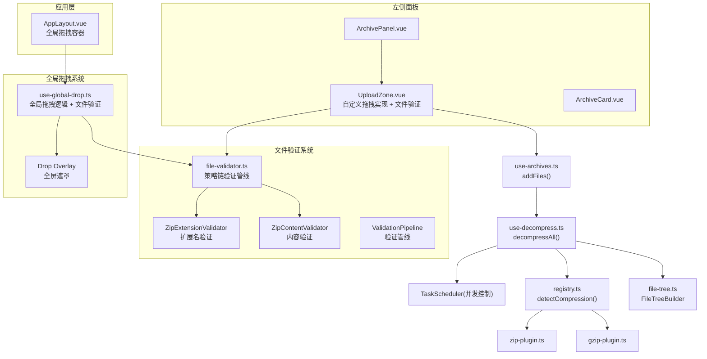
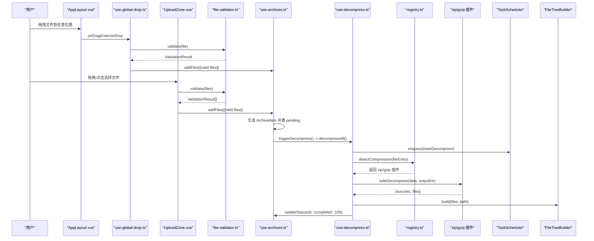
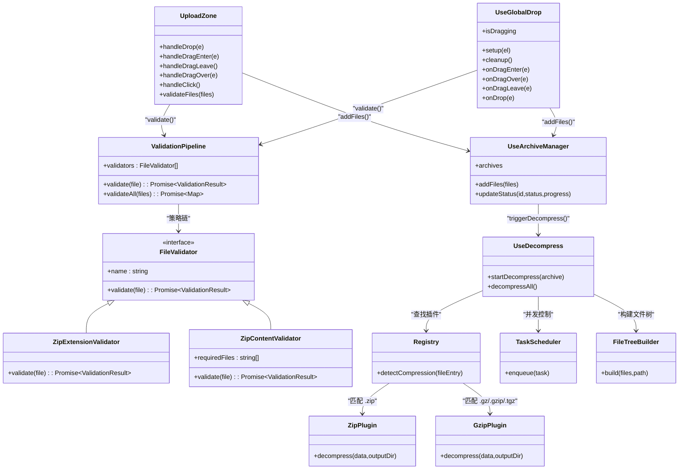
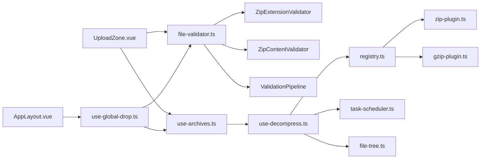

# UploadZone 上传区域组件

<cite>
**本文引用的文件**
- [UploadZone.vue](file://src/components/archive-panel/UploadZone.vue)
- [use-global-drop.ts](file://src/composables/use-global-drop.ts)
- [AppLayout.vue](file://src/layout/AppLayout.vue)
- [ArchivePanel.vue](file://src/components/archive-panel/ArchivePanel.vue)
- [file-validator.ts](file://src/core/file-validator.ts)
- [use-archives.ts](file://src/composables/use-archives.ts)
- [use-decompress.ts](file://src/composables/use-decompress.ts)
- [zip-plugin.ts](file://src/plugins/compression/zip-plugin.ts)
- [gzip-plugin.ts](file://src/plugins/compression/gzip-plugin.ts)
- [registry.ts](file://src/plugins/registry.ts)
- [task-scheduler.ts](file://src/core/task-scheduler.ts)
- [file-tree.ts](file://src/core/file-tree.ts)
- [use-global-drop.test.ts](file://src/__tests__/composables/use-global-drop.test.ts)
- [use-archives.test.ts](file://src/__tests__/_composables_/use-archives.test.ts)
</cite>

## 更新摘要
**变更内容**
- UploadZone 组件集成完整的文件验证系统，支持拖拽和文件输入的双重验证
- 新增用户消息提示和错误处理机制，提供详细的验证反馈
- 增强全局拖拽系统的文件验证能力，统一验证逻辑
- 实现策略链模式的验证管线，支持可扩展的验证规则
- 优化用户体验，提供实时的验证状态和用户反馈

## 目录
1. [简介](#简介)
2. [项目结构](#项目结构)
3. [核心组件与数据流](#核心组件与数据流)
4. [架构总览](#架构总览)
5. [详细组件分析](#详细组件分析)
6. [依赖关系分析](#依赖关系分析)
7. [性能考量](#性能考量)
8. [故障排查指南](#故障排查指南)
9. [结论](#结论)
10. [附录：扩展与定制](#附录扩展与定制)

## 简介
本文件围绕重构后的 UploadZone 上传区域组件，系统性说明其自定义拖拽实现、文件格式验证、多文件并发解压、进度跟踪与错误处理等实现细节。该组件现已完全脱离对 Naive UI NUpload 组件的依赖，采用原生 Drag & Drop API 实现，并与全局拖拽系统协同工作，提供一致的用户体验。**最新更新**：组件集成了完整的文件验证系统，支持拖拽和文件输入的双重验证，并提供详细的用户消息提示和错误处理机制。

## 项目结构
UploadZone 位于左侧面板顶部，负责接收用户选择的压缩包并触发后续解压流程；下方列表由 ArchiveCard 渲染每个压缩包的卡片。同时，应用级全局拖拽系统通过 useGlobalDrop composable 在 AppLayout 中实现全屏拖拽支持。**新增**：文件验证系统通过 file-validator.ts 模块提供统一的验证逻辑，支持策略链模式的可扩展验证规则。

**图示来源**
- [UploadZone.vue:1-122](file://src/components/archive-panel/UploadZone.vue#L1-L122)
- [use-global-drop.ts:1-104](file://src/composables/use-global-drop.ts#L1-L104)
- [AppLayout.vue:1-560](file://src/layout/AppLayout.vue#L1-L560)
- [ArchivePanel.vue:1-24](file://src/components/archive-panel/ArchivePanel.vue#L1-L24)
- [file-validator.ts:1-139](file://src/core/file-validator.ts#L1-L139)
- [use-archives.ts:1-53](file://src/composables/use-archives.ts#L1-L53)
- [use-decompress.ts:1-73](file://src/composables/use-decompress.ts#L1-L73)
- [registry.ts:41-96](file://src/plugins/registry.ts#L41-L96)
- [zip-plugin.ts:1-39](file://src/plugins/compression/zip-plugin.ts#L1-L39)
- [gzip-plugin.ts:1-43](file://src/plugins/compression/gzip-plugin.ts#L1-L43)
- [file-tree.ts](file://src/core/file-tree.ts)

**章节来源**
- [UploadZone.vue:1-122](file://src/components/archive-panel/UploadZone.vue#L1-L122)
- [ArchivePanel.vue:1-24](file://src/components/archive-panel/ArchivePanel.vue#L1-L24)

## 核心组件与数据流
- UploadZone 使用原生 Drag & Drop API 实现自定义拖拽功能，**新增**文件验证系统，将 File 对象交给 useArchiveManager.addFiles。
- useGlobalDrop composable 提供应用级拖拽支持，**集成**文件验证逻辑，监听整个应用窗口的拖拽事件。
- **新增**文件验证系统通过 ValidationPipeline 执行策略链验证，包括扩展名检查和内容验证。
- addFiles 为每个文件创建 ArchiveItem（包含 name、file、status、progress 等），随后调用 triggerDecompress。
- triggerDecompress 动态引入 useDecompress 并执行 decompressAll，遍历 pending 状态的条目逐个启动解压任务。
- useDecompress 通过 TaskScheduler 限制并发，读取 ArrayBuffer，根据文件名后缀匹配压缩插件（zip/gzip），完成后构建文件树并更新进度与时间戳。

**图示来源**
- [UploadZone.vue:21-80](file://src/components/archive-panel/UploadZone.vue#L21-L80)
- [use-global-drop.ts:48-81](file://src/composables/use-global-drop.ts#L48-L81)
- [file-validator.ts:88-115](file://src/core/file-validator.ts#L88-L115)
- [use-archives.ts:14-45](file://src/composables/use-archives.ts#L14-L45)
- [use-decompress.ts:14-70](file://src/composables/use-decompress.ts#L14-L70)
- [registry.ts:56-63](file://src/plugins/registry.ts#L56-L63)
- [zip-plugin.ts:10-38](file://src/plugins/compression/zip-plugin.ts#L10-L38)
- [gzip-plugin.ts:10-42](file://src/plugins/compression/gzip-plugin.ts#L10-L42)

**章节来源**
- [use-archives.ts:1-53](file://src/composables/use-archives.ts#L1-L53)
- [use-decompress.ts:1-73](file://src/composables/use-decompress.ts#L1-L73)

## 架构总览
从交互到处理的端到端路径如下：
- **交互层**：UploadZone 使用原生 Drag & Drop API，useGlobalDrop 提供应用级拖拽支持。
- **业务层**：useArchiveManager 维护待处理队列与状态；useDecompress 编排解压流程。
- **验证层**：**新增**file-validator.ts 提供策略链模式的验证管线，支持可扩展的验证规则。
- **插件层**：registry 按扩展名分发至具体压缩插件（zip/gzip）。
- **基础设施**：TaskScheduler 控制并发；FileTreeBuilder 构建可视化树。

**图示来源**
- [UploadZone.vue:1-122](file://src/components/archive-panel/UploadZone.vue#L1-L122)
- [use-global-drop.ts:1-104](file://src/composables/use-global-drop.ts#L1-L104)
- [file-validator.ts:1-139](file://src/core/file-validator.ts#L1-L139)
- [use-archives.ts:1-53](file://src/composables/use-archives.ts#L1-L53)
- [use-decompress.ts:1-73](file://src/composables/use-decompress.ts#L1-L73)
- [registry.ts:41-96](file://src/plugins/registry.ts#L41-L96)
- [zip-plugin.ts:1-39](file://src/plugins/compression/zip-plugin.ts#L1-L39)
- [gzip-plugin.ts:1-43](file://src/plugins/compression/gzip-plugin.ts#L1-L43)
- [task-scheduler.ts](file://src/core/task-scheduler.ts)
- [file-tree.ts](file://src/core/file-tree.ts)

## 详细组件分析

### 自定义拖拽实现与事件处理
**更新** UploadZone 现已完全重构，不再依赖 Naive UI 的 NUpload 组件，而是使用原生 Drag & Drop API 实现，**并集成文件验证系统**。

- **事件模型**：UploadZone 直接监听 dragenter、dragover、dragleave、drop 等浏览器原生事件，提供更精细的控制。
- **拖拽状态管理**：使用 `isDragging` 响应式状态和 `dragDepth` 计数器防止子元素冒泡导致的误触发。
- **视觉反馈**：通过 CSS 类切换实现边框高亮和背景色变化，提供直观的拖拽反馈。
- **点击上传**：保留隐藏的 file input，点击时触发文件选择对话框。
- **双重验证**：拖拽和文件输入都经过相同的 validateFiles 函数处理，确保验证逻辑一致性。

**章节来源**
- [UploadZone.vue:21-65](file://src/components/archive-panel/UploadZone.vue#L21-L65)
- [UploadZone.vue:83-105](file://src/components/archive-panel/UploadZone.vue#L83-L105)
- [UploadZone.vue:108-121](file://src/components/archive-panel/UploadZone.vue#L108-L121)

### 全局拖拽系统
**更新** 应用级全局拖拽支持，**集成文件验证系统**，用户可以在应用窗口任意位置拖拽文件进行上传。

- **useGlobalDrop Composable**：封装全局拖拽事件监听，提供 setup/cleanup 生命周期管理，**新增文件验证逻辑**。
- **全屏遮罩反馈**：在 AppLayout 中实现半透明遮罩层，显示拖拽提示图标和文字。
- **防闪烁机制**：使用 dragCounter 计数器解决拖拽经过子元素时的频繁触发问题。
- **统一入口**：全局拖拽和本地拖拽都调用同一个 addFiles 方法，保持行为一致性。
- **验证反馈**：验证失败时通过 message.error 显示具体的错误信息，非压缩包文件通过 message.warning 提示。

**章节来源**
- [use-global-drop.ts:17-103](file://src/composables/use-global-drop.ts#L17-L103)
- [AppLayout.vue:13-27](file://src/layout/AppLayout.vue#L13-L27)
- [AppLayout.vue:155-168](file://src/layout/AppLayout.vue#L155-L168)
- [AppLayout.vue:515-558](file://src/layout/AppLayout.vue#L515-L558)

### 文件验证系统与用户反馈
**新增** 完整的文件验证系统，采用策略链模式设计，支持可扩展的验证规则。

- **策略链模式**：ValidationPipeline 按顺序执行所有验证器，遇到第一个失败即短路返回。
- **内置验证器**：
  - ZipExtensionValidator：检查文件扩展名是否为 .zip
  - ZipContentValidator：检查 ZIP 内是否包含 VERSION.txt 文件
- **异步验证**：支持读取文件内容进行深度检查，如使用 fflate 库解析 ZIP 文件内容。
- **用户反馈**：验证失败时通过 message.error 显示具体的错误信息，包括文件名和验证失败原因。
- **批量验证**：支持多个文件的并行验证，提高处理效率。

**章节来源**
- [file-validator.ts:14-20](file://src/core/file-validator.ts#L14-L20)
- [file-validator.ts:24-80](file://src/core/file-validator.ts#L24-L80)
- [file-validator.ts:88-115](file://src/core/file-validator.ts#L88-L115)
- [file-validator.ts:120-133](file://src/core/file-validator.ts#L120-L133)
- [UploadZone.vue:67-80](file://src/components/archive-panel/UploadZone.vue#L67-L80)
- [use-global-drop.ts:66-76](file://src/composables/use-global-drop.ts#L66-L76)

### 文件格式验证与大小限制
**更新** 文件验证机制得到显著增强，支持内容级别的验证和用户反馈。

- **格式白名单**：通过 ACCEPTED_EXTS 数组限定可接受的文件扩展名，包括 .zip、.gz、.gzip、.tgz、.7z、.rar、.tar。
- **内容验证**：集成 file-validator 模块，支持 ZIP 文件内容检查（如 VERSION.txt 存在性验证）。
- **异步验证**：validateFiles 函数异步执行所有验证器，支持读取文件内容进行深度检查。
- **错误提示**：验证失败时通过 message.error 显示具体的错误信息，包括文件名和验证失败原因。
- **双重验证**：拖拽和文件输入都经过相同的验证流程，确保一致性。

**章节来源**
- [UploadZone.vue:14-19](file://src/components/archive-panel/UploadZone.vue#L14-L19)
- [UploadZone.vue:67-80](file://src/components/archive-panel/UploadZone.vue#L67-L80)
- [use-global-drop.ts:6-15](file://src/composables/use-global-drop.ts#L6-L15)
- [use-global-drop.ts:66-76](file://src/composables/use-global-drop.ts#L66-L76)
- [file-validator.ts:24-80](file://src/core/file-validator.ts#L24-L80)
- [file-validator.ts:120-133](file://src/core/file-validator.ts#L120-L133)

### 多文件上传与并发控制
- **多文件支持**：file input 设置 multiple 属性，允许一次选择多个文件；handleDrop 和 handleInputChange 都会处理多文件场景。
- **去重机制**：useArchiveManager 使用 addedFileKeys Set 基于文件名+大小+修改时间进行去重。
- **并发控制**：useDecompress 使用 TaskScheduler 初始化并发度（示例为 3），通过 enqueue 将解压任务入队，避免同时过多 I/O 导致卡顿。
- **验证优化**：文件验证系统支持批量验证，提高多文件处理效率。

**章节来源**
- [UploadZone.vue:97-104](file://src/components/archive-panel/UploadZone.vue#L97-L104)
- [use-archives.ts:7-23](file://src/composables/use-archives.ts#L7-L23)
- [use-decompress.ts:7-8](file://src/composables/use-decompress.ts#L7-L8)
- [use-decompress.ts:17-20](file://src/composables/use-decompress.ts#L17-L20)

### 进度跟踪与时间统计
- **进度节点**：在 startDecompress 中分阶段更新 progress（如 30/80/100），并通过 updateStatus 持久化到 archives。
- **时间戳**：running 时记录 startTime，completed 时记录 endTime，便于计算耗时。
- **测试覆盖**：单元测试验证 running/completed 状态与 progress 更新逻辑。

**章节来源**
- [use-decompress.ts:35-51](file://src/composables/use-decompress.ts#L35-L51)
- [use-archives.ts:47-53](file://src/composables/use-archives.ts#L47-L53)
- [use-archives.test.ts:39-64](file://src/__tests__/_composables_/use-archives.test.ts#L39-L64)

### 错误处理与重试机制
**更新** 错误处理机制得到显著增强，提供详细的用户反馈。

- **错误来源**：无可用插件、解压失败、未知异常、验证失败等场景均会设置 status=failed 并写入 archive.error。
- **验证错误**：file-validator 返回的详细错误信息会通过 message.error 展示给用户，包括文件名和具体失败原因。
- **用户反馈**：非压缩包文件通过 message.warning 提示，验证失败的单个文件单独显示错误信息。
- **重试入口**：ArchivePanel 向 ArchiveCard 暴露 @retry 事件，当前为空实现。可扩展为重新入队 startDecompress 以支持重试。

**章节来源**
- [use-decompress.ts:29-33](file://src/composables/use-decompress.ts#L29-L33)
- [use-decompress.ts:39-43](file://src/composables/use-decompress.ts#L39-L43)
- [use-decompress.ts:52-55](file://src/composables/use-decompress.ts#L52-L55)
- [UploadZone.vue:75-77](file://src/components/archive-panel/UploadZone.vue#L75-L77)
- [use-global-drop.ts:57-76](file://src/composables/use-global-drop.ts#L57-L76)
- [ArchivePanel.vue:18-19](file://src/components/archive-panel/ArchivePanel.vue#L18-L19)

### 移动端触摸支持与跨浏览器兼容
- **点击选择**：隐藏的文件 input 在移动端自动提供点击选择文件的入口，无需额外实现。
- **拖拽体验**：移动端通常不支持拖拽，建议保留点击选择作为主要交互；如需增强，可监听 touch 事件模拟拖拽效果。
- **兼容性**：压缩插件在 Tauri 环境下走平台适配层，在 Web 环境优先使用浏览器 API（如 DecompressionStream）或第三方库（如 fflate）。
- **验证兼容性**：文件验证系统支持跨平台，在无法解析时使用兜底逻辑。

**章节来源**
- [UploadZone.vue:97-104](file://src/components/archive-panel/UploadZone.vue#L97-L104)
- [gzip-plugin.ts:17-42](file://src/plugins/compression/gzip-plugin.ts#L17-L42)
- [zip-plugin.ts:17-37](file://src/plugins/compression/zip-plugin.ts#L17-L37)
- [file-validator.ts:74-79](file://src/core/file-validator.ts#L74-L79)

## 依赖关系分析
- **组件耦合**：UploadZone 仅依赖 useArchiveManager 和 file-validator，职责单一；useGlobalDrop 独立于 UploadZone，提供全局功能。
- **外部依赖**：Naive UI 仅提供基础 UI 组件（NText、useMessage）；TaskScheduler 与 FileTreeBuilder 提供通用工具。
- **潜在循环**：当前未见循环引用；use-archives 与 use-decompress 通过函数调用解耦。
- **验证依赖**：file-validator 模块被 UploadZone 和 useGlobalDrop 共同依赖，提供统一的验证逻辑。

**图示来源**
- [UploadZone.vue:1-122](file://src/components/archive-panel/UploadZone.vue#L1-L122)
- [use-global-drop.ts:1-104](file://src/composables/use-global-drop.ts#L1-L104)
- [AppLayout.vue:1-560](file://src/layout/AppLayout.vue#L1-L560)
- [file-validator.ts:1-139](file://src/core/file-validator.ts#L1-L139)
- [use-archives.ts:1-53](file://src/composables/use-archives.ts#L1-L53)
- [use-decompress.ts:1-73](file://src/composables/use-decompress.ts#L1-L73)
- [registry.ts:41-96](file://src/plugins/registry.ts#L41-L96)
- [zip-plugin.ts:1-39](file://src/plugins/compression/zip-plugin.ts#L1-L39)
- [gzip-plugin.ts:1-43](file://src/plugins/compression/gzip-plugin.ts#L1-L43)
- [task-scheduler.ts](file://src/core/task-scheduler.ts)
- [file-tree.ts](file://src/core/file-tree.ts)

## 性能考量
- **并发上限**：TaskScheduler 初始化为 3，可根据设备性能调优。
- **大文件处理**：直接读取 ArrayBuffer，内存占用与文件大小线性相关；超大文件建议分批或流式处理。
- **渲染优化**：文件树建议使用虚拟滚动（项目已有规划），避免大量节点导致的卡顿。
- **事件优化**：使用 dragDepth 计数器和 pointer-events: none 优化拖拽事件性能。
- **验证优化**：文件验证系统支持批量验证，减少重复的 I/O 操作。
- **懒加载**：fflate 库按需导入，避免不必要的包体积增加。

## 故障排查指南
- **无法识别格式**：检查 ACCEPTED_EXTS 配置与文件名后缀是否匹配；确认 registry 已注册对应压缩插件。
- **解压失败**：查看 archive.error 字段；确认目标平台是否支持相应解压方式（Tauri/Web）。
- **进度不更新**：确认 updateStatus 被正确调用；检查 TaskScheduler 是否因队列满而拒绝入队。
- **拖拽无响应**：检查 dragenter/dragover 事件中是否正确调用 preventDefault()。
- **全局拖拽冲突**：确认 AppLayout 的 appShellRef 正确绑定且事件监听器正常挂载。
- **移动端无拖拽**：属预期行为，引导用户使用点击选择。
- **验证失败**：检查 file-validator 中的验证规则，查看 message.error 中的具体错误信息。
- **验证性能问题**：对于大文件，考虑优化验证逻辑或添加进度反馈。

**章节来源**
- [use-decompress.ts:29-33](file://src/composables/use-decompress.ts#L29-L33)
- [use-decompress.ts:52-61](file://src/composables/use-decompress.ts#L52-L61)
- [use-archives.ts:47-53](file://src/composables/use-archives.ts#L47-L53)
- [UploadZone.vue:34-50](file://src/components/archive-panel/UploadZone.vue#L34-L50)
- [use-global-drop.ts:25-46](file://src/composables/use-global-drop.ts#L25-L46)
- [file-validator.ts:74-79](file://src/core/file-validator.ts#L74-L79)

## 结论
重构后的 UploadZone 组件实现了完全自主的拖拽功能，摆脱了对 Naive UI 上传组件的依赖，提供了更灵活和可控的实现。**最新改进**：集成了完整的文件验证系统，采用策略链模式设计，支持可扩展的验证规则。配合全局拖拽系统 useGlobalDrop，用户可以在应用任意位置进行文件上传，大大提升了用户体验。新的文件验证机制支持内容级别的检查，增强了系统的健壮性，并通过详细的用户反馈提升了用户体验。整体架构清晰，职责分离明确，为后续的扩展和维护奠定了良好基础。

## 附录：扩展与定制

### 自定义验证规则
**更新** 文件验证系统采用策略链模式设计，易于扩展新的验证规则。

- **扩展验证器**：在 file-validator.ts 中实现新的 FileValidator 接口，添加到 defaultValidators 数组即可启用。
- **ZIP 内容检查**：ZipContentValidator 支持检查压缩包内特定文件的存在性，可自定义 requiredFiles 参数。
- **文件大小限制**：可在 validateFiles 函数中添加 file.size 检查逻辑。
- **安全校验**：对文件名进行清洗，防止路径穿越或特殊字符问题。
- **异步验证**：验证器支持异步操作，可以执行复杂的文件内容检查。

**章节来源**
- [file-validator.ts:14-20](file://src/core/file-validator.ts#L14-L20)
- [file-validator.ts:120-133](file://src/core/file-validator.ts#L120-L133)
- [UploadZone.vue:67-80](file://src/components/archive-panel/UploadZone.vue#L67-L80)

### 样式与视觉定制
- **高亮反馈**：通过 .upload-zone.is-dragging 类控制拖拽状态下的样式，可自定义边框颜色、背景色等。
- **全局遮罩**：AppLayout 中的 drop-overlay 样式可调整遮罩透明度、模糊效果、图标尺寸等。
- **提示文案**：替换 NText 插槽内容，显示更明确的帮助信息。
- **主题适配**：遵循全局主题变量，确保深色/浅色模式一致。
- **验证反馈样式**：可通过 CSS 变量自定义验证错误的视觉表现。

**章节来源**
- [UploadZone.vue:108-121](file://src/components/archive-panel/UploadZone.vue#L108-L121)
- [AppLayout.vue:515-558](file://src/layout/AppLayout.vue#L515-L558)
- [UploadZone.vue:94-96](file://src/components/archive-panel/UploadZone.vue#L94-L96)

### 重试机制实现建议
- **在 ArchiveCard 中实现 @retry 回调**，调用 useArchiveManager.updateStatus 将状态重置为 pending，再由 useDecompress 重新入队。
- **可选**：为失败项提供"最大重试次数"与"退避策略"。
- **批量重试**：支持对所有失败项进行批量重试操作。
- **验证重试**：对于验证失败的文件，可提供重新验证的功能。

**章节来源**
- [ArchivePanel.vue:18-19](file://src/components/archive-panel/ArchivePanel.vue#L18-L19)
- [use-archives.ts:47-53](file://src/composables/use-archives.ts#L47-L53)
- [use-decompress.ts:64-70](file://src/composables/use-decompress.ts#L64-L70)

### 全局拖拽系统扩展
- **自定义拖拽区域**：可在特定组件中使用 useGlobalDrop 的 setup/cleanup 方法实现局部拖拽支持。
- **拖拽反馈定制**：修改 drop-overlay 样式或替换为其他视觉反馈形式。
- **文件类型过滤**：在 useGlobalDrop 中修改 ACCEPTED_EXTENSIONS 集合以支持更多文件类型。
- **验证规则定制**：可通过 getFileValidator 函数获取验证管线实例，添加自定义验证规则。

**章节来源**
- [use-global-drop.ts:83-103](file://src/composables/use-global-drop.ts#L83-L103)
- [use-global-drop.ts:6-15](file://src/composables/use-global-drop.ts#L6-L15)
- [AppLayout.vue:155-168](file://src/layout/AppLayout.vue#L155-L168)

### 用户反馈系统定制
**新增** 用户反馈系统提供丰富的消息提示功能。

- **错误提示**：message.error 用于显示验证失败、解压错误等严重错误。
- **警告提示**：message.warning 用于显示非关键性警告，如忽略非压缩包文件。
- **成功提示**：可使用 message.success 显示操作成功的反馈。
- **自定义样式**：可通过 Naive UI 的主题配置自定义消息提示的样式和行为。
- **国际化支持**：消息文本可配置为多语言版本。

**章节来源**
- [UploadZone.vue:75-77](file://src/components/archive-panel/UploadZone.vue#L75-L77)
- [use-global-drop.ts:57-76](file://src/composables/use-global-drop.ts#L57-L76)
- [use-global-drop.test.ts:15-24](file://src/__tests__/composables/use-global-drop.test.ts#L15-L24)