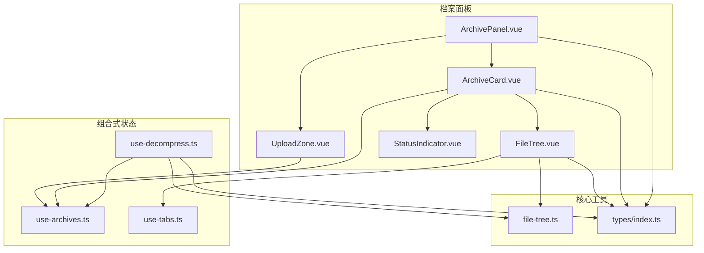
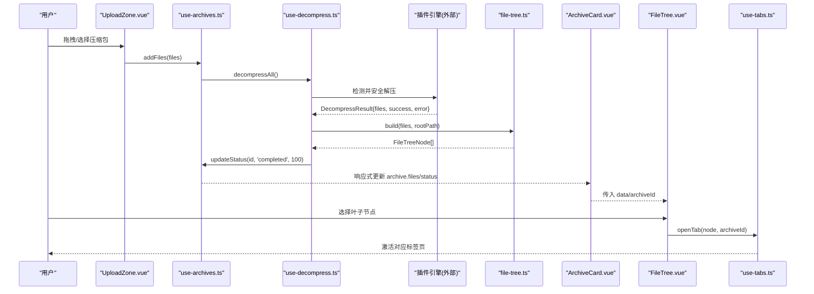
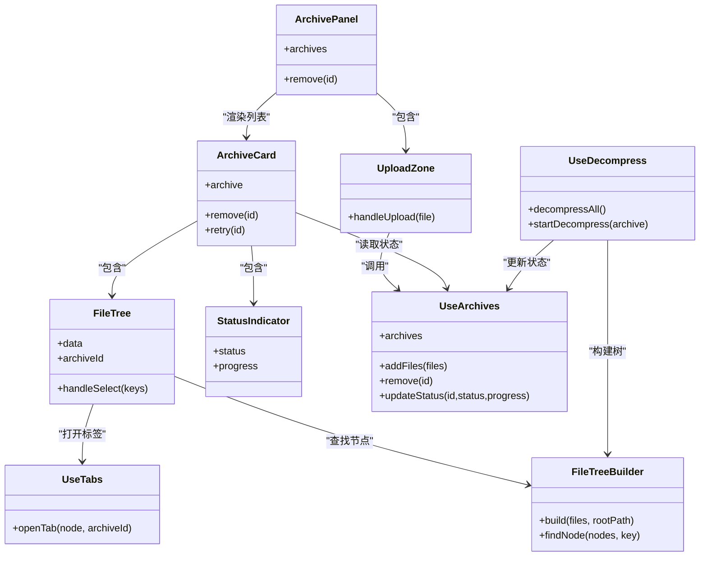

# 档案面板组件

<cite>
**本文引用的文件**   
- [ArchivePanel.vue](file://src/components/archive-panel/ArchivePanel.vue)
- [FileTree.vue](file://src/components/archive-panel/FileTree.vue)
- [UploadZone.vue](file://src/components/archive-panel/UploadZone.vue)
- [ArchiveCard.vue](file://src/components/archive-panel/ArchiveCard.vue)
- [StatusIndicator.vue](file://src/components/archive-panel/StatusIndicator.vue)
- [use-archives.ts](file://src/composables/use-archives.ts)
- [use-decompress.ts](file://src/composables/use-decompress.ts)
- [use-tabs.ts](file://src/composables/use-tabs.ts)
- [file-tree.ts](file://src/core/file-tree.ts)
- [index.ts](file://src/types/index.ts)
</cite>

## 目录
1. [简介](#简介)
2. [项目结构](#项目结构)
3. [核心组件](#核心组件)
4. [架构总览](#架构总览)
5. [详细组件分析](#详细组件分析)
6. [依赖关系分析](#依赖关系分析)
7. [性能与体验优化](#性能与体验优化)
8. [故障排查指南](#故障排查指南)
9. [结论](#结论)

## 简介
本章节聚焦于 Hello-Tauri 项目的“档案面板”功能，围绕 ArchivePanel.vue 容器及其子组件展开：
- ArchivePanel.vue：作为容器，组织上传区域、压缩包卡片列表与滚动区域。
- UploadZone.vue：提供拖拽与点击上传入口，触发压缩包的添加与解压流程。
- ArchiveCard.vue：展示单个压缩包的状态、错误信息、进度以及内部文件树。
- FileTree.vue：基于 Naive UI 的树控件，实现过滤、选择打开等交互。
- StatusIndicator.vue：统一的状态标签与进度条视觉反馈。

同时说明组件间通信模式（props/emits + 组合式状态共享）、事件处理机制、用户体验优化与错误处理策略。

## 项目结构
档案面板相关代码位于 src/components/archive-panel 下，配合 composables 与 core 层能力完成数据流与业务逻辑。

图表来源
- [ArchivePanel.vue:1-24](file://src/components/archive-panel/ArchivePanel.vue#L1-L24)
- [UploadZone.vue:1-29](file://src/components/archive-panel/UploadZone.vue#L1-L29)
- [ArchiveCard.vue:1-41](file://src/components/archive-panel/ArchiveCard.vue#L1-L41)
- [FileTree.vue:1-42](file://src/components/archive-panel/FileTree.vue#L1-L42)
- [StatusIndicator.vue:1-28](file://src/components/archive-panel/StatusIndicator.vue#L1-L28)
- [use-archives.ts:1-60](file://src/composables/use-archives.ts#L1-L60)
- [use-decompress.ts:1-74](file://src/composables/use-decompress.ts#L1-L74)
- [use-tabs.ts:1-64](file://src/composables/use-tabs.ts#L1-L64)
- [file-tree.ts:1-69](file://src/core/file-tree.ts#L1-L69)
- [index.ts:1-71](file://src/types/index.ts#L1-L71)

章节来源
- [ArchivePanel.vue:1-24](file://src/components/archive-panel/ArchivePanel.vue#L1-L24)
- [use-archives.ts:1-60](file://src/composables/use-archives.ts#L1-L60)

## 核心组件
- ArchivePanel.vue：容器组件，负责布局与子组件编排，使用 NScrollbar 包裹 ArchiveCard 列表，顶部放置 UploadZone。通过 useArchiveManager 获取 archives 列表并转发 remove/retry 事件。
- UploadZone.vue：封装 NUpload/NUploadDragger，限制 accept 为常见压缩格式，自定义请求回调将 File 对象交给 addFiles，随后由 use-archives 触发解压调度。
- ArchiveCard.vue：以 NCard 承载标题、关闭按钮、头部扩展区（状态指示器），在失败时显示错误信息与重试按钮；当存在 files 时渲染 FileTree。
- FileTree.vue：使用 NInput 进行文本过滤，NTree 渲染树节点，支持虚拟滚动与默认收起；选择叶子节点后通过 useTabManager.openTab 打开预览标签页。
- StatusIndicator.vue：根据 status 渲染不同颜色标签，running 状态下附加线性进度条，直观反馈任务进度。

章节来源
- [ArchivePanel.vue:1-24](file://src/components/archive-panel/ArchivePanel.vue#L1-L24)
- [UploadZone.vue:1-29](file://src/components/archive-panel/UploadZone.vue#L1-L29)
- [ArchiveCard.vue:1-41](file://src/components/archive-panel/ArchiveCard.vue#L1-L41)
- [FileTree.vue:1-42](file://src/components/archive-panel/FileTree.vue#L1-L42)
- [StatusIndicator.vue:1-28](file://src/components/archive-panel/StatusIndicator.vue#L1-L28)

## 架构总览
整体数据流从上传到解压再到树构建与标签页打开，关键路径如下：

图表来源
- [UploadZone.vue:1-29](file://src/components/archive-panel/UploadZone.vue#L1-L29)
- [use-archives.ts:1-60](file://src/composables/use-archives.ts#L1-L60)
- [use-decompress.ts:1-74](file://src/composables/use-decompress.ts#L1-L74)
- [file-tree.ts:1-69](file://src/core/file-tree.ts#L1-L69)
- [ArchiveCard.vue:1-41](file://src/components/archive-panel/ArchiveCard.vue#L1-L41)
- [FileTree.vue:1-42](file://src/components/archive-panel/FileTree.vue#L1-L42)
- [use-tabs.ts:1-64](file://src/composables/use-tabs.ts#L1-L64)

## 详细组件分析

### ArchivePanel.vue（容器）
职责与组织方式
- 布局：垂直方向排列上传区与卡片列表，列表区域使用 NScrollbar 提供滚动。
- 数据源：通过 useArchiveManager 暴露的 archives 驱动列表渲染。
- 事件转发：对 ArchiveCard 的 remove 事件直接调用 remove；retry 事件已预留空处理函数，便于后续接入重试逻辑。

交互要点
- 新增压缩包：UploadZone 触发 addFiles，自动进入待处理队列。
- 移除压缩包：点击卡片关闭按钮或调用 remove 后，列表即时更新。

章节来源
- [ArchivePanel.vue:1-24](file://src/components/archive-panel/ArchivePanel.vue#L1-L24)
- [use-archives.ts:1-60](file://src/composables/use-archives.ts#L1-L60)

### UploadZone.vue（上传区域）
功能特性
- 多文件上传：multiple 开启，隐藏默认文件列表，采用自定义请求回调。
- 格式校验：accept 限定为 .zip/.gz/.gzip/.tgz/.7z/.rar/.tar，浏览器侧做基础拦截。
- 上传处理：handleUpload 接收 file.file，调用 addFiles([file])，返回 false 阻止默认行为。

用户体验
- 拖拽友好：NUploadDragger 提供直观的拖放提示文案。
- 即时反馈：addFiles 会立即创建 pending 状态的条目，并触发解压调度。

章节来源
- [UploadZone.vue:1-29](file://src/components/archive-panel/UploadZone.vue#L1-L29)
- [use-archives.ts:1-60](file://src/composables/use-archives.ts#L1-L60)

### ArchiveCard.vue（压缩包卡片）
数据展示
- 标题：archive.name
- 状态：header-extra 中嵌入 StatusIndicator，显示 completed/running/pending/failed 及进度。
- 错误信息：status === 'failed' 时显示 archive.error，并提供重试按钮。
- 文件树：当 archive.files 非空时渲染 FileTree。

交互逻辑
- 关闭：emit('remove', id) 通知父级删除该条目。
- 重试：emit('retry', id)，当前为空实现，可在此处重新入队或恢复状态。

章节来源
- [ArchiveCard.vue:1-41](file://src/components/archive-panel/ArchiveCard.vue#L1-L41)
- [StatusIndicator.vue:1-28](file://src/components/archive-panel/StatusIndicator.vue#L1-L28)
- [index.ts:34-46](file://src/types/index.ts#L34-L46)

### FileTree.vue（文件树）
渲染与交互
- 过滤：NInput 绑定 pattern，NTree 使用 :pattern 与 :show-irrelevant-nodes="false" 实现高亮匹配且隐藏无关节点。
- 展开：default-expand-all 为 false，按需展开。
- 选择：@update:selected-keys 触发 handleSelect，仅对叶子节点执行打开操作。
- 打开标签：通过 useTabManager.openTab(node, archiveId) 打开预览标签页。

递归渲染与节点查找
- 树结构由 FileTreeBuilder.build 生成，节点 key 为 path，isLeaf 标识是否为文件。
- 选择时通过 FileTreeBuilder.findNode 定位具体节点，确保只打开文件类型。

注意
- 当前未实现拖拽排序；如需支持，可在 NTree 上启用 draggable 并在回调中维护 FileTreeNode 顺序，同时保证 key 唯一性与稳定性。

章节来源
- [FileTree.vue:1-42](file://src/components/archive-panel/FileTree.vue#L1-L42)
- [file-tree.ts:1-69](file://src/core/file-tree.ts#L1-L69)
- [use-tabs.ts:1-64](file://src/composables/use-tabs.ts#L1-L64)
- [index.ts:17-24](file://src/types/index.ts#L17-L24)

### StatusIndicator.vue（状态指示器）
视觉反馈设计
- completed：成功标签
- running：进行中标签 + 线性进度条（宽度固定，隐藏百分比文字）
- pending：排队中标签
- failed：失败标签

数据来源
- 由 ArchiveCard 传入 archive.status 与 archive.progress，实时反映解压进度。

章节来源
- [StatusIndicator.vue:1-28](file://src/components/archive-panel/StatusIndicator.vue#L1-L28)
- [index.ts:15](file://src/types/index.ts#L15-L15)

## 依赖关系分析
组件与模块间的耦合与协作关系如下：

图表来源
- [ArchivePanel.vue:1-24](file://src/components/archive-panel/ArchivePanel.vue#L1-L24)
- [UploadZone.vue:1-29](file://src/components/archive-panel/UploadZone.vue#L1-L29)
- [ArchiveCard.vue:1-41](file://src/components/archive-panel/ArchiveCard.vue#L1-L41)
- [FileTree.vue:1-42](file://src/components/archive-panel/FileTree.vue#L1-L42)
- [StatusIndicator.vue:1-28](file://src/components/archive-panel/StatusIndicator.vue#L1-L28)
- [use-archives.ts:1-60](file://src/composables/use-archives.ts#L1-L60)
- [use-decompress.ts:1-74](file://src/composables/use-decompress.ts#L1-L74)
- [use-tabs.ts:1-64](file://src/composables/use-tabs.ts#L1-L64)
- [file-tree.ts:1-69](file://src/core/file-tree.ts#L1-L69)

章节来源
- [use-archives.ts:1-60](file://src/composables/use-archives.ts#L1-L60)
- [use-decompress.ts:1-74](file://src/composables/use-decompress.ts#L1-L74)
- [use-tabs.ts:1-64](file://src/composables/use-tabs.ts#L1-L64)
- [file-tree.ts:1-69](file://src/core/file-tree.ts#L1-L69)

## 性能与体验优化
- 大文件与大数据集
  - 文件树启用虚拟滚动（NTree virtual-scroll），降低 DOM 压力，提升长列表渲染性能。
  - 解压任务通过 TaskScheduler 控制并发度，避免阻塞主线程。
- 交互流畅性
  - 上传后立即创建 pending 条目，减少等待焦虑。
  - 运行中显示进度条，失败时明确错误信息并提供重试入口。
- 可扩展点
  - 文件树拖拽排序：可在 NTree 启用 draggable，结合 FileTreeNode 的 children 数组重排，并确保 key 稳定。
  - 批量操作：在 ArchivePanel 增加全选/批量移除/批量重试能力。
  - 搜索增强：在 FileTree 的 pattern 基础上，可增加按大小、类型筛选。

[本节为通用建议，不直接分析具体文件]

## 故障排查指南
常见问题与定位思路
- 无法识别压缩格式
  - 现象：状态变为 failed，错误信息提示无可用插件。
  - 排查：确认文件名后缀是否在 accept 范围内；检查插件注册表是否支持该格式。
  - 参考路径：[use-decompress.ts:28-33](file://src/composables/use-decompress.ts#L28-L33)
- 解压失败
  - 现象：failed 状态并显示错误消息。
  - 排查：查看 archive.error；确认压缩包完整性；检查内存占用与并发队列是否已满。
  - 参考路径：[use-decompress.ts:39-55](file://src/composables/use-decompress.ts#L39-L55)
- 任务队列满
  - 现象：failed 且错误信息提示队列已满。
  - 排查：降低并发度或延后提交任务；观察系统资源占用。
  - 参考路径：[use-decompress.ts:58-61](file://src/composables/use-decompress.ts#L58-L61)
- 文件树未显示
  - 现象：卡片内无文件树。
  - 排查：确认 archive.files 是否已填充；检查 FileTreeBuilder.build 返回值。
  - 参考路径：[use-decompress.ts:47-48](file://src/composables/use-decompress.ts#L47-L48), [file-tree.ts:7-44](file://src/core/file-tree.ts#L7-L44)
- 选择节点无效
  - 现象：点击节点未打开标签页。
  - 排查：确认选中节点 isLeaf 为 true；检查 FileTreeBuilder.findNode 是否能找到目标节点。
  - 参考路径：[FileTree.vue:16-23](file://src/components/archive-panel/FileTree.vue#L16-L23), [file-tree.ts:46-55](file://src/core/file-tree.ts#L46-L55)

章节来源
- [use-decompress.ts:28-61](file://src/composables/use-decompress.ts#L28-L61)
- [file-tree.ts:7-55](file://src/core/file-tree.ts#L7-L55)
- [FileTree.vue:16-23](file://src/components/archive-panel/FileTree.vue#L16-L23)

## 结论
档案面板通过清晰的容器-卡片-树-状态指示器分层，结合组合式状态管理与核心工具类，实现了从上传、解压、树构建到标签页打开的完整链路。组件间通过 props/emits 与共享状态进行通信，具备较好的可读性与可维护性。后续可在文件树拖拽排序、批量操作、更丰富的筛选与错误恢复方面继续增强，以提升整体用户体验与健壮性。