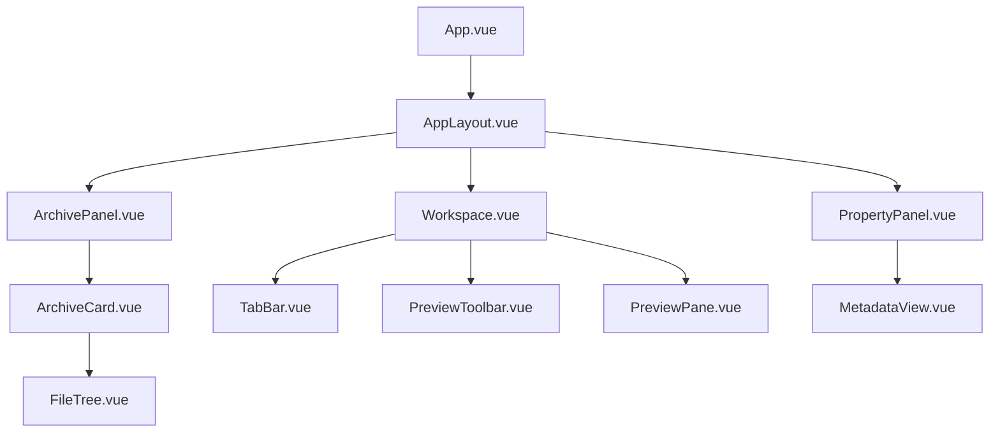
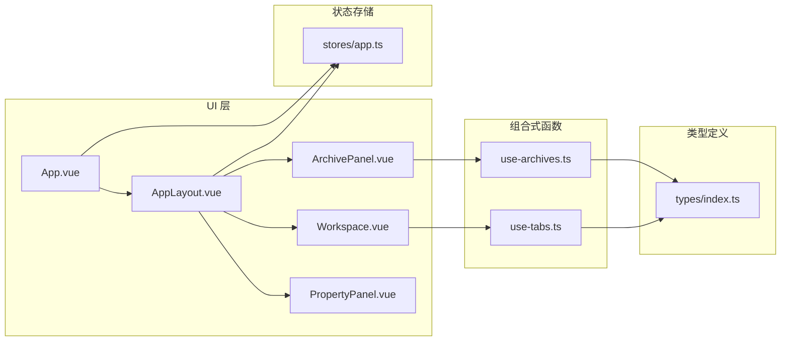
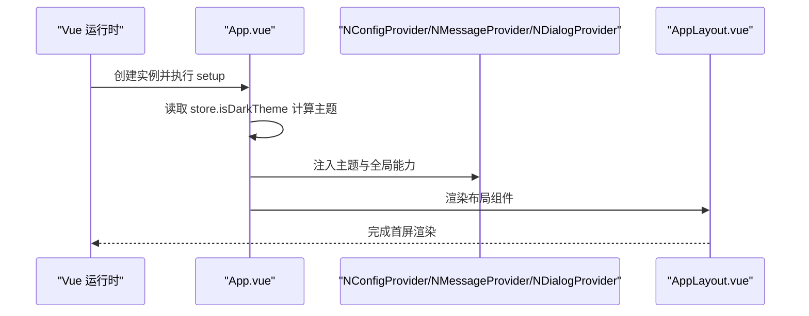
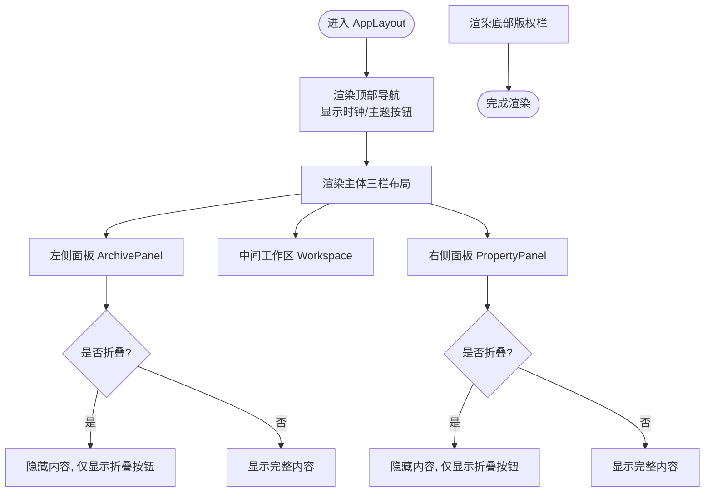
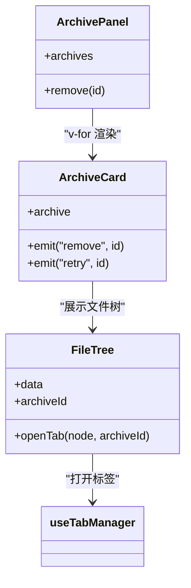
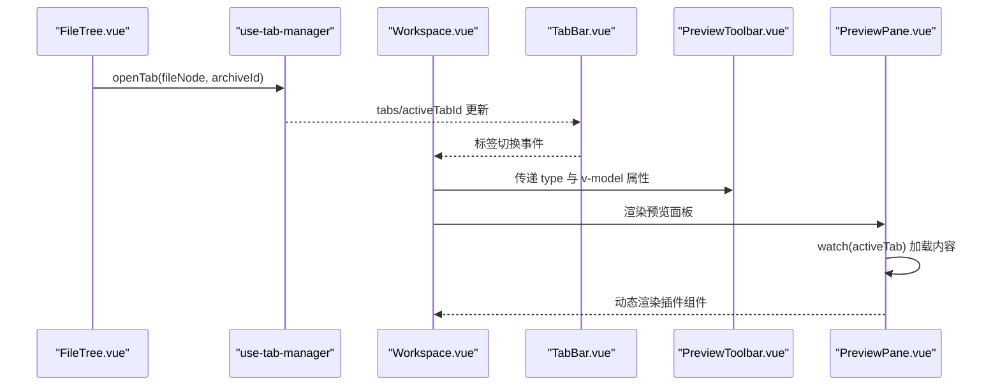
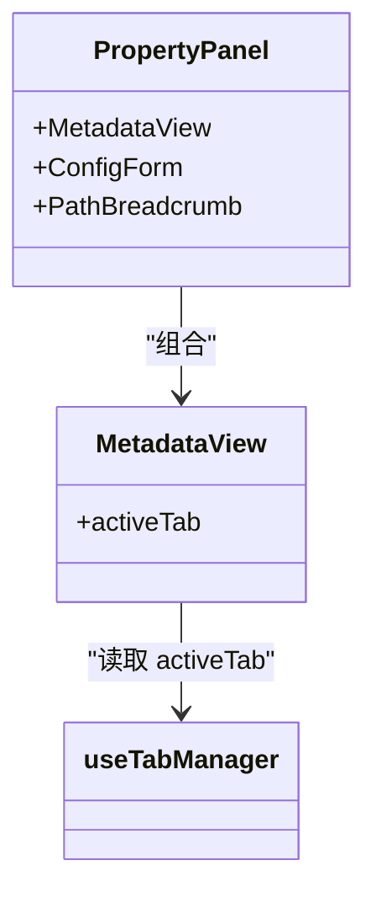
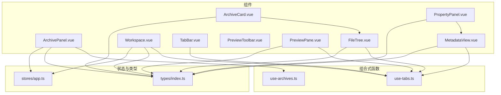

# 组件层次结构

<cite>
**本文引用的文件**   
- [App.vue](file://src/App.vue)
- [AppLayout.vue](file://src/layout/AppLayout.vue)
- [ArchivePanel.vue](file://src/components/archive-panel/ArchivePanel.vue)
- [ArchiveCard.vue](file://src/components/archive-panel/ArchiveCard.vue)
- [FileTree.vue](file://src/components/archive-panel/FileTree.vue)
- [Workspace.vue](file://src/components/workspace/Workspace.vue)
- [TabBar.vue](file://src/components/workspace/TabBar.vue)
- [PreviewPane.vue](file://src/components/workspace/PreviewPane.vue)
- [PreviewToolbar.vue](file://src/components/workspace/PreviewToolbar.vue)
- [PropertyPanel.vue](file://src/components/property-panel/PropertyPanel.vue)
- [MetadataView.vue](file://src/components/property-panel/MetadataView.vue)
- [use-archives.ts](file://src/composables/use-archives.ts)
- [use-tabs.ts](file://src/composables/use-tabs.ts)
- [app.ts](file://src/stores/app.ts)
- [index.ts（类型定义）](file://src/types/index.ts)
</cite>

## 目录
1. [简介](#简介)
2. [项目结构](#项目结构)
3. [核心组件](#核心组件)
4. [架构总览](#架构总览)
5. [详细组件分析](#详细组件分析)
6. [依赖关系分析](#依赖关系分析)
7. [性能考量](#性能考量)
8. [故障排查指南](#故障排查指南)
9. [结论](#结论)
10. [附录](#附录)

## 简介
本文件聚焦于 Hello-Tauri 项目的 Vue 3 组件层次结构与交互机制，围绕根组件 App.vue 的初始化流程与布局组件 AppLayout.vue 的三栏式布局展开，深入解析档案面板、工作区与属性面板的职责划分、数据流与事件通信。同时总结可复用组件设计原则、响应式布局实现策略，并提供组件依赖图与关键交互流程图，以及测试与性能优化建议。

## 项目结构
整体采用“布局容器 + 功能区域”的分层组织方式：
- 应用壳层：App.vue 负责主题与全局 UI 能力注入，并挂载布局容器。
- 布局容器：AppLayout.vue 提供顶部导航、左侧档案面板、中间工作区、右侧属性面板与底部状态栏。
- 功能区域：
  - 档案面板：管理压缩包上传、解压任务与文件树浏览。
  - 工作区：标签页管理、预览工具栏、内容渲染与状态栏。
  - 属性面板：展示当前选中文件的元信息与配置项。
- 共享能力：通过组合式函数（composables）与 Pinia store 进行跨组件状态管理与业务编排。

图示来源
- [App.vue:1-24](file://src/App.vue#L1-L24)
- [AppLayout.vue:1-126](file://src/layout/AppLayout.vue#L1-L126)
- [ArchivePanel.vue:1-24](file://src/components/archive-panel/ArchivePanel.vue#L1-L24)
- [ArchiveCard.vue:1-41](file://src/components/archive-panel/ArchiveCard.vue#L1-L41)
- [FileTree.vue:1-42](file://src/components/archive-panel/FileTree.vue#L1-L42)
- [Workspace.vue:1-36](file://src/components/workspace/Workspace.vue#L1-L36)
- [TabBar.vue:1-33](file://src/components/workspace/TabBar.vue#L1-L33)
- [PreviewToolbar.vue:1-44](file://src/components/workspace/PreviewToolbar.vue#L1-L44)
- [PreviewPane.vue:1-58](file://src/components/workspace/PreviewPane.vue#L1-L58)
- [PropertyPanel.vue:1-15](file://src/components/property-panel/PropertyPanel.vue#L1-L15)
- [MetadataView.vue:1-35](file://src/components/property-panel/MetadataView.vue#L1-L35)

章节来源
- [App.vue:1-24](file://src/App.vue#L1-L24)
- [AppLayout.vue:1-126](file://src/layout/AppLayout.vue#L1-L126)

## 核心组件
- 根组件 App.vue
  - 职责：注入 Naive UI 主题与消息/对话框提供者；根据 store 切换明暗主题；包裹错误边界与布局。
  - 关键点：主题由 store 驱动，使用 computed 选择 dark/light 主题对象。
- 布局组件 AppLayout.vue
  - 职责：构建顶部导航（Logo、公共栏、时钟、主题切换）、主体三栏布局（左/中/右）、底部版权信息；维护左右面板折叠状态。
  - 关键点：使用 CSS Grid/Flex 实现固定头部与尾部、弹性主体；侧边栏宽度与折叠通过 class 控制过渡动画。
- 档案面板 ArchivePanel.vue
  - 职责：聚合上传区域与归档卡片列表；基于 useArchiveManager 管理归档集合与删除操作。
- 工作区 Workspace.vue
  - 职责：组合 TabBar、PreviewToolbar、PreviewPane、StatusBar；计算当前激活标签的内容类型以适配工具栏。
- 属性面板 PropertyPanel.vue
  - 职责：聚合元数据视图、配置表单与路径面包屑等子模块。

章节来源
- [App.vue:1-24](file://src/App.vue#L1-L24)
- [AppLayout.vue:1-126](file://src/layout/AppLayout.vue#L1-L126)
- [ArchivePanel.vue:1-24](file://src/components/archive-panel/ArchivePanel.vue#L1-L24)
- [Workspace.vue:1-36](file://src/components/workspace/Workspace.vue#L1-L36)
- [PropertyPanel.vue:1-15](file://src/components/property-panel/PropertyPanel.vue#L1-L15)

## 架构总览
从组件到状态与能力的依赖关系如下：

图示来源
- [App.vue:1-24](file://src/App.vue#L1-L24)
- [AppLayout.vue:1-126](file://src/layout/AppLayout.vue#L1-L126)
- [ArchivePanel.vue:1-24](file://src/components/archive-panel/ArchivePanel.vue#L1-L24)
- [Workspace.vue:1-36](file://src/components/workspace/Workspace.vue#L1-L36)
- [PropertyPanel.vue:1-15](file://src/components/property-panel/PropertyPanel.vue#L1-L15)
- [use-archives.ts:1-60](file://src/composables/use-archives.ts#L1-L60)
- [use-tabs.ts:1-64](file://src/composables/use-tabs.ts#L1-L64)
- [app.ts:1-57](file://src/stores/app.ts#L1-L57)
- [index.ts（类型定义）:1-71](file://src/types/index.ts#L1-L71)

## 详细组件分析

### 根组件 App.vue 初始化流程
- 主题与全局能力注入
  - 通过 computed 将 store 的主题标志映射为 Naive UI 主题对象，并传入 NConfigProvider。
  - 嵌套消息与对话框提供者，确保全局提示与弹窗可用。
  - 使用 ErrorBoundary 包裹布局，提升容错性。
- 布局挂载
  - 在 Provider 内部挂载 AppLayout，完成首屏渲染。

图示来源
- [App.vue:1-24](file://src/App.vue#L1-L24)
- [AppLayout.vue:1-126](file://src/layout/AppLayout.vue#L1-L126)

章节来源
- [App.vue:1-24](file://src/App.vue#L1-L24)

### 布局组件 AppLayout.vue 三栏式布局
- 布局结构
  - 顶部 header：包含 Logo、标题、公共栏 PublicBar、实时时钟与主题切换按钮。
  - 主体 body：flex 横向排列 left-panel、workspace-area、right-panel。
  - 底部 footer：版权与说明信息。
- 侧边栏折叠
  - 通过 leftCollapsed/rightCollapsed 控制 collapsed class，配合 CSS transition 实现平滑收起/展开。
- 主题切换
  - 点击按钮调用 store.toggleTheme，触发 App.vue 中的主题计算更新。

图示来源
- [AppLayout.vue:1-126](file://src/layout/AppLayout.vue#L1-L126)

章节来源
- [AppLayout.vue:1-126](file://src/layout/AppLayout.vue#L1-L126)

### 档案面板（ArchivePanel）与子组件
- 职责划分
  - ArchivePanel：聚合上传区与归档卡片列表，订阅 useArchiveManager 提供的 archives 集合与 remove 方法。
  - ArchiveCard：展示单个归档的标题、状态指示器、错误信息与重试按钮；承载 FileTree 用于浏览已解压文件。
  - FileTree：基于 NTree 展示文件树，支持过滤与虚拟滚动；点击叶子节点时打开工作区标签。
- 组件间通信
  - 父→子：ArchivePanel 向 ArchiveCard 传递 archive 对象作为 Props。
  - 子→父：ArchiveCard 通过事件 remove/retry 通知父级处理删除或重试逻辑。
  - 跨层级：FileTree 通过 useTabManager.openTab 与工作区协作打开新标签。

图示来源
- [ArchivePanel.vue:1-24](file://src/components/archive-panel/ArchivePanel.vue#L1-L24)
- [ArchiveCard.vue:1-41](file://src/components/archive-panel/ArchiveCard.vue#L1-L41)
- [FileTree.vue:1-42](file://src/components/archive-panel/FileTree.vue#L1-L42)
- [use-tabs.ts:1-64](file://src/composables/use-tabs.ts#L1-L64)

章节来源
- [ArchivePanel.vue:1-24](file://src/components/archive-panel/ArchivePanel.vue#L1-L24)
- [ArchiveCard.vue:1-41](file://src/components/archive-panel/ArchiveCard.vue#L1-L41)
- [FileTree.vue:1-42](file://src/components/archive-panel/FileTree.vue#L1-L42)
- [use-archives.ts:1-60](file://src/composables/use-archives.ts#L1-L60)
- [use-tabs.ts:1-64](file://src/composables/use-tabs.ts#L1-L64)

### 工作区（Workspace）与子组件
- 职责划分
  - Workspace：组合标签栏、预览工具栏、预览面板与状态栏；计算当前激活标签的内容类型以适配工具栏。
  - TabBar：基于 NTabs 管理标签的增删改查与激活态，受 useTabManager 驱动。
  - PreviewToolbar：提供字号、换行、行号、编码等显示设置，使用 defineModel 双向绑定。
  - PreviewPane：监听 activeTab 变化，按需加载内容并动态渲染对应插件组件。
- 组件间通信
  - 父→子：Workspace 向 PreviewToolbar 传递 type 与多组 v-model 属性。
  - 子→父：PreviewToolbar 通过 v-model 回写字体大小、换行、行号、编码等设置。
  - 跨层级：FileTree 通过 openTab 在工作区新增标签；PreviewPane 根据 activeTab 加载内容并渲染。

图示来源
- [FileTree.vue:1-42](file://src/components/archive-panel/FileTree.vue#L1-L42)
- [use-tabs.ts:1-64](file://src/composables/use-tabs.ts#L1-L64)
- [Workspace.vue:1-36](file://src/components/workspace/Workspace.vue#L1-L36)
- [TabBar.vue:1-33](file://src/components/workspace/TabBar.vue#L1-L33)
- [PreviewToolbar.vue:1-44](file://src/components/workspace/PreviewToolbar.vue#L1-L44)
- [PreviewPane.vue:1-58](file://src/components/workspace/PreviewPane.vue#L1-L58)

章节来源
- [Workspace.vue:1-36](file://src/components/workspace/Workspace.vue#L1-L36)
- [TabBar.vue:1-33](file://src/components/workspace/TabBar.vue#L1-L33)
- [PreviewToolbar.vue:1-44](file://src/components/workspace/PreviewToolbar.vue#L1-L44)
- [PreviewPane.vue:1-58](file://src/components/workspace/PreviewPane.vue#L1-L58)
- [use-tabs.ts:1-64](file://src/composables/use-tabs.ts#L1-L64)

### 属性面板（PropertyPanel）与子组件
- 职责划分
  - PropertyPanel：聚合元数据视图、配置表单与路径面包屑。
  - MetadataView：展示当前激活标签的文件名、路径、大小、类型、行数与解析插件名称等信息。
- 组件间通信
  - 通过 useTabManager.activeTab 直接读取当前标签信息，无需显式 Props 传递。

图示来源
- [PropertyPanel.vue:1-15](file://src/components/property-panel/PropertyPanel.vue#L1-L15)
- [MetadataView.vue:1-35](file://src/components/property-panel/MetadataView.vue#L1-L35)
- [use-tabs.ts:1-64](file://src/composables/use-tabs.ts#L1-L64)

章节来源
- [PropertyPanel.vue:1-15](file://src/components/property-panel/PropertyPanel.vue#L1-L15)
- [MetadataView.vue:1-35](file://src/components/property-panel/MetadataView.vue#L1-L35)
- [use-tabs.ts:1-64](file://src/composables/use-tabs.ts#L1-L64)

### 可复用组件设计与接口约定
- 设计原则
  - 单一职责：每个组件聚焦一个领域（如预览工具栏只负责显示设置）。
  - 明确接口：Props 描述输入，Emits 描述输出，避免隐式耦合。
  - 组合优先：复杂行为通过 composables 暴露，组件保持轻量。
- Props 接口示例（路径引用）
  - ArchiveCard 接收 archive 对象，定义 remove/retry 事件。
  - FileTree 接收 data 与 archiveId，触发 openTab 打开标签。
  - PreviewToolbar 接收 type 与多组 v-model 属性。
- 事件处理模式
  - 子组件通过 emit 抛出事件，父组件在模板中绑定处理函数。
  - 跨层级通过 composables（如 useTabManager）共享状态与方法。

章节来源
- [ArchiveCard.vue:1-41](file://src/components/archive-panel/ArchiveCard.vue#L1-L41)
- [FileTree.vue:1-42](file://src/components/archive-panel/FileTree.vue#L1-L42)
- [PreviewToolbar.vue:1-44](file://src/components/workspace/PreviewToolbar.vue#L1-L44)
- [use-tabs.ts:1-64](file://src/composables/use-tabs.ts#L1-L64)

### 响应式布局与自适应设计
- 面板尺寸调整
  - 通过 CSS 类 collapsed 控制左右面板宽度与边框可见性，transition 提供平滑动画。
  - 折叠按钮悬停显示，收起后仍保留入口，保证可用性。
- 主题切换
  - 点击主题按钮调用 store.toggleTheme，App.vue 中 computed 切换 dark/light 主题对象，Naive UI 自动应用。
- 自适应设计
  - 主体区域使用 flex:1 自适应剩余空间；侧边栏固定宽度，收起后释放空间给工作区。
  - 滚动条美化与虚拟滚动提升大数据场景体验。

章节来源
- [AppLayout.vue:128-415](file://src/layout/AppLayout.vue#L128-L415)
- [App.vue:1-24](file://src/App.vue#L1-L24)
- [app.ts:1-57](file://src/stores/app.ts#L1-L57)

## 依赖关系分析
- 组件内聚与耦合
  - 布局组件与功能区域松耦合，通过插槽与组合式函数解耦。
  - 工作区与档案面板通过 useTabManager 共享标签状态，降低直接依赖。
- 外部依赖
  - Naive UI 提供基础 UI 能力（Tabs、Tree、Descriptions 等）。
  - Pinia store 管理主题与面板宽度等全局状态。
  - 类型定义集中管理，确保数据结构一致性。

图示来源
- [ArchivePanel.vue:1-24](file://src/components/archive-panel/ArchivePanel.vue#L1-L24)
- [ArchiveCard.vue:1-41](file://src/components/archive-panel/ArchiveCard.vue#L1-L41)
- [FileTree.vue:1-42](file://src/components/archive-panel/FileTree.vue#L1-L42)
- [Workspace.vue:1-36](file://src/components/workspace/Workspace.vue#L1-L36)
- [TabBar.vue:1-33](file://src/components/workspace/TabBar.vue#L1-L33)
- [PreviewToolbar.vue:1-44](file://src/components/workspace/PreviewToolbar.vue#L1-L44)
- [PreviewPane.vue:1-58](file://src/components/workspace/PreviewPane.vue#L1-L58)
- [PropertyPanel.vue:1-15](file://src/components/property-panel/PropertyPanel.vue#L1-L15)
- [MetadataView.vue:1-35](file://src/components/property-panel/MetadataView.vue#L1-L35)
- [use-archives.ts:1-60](file://src/composables/use-archives.ts#L1-L60)
- [use-tabs.ts:1-64](file://src/composables/use-tabs.ts#L1-L64)
- [app.ts:1-57](file://src/stores/app.ts#L1-L57)
- [index.ts（类型定义）:1-71](file://src/types/index.ts#L1-L71)

章节来源
- [use-archives.ts:1-60](file://src/composables/use-archives.ts#L1-L60)
- [use-tabs.ts:1-64](file://src/composables/use-tabs.ts#L1-L64)
- [app.ts:1-57](file://src/stores/app.ts#L1-L57)
- [index.ts（类型定义）:1-71](file://src/types/index.ts#L1-L71)

## 性能考量
- 列表与树形结构
  - 使用虚拟滚动减少大列表渲染开销（NTree virtual-scroll）。
  - 对长列表使用 key 稳定标识，提高 diff 效率。
- 懒加载与缓存
  - 预览面板按需加载内容，避免首次渲染阻塞。
  - 引擎实例延迟创建与复用，减少重复初始化成本。
- 样式与动画
  - 使用 CSS transition 控制面板折叠，避免 JS 频繁重排。
  - 主题切换通过 Provider 一次性注入，避免逐组件重绘。
- 事件与状态
  - 使用组合式函数集中管理状态，避免深层 Props 透传导致的冗余更新。
  - 合理拆分组件，减少不必要的 re-render。

[本节为通用指导，不直接分析具体文件]

## 故障排查指南
- 主题未生效
  - 检查 App.vue 是否正确注入 NConfigProvider 与 theme。
  - 确认 store.toggleTheme 被调用且 isDarkTheme 更新。
- 面板无法折叠
  - 检查 AppLayout.vue 中 collapsed class 绑定与 CSS transition 是否生效。
- 标签无法打开或切换
  - 确认 FileTree 正确调用 openTab，useTabManager 的 tabs/activeTabId 是否更新。
  - 检查 TabBar 的 value 绑定与 update:value/close 事件处理。
- 预览内容为空或加载失败
  - 查看 PreviewPane 的 watch(activeTab) 是否触发，ParserEngine 是否成功解析。
  - 确认插件注册表返回正确的渲染组件。

章节来源
- [App.vue:1-24](file://src/App.vue#L1-L24)
- [AppLayout.vue:1-126](file://src/layout/AppLayout.vue#L1-L126)
- [FileTree.vue:1-42](file://src/components/archive-panel/FileTree.vue#L1-L42)
- [use-tabs.ts:1-64](file://src/composables/use-tabs.ts#L1-L64)
- [PreviewPane.vue:1-58](file://src/components/workspace/PreviewPane.vue#L1-L58)

## 结论
Hello-Tauri 的组件层次清晰、职责分明：App.vue 负责全局能力注入与主题切换，AppLayout.vue 提供三栏式布局与折叠交互，各功能区域通过组合式函数与 Pinia store 协同工作。通过明确的 Props/Emits 接口与事件模式，实现了低耦合高内聚的组件体系。结合虚拟滚动、懒加载与 CSS 动画，系统在交互体验与性能之间取得良好平衡。后续可在更多场景引入单元测试与端到端测试，持续验证组件行为与兼容性。

[本节为总结性内容，不直接分析具体文件]

## 附录
- 关键数据模型（路径引用）
  - ArchiveItem、FileTreeNode、ParsedContent、TabItem、SearchMatch、SearchResults 等类型定义位于 types/index.ts。
- 常用组合式函数（路径引用）
  - useArchiveManager：归档生命周期与统计。
  - useTabManager：标签页状态与操作。
- 状态存储（路径引用）
  - stores/app.ts：主题、面板宽度、插件启用/禁用等全局状态。

章节来源
- [index.ts（类型定义）:1-71](file://src/types/index.ts#L1-L71)
- [use-archives.ts:1-60](file://src/composables/use-archives.ts#L1-L60)
- [use-tabs.ts:1-64](file://src/composables/use-tabs.ts#L1-L64)
- [app.ts:1-57](file://src/stores/app.ts#L1-L57)