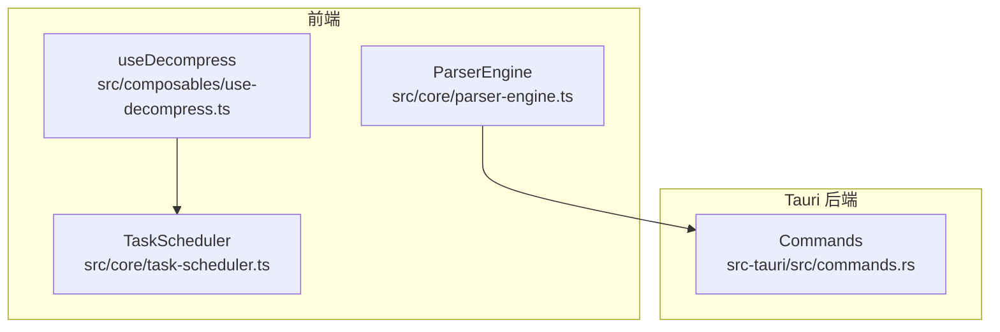
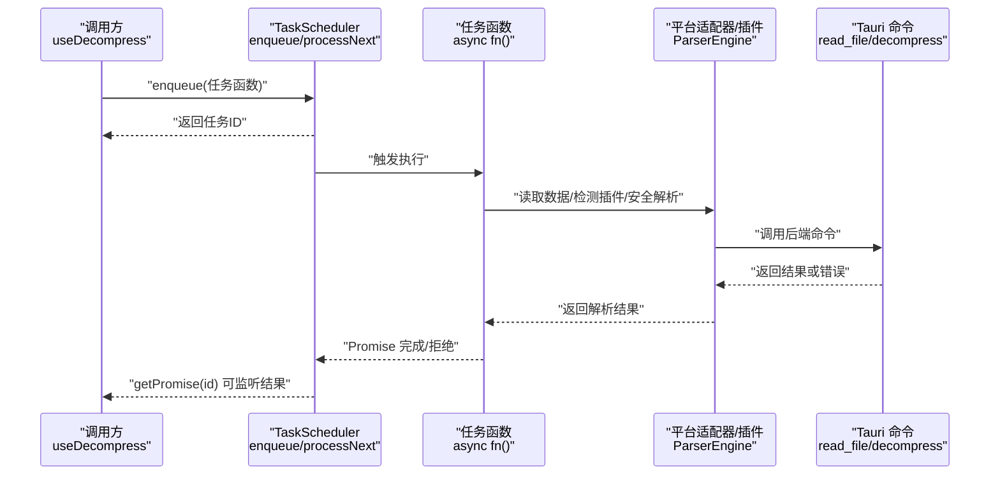
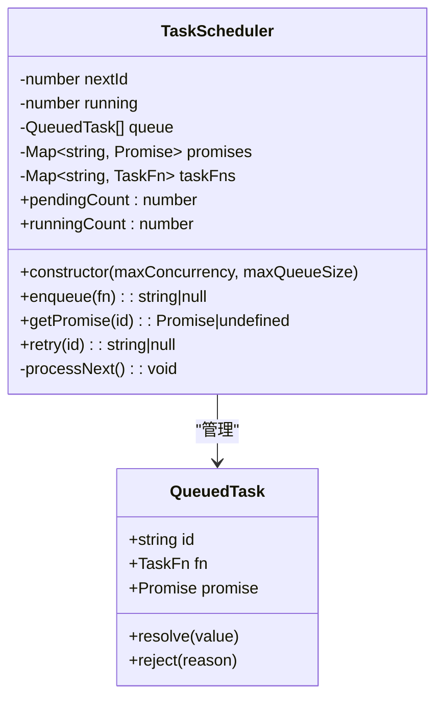
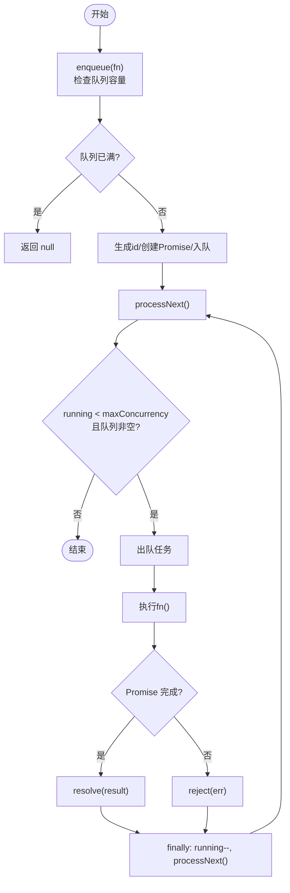
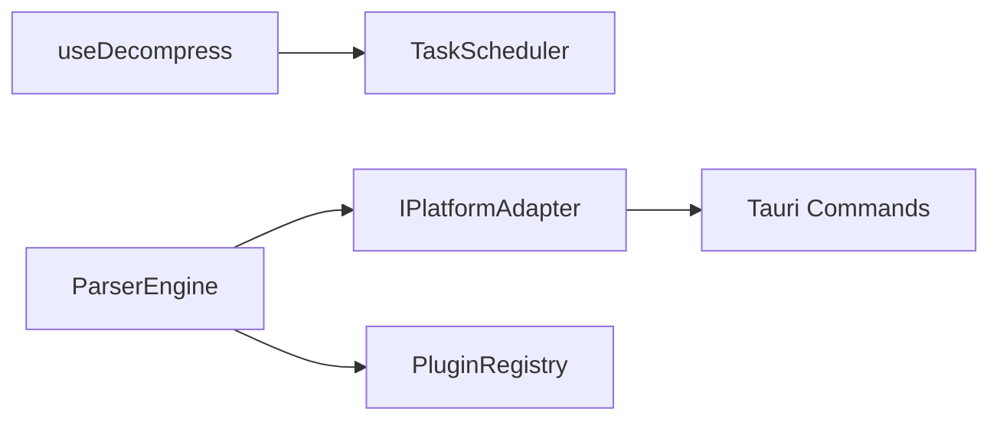

# 任务调度器

<cite>
**本文引用的文件**   
- [src/core/task-scheduler.ts](file://src/core/task-scheduler.ts)
- [src/__tests__/core/task-scheduler.test.ts](file://src/__tests__/core/task-scheduler.test.ts)
- [src/composables/use-decompress.ts](file://src/composables/use-decompress.ts)
- [src/core/parser-engine.ts](file://src/core/parser-engine.ts)
- [src-tauri/src/commands.rs](file://src-tauri/src/commands.rs)
</cite>

## 目录
1. [简介](#简介)
2. [项目结构](#项目结构)
3. [核心组件](#核心组件)
4. [架构总览](#架构总览)
5. [详细组件分析](#详细组件分析)
6. [依赖关系分析](#依赖关系分析)
7. [性能与内存优化](#性能与内存优化)
8. [监控、日志与可观测性](#监控日志与可观测性)
9. [故障排查指南](#故障排查指南)
10. [结论](#结论)
11. [附录：使用示例与最佳实践](#附录使用示例与最佳实践)

## 简介
本技术文档聚焦于 Hello-Tauri 中的任务调度器，围绕并发控制、队列管理、资源限制、任务状态跟踪、生命周期（创建、提交、执行、完成）、错误重试与超时控制等主题进行深入解析。同时结合现有代码与测试用例，给出面向实际使用的最佳实践建议，帮助读者在 Tauri 应用前端中高效、稳定地组织异步任务。

## 项目结构
任务调度器位于前端 TypeScript 层，作为通用并发控制基础设施被上层业务模块复用。当前仓库中与任务调度相关的核心位置如下：
- 调度器实现：src/core/task-scheduler.ts
- 单元测试：src/__tests__/core/task-scheduler.test.ts
- 典型使用场景（解压流程）：src/composables/use-decompress.ts
- 解析引擎（与调度器配合的 I/O 与插件调用）：src/core/parser-engine.ts
- Tauri 后端命令（底层文件读取等能力）：src-tauri/src/commands.rs

图表来源
- [src/core/task-scheduler.ts:11-78](file://src/core/task-scheduler.ts#L11-L78)
- [src/composables/use-decompress.ts:1-74](file://src/composables/use-decompress.ts#L1-L74)
- [src/core/parser-engine.ts:1-35](file://src/core/parser-engine.ts#L1-L35)
- [src-tauri/src/commands.rs:1-53](file://src-tauri/src/commands.rs#L1-L53)

章节来源
- [src/core/task-scheduler.ts:11-78](file://src/core/task-scheduler.ts#L11-L78)
- [src/composables/use-decompress.ts:1-74](file://src/composables/use-decompress.ts#L1-L74)
- [src/core/parser-engine.ts:1-35](file://src/core/parser-engine.ts#L1-L35)
- [src-tauri/src/commands.rs:1-53](file://src-tauri/src/commands.rs#L1-L53)

## 核心组件
- TaskScheduler：提供基于 Promise 的任务队列与并发控制，支持最大并发数、最大队列长度、任务重试、运行计数与待处理计数等能力。
- useDecompress：将任务调度器集成到解压流程中，演示任务的创建、提交、状态更新与失败处理。
- ParserEngine：封装文件解析流程，通过平台适配器与插件注册表进行安全解析，可作为任务体的一部分由调度器驱动。
- Tauri Commands：提供底层文件读写、临时目录获取、mmap 读取、列表枚举与解压等命令，供前端调用。

章节来源
- [src/core/task-scheduler.ts:11-78](file://src/core/task-scheduler.ts#L11-L78)
- [src/composables/use-decompress.ts:1-74](file://src/composables/use-decompress.ts#L1-L74)
- [src/core/parser-engine.ts:1-35](file://src/core/parser-engine.ts#L1-L35)
- [src-tauri/src/commands.rs:1-53](file://src-tauri/src/commands.rs#L1-L53)

## 架构总览
下图展示了任务从创建到执行的端到端流程，以及调度器如何与上层业务和后端命令协作。

图表来源
- [src/composables/use-decompress.ts:14-62](file://src/composables/use-decompress.ts#L14-L62)
- [src/core/task-scheduler.ts:23-77](file://src/core/task-scheduler.ts#L23-L77)
- [src/core/parser-engine.ts:11-33](file://src/core/parser-engine.ts#L11-L33)
- [src-tauri/src/commands.rs:5-14](file://src-tauri/src/commands.rs#L5-L14)

## 详细组件分析

### TaskScheduler 类设计
- 并发控制：通过 running 计数器与 maxConcurrency 限制同时运行的任务数量。
- 队列管理：内部维护一个 FIFO 队列，受 maxQueueSize 限制；当队列满时 enqueue 返回 null。
- 任务标识与追踪：为每个任务生成唯一 id，并维护 promises 与 taskFns 两个 Map，分别用于查询任务 Promise 与重试。
- 执行循环：processNext 在满足条件时不断从队列取出任务执行，并在 finally 中递减 running 以继续消费队列。
- 重试机制：retry 根据 id 找回原始函数并重新入队，删除旧 promise 与函数引用，避免重复引用导致泄漏。
- 监控指标：pendingCount 与 runningCount 暴露当前排队与运行中的任务数量。

图表来源
- [src/core/task-scheduler.ts:11-78](file://src/core/task-scheduler.ts#L11-L78)

章节来源
- [src/core/task-scheduler.ts:11-78](file://src/core/task-scheduler.ts#L11-L78)

### 任务生命周期与关键流程
- 创建：调用方构造 async 任务函数，传入参数（闭包捕获）。
- 提交：调用 enqueue 入队，分配 id，记录 promise 与函数引用，尝试 processNext。
- 执行：processNext 在并发配额内取出任务执行，成功则 resolve，失败则 reject。
- 完成：finally 中递减 running 并继续消费队列；外部可通过 getPromise(id) 监听结果。
- 重试：若任务失败，调用 retry(id) 重新入队执行。

图表来源
- [src/core/task-scheduler.ts:23-77](file://src/core/task-scheduler.ts#L23-L77)

章节来源
- [src/core/task-scheduler.ts:23-77](file://src/core/task-scheduler.ts#L23-L77)

### 并发控制与资源限制
- 并发上限：maxConcurrency 控制同时运行的任务数，确保 CPU/IO 压力可控。
- 队列上限：maxQueueSize 防止内存无限增长，超出时 enqueue 直接返回 null，调用方可据此降级或提示用户。
- 运行计数：runningCount 可用于 UI 展示或告警。
- 待处理计数：pendingCount 可用于背压策略或动态调整并发。

章节来源
- [src/core/task-scheduler.ts:18-21](file://src/core/task-scheduler.ts#L18-L21)
- [src/core/task-scheduler.ts:51-57](file://src/core/task-scheduler.ts#L51-L57)

### 优先级调度
当前实现采用先进先出（FIFO）策略，未内置优先级字段与排序逻辑。如需引入优先级，可在 QueuedTask 增加 priority 字段，并在 enqueue 时按优先级插入或使用优先队列数据结构，同时在 processNext 中按优先级取任务。

[本节为概念性扩展说明，不直接分析具体文件]

### 任务状态跟踪
- 外部状态：调用方可通过 pendingCount 与 runningCount 观察调度器负载。
- 任务级状态：当前实现未提供“已完成/失败”等显式状态枚举，但可通过 getPromise(id) 的 settle 行为推断。
- 业务状态：useDecompress 中通过 updateStatus 将任务进度与状态同步到 UI 层，形成更丰富的状态视图。

章节来源
- [src/core/task-scheduler.ts:51-57](file://src/core/task-scheduler.ts#L51-L57)
- [src/composables/use-decompress.ts:14-62](file://src/composables/use-decompress.ts#L14-L62)

### 错误重试机制
- 基础重试：retry(id) 会查找原函数并重新入队，适合幂等或可恢复的错误场景。
- 组合重试：可在调用方对 getPromise(id) 的拒绝分支进行指数退避或最大重试次数控制。
- 注意：重试前需确保任务函数无副作用或已做幂等保护。

章节来源
- [src/core/task-scheduler.ts:43-49](file://src/core/task-scheduler.ts#L43-L49)
- [src/__tests__/core/task-scheduler.test.ts:31-46](file://src/__tests__/core/task-scheduler.test.ts#L31-L46)

### 超时控制
当前实现未内置超时控制。建议在任务函数外层包裹超时 Promise，或在调用方统一包装，例如：
- 使用 Promise.race 将任务与超时 Promise 竞争，超时后 reject。
- 在 finally 中清理资源与状态。

[本节为概念性扩展说明，不直接分析具体文件]

### 取消任务执行
当前实现未提供取消语义。如需支持取消，可在 QueuedTask 增加 cancel 标志，或在任务函数中接收 AbortSignal，并在 processNext 执行前检查是否已取消。

[本节为概念性扩展说明，不直接分析具体文件]

### 线程池管理与内存使用优化
- 单进程事件循环：当前调度器运行在主线程事件循环上，并非多线程线程池。它通过 Promise 与微任务调度实现并发控制。
- 内存优化要点：
  - 及时清理：任务完成后自动从 promises 与 taskFns 中删除引用，避免内存泄漏。
  - 队列上限：maxQueueSize 防止积压导致的内存膨胀。
  - 任务粒度：尽量保持任务函数轻量，避免在任务体内持有大对象引用。
  - 批量处理：对于大量小任务，考虑批处理以减少上下文切换开销。

章节来源
- [src/core/task-scheduler.ts:23-77](file://src/core/task-scheduler.ts#L23-L77)

## 依赖关系分析
- useDecompress 依赖 TaskScheduler 控制解压任务的并发与排队。
- ParserEngine 依赖平台适配器与插件注册表，负责安全解析，可作为任务体的一部分。
- Tauri Commands 提供底层 I/O 能力，被 ParserEngine 间接调用。

图表来源
- [src/composables/use-decompress.ts:1-74](file://src/composables/use-decompress.ts#L1-L74)
- [src/core/parser-engine.ts:1-35](file://src/core/parser-engine.ts#L1-L35)
- [src-tauri/src/commands.rs:1-53](file://src-tauri/src/commands.rs#L1-L53)

章节来源
- [src/composables/use-decompress.ts:1-74](file://src/composables/use-decompress.ts#L1-L74)
- [src/core/parser-engine.ts:1-35](file://src/core/parser-engine.ts#L1-L35)
- [src-tauri/src/commands.rs:1-53](file://src-tauri/src/commands.rs#L1-L53)

## 性能与内存优化
- 合理设置并发与队列上限：根据设备 CPU 核数与 IO 特性调优 maxConcurrency 与 maxQueueSize。
- 任务拆分与合并：将大任务拆分为多个小任务，利用调度器并行；或将多个小任务合并为批次减少调度开销。
- 避免长尾任务：对耗时任务设置超时与降级策略，避免阻塞后续任务。
- 资源释放：在任务 finally 中释放临时对象、关闭句柄、清空缓存引用。
- 监控与自适应：依据 pendingCount 与 runningCount 动态调整并发，实现自适应背压。

[本节为通用指导，不直接分析具体文件]

## 监控、日志与可观测性
- 指标采集：定期采样 pendingCount 与 runningCount，绘制趋势图。
- 任务级日志：在任务函数入口与出口打印耗时、输入摘要与异常堆栈（脱敏）。
- 错误分类：区分可重试与不可重试错误，统计失败率与重试成功率。
- 告警阈值：当 pendingCount 超过阈值或运行时间过长时触发告警。

[本节为通用指导，不直接分析具体文件]

## 故障排查指南
- 任务无法执行：
  - 检查队列是否已满（enqueue 返回 null），必要时增大 maxQueueSize 或降低提交速率。
  - 确认 processNext 是否被正确触发（enqueue 末尾会调用）。
- 并发超限：
  - 验证 maxConcurrency 配置与实际运行计数一致。
- 任务失败：
  - 使用 getPromise(id) 捕获拒绝原因，定位错误来源。
  - 对可恢复错误使用 retry(id) 重试，并结合退避策略。
- 内存占用过高：
  - 检查是否存在长时间持有的大对象引用。
  - 确认任务完成后已从 promises 与 taskFns 中清理。

章节来源
- [src/core/task-scheduler.ts:23-77](file://src/core/task-scheduler.ts#L23-L77)
- [src/__tests__/core/task-scheduler.test.ts:48-55](file://src/__tests__/core/task-scheduler.test.ts#L48-L55)

## 结论
TaskScheduler 提供了简洁而实用的并发控制与队列管理能力，适用于前端异步任务编排。其设计强调简单可靠：通过 Promise 与事件循环实现并发限制，通过 Map 与队列实现任务追踪与重试。结合 useDecompress 的实际用法，可以看到其在真实业务中的价值。针对优先级、超时与取消等高级需求，可在现有基础上进行扩展，以满足更复杂的场景。

[本节为总结性内容，不直接分析具体文件]

## 附录：使用示例与最佳实践

### 基本用法（参考测试）
- 创建调度器实例并设置并发上限。
- 使用 enqueue 提交任务，返回任务 ID。
- 使用 getPromise(id) 监听任务结果。
- 使用 retry(id) 对失败任务进行重试。

章节来源
- [src/__tests__/core/task-scheduler.test.ts:9-29](file://src/__tests__/core/task-scheduler.test.ts#L9-L29)
- [src/__tests__/core/task-scheduler.test.ts:31-46](file://src/__tests__/core/task-scheduler.test.ts#L31-L46)

### 在解压流程中使用（参考 useDecompress）
- 启动解压任务时更新状态为运行中。
- 将解压逻辑封装为 async 任务函数并提交到调度器。
- 在任务内部分阶段更新进度与最终状态。
- 捕获异常并更新失败状态。

章节来源
- [src/composables/use-decompress.ts:14-62](file://src/composables/use-decompress.ts#L14-L62)

### 与解析引擎协作（参考 ParserEngine）
- 在任务函数中调用 ParserEngine 进行文件解析。
- 通过平台适配器与 Tauri 命令完成底层 I/O。
- 将解析结果回传给上层状态管理。

章节来源
- [src/core/parser-engine.ts:11-33](file://src/core/parser-engine.ts#L11-L33)
- [src-tauri/src/commands.rs:5-14](file://src-tauri/src/commands.rs#L5-L14)

### 扩展建议
- 优先级调度：在 QueuedTask 增加 priority 字段，并使用优先队列或排序策略。
- 超时控制：在任务函数外层包裹超时 Promise，统一处理超时拒绝。
- 取消支持：引入 AbortController/AbortSignal，在 processNext 执行前检查取消标志。
- 监控增强：增加任务级指标（开始时间、结束时间、错误类型分布）与可视化面板。

[本节为概念性扩展说明，不直接分析具体文件]