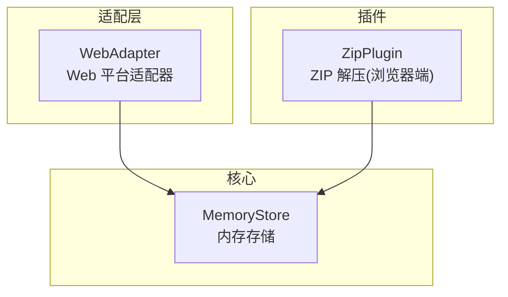
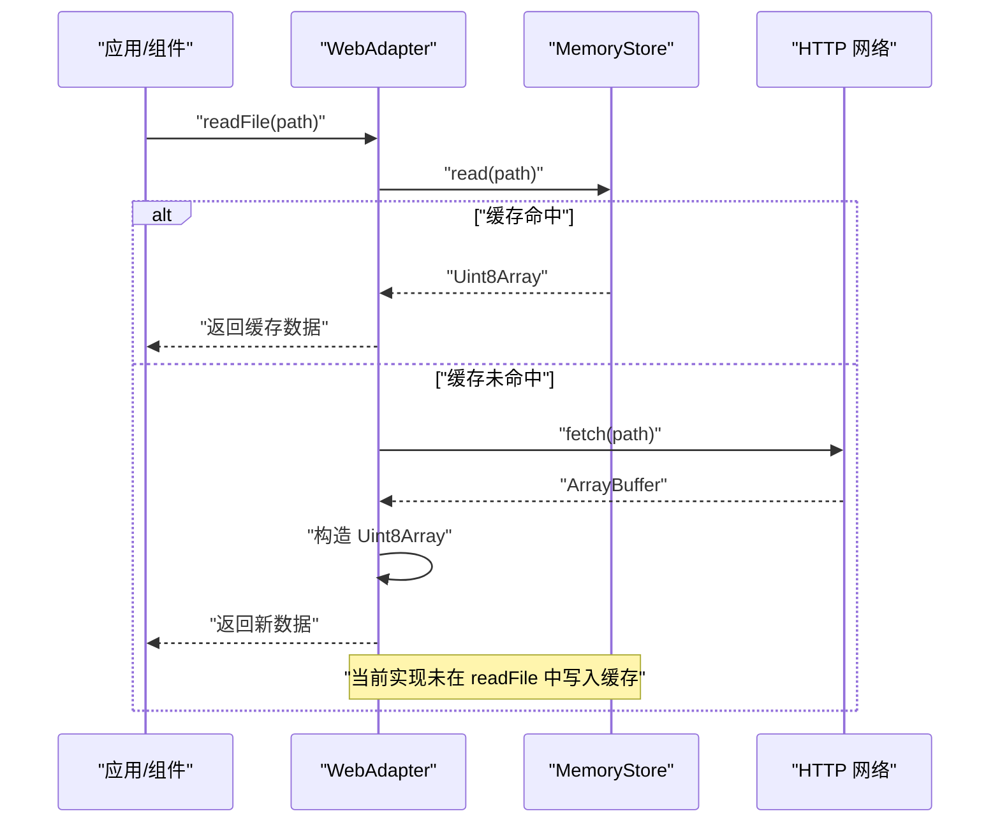
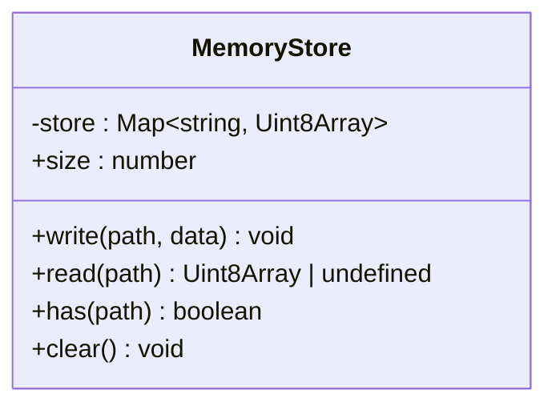
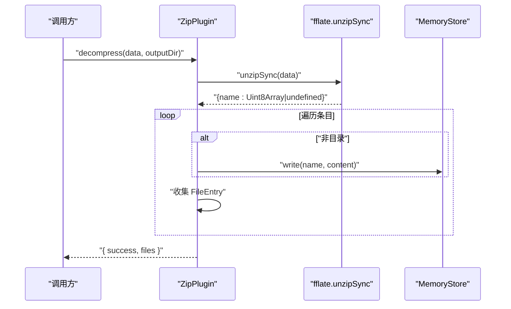
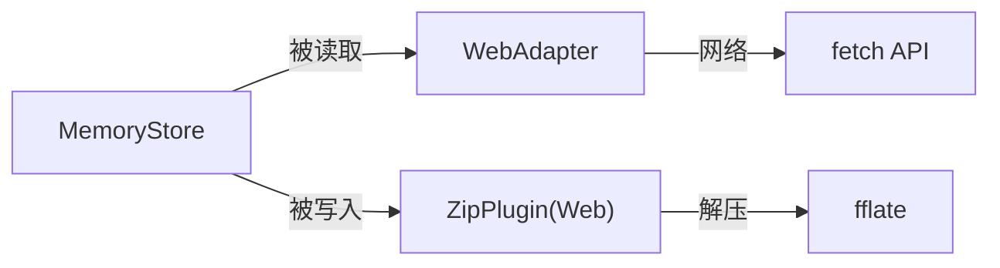

# 内存存储

<cite>
**本文引用的文件**
- [src/core/memory-store.ts](file://src/core/memory-store.ts)
- [src/adapters/web-adapter.ts](file://src/adapters/web-adapter.ts)
- [src/plugins/compression/zip-plugin.ts](file://src/plugins/compression/zip-plugin.ts)
</cite>

## 目录
1. [简介](#简介)
2. [项目结构](#项目结构)
3. [核心组件](#核心组件)
4. [架构总览](#架构总览)
5. [详细组件分析](#详细组件分析)
6. [依赖关系分析](#依赖关系分析)
7. [性能与内存管理](#性能与内存管理)
8. [并发与线程安全](#并发与线程安全)
9. [故障排查指南](#故障排查指南)
10. [结论](#结论)
11. [附录：接口与使用示例路径](#附录接口与使用示例路径)

## 简介
本技术文档聚焦于 Hello-Tauri 中的“内存存储”能力，围绕其设计模式、实现原理、数据缓存策略、内存管理机制、数据持久化与同步策略、接口定义（增删改查、批量处理、事务支持、一致性保证）、具体使用示例、内存监控与优化、以及多线程环境下的安全性与并发访问控制进行系统化说明。该内存存储以轻量 Map 为底层容器，提供键值对形式的二进制数据读写，并在 Web 平台适配层中作为读取缓存与流式读取的中间层，在 ZIP 解压流程中用于将解压产物写入内存以便后续渲染或预览。

## 项目结构
与内存存储直接相关的代码位于以下位置：
- 核心实现：src/core/memory-store.ts
- Web 平台适配层：src/adapters/web-adapter.ts
- ZIP 压缩插件（Web 端）：src/plugins/compression/zip-plugin.ts

图表来源
- [src/core/memory-store.ts:1-26](file://src/core/memory-store.ts#L1-L26)
- [src/adapters/web-adapter.ts:1-73](file://src/adapters/web-adapter.ts#L1-L73)
- [src/plugins/compression/zip-plugin.ts:1-40](file://src/plugins/compression/zip-plugin.ts#L1-L40)

章节来源
- [src/core/memory-store.ts:1-26](file://src/core/memory-store.ts#L1-L26)
- [src/adapters/web-adapter.ts:1-73](file://src/adapters/web-adapter.ts#L1-L73)
- [src/plugins/compression/zip-plugin.ts:1-40](file://src/plugins/compression/zip-plugin.ts#L1-L40)

## 核心组件
- MemoryStore：基于 Map<string, Uint8Array> 的键值型内存存储，提供写、读、存在性检查、清空与容量查询等基础操作。
- WebAdapter：在 Web 环境下通过 fetch 获取资源，并优先从 MemoryStore 命中缓存；mmapRead 与 streamRead 同样遵循“先缓存后网络”的策略。
- ZipPlugin（Web 端）：使用 fflate 解包 zip，并将每个非目录条目写入 MemoryStore，同时返回文件清单供上层 UI 展示。

章节来源
- [src/core/memory-store.ts:1-26](file://src/core/memory-store.ts#L1-L26)
- [src/adapters/web-adapter.ts:1-73](file://src/adapters/web-adapter.ts#L1-L73)
- [src/plugins/compression/zip-plugin.ts:1-40](file://src/plugins/compression/zip-plugin.ts#L1-L40)

## 架构总览
下图展示了 Web 环境下一次典型的数据读取流程：应用调用 WebAdapter，适配器先尝试从 MemoryStore 读取缓存；若未命中则发起网络请求，并将结果回写到 MemoryStore，以便后续快速命中。

图表来源
- [src/adapters/web-adapter.ts:6-13](file://src/adapters/web-adapter.ts#L6-L13)
- [src/core/memory-store.ts:8-10](file://src/core/memory-store.ts#L8-L10)

章节来源
- [src/adapters/web-adapter.ts:6-13](file://src/adapters/web-adapter.ts#L6-L13)
- [src/core/memory-store.ts:8-10](file://src/core/memory-store.ts#L8-L10)

## 详细组件分析

### MemoryStore 类分析
- 数据结构：内部使用 Map<string, Uint8Array> 维护键到二进制数据的映射。
- 时间复杂度：
  - write/read/has：平均 O(1)
  - clear：O(n)，n 为条目数
  - size：O(1)
- 空间复杂度：与已写入数据总量线性相关。
- 错误处理：无显式异常抛出，未命中时 read 返回 undefined。
- 扩展点：可在此基础上增加 TTL、LRU、大小上限、事件通知等机制。

图表来源
- [src/core/memory-store.ts:1-23](file://src/core/memory-store.ts#L1-L23)

章节来源
- [src/core/memory-store.ts:1-23](file://src/core/memory-store.ts#L1-L23)

### WebAdapter 与 MemoryStore 的协作
- 读取流程：
  - readFile：先查缓存，未命中则 fetch 并返回数据（当前实现未自动写回缓存）。
  - mmapRead：先查缓存，命中则切片返回；未命中则按 Range 头请求字节范围。
  - streamRead：先查缓存，命中则直接以 ReadableStream 形式输出；未命中则逐块读取并推送。
- 缓存策略：
  - 读前缓存命中优先，减少重复网络开销。
  - 写路径由其他模块（如 ZIP 解压）显式调用 write 写入。

图表来源
- [src/adapters/web-adapter.ts:6-13](file://src/adapters/web-adapter.ts#L6-L13)
- [src/adapters/web-adapter.ts:31-40](file://src/adapters/web-adapter.ts#L31-L40)
- [src/adapters/web-adapter.ts:42-69](file://src/adapters/web-adapter.ts#L42-L69)
- [src/core/memory-store.ts:8-10](file://src/core/memory-store.ts#L8-L10)

章节来源
- [src/adapters/web-adapter.ts:6-13](file://src/adapters/web-adapter.ts#L6-L13)
- [src/adapters/web-adapter.ts:31-40](file://src/adapters/web-adapter.ts#L31-L40)
- [src/adapters/web-adapter.ts:42-69](file://src/adapters/web-adapter.ts#L42-L69)
- [src/core/memory-store.ts:8-10](file://src/core/memory-store.ts#L8-L10)

### ZIP 解压与内存写入
- 在 Web 模式下，ZipPlugin 使用 fflate 解包 zip，遍历条目：
  - 跳过目录项
  - 将文件内容写入 memoryStore.write(name, content)
  - 构建 FileEntry 列表返回给上层
- 该流程体现了“解压即入存”的缓存策略，便于后续快速读取与渲染。

图表来源
- [src/plugins/compression/zip-plugin.ts:10-37](file://src/plugins/compression/zip-plugin.ts#L10-L37)
- [src/core/memory-store.ts:4-6](file://src/core/memory-store.ts#L4-L6)

章节来源
- [src/plugins/compression/zip-plugin.ts:10-37](file://src/plugins/compression/zip-plugin.ts#L10-L37)
- [src/core/memory-store.ts:4-6](file://src/core/memory-store.ts#L4-L6)

## 依赖关系分析
- 耦合关系：
  - WebAdapter 依赖 MemoryStore 做读缓存。
  - ZipPlugin（Web 端）依赖 MemoryStore 写入解压产物。
- 外部依赖：
  - WebAdapter 使用 fetch 进行网络 I/O。
  - ZipPlugin 在 Web 端使用 fflate 进行解压。

图表来源
- [src/adapters/web-adapter.ts:1-73](file://src/adapters/web-adapter.ts#L1-L73)
- [src/plugins/compression/zip-plugin.ts:1-40](file://src/plugins/compression/zip-plugin.ts#L1-L40)
- [src/core/memory-store.ts:1-26](file://src/core/memory-store.ts#L1-L26)

章节来源
- [src/adapters/web-adapter.ts:1-73](file://src/adapters/web-adapter.ts#L1-L73)
- [src/plugins/compression/zip-plugin.ts:1-40](file://src/plugins/compression/zip-plugin.ts#L1-L40)
- [src/core/memory-store.ts:1-26](file://src/core/memory-store.ts#L1-L26)

## 性能与内存管理
- 缓存命中率优化
  - 建议在读路径（readFile）中增加“写回缓存”逻辑，使首次拉取的数据在后续读取中命中，降低网络开销。
- 内存占用控制
  - 引入容量上限与淘汰策略（如 LRU/LFU），避免无限增长导致页面卡顿或崩溃。
  - 针对大文件采用分片/流式处理，避免一次性加载整个文件。
- 序列化与拷贝成本
  - 尽量复用 Uint8Array 引用，避免不必要的拷贝；必要时使用 ArrayBuffer 视图共享内存。
- 监控指标
  - 暴露 size 与估算内存占用（entries 数量 × 平均大小），结合浏览器 Performance API 进行采样。
- 清理策略
  - 提供 clear 方法用于会话级清理；可扩展按路径前缀或时间戳清理。

[本节为通用指导，不直接分析具体文件]

## 并发与线程安全
- 单线程模型
  - 浏览器主线程与 Worker 均运行在单事件循环模型下，Map 的 set/get/has/clear 在同一线程内是原子的，不存在竞态条件。
- 跨线程场景
  - 若通过 Web Worker 访问同一内存存储实例，需确保传递的是引用且仍在同一进程上下文；跨进程隔离不适用此内存存储。
- 异步安全
  - 所有方法均为同步操作，但调用方可能处于异步上下文中；由于 JS 单线程特性，无需额外加锁。

[本节为通用指导，不直接分析具体文件]

## 故障排查指南
- 常见问题
  - 读取不到数据：确认是否已通过 write 写入对应 path；或在 WebAdapter 中启用“读后写回缓存”。
  - 内存持续增长：检查是否存在只写不清理的场景；适时调用 clear 或实现淘汰策略。
  - 大文件导致卡顿：改用流式读取（streamRead/mmapRead）并结合分页/分块处理。
- 定位步骤
  - 打印 size 与 key 集合，验证缓存状态。
  - 在 WebAdapter 的读取路径添加日志，观察命中情况。
  - 在 ZIP 解压完成后，校验 memoryStore 中是否存在预期条目。

章节来源
- [src/core/memory-store.ts:16-22](file://src/core/memory-store.ts#L16-L22)
- [src/adapters/web-adapter.ts:6-13](file://src/adapters/web-adapter.ts#L6-L13)
- [src/plugins/compression/zip-plugin.ts:20-33](file://src/plugins/compression/zip-plugin.ts#L20-L33)

## 结论
Hello-Tauri 的内存存储以极简设计提供了高效的键值型二进制数据缓存能力，配合 Web 适配层与 ZIP 解压插件形成“解压即入存、读取优先命中”的闭环。当前实现未包含自动写回缓存、容量限制与淘汰策略，建议在后续迭代中补充这些能力以提升稳定性与性能。对于大规模数据场景，应结合流式处理与分片策略，避免一次性加载导致的内存峰值。

[本节为总结性内容，不直接分析具体文件]

## 附录：接口与使用示例路径
- 接口定义与实现
  - MemoryStore 类与方法：[src/core/memory-store.ts:1-23](file://src/core/memory-store.ts#L1-L23)
  - 全局实例导出：[src/core/memory-store.ts:25-26](file://src/core/memory-store.ts#L25-L26)
- 使用示例路径
  - Web 端读取（含缓存命中）：[src/adapters/web-adapter.ts:6-13](file://src/adapters/web-adapter.ts#L6-L13)
  - 字节范围读取（Range）：[src/adapters/web-adapter.ts:31-40](file://src/adapters/web-adapter.ts#L31-L40)
  - 流式读取（ReadableStream）：[src/adapters/web-adapter.ts:42-69](file://src/adapters/web-adapter.ts#L42-L69)
  - ZIP 解压写入内存：[src/plugins/compression/zip-plugin.ts:18-26](file://src/plugins/compression/zip-plugin.ts#L18-L26)

章节来源
- [src/core/memory-store.ts:1-26](file://src/core/memory-store.ts#L1-L26)
- [src/adapters/web-adapter.ts:6-13](file://src/adapters/web-adapter.ts#L6-L13)
- [src/adapters/web-adapter.ts:31-40](file://src/adapters/web-adapter.ts#L31-L40)
- [src/adapters/web-adapter.ts:42-69](file://src/adapters/web-adapter.ts#L42-L69)
- [src/plugins/compression/zip-plugin.ts:18-26](file://src/plugins/compression/zip-plugin.ts#L18-L26)