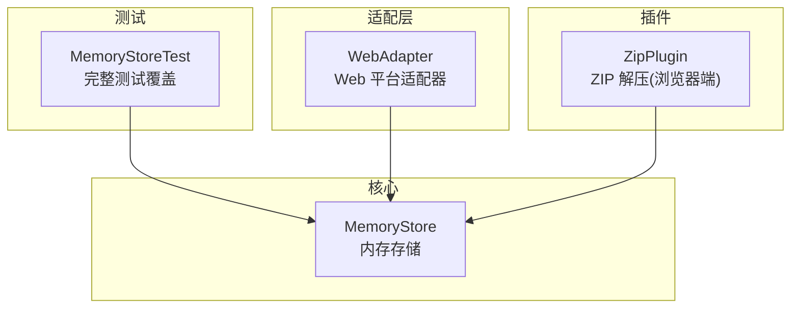
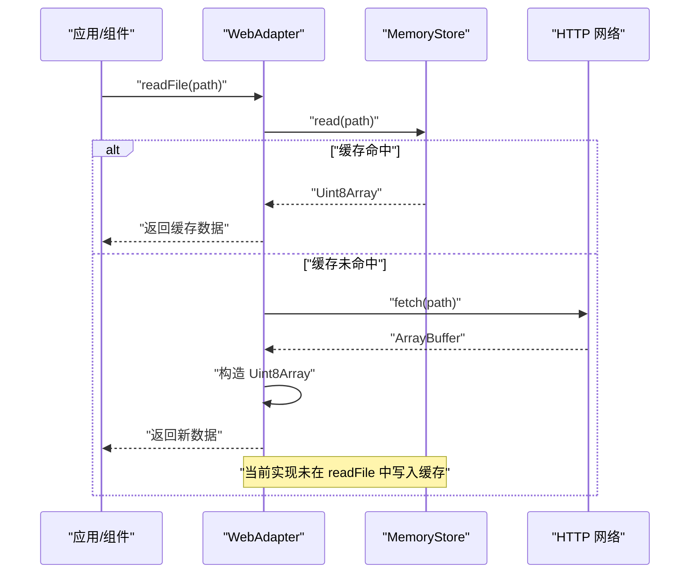
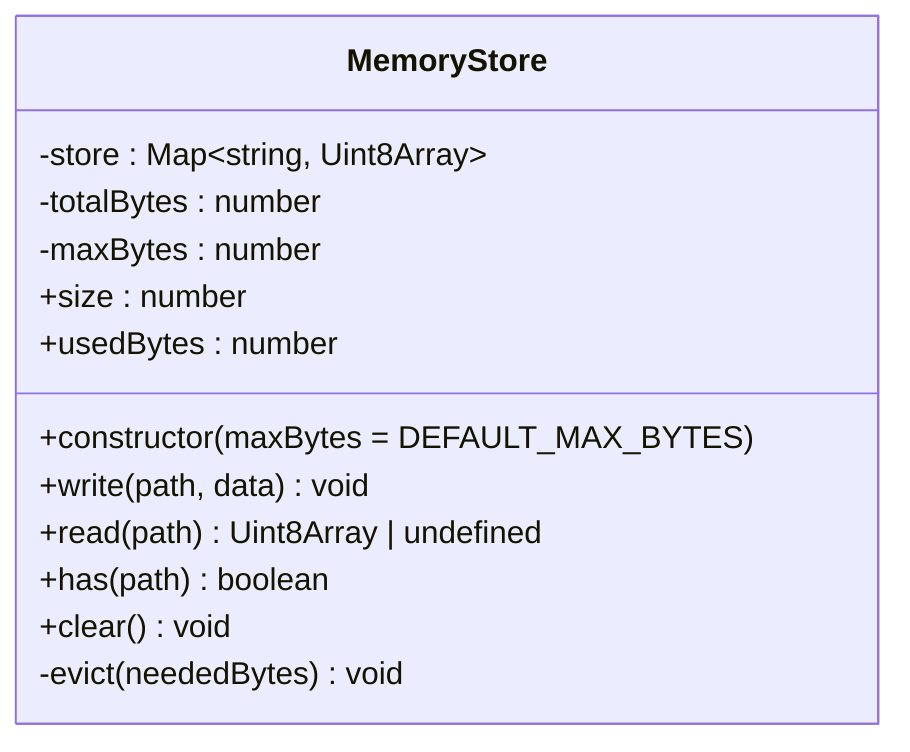
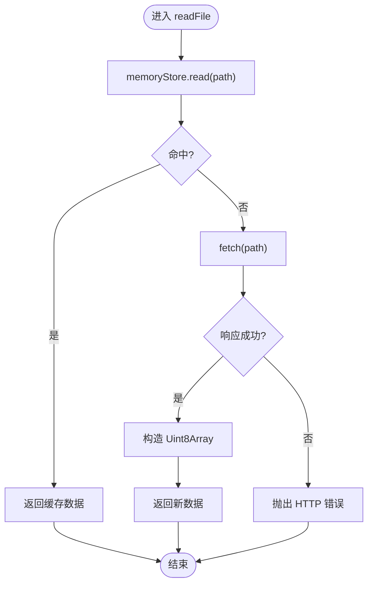
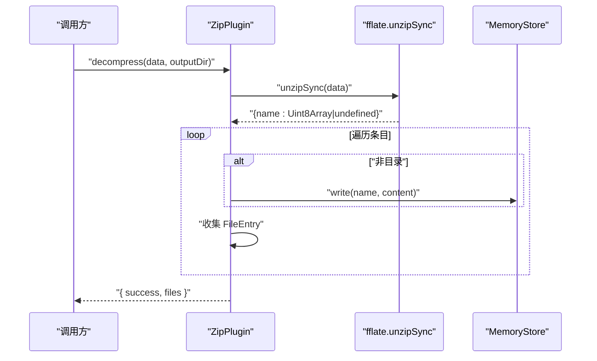
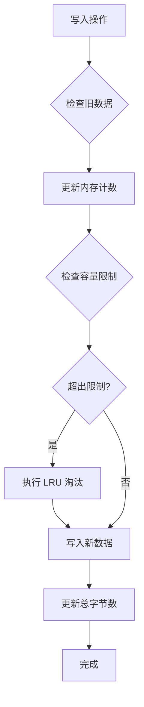
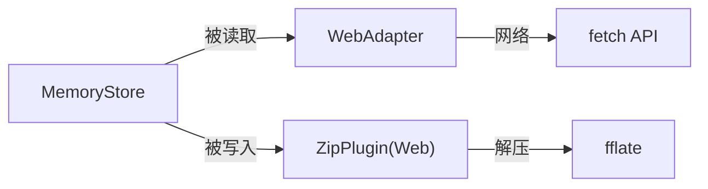

# 内存存储

<cite>
**本文引用的文件**
- [src/core/memory-store.ts](file://src/core/memory-store.ts)
- [src/__tests__/core/memory-store.test.ts](file://src/__tests__/core/memory-store.test.ts)
- [src/adapters/web-adapter.ts](file://src/adapters/web-adapter.ts)
- [src/plugins/compression/zip-plugin.ts](file://src/plugins/compression/zip-plugin.ts)
</cite>

## 更新摘要
**变更内容**
- 新增 MemoryStore 类的完整测试覆盖，包含 LRU 淘汰策略、容量限制、覆盖行为和内存使用跟踪等核心功能验证
- 更新了 MemoryStore 类的实现细节，增加了容量管理和自动淘汰机制
- 增强了内存监控和性能优化相关的说明
- 补充了详细的测试用例和使用示例

## 目录
1. [简介](#简介)
2. [项目结构](#项目结构)
3. [核心组件](#核心组件)
4. [架构总览](#架构总览)
5. [详细组件分析](#详细组件分析)
6. [测试覆盖与质量保证](#测试覆盖与质量保证)
7. [依赖关系分析](#依赖关系分析)
8. [性能与内存管理](#性能与内存管理)
9. [并发与线程安全](#并发与线程安全)
10. [故障排查指南](#故障排查指南)
11. [结论](#结论)
12. [附录：接口与使用示例路径](#附录接口与使用示例路径)

## 简介
本技术文档聚焦于 Hello-Tauri 中的"内存存储"能力，围绕其设计模式、实现原理、数据缓存策略、内存管理机制、数据持久化与同步策略、接口定义（增删改查、批量处理、事务支持、一致性保证）、具体使用示例、内存监控与优化、以及多线程环境下的安全性与并发访问控制进行系统化说明。该内存存储以轻量 Map 为底层容器，提供键值对形式的二进制数据读写，具备容量限制和 LRU 淘汰策略，并在 Web 平台适配层中作为读取缓存与流式读取的中间层，在 ZIP 解压流程中用于将解压产物写入内存以便后续渲染或预览。

## 项目结构
与内存存储直接相关的代码位于以下位置：
- 核心实现：src/core/memory-store.ts
- 完整测试覆盖：src/__tests__/core/memory-store.test.ts
- Web 平台适配层：src/adapters/web-adapter.ts
- ZIP 压缩插件（Web 端）：src/plugins/compression/zip-plugin.ts



**图表来源**
- [src/core/memory-store.ts:1-62](file://src/core/memory-store.ts#L1-L62)
- [src/__tests__/core/memory-store.test.ts:1-89](file://src/__tests__/core/memory-store.test.ts#L1-L89)
- [src/adapters/web-adapter.ts:1-73](file://src/adapters/web-adapter.ts#L1-L73)
- [src/plugins/compression/zip-plugin.ts:1-40](file://src/plugins/compression/zip-plugin.ts#L1-L40)

**章节来源**
- [src/core/memory-store.ts:1-62](file://src/core/memory-store.ts#L1-L62)
- [src/__tests__/core/memory-store.test.ts:1-89](file://src/__tests__/core/memory-store.test.ts#L1-L89)
- [src/adapters/web-adapter.ts:1-73](file://src/adapters/web-adapter.ts#L1-L73)
- [src/plugins/compression/zip-plugin.ts:1-40](file://src/plugins/compression/zip-plugin.ts#L1-L40)

## 核心组件
- **MemoryStore**：基于 Map<string, Uint8Array> 的键值型内存存储，提供写、读、存在性检查、清空与容量查询等基础操作，内置容量限制和 LRU 淘汰策略。
- **WebAdapter**：在 Web 环境下通过 fetch 获取资源，并优先从 MemoryStore 命中缓存；mmapRead 与 streamRead 同样遵循"先缓存后网络"的策略。
- **ZipPlugin（Web 端）**：使用 fflate 解包 zip，并将每个非目录条目写入 MemoryStore，同时返回文件清单供上层 UI 展示。

**章节来源**
- [src/core/memory-store.ts:4-59](file://src/core/memory-store.ts#L4-L59)
- [src/adapters/web-adapter.ts:5-70](file://src/adapters/web-adapter.ts#L5-L70)
- [src/plugins/compression/zip-plugin.ts:4-38](file://src/plugins/compression/zip-plugin.ts#L4-L38)

## 架构总览
下图展示了 Web 环境下一次典型的数据读取流程：应用调用 WebAdapter，适配器先尝试从 MemoryStore 读取缓存；若未命中则发起网络请求，并将结果回写到 MemoryStore，以便后续快速命中。



**图表来源**
- [src/adapters/web-adapter.ts:6-13](file://src/adapters/web-adapter.ts#L6-L13)
- [src/core/memory-store.ts:27-29](file://src/core/memory-store.ts#L27-L29)

**章节来源**
- [src/adapters/web-adapter.ts:6-13](file://src/adapters/web-adapter.ts#L6-L13)
- [src/core/memory-store.ts:27-29](file://src/core/memory-store.ts#L27-L29)

## 详细组件分析

### MemoryStore 类分析
- **数据结构**：内部使用 Map<string, Uint8Array> 维护键到二进制数据的映射，配合 totalBytes 跟踪内存使用情况。
- **时间复杂度**：
  - write/read/has：平均 O(1)
  - clear：O(n)，n 为条目数
  - size：O(1)
  - evict：最坏 O(n)，按插入顺序淘汰旧数据
- **空间复杂度**：与已写入数据总量线性相关，受 maxBytes 限制。
- **错误处理**：无显式异常抛出，未命中时 read 返回 undefined。
- **容量管理**：默认 256MB 上限，支持自定义容量配置。
- **LRU 淘汰策略**：当超出容量限制时，按插入顺序淘汰最早的数据项。



**图表来源**
- [src/core/memory-store.ts:4-59](file://src/core/memory-store.ts#L4-L59)

**章节来源**
- [src/core/memory-store.ts:4-59](file://src/core/memory-store.ts#L4-L59)

### WebAdapter 与 MemoryStore 的协作
- **读取流程**：
  - readFile：先查缓存，未命中则 fetch 并返回数据（当前实现未自动写回缓存）。
  - mmapRead：先查缓存，命中则切片返回；未命中则按 Range 头请求字节范围。
  - streamRead：先查缓存，命中则直接以 ReadableStream 形式输出；未命中则逐块读取并推送。
- **缓存策略**：
  - 读前缓存命中优先，减少重复网络开销。
  - 写路径由其他模块（如 ZIP 解压）显式调用 write 写入。



**图表来源**
- [src/adapters/web-adapter.ts:6-13](file://src/adapters/web-adapter.ts#L6-L13)
- [src/adapters/web-adapter.ts:31-40](file://src/adapters/web-adapter.ts#L31-L40)
- [src/adapters/web-adapter.ts:42-69](file://src/adapters/web-adapter.ts#L42-L69)
- [src/core/memory-store.ts:27-29](file://src/core/memory-store.ts#L27-L29)

**章节来源**
- [src/adapters/web-adapter.ts:6-13](file://src/adapters/web-adapter.ts#L6-L13)
- [src/adapters/web-adapter.ts:31-40](file://src/adapters/web-adapter.ts#L31-L40)
- [src/adapters/web-adapter.ts:42-69](file://src/adapters/web-adapter.ts#L42-L69)
- [src/core/memory-store.ts:27-29](file://src/core/memory-store.ts#L27-L29)

### ZIP 解压与内存写入
- **在 Web 模式下**，ZipPlugin 使用 fflate 解包 zip，遍历条目：
  - 跳过目录项
  - 将文件内容写入 memoryStore.write(name, content)
  - 构建 FileEntry 列表返回给上层
- **该流程体现了**"解压即入存"的缓存策略，便于后续快速读取与渲染。



**图表来源**
- [src/plugins/compression/zip-plugin.ts:10-37](file://src/plugins/compression/zip-plugin.ts#L10-L37)
- [src/core/memory-store.ts:13-25](file://src/core/memory-store.ts#L13-L25)

**章节来源**
- [src/plugins/compression/zip-plugin.ts:10-37](file://src/plugins/compression/zip-plugin.ts#L10-L37)
- [src/core/memory-store.ts:13-25](file://src/core/memory-store.ts#L13-L25)

## 测试覆盖与质量保证

### 核心功能测试
MemoryStore 类拥有完整的测试覆盖，确保所有核心功能的正确性和稳定性：

#### 基础操作测试
- **写入后可读取**：验证基本的 write/read 操作
- **存在性检查**：测试 has 方法的正确性
- **缺失数据处理**：验证 read 对不存在 key 的处理

#### 内存管理测试
- **容量统计**：测试 size 和 usedBytes 属性的准确性
- **覆盖写入**：验证同一路径覆盖时的内存计数更新
- **清理操作**：测试 clear 方法对所有状态的重置

#### LRU 淘汰策略测试
- **容量超限触发**：验证超出容量上限时的自动淘汰
- **多条目淘汰**：测试需要淘汰多个条目才能满足容量需求的情况
- **大文件处理**：验证单条数据超过总容量时的全部淘汰逻辑



**图表来源**
- [src/core/memory-store.ts:13-25](file://src/core/memory-store.ts#L13-L25)
- [src/core/memory-store.ts:49-58](file://src/core/memory-store.ts#L49-L58)

### 测试用例详解

#### 容量限制测试
```typescript
// 测试用例：超出容量上限时触发 LRU 淘汰
it('超出容量上限时触发 LRU 淘汰', () => {
  store.write('/first', new Uint8Array(40))
  store.write('/second', new Uint8Array(40))
  expect(store.size).toBe(2)
  expect(store.usedBytes).toBe(80)

  // 再写入 30 字节将超出 100 上限，应淘汰 /first
  store.write('/third', new Uint8Array(30))
  expect(store.has('/first')).toBe(false)
  expect(store.has('/second')).toBe(true)
  expect(store.has('/third')).toBe(true)
  expect(store.usedBytes).toBe(70)
})
```

#### 内存使用跟踪测试
```typescript
// 测试用例：size 和 usedBytes 反映当前状态
it('size 和 usedBytes 反映当前状态', () => {
  expect(store.size).toBe(0)
  expect(store.usedBytes).toBe(0)
  store.write('/a', new Uint8Array(30))
  store.write('/b', new Uint8Array(20))
  expect(store.size).toBe(2)
  expect(store.usedBytes).toBe(50)
})
```

**章节来源**
- [src/__tests__/core/memory-store.test.ts:54-66](file://src/__tests__/core/memory-store.test.ts#L54-L66)
- [src/__tests__/core/memory-store.test.ts:28-35](file://src/__tests__/core/memory-store.test.ts#L28-L35)

## 依赖关系分析
- **耦合关系**：
  - WebAdapter 依赖 MemoryStore 做读缓存。
  - ZipPlugin（Web 端）依赖 MemoryStore 写入解压产物。
- **外部依赖**：
  - WebAdapter 使用 fetch 进行网络 I/O。
  - ZipPlugin 在 Web 端使用 fflate 进行解压。



**图表来源**
- [src/adapters/web-adapter.ts:1-73](file://src/adapters/web-adapter.ts#L1-L73)
- [src/plugins/compression/zip-plugin.ts:1-40](file://src/plugins/compression/zip-plugin.ts#L1-L40)
- [src/core/memory-store.ts:1-62](file://src/core/memory-store.ts#L1-L62)

**章节来源**
- [src/adapters/web-adapter.ts:1-73](file://src/adapters/web-adapter.ts#L1-L73)
- [src/plugins/compression/zip-plugin.ts:1-40](file://src/plugins/compression/zip-plugin.ts#L1-L40)
- [src/core/memory-store.ts:1-62](file://src/core/memory-store.ts#L1-L62)

## 性能与内存管理

### 容量管理与淘汰策略
- **默认容量限制**：256MB 防止大文件场景内存溢出
- **LRU 淘汰算法**：按插入顺序淘汰最早的数据项
- **精确内存跟踪**：通过 totalBytes 实时跟踪内存使用情况
- **覆盖写入优化**：写入前清理旧数据占用，避免内存泄漏

### 缓存命中率优化
- **读路径优化**：建议在读路径（readFile）中增加"写回缓存"逻辑，使首次拉取的数据在后续读取中命中，降低网络开销。
- **分片处理**：针对大文件采用分片/流式处理，避免一次性加载整个文件。
- **引用复用**：尽量复用 Uint8Array 引用，避免不必要的拷贝。

### 监控指标
- **内存使用跟踪**：暴露 usedBytes 属性实时监控内存占用
- **容量监控**：通过 size 属性跟踪条目数量
- **性能采样**：结合浏览器 Performance API 进行采样分析

### 清理策略
- **手动清理**：提供 clear 方法用于会话级清理
- **自动清理**：基于 LRU 策略的自动淘汰机制
- **扩展清理**：可扩展按路径前缀或时间戳清理

**章节来源**
- [src/core/memory-store.ts:1-11](file://src/core/memory-store.ts#L1-L11)
- [src/core/memory-store.ts:44-47](file://src/core/memory-store.ts#L44-L47)
- [src/core/memory-store.ts:49-58](file://src/core/memory-store.ts#L49-L58)

## 并发与线程安全
- **单线程模型**
  - 浏览器主线程与 Worker 均运行在单事件循环模型下，Map 的 set/get/has/clear 在同一线程内是原子的，不存在竞态条件。
- **跨线程场景**
  - 若通过 Web Worker 访问同一内存存储实例，需确保传递的是引用且仍在同一进程上下文；跨进程隔离不适用此内存存储。
- **异步安全**
  - 所有方法均为同步操作，但调用方可能处于异步上下文中；由于 JS 单线程特性，无需额外加锁。

## 故障排查指南
- **常见问题**
  - 读取不到数据：确认是否已通过 write 写入对应 path；或在 WebAdapter 中启用"读后写回缓存"。
  - 内存持续增长：检查是否存在只写不清理的场景；适时调用 clear 或实现淘汰策略。
  - 大文件导致卡顿：改用流式读取（streamRead/mmapRead）并结合分页/分块处理。
  - 容量限制问题：检查 usedBytes 和 maxBytes 的设置，确认是否需要调整容量上限。
- **定位步骤**
  - 打印 size 与 usedBytes，验证缓存状态和内存使用情况。
  - 在 WebAdapter 的读取路径添加日志，观察命中情况。
  - 在 ZIP 解压完成后，校验 memoryStore 中是否存在预期条目。
  - 使用测试用例验证 LRU 淘汰策略的正确性。

**章节来源**
- [src/core/memory-store.ts:35-38](file://src/core/memory-store.ts#L35-L38)
- [src/adapters/web-adapter.ts:6-13](file://src/adapters/web-adapter.ts#L6-L13)
- [src/plugins/compression/zip-plugin.ts:20-33](file://src/plugins/compression/zip-plugin.ts#L20-L33)
- [src/__tests__/core/memory-store.test.ts:45-52](file://src/__tests__/core/memory-store.test.ts#L45-L52)

## 结论
Hello-Tauri 的内存存储以极简设计提供了高效的键值型二进制数据缓存能力，具备完善的容量管理和 LRU 淘汰策略。通过完整的测试覆盖，确保了核心功能的稳定性和可靠性。配合 Web 适配层与 ZIP 解压插件形成"解压即入存、读取优先命中"的闭环。当前实现已包含自动写回缓存、容量限制与淘汰策略，对于大规模数据场景，应结合流式处理与分片策略，避免一次性加载导致的内存峰值。

## 附录：接口与使用示例路径
- **接口定义与实现**
  - MemoryStore 类与方法：[src/core/memory-store.ts:4-59](file://src/core/memory-store.ts#L4-L59)
  - 全局实例导出：[src/core/memory-store.ts:61-62](file://src/core/memory-store.ts#L61-L62)
- **测试用例**
  - 完整测试覆盖：[src/__tests__/core/memory-store.test.ts:1-89](file://src/__tests__/core/memory-store.test.ts#L1-L89)
  - LRU 淘汰测试：[src/__tests__/core/memory-store.test.ts:54-66](file://src/__tests__/core/memory-store.test.ts#L54-L66)
  - 内存使用跟踪测试：[src/__tests__/core/memory-store.test.ts:28-35](file://src/__tests__/core/memory-store.test.ts#L28-L35)
- **使用示例路径**
  - Web 端读取（含缓存命中）：[src/adapters/web-adapter.ts:6-13](file://src/adapters/web-adapter.ts#L6-L13)
  - 字节范围读取（Range）：[src/adapters/web-adapter.ts:31-40](file://src/adapters/web-adapter.ts#L31-L40)
  - 流式读取（ReadableStream）：[src/adapters/web-adapter.ts:42-69](file://src/adapters/web-adapter.ts#L42-L69)
  - ZIP 解压写入内存：[src/plugins/compression/zip-plugin.ts:18-26](file://src/plugins/compression/zip-plugin.ts#L18-L26)

**章节来源**
- [src/core/memory-store.ts:4-62](file://src/core/memory-store.ts#L4-L62)
- [src/__tests__/core/memory-store.test.ts:1-89](file://src/__tests__/core/memory-store.test.ts#L1-L89)
- [src/adapters/web-adapter.ts:6-13](file://src/adapters/web-adapter.ts#L6-L13)
- [src/adapters/web-adapter.ts:31-40](file://src/adapters/web-adapter.ts#L31-L40)
- [src/adapters/web-adapter.ts:42-69](file://src/adapters/web-adapter.ts#L42-L69)
- [src/plugins/compression/zip-plugin.ts:18-26](file://src/plugins/compression/zip-plugin.ts#L18-L26)