# 归档工具函数

<cite>
**本文引用的文件**   
- [README.md](file://README.md)
- [package.json](file://package.json)
- [src/main.ts](file://src/main.ts)
- [src/App.vue](file://src/App.vue)
- [src/types/index.ts](file://src/types/index.ts)
- [src/plugins/types.ts](file://src/plugins/types.ts)
- [src/core/archive-utils.ts](file://src/core/archive-utils.ts)
- [src/core/file-validator.ts](file://src/core/file-validator.ts)
- [src/composables/use-archives.ts](file://src/composables/use-archives.ts)
- [src/composables/use-decompress.ts](file://src/composables/use-decompress.ts)
- [src/core/decompress.ts](file://src/core/decompress.ts)
- [src/plugins/registry.ts](file://src/plugins/registry.ts)
- [src/core/task-scheduler.ts](file://src/core/task-scheduler.ts)
- [src/core/file-tree.ts](file://src/core/file-tree.ts)
- [src/composables/use-cache.ts](file://src/composables/use-cache.ts)
</cite>

## 目录
1. [简介](#简介)
2. [项目结构](#项目结构)
3. [核心组件](#核心组件)
4. [架构总览](#架构总览)
5. [详细组件分析](#详细组件分析)
6. [依赖分析](#依赖分析)
7. [性能考虑](#性能考虑)
8. [故障排查指南](#故障排查指南)
9. [结论](#结论)
10. [附录](#附录)

## 简介
本仓库是一个基于 Vue 3 + Tauri 的跨平台日志与归档解析工具，支持 Web 与桌面双端构建。其核心能力包括：
- 插件化架构：内置文本、CSV、JSON、十六进制、日志等解析插件，以及 ZIP/GZIP 压缩插件，可按需扩展
- 大文件友好：零拷贝读取、虚拟滚动、分页加载
- 多任务并发：任务调度器控制解压并发数，支持队列与重试
- 缓存与恢复：应用启动时自动恢复上次归档列表与状态

本节为总体介绍，不直接分析具体代码文件。

## 项目结构
前端采用组合式 API 与单例服务组织，核心逻辑集中在 core 与 composables 目录；插件体系位于 plugins；类型定义集中于 types；Tauri 后端命令与原生解压在 src-tauri 中实现。

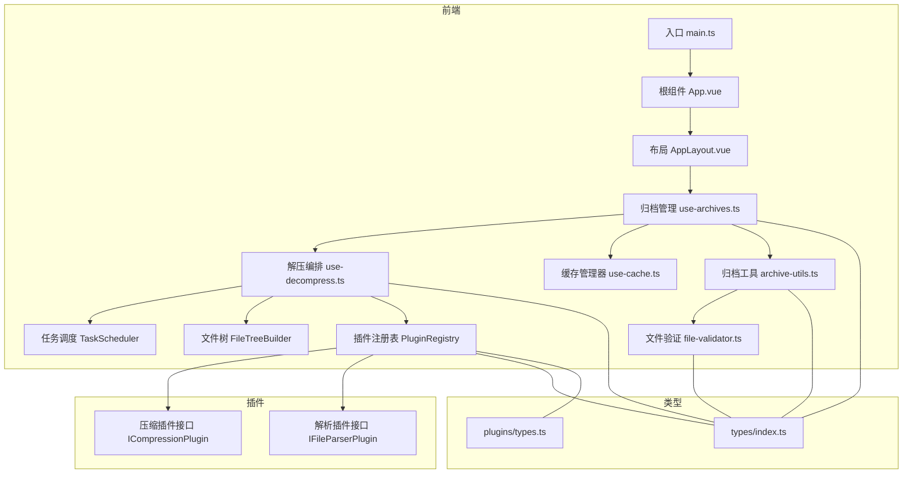

图表来源
- [src/main.ts:1-23](file://src/main.ts#L1-L23)
- [src/App.vue:1-24](file://src/App.vue#L1-L24)
- [src/composables/use-archives.ts:1-168](file://src/composables/use-archives.ts#L1-L168)
- [src/composables/use-decompress.ts:1-89](file://src/composables/use-decompress.ts#L1-L89)
- [src/core/task-scheduler.ts:1-86](file://src/core/task-scheduler.ts#L1-L86)
- [src/core/file-tree.ts:1-69](file://src/core/file-tree.ts#L1-L69)
- [src/plugins/registry.ts:1-118](file://src/plugins/registry.ts#L1-L118)
- [src/core/archive-utils.ts:1-43](file://src/core/archive-utils.ts#L1-L43)
- [src/core/file-validator.ts:1-141](file://src/core/file-validator.ts#L1-L141)
- [src/composables/use-cache.ts:1-51](file://src/composables/use-cache.ts#L1-L51)
- [src/types/index.ts:1-90](file://src/types/index.ts#L1-L90)
- [src/plugins/types.ts:1-34](file://src/plugins/types.ts#L1-L34)

章节来源
- [README.md:71-127](file://README.md#L71-L127)
- [package.json:1-44](file://package.json#L1-L44)

## 核心组件
- 归档工具函数（archive-utils）：提供压缩包扩展名判断、批量过滤与内容验证的统一入口
- 文件验证器（file-validator）：策略链模式的可插拔验证管线，包含扩展名校验与 ZIP 内容校验
- 归档管理（use-archives）：维护归档列表、去重、状态更新、统计信息、从缓存恢复
- 解压编排（use-decompress）：按优先级选择 File 或缓存数据，调用插件进行解压并构建文件树
- 任务调度（task-scheduler）：并发控制的任务队列，支持排队、重试与计数
- 文件树（file-tree）：将扁平文件条目构造成树形结构，并提供查找与扁平化工具
- 插件注册表（registry）：统一注册/发现/安全执行压缩与解析插件，带超时保护
- 缓存适配（use-cache）：根据平台选择 IndexedDB 或文件系统存储，提供单例初始化与恢复

章节来源
- [src/core/archive-utils.ts:1-43](file://src/core/archive-utils.ts#L1-L43)
- [src/core/file-validator.ts:1-141](file://src/core/file-validator.ts#L1-L141)
- [src/composables/use-archives.ts:1-168](file://src/composables/use-archives.ts#L1-L168)
- [src/composables/use-decompress.ts:1-89](file://src/composables/use-decompress.ts#L1-L89)
- [src/core/task-scheduler.ts:1-86](file://src/core/task-scheduler.ts#L1-L86)
- [src/core/file-tree.ts:1-69](file://src/core/file-tree.ts#L1-L69)
- [src/plugins/registry.ts:1-118](file://src/plugins/registry.ts#L1-L118)
- [src/composables/use-cache.ts:1-51](file://src/composables/use-cache.ts#L1-L51)

## 架构总览
整体流程：应用启动 → 初始化缓存 → 恢复归档元数据 → 用户添加文件 → 触发解压 → 任务调度 → 插件解压 → 构建文件树 → 更新状态与缓存。

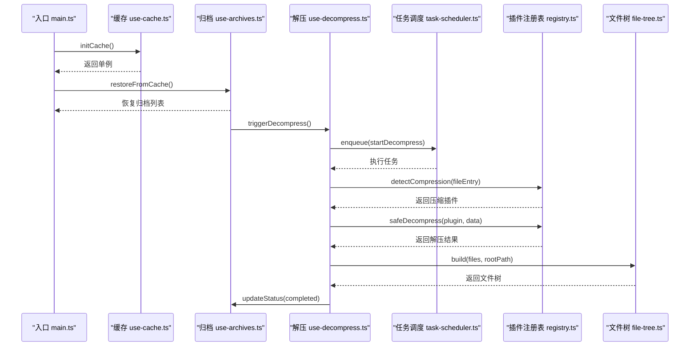

图表来源
- [src/main.ts:11-20](file://src/main.ts#L11-L20)
- [src/composables/use-cache.ts:32-42](file://src/composables/use-cache.ts#L32-L42)
- [src/composables/use-archives.ts:106-150](file://src/composables/use-archives.ts#L106-L150)
- [src/composables/use-decompress.ts:16-88](file://src/composables/use-decompress.ts#L16-L88)
- [src/core/task-scheduler.ts:23-85](file://src/core/task-scheduler.ts#L23-L85)
- [src/plugins/registry.ts:56-116](file://src/plugins/registry.ts#L56-L116)
- [src/core/file-tree.ts:7-44](file://src/core/file-tree.ts#L7-L44)

## 详细组件分析

### 归档工具函数（archive-utils）
职责与要点
- 集中管理支持的压缩包扩展名集合，避免多处重复定义
- 提供 isArchiveFile 快速判断与 filterArchiveFiles 批量过滤
- 提供 validateArchiveFiles 对文件列表执行内容验证，失败通过回调通知 UI

复杂度与行为
- 时间复杂度：O(n) 遍历文件列表
- 空间复杂度：O(1) 额外空间（Set 用于扩展名匹配）

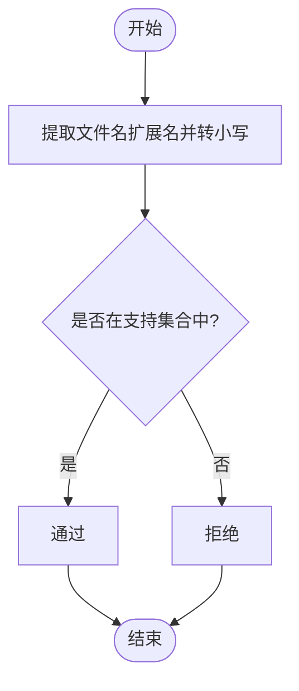

图表来源
- [src/core/archive-utils.ts:12-21](file://src/core/archive-utils.ts#L12-L21)

章节来源
- [src/core/archive-utils.ts:1-43](file://src/core/archive-utils.ts#L1-L43)

### 文件验证器（file-validator）
职责与要点
- 采用策略链模式，每个检查器实现统一接口，可灵活扩展
- 内置 ZipExtensionValidator 与 ZipContentValidator（后者使用 fflate 读取 ZIP 中央目录以检查必要文件）
- ValidationPipeline 顺序执行，遇到第一个失败即短路返回
- 提供默认管线与单例工厂，便于全局复用

关键数据结构
- ValidationResult：单个验证结果
- FileValidator：验证器接口
- ValidationPipeline：验证管线

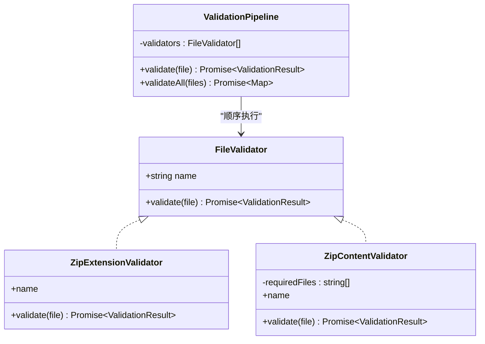

图表来源
- [src/core/file-validator.ts:14-20](file://src/core/file-validator.ts#L14-L20)
- [src/core/file-validator.ts:24-82](file://src/core/file-validator.ts#L24-L82)
- [src/core/file-validator.ts:90-117](file://src/core/file-validator.ts#L90-L117)

章节来源
- [src/core/file-validator.ts:1-141](file://src/core/file-validator.ts#L1-L141)

### 归档管理（use-archives）
职责与要点
- 维护 archives 响应式列表、去重集合 addedFileKeys、自增 ID
- addFiles：去重后创建 ArchiveItem，持久化元数据，触发解压
- remove：清理去重集合与缓存，移除归档
- updateStatus：更新状态与进度，完成/失败时回写元数据
- stats：计算总数、大小、文件数、已完成数等统计
- restoreFromCache：从缓存恢复元数据，重置 running→pending，必要时自动重试

数据结构
- ArchiveItem：归档项，包含 id、name、file（会话内）、cacheId、status、progress、files、error、时间戳、原始/压缩大小

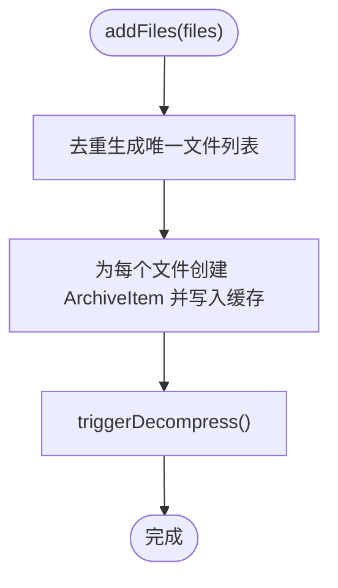

图表来源
- [src/composables/use-archives.ts:18-51](file://src/composables/use-archives.ts#L18-L51)

章节来源
- [src/composables/use-archives.ts:1-168](file://src/composables/use-archives.ts#L1-L168)
- [src/types/index.ts:50-65](file://src/types/index.ts#L50-L65)

### 解压编排（use-decompress）
职责与要点
- 优先使用当次会话中的 File 对象，避免重复 IO；若不存在则从缓存读取
- 通过注册表检测压缩插件并安全执行解压（带超时保护）
- 使用文件树构建器生成树形结构，累计原始大小，更新状态与错误信息
- 通过任务调度器限制并发，防止资源争用

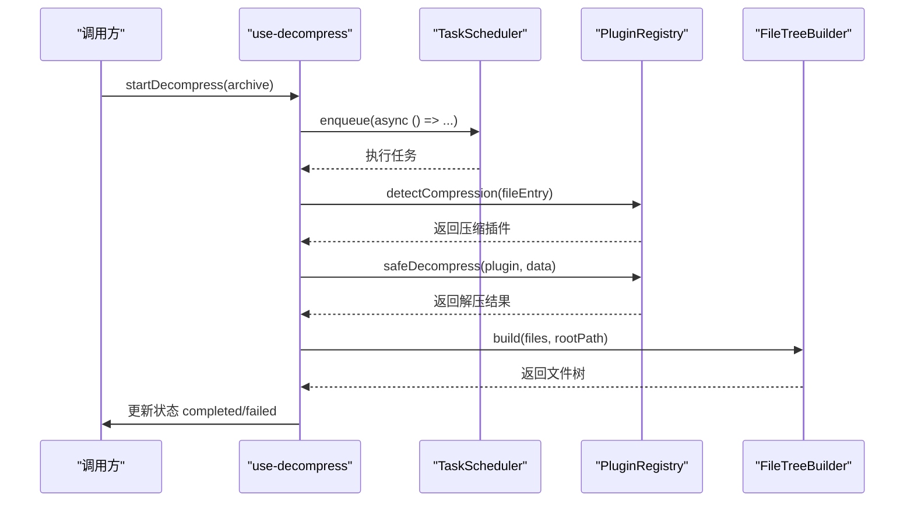

图表来源
- [src/composables/use-decompress.ts:16-88](file://src/composables/use-decompress.ts#L16-L88)
- [src/core/task-scheduler.ts:23-85](file://src/core/task-scheduler.ts#L23-L85)
- [src/plugins/registry.ts:56-116](file://src/plugins/registry.ts#L56-L116)
- [src/core/file-tree.ts:7-44](file://src/core/file-tree.ts#L7-L44)

章节来源
- [src/composables/use-decompress.ts:1-89](file://src/composables/use-decompress.ts#L1-L89)

### 任务调度（task-scheduler）
职责与要点
- 维护最大并发与队列长度上限，入队失败返回 null
- 内部循环处理下一个任务，完成后递减运行计数并继续拉取
- 支持重试：拒绝原 promise 引用，重新入队同一函数

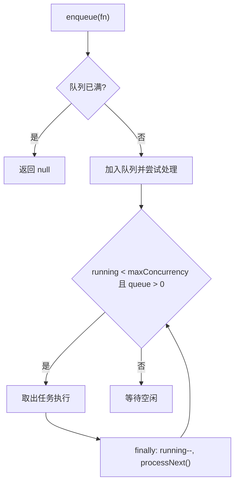

图表来源
- [src/core/task-scheduler.ts:23-85](file://src/core/task-scheduler.ts#L23-L85)

章节来源
- [src/core/task-scheduler.ts:1-86](file://src/core/task-scheduler.ts#L1-L86)

### 文件树（file-tree）
职责与要点
- 将扁平文件条目构造成树形结构，支持根路径裁剪
- 提供静态方法查找节点与扁平化遍历

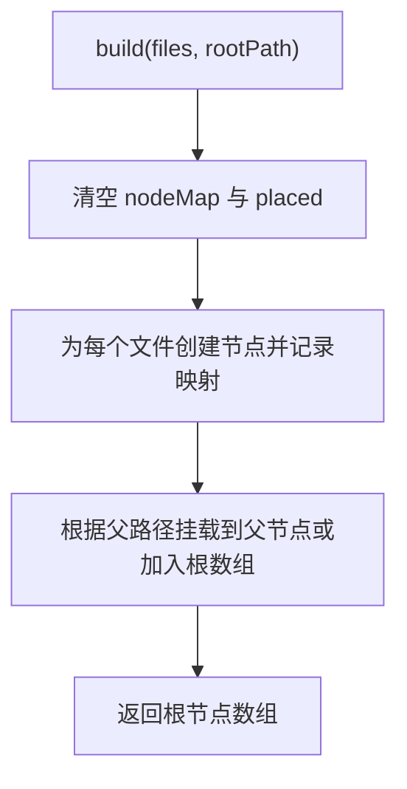

图表来源
- [src/core/file-tree.ts:7-44](file://src/core/file-tree.ts#L7-L44)

章节来源
- [src/core/file-tree.ts:1-69](file://src/core/file-tree.ts#L1-L69)

### 插件注册表（registry）
职责与要点
- 统一管理压缩与解析插件的注册、启用/禁用、按扩展名检测
- 提供 safeParse/safeDecompress 包装，带超时保护与异常兜底

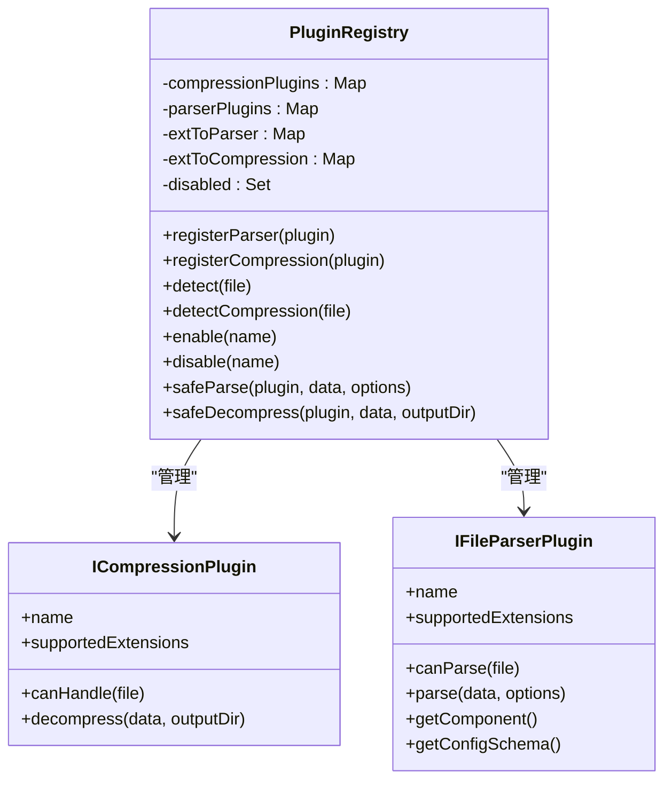

图表来源
- [src/plugins/registry.ts:14-116](file://src/plugins/registry.ts#L14-L116)
- [src/plugins/types.ts:16-30](file://src/plugins/types.ts#L16-L30)

章节来源
- [src/plugins/registry.ts:1-118](file://src/plugins/registry.ts#L1-L118)
- [src/plugins/types.ts:1-34](file://src/plugins/types.ts#L1-L34)

### 缓存适配（use-cache）
职责与要点
- 根据编译时常量 __PLATFORM__ 选择存储后端（IndexedDB 或文件系统）
- 提供单例 CacheManager 与懒初始化 initCache，供应用启动时调用

章节来源
- [src/composables/use-cache.ts:1-51](file://src/composables/use-cache.ts#L1-L51)

### 概念性概览
以下流程图展示“上传 → 验证 → 解压 → 渲染”的概念链路，不直接对应具体源码文件。

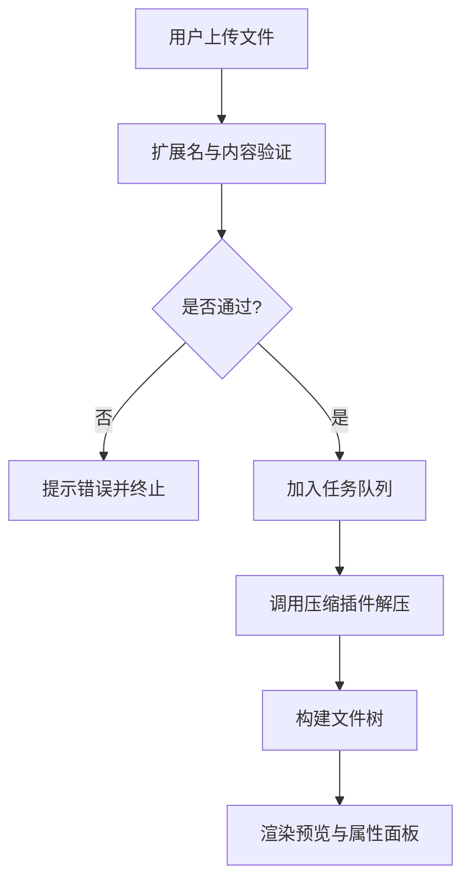

[此图为概念流程，无需图表来源]

## 依赖分析
- 模块耦合
  - use-archives 依赖 use-cache、use-decompress、types
  - use-decompress 依赖 use-archives、use-plugins、use-cache、TaskScheduler、FileTreeBuilder、types
  - archive-utils 依赖 file-validator
  - file-validator 独立，仅依赖 types
  - registry 依赖 types 与插件接口类型
- 外部依赖
  - fflate：Web 端 ZIP 解压与内容校验
  - @tauri-apps/api：桌面端 IPC 调用（由适配器层封装）
  - naive-ui、pinia、splitpanes、vue-draggable-plus：UI 与交互

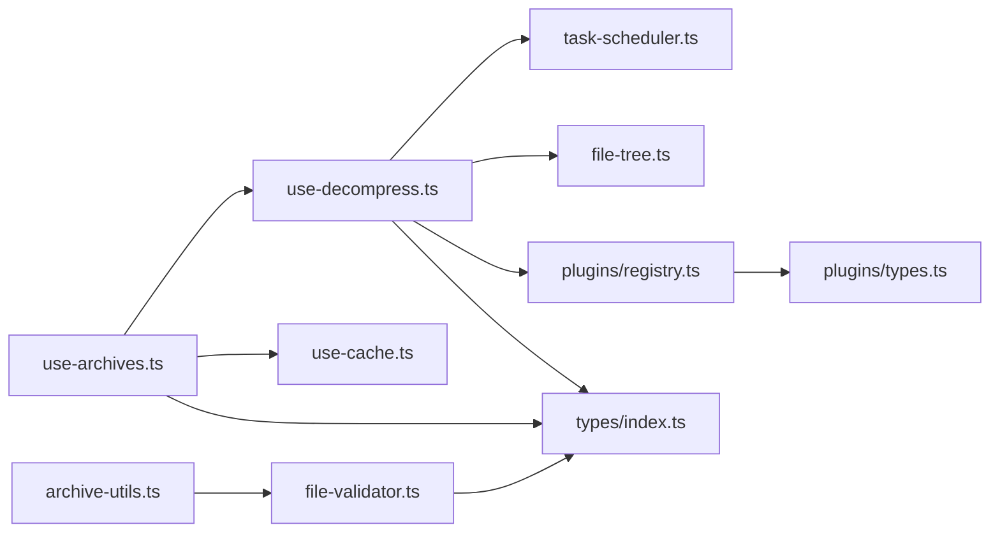

图表来源
- [src/composables/use-archives.ts:1-168](file://src/composables/use-archives.ts#L1-L168)
- [src/composables/use-decompress.ts:1-89](file://src/composables/use-decompress.ts#L1-L89)
- [src/core/archive-utils.ts:1-43](file://src/core/archive-utils.ts#L1-L43)
- [src/core/file-validator.ts:1-141](file://src/core/file-validator.ts#L1-L141)
- [src/plugins/registry.ts:1-118](file://src/plugins/registry.ts#L1-L118)
- [src/plugins/types.ts:1-34](file://src/plugins/types.ts#L1-L34)
- [src/types/index.ts:1-90](file://src/types/index.ts#L1-L90)

章节来源
- [package.json:20-31](file://package.json#L20-L31)

## 性能考虑
- 任务并发控制：TaskScheduler 限制最大并发与队列长度，避免内存与 CPU 峰值
- 解压优化：优先使用会话内 File 对象，减少重复 IO；缓存恢复场景按需读取
- 大文件友好：结合 mmap 零拷贝读取（后端）与虚拟滚动（前端），降低内存占用
- 插件超时保护：safeDecompress/safeParse 设置超时，避免长时间阻塞
- 去重机制：addedFileKeys 基于 name+size+lastModified 避免重复处理

[本节为通用指导，不直接分析具体文件]

## 故障排查指南
常见问题与定位建议
- 解压失败：检查插件是否可用、数据是否为空、是否有超时错误
  - 参考路径：[src/composables/use-decompress.ts:16-88](file://src/composables/use-decompress.ts#L16-L88)、[src/plugins/registry.ts:106-116](file://src/plugins/registry.ts#L106-L116)
- 任务队列满：查看 pendingCount/runningCount，适当调整并发或队列上限
  - 参考路径：[src/core/task-scheduler.ts:58-64](file://src/core/task-scheduler.ts#L58-L64)
- 缓存恢复异常：确认 initCache 已调用且未抛出异常，检查 restoreFromCache 是否成功
  - 参考路径：[src/main.ts:11-20](file://src/main.ts#L11-L20)、[src/composables/use-cache.ts:32-42](file://src/composables/use-cache.ts#L32-L42)
- 文件验证失败：查看具体验证器返回的错误消息，确认扩展名与必要文件是否存在
  - 参考路径：[src/core/file-validator.ts:24-82](file://src/core/file-validator.ts#L24-L82)

章节来源
- [src/composables/use-decompress.ts:16-88](file://src/composables/use-decompress.ts#L16-L88)
- [src/plugins/registry.ts:106-116](file://src/plugins/registry.ts#L106-L116)
- [src/core/task-scheduler.ts:58-64](file://src/core/task-scheduler.ts#L58-L64)
- [src/main.ts:11-20](file://src/main.ts#L11-L20)
- [src/composables/use-cache.ts:32-42](file://src/composables/use-cache.ts#L32-L42)
- [src/core/file-validator.ts:24-82](file://src/core/file-validator.ts#L24-L82)

## 结论
本项目通过清晰的模块化设计与插件化架构，实现了可扩展的归档与日志解析能力。核心工具函数与编排逻辑解耦良好，配合任务调度与缓存恢复，提供了稳定且高性能的用户体验。建议在后续迭代中持续完善插件生态与错误诊断能力。

[本节为总结，不直接分析具体文件]

## 附录
- 类型定义速览
  - FileEntry、DecompressResult、ArchiveItem、FileTreeNode、ParsedContent 等
  - 参考路径：[src/types/index.ts:1-90](file://src/types/index.ts#L1-L90)
- 插件接口速览
  - ICompressionPlugin、IFileParserPlugin、ConfigSchema
  - 参考路径：[src/plugins/types.ts:1-34](file://src/plugins/types.ts#L1-L34)

章节来源
- [src/types/index.ts:1-90](file://src/types/index.ts#L1-L90)
- [src/plugins/types.ts:1-34](file://src/plugins/types.ts#L1-L34)