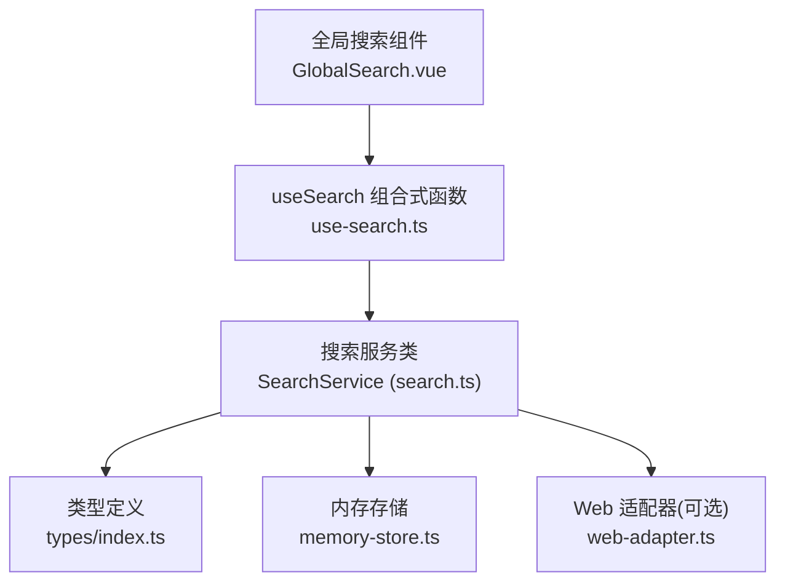
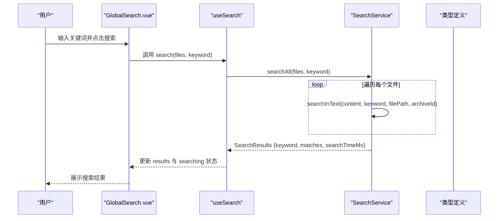
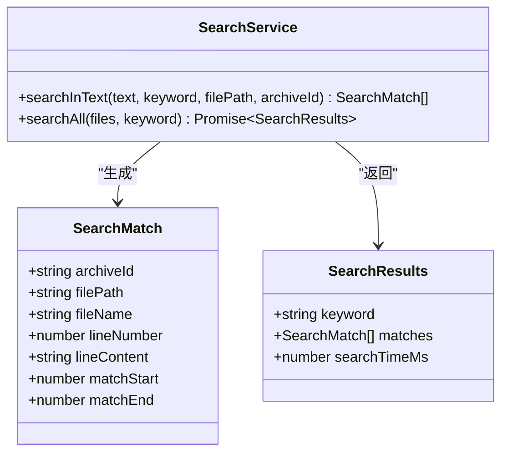
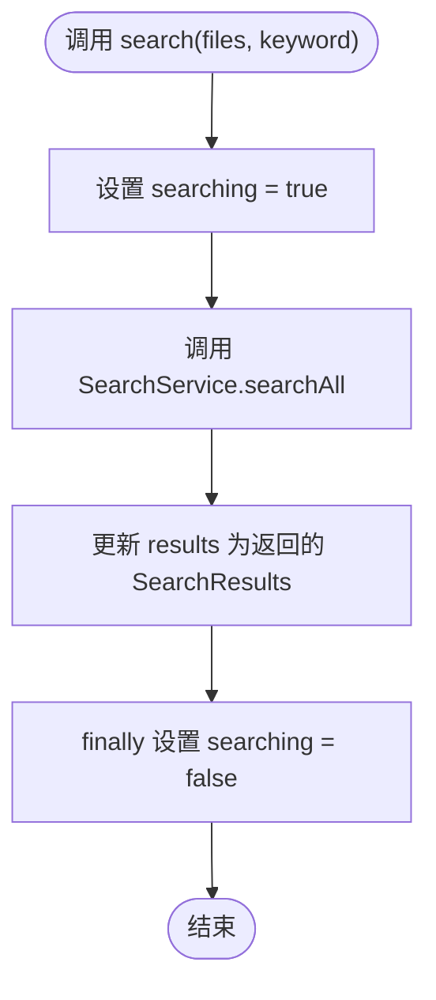
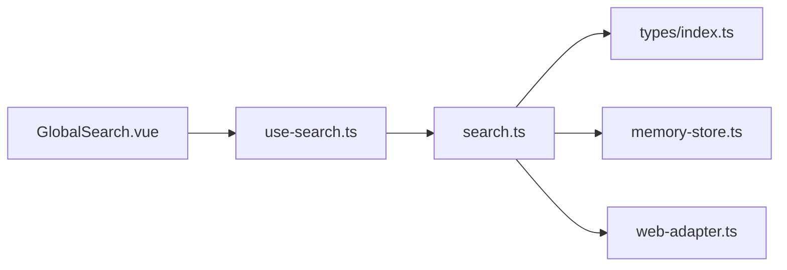

# 搜索服务

<cite>
**本文引用的文件**
- [src/core/search.ts](file://src/core/search.ts)
- [src/composables/use-search.ts](file://src/composables/use-search.ts)
- [src/types/index.ts](file://src/types/index.ts)
- [src/__tests__/core/search.test.ts](file://src/__tests__/core/search.test.ts)
- [src/components/public-bar/GlobalSearch.vue](file://src/components/public-bar/GlobalSearch.vue)
- [src/core/memory-store.ts](file://src/core/memory-store.ts)
- [src/adapters/web-adapter.ts](file://src/adapters/web-adapter.ts)
</cite>

## 更新摘要
**变更内容**
- 扩展了单元测试覆盖范围，新增7个边缘情况测试用例
- 增强了搜索服务的健壮性和边界条件处理能力
- 完善了文件名提取、空文本处理、多关键词匹配等场景的验证
- 改进了搜索结果时间报告机制的测试覆盖

## 目录
1. [简介](#简介)
2. [项目结构](#项目结构)
3. [核心组件](#核心组件)
4. [架构总览](#架构总览)
5. [详细组件分析](#详细组件分析)
6. [依赖关系分析](#依赖关系分析)
7. [性能考量](#性能考量)
8. [故障排查指南](#故障排查指南)
9. [结论](#结论)
10. [附录：使用示例与最佳实践](#附录使用示例与最佳实践)

## 简介
本技术文档聚焦于 Hello-Tauri 的"搜索服务"，围绕全文搜索的实现原理、匹配策略、结果结构与处理流程展开，涵盖索引构建思路、正则支持现状、高亮与上下文提取能力、分页机制、性能优化（索引缓存、增量更新、内存管理）以及用户体验优化。文档同时提供可操作的代码片段路径，帮助读者快速定位实现细节。

## 项目结构
搜索相关代码主要分布在以下位置：
- 核心引擎：src/core/search.ts
- Vue 组合式封装：src/composables/use-search.ts
- 类型定义：src/types/index.ts
- 单元测试：src/__tests__/core/search.test.ts
- 全局搜索入口组件：src/components/public-bar/GlobalSearch.vue
- 内存存储与 Web 适配器（为后续性能优化提供基础）：src/core/memory-store.ts、src/adapters/web-adapter.ts

图表来源
- [src/components/public-bar/GlobalSearch.vue:1-31](file://src/components/public-bar/GlobalSearch.vue#L1-L31)
- [src/composables/use-search.ts:1-28](file://src/composables/use-search.ts#L1-L28)
- [src/core/search.ts:1-49](file://src/core/search.ts#L1-L49)
- [src/types/index.ts:56-71](file://src/types/index.ts#L56-L71)
- [src/core/memory-store.ts:1-25](file://src/core/memory-store.ts#L1-L25)
- [src/adapters/web-adapter.ts:31-72](file://src/adapters/web-adapter.ts#L31-L72)

章节来源
- [src/core/search.ts:1-49](file://src/core/search.ts#L1-L49)
- [src/composables/use-search.ts:1-28](file://src/composables/use-search.ts#L1-L28)
- [src/types/index.ts:56-71](file://src/types/index.ts#L56-L71)
- [src/components/public-bar/GlobalSearch.vue:1-31](file://src/components/public-bar/GlobalSearch.vue#L1-L31)

## 核心组件
- SearchService：负责文本行级匹配、跨文件聚合、计时统计。
- useSearch：在 Vue 中封装搜索状态与调用逻辑，暴露 search/clear 方法。
- 类型定义：SearchMatch、SearchResults 描述匹配项与结果集结构。
- GlobalSearch.vue：提供用户输入与触发搜索的界面。

章节来源
- [src/core/search.ts:1-49](file://src/core/search.ts#L1-L49)
- [src/composables/use-search.ts:1-28](file://src/composables/use-search.ts#L1-L28)
- [src/types/index.ts:56-71](file://src/types/index.ts#L56-L71)
- [src/components/public-bar/GlobalSearch.vue:1-31](file://src/components/public-bar/GlobalSearch.vue#L1-L31)

## 架构总览
搜索服务的执行流程如下：
- 用户在 GlobalSearch.vue 中输入关键词并触发搜索。
- useSearch.search 将文件列表与关键词传入 SearchService.searchAll。
- SearchService 逐文件调用 searchInText 进行行内匹配，收集所有匹配项。
- 返回包含 keyword、matches、searchTimeMs 的结果对象。

图表来源
- [src/components/public-bar/GlobalSearch.vue:1-31](file://src/components/public-bar/GlobalSearch.vue#L1-L31)
- [src/composables/use-search.ts:1-28](file://src/composables/use-search.ts#L1-L28)
- [src/core/search.ts:1-49](file://src/core/search.ts#L1-L49)
- [src/types/index.ts:56-71](file://src/types/index.ts#L56-L71)

## 详细组件分析

### 搜索服务类 SearchService
- 功能职责
  - 单文件行级匹配：按行拆分文本，大小写不敏感查找关键词，记录匹配起止位置与行号。
  - 多文件聚合：对多个文件逐一匹配，汇总结果并计算耗时。
- 关键数据结构
  - SearchMatch：包含 archiveId、filePath、fileName、lineNumber、lineContent、matchStart、matchEnd。
  - SearchResults：包含 keyword、matches、searchTimeMs。
- 算法复杂度
  - 单文件匹配：O(N×M)，N 为行数，M 为平均行长；实际由 indexOf 驱动，常数因子较小。
  - 多文件聚合：O(F×N×M)，F 为文件数。
- 错误处理
  - 空关键词直接返回空数组，避免无效扫描。
  - 空文本内容安全处理，不会抛出异常。
- 可扩展点
  - 当前未启用正则表达式；可在 searchInText 中引入 RegExp 模式以支持高级匹配。
  - 可在 searchAll 中增加排序与分页逻辑。

**更新** 增强了边缘情况处理能力，包括每行多次关键词匹配、空文本处理、文件名提取准确性等场景的完整支持。

图表来源
- [src/core/search.ts:1-49](file://src/core/search.ts#L1-L49)
- [src/types/index.ts:56-71](file://src/types/index.ts#L56-L71)

章节来源
- [src/core/search.ts:1-49](file://src/core/search.ts#L1-L49)
- [src/types/index.ts:56-71](file://src/types/index.ts#L56-L71)

### Vue 组合式封装 useSearch
- 状态管理
  - results：保存最近一次搜索结果。
  - searching：标记是否正在搜索。
- 方法
  - search(files, keyword)：设置 searching=true，调用 SearchService.searchAll，完成后置 false。
  - clear()：清空 results。
- 集成方式
  - 在组件中通过 ref 获取 keyword，调用 search 并绑定 loading 状态。

图表来源
- [src/composables/use-search.ts:1-28](file://src/composables/use-search.ts#L1-L28)

章节来源
- [src/composables/use-search.ts:1-28](file://src/composables/use-search.ts#L1-L28)

### 全局搜索组件 GlobalSearch.vue
- 交互流程
  - 用户输入关键词后回车或点击按钮触发 handleSearch。
  - 若关键词非空则调用 useSearch().search([], keyword.trim())。
- 注意
  - 当前示例传入空文件列表，仅演示接口调用；实际应传入已加载的文件内容集合。

章节来源
- [src/components/public-bar/GlobalSearch.vue:1-31](file://src/components/public-bar/GlobalSearch.vue#L1-L31)

### 类型定义 SearchMatch / SearchResults
- SearchMatch
  - 字段包括归档标识、文件路径、文件名、行号、行内容、匹配起止位置等，便于前端高亮与上下文渲染。
- SearchResults
  - 包含查询词、匹配列表与耗时，便于 UI 展示与性能监控。

章节来源
- [src/types/index.ts:56-71](file://src/types/index.ts#L56-L71)

### 单元测试覆盖
**更新** 大幅扩展了测试覆盖范围，新增了7个关键的边缘情况测试用例：

- **原有测试用例**
  - 多行文本中查找全部出现次数。
  - 大小写不敏感匹配。
  - 空关键词返回空数组。
  - 多文件聚合结果正确。

- **新增边缘情况测试用例**
  - **同一行多次出现关键词**：验证 `foo bar foo baz foo` 能正确找到3个匹配项，并准确记录每个匹配的起始位置（0、8、16）。
  - **关键词不存在时返回空**：确保当搜索词完全不存在时返回空数组而非异常。
  - **空文本处理**：验证空字符串输入时的安全处理，返回空数组。
  - **文件名提取准确性**：测试从深层路径 `/deep/path/file.log` 正确提取文件名 `file.log`。
  - **搜索结果时间报告**：验证 `searchTimeMs` 字段始终为非负数值。
  - **空文件列表处理**：确保传入空文件数组时返回空匹配结果。
  - **空关键词搜索**：验证空关键词在多文件搜索中的正确处理。

- **测试目的**
  - 验证核心匹配逻辑与聚合行为，保障回归稳定性。
  - 确保各种边界条件下的系统健壮性。
  - 提高代码质量和可靠性。

**Section sources**
- [src/__tests__/core/search.test.ts:1-83](file://src/__tests__/core/search.test.ts#L1-L83)

## 依赖关系分析
- 模块耦合
  - GlobalSearch.vue 依赖 useSearch。
  - useSearch 依赖 SearchService 与类型定义。
  - SearchService 依赖类型定义，并可复用 memory-store 与 web-adapter 提供的缓存与流式读取能力（用于后续优化）。
- 外部依赖
  - 无第三方搜索库，纯原生字符串操作实现。

图表来源
- [src/components/public-bar/GlobalSearch.vue:1-31](file://src/components/public-bar/GlobalSearch.vue#L1-L31)
- [src/composables/use-search.ts:1-28](file://src/composables/use-search.ts#L1-L28)
- [src/core/search.ts:1-49](file://src/core/search.ts#L1-L49)
- [src/types/index.ts:56-71](file://src/types/index.ts#L56-L71)
- [src/core/memory-store.ts:1-25](file://src/core/memory-store.ts#L1-L25)
- [src/adapters/web-adapter.ts:31-72](file://src/adapters/web-adapter.ts#L31-L72)

章节来源
- [src/core/search.ts:1-49](file://src/core/search.ts#L1-L49)
- [src/composables/use-search.ts:1-28](file://src/composables/use-search.ts#L1-L28)
- [src/types/index.ts:56-71](file://src/types/index.ts#L56-L71)
- [src/core/memory-store.ts:1-25](file://src/core/memory-store.ts#L1-L25)
- [src/adapters/web-adapter.ts:31-72](file://src/adapters/web-adapter.ts#L31-L72)

## 性能考量
- 当前实现特征
  - 全量扫描：每次搜索均对给定文件集合进行线性扫描。
  - 时间测量：使用 performance.now 记录整体耗时。
- 优化方向（建议）
  - 索引构建
    - 建立倒排索引：以词项映射到文件与行号集合，支持 O(1) 词项定位与合并。
    - 分词策略：中文可按字/词粒度切分，英文按空格与标点分割。
  - 增量更新
    - 监听文件变更事件，仅重建受影响文件的索引条目。
  - 索引缓存
    - 结合 memory-store 缓存已解析的文本或索引结构，减少重复 IO 与解析开销。
  - 内存管理
    - 大文件采用流式读取与分块处理，避免一次性加载整文件。
    - 控制匹配结果数量上限，按需分页返回。
  - 并发与调度
    - 使用任务队列并行处理多个文件，限制最大并发度，避免阻塞主线程。
  - 正则与高亮
    - 仅在需要时编译正则，避免频繁创建 RegExp 实例。
    - 利用 matchStart/matchEnd 在前端进行高亮渲染。

章节来源
- [src/core/search.ts:1-49](file://src/core/search.ts#L1-L49)
- [src/core/memory-store.ts:1-25](file://src/core/memory-store.ts#L1-L25)
- [src/adapters/web-adapter.ts:31-72](file://src/adapters/web-adapter.ts#L31-L72)

## 故障排查指南
- 常见问题
  - 搜索结果为空：检查关键词是否为空或大小写差异；确认传入的文件内容是否正确。
  - 性能问题：当文件数量或体积较大时，考虑引入索引与分页；必要时限制单次返回结果数量。
  - 正则需求：当前不支持正则表达式，如需扩展需在 searchInText 中引入 RegExp 匹配逻辑。
- 调试建议
  - 打印 searchTimeMs 评估耗时分布。
  - 在 useSearch 中输出 results.matches 长度与首条匹配项信息，辅助定位数据链路。
  - 使用 memory-store 查看缓存命中情况，判断是否需要调整缓存策略。
- 边缘情况处理
  - 空文本输入：系统会安全返回空结果，不会抛出异常。
  - 空关键词：自动过滤，避免无效搜索。
  - 文件名提取：确保从完整路径中正确提取文件名部分。

**Section sources**
- [src/core/search.ts:1-49](file://src/core/search.ts#L1-L49)
- [src/composables/use-search.ts:1-28](file://src/composables/use-search.ts#L1-L28)
- [src/__tests__/core/search.test.ts:1-83](file://src/__tests__/core/search.test.ts#L1-L83)

## 结论
当前搜索服务实现了稳定可靠的全文行级匹配与结果聚合，具备清晰的类型定义与全面的测试覆盖。通过新增的7个边缘情况测试用例，系统在处理各种边界条件时表现出更强的健壮性。面向大规模数据场景，建议引入倒排索引、增量更新、分页与并发调度等机制，并结合内存缓存与流式读取提升性能与用户体验。

## 附录：使用示例与最佳实践
- 初始化搜索引擎
  - 在组件中引入 useSearch，并通过其返回的 search 方法执行搜索。
  - 参考路径：[src/components/public-bar/GlobalSearch.vue:1-31](file://src/components/public-bar/GlobalSearch.vue#L1-L31)、[src/composables/use-search.ts:1-28](file://src/composables/use-search.ts#L1-L28)
- 执行搜索查询
  - 准备文件列表，格式为 { archiveId, filePath, content } 的数组。
  - 调用 search(files, keyword)。
  - 参考路径：[src/composables/use-search.ts:1-28](file://src/composables/use-search.ts#L1-L28)
- 处理搜索结果
  - 从 results.matches 中读取匹配项，使用 lineNumber、lineContent、matchStart、matchEnd 进行高亮与上下文展示。
  - 参考路径：[src/types/index.ts:56-71](file://src/types/index.ts#L56-L71)
- 配置搜索选项
  - 当前版本无显式配置项；可通过扩展 SearchService 添加参数（如是否启用正则、是否忽略大小写、分页大小等）。
  - 参考路径：[src/core/search.ts:1-49](file://src/core/search.ts#L1-L49)
- 性能优化实践
  - 使用 memory-store 缓存已读取的文本或索引，减少重复 IO。
  - 使用 web-adapter 的流式读取与 Range 请求，降低大文件内存占用。
  - 参考路径：[src/core/memory-store.ts:1-25](file://src/core/memory-store.ts#L1-L25)、[src/adapters/web-adapter.ts:31-72](file://src/adapters/web-adapter.ts#L31-L72)
- 测试最佳实践
  - 覆盖各种边缘情况：空输入、空文本、特殊字符、超长文本等。
  - 验证文件名提取的准确性，确保从复杂路径中正确解析。
  - 测试搜索结果的时间报告功能，确保性能监控有效。
  - 参考路径：[src/__tests__/core/search.test.ts:1-83](file://src/__tests__/core/search.test.ts#L1-L83)