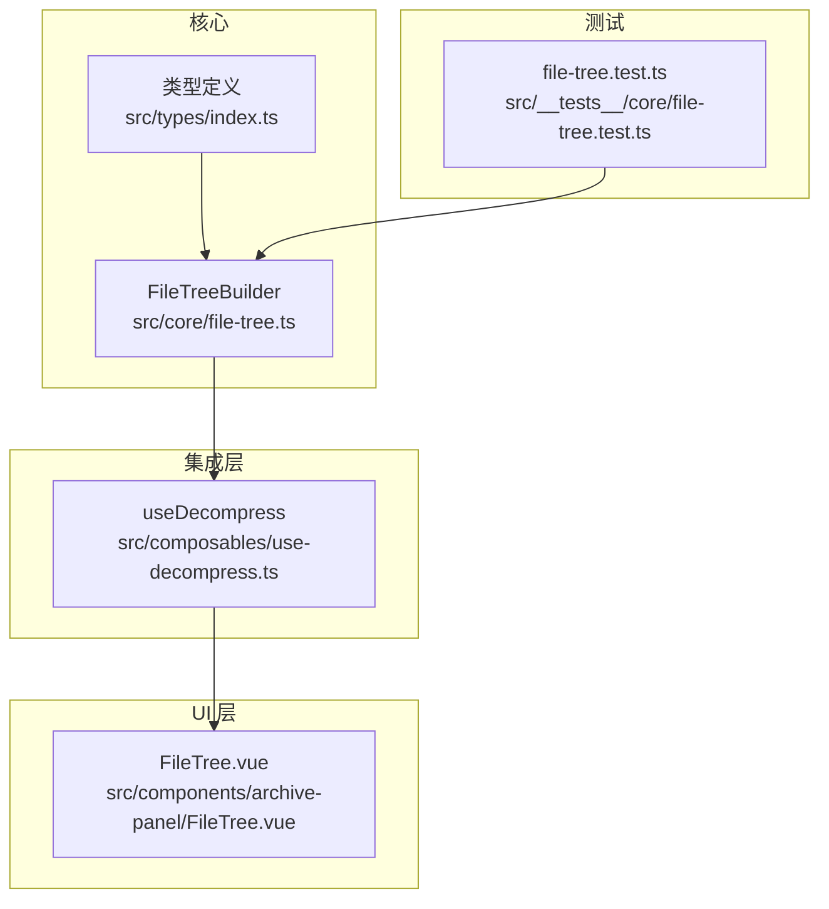
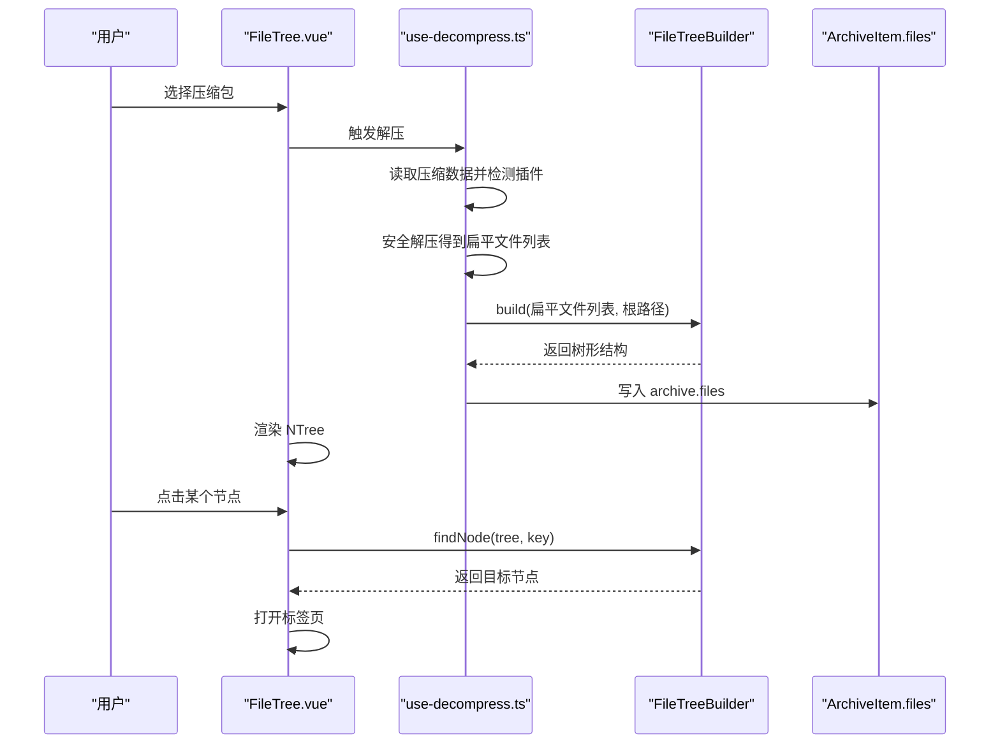
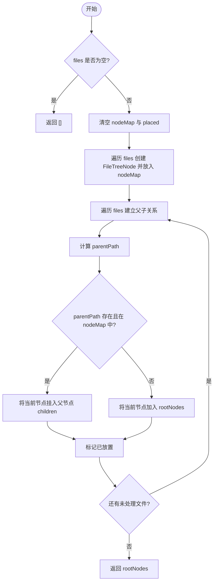
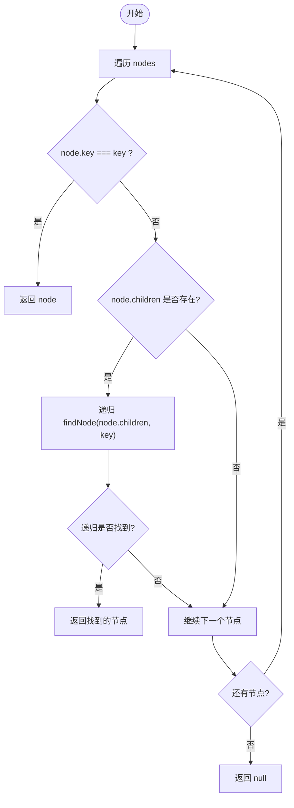
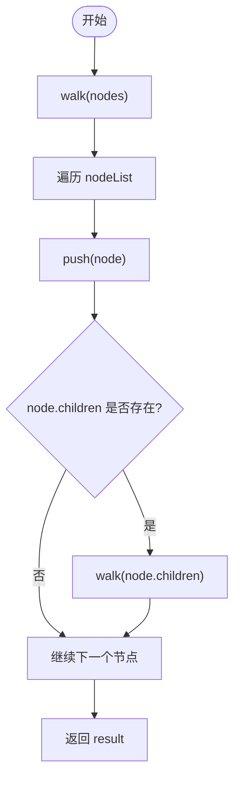
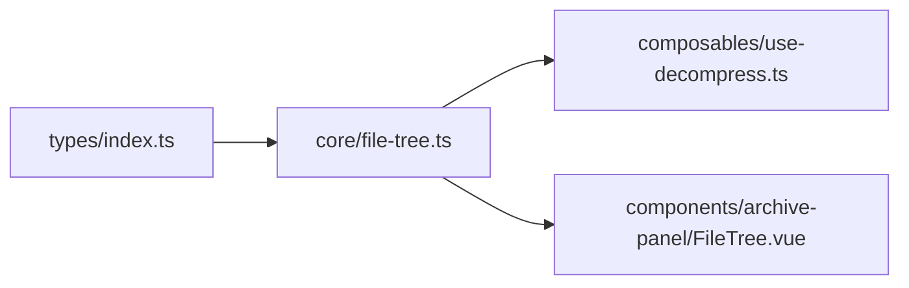
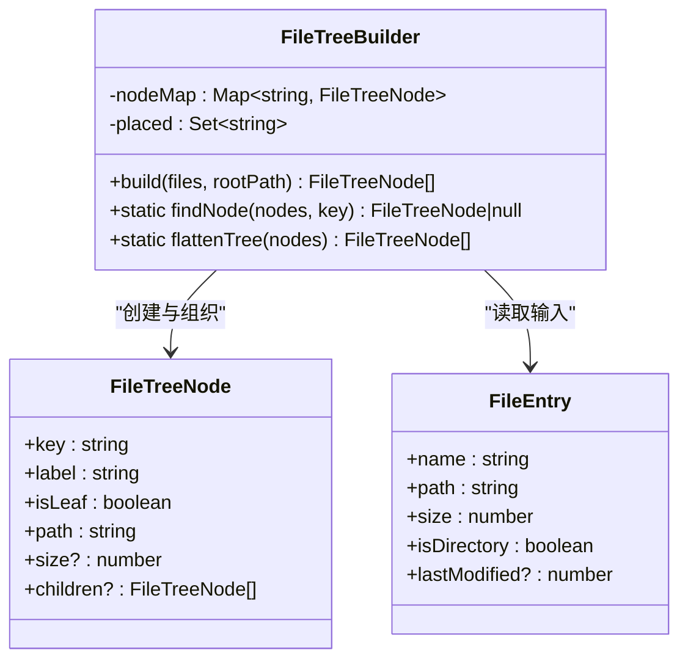

# 文件树系统

<cite>
**本文引用的文件**   
- [src/core/file-tree.ts](file://src/core/file-tree.ts)
- [src/types/index.ts](file://src/types/index.ts)
- [src/__tests__/core/file-tree.test.ts](file://src/__tests__/core/file-tree.test.ts)
- [src/composables/use-decompress.ts](file://src/composables/use-decompress.ts)
- [src/components/archive-panel/FileTree.vue](file://src/components/archive-panel/FileTree.vue)
</cite>

## 目录
1. [简介](#简介)
2. [项目结构](#项目结构)
3. [核心组件](#核心组件)
4. [架构总览](#架构总览)
5. [详细组件分析](#详细组件分析)
6. [依赖关系分析](#依赖关系分析)
7. [性能考量](#性能考量)
8. [故障排查指南](#故障排查指南)
9. [结论](#结论)
10. [附录](#附录)

## 简介
本技术文档聚焦于 Hello-Tauri 中的“文件树系统”，围绕 FileTreeBuilder 类的核心算法与数据结构进行深入解析。内容涵盖：
- 从扁平文件列表构建层级树形结构的算法实现
- 父子关系建立、根节点识别与树生成流程
- 节点查找与树扁平化等常用操作
- 数据模型 FileTreeNode 与 FileEntry 的类型定义与字段含义
- 时间/空间复杂度分析与大规模文件场景下的优化策略
- 错误处理与边界情况的最佳实践

## 项目结构
文件树相关代码主要分布在以下位置：
- 核心算法与工具：src/core/file-tree.ts
- 类型定义：src/types/index.ts
- 单元测试：src/__tests__/core/file-tree.test.ts
- 解压流程集成：src/composables/use-decompress.ts
- UI 展示与交互：src/components/archive-panel/FileTree.vue

图表来源
- [src/core/file-tree.ts:1-68](file://src/core/file-tree.ts#L1-L68)
- [src/types/index.ts:1-71](file://src/types/index.ts#L1-L71)
- [src/composables/use-decompress.ts:1-74](file://src/composables/use-decompress.ts#L1-L74)
- [src/components/archive-panel/FileTree.vue:1-42](file://src/components/archive-panel/FileTree.vue#L1-L42)
- [src/__tests__/core/file-tree.test.ts:1-52](file://src/__tests__/core/file-tree.test.ts#L1-L52)

章节来源
- [src/core/file-tree.ts:1-68](file://src/core/file-tree.ts#L1-L68)
- [src/types/index.ts:1-71](file://src/types/index.ts#L1-L71)
- [src/composables/use-decompress.ts:1-74](file://src/composables/use-decompress.ts#L1-L74)
- [src/components/archive-panel/FileTree.vue:1-42](file://src/components/archive-panel/FileTree.vue#L1-L42)
- [src/__tests__/core/file-tree.test.ts:1-52](file://src/__tests__/core/file-tree.test.ts#L1-L52)

## 核心组件
本节深入解析 FileTreeBuilder 的核心能力与数据模型。

### 数据模型
- FileEntry（输入）
  - name: 文件名或目录名
  - path: 完整路径（用于唯一标识与父子关系推导）
  - size: 大小（字节）
  - isDirectory: 是否为目录
  - lastModified?: 可选的修改时间戳
- FileTreeNode（输出）
  - key: 节点键，通常与 path 一致，作为唯一标识
  - label: 显示名称，通常为 name
  - isLeaf: 是否叶子节点（非目录为叶子）
  - path: 完整路径
  - size?: 可选的大小
  - children?: 子节点数组（仅目录存在）

章节来源
- [src/types/index.ts:1-24](file://src/types/index.ts#L1-L24)

### FileTreeBuilder 类概览
- 职责
  - 将扁平的文件列表转换为层级化的文件树
  - 提供静态方法用于在树中查找节点与扁平化遍历
- 关键成员
  - nodeMap: Map<string, FileTreeNode>，以路径为键缓存节点，便于快速定位父节点
  - placed: Set<string>，记录已处理的节点路径，避免重复挂载
- 主要方法
  - build(files, rootPath): 构建文件树并返回根节点数组
  - findNode(nodes, key): 递归查找指定 key 的节点
  - flattenTree(nodes): 深度优先遍历，返回所有节点的扁平数组

章节来源
- [src/core/file-tree.ts:1-68](file://src/core/file-tree.ts#L1-L68)

## 架构总览
下图展示了文件树系统在应用中的整体调用链：解压流程产生扁平文件列表，使用 FileTreeBuilder 构建树；UI 通过 NTree 渲染，并在选择时利用 findNode 定位具体文件节点打开标签页。

图表来源
- [src/composables/use-decompress.ts:1-74](file://src/composables/use-decompress.ts#L1-L74)
- [src/core/file-tree.ts:1-68](file://src/core/file-tree.ts#L1-L68)
- [src/components/archive-panel/FileTree.vue:1-42](file://src/components/archive-panel/FileTree.vue#L1-L42)

## 详细组件分析

### 算法：从扁平文件列表构建文件树
- 输入
  - files: FileEntry[]，包含每个文件或目录的元信息
  - rootPath: string，根路径（用于判断哪些节点应作为顶层根）
- 核心步骤
  1) 初始化阶段
     - 清空 nodeMap 与 placed，确保可复用实例
  2) 节点创建与索引
     - 遍历 files，为每个条目创建 FileTreeNode
     - 将节点按 path 存入 nodeMap，以便后续快速查找父节点
  3) 父子关系建立
     - 再次遍历 files，计算当前节点的 parentPath
       - 若 file.path 等于 rootPath，则 parentPath 为空字符串
       - 否则取最后一个 '/' 之前的部分作为父路径
     - 如果 parentPath 存在且 nodeMap 中有该父节点，则将当前节点 push 到父节点的 children 中
     - 否则将该节点加入 rootNodes 作为顶层根
     - 标记当前节点已放置（placed.add）
  4) 返回结果
     - 返回 rootNodes 作为树的根集合
- 关键点
  - 使用 Map 进行 O(1) 的父节点查找
  - 使用 Set 避免重复挂载
  - 根路径参数允许灵活指定不同根（例如空字符串表示全部顶级）

图表来源
- [src/core/file-tree.ts:7-44](file://src/core/file-tree.ts#L7-L44)

章节来源
- [src/core/file-tree.ts:7-44](file://src/core/file-tree.ts#L7-L44)

### 算法：节点查找 findNode
- 行为
  - 对传入的节点数组进行深度优先遍历
  - 比较每个节点的 key 是否与目标 key 相等
  - 若找到则立即返回该节点，否则继续递归子节点
  - 若遍历结束仍未找到，返回 null
- 适用场景
  - UI 选择节点后根据 key 定位具体文件节点
  - 搜索高亮、右键菜单等操作需要快速定位节点时使用

图表来源
- [src/core/file-tree.ts:46-55](file://src/core/file-tree.ts#L46-L55)

章节来源
- [src/core/file-tree.ts:46-55](file://src/core/file-tree.ts#L46-L55)

### 算法：树扁平化 flattenTree
- 行为
  - 深度优先遍历整棵树
  - 将访问到的节点依次推入结果数组
  - 返回扁平后的节点数组
- 适用场景
  - 批量统计、导出、过滤等操作需要线性遍历所有节点时使用

图表来源
- [src/core/file-tree.ts:57-67](file://src/core/file-tree.ts#L57-L67)

章节来源
- [src/core/file-tree.ts:57-67](file://src/core/file-tree.ts#L57-L67)

### 使用示例与常见操作
- 从扁平文件列表构建树形结构
  - 参考用例：构造一组包含目录与文件的 FileEntry，调用 builder.build(files, rootPath) 获取根节点数组
  - 参考路径：[src/__tests__/core/file-tree.test.ts:8-19](file://src/__tests__/core/file-tree.test.ts#L8-L19)
- 查找特定节点
  - 参考用例：基于 tree 与目标 key 调用 FileTreeBuilder.findNode(tree, key) 获取节点
  - 参考路径：[src/__tests__/core/file-tree.test.ts:25-34](file://src/__tests__/core/file-tree.test.ts#L25-L34)
- 扁平化树结构
  - 参考用例：调用 FileTreeBuilder.flattenTree(tree) 获得所有节点，再按需筛选（如只保留叶子）
  - 参考路径：[src/__tests__/core/file-tree.test.ts:40-50](file://src/__tests__/core/file-tree.test.ts#L40-L50)
- 在 UI 中使用
  - 参考路径：[src/components/archive-panel/FileTree.vue:16-23](file://src/components/archive-panel/FileTree.vue#L16-L23)

章节来源
- [src/__tests__/core/file-tree.test.ts:8-50](file://src/__tests__/core/file-tree.test.ts#L8-L50)
- [src/components/archive-panel/FileTree.vue:16-23](file://src/components/archive-panel/FileTree.vue#L16-L23)

### 集成点：解压流程中的文件树构建
- 流程要点
  - use-decompress 在解压成功后，将 result.files（扁平列表）传给 treeBuilder.build(result.files, '') 构建树
  - 将生成的树写入 archive.files，供 UI 渲染
- 参考路径
  - [src/composables/use-decompress.ts:45-48](file://src/composables/use-decompress.ts#L45-L48)

章节来源
- [src/composables/use-decompress.ts:45-48](file://src/composables/use-decompress.ts#L45-L48)

## 依赖关系分析
- 模块耦合
  - FileTreeBuilder 仅依赖类型定义，无外部副作用，内聚性高
  - use-decompress 依赖 FileTreeBuilder 完成树构建，属于业务编排层
  - FileTree.vue 依赖 FileTreeBuilder 的静态方法进行节点查找，属于展示层
- 直接依赖
  - src/core/file-tree.ts → src/types/index.ts
  - src/composables/use-decompress.ts → src/core/file-tree.ts
  - src/components/archive-panel/FileTree.vue → src/core/file-tree.ts
- 潜在循环依赖
  - 未发现循环依赖

图表来源
- [src/core/file-tree.ts:1-68](file://src/core/file-tree.ts#L1-L68)
- [src/types/index.ts:1-71](file://src/types/index.ts#L1-L71)
- [src/composables/use-decompress.ts:1-74](file://src/composables/use-decompress.ts#L1-L74)
- [src/components/archive-panel/FileTree.vue:1-42](file://src/components/archive-panel/FileTree.vue#L1-L42)

章节来源
- [src/core/file-tree.ts:1-68](file://src/core/file-tree.ts#L1-L68)
- [src/types/index.ts:1-71](file://src/types/index.ts#L1-L71)
- [src/composables/use-decompress.ts:1-74](file://src/composables/use-decompress.ts#L1-L74)
- [src/components/archive-panel/FileTree.vue:1-42](file://src/components/archive-panel/FileTree.vue#L1-L42)

## 性能考量
- 时间复杂度
  - build(files, rootPath)
    - 第一次遍历创建节点并建索引：O(n)
    - 第二次遍历建立父子关系：O(n)
    - 总体：O(n)，其中 n 为文件条目数量
  - findNode(nodes, key)
    - 最坏情况需遍历所有节点：O(N)，N 为树中节点总数
  - flattenTree(nodes)
    - 深度优先遍历所有节点：O(N)
- 空间复杂度
  - build
    - nodeMap 存储所有节点引用：O(n)
    - placed 记录已处理路径：O(n)
    - 树结构本身占用 O(n)
    - 总体：O(n)
  - findNode
    - 递归深度最大为树高 H，额外栈空间 O(H)
  - flattenTree
    - 结果数组 O(N)，递归栈 O(H)
- 大量文件优化建议
  - 预分配与复用
    - 复用 FileTreeBuilder 实例（已在 use-decompress 中单例化），避免频繁创建 Map/Set
  - 增量更新
    - 当文件列表变化较小时，可考虑增量合并而非全量重建
  - 懒加载与虚拟滚动
    - UI 层已启用虚拟滚动，减少 DOM 压力
  - 并行与分片
    - 对于超大目录，可将扁平列表分片构建，或在 UI 侧分页渲染
  - 路径规范化
    - 统一路径分隔符与去重，避免多余分支导致内存膨胀

[本节为通用性能指导，不直接分析具体文件]

## 故障排查指南
- 常见问题
  - 根路径设置不当导致多个根节点
    - 现象：build 返回多棵根树
    - 排查：确认传入的 rootPath 与实际目录结构一致
  - 父子关系缺失
    - 现象：某些节点未挂载到父目录
    - 排查：检查 path 是否包含正确的父路径分隔符，以及 parentPath 计算逻辑
  - 查找不到节点
    - 现象：findNode 返回 null
    - 排查：确认 key 与节点 key 完全一致（区分大小写）
- 边界情况
  - 空文件列表：build 直接返回空数组
  - 缺失父节点：若父节点不在 nodeMap 中，当前节点会被视为根节点
  - 重复路径：placed 会跳过重复处理，避免重复挂载
- 错误处理
  - 解压失败时，use-decompress 会将状态置为 failed 并记录错误信息
  - 任务队列满时也会返回失败状态
  - 参考路径：
    - [src/composables/use-decompress.ts:39-55](file://src/composables/use-decompress.ts#L39-L55)
    - [src/composables/use-decompress.ts:58-61](file://src/composables/use-decompress.ts#L58-L61)

章节来源
- [src/composables/use-decompress.ts:39-61](file://src/composables/use-decompress.ts#L39-L61)

## 结论
FileTreeBuilder 以简洁高效的算法实现了从扁平文件列表到层级树结构的转换，并通过 Map/Set 保证 O(n) 的时间与空间复杂度。配合 findNode 与 flattenTree 两个静态方法，覆盖了常见的查找与遍历需求。在解压流程与 UI 展示之间形成了清晰的解耦，具备良好的扩展性与可维护性。针对海量文件场景，可通过增量构建、分片处理与虚拟滚动等手段进一步优化性能。

[本节为总结性内容，不直接分析具体文件]

## 附录

### 类图：FileTreeBuilder 与其依赖

图表来源
- [src/core/file-tree.ts:1-68](file://src/core/file-tree.ts#L1-L68)
- [src/types/index.ts:1-24](file://src/types/index.ts#L1-L24)