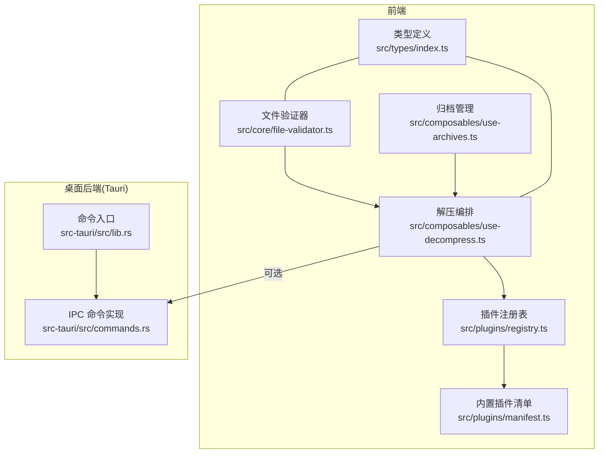
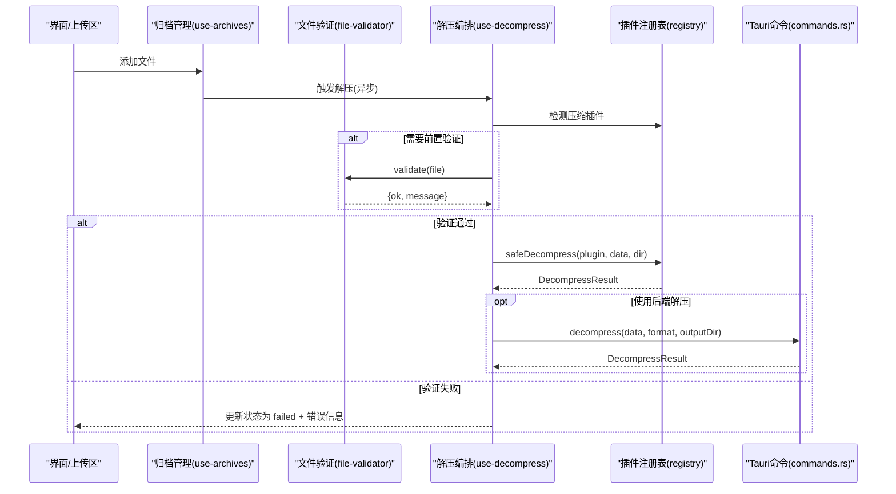
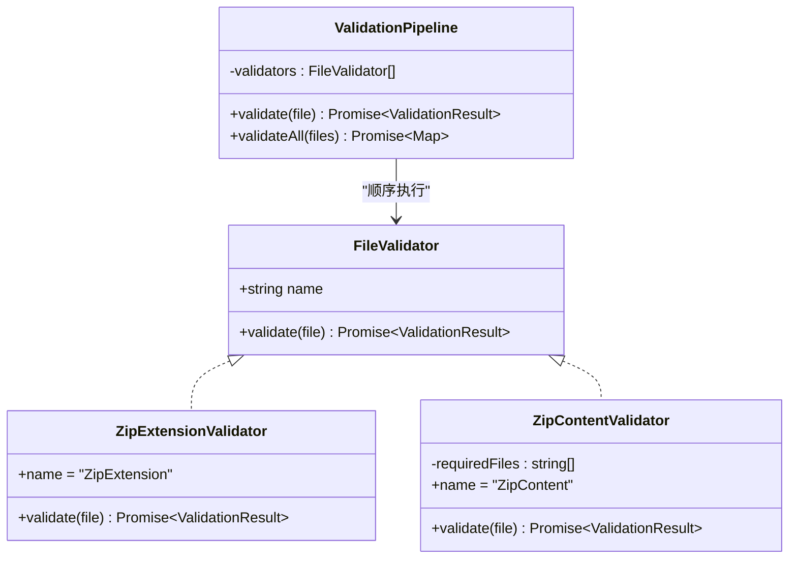
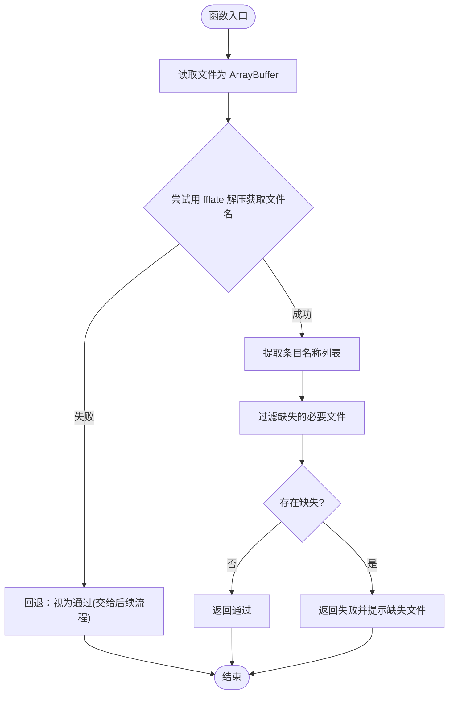
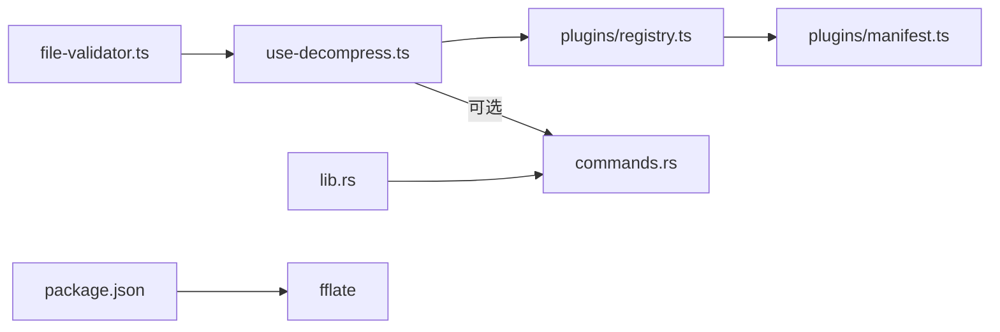

# 文件验证系统

<cite>
**本文引用的文件**   
- [src/core/file-validator.ts](file://src/core/file-validator.ts)
- [src/composables/use-decompress.ts](file://src/composables/use-decompress.ts)
- [src/composables/use-archives.ts](file://src/composables/use-archives.ts)
- [src/plugins/registry.ts](file://src/plugins/registry.ts)
- [src/plugins/manifest.ts](file://src/plugins/manifest.ts)
- [src-tauri/src/lib.rs](file://src-tauri/src/lib.rs)
- [src-tauri/src/commands.rs](file://src-tauri/src/commands.rs)
- [src/types/index.ts](file://src/types/index.ts)
- [README.md](file://README.md)
- [package.json](file://package.json)
</cite>

## 目录
1. [简介](#简介)
2. [项目结构](#项目结构)
3. [核心组件](#核心组件)
4. [架构总览](#架构总览)
5. [详细组件分析](#详细组件分析)
6. [依赖关系分析](#依赖关系分析)
7. [性能考量](#性能考量)
8. [故障排查指南](#故障排查指南)
9. [结论](#结论)
10. [附录](#附录)

## 简介
本文件验证系统为跨平台日志解析工具的前端校验层，采用策略链模式对上传的压缩包进行快速、可扩展的合法性检查。其目标是在解压前尽早拦截非法或损坏的文件，减少不必要的 IO 与计算开销，同时提供清晰的错误提示与可插拔的检查规则扩展点。

## 项目结构
围绕“文件验证”的关键代码位于前端 core 与 composables 层，并与插件注册表、Tauri 后端命令形成协作闭环：
- 前端验证器：定义统一接口与默认管线，内置 ZIP 扩展名与内容完整性检查
- 解压编排：在验证通过后进入任务调度与插件化解压流程
- 插件注册：按扩展名检测压缩/解析插件，并提供超时保护与安全包装
- Tauri 后端：暴露文件读写、mmap 读取、解压等命令供前端调用（当前验证阶段主要在前端完成）

图表来源
- [src/core/file-validator.ts:1-139](file://src/core/file-validator.ts#L1-L139)
- [src/composables/use-archives.ts:1-149](file://src/composables/use-archives.ts#L1-L149)
- [src/composables/use-decompress.ts:1-89](file://src/composables/use-decompress.ts#L1-L89)
- [src/plugins/registry.ts:1-118](file://src/plugins/registry.ts#L1-L118)
- [src/plugins/manifest.ts:1-20](file://src/plugins/manifest.ts#L1-L20)
- [src-tauri/src/lib.rs:1-23](file://src-tauri/src/lib.rs#L1-L23)
- [src-tauri/src/commands.rs:1-82](file://src-tauri/src/commands.rs#L1-L82)
- [src/types/index.ts:1-74](file://src/types/index.ts#L1-L74)

章节来源
- [README.md:1-140](file://README.md#L1-L140)
- [package.json:1-42](file://package.json#L1-L42)

## 核心组件
- 验证器接口与结果模型：统一的 FileValidator 接口与 ValidationResult 返回结构，便于新增检查规则
- 内置验证器：
  - ZipExtensionValidator：仅允许 .zip 扩展名
  - ZipContentValidator：使用 fflate 同步解压获取文件名列表，校验必要文件是否存在（如 VERSION.txt），失败时给出明确提示
- 验证管线 ValidationPipeline：顺序执行所有验证器，短路返回首个失败结果；支持批量验证
- 默认管线与单例工厂：通过 getFileValidator() 获取默认实例，resetFileValidator() 用于测试重置

章节来源
- [src/core/file-validator.ts:1-139](file://src/core/file-validator.ts#L1-L139)

## 架构总览
文件验证系统与后续解压流程的交互如下：
- 用户上传文件后，归档管理器创建条目并触发解压编排
- 解压编排在开始阶段优先进行插件检测与必要的预检（例如扩展名、内容完整性）
- 验证通过后，进入任务调度与插件化解压；若验证失败则直接标记失败状态并提示

图表来源
- [src/composables/use-archives.ts:1-149](file://src/composables/use-archives.ts#L1-L149)
- [src/composables/use-decompress.ts:1-89](file://src/composables/use-decompress.ts#L1-L89)
- [src/core/file-validator.ts:1-139](file://src/core/file-validator.ts#L1-L139)
- [src/plugins/registry.ts:1-118](file://src/plugins/registry.ts#L1-L118)
- [src-tauri/src/commands.rs:1-82](file://src-tauri/src/commands.rs#L1-L82)

## 详细组件分析

### 验证器接口与结果模型
- 设计要点
  - 每个验证器实现统一接口，具备 name 标识与异步 validate 方法
  - 返回结构包含 ok 与可选 message，便于短路失败与用户提示
- 复杂度
  - 单个验证器时间复杂度取决于具体实现（扩展名检查 O(1)，ZIP 内容检查与 fflate 相关）
  - 空间复杂度受输入文件大小影响（ZIP 内容检查需加载 ArrayBuffer）

章节来源
- [src/core/file-validator.ts:1-139](file://src/core/file-validator.ts#L1-L139)

#### 类图：验证器与管线

图表来源
- [src/core/file-validator.ts:1-139](file://src/core/file-validator.ts#L1-L139)

### 内置验证器详解
- ZipExtensionValidator
  - 行为：仅接受 .zip 扩展名，否则返回失败消息
  - 适用场景：快速拒绝非目标格式，避免后续 IO
- ZipContentValidator
  - 行为：读取文件 ArrayBuffer，使用 fflate 的 unzipSync 获取文件名列表，校验必要文件是否存在（支持精确匹配与后缀匹配）
  - 容错：无法解析时视为通过，交由后续解压流程处理；异常时返回失败消息
  - 性能：零拷贝仅枚举文件名，不读取内容，降低内存占用

章节来源
- [src/core/file-validator.ts:24-80](file://src/core/file-validator.ts#L24-L80)

#### 流程图：ZIP 内容校验算法

图表来源
- [src/core/file-validator.ts:41-80](file://src/core/file-validator.ts#L41-L80)

### 验证管线与默认实例
- 行为
  - 顺序执行所有验证器，遇到第一个失败即短路返回
  - 支持批量验证，但同样在首个失败处停止
- 单例工厂
  - getFileValidator() 返回默认管线实例
  - resetFileValidator() 用于测试环境重置

章节来源
- [src/core/file-validator.ts:82-139](file://src/core/file-validator.ts#L82-L139)

### 与解压编排的集成
- 归档管理
  - 添加文件后异步持久化元数据，并触发解压编排
- 解压编排
  - 优先使用当次会话中的 File 对象，避免重复 IO
  - 缓存恢复场景下从存储层按需读取二进制数据
  - 通过插件注册表检测压缩插件并安全执行解压（带超时保护）
  - 构建文件树并更新归档统计信息

章节来源
- [src/composables/use-archives.ts:1-149](file://src/composables/use-archives.ts#L1-L149)
- [src/composables/use-decompress.ts:1-89](file://src/composables/use-decompress.ts#L1-L89)

### 插件注册表与安全包装
- 功能
  - 维护压缩与解析插件映射，支持按扩展名检测
  - 提供 enable/disable 控制插件启用状态
  - safeParse/safeDecompress 包裹插件调用，设置超时并捕获异常
- 超时保护
  - 默认超时 30 秒，防止插件长时间阻塞主流程

章节来源
- [src/plugins/registry.ts:1-118](file://src/plugins/registry.ts#L1-L118)
- [src/plugins/manifest.ts:1-20](file://src/plugins/manifest.ts#L1-L20)

### Tauri 后端命令（可选路径）
- 命令注册
  - lib.rs 中集中注册 IPC 命令，包括文件读写、mmap 读取、解压等
- 解压命令
  - commands.rs 根据格式分发到 zip/gzip 解压逻辑，返回统一结果结构

章节来源
- [src-tauri/src/lib.rs:1-23](file://src-tauri/src/lib.rs#L1-L23)
- [src-tauri/src/commands.rs:1-82](file://src-tauri/src/commands.rs#L1-L82)

## 依赖关系分析
- 运行时依赖
  - fflate：Web 端 ZIP 解压回退，用于内容校验与轻量解压
  - @tauri-apps/api：Tauri IPC 客户端（当前验证阶段未直接调用）
- 模块耦合
  - file-validator 与 use-decompress 松耦合，通过统一接口与返回值约定协作
  - registry 作为插件发现与执行中心，被解压编排与解析流程共用
- 外部依赖
  - Tauri 命令提供底层文件操作与原生解压能力，可作为前端回退或增强路径

图表来源
- [src/core/file-validator.ts:1-139](file://src/core/file-validator.ts#L1-L139)
- [src/composables/use-decompress.ts:1-89](file://src/composables/use-decompress.ts#L1-L89)
- [src/plugins/registry.ts:1-118](file://src/plugins/registry.ts#L1-L118)
- [src/plugins/manifest.ts:1-20](file://src/plugins/manifest.ts#L1-L20)
- [src-tauri/src/lib.rs:1-23](file://src-tauri/src/lib.rs#L1-L23)
- [src-tauri/src/commands.rs:1-82](file://src-tauri/src/commands.rs#L1-L82)
- [package.json:1-42](file://package.json#L1-L42)

章节来源
- [package.json:1-42](file://package.json#L1-L42)

## 性能考量
- 验证阶段
  - 扩展名检查为 O(1)，几乎无额外开销
  - ZIP 内容校验仅枚举文件名，避免读取内容，显著降低内存与 CPU 消耗
- 解压阶段
  - 优先使用内存中的 File 对象，避免重复 IO
  - 任务调度器限制并发数，防止大文件解压导致 UI 卡顿
- 超时保护
  - 插件执行设置超时，避免长时间阻塞

[本节为通用指导，无需特定文件引用]

## 故障排查指南
- 常见错误与定位
  - 不支持的文件格式：由扩展名验证器返回，确认上传文件是否为 .zip
  - 缺少必要文件：由内容验证器返回，检查压缩包是否包含必需文件（如 VERSION.txt）
  - 无法读取压缩包内容：可能文件已损坏或 fflate 解析失败，建议重新上传或使用后端解压路径
  - 插件超时或未知错误：查看插件注册表的安全包装返回的错误信息，必要时禁用问题插件
- 调试建议
  - 使用 resetFileValidator() 重置默认管线以隔离测试
  - 在 use-decompress 中观察进度更新与错误字段，定位失败阶段
  - 通过 Tauri 命令日志辅助判断后端解压是否成功

章节来源
- [src/core/file-validator.ts:24-80](file://src/core/file-validator.ts#L24-L80)
- [src/composables/use-decompress.ts:16-77](file://src/composables/use-decompress.ts#L16-L77)
- [src/plugins/registry.ts:98-116](file://src/plugins/registry.ts#L98-L116)

## 结论
该文件验证系统以策略链为核心，将快速、低成本的预检查与可扩展的插件体系结合，有效提升了整体健壮性与用户体验。通过明确的错误提示与短路机制，能够在早期阻断无效或损坏的输入，并将资源集中于合法文件的处理。未来可在以下方面继续优化：
- 增加更多内置验证器（如大小上限、签名校验）
- 引入更细粒度的进度反馈与断点续传
- 在后端提供更强的解压与校验能力，作为前端回退路径

[本节为总结性内容，无需特定文件引用]

## 附录
- 关键类型定义
  - ArchiveItem、DecompressResult、FileEntry 等贯穿归档、解压与展示流程

章节来源
- [src/types/index.ts:1-74](file://src/types/index.ts#L1-L74)