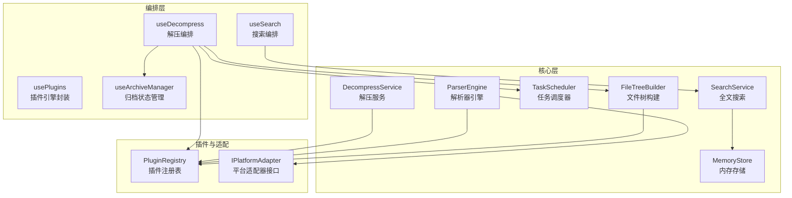
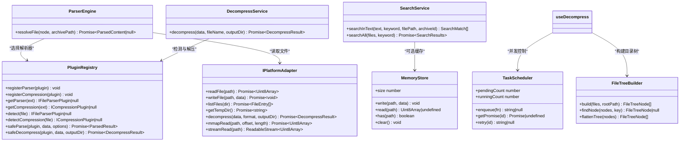
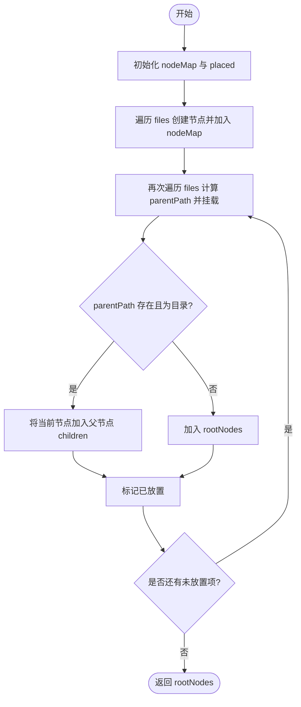
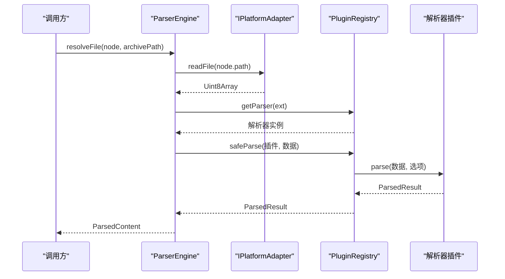
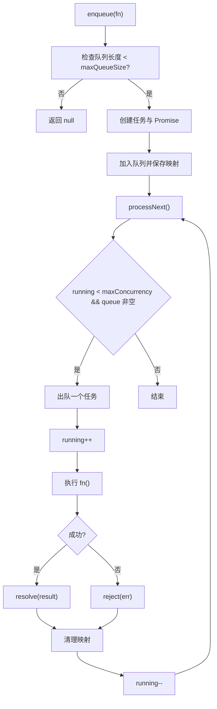
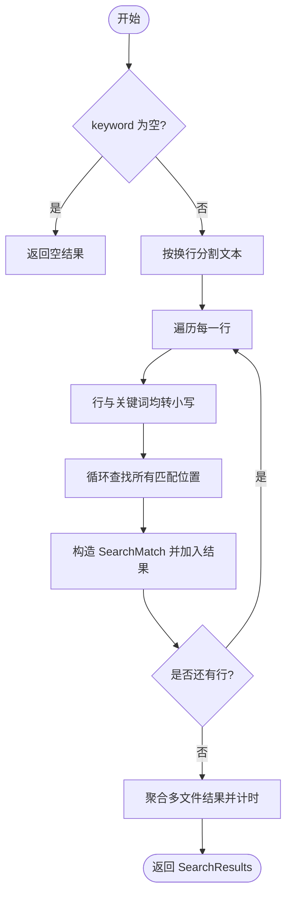
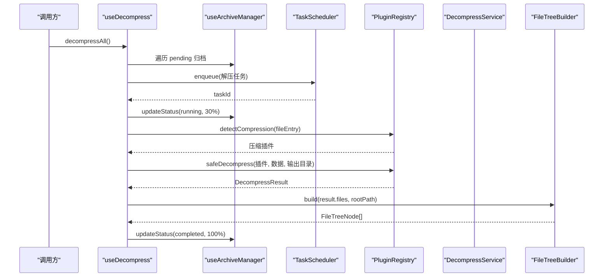
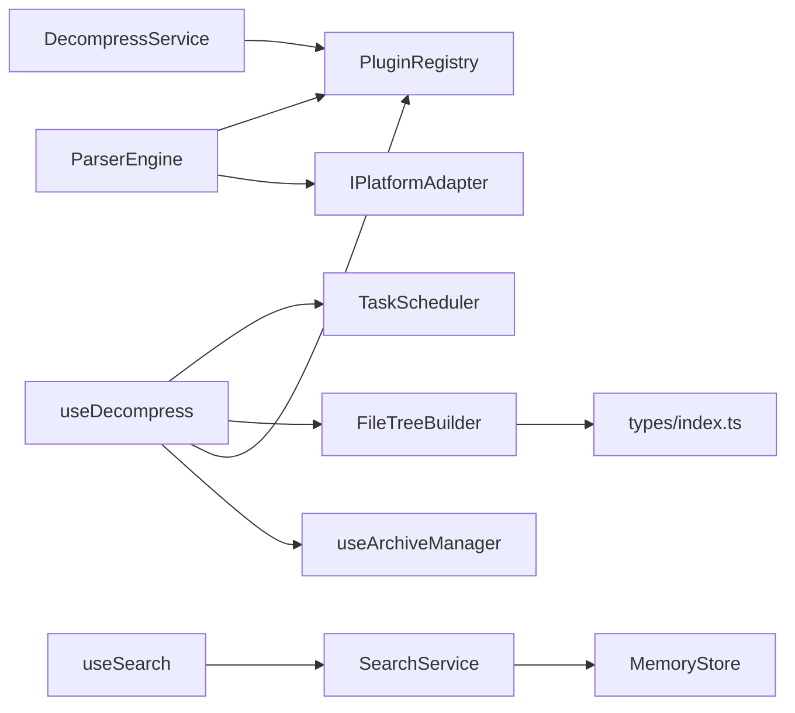

# 核心模块

<cite>
**本文引用的文件**   
- [file-tree.ts](file://src/core/file-tree.ts)
- [parser-engine.ts](file://src/core/parser-engine.ts)
- [task-scheduler.ts](file://src/core/task-scheduler.ts)
- [search.ts](file://src/core/search.ts)
- [decompress.ts](file://src/core/decompress.ts)
- [memory-store.ts](file://src/core/memory-store.ts)
- [registry.ts](file://src/plugins/registry.ts)
- [types.ts](file://src/types/index.ts)
- [adapters-types.ts](file://src/adapters/types.ts)
- [use-plugins.ts](file://src/composables/use-plugins.ts)
- [use-decompress.ts](file://src/composables/use-decompress.ts)
- [use-search.ts](file://src/composables/use-search.ts)
- [use-archives.ts](file://src/composables/use-archives.ts)
- [file-tree.test.ts](file://src/__tests__\core\file-tree.test.ts)
- [task-scheduler.test.ts](file://src/__tests__\core\task-scheduler.test.ts)
- [search.test.ts](file://src/__tests__\core\search.test.ts)
</cite>

## 目录
1. [简介](#简介)
2. [项目结构](#项目结构)
3. [核心组件](#核心组件)
4. [架构总览](#架构总览)
5. [详细组件分析](#详细组件分析)
6. [依赖关系分析](#依赖关系分析)
7. [性能考量](#性能考量)
8. [故障排查指南](#故障排查指南)
9. [结论](#结论)
10. [附录：使用示例与最佳实践](#附录使用示例与最佳实践)

## 简介
本技术文档聚焦 Hello-Tauri 的核心模块，围绕以下能力进行系统化说明：
- 文件树构建算法：将扁平的文件列表组装为可渲染的树形结构。
- 解析器引擎：基于插件注册表动态选择并安全执行文件解析。
- 任务调度器：控制并发、队列容量与重试机制，保障系统稳定性。
- 全文搜索服务：对文本内容进行逐行匹配与结果聚合。
- 解压服务编排：从压缩格式识别到结果树构建的完整流程。
- 内存存储管理：提供轻量级键值缓存用于临时数据存取。

文档同时给出接口定义、数据流转、错误处理策略、依赖关系图、时序图与流程图，并提供集成与扩展建议、性能调优与最佳实践。

## 项目结构
核心模块位于 src/core，配合插件注册表与组合式 API 完成上层业务编排。关键路径如下：
- 核心实现：file-tree.ts、parser-engine.ts、task-scheduler.ts、search.ts、decompress.ts、memory-store.ts
- 插件与平台适配：plugins/registry.ts、adapters/types.ts
- 组合式编排：composables/use-plugins.ts、use-decompress.ts、use-search.ts、use-archives.ts
- 类型定义：types/index.ts
- 单元测试：__tests__/core/*

图表来源
- [file-tree.ts:1-69](file://src/core/file-tree.ts#L1-L69)
- [parser-engine.ts:1-35](file://src/core/parser-engine.ts#L1-L35)
- [task-scheduler.ts:1-79](file://src/core/task-scheduler.ts#L1-L79)
- [search.ts:1-49](file://src/core/search.ts#L1-L49)
- [decompress.ts:1-27](file://src/core/decompress.ts#L1-L27)
- [memory-store.ts:1-26](file://src/core/memory-store.ts#L1-L26)
- [registry.ts:1-118](file://src/plugins/registry.ts#L1-L118)
- [adapters-types.ts:1-12](file://src/adapters/types.ts#L1-L12)
- [use-plugins.ts:1-17](file://src/composables/use-plugins.ts#L1-L17)
- [use-decompress.ts:1-74](file://src/composables/use-decompress.ts#L1-L74)
- [use-search.ts:1-28](file://src/composables/use-search.ts#L1-L28)
- [use-archives.ts:1-60](file://src/composables/use-archives.ts#L1-L60)

章节来源
- [file-tree.ts:1-69](file://src/core/file-tree.ts#L1-L69)
- [parser-engine.ts:1-35](file://src/core/parser-engine.ts#L1-L35)
- [task-scheduler.ts:1-79](file://src/core/task-scheduler.ts#L1-L79)
- [search.ts:1-49](file://src/core/search.ts#L1-L49)
- [decompress.ts:1-27](file://src/core/decompress.ts#L1-L27)
- [memory-store.ts:1-26](file://src/core/memory-store.ts#L1-L26)
- [registry.ts:1-118](file://src/plugins/registry.ts#L1-L118)
- [adapters-types.ts:1-12](file://src/adapters/types.ts#L1-L12)
- [use-plugins.ts:1-17](file://src/composables/use-plugins.ts#L1-L17)
- [use-decompress.ts:1-74](file://src/composables/use-decompress.ts#L1-L74)
- [use-search.ts:1-28](file://src/composables/use-search.ts#L1-L28)
- [use-archives.ts:1-60](file://src/composables/use-archives.ts#L1-L60)

## 核心组件
本节概述各核心模块的职责边界、主要接口与数据流。

- 文件树构建（FileTreeBuilder）
  - 职责：将扁平 FileEntry[] 构造成以根节点为起点的树结构；支持按 key 查找与扁平化遍历。
  - 关键方法：build(files, rootPath)、findNode(nodes, key)、flattenTree(nodes)。
  - 复杂度：构建 O(n)，查找最坏 O(n)（退化为链），扁平化 O(n)。
  - 适用场景：归档解压后生成可视化目录树。

- 解析器引擎（ParserEngine）
  - 职责：读取文件内容，根据扩展名通过注册表选择解析器，统一返回 ParsedContent。
  - 关键方法：resolveFile(node, archivePath)。
  - 错误处理：捕获异常并返回 null；超时由注册表 safeParse 兜底。
  - 依赖：IPlatformAdapter、PluginRegistry。

- 任务调度器（TaskScheduler）
  - 职责：限制最大并发、维护队列长度、提供重试与 Promise 追踪。
  - 关键方法：enqueue(fn)、getPromise(id)、retry(id)、processNext()。
  - 特性：maxConcurrency、maxQueueSize、runningCount/pendingCount。
  - 适用场景：批量解压、批量解析等 IO/CPU 混合任务。

- 全文搜索服务（SearchService）
  - 职责：对文本按行进行不区分大小写的关键词匹配，聚合多文件结果。
  - 关键方法：searchInText(text, keyword, filePath, archiveId)、searchAll(files, keyword)。
  - 输出：SearchResults 包含 matches 与 searchTimeMs。

- 解压服务（DecompressService）
  - 职责：根据文件名检测压缩插件，调用注册表安全解压，返回 DecompressResult。
  - 关键方法：decompress(data, fileName, outputDir)。
  - 错误处理：无匹配插件或异常时返回失败结果与错误信息。

- 内存存储（MemoryStore）
  - 职责：提供简单的键值缓存（Uint8Array）。
  - 关键方法：write/read/has/clear/size。
  - 适用场景：临时缓冲、小对象缓存。

章节来源
- [file-tree.ts:1-69](file://src/core/file-tree.ts#L1-L69)
- [parser-engine.ts:1-35](file://src/core/parser-engine.ts#L1-L35)
- [task-scheduler.ts:1-79](file://src/core/task-scheduler.ts#L1-L79)
- [search.ts:1-49](file://src/core/search.ts#L1-L49)
- [decompress.ts:1-27](file://src/core/decompress.ts#L1-L27)
- [memory-store.ts:1-26](file://src/core/memory-store.ts#L1-L26)

## 架构总览
下图展示了核心模块之间的协作关系与数据流向。

图表来源
- [adapters-types.ts:1-12](file://src/adapters/types.ts#L1-L12)
- [registry.ts:1-118](file://src/plugins/registry.ts#L1-L118)
- [file-tree.ts:1-69](file://src/core/file-tree.ts#L1-L69)
- [parser-engine.ts:1-35](file://src/core/parser-engine.ts#L1-L35)
- [task-scheduler.ts:1-79](file://src/core/task-scheduler.ts#L1-L79)
- [search.ts:1-49](file://src/core/search.ts#L1-L49)
- [decompress.ts:1-27](file://src/core/decompress.ts#L1-L27)
- [memory-store.ts:1-26](file://src/core/memory-store.ts#L1-L26)

## 详细组件分析

### 文件树构建算法（FileTreeBuilder）
- 设计要点
  - 两遍扫描：第一遍建立 path->node 映射，第二遍依据 parentPath 挂载子节点。
  - 根节点判定：当 file.path === rootPath 时作为顶层节点。
  - 静态工具：findNode 递归查找；flattenTree 深度优先展开。
- 复杂度
  - build: O(n) 时间、O(n) 空间（Map/Set）。
  - findNode: 最坏 O(n)。
  - flattenTree: O(n)。
- 错误与边界
  - 空输入直接返回空数组。
  - 缺失父节点时自动提升为根节点。
- 测试覆盖
  - 构建、空输入、查找、扁平化等用例。

图表来源
- [file-tree.ts:1-69](file://src/core/file-tree.ts#L1-L69)

章节来源
- [file-tree.ts:1-69](file://src/core/file-tree.ts#L1-L69)
- [file-tree.test.ts:1-52](file://src/__tests__\core\file-tree.test.ts#L1-L52)

### 解析器引擎（ParserEngine）
- 职责边界
  - 负责“读文件 -> 选插件 -> 解析 -> 包装结果”的端到端流程。
  - 不关心具体解析逻辑，仅做编排与度量。
- 数据流
  - 输入：FileTreeNode、archivePath。
  - 中间：通过 IPlatformAdapter.readFile 获取二进制数据；根据扩展名选择解析器。
  - 输出：ParsedContent（含 type、data、lineCount、loadTimeMs、pluginName）。
- 错误处理
  - 捕获异常返回 null；插件解析失败由注册表 safeParse 降级为 hex。
- 性能指标
  - loadTimeMs 记录单次解析耗时，便于监控。

图表来源
- [parser-engine.ts:1-35](file://src/core/parser-engine.ts#L1-L35)
- [registry.ts:1-118](file://src/plugins/registry.ts#L1-L118)
- [adapters-types.ts:1-12](file://src/adapters/types.ts#L1-L12)

章节来源
- [parser-engine.ts:1-35](file://src/core/parser-engine.ts#L1-L35)
- [registry.ts:1-118](file://src/plugins/registry.ts#L1-L118)
- [adapters-types.ts:1-12](file://src/adapters/types.ts#L1-L12)

### 任务调度器（TaskScheduler）
- 并发控制
  - 通过 running 计数与 processNext 循环保证不超过 maxConcurrency。
  - 队列满时 enqueue 返回 null，避免无限增长。
- 生命周期
  - enqueue 创建 Promise 并保存 id->promise 映射；finally 中递减 running 并继续消费队列。
- 重试机制
  - retry 删除旧 promise 与函数引用，重新入队同一函数。
- 典型用法
  - 在解压编排中，每个归档任务入队，失败则更新状态并记录错误。

图表来源
- [task-scheduler.ts:1-79](file://src/core/task-scheduler.ts#L1-L79)

章节来源
- [task-scheduler.ts:1-79](file://src/core/task-scheduler.ts#L1-L79)
- [task-scheduler.test.ts:1-57](file://src/__tests__\core\task-scheduler.test.ts#L1-L57)

### 全文搜索服务（SearchService）
- 算法
  - 逐行拆分文本，小写化关键词与行内容，使用 indexOf 循环定位所有匹配位置。
  - 聚合多文件结果，统计耗时。
- 数据结构
  - SearchMatch 包含文件上下文、行号、匹配区间等。
  - SearchResults 汇总 keyword、matches 与 searchTimeMs。
- 可扩展性
  - 可结合 MemoryStore 缓存热点文件或索引以提升性能。

图表来源
- [search.ts:1-49](file://src/core/search.ts#L1-L49)

章节来源
- [search.ts:1-49](file://src/core/search.ts#L1-L49)
- [search.test.ts:1-35](file://src/__tests__\core\search.test.ts#L1-L35)

### 解压服务编排（DecompressService 与 useDecompress）
- 职责分工
  - DecompressService：根据文件名检测压缩插件，调用注册表安全解压。
  - useDecompress：编排归档状态、并发解压、进度更新与目录树构建。
- 流程
  - 读取文件 ArrayBuffer -> 构造 FileEntry -> 检测压缩插件 -> 安全解压 -> 构建文件树 -> 更新原始大小与状态。
- 错误处理
  - 无插件、解压失败、异常均会更新状态为 failed 并记录 error。
- 并发
  - 通过 TaskScheduler 控制并行度，避免资源争用。

图表来源
- [use-decompress.ts:1-74](file://src/composables/use-decompress.ts#L1-L74)
- [use-archives.ts:1-60](file://src/composables/use-archives.ts#L1-L60)
- [registry.ts:1-118](file://src/plugins/registry.ts#L1-L118)
- [file-tree.ts:1-69](file://src/core/file-tree.ts#L1-L69)
- [task-scheduler.ts:1-79](file://src/core/task-scheduler.ts#L1-L79)
- [decompress.ts:1-27](file://src/core/decompress.ts#L1-L27)

章节来源
- [use-decompress.ts:1-74](file://src/composables/use-decompress.ts#L1-L74)
- [use-archives.ts:1-60](file://src/composables/use-archives.ts#L1-L60)
- [registry.ts:1-118](file://src/plugins/registry.ts#L1-L118)
- [file-tree.ts:1-69](file://src/core/file-tree.ts#L1-L69)
- [task-scheduler.ts:1-79](file://src/core/task-scheduler.ts#L1-L79)
- [decompress.ts:1-27](file://src/core/decompress.ts#L1-L27)

### 内存存储（MemoryStore）
- 设计要点
  - 基于 Map<string, Uint8Array> 的简单键值存储。
  - 提供 size 属性便于监控占用条目数。
- 使用建议
  - 适合短期缓存与跨模块共享的小对象；注意及时 clear 释放内存。

章节来源
- [memory-store.ts:1-26](file://src/core/memory-store.ts#L1-L26)

## 依赖关系分析
- 耦合与内聚
  - 核心模块低耦合：通过接口 IPlatformAdapter 与 PluginRegistry 解耦平台与插件实现。
  - 高内聚：每个类职责单一，易于测试与替换。
- 外部依赖
  - 插件注册表提供解析与压缩的统一入口，屏蔽具体实现差异。
  - 平台适配器抽象文件系统与 IO 操作，便于 Tauri/Web 环境切换。
- 潜在循环依赖
  - 当前结构未见循环导入；组合式 API 仅依赖核心与注册表。

图表来源
- [file-tree.ts:1-69](file://src/core/file-tree.ts#L1-L69)
- [parser-engine.ts:1-35](file://src/core/parser-engine.ts#L1-L35)
- [decompress.ts:1-27](file://src/core/decompress.ts#L1-L27)
- [registry.ts:1-118](file://src/plugins/registry.ts#L1-L118)
- [adapters-types.ts:1-12](file://src/adapters/types.ts#L1-L12)
- [task-scheduler.ts:1-79](file://src/core/task-scheduler.ts#L1-L79)
- [use-decompress.ts:1-74](file://src/composables/use-decompress.ts#L1-L74)
- [use-search.ts:1-28](file://src/composables/use-search.ts#L1-L28)
- [search.ts:1-49](file://src/core/search.ts#L1-L49)
- [memory-store.ts:1-26](file://src/core/memory-store.ts#L1-L26)
- [types.ts:1-71](file://src/types/index.ts#L1-L71)

章节来源
- [types.ts:1-71](file://src/types/index.ts#L1-L71)
- [use-plugins.ts:1-17](file://src/composables/use-plugins.ts#L1-L17)

## 性能考量
- 文件树构建
  - 使用 Map/Set 降低重复计算，整体线性复杂度；避免深层嵌套导致的栈溢出风险。
- 解析器引擎
  - 通过 performance.now 记录耗时；建议在上层对大文件采用分块或流式读取（借助 streamRead/mmapRead）。
- 任务调度器
  - 合理设置 maxConcurrency 与 maxQueueSize，避免阻塞主线程与内存暴涨。
- 全文搜索
  - 对超大文本建议引入分片或倒排索引；可结合 MemoryStore 缓存已解析文本。
- 解压服务
  - 使用注册表的 withTimeout 防止长时间阻塞；失败快速失败并回滚状态。
- 内存存储
  - 定期清理无用键值；监控 size 变化，必要时触发 GC 友好策略。

[本节为通用性能指导，无需特定文件来源]

## 故障排查指南
- 常见问题
  - 任务队列已满：enqueue 返回 null，需增大 maxQueueSize 或优化任务粒度。
  - 插件超时：注册表 withTimeout 抛出超时错误，检查插件实现与超时阈值。
  - 无匹配插件：检测失败导致解压/解析失败，确认扩展名与插件注册。
  - 搜索结果为空：关键词为空或大小写不一致，确保预处理一致。
- 定位手段
  - 利用 loadTimeMs、searchTimeMs 等指标定位瓶颈。
  - 使用 runningCount/pendingCount 观察调度器负载。
  - 通过 ArchiveItem.error 字段查看失败原因。

章节来源
- [task-scheduler.ts:1-79](file://src/core/task-scheduler.ts#L1-L79)
- [registry.ts:1-118](file://src/plugins/registry.ts#L1-L118)
- [parser-engine.ts:1-35](file://src/core/parser-engine.ts#L1-L35)
- [search.ts:1-49](file://src/core/search.ts#L1-L49)
- [use-decompress.ts:1-74](file://src/composables/use-decompress.ts#L1-L74)

## 结论
Hello-Tauri 的核心模块以清晰的职责边界与松耦合设计实现了文件树构建、解析、并发调度、搜索、解压与内存缓存等关键能力。通过插件注册表与平台适配器，系统具备良好的可扩展性与跨环境兼容性。配合合理的并发与超时策略、完善的错误处理与指标埋点，可在复杂场景下保持稳健与高性能。

[本节为总结性内容，无需特定文件来源]

## 附录：使用示例与最佳实践
- 使用文件树构建
  - 输入：FileEntry[] 与根路径。
  - 输出：FileTreeNode[]，可用于 UI 渲染。
  - 参考：[file-tree.ts:7-44](file://src/core/file-tree.ts#L7-L44)
- 使用解析器引擎
  - 步骤：传入 FileTreeNode 与归档路径，等待 ParsedContent。
  - 参考：[parser-engine.ts:11-33](file://src/core/parser-engine.ts#L11-L33)
- 使用任务调度器
  - 步骤：配置并发与队列上限，enqueue 异步任务，必要时 retry。
  - 参考：[task-scheduler.ts:23-49](file://src/core/task-scheduler.ts#L23-L49)
- 使用全文搜索
  - 步骤：准备文件内容集合，调用 searchAll 获取搜索结果。
  - 参考：[search.ts:30-47](file://src/core/search.ts#L30-L47)
- 使用解压服务
  - 步骤：传入压缩数据与文件名，得到 DecompressResult。
  - 参考：[decompress.ts:11-25](file://src/core/decompress.ts#L11-L25)
- 使用内存存储
  - 步骤：write/read/has/clear 管理临时数据。
  - 参考：[memory-store.ts:4-22](file://src/core/memory-store.ts#L4-L22)
- 组合式编排
  - 插件引擎：usePlugins 暴露 registry 与开关能力。
    - 参考：[use-plugins.ts:7-16](file://src/composables/use-plugins.ts#L7-L16)
  - 解压编排：useDecompress 驱动归档状态与进度。
    - 参考：[use-decompress.ts:14-70](file://src/composables/use-decompress.ts#L14-L70)
  - 搜索编排：useSearch 封装搜索状态与结果。
    - 参考：[use-search.ts:9-26](file://src/composables/use-search.ts#L9-L26)
  - 归档管理：useArchiveManager 维护归档列表与统计。
    - 参考：[use-archives.ts:8-58](file://src/composables/use-archives.ts#L8-L58)

章节来源
- [file-tree.ts:7-44](file://src/core/file-tree.ts#L7-L44)
- [parser-engine.ts:11-33](file://src/core/parser-engine.ts#L11-L33)
- [task-scheduler.ts:23-49](file://src/core/task-scheduler.ts#L23-L49)
- [search.ts:30-47](file://src/core/search.ts#L30-L47)
- [decompress.ts:11-25](file://src/core/decompress.ts#L11-L25)
- [memory-store.ts:4-22](file://src/core/memory-store.ts#L4-L22)
- [use-plugins.ts:7-16](file://src/composables/use-plugins.ts#L7-L16)
- [use-decompress.ts:14-70](file://src/composables/use-decompress.ts#L14-L70)
- [use-search.ts:9-26](file://src/composables/use-search.ts#L9-L26)
- [use-archives.ts:8-58](file://src/composables/use-archives.ts#L8-L58)