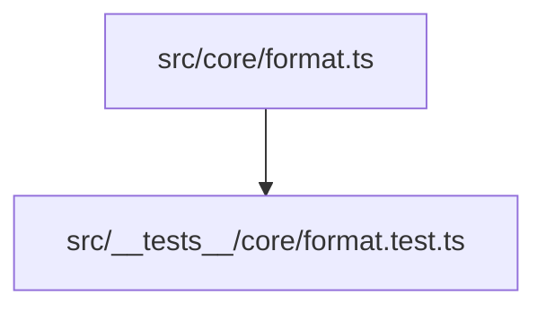
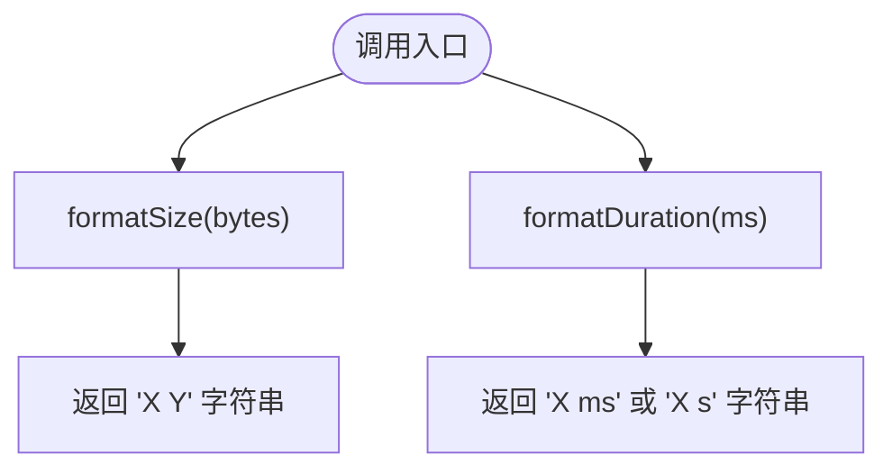
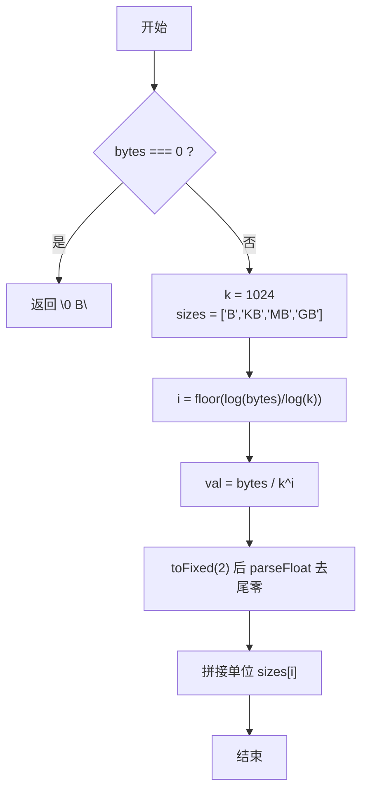
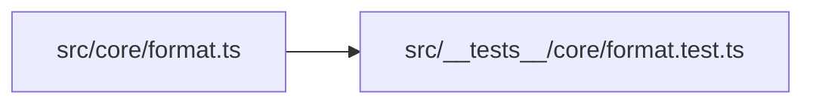

# 格式化工具函数

<cite>
**本文引用的文件**   
- [src/core/format.ts](file://src/core/format.ts)
- [src/__tests__/core/format.test.ts](file://src/__tests__/core/format.test.ts)
</cite>

## 目录
1. [简介](#简介)
2. [项目结构](#项目结构)
3. [核心组件](#核心组件)
4. [架构总览](#架构总览)
5. [详细组件分析](#详细组件分析)
6. [依赖关系分析](#依赖关系分析)
7. [性能考虑](#性能考虑)
8. [故障排查指南](#故障排查指南)
9. [结论](#结论)

## 简介
本章节聚焦于仓库中的通用格式化工具函数，提供将字节数转换为人类可读大小、以及将毫秒时长转换为可读字符串的能力。该工具位于核心模块中，供应用各层复用，具备明确的输入输出约定与完备的单元测试覆盖。

## 项目结构
格式化相关代码集中在 core 目录下的单一文件中，测试用例位于对应的 __tests__ 目录中，便于定位与维护。



图表来源
- [src/core/format.ts:1-19](file://src/core/format.ts#L1-L19)
- [src/__tests__/core/format.test.ts:1-45](file://src/__tests__/core/format.test.ts#L1-L45)

章节来源
- [src/core/format.ts:1-19](file://src/core/format.ts#L1-L19)
- [src/__tests__/core/format.test.ts:1-45](file://src/__tests__/core/format.test.ts#L1-L45)

## 核心组件
- 文件大小格式化：将字节数转换为 B/KB/MB/GB 等人类可读单位，保留两位小数并去除末尾无意义的零。
- 时长格式化：将毫秒值转换为 ms 或 s 单位，小于 1000ms 显示毫秒，否则显示秒并保留两位小数。

章节来源
- [src/core/format.ts:5-18](file://src/core/format.ts#L5-L18)

## 架构总览
从调用方视角看，这两个函数是纯函数，不依赖外部状态或副作用，适合在 UI 展示、日志统计、任务调度结果呈现等场景直接消费。



[此图为概念性流程图，未映射到具体源码文件，故不提供图表来源]

## 详细组件分析

### 文件大小格式化（formatSize）
- 功能说明
  - 输入：非负数字节数
  - 输出：形如 "1.5 MB" 的字符串
  - 边界处理：当输入为 0 时直接返回 "0 B"
  - 单位选择：基于 1024 进制，支持 B、KB、MB、GB
  - 精度控制：数值部分保留两位小数，并通过 parseFloat 去除尾随零
- 复杂度分析
  - 时间复杂度：O(1)，仅涉及对数与幂运算
  - 空间复杂度：O(1)，常数级内存占用
- 关键实现要点
  - 使用对数计算指数位以决定单位
  - 通过 toFixed(2) 控制小数位数
  - 使用 parseFloat 清理多余的小数零
- 示例路径
  - 参考测试用例中对不同量级的断言，可验证 B/KB/MB/GB 的输出行为
    - [src/__tests__/core/format.test.ts:4-30](file://src/__tests__/core/format.test.ts#L4-L30)



图表来源
- [src/core/format.ts:6-12](file://src/core/format.ts#L6-L12)

章节来源
- [src/core/format.ts:6-12](file://src/core/format.ts#L6-L12)
- [src/__tests__/core/format.test.ts:4-30](file://src/__tests__/core/format.test.ts#L4-L30)

### 时长格式化（formatDuration）
- 功能说明
  - 输入：非负毫秒数
  - 输出：小于 1000ms 返回 "X ms"；大于等于 1000ms 返回 "X.XX s"
  - 精度控制：秒单位下保留两位小数
- 复杂度分析
  - 时间复杂度：O(1)
  - 空间复杂度：O(1)
- 关键实现要点
  - 阈值判断 1000ms
  - 使用 toFixed(2) 保证秒单位下的精度
- 示例路径
  - 参考测试用例中对毫秒与秒两种分支的断言
    - [src/__tests__/core/format.test.ts:32-44](file://src/__tests__/core/format.test.ts#L32-L44)

```mermaid
flowchart TD
S["开始"] --> T{"ms < 1000 ?"}
T -- 是 --> RM["返回 \"ms ms\""]
T -- 否 --> RS["返回 \"(ms/1000).toFixed(2) s\""]
RM --> E["结束"]
RS --> E
```

图表来源
- [src/core/format.ts:15-18](file://src/core/format.ts#L15-L18)

章节来源
- [src/core/format.ts:15-18](file://src/core/format.ts#L15-L18)
- [src/__tests__/core/format.test.ts:32-44](file://src/__tests__/core/format.test.ts#L32-L44)

## 依赖关系分析
- 内部依赖
  - format.ts 为纯函数实现，不引入其他模块
- 测试依赖
  - 测试文件通过相对路径导入核心实现，确保行为契约稳定
- 外部依赖
  - 无第三方库依赖，保持轻量与可移植性



图表来源
- [src/core/format.ts:1-19](file://src/core/format.ts#L1-L19)
- [src/__tests__/core/format.test.ts:1-45](file://src/__tests__/core/format.test.ts#L1-L45)

章节来源
- [src/core/format.ts:1-19](file://src/core/format.ts#L1-L19)
- [src/__tests__/core/format.test.ts:1-45](file://src/__tests__/core/format.test.ts#L1-L45)

## 性能考虑
- 两个函数均为 O(1) 时间与空间复杂度，适合高频调用（例如列表渲染、实时统计）。
- 建议
  - 在大量数据渲染场景中，避免重复格式化相同值，可在上层做缓存或惰性求值。
  - 若需扩展更多单位（如 TB），应统一维护单位表与进制常量，避免散落在业务逻辑中。

[本节为通用指导，不涉及具体源码分析]

## 故障排查指南
- 常见问题
  - 传入负数：当前实现未显式处理负数，可能导致异常单位索引或不符合预期的输出。建议在调用前进行参数校验或在函数内增加防御性处理。
  - 超大数值：当前单位表最大到 GB，超出范围会沿用 GB 单位。如需支持更大单位，可扩展单位数组与上限判断。
  - 精度问题：toFixed 会产生浮点舍入误差，已通过 parseFloat 去除尾随零，但仍需注意极端大数的显示一致性。
- 回归验证
  - 运行现有测试用例，确认边界值与典型量级输出符合预期
    - [src/__tests__/core/format.test.ts:4-44](file://src/__tests__/core/format.test.ts#L4-L44)

章节来源
- [src/__tests__/core/format.test.ts:4-44](file://src/__tests__/core/format.test.ts#L4-L44)

## 结论
该格式化工具函数以极简实现提供了常用的“大小”和“时长”展示能力，具备清晰的接口契约与完整的单测覆盖。其纯函数特性使其易于集成与测试，适合作为基础工具被多处复用。后续可按需在单位扩展、精度策略与参数校验方面持续完善。