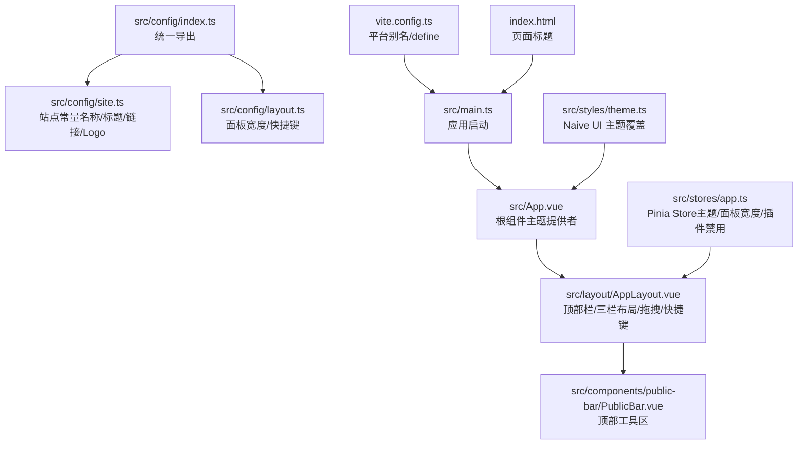
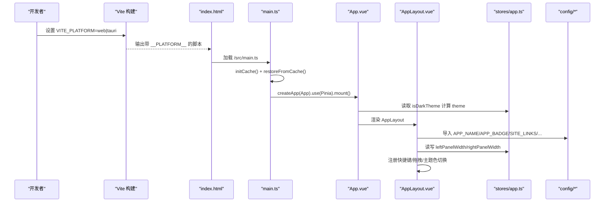
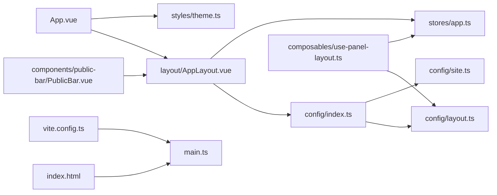

# 站点配置系统

<cite>
**本文引用的文件**   
- [src/config/index.ts](file://src/config/index.ts)
- [src/config/site.ts](file://src/config/site.ts)
- [src/config/layout.ts](file://src/config/layout.ts)
- [src/main.ts](file://src/main.ts)
- [src/App.vue](file://src/App.vue)
- [src/layout/AppLayout.vue](file://src/layout/AppLayout.vue)
- [src/stores/app.ts](file://src/stores/app.ts)
- [src/styles/theme.ts](file://src/styles/theme.ts)
- [src/composables/use-panel-layout.ts](file://src/composables/use-panel-layout.ts)
- [src/components/public-bar/PublicBar.vue](file://src/components/public-bar/PublicBar.vue)
- [vite.config.ts](file://vite.config.ts)
- [index.html](file://index.html)
- [package.json](file://package.json)
- [README.md](file://README.md)
</cite>

## 目录
1. [简介](#简介)
2. [项目结构](#项目结构)
3. [核心组件](#核心组件)
4. [架构总览](#架构总览)
5. [详细组件分析](#详细组件分析)
6. [依赖关系分析](#依赖关系分析)
7. [性能与可维护性](#性能与可维护性)
8. [故障排查指南](#故障排查指南)
9. [结论](#结论)
10. [附录](#附录)

## 简介
本文件聚焦“站点配置系统”，围绕应用名称、页面标题、Logo、外部链接、面板布局尺寸、快捷键等全局配置，以及主题色与平台构建策略进行系统化说明。目标是帮助开发者快速理解并扩展站点级配置，确保前后端一致性与可维护性。

## 项目结构
站点配置相关代码集中在 src/config 目录，并通过统一的入口导出；布局常量与快捷键定义在 layout 配置中；运行时通过 App 根组件与布局组件消费这些配置；构建期由 Vite 注入平台变量以适配不同运行环境。

图表来源
- [src/config/index.ts:1-3](file://src/config/index.ts#L1-L3)
- [src/config/site.ts:1-51](file://src/config/site.ts#L1-L51)
- [src/config/layout.ts:1-22](file://src/config/layout.ts#L1-L22)
- [src/main.ts:1-23](file://src/main.ts#L1-L23)
- [src/App.vue:1-24](file://src/App.vue#L1-L24)
- [src/layout/AppLayout.vue:1-331](file://src/layout/AppLayout.vue#L1-L331)
- [src/components/public-bar/PublicBar.vue:1-50](file://src/components/public-bar/PublicBar.vue#L1-L50)
- [src/stores/app.ts:1-97](file://src/stores/app.ts#L1-L97)
- [src/styles/theme.ts:1-26](file://src/styles/theme.ts#L1-L26)
- [vite.config.ts:1-29](file://vite.config.ts#L1-L29)
- [index.html:1-14](file://index.html#L1-L14)

章节来源
- [src/config/index.ts:1-3](file://src/config/index.ts#L1-L3)
- [src/config/site.ts:1-51](file://src/config/site.ts#L1-L51)
- [src/config/layout.ts:1-22](file://src/config/layout.ts#L1-L22)
- [src/main.ts:1-23](file://src/main.ts#L1-L23)
- [src/App.vue:1-24](file://src/App.vue#L1-L24)
- [src/layout/AppLayout.vue:1-331](file://src/layout/AppLayout.vue#L1-L331)
- [src/components/public-bar/PublicBar.vue:1-50](file://src/components/public-bar/PublicBar.vue#L1-L50)
- [src/stores/app.ts:1-97](file://src/stores/app.ts#L1-L97)
- [src/styles/theme.ts:1-26](file://src/styles/theme.ts#L1-L26)
- [vite.config.ts:1-29](file://vite.config.ts#L1-L29)
- [index.html:1-14](file://index.html#L1-L14)

## 核心组件
- 站点常量：集中管理应用名称、副标题、描述、页面标题、外部链接、数据库名与内联 Logo SVG，避免散弹式修改。
- 布局常量：左侧/右侧面板的默认宽度、最小/最大宽度，以及常用键盘快捷键映射。
- 主题与样式：Naive UI 主题覆盖与多主题色方案，支持运行时切换主色调。
- 构建期配置：Vite define 注入平台变量，按平台选择适配器别名，控制打包产物。

章节来源
- [src/config/site.ts:1-51](file://src/config/site.ts#L1-L51)
- [src/config/layout.ts:1-22](file://src/config/layout.ts#L1-L22)
- [src/styles/theme.ts:1-26](file://src/styles/theme.ts#L1-L26)
- [vite.config.ts:1-29](file://vite.config.ts#L1-L29)

## 架构总览
站点配置系统贯穿“构建期—启动期—运行期”三个阶段：
- 构建期：Vite 根据环境变量注入 __PLATFORM__，并按平台解析 @adapter 别名。
- 启动期：main.ts 初始化缓存与归档恢复，App.vue 提供主题上下文。
- 运行期：AppLayout 消费配置常量与 Pinia Store，实现主题、面板折叠/宽度、快捷键与拖拽调整等行为。

图表来源
- [vite.config.ts:1-29](file://vite.config.ts#L1-L29)
- [index.html:1-14](file://index.html#L1-L14)
- [src/main.ts:1-23](file://src/main.ts#L1-L23)
- [src/App.vue:1-24](file://src/App.vue#L1-L24)
- [src/layout/AppLayout.vue:1-331](file://src/layout/AppLayout.vue#L1-L331)
- [src/stores/app.ts:1-97](file://src/stores/app.ts#L1-L97)
- [src/config/index.ts:1-3](file://src/config/index.ts#L1-L3)
- [src/config/site.ts:1-51](file://src/config/site.ts#L1-L51)
- [src/config/layout.ts:1-22](file://src/config/layout.ts#L1-L22)

## 详细组件分析

### 站点常量模块（site.ts）
- 职责：集中定义应用名称、副标题、描述、页面标题、外部链接、IndexedDB 名称与内联 Logo SVG。
- 使用点：
  - 导航栏展示应用名称、徽章与 Logo。
  - 帮助菜单打开 GitHub 仓库与问题反馈链接。
  - 页面标题与 index.html 保持一致。
- 建议：新增站点文案或外链时优先在此处维护，保持单一事实源。

章节来源
- [src/config/site.ts:1-51](file://src/config/site.ts#L1-L51)
- [src/layout/AppLayout.vue:1-331](file://src/layout/AppLayout.vue#L1-L331)
- [index.html:1-14](file://index.html#L1-L14)

### 布局常量模块（layout.ts）
- 职责：定义左右面板默认/最小/最大宽度与常用快捷键映射。
- 使用点：
  - AppLayout 限制拖拽宽度范围。
  - usePanelLayout 与 AppLayout 组合使用，实现响应式折叠与宽度同步。
  - 快捷键 Ctrl+B/Ctrl+Shift+B 用于切换左右面板。
- 建议：若需新增快捷键，应同时更新此映射并在界面提示中显示。

章节来源
- [src/config/layout.ts:1-22](file://src/config/layout.ts#L1-L22)
- [src/layout/AppLayout.vue:1-331](file://src/layout/AppLayout.vue#L1-L331)
- [src/composables/use-panel-layout.ts:1-67](file://src/composables/use-panel-layout.ts#L1-L67)

### 主题与样式（theme.ts）
- 职责：定义多主题色键值与 Naive UI 主题覆盖（主色、错误/警告/成功色、字体、圆角）。
- 使用点：
  - App.vue 将主题覆盖传入 NConfigProvider。
  - AppLayout 提供主题色下拉，动态设置 CSS 自定义属性以改变主色。
- 建议：新增主题色时，同步更新 themeColors 与下拉选项。

章节来源
- [src/styles/theme.ts:1-26](file://src/styles/theme.ts#L1-L26)
- [src/App.vue:1-24](file://src/App.vue#L1-L24)
- [src/layout/AppLayout.vue:1-331](file://src/layout/AppLayout.vue#L1-L331)

### 应用状态（stores/app.ts）
- 职责：集中管理暗色/亮色主题、面板宽度、主题色标识、插件禁用列表。
- 关键方法：
  - toggleTheme：切换主题。
  - setLeftPanelWidth/setRightPanelWidth：约束面板宽度到允许范围。
  - disablePlugin/enablePlugin/isPluginDisabled：插件启停控制。
- 与配置的关系：从 config/layout.ts 导入默认/极值常量，保证行为一致性。

章节来源
- [src/stores/app.ts:1-97](file://src/stores/app.ts#L1-L97)
- [src/config/layout.ts:1-22](file://src/config/layout.ts#L1-L22)

### 布局组合式函数（use-panel-layout.ts）
- 职责：封装面板折叠/展开/切换逻辑，结合断点自动折叠右侧面板，并提供宽度设置桥接到 Store。
- 关键点：
  - 使用 @vueuse/core 的 useBreakpoints 判断窄屏/标准屏。
  - 暴露 leftCollapsed/rightCollapsed/leftWidth/rightWidth 等响应式数据。
- 与 AppLayout 协作：AppLayout 调用其方法实现交互。

章节来源
- [src/composables/use-panel-layout.ts:1-67](file://src/composables/use-panel-layout.ts#L1-L67)
- [src/layout/AppLayout.vue:1-331](file://src/layout/AppLayout.vue#L1-L331)

### 顶部公共栏（PublicBar.vue）
- 职责：集成全局搜索、批量操作按钮与实时时钟。
- 与配置的关系：不直接消费站点常量，但作为顶部区域的一部分，受整体布局与主题影响。

章节来源
- [src/components/public-bar/PublicBar.vue:1-50](file://src/components/public-bar/PublicBar.vue#L1-L50)

### 构建期配置（vite.config.ts）
- 职责：
  - 通过 define 注入 __PLATFORM__ 常量。
  - 根据平台选择 @adapter 别名（web-adapter 或 tauri-adapter）。
  - Web 构建时将 @tauri-apps/api 标记为 external。
- 对站点配置的影响：平台差异可通过条件编译与别名隔离，不影响站点常量本身。

章节来源
- [vite.config.ts:1-29](file://vite.config.ts#L1-L29)

### 入口与挂载（main.ts、App.vue、index.html）
- main.ts：创建 Vue 实例、安装 Pinia、异步初始化缓存与归档恢复，最后挂载应用。
- App.vue：提供 Naive UI 主题上下文与错误边界，渲染 AppLayout。
- index.html：页面标题应与 site.ts 中的 PAGE_TITLE 保持一致。

章节来源
- [src/main.ts:1-23](file://src/main.ts#L1-L23)
- [src/App.vue:1-24](file://src/App.vue#L1-L24)
- [index.html:1-14](file://index.html#L1-L14)

## 依赖关系分析
- 模块耦合：
  - AppLayout 强依赖 config/* 与 stores/app.ts，是配置的主要消费者。
  - use-panel-layout 依赖 store 与 config 常量，解耦了具体 UI 逻辑。
  - theme.ts 被 App.vue 与 AppLayout 共同消费，形成主题统一来源。
- 外部依赖：
  - Naive UI 提供主题覆盖能力。
  - @vueuse/core 提供断点与时间工具。
  - Pinia 提供跨组件状态共享。

图表来源
- [src/config/index.ts:1-3](file://src/config/index.ts#L1-L3)
- [src/config/site.ts:1-51](file://src/config/site.ts#L1-L51)
- [src/config/layout.ts:1-22](file://src/config/layout.ts#L1-L22)
- [src/App.vue:1-24](file://src/App.vue#L1-L24)
- [src/layout/AppLayout.vue:1-331](file://src/layout/AppLayout.vue#L1-L331)
- [src/stores/app.ts:1-97](file://src/stores/app.ts#L1-L97)
- [src/composables/use-panel-layout.ts:1-67](file://src/composables/use-panel-layout.ts#L1-L67)
- [src/components/public-bar/PublicBar.vue:1-50](file://src/components/public-bar/PublicBar.vue#L1-L50)
- [vite.config.ts:1-29](file://vite.config.ts#L1-L29)
- [index.html:1-14](file://index.html#L1-L14)

## 性能与可维护性
- 配置集中化：所有站点常量集中于 config/*，减少重复与不一致风险。
- 主题色运行时切换：通过 CSS 自定义属性与 Naive UI 覆盖，避免重建 DOM。
- 面板宽度约束：在 Store 层做边界检查，避免无效渲染。
- 构建期优化：Web 构建排除 Tauri API，减小包体。

[本节为通用指导，无需源码引用]

## 故障排查指南
- 页面标题不一致：确认 index.html 的 title 与 site.ts 的 PAGE_TITLE 保持一致。
- 主题色未生效：检查 App.vue 是否传入 themeOverrides，以及 AppLayout 是否正确设置 CSS 变量。
- 快捷键无效：确认快捷键映射存在于 layout.ts，且 AppLayout 已注册监听。
- 面板宽度异常：检查 Store 的 setLeftPanelWidth/setRightPanelWidth 是否被正确调用，以及 min/max 常量是否合理。
- 平台别名错误：确认 vite.config.ts 的 @adapter 别名与当前 VITE_PLATFORM 匹配。

章节来源
- [index.html:1-14](file://index.html#L1-L14)
- [src/config/site.ts:1-51](file://src/config/site.ts#L1-L51)
- [src/styles/theme.ts:1-26](file://src/styles/theme.ts#L1-L26)
- [src/App.vue:1-24](file://src/App.vue#L1-L24)
- [src/layout/AppLayout.vue:1-331](file://src/layout/AppLayout.vue#L1-L331)
- [src/config/layout.ts:1-22](file://src/config/layout.ts#L1-L22)
- [src/stores/app.ts:1-97](file://src/stores/app.ts#L1-L97)
- [vite.config.ts:1-29](file://vite.config.ts#L1-L29)

## 结论
站点配置系统通过集中化的常量定义、统一的主题覆盖与构建期平台适配，实现了高内聚、低耦合的可维护架构。建议在后续迭代中继续遵循“单一事实源”的原则，将更多站点级文案与行为参数收敛至配置模块，以提升一致性与可扩展性。

[本节为总结，无需源码引用]

## 附录
- 技术栈概览与命令参考见 README。
- 包管理与脚本定义见 package.json。

章节来源
- [README.md:1-140](file://README.md#L1-L140)
- [package.json:1-45](file://package.json#L1-L45)