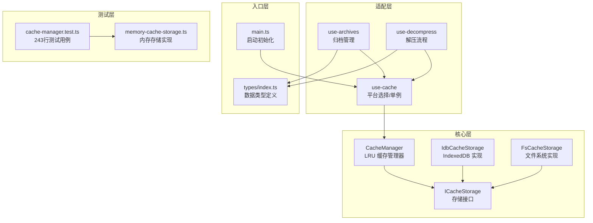
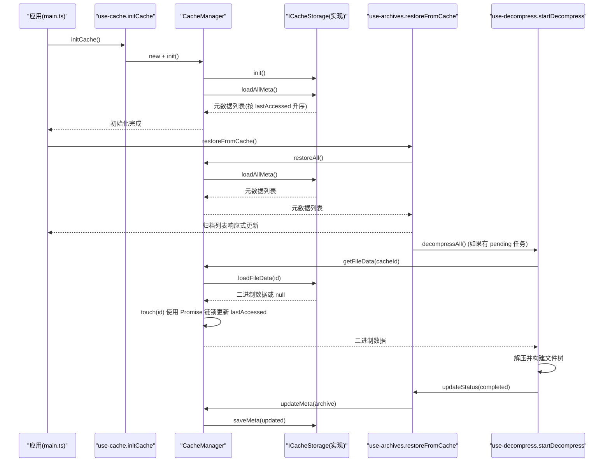
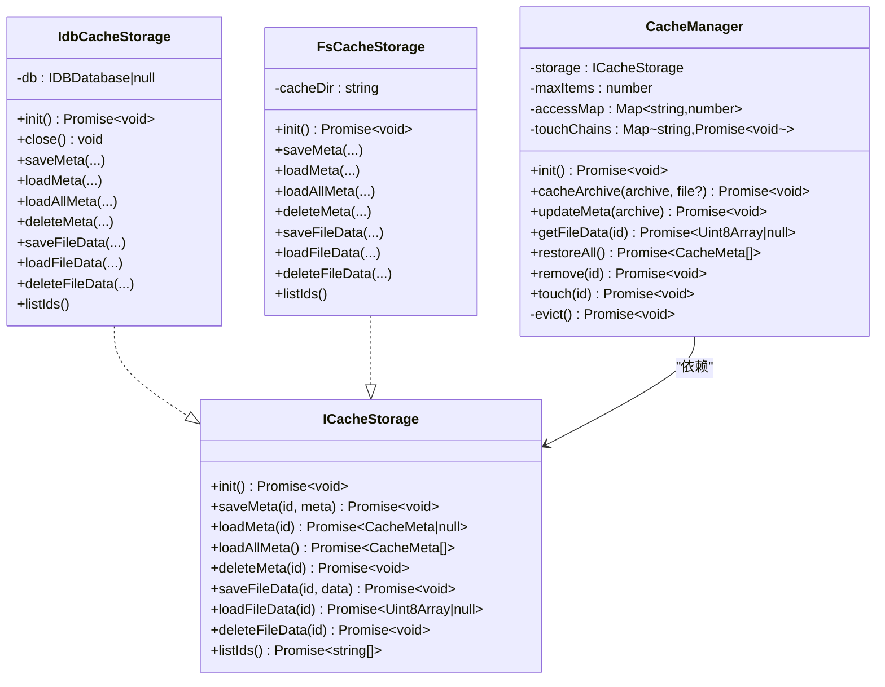
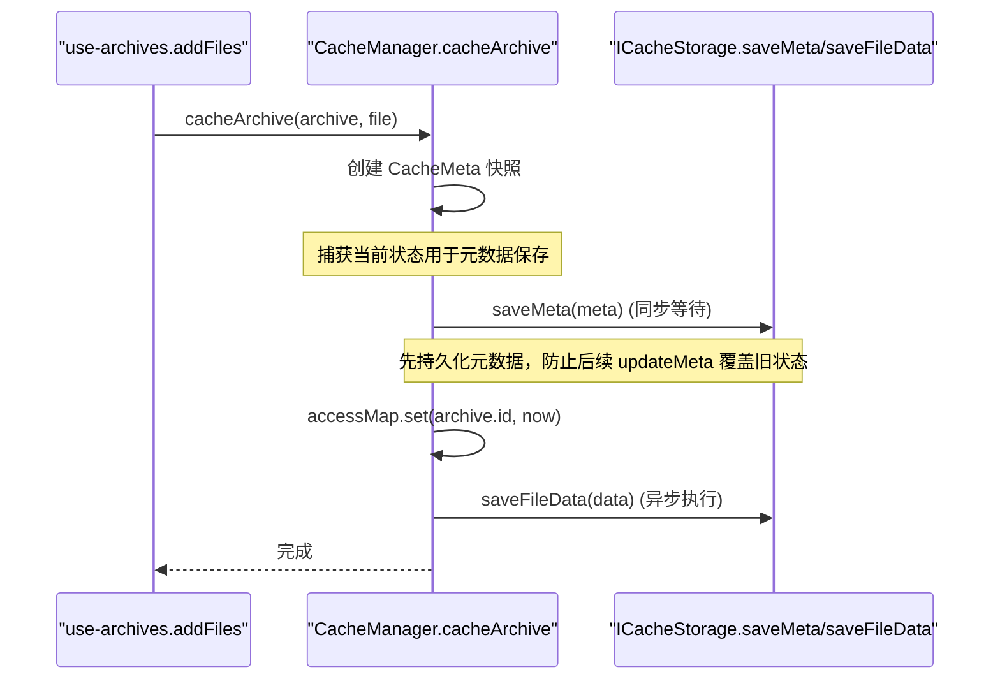
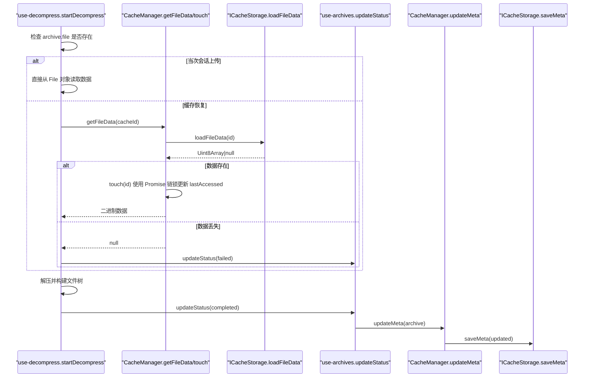
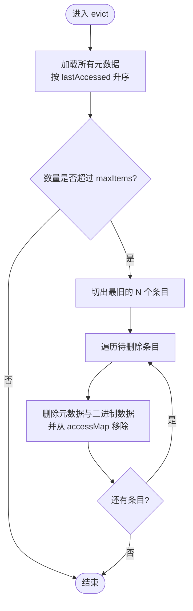
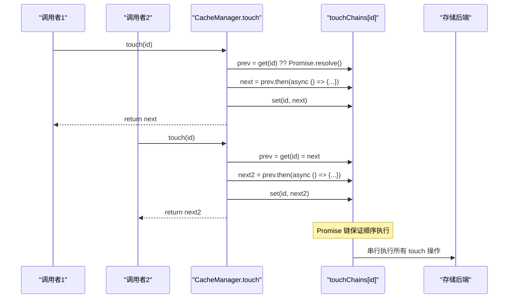
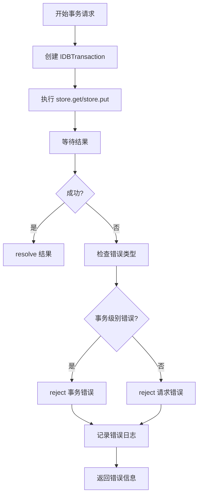
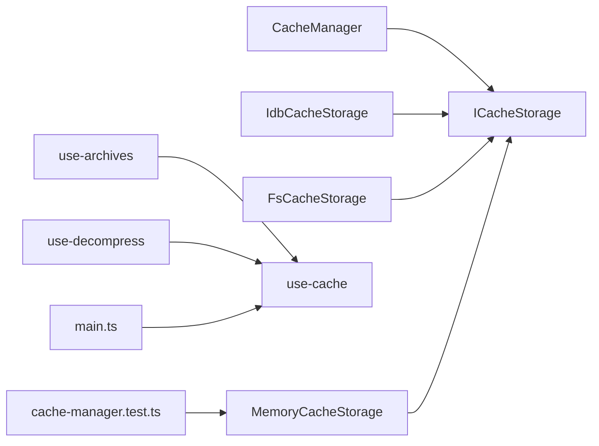

# 缓存系统

<cite>
**本文引用的文件**   
- [src/core/cache-manager.ts](file://src/core/cache-manager.ts)
- [src/core/cache-storage.ts](file://src/core/cache-storage.ts)
- [src/core/cache-fs.ts](file://src/core/cache-fs.ts)
- [src/core/cache-idb.ts](file://src/core/cache-idb.ts)
- [src/composables/use-cache.ts](file://src/composables/use-cache.ts)
- [src/composables/use-archives.ts](file://src/composables/use-archives.ts)
- [src/composables/use-decompress.ts](file://src/composables/use-decompress.ts)
- [src/main.ts](file://src/main.ts)
- [src/types/index.ts](file://src/types/index.ts)
- [src/__tests__/core/cache-manager.test.ts](file://src/__tests__/core/cache-manager.test.ts)
- [src/__tests__/memory-cache-storage.ts](file://src/__tests__/memory-cache-storage.ts)
</cite>

## 更新摘要
**变更内容**   
- **并发保护增强**：touch方法使用Promise链锁定机制防止竞态条件，确保并发访问时的数据一致性
- **IndexedDB事务错误处理**：新增txRequest函数提供完整的事务级错误监听和异常处理
- **数据库连接清理**：IdbCacheStorage新增close方法用于应用关闭时的资源清理
- **内存映射优化**：accessMap维护所有id的lastAccessed时间戳，显著提升LRU计算性能
- **完善的JSDoc文档**：所有核心组件都配备了详细的文档注释和错误处理说明

## 目录
1. [简介](#简介)
2. [项目结构](#项目结构)
3. [核心组件](#核心组件)
4. [架构总览](#架构总览)
5. [详细组件分析](#详细组件分析)
6. [依赖关系分析](#依赖关系分析)
7. [性能考量](#性能考量)
8. [故障排查指南](#故障排查指南)
9. [结论](#结论)
10. [附录](#附录)

## 简介
本仓库实现了一个跨平台（Web/Tauri）的完整文件缓存系统，用于持久化归档文件的元数据与二进制数据，并提供 LRU 淘汰策略以控制缓存规模。系统在 Web 端使用 IndexedDB，在 Tauri 端使用本地文件系统；上层通过统一的接口抽象屏蔽差异，并在应用启动时自动恢复上次会话的归档列表。该系统包含完整的测试覆盖，确保功能的稳定性和可靠性。

**更新** 经过增强的缓存系统现在具备更完善的并发保护机制、更强的错误处理和更高效的 LRU 算法实现。特别是新增了 Promise 链锁定的并发控制和 IndexedDB 事务级别的错误处理，显著提升了系统的健壮性。

## 项目结构
缓存相关代码主要分布在 core 层与 composables 适配层：
- core 层定义存储接口、管理器与具体后端实现
- composables 提供平台选择与单例初始化
- main.ts 在应用启动时完成缓存初始化与列表恢复
- types 定义归档项与树节点等数据结构
- tests 提供内存存储实现与全面的用例验证

**图表来源**
- [src/core/cache-manager.ts:1-191](file://src/core/cache-manager.ts#L1-L191)
- [src/core/cache-storage.ts:1-68](file://src/core/cache-storage.ts#L1-L68)
- [src/core/cache-idb.ts:1-176](file://src/core/cache-idb.ts#L1-L176)
- [src/core/cache-fs.ts:1-192](file://src/core/cache-fs.ts#L1-L192)
- [src/composables/use-cache.ts:1-56](file://src/composables/use-cache.ts#L1-L56)
- [src/composables/use-archives.ts:1-168](file://src/composables/use-archives.ts#L1-L168)
- [src/composables/use-decompress.ts:1-89](file://src/composables/use-decompress.ts#L1-L89)
- [src/main.ts:1-23](file://src/main.ts#L1-L23)
- [src/types/index.ts:1-148](file://src/types/index.ts#L1-L148)
- [src/__tests__/core/cache-manager.test.ts:1-243](file://src/__tests__/core/cache-manager.test.ts#L1-L243)
- [src/__tests__/memory-cache-storage.ts:1-56](file://src/__tests__/memory-cache-storage.ts#L1-L56)

**章节来源**
- [src/core/cache-manager.ts:1-191](file://src/core/cache-manager.ts#L1-L191)
- [src/core/cache-storage.ts:1-68](file://src/core/cache-storage.ts#L1-L68)
- [src/core/cache-idb.ts:1-176](file://src/core/cache-idb.ts#L1-L176)
- [src/core/cache-fs.ts:1-192](file://src/core/cache-fs.ts#L1-L192)
- [src/composables/use-cache.ts:1-56](file://src/composables/use-cache.ts#L1-L56)
- [src/composables/use-archives.ts:1-168](file://src/composables/use-archives.ts#L1-L168)
- [src/composables/use-decompress.ts:1-89](file://src/composables/use-decompress.ts#L1-L89)
- [src/main.ts:1-23](file://src/main.ts#L1-L23)
- [src/types/index.ts:1-148](file://src/types/index.ts#L1-L148)
- [src/__tests__/core/cache-manager.test.ts:1-243](file://src/__tests__/core/cache-manager.test.ts#L1-L243)
- [src/__tests__/memory-cache-storage.ts:1-56](file://src/__tests__/memory-cache-storage.ts#L1-L56)

## 核心组件
- **缓存管理器 CacheManager**：负责归档元数据与二进制数据的写入、读取、更新、删除与 LRU 淘汰；维护内存访问映射以快速计算最近访问时间，并使用 Promise 链锁防止并发竞态条件。
- **存储接口 ICacheStorage**：统一抽象，屏蔽 Web 与 Tauri 的差异，定义了完整的缓存操作 API。
- **IndexedDB 实现 IdbCacheStorage**：在浏览器环境中持久化元数据与二进制数据，使用对象存储分离元数据和文件数据，具备完善的事务级错误处理和资源清理能力。
- **文件系统实现 FsCacheStorage**：在 Tauri 环境中将元数据与二进制数据落盘到应用数据目录下的 .cache/meta 与 .cache/data，支持跨平台路径解析。
- **平台适配 use-cache**：根据编译期常量 __PLATFORM__ 选择后端并返回单例 CacheManager，提供懒初始化和重置功能。
- **归档管理 use-archives**：在添加/删除/状态变更时调用缓存管理器进行持久化与恢复，支持从缓存恢复归档列表。
- **解压流程 use-decompress**：优先使用当前会话 File，否则从缓存按需读取二进制数据参与解压，支持任务调度。

**更新** 所有核心组件现在都配备了全面的 JSDoc 文档、增强的并发保护机制和完善的错误处理机制。

**章节来源**
- [src/core/cache-manager.ts:1-191](file://src/core/cache-manager.ts#L1-L191)
- [src/core/cache-storage.ts:1-68](file://src/core/cache-storage.ts#L1-L68)
- [src/core/cache-idb.ts:1-176](file://src/core/cache-idb.ts#L1-L176)
- [src/core/cache-fs.ts:1-192](file://src/core/cache-fs.ts#L1-L192)
- [src/composables/use-cache.ts:1-56](file://src/composables/use-cache.ts#L1-L56)
- [src/composables/use-archives.ts:1-168](file://src/composables/use-archives.ts#L1-L168)
- [src/composables/use-decompress.ts:1-89](file://src/composables/use-decompress.ts#L1-L89)

## 架构总览
下图展示了从应用启动到归档解压过程中，缓存系统的交互路径与数据流向。

**图表来源**
- [src/main.ts:11-20](file://src/main.ts#L11-L20)
- [src/composables/use-cache.ts:33-48](file://src/composables/use-cache.ts#L33-L48)
- [src/core/cache-manager.ts:66-69](file://src/core/cache-manager.ts#L66-L69)
- [src/core/cache-idb.ts:108-115](file://src/core/cache-idb.ts#L108-L115)
- [src/core/cache-fs.ts:102-121](file://src/core/cache-fs.ts#L102-L121)
- [src/composables/use-archives.ts:107-150](file://src/composables/use-archives.ts#L107-L150)
- [src/composables/use-decompress.ts:16-77](file://src/composables/use-decompress.ts#L16-L77)

## 详细组件分析

### 类与接口关系

**更新** 新增了 close 方法和 touchChains 属性，增强了并发保护和资源管理能力。

**图表来源**
- [src/core/cache-storage.ts:40-67](file://src/core/cache-storage.ts#L40-L67)
- [src/core/cache-idb.ts:51-175](file://src/core/cache-idb.ts#L51-L175)
- [src/core/cache-fs.ts:26-191](file://src/core/cache-fs.ts#L26-L191)
- [src/core/cache-manager.ts:44-190](file://src/core/cache-manager.ts#L44-L190)

**章节来源**
- [src/core/cache-storage.ts:1-68](file://src/core/cache-storage.ts#L1-L68)
- [src/core/cache-idb.ts:1-176](file://src/core/cache-idb.ts#L1-L176)
- [src/core/cache-fs.ts:1-192](file://src/core/cache-fs.ts#L1-L192)
- [src/core/cache-manager.ts:1-191](file://src/core/cache-manager.ts#L1-L191)

### 关键流程时序

#### 归档写入与恢复

**图表来源**
- [src/composables/use-archives.ts:43-49](file://src/composables/use-archives.ts#L43-L49)
- [src/core/cache-manager.ts:76-92](file://src/core/cache-manager.ts#L76-L92)
- [src/core/cache-storage.ts:44-45](file://src/core/cache-storage.ts#L44-L45)

**章节来源**
- [src/composables/use-archives.ts:18-51](file://src/composables/use-archives.ts#L18-L51)
- [src/core/cache-manager.ts:76-92](file://src/core/cache-manager.ts#L76-L92)

#### 解压时的数据获取与元数据更新

**图表来源**
- [src/composables/use-decompress.ts:24-34](file://src/composables/use-decompress.ts#L24-L34)
- [src/core/cache-manager.ts:117-123](file://src/core/cache-manager.ts#L117-L123)
- [src/core/cache-manager.ts:158-177](file://src/core/cache-manager.ts#L158-L177)
- [src/core/cache-manager.ts:98-109](file://src/core/cache-manager.ts#L98-L109)
- [src/composables/use-archives.ts:75-88](file://src/composables/use-archives.ts#L75-L88)

**章节来源**
- [src/composables/use-decompress.ts:16-77](file://src/composables/use-decompress.ts#L16-L77)
- [src/core/cache-manager.ts:117-123](file://src/core/cache-manager.ts#L117-L123)
- [src/core/cache-manager.ts:158-177](file://src/core/cache-manager.ts#L158-L177)
- [src/core/cache-manager.ts:98-109](file://src/core/cache-manager.ts#L98-L109)
- [src/composables/use-archives.ts:75-88](file://src/composables/use-archives.ts#L75-L88)

### LRU 淘汰算法流程图

**更新** LRU 算法现在使用内存中的 accessMap 进行快速的时间戳计算，并通过 Promise 链锁确保并发安全。

**图表来源**
- [src/core/cache-manager.ts:180-189](file://src/core/cache-manager.ts#L180-L189)
- [src/core/cache-manager.ts:131-139](file://src/core/cache-manager.ts#L131-L139)

**章节来源**
- [src/core/cache-manager.ts:180-189](file://src/core/cache-manager.ts#L180-L189)
- [src/core/cache-manager.ts:131-139](file://src/core/cache-manager.ts#L131-L139)

### 并发保护机制详解

#### Promise 链锁工作原理

**更新** 新增了 per-id Promise 链锁机制，有效防止并发 touch 操作导致的数据竞争问题。

**图表来源**
- [src/core/cache-manager.ts:158-177](file://src/core/cache-manager.ts#L158-L177)

#### IndexedDB 事务错误处理

**更新** 新增了 txRequest 函数提供完整的事务级错误监听，包括 abort 和 error 事件处理。

**图表来源**
- [src/core/cache-idb.ts:41-48](file://src/core/cache-idb.ts#L41-L48)

### 数据结构说明
- **ArchiveItem**：表示一个归档项，包含 id、name、status、files、originalSize、compressedSize 等字段，以及可选的 file（仅当次会话可用）和 cacheId（缓存标识）。
- **FileTreeNode**：表示已解压的文件树节点，支持层级结构与叶子标识。
- **CacheMeta**：持久化的元数据快照，不含二进制数据，包含 lastAccessed 用于 LRU 计算，以及完整的归档状态信息。

**章节来源**
- [src/types/index.ts:79-105](file://src/types/index.ts#L79-L105)
- [src/types/index.ts:28-42](file://src/types/index.ts#L28-L42)
- [src/core/cache-storage.ts:8-33](file://src/core/cache-storage.ts#L8-L33)

### 平台适配与单例
- **use-cache** 根据 __PLATFORM__ 选择 IdbCacheStorage 或 FsCacheStorage，并创建 CacheManager 单例。
- **initCache** 保证只初始化一次，返回可复用的实例，支持懒初始化和错误处理。
- **resetCache** 提供测试环境下的单例重置功能。

**章节来源**
- [src/composables/use-cache.ts:17-26](file://src/composables/use-cache.ts#L17-L26)
- [src/composables/use-cache.ts:33-48](file://src/composables/use-cache.ts#L33-L48)
- [src/composables/use-cache.ts:53-56](file://src/composables/use-cache.ts#L53-L56)

### 测试与内存存储
- **MemoryCacheStorage** 为测试环境提供的内存实现，便于隔离与快速执行，支持数据清空功能。
- **cache-manager.test** 覆盖了写入、恢复、删除、LRU 淘汰与元数据更新等场景，共 243 行测试用例。
- 测试涵盖了边界情况处理，如空缓存、不存在的 id、并发访问等。

**更新** 测试套件现已扩展到 243 行，增加了更多的边界情况测试和异常处理验证，包括并发访问测试。

**章节来源**
- [src/__tests__/memory-cache-storage.ts:1-56](file://src/__tests__/memory-cache-storage.ts#L1-L56)
- [src/__tests__/core/cache-manager.test.ts:1-243](file://src/__tests__/core/cache-manager.test.ts#L1-L243)

## 依赖关系分析
- **CacheManager** 依赖 ICacheStorage 接口，解耦了平台差异。
- **IdbCacheStorage** 与 **FsCacheStorage** 分别依赖浏览器 API 与 Tauri invoke 命令。
- **use-archives** 与 **use-decompress** 通过 use-cache 间接依赖 CacheManager。
- **main.ts** 在应用启动阶段触发 initCache 与 restoreFromCache。
- **测试层** 通过 MemoryCacheStorage 实现测试隔离。

**图表来源**
- [src/core/cache-manager.ts:1-191](file://src/core/cache-manager.ts#L1-L191)
- [src/core/cache-storage.ts:1-68](file://src/core/cache-storage.ts#L1-L68)
- [src/core/cache-idb.ts:1-176](file://src/core/cache-idb.ts#L1-L176)
- [src/core/cache-fs.ts:1-192](file://src/core/cache-fs.ts#L1-L192)
- [src/composables/use-cache.ts:1-56](file://src/composables/use-cache.ts#L1-L56)
- [src/composables/use-archives.ts:1-168](file://src/composables/use-archives.ts#L1-L168)
- [src/composables/use-decompress.ts:1-89](file://src/composables/use-decompress.ts#L1-L89)
- [src/main.ts:1-23](file://src/main.ts#L1-L23)
- [src/__tests__/core/cache-manager.test.ts:1-243](file://src/__tests__/core/cache-manager.test.ts#L1-L243)
- [src/__tests__/memory-cache-storage.ts:1-56](file://src/__tests__/memory-cache-storage.ts#L1-L56)

**章节来源**
- [src/core/cache-manager.ts:1-191](file://src/core/cache-manager.ts#L1-L191)
- [src/core/cache-storage.ts:1-68](file://src/core/cache-storage.ts#L1-L68)
- [src/core/cache-idb.ts:1-176](file://src/core/cache-idb.ts#L1-L176)
- [src/core/cache-fs.ts:1-192](file://src/core/cache-fs.ts#L1-L192)
- [src/composables/use-cache.ts:1-56](file://src/composables/use-cache.ts#L1-L56)
- [src/composables/use-archives.ts:1-168](file://src/composables/use-archives.ts#L1-L168)
- [src/composables/use-decompress.ts:1-89](file://src/composables/use-decompress.ts#L1-L89)
- [src/main.ts:1-23](file://src/main.ts#L1-L23)
- [src/__tests__/core/cache-manager.test.ts:1-243](file://src/__tests__/core/cache-manager.test.ts#L1-L243)
- [src/__tests__/memory-cache-storage.ts:1-56](file://src/__tests__/memory-cache-storage.ts#L1-L56)

## 性能考量
- **LRU 淘汰策略**：通过内存 accessMap 记录 lastAccessed，避免每次淘汰都扫描磁盘/数据库，提升效率。
- **并发保护优化**：使用 Promise 链锁确保 touch 操作的原子性，避免并发竞态条件导致的性能损耗。
- **元数据与二进制分离**：元数据轻量且频繁读写，二进制仅在需要时加载，降低 IO 压力。
- **异步保存**：二进制数据保存不阻塞元数据写入，减少主流程延迟。
- **懒初始化**：缓存管理器采用懒初始化模式，只在首次使用时创建实例。
- **容量上限**：默认最大缓存 20 个归档，可通过配置调整，超出后自动触发 LRU 淘汰。
- **路径解析优化**：FsCacheStorage 使用跨平台兼容的路径拼接函数，提高文件系统操作的稳定性。
- **事务错误处理**：IndexedDB 操作使用事务级错误监听，减少错误重试带来的性能影响。

**更新** 新增了并发保护优化和事务错误处理的性能改进。

## 故障排查指南
- **缓存未初始化**：确保在应用启动时调用 initCache，并在恢复前完成初始化。
- **数据丢失**：若解压时发现缓存数据为空，会标记失败并提示重新上传；检查 ICacheStorage 的 loadFileData 实现与异常处理。
- **元数据覆盖**：cacheArchive 必须先 await 保存元数据，再异步保存二进制，避免后续 updateMeta 被旧状态覆盖。
- **删除不一致**：remove 同时删除元数据与二进制，并确保从 accessMap 中移除对应 id。
- **测试隔离**：使用 MemoryCacheStorage 清空数据，确保用例之间互不影响。
- **平台兼容性问题**：检查 __PLATFORM__ 常量是否正确设置，确保正确的存储后端被选择。
- **路径解析错误**：FsCacheStorage 使用 joinPath 函数处理跨平台路径，确保 Windows 和 POSIX 兼容性。
- **IndexedDB 事务错误**：IdbCacheStorage 使用 idbRequest 包装器处理事务错误，提供统一的错误处理。
- **并发竞态条件**：如果观察到 lastAccessed 时间戳混乱，检查 touch 方法的 Promise 链锁是否正常工作。
- **数据库连接泄漏**：应用关闭时确保调用 IdbCacheStorage.close() 释放数据库连接资源。

**更新** 新增了并发竞态条件和数据库连接泄漏的排查指导。

**章节来源**
- [src/main.ts:11-20](file://src/main.ts#L11-L20)
- [src/composables/use-decompress.ts:28-31](file://src/composables/use-decompress.ts#L28-L31)
- [src/core/cache-manager.ts:83-92](file://src/core/cache-manager.ts#L83-L92)
- [src/core/cache-manager.ts:145-151](file://src/core/cache-manager.ts#L145-L151)
- [src/__tests__/memory-cache-storage.ts:50-55](file://src/__tests__/memory-cache-storage.ts#L50-L55)
- [src/composables/use-cache.ts:17-26](file://src/composables/use-cache.ts#L17-L26)
- [src/core/cache-fs.ts:20-23](file://src/core/cache-fs.ts#L20-L23)
- [src/core/cache-idb.ts:41-48](file://src/core/cache-idb.ts#L41-L48)
- [src/core/cache-idb.ts:66-71](file://src/core/cache-idb.ts#L66-L71)

## 结论
该缓存系统通过接口抽象实现了跨平台的持久化能力，结合 LRU 策略有效控制了缓存规模。经过增强的版本现在具备更完善的并发保护机制、更强的错误处理和更高效的算法实现。特别是 Promise 链锁定的并发控制和 IndexedDB 事务级别的错误处理，显著提升了系统的健壮性和可靠性。完整的测试覆盖（243行测试用例）确保了功能的稳定性和可靠性。上层组件对缓存的使用遵循"元数据先行、二进制按需"的原则，保证了用户体验与资源占用的平衡。系统支持应用重启后的状态恢复，提供了良好的用户体验。

**更新** 增强后的系统现在拥有全面的并发保护机制、完善的错误处理和优化的 LRU 算法，进一步提升了系统的健壮性、性能和可靠性。

## 附录
- **内存存储参考**：MemoryCacheStorage 提供了基于 Map 的内存缓存实现，具备完整的 ICacheStorage 接口实现，适合测试场景和数据隔离。
- **测试覆盖率**：cache-manager.test.ts 包含了完整的测试套件，涵盖核心功能的所有边界情况和异常处理，现已扩展至 243 行。
- **JSDoc 文档**：所有核心类和公共方法都配备了详细的 JSDoc 注释，包括参数说明、返回值描述和使用示例。
- **错误处理机制**：各个存储后端都实现了统一的错误处理模式，确保系统在各种异常情况下的稳定运行。
- **并发保护机制**：Promise 链锁确保同一 id 的 touch 操作串行执行，避免数据竞争。
- **资源管理**：IdbCacheStorage.close() 方法提供数据库连接的优雅关闭和资源清理。

**更新** 新增了并发保护机制和资源管理的说明。

**章节来源**
- [src/__tests__/memory-cache-storage.ts:1-56](file://src/__tests__/memory-cache-storage.ts#L1-L56)
- [src/__tests__/core/cache-manager.test.ts:1-243](file://src/__tests__/core/cache-manager.test.ts#L1-L243)
- [src/core/cache-manager.ts:1-191](file://src/core/cache-manager.ts#L1-L191)
- [src/core/cache-idb.ts:1-176](file://src/core/cache-idb.ts#L1-L176)
- [src/core/cache-fs.ts:1-192](file://src/core/cache-fs.ts#L1-L192)