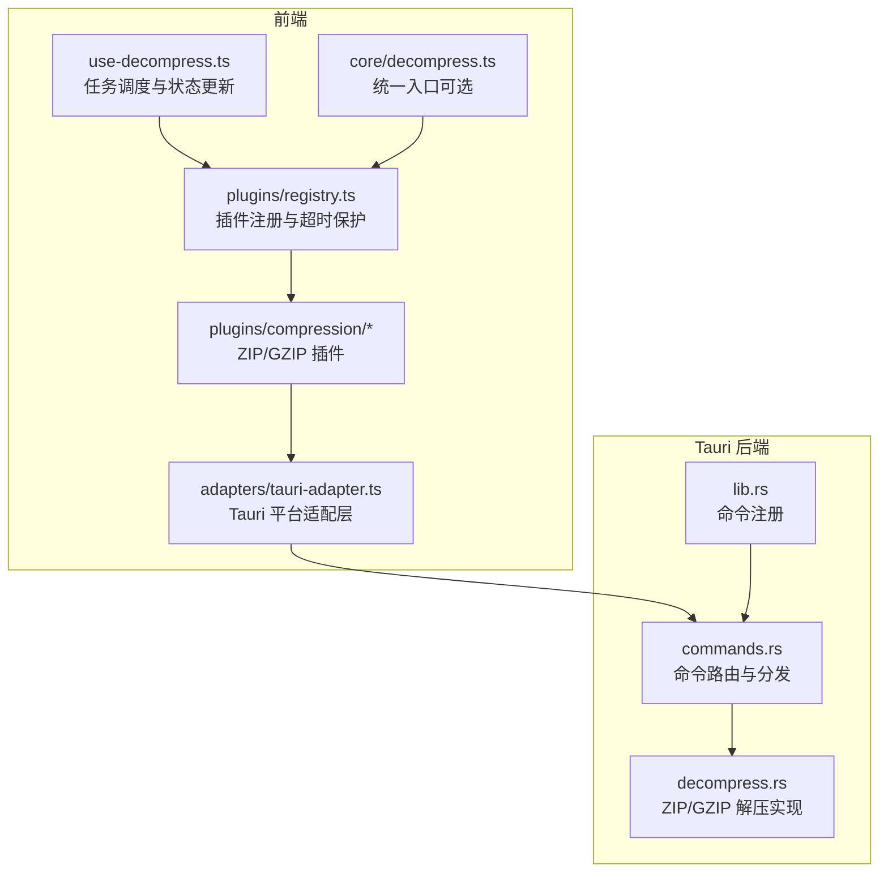
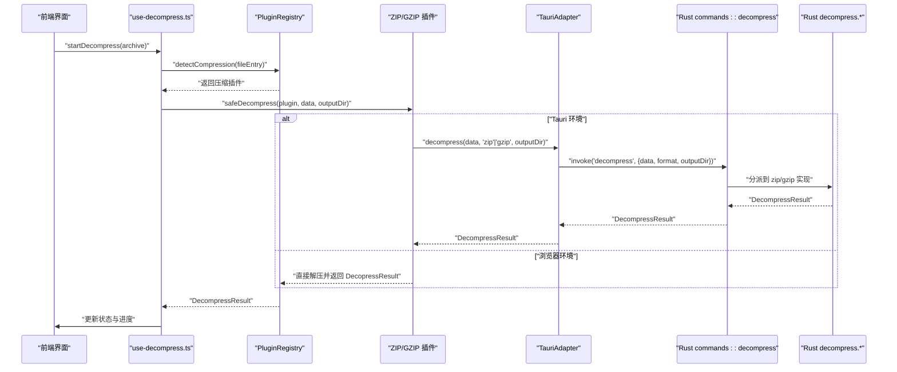
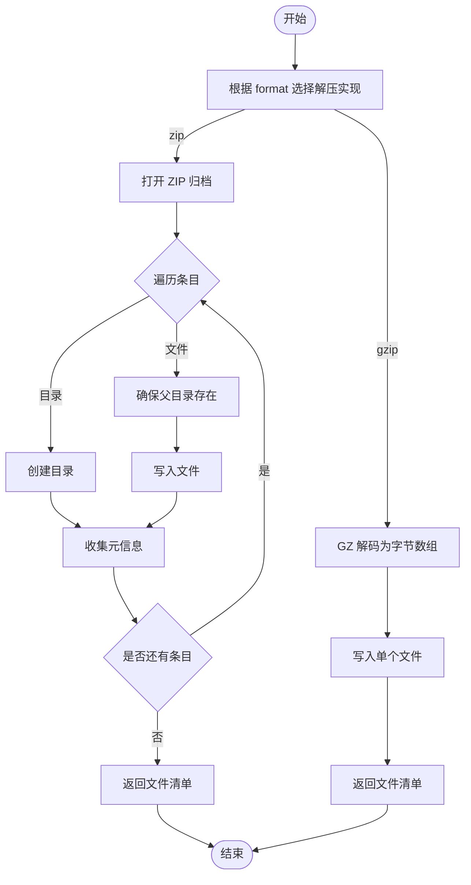
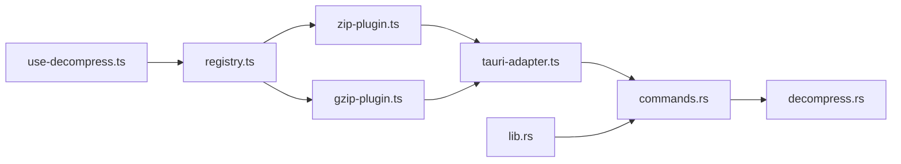

# 解压服务

<cite>
**本文引用的文件**   
- [decompress.rs](file://src-tauri/src/decompress.rs)
- [commands.rs](file://src-tauri/src/commands.rs)
- [lib.rs](file://src-tauri/src/lib.rs)
- [tauri-adapter.ts](file://src/adapters/tauri-adapter.ts)
- [use-decompress.ts](file://src/composables/use-decompress.ts)
- [decompress.ts](file://src/core/decompress.ts)
- [zip-plugin.ts](file://src/plugins/compression/zip-plugin.ts)
- [gzip-plugin.ts](file://src/plugins/compression/gzip-plugin.ts)
- [registry.ts](file://src/plugins/registry.ts)
- [types.ts](file://src/plugins/types.ts)
- [index.ts](file://src/types/index.ts)
- [task-scheduler.ts](file://src/core/task-scheduler.ts)
- [use-plugins.ts](file://src/composables/use-plugins.ts)
- [use-archives.ts](file://src/composables/use-archives.ts)
- [file-tree.ts](file://src/core/file-tree.ts)
</cite>

## 目录
1. [简介](#简介)
2. [项目结构](#项目结构)
3. [核心组件](#核心组件)
4. [架构总览](#架构总览)
5. [详细组件分析](#详细组件分析)
6. [依赖关系分析](#依赖关系分析)
7. [性能与内存优化](#性能与内存优化)
8. [故障排查指南](#故障排查指南)
9. [结论](#结论)
10. [附录：调用示例与最佳实践](#附录调用示例与最佳实践)

## 简介
本技术文档围绕 Hello-Tauri 的“解压服务”展开，系统性阐述从前端到 Rust 后端的完整解压流程。内容覆盖压缩格式识别、解压算法选择、进度跟踪、错误恢复机制、递归解压与嵌套文件处理、路径规范化、前后端通信协议与大文件内存优化策略等。重点说明 ZIP 与 GZIP 的处理逻辑，并提供可操作的调用示例与异常处理建议。

## 项目结构
解压服务由前端插件体系与 Tauri 后端命令共同组成：
- 前端通过插件注册表自动识别压缩类型并选择对应插件；在 Tauri 环境下，插件将解压请求转发至平台适配器，再由适配器调用 Rust 命令执行实际解压。
- Rust 后端提供统一的 decompress 命令，根据格式分发到 zip 或 gzip 解压实现，返回标准化的结果对象。

图表来源
- [use-decompress.ts:1-74](file://src/composables/use-decompress.ts#L1-L74)
- [registry.ts:1-118](file://src/plugins/registry.ts#L1-L118)
- [zip-plugin.ts:1-40](file://src/plugins/compression/zip-plugin.ts#L1-L40)
- [gzip-plugin.ts:1-44](file://src/plugins/compression/gzip-plugin.ts#L1-L44)
- [tauri-adapter.ts:1-62](file://src/adapters/tauri-adapter.ts#L1-L62)
- [commands.rs:1-53](file://src-tauri/src/commands.rs#L1-L53)
- [decompress.rs:1-83](file://src-tauri/src/decompress.rs#L1-L83)
- [lib.rs:1-19](file://src-tauri/src/lib.rs#L1-L19)

章节来源
- [use-decompress.ts:1-74](file://src/composables/use-decompress.ts#L1-L74)
- [registry.ts:1-118](file://src/plugins/registry.ts#L1-L118)
- [zip-plugin.ts:1-40](file://src/plugins/compression/zip-plugin.ts#L1-L40)
- [gzip-plugin.ts:1-44](file://src/plugins/compression/gzip-plugin.ts#L1-L44)
- [tauri-adapter.ts:1-62](file://src/adapters/tauri-adapter.ts#L1-L62)
- [commands.rs:1-53](file://src-tauri/src/commands.rs#L1-L53)
- [decompress.rs:1-83](file://src-tauri/src/decompress.rs#L1-L83)
- [lib.rs:1-19](file://src-tauri/src/lib.rs#L1-L19)

## 核心组件
- 任务调度器 TaskScheduler：控制并发与队列容量，避免 UI 线程阻塞与资源争用。
- 插件注册表 PluginRegistry：维护压缩/解析插件映射，提供 detectCompression 与 safeDecompress（含超时保护）。
- 压缩插件：
  - ZIP 插件：Tauri 环境走后端解压；浏览器环境使用 fflate 进行内存解压。
  - GZIP 插件：Tauri 环境走后端解压；浏览器环境优先使用原生 DecompressionStream。
- 平台适配器 TauriAdapter：封装 @tauri-apps/api/core.invoke，将前端解压请求转发到 Rust 命令。
- Rust 命令 decompress：按 format 分发到 zip/gzip 解压函数，返回统一结果结构。
- 解压实现 decompress.rs：
  - ZIP：遍历条目，创建目录/文件，记录每个文件的元信息。
  - GZIP：解码为单文件输出，命名固定为“decompressed”。
- 文件树构建 FileTreeBuilder：将扁平文件列表组装为层级树，便于 UI 展示。

章节来源
- [task-scheduler.ts:1-79](file://src/core/task-scheduler.ts#L1-L79)
- [registry.ts:1-118](file://src/plugins/registry.ts#L1-L118)
- [zip-plugin.ts:1-40](file://src/plugins/compression/zip-plugin.ts#L1-L40)
- [gzip-plugin.ts:1-44](file://src/plugins/compression/gzip-plugin.ts#L1-L44)
- [tauri-adapter.ts:1-62](file://src/adapters/tauri-adapter.ts#L1-L62)
- [commands.rs:1-53](file://src-tauri/src/commands.rs#L1-L53)
- [decompress.rs:1-83](file://src-tauri/src/decompress.rs#L1-L83)
- [file-tree.ts:1-69](file://src/core/file-tree.ts#L1-L69)

## 架构总览
以下序列图展示了从前端触发到 Rust 后端完成解压的关键调用链。

图表来源
- [use-decompress.ts:1-74](file://src/composables/use-decompress.ts#L1-L74)
- [registry.ts:1-118](file://src/plugins/registry.ts#L1-L118)
- [zip-plugin.ts:1-40](file://src/plugins/compression/zip-plugin.ts#L1-L40)
- [gzip-plugin.ts:1-44](file://src/plugins/compression/gzip-plugin.ts#L1-L44)
- [tauri-adapter.ts:1-62](file://src/adapters/tauri-adapter.ts#L1-L62)
- [commands.rs:1-53](file://src-tauri/src/commands.rs#L1-L53)
- [decompress.rs:1-83](file://src-tauri/src/decompress.rs#L1-L83)

## 详细组件分析

### 前端解压编排（use-decompress.ts）
- 读取压缩包二进制数据，构造 FileEntry 用于插件识别。
- 通过注册表检测压缩类型并安全调用插件解压（带超时保护）。
- 基于返回的文件列表构建文件树，计算原始大小，更新任务状态与进度。
- 使用任务调度器限制并发，失败时设置错误消息。

章节来源
- [use-decompress.ts:1-74](file://src/composables/use-decompress.ts#L1-L74)
- [task-scheduler.ts:1-79](file://src/core/task-scheduler.ts#L1-L79)
- [file-tree.ts:1-69](file://src/core/file-tree.ts#L1-L69)
- [index.ts:1-71](file://src/types/index.ts#L1-L71)

### 插件注册与超时保护（registry.ts）
- 维护扩展名到插件名称的映射，支持启用/禁用插件。
- detectCompression 基于文件名后缀匹配插件。
- safeDecompress 对插件执行包裹超时保护，失败时返回结构化错误。

章节来源
- [registry.ts:1-118](file://src/plugins/registry.ts#L1-L118)
- [types.ts:1-37](file://src/plugins/types.ts#L1-37)

### ZIP 插件（zip-plugin.ts）
- Tauri 环境：通过平台适配器调用 Rust 解压。
- 浏览器环境：使用 fflate 进行内存解压，并将非目录项写入内存存储，返回文件清单。

章节来源
- [zip-plugin.ts:1-40](file://src/plugins/compression/zip-plugin.ts#L1-L40)
- [tauri-adapter.ts:1-62](file://src/adapters/tauri-adapter.ts#L1-L62)

### GZIP 插件（gzip-plugin.ts）
- Tauri 环境：通过平台适配器调用 Rust 解压。
- 浏览器环境：优先使用原生 DecompressionStream 流式解码，拼接为 Uint8Array 后返回。

章节来源
- [gzip-plugin.ts:1-44](file://src/plugins/compression/gzip-plugin.ts#L1-L44)
- [tauri-adapter.ts:1-62](file://src/adapters/tauri-adapter.ts#L1-L62)

### 平台适配器（tauri-adapter.ts）
- 封装 invoke 调用，将前端解压请求转换为 Rust 命令参数。
- 注意：当前 IPC 不支持原生流式传输，采用全量读取后再包装为 ReadableStream 的方式。

章节来源
- [tauri-adapter.ts:1-62](file://src/adapters/tauri-adapter.ts#L1-L62)

### Rust 命令与分发（commands.rs / lib.rs）
- 命令 decompress 接收 data、format、output_dir，按 format 分发到具体解压函数。
- 统一返回 DecompressResult，成功时 success=true 并附带文件清单，失败时携带错误信息。
- 命令在 lib.rs 中注册，供前端通过 invoke 调用。

章节来源
- [commands.rs:1-53](file://src-tauri/src/commands.rs#L1-L53)
- [lib.rs:1-19](file://src-tauri/src/lib.rs#L1-L19)

### Rust 解压实现（decompress.rs）
- ZIP 解压：
  - 使用 zip crate 打开归档，逐条枚举条目。
  - 若条目为目录则创建目录；否则确保父目录存在后写入文件。
  - 收集每个条目的 name、path、size、is_directory 信息。
- GZIP 解压：
  - 使用 flate2 解码为字节数组，写入名为“decompressed”的文件。
  - 返回单文件清单。

图表来源
- [decompress.rs:1-83](file://src-tauri/src/decompress.rs#L1-L83)
- [commands.rs:1-53](file://src-tauri/src/commands.rs#L1-L53)

章节来源
- [decompress.rs:1-83](file://src-tauri/src/decompress.rs#L1-L83)

### 文件树构建（file-tree.ts）
- 将扁平文件列表组装为层级树，支持查找与扁平化操作。
- 用于在 UI 中以树形结构展示解压后的目录与文件。

章节来源
- [file-tree.ts:1-69](file://src/core/file-tree.ts#L1-L69)

## 依赖关系分析
- 前端模块耦合度较低，通过接口与注册表解耦；插件可插拔，便于扩展新格式。
- 平台适配器屏蔽底层差异，使插件代码保持简洁。
- Rust 命令集中管理外部 IO 与第三方库调用，保证安全性与一致性。

图表来源
- [use-decompress.ts:1-74](file://src/composables/use-decompress.ts#L1-L74)
- [registry.ts:1-118](file://src/plugins/registry.ts#L1-L118)
- [zip-plugin.ts:1-40](file://src/plugins/compression/zip-plugin.ts#L1-L40)
- [gzip-plugin.ts:1-44](file://src/plugins/compression/gzip-plugin.ts#L1-L44)
- [tauri-adapter.ts:1-62](file://src/adapters/tauri-adapter.ts#L1-L62)
- [commands.rs:1-53](file://src-tauri/src/commands.rs#L1-L53)
- [decompress.rs:1-83](file://src-tauri/src/decompress.rs#L1-L83)
- [lib.rs:1-19](file://src-tauri/src/lib.rs#L1-L19)

章节来源
- [use-decompress.ts:1-74](file://src/composables/use-decompress.ts#L1-L74)
- [registry.ts:1-118](file://src/plugins/registry.ts#L1-L118)
- [zip-plugin.ts:1-40](file://src/plugins/compression/zip-plugin.ts#L1-L40)
- [gzip-plugin.ts:1-44](file://src/plugins/compression/gzip-plugin.ts#L1-L44)
- [tauri-adapter.ts:1-62](file://src/adapters/tauri-adapter.ts#L1-L62)
- [commands.rs:1-53](file://src-tauri/src/commands.rs#L1-L53)
- [decompress.rs:1-83](file://src-tauri/src/decompress.rs#L1-L83)
- [lib.rs:1-19](file://src-tauri/src/lib.rs#L1-L19)

## 性能与内存优化
- 大文件处理
  - 当前 Tauri 适配器采用全量读取再包装为 ReadableStream，IPC 层未实现原生流式传输。对于超大压缩包，建议在后续版本引入事件或专用插件以支持分块读写。
  - ZIP 解压在 Rust 侧逐条写入磁盘，避免一次性加载整个归档到内存；GZIP 解压在当前实现中将全部数据读入内存后写出，适合中小文件。
- 并发控制
  - 使用任务调度器限制最大并发数与队列长度，防止 UI 卡顿与资源耗尽。
- 超时保护
  - 插件执行带有超时保护，避免长时间挂起导致用户体验下降。
- 路径与安全
  - 命令层对路径包含“..”进行拦截，防止路径穿越攻击。
- 调优建议
  - 合理设置任务并发上限与队列容量，依据设备性能调整。
  - 针对超大 GZIP 文件，考虑流式解码与分片落盘策略。
  - 在浏览器环境中，优先使用原生 DecompressionStream 以降低内存峰值。

章节来源
- [task-scheduler.ts:1-79](file://src/core/task-scheduler.ts#L1-L79)
- [registry.ts:1-118](file://src/plugins/registry.ts#L1-L118)
- [tauri-adapter.ts:1-62](file://src/adapters/tauri-adapter.ts#L1-L62)
- [commands.rs:1-53](file://src-tauri/src/commands.rs#L1-L53)
- [decompress.rs:1-83](file://src-tauri/src/decompress.rs#L1-L83)

## 故障排查指南
- 常见错误与定位
  - 无可用插件：当文件名后缀不在任何压缩插件支持列表中时，会返回“无插件”的错误提示。
  - 解压失败：插件内部抛出异常或超时，safeDecompress 会捕获并返回结构化错误信息。
  - 路径穿越：Rust 命令层拒绝包含“..”的路径，返回权限相关错误。
- 调试步骤
  - 检查任务调度器状态（pendingCount、runningCount），确认是否存在队列满或并发过高问题。
  - 查看插件注册表是否启用了相应压缩插件。
  - 在 Tauri 环境下，确认 invoke 调用是否正确传递了 data、format、output_dir。
  - 关注 DecompressResult.success 与 error 字段，快速定位失败原因。

章节来源
- [use-decompress.ts:1-74](file://src/composables/use-decompress.ts#L1-L74)
- [registry.ts:1-118](file://src/plugins/registry.ts#L1-L118)
- [commands.rs:1-53](file://src-tauri/src/commands.rs#L1-L53)
- [index.ts:1-71](file://src/types/index.ts#L1-L71)

## 结论
Hello-Tauri 的解压服务通过“前端插件 + 平台适配 + Rust 命令”的分层设计，实现了跨环境的压缩格式识别与解压能力。ZIP 与 GZIP 的处理逻辑清晰，具备超时保护与并发控制，满足一般场景需求。针对大文件与流式处理的进一步优化，可在后续迭代中引入事件驱动与分块 I/O 以提升性能与稳定性。

## 附录：调用示例与最佳实践
- 基本调用流程（前端）
  - 使用 useArchiveManager 添加文件并触发解压。
  - 使用 useDecompress 启动单个或批量解压任务。
  - 监听 ArchiveItem 的状态与进度变化，渲染 UI。
- 调用示例路径
  - 添加与触发解压：[use-archives.ts:1-60](file://src/composables/use-archives.ts#L1-L60)
  - 启动解压任务：[use-decompress.ts:1-74](file://src/composables/use-decompress.ts#L1-L74)
  - 统一入口（可选）：[decompress.ts:1-27](file://src/core/decompress.ts#L1-L27)
- 处理解压结果
  - 检查 DecompressResult.success 与 files 列表，构建文件树并展示。
  - 参考文件树构建：[file-tree.ts:1-69](file://src/core/file-tree.ts#L1-L69)
- 监控解压进度
  - 通过 updateStatus 更新状态与进度百分比，结合任务调度器统计运行中任务数量。
  - 参考状态更新与统计：[use-archives.ts:1-60](file://src/composables/use-archives.ts#L1-L60)
- 异常情况处理
  - 捕获插件超时或内部错误，显示友好提示并允许重试。
  - 参考安全解压与错误返回：[registry.ts:1-118](file://src/plugins/registry.ts#L1-L118)
- 前后端通信与数据传输格式
  - 前端通过 TauriAdapter.decompress 调用 Rust 命令 decompress，参数包括 data（Uint8Array）、format（字符串）、output_dir（字符串）。
  - Rust 返回 DecompressResult，包含 success、files、error 字段。
  - 参考适配器与命令定义：
    - [tauri-adapter.ts:1-62](file://src/adapters/tauri-adapter.ts#L1-L62)
    - [commands.rs:1-53](file://src-tauri/src/commands.rs#L1-L53)
    - [index.ts:1-71](file://src/types/index.ts#L1-L71)