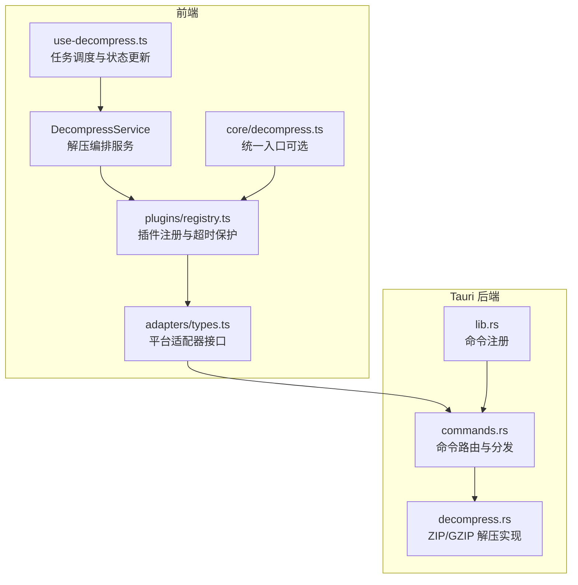
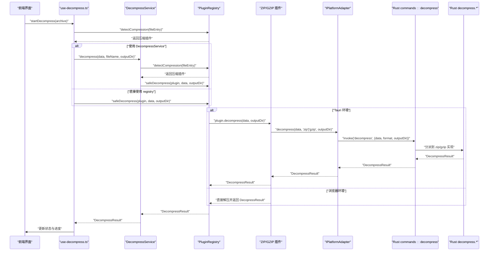
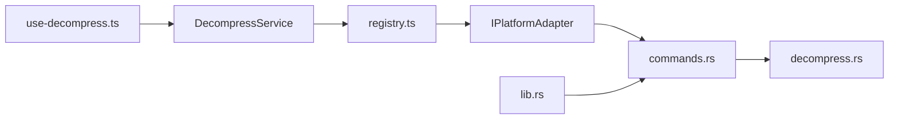

# 解压服务

<cite>
**本文引用的文件**   
- [decompress.ts](file://src/core/decompress.ts)
- [decompress.test.ts](file://src/__tests__\core\decompress.test.ts)
- [registry.ts](file://src/plugins/registry.ts)
- [registry.test.ts](file://src/__tests__\plugins\registry.test.ts)
- [use-decompress.ts](file://src/composables/use-decompress.ts)
- [types.ts](file://src/adapters/types.ts)
- [index.ts](file://src/types/index.ts)
- [task-scheduler.ts](file://src/core/task-scheduler.ts)
- [file-tree.ts](file://src/core/file-tree.ts)
</cite>

## 更新摘要
**变更内容**   
- 新增 DecompressService 类的完整测试覆盖，包括成功解压流程、缺失插件场景和错误处理验证
- 增强压缩注册表系统的集成测试，验证 safeDecompress 的错误包装机制
- 补充平台适配器接口的类型定义和实现细节
- 完善解压服务的架构说明和组件交互关系

## 目录
1. [简介](#简介)
2. [项目结构](#项目结构)
3. [核心组件](#核心组件)
4. [架构总览](#架构总览)
5. [详细组件分析](#详细组件分析)
6. [测试覆盖与质量保证](#测试覆盖与质量保证)
7. [依赖关系分析](#依赖关系分析)
8. [性能与内存优化](#性能与内存优化)
9. [故障排查指南](#故障排查指南)
10. [结论](#结论)
11. [附录：调用示例与最佳实践](#附录调用示例与最佳实践)

## 简介
本技术文档围绕 Hello-Tauri 的"解压服务"展开，系统性阐述从前端到 Rust 后端的完整解压流程。内容覆盖压缩格式识别、解压算法选择、进度跟踪、错误恢复机制、递归解压与嵌套文件处理、路径规范化、前后端通信协议与大文件内存优化策略等。重点说明 ZIP 与 GZIP 的处理逻辑，并提供可操作的调用示例与异常处理建议。

**更新** 新增了 DecompressService 类的完整测试覆盖，确保解压服务的可靠性和稳定性。

## 项目结构
解压服务由前端插件体系与 Tauri 后端命令共同组成：
- 前端通过插件注册表自动识别压缩类型并选择对应插件；在 Tauri 环境下，插件将解压请求转发至平台适配器，再由适配器调用 Rust 命令执行实际解压。
- Rust 后端提供统一的 decompress 命令，根据格式分发到 zip 或 gzip 解压实现，返回标准化的结果对象。
- DecompressService 作为解压编排层，协调文件检测、插件选择和结果处理。

**图表来源**
- [use-decompress.ts:1-89](file://src/composables/use-decompress.ts#L1-L89)
- [decompress.ts:1-27](file://src/core/decompress.ts#L1-L27)
- [registry.ts:1-118](file://src/plugins/registry.ts#L1-L118)
- [types.ts:1-12](file://src/adapters/types.ts#L1-L12)

**章节来源**
- [use-decompress.ts:1-89](file://src/composables/use-decompress.ts#L1-L89)
- [decompress.ts:1-27](file://src/core/decompress.ts#L1-L27)
- [registry.ts:1-118](file://src/plugins/registry.ts#L1-L118)
- [types.ts:1-12](file://src/adapters/types.ts#L1-L12)

## 核心组件
- **DecompressService 解压编排服务**：负责文件检测、插件选择和解压流程编排，提供统一的解压接口。
- **任务调度器 TaskScheduler**：控制并发与队列容量，避免 UI 线程阻塞与资源争用。
- **插件注册表 PluginRegistry**：维护压缩/解析插件映射，提供 detectCompression 与 safeDecompress（含超时保护）。
- **平台适配器接口 IPlatformAdapter**：定义跨平台的文件操作和解压接口规范。
- **压缩插件**：
  - ZIP 插件：Tauri 环境走后端解压；浏览器环境使用 fflate 进行内存解压。
  - GZIP 插件：Tauri 环境走后端解压；浏览器环境优先使用原生 DecompressionStream。
- **Rust 命令 decompress**：按 format 分发到 zip/gzip 解压函数，返回统一结果结构。
- **解压实现 decompress.rs**：
  - ZIP：遍历条目，创建目录/文件，记录每个文件的元信息。
  - GZIP：解码为单文件输出，命名固定为"decompressed"。
- **文件树构建 FileTreeBuilder**：将扁平文件列表组装为层级树，便于 UI 展示。

**章节来源**
- [decompress.ts:1-27](file://src/core/decompress.ts#L1-L27)
- [task-scheduler.ts:1-79](file://src/core/task-scheduler.ts#L1-L79)
- [registry.ts:1-118](file://src/plugins/registry.ts#L1-L118)
- [types.ts:1-12](file://src/adapters/types.ts#L1-L12)
- [file-tree.ts:1-69](file://src/core/file-tree.ts#L1-L69)

## 架构总览
以下序列图展示了从前端触发到 Rust 后端完成解压的关键调用链，以及 DecompressService 在其中的协调作用。

**图表来源**
- [use-decompress.ts:1-89](file://src/composables/use-decompress.ts#L1-L89)
- [decompress.ts:1-27](file://src/core/decompress.ts#L1-L27)
- [registry.ts:1-118](file://src/plugins/registry.ts#L1-L118)
- [types.ts:1-12](file://src/adapters/types.ts#L1-L12)

## 详细组件分析

### DecompressService 解压编排服务
DecompressService 是解压流程的核心编排类，负责协调文件检测、插件选择和解压执行。

**主要功能**：
- 接收原始数据、文件名和输出目录参数
- 构造 FileEntry 对象用于插件识别
- 通过注册表检测合适的压缩插件
- 处理无匹配插件的情况，返回结构化错误
- 委托给注册表的 safeDecompress 方法执行实际解压

**错误处理**：
- 当没有匹配的压缩插件时，返回包含错误信息的失败结果
- 所有解压错误都由注册表的 safeDecompress 统一包装和处理

**章节来源**
- [decompress.ts:1-27](file://src/core/decompress.ts#L1-L27)

### 插件注册与超时保护（registry.ts）
- 维护扩展名到插件名称的映射，支持启用/禁用插件。
- detectCompression 基于文件名后缀匹配插件。
- safeDecompress 对插件执行包裹超时保护，失败时返回结构化错误。
- 内置 30 秒超时保护机制，防止插件长时间挂起。

**章节来源**
- [registry.ts:1-118](file://src/plugins/registry.ts#L1-L118)

### 平台适配器接口（types.ts）
- 定义跨平台的文件操作和解压接口规范。
- 包含 readFile、writeFile、listFiles、decompress 等核心方法。
- 支持流式读取和大文件处理。

**章节来源**
- [types.ts:1-12](file://src/adapters/types.ts#L1-L12)

### 前端解压编排（use-decompress.ts）
- 读取压缩包二进制数据，构造 FileEntry 用于插件识别。
- 通过注册表检测压缩类型并安全调用插件解压（带超时保护）。
- 基于返回的文件列表构建文件树，计算原始大小，更新任务状态与进度。
- 使用任务调度器限制并发，失败时设置错误消息。
- 支持缓存恢复和文件对象复用，优化性能。

**章节来源**
- [use-decompress.ts:1-89](file://src/composables/use-decompress.ts#L1-L89)
- [task-scheduler.ts:1-79](file://src/core/task-scheduler.ts#L1-L79)
- [file-tree.ts:1-69](file://src/core/file-tree.ts#L1-L69)
- [index.ts:1-90](file://src/types/index.ts#L1-L90)

## 测试覆盖与质量保证

### DecompressService 单元测试
DecompressService 类拥有完整的测试覆盖，确保解压服务的可靠性和稳定性。

**测试场景**：
1. **成功解压流程**：验证找到压缩插件时正确调用 safeDecompress 并返回预期结果
2. **缺失插件场景**：验证无匹配插件时返回结构化失败结果，包含错误信息
3. **错误处理验证**：验证 safeDecompress 抛出异常时由 registry 正确包装

**测试特点**：
- 使用 Mock 对象隔离外部依赖
- 验证方法调用参数和返回值
- 覆盖正常流程和异常分支

**章节来源**
- [decompress.test.ts:1-102](file://src/__tests__\core\decompress.test.ts#L1-L102)

### 压缩注册表系统集成测试
PluginRegistry 的测试覆盖了压缩插件的完整生命周期管理。

**测试场景**：
1. **插件注册与检索**：验证压缩插件按扩展名正确注册和获取
2. **文件检测**：验证基于文件名的插件检测逻辑
3. **插件启用/禁用**：验证插件状态管理机制
4. **错误处理**：验证 safeDecompress 的错误捕获和包装机制

**错误处理测试**：
- 模拟插件抛出异常的场景
- 验证错误信息正确传递和格式化
- 确保返回标准的失败结果结构

**章节来源**
- [registry.test.ts:1-98](file://src/__tests__\plugins\registry.test.ts#L1-L98)

### 测试架构设计
测试采用分层 Mock 策略：
- **Mock 适配器**：模拟 IPlatformAdapter 接口的所有方法
- **Mock 注册表**：模拟 PluginRegistry 的核心功能
- **Mock 压缩插件**：模拟 ICompressionPlugin 接口的行为

这种设计确保了测试的独立性和可重复性，同时验证了组件间的契约关系。

**章节来源**
- [decompress.test.ts:7-40](file://src/__tests__\core\decompress.test.ts#L7-L40)

## 依赖关系分析
- 前端模块耦合度较低，通过接口与注册表解耦；插件可插拔，便于扩展新格式。
- 平台适配器屏蔽底层差异，使插件代码保持简洁。
- DecompressService 作为编排层，简化了上层调用复杂度。
- Rust 命令集中管理外部 IO 与第三方库调用，保证安全性与一致性。

**图表来源**
- [use-decompress.ts:1-89](file://src/composables/use-decompress.ts#L1-L89)
- [decompress.ts:1-27](file://src/core/decompress.ts#L1-L27)
- [registry.ts:1-118](file://src/plugins/registry.ts#L1-L118)
- [types.ts:1-12](file://src/adapters/types.ts#L1-L12)

**章节来源**
- [use-decompress.ts:1-89](file://src/composables/use-decompress.ts#L1-L89)
- [decompress.ts:1-27](file://src/core/decompress.ts#L1-L27)
- [registry.ts:1-118](file://src/plugins/registry.ts#L1-L118)
- [types.ts:1-12](file://src/adapters/types.ts#L1-L12)

## 性能与内存优化
- **大文件处理**
  - 当前 Tauri 适配器采用全量读取再包装为 ReadableStream，IPC 层未实现原生流式传输。对于超大压缩包，建议在后续版本引入事件或专用插件以支持分块读写。
  - ZIP 解压在 Rust 侧逐条写入磁盘，避免一次性加载整个归档到内存；GZIP 解压在当前实现中将全部数据读入内存后写出，适合中小文件。
- **并发控制**
  - 使用任务调度器限制最大并发数与队列长度，防止 UI 卡顿与资源耗尽。
- **超时保护**
  - 插件执行带有超时保护，避免长时间挂起导致用户体验下降。
- **路径与安全**
  - 命令层对路径包含".."进行拦截，防止路径穿越攻击。
- **调优建议**
  - 合理设置任务并发上限与队列容量，依据设备性能调整。
  - 针对超大 GZIP 文件，考虑流式解码与分片落盘策略。
  - 在浏览器环境中，优先使用原生 DecompressionStream 以降低内存峰值。
- **缓存优化**
  - use-decompress 支持文件对象复用和缓存恢复，避免重复 IO 操作。

**章节来源**
- [task-scheduler.ts:1-79](file://src/core/task-scheduler.ts#L1-L79)
- [registry.ts:1-118](file://src/plugins/registry.ts#L1-L118)
- [types.ts:1-12](file://src/adapters/types.ts#L1-L12)
- [use-decompress.ts:1-89](file://src/composables/use-decompress.ts#L1-L89)

## 故障排查指南
- **常见错误与定位**
  - **无可用插件**：当文件名后缀不在任何压缩插件支持列表中时，会返回"No compression plugin for: filename"的错误提示。
  - **解压失败**：插件内部抛出异常或超时，safeDecompress 会捕获并返回结构化错误信息。
  - **路径穿越**：Rust 命令层拒绝包含".."的路径，返回权限相关错误。
  - **任务队列满**：当并发任务超过限制时，返回"Task queue is full"错误。
- **调试步骤**
  - 检查任务调度器状态（pendingCount、runningCount），确认是否存在队列满或并发过高问题。
  - 查看插件注册表是否启用了相应压缩插件。
  - 在 Tauri 环境下，确认 invoke 调用是否正确传递了 data、format、output_dir。
  - 关注 DecompressResult.success 与 error 字段，快速定位失败原因。
  - 使用 DecompressService 的测试结果验证插件检测和错误处理逻辑。

**章节来源**
- [use-decompress.ts:1-89](file://src/composables/use-decompress.ts#L1-L89)
- [registry.ts:1-118](file://src/plugins/registry.ts#L1-L118)
- [decompress.test.ts:73-83](file://src/__tests__\core\decompress.test.ts#L73-L83)
- [index.ts:1-90](file://src/types/index.ts#L1-L90)

## 结论
Hello-Tauri 的解压服务通过"DecompressService 编排 + 前端插件 + 平台适配 + Rust 命令"的分层设计，实现了跨环境的压缩格式识别与解压能力。新增的完整测试覆盖确保了服务的可靠性和稳定性。ZIP 与 GZIP 的处理逻辑清晰，具备超时保护与并发控制，满足一般场景需求。针对大文件与流式处理的进一步优化，可在后续迭代中引入事件驱动与分块 I/O 以提升性能与稳定性。

## 附录：调用示例与最佳实践
- **基本调用流程（前端）**
  - 使用 useArchiveManager 添加文件并触发解压。
  - 使用 useDecompress 启动单个或批量解压任务。
  - 监听 ArchiveItem 的状态与进度变化，渲染 UI。
- **使用 DecompressService**
  - 直接实例化 DecompressService 并调用 decompress 方法。
  - 传入 Uint8Array 数据、文件名和输出目录。
  - 处理返回的 DecompressResult 对象。
- **调用示例路径**
  - 添加与触发解压：[use-decompress.ts:16-77](file://src/composables/use-decompress.ts#L16-L77)
  - DecompressService 使用：[decompress.ts:11-25](file://src/core/decompress.ts#L11-L25)
  - 统一入口（可选）：[decompress.ts:1-27](file://src/core/decompress.ts#L1-L27)
- **处理解压结果**
  - 检查 DecompressResult.success 与 files 列表，构建文件树并展示。
  - 参考文件树构建：[file-tree.ts:1-69](file://src/core/file-tree.ts#L1-L69)
- **监控解压进度**
  - 通过 updateStatus 更新状态与进度百分比，结合任务调度器统计运行中任务数量。
  - 参考状态更新与统计：[use-decompress.ts:16-77](file://src/composables/use-decompress.ts#L16-L77)
- **异常情况处理**
  - 捕获插件超时或内部错误，显示友好提示并允许重试。
  - 参考安全解压与错误返回：[registry.ts:106-116](file://src/plugins/registry.ts#L106-L116)
  - 使用 DecompressService 的错误处理逻辑：[decompress.ts:19-22](file://src/core/decompress.ts#L19-L22)
- **测试最佳实践**
  - 使用 Mock 对象隔离外部依赖。
  - 覆盖正常流程和异常分支。
  - 验证方法调用参数和返回值。
  - 参考测试用例：[decompress.test.ts:53-100](file://src/__tests__\core\decompress.test.ts#L53-L100)