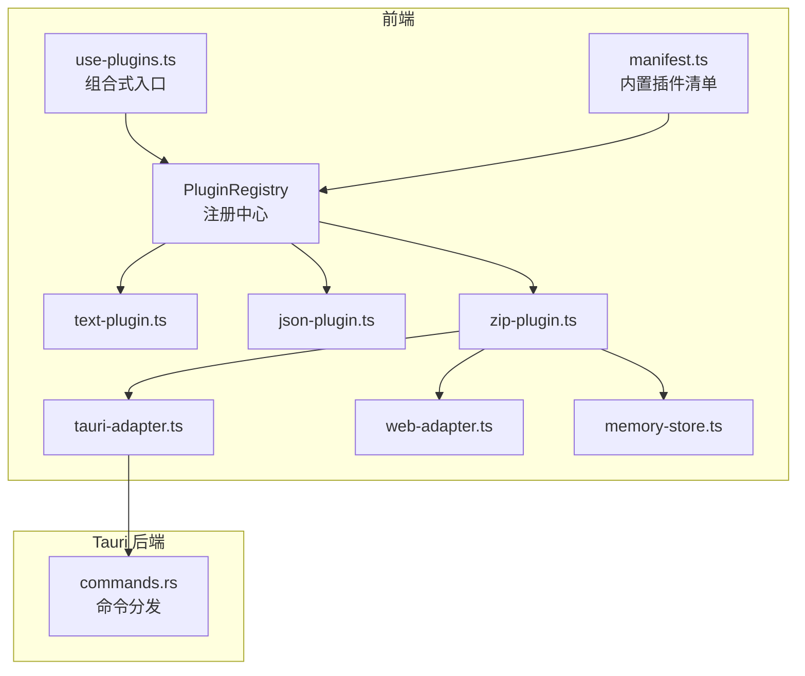
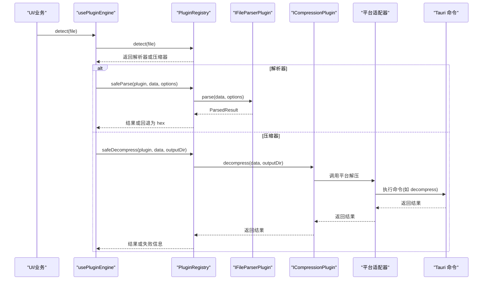
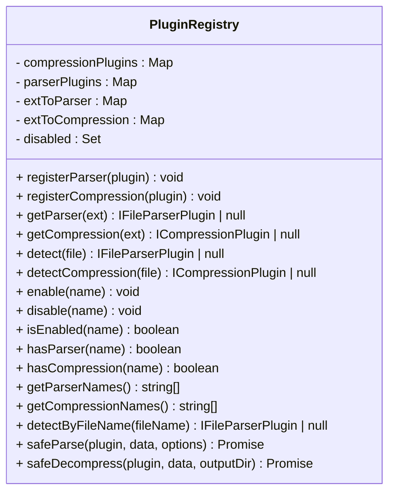
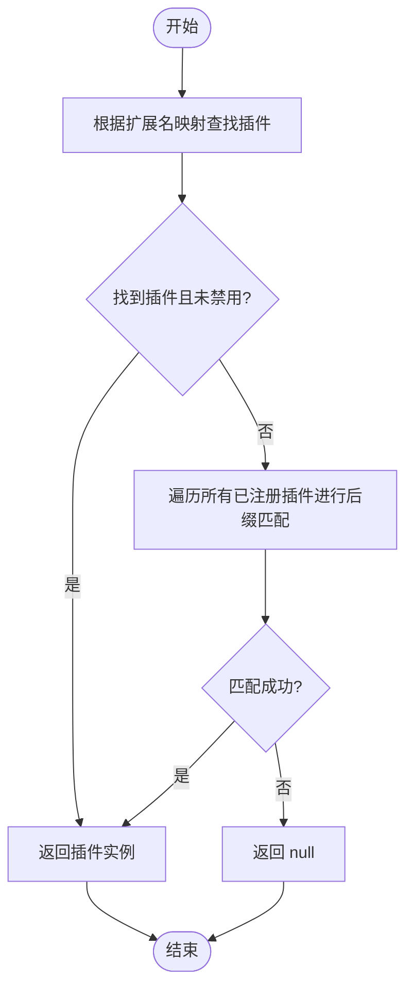
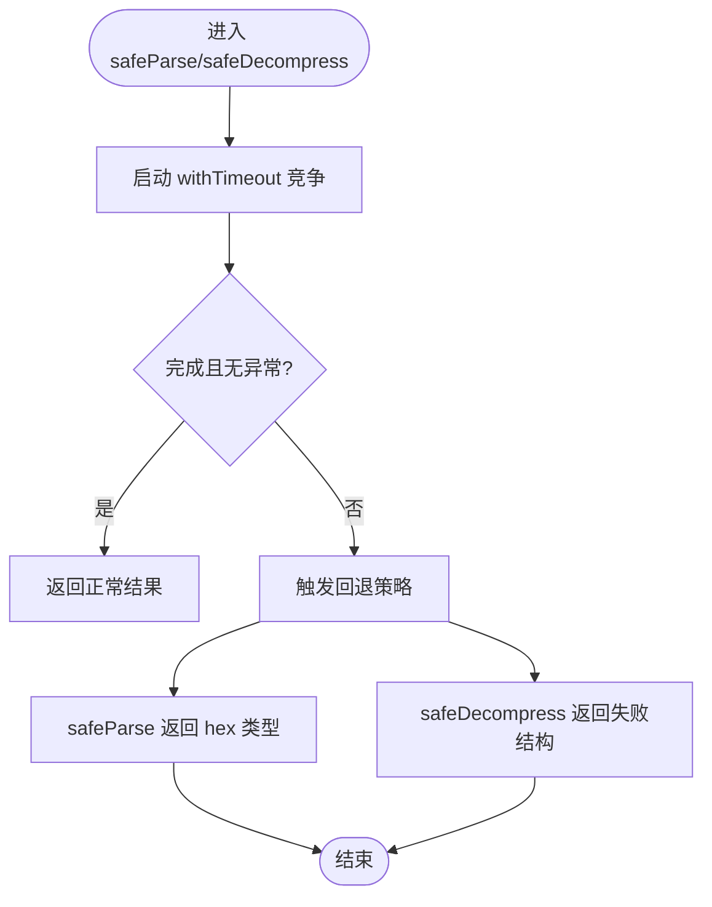
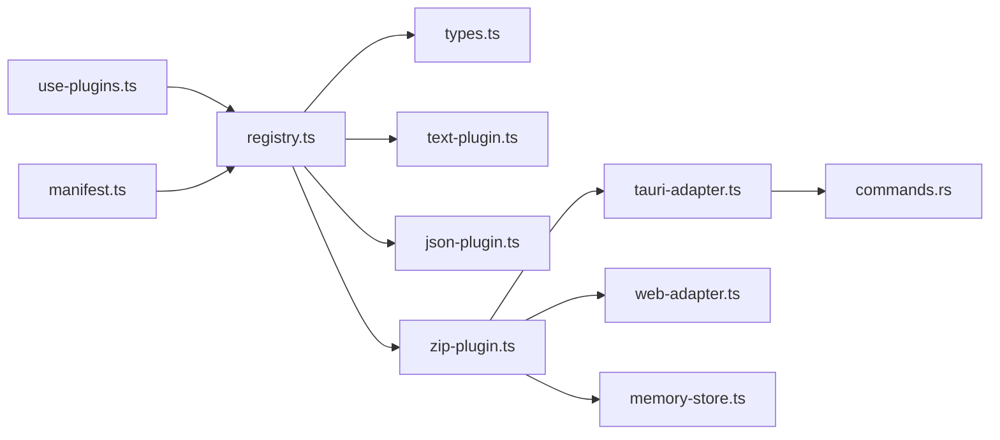

# 插件注册中心

<cite>
**本文引用的文件**   
- [src/plugins/registry.ts](file://src/plugins/registry.ts)
- [src/plugins/types.ts](file://src/plugins/types.ts)
- [src/plugins/manifest.ts](file://src/plugins/manifest.ts)
- [src/composables/use-plugins.ts](file://src/composables/use-plugins.ts)
- [src/plugins/parser/text-plugin.ts](file://src/plugins/parser/text-plugin.ts)
- [src/plugins/parser/json-plugin.ts](file://src/plugins/parser/json-plugin.ts)
- [src/plugins/parsers/text-parser.ts](file://src/plugins/parsers/text-parser.ts)
- [src/plugins/parsers/json-parser.ts](file://src/plugins/parsers/json-parser.ts)
- [src/plugins/compression/zip-plugin.ts](file://src/plugins/compression/zip-plugin.ts)
- [src/adapters/tauri-adapter.ts](file://src/adapters/tauri-adapter.ts)
- [src/adapters/types.ts](file://src/adapters/types.ts)
- [src/core/memory-store.ts](file://src/core/memory-store.ts)
- [src/composables/use-platform.ts](file://src/composables/use-platform.ts)
- [src-tauri/src/commands.rs](file://src-tauri/src/commands.rs)
- [src/__tests__/plugins/registry.test.ts](file://src/__tests__/plugins/registry.test.ts)
- [src/types/index.ts](file://src/types/index.ts)
</cite>

## 目录
1. [简介](#简介)
2. [项目结构](#项目结构)
3. [核心组件](#核心组件)
4. [架构总览](#架构总览)
5. [详细组件分析](#详细组件分析)
6. [依赖关系分析](#依赖关系分析)
7. [性能与内存管理](#性能与内存管理)
8. [安全沙箱与权限控制](#安全沙箱与权限控制)
9. [故障排查指南](#故障排查指南)
10. [结论](#结论)
11. [附录：使用示例与最佳实践](#附录使用示例与最佳实践)

## 简介
本技术文档聚焦 Hello-Tauri 的“插件注册中心”，系统性阐述插件发现、注册表管理、依赖解析、版本兼容性检查、生命周期管理（初始化、激活、停用、销毁）、错误恢复与安全隔离等关键机制。文档同时提供面向不同读者的分层说明，并给出可操作的配置与扩展指引。

## 项目结构
围绕插件系统的关键代码分布在以下位置：
- 注册中心与类型定义：src/plugins/registry.ts、src/plugins/types.ts
- 内置插件清单：src/plugins/manifest.ts
- 组合式入口：src/composables/use-plugins.ts
- 具体插件实现（解析器/压缩器）：src/plugins/parser/*、src/plugins/compression/*
- 平台适配层（Tauri/Web）：src/adapters/*、src/composables/use-platform.ts
- Tauri 后端命令：src-tauri/src/commands.rs
- 内存存储与通用类型：src/core/memory-store.ts、src/types/index.ts
- 测试用例：src/__tests__/plugins/registry.test.ts



图表来源
- [src/composables/use-plugins.ts:1-17](file://src/composables/use-plugins.ts#L1-L17)
- [src/plugins/registry.ts:14-118](file://src/plugins/registry.ts#L14-L118)
- [src/plugins/manifest.ts:10-19](file://src/plugins/manifest.ts#L10-L19)
- [src/plugins/parser/text-plugin.ts:5-17](file://src/plugins/parser/text-plugin.ts#L5-L17)
- [src/plugins/parser/json-plugin.ts:5-18](file://src/plugins/parser/json-plugin.ts#L5-L18)
- [src/plugins/compression/zip-plugin.ts:4-39](file://src/plugins/compression/zip-plugin.ts#L4-L39)
- [src/adapters/tauri-adapter.ts:14-59](file://src/adapters/tauri-adapter.ts#L14-L59)
- [src-tauri/src/commands.rs:5-52](file://src-tauri/src/commands.rs#L5-L52)

章节来源
- [src/composables/use-plugins.ts:1-17](file://src/composables/use-plugins.ts#L1-L17)
- [src/plugins/registry.ts:14-118](file://src/plugins/registry.ts#L14-L118)
- [src/plugins/manifest.ts:10-19](file://src/plugins/manifest.ts#L10-L19)

## 核心组件
- 插件注册中心 PluginRegistry
  - 维护解析器与压缩器的注册表，以及扩展名到插件名的映射，支持启用/禁用、按扩展名或文件名检测、安全调用封装。
- 插件类型契约 IFileParserPlugin / ICompressionPlugin
  - 统一插件接口，包含名称、支持的扩展名、能力判断、核心处理函数及可选配置模式。
- 内置插件清单 registerBuiltinPlugins
  - 集中注册文本、CSV、JSON、日志、十六进制解析器与 zip/gzip 压缩器。
- 组合式入口 usePluginEngine
  - 创建全局注册表实例并暴露便捷方法供 UI 与业务逻辑使用。

章节来源
- [src/plugins/registry.ts:14-118](file://src/plugins/registry.ts#L14-L118)
- [src/plugins/types.ts:16-30](file://src/plugins/types.ts#L16-L30)
- [src/plugins/manifest.ts:10-19](file://src/plugins/manifest.ts#L10-L19)
- [src/composables/use-plugins.ts:4-16](file://src/composables/use-plugins.ts#L4-L16)

## 架构总览
插件注册中心作为前端侧的统一调度点，负责：
- 插件发现：基于扩展名映射与文件名后缀匹配
- 注册表管理：Map/Set 维护插件集合与状态
- 依赖解析：通过适配器选择平台能力（Tauri/Web），按需动态加载
- 版本兼容：由插件声明 supportedExtensions 与 canParse/canHandle 决定是否可用
- 生命周期：注册→检测→解析/解压→渲染；支持启用/禁用与超时保护



图表来源
- [src/composables/use-plugins.ts:7-16](file://src/composables/use-plugins.ts#L7-L16)
- [src/plugins/registry.ts:47-116](file://src/plugins/registry.ts#L47-L116)
- [src/plugins/parser/text-plugin.ts:11-16](file://src/plugins/parser/text-plugin.ts#L11-L16)
- [src/plugins/compression/zip-plugin.ts:10-38](file://src/plugins/compression/zip-plugin.ts#L10-L38)
- [src/adapters/tauri-adapter.ts:36-39](file://src/adapters/tauri-adapter.ts#L36-L39)
- [src-tauri/src/commands.rs:37-52](file://src-tauri/src/commands.rs#L37-L52)

## 详细组件分析

### 插件注册中心（PluginRegistry）
职责与特性
- 注册与查询
  - 解析器：registerParser/getParser/detect/detectByFileName
  - 压缩器：registerCompression/getCompression/detectCompression
- 状态管理
  - enable/disable/isEnabled 控制插件可用性
- 安全调用
  - safeParse/safeDecompress 带超时与异常捕获，提供降级策略
- 内部数据结构
  - parserPlugins/compressionPlugins：名称到插件实例的映射
  - extToParser/extToCompression：扩展名到插件名称的映射
  - disabled：被禁用的插件名集合

复杂度与性能
- 注册：O(k)，k 为 supportedExtensions 数量
- 查找：O(1) Map 查找；detect 遍历所有已注册项 O(n)
- 超时：withTimeout 基于 Promise.race，避免阻塞



图表来源
- [src/plugins/registry.ts:14-118](file://src/plugins/registry.ts#L14-L118)

章节来源
- [src/plugins/registry.ts:14-118](file://src/plugins/registry.ts#L14-L118)

### 插件类型契约（IFileParserPlugin / ICompressionPlugin）
- IFileParserPlugin
  - name、supportedExtensions、canParse、parse、getComponent、getConfigSchema（可选）
- ICompressionPlugin
  - name、supportedExtensions、canHandle、decompress
- 配置模式 ConfigSchema/ConfigField
  - 用于描述插件参数表单字段，便于 UI 生成配置界面

```mermaid
classDiagram
class IFileParserPlugin {
+string name
+string[] supportedExtensions
+canParse(file) bool
+parse(data, options) Promise<ParsedResult>
+getComponent() Component
+getConfigSchema() ConfigSchema
}
class ICompressionPlugin {
+string name
+string[] supportedExtensions
+canHandle(file) bool
+decompress(data, outputDir) Promise<DecompressResult>
}
class ConfigSchema {
+fields : ConfigField[]
}
class ConfigField {
+string key
+string label
+type : input|select|switch|number
+default : any
+options : {label,value}[]
}
IFileParserPlugin --> ConfigSchema : "可选"
```

图表来源
- [src/plugins/types.ts:4-30](file://src/plugins/types.ts#L4-L30)

章节来源
- [src/plugins/types.ts:4-30](file://src/plugins/types.ts#L4-L30)

### 内置插件清单（manifest）
- 集中注册文本、CSV、JSON、日志、十六进制解析器与 zip/gzip 压缩器
- 通过 registerBuiltinPlugins 一次性注入到注册中心

章节来源
- [src/plugins/manifest.ts:10-19](file://src/plugins/manifest.ts#L10-L19)

### 组合式入口（usePluginEngine）
- 创建单例注册表并自动注册内置插件
- 对外暴露 registry 与常用方法（detect/getParser/getCompression/enable/disable）

章节来源
- [src/composables/use-plugins.ts:4-16](file://src/composables/use-plugins.ts#L4-L16)

### 解析器插件示例（text/json）
- text-plugin：声明支持的扩展名，实现 canParse/parse/getComponent
- json-plugin：对 JSON/JSONL 进行解析与格式化，返回结构化数据与行数统计

章节来源
- [src/plugins/parser/text-plugin.ts:5-17](file://src/plugins/parser/text-plugin.ts#L5-L17)
- [src/plugins/parser/json-plugin.ts:5-18](file://src/plugins/parser/json-plugin.ts#L5-L18)
- [src/plugins/parsers/text-parser.ts:3-7](file://src/plugins/parsers/text-parser.ts#L3-L7)
- [src/plugins/parsers/json-parser.ts:3-16](file://src/plugins/parsers/json-parser.ts#L3-L16)

### 压缩器插件示例（zip）
- zip-plugin：根据平台选择实现
  - Tauri：通过适配器调用后端命令解压
  - Web：使用 fflate 在内存中解压，写入 memoryStore 并返回文件列表
- 错误处理：返回失败结果并携带错误消息

章节来源
- [src/plugins/compression/zip-plugin.ts:4-39](file://src/plugins/compression/zip-plugin.ts#L4-L39)
- [src/core/memory-store.ts:1-26](file://src/core/memory-store.ts#L1-L26)

### 平台适配层（Tauri/Web）
- TauriAdapter：通过 @tauri-apps/api/core.invoke 调用 Rust 命令
- usePlatform：懒加载并缓存当前平台的适配器实例

章节来源
- [src/adapters/tauri-adapter.ts:14-59](file://src/adapters/tauri-adapter.ts#L14-L59)
- [src/composables/use-platform.ts:5-16](file://src/composables/use-platform.ts#L5-L16)
- [src/adapters/types.ts:3-11](file://src/adapters/types.ts#L3-L11)

### Tauri 后端命令（Rust）
- commands.rs 提供 read_file/write_file/list_files/decompress/mmap_read 等命令
- decompress 根据格式路由到 zip/gzip 解压实现，统一返回成功/失败结构

章节来源
- [src-tauri/src/commands.rs:5-52](file://src-tauri/src/commands.rs#L5-L52)

### 插件发现算法流程


图表来源
- [src/plugins/registry.ts:35-63](file://src/plugins/registry.ts#L35-L63)

章节来源
- [src/plugins/registry.ts:35-63](file://src/plugins/registry.ts#L35-L63)

### 安全调用与错误恢复流程


图表来源
- [src/plugins/registry.ts:98-116](file://src/plugins/registry.ts#L98-L116)

章节来源
- [src/plugins/registry.ts:98-116](file://src/plugins/registry.ts#L98-L116)

## 依赖关系分析
- 模块耦合
  - use-plugins 仅依赖 registry 与 manifest，保持低耦合
  - 插件实现依赖 types 契约与平台适配器
  - 压缩器在 Tauri 环境下依赖 Rust 命令，Web 环境依赖 fflate 与内存存储
- 外部依赖
  - Tauri IPC：@tauri-apps/api/core.invoke
  - Web 解压：fflate（条件导入）
  - Vue 组件：解析器返回渲染组件



图表来源
- [src/composables/use-plugins.ts:1-16](file://src/composables/use-plugins.ts#L1-L16)
- [src/plugins/registry.ts:14-118](file://src/plugins/registry.ts#L14-L118)
- [src/plugins/manifest.ts:10-19](file://src/plugins/manifest.ts#L10-L19)
- [src/plugins/parser/text-plugin.ts:5-17](file://src/plugins/parser/text-plugin.ts#L5-L17)
- [src/plugins/parser/json-plugin.ts:5-18](file://src/plugins/parser/json-plugin.ts#L5-L18)
- [src/plugins/compression/zip-plugin.ts:4-39](file://src/plugins/compression/zip-plugin.ts#L4-L39)
- [src/adapters/tauri-adapter.ts:14-59](file://src/adapters/tauri-adapter.ts#L14-L59)
- [src-tauri/src/commands.rs:5-52](file://src-tauri/src/commands.rs#L5-L52)

章节来源
- [src/composables/use-plugins.ts:1-16](file://src/composables/use-plugins.ts#L1-L16)
- [src/plugins/registry.ts:14-118](file://src/plugins/registry.ts#L14-L118)
- [src/plugins/manifest.ts:10-19](file://src/plugins/manifest.ts#L10-L19)
- [src/plugins/compression/zip-plugin.ts:4-39](file://src/plugins/compression/zip-plugin.ts#L4-L39)
- [src/adapters/tauri-adapter.ts:14-59](file://src/adapters/tauri-adapter.ts#L14-L59)
- [src-tauri/src/commands.rs:5-52](file://src-tauri/src/commands.rs#L5-L52)

## 性能与内存管理
- 超时保护
  - withTimeout 限制插件执行时间，防止长时间阻塞主线程
- 内存占用
  - Web 端解压将文件内容写入内存 Map，适合中小体积压缩包；大文件建议优先走 Tauri 路径落盘
- 流式读取
  - TauriAdapter 提供 streamRead 包装，但当前实现仍全量读取后推送，后续可通过事件或分块 IO 优化
- 资源清理
  - MemoryStore.clear 可用于释放内存；建议在任务完成后显式清理临时数据

章节来源
- [src/plugins/registry.ts:6-12](file://src/plugins/registry.ts#L6-L12)
- [src/plugins/compression/zip-plugin.ts:17-37](file://src/plugins/compression/zip-plugin.ts#L17-L37)
- [src/core/memory-store.ts:16-18](file://src/core/memory-store.ts#L16-L18)
- [src/adapters/tauri-adapter.ts:49-58](file://src/adapters/tauri-adapter.ts#L49-L58)

## 安全沙箱与权限控制
- 路径穿越防护
  - Tauri 命令对路径中包含 ".." 的请求直接拒绝，避免越权访问
- 权限边界
  - 前端插件仅能调用受控命令，无法直接访问文件系统；所有 IO 操作经 Tauri 命令白名单放行
- 资源隔离
  - 插件运行于浏览器上下文，通过适配器与后端交互；压缩器在 Web 模式下使用内存存储，避免污染全局状态

章节来源
- [src-tauri/src/commands.rs:6-14](file://src-tauri/src/commands.rs#L6-L14)
- [src/adapters/tauri-adapter.ts:14-59](file://src/adapters/tauri-adapter.ts#L14-L59)

## 故障排查指南
- 常见问题
  - 插件未生效：确认已注册且未被禁用；检查扩展名映射是否正确
  - 解析失败：safeParse 会回退为 hex 类型，查看返回结果 type 是否为 hex
  - 解压失败：safeDecompress 返回 success=false 并携带 error 信息
  - 超时：插件执行超过阈值将被中断，需优化插件逻辑或调整超时时间
- 定位手段
  - 使用 registry.getParserNames()/getCompressionNames() 列出已注册插件
  - 使用 isEnabled 检查插件状态
  - 在 Tauri 命令层记录错误堆栈，结合前端返回的错误消息定位问题

章节来源
- [src/__tests__/plugins/registry.test.ts:71-96](file://src/__tests__/plugins/registry.test.ts#L71-L96)
- [src/plugins/registry.ts:85-91](file://src/plugins/registry.ts#L85-L91)
- [src/plugins/registry.ts:65-75](file://src/plugins/registry.ts#L65-L75)

## 结论
插件注册中心以简洁的接口与清晰的职责划分，实现了可扩展的解析与压缩能力。通过超时保护、错误回退与平台适配，系统在易用性与健壮性之间取得平衡。未来可在流式 IO、内存回收与插件间依赖解析方面进一步增强。

## 附录：使用示例与最佳实践
- 注册自定义解析器
  - 实现 IFileParserPlugin 接口，声明 supportedExtensions 与 canParse/parse/getComponent
  - 在应用启动时通过 registry.registerParser 注册，或在 manifest 中集中管理
  - 参考路径：[src/plugins/parser/text-plugin.ts:5-17](file://src/plugins/parser/text-plugin.ts#L5-L17)、[src/plugins/manifest.ts:10-19](file://src/plugins/manifest.ts#L10-L19)
- 配置插件参数
  - 可选实现 getConfigSchema 返回 ConfigSchema，由 UI 渲染配置表单
  - 参考路径：[src/plugins/types.ts:4-14](file://src/plugins/types.ts#L4-L14)
- 处理插件冲突
  - 多个插件支持同一扩展名时，优先使用 Map 中最后注册的；可通过 disable/enable 控制优先级
  - 参考路径：[src/plugins/registry.ts:21-33](file://src/plugins/registry.ts#L21-L33)、[src/plugins/registry.ts:65-75](file://src/plugins/registry.ts#L65-L75)
- 错误恢复
  - 使用 safeParse/safeDecompress 包裹调用，确保异常不会导致崩溃
  - 参考路径：[src/plugins/registry.ts:98-116](file://src/plugins/registry.ts#L98-L116)
- 生命周期管理
  - 初始化：应用启动时创建 registry 并注册内置插件
  - 激活：用户选择文件或扩展名时，通过 detect/getParser 获取插件并调用 parse
  - 停用：通过 disable 禁用特定插件，避免其参与后续检测
  - 销毁：关闭页面或退出应用时，清理内存存储与临时资源
  - 参考路径：[src/composables/use-plugins.ts:4-16](file://src/composables/use-plugins.ts#L4-L16)、[src/core/memory-store.ts:16-18](file://src/core/memory-store.ts#L16-L18)
- 版本兼容性检查
  - 通过 supportedExtensions 与 canParse/canHandle 声明能力边界，避免不兼容文件被误处理
  - 参考路径：[src/plugins/types.ts:16-30](file://src/plugins/types.ts#L16-L30)