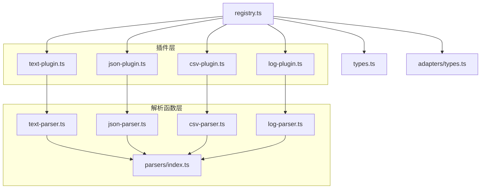
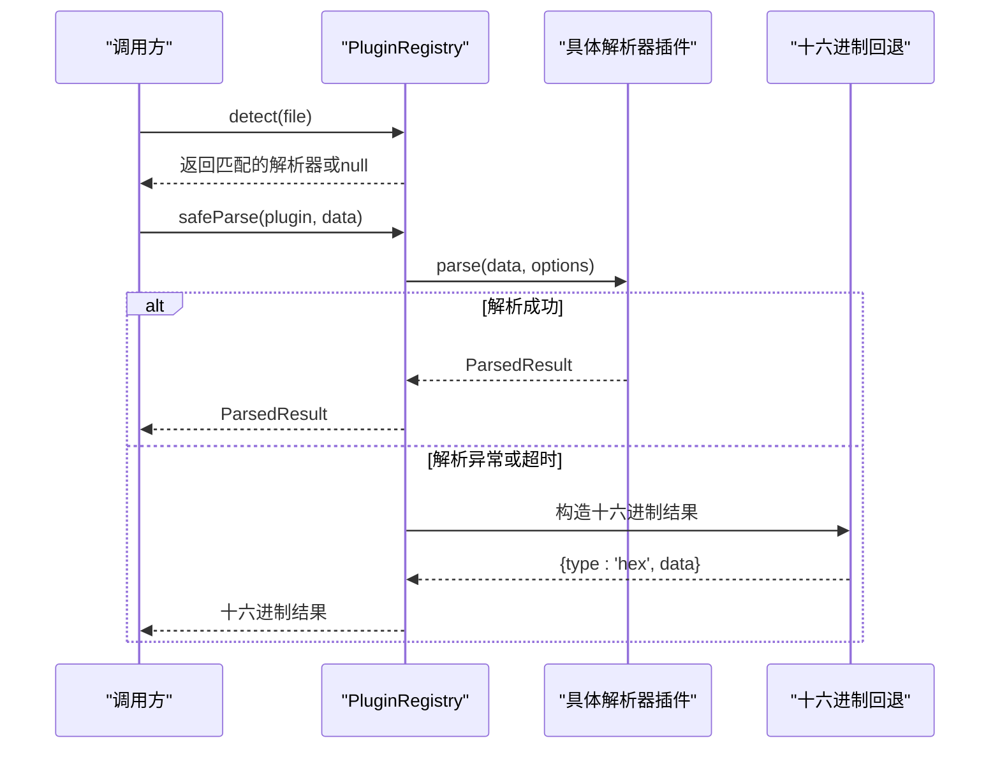
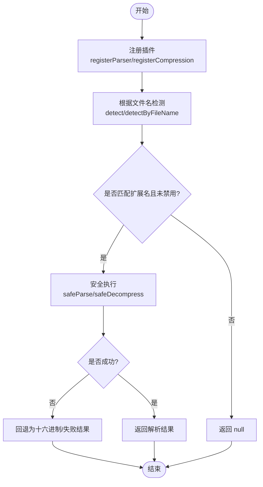
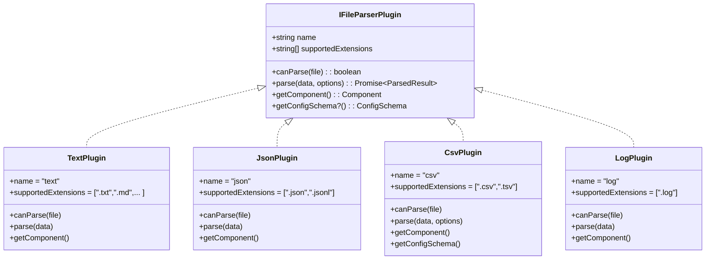
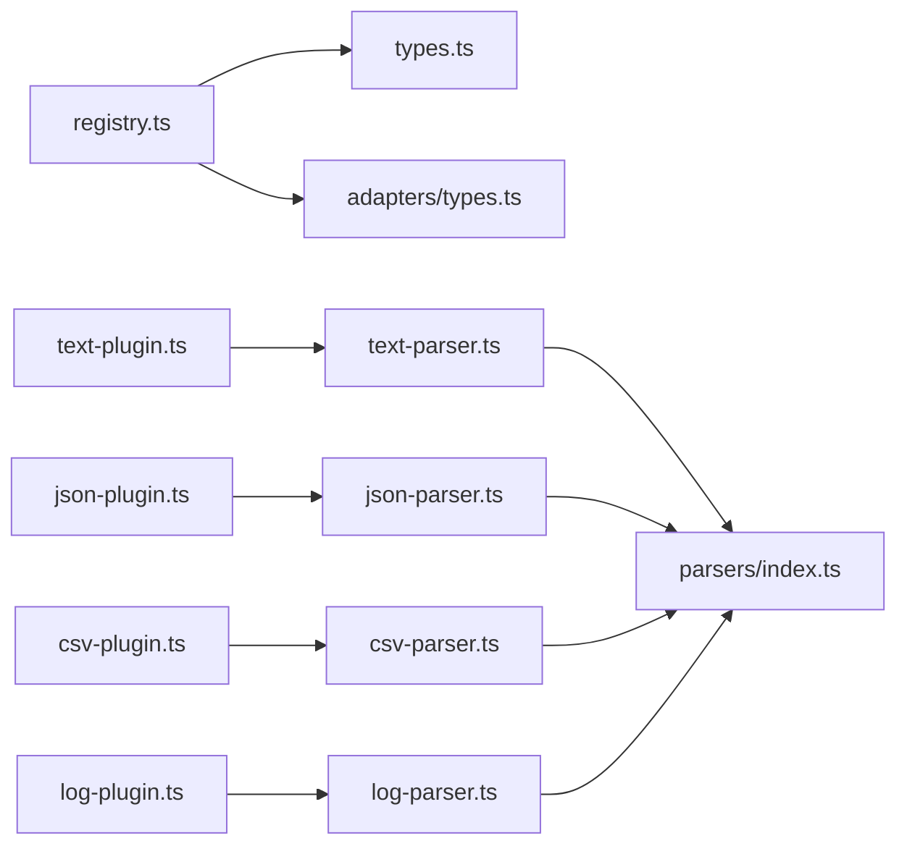

# 格式检测机制

<cite>
**本文引用的文件**   
- [src/plugins/registry.ts](file://src/plugins/registry.ts)
- [src/plugins/types.ts](file://src/plugins/types.ts)
- [src/plugins/parser/text-plugin.ts](file://src/plugins/parser/text-plugin.ts)
- [src/plugins/parser/json-plugin.ts](file://src/plugins/parser/json-plugin.ts)
- [src/plugins/parser/csv-plugin.ts](file://src/plugins/parser/csv-plugin.ts)
- [src/plugins/parser/log-plugin.ts](file://src/plugins/parser/log-plugin.ts)
- [src/plugins/parsers/index.ts](file://src/plugins/parsers/index.ts)
- [src/plugins/parsers/text-parser.ts](file://src/plugins/parsers/text-parser.ts)
- [src/plugins/parsers/json-parser.ts](file://src/plugins/parsers/json-parser.ts)
- [src/plugins/parsers/csv-parser.ts](file://src/plugins/parsers/csv-parser.ts)
- [src/plugins/parsers/log-parser.ts](file://src/plugins/parsers/log-parser.ts)
- [src/adapters/types.ts](file://src/adapters/types.ts)
- [src/__tests__/plugins/registry.test.ts](file://src/__tests__/plugins/registry.test.ts)
</cite>

## 目录
1. [简介](#简介)
2. [项目结构](#项目结构)
3. [核心组件](#核心组件)
4. [架构总览](#架构总览)
5. [详细组件分析](#详细组件分析)
6. [依赖关系分析](#依赖关系分析)
7. [性能考虑](#性能考虑)
8. [故障排查指南](#故障排查指南)
9. [结论](#结论)
10. [附录](#附录)

## 简介
本技术文档聚焦于 Hello-Tauri 的“文件格式自动检测机制”，围绕插件注册、扩展名匹配、内容特征识别与启发式判断、优先级策略、回退机制、误判处理、多格式智能选择、缓存策略、准确率优化以及大文件场景下的性能与内存优化进行系统化说明。文档同时提供自定义格式检测器的实现路径、配置规则的方法，并给出关键流程的可视化图示，帮助读者快速理解与扩展系统能力。

## 项目结构
与格式检测相关的代码主要分布在以下模块：
- 插件注册与调度：PluginRegistry（扩展名到解析器映射、安全执行封装）
- 插件接口定义：IFileParserPlugin、ICompressionPlugin、ParsedResult 等
- 内置解析器插件：text、json、csv、log 插件及其对应的解析函数
- 平台适配器类型：统一 I/O 与流式读取抽象
- 测试用例：覆盖注册、检测、禁用/启用、安全解析与回退行为

图表来源
- [src/plugins/registry.ts:14-96](file://src/plugins/registry.ts#L14-L96)
- [src/plugins/types.ts:16-36](file://src/plugins/types.ts#L16-L36)
- [src/plugins/parser/text-plugin.ts:1-18](file://src/plugins/parser/text-plugin.ts#L1-L18)
- [src/plugins/parser/json-plugin.ts:1-19](file://src/plugins/parser/json-plugin.ts#L1-L19)
- [src/plugins/parser/csv-plugin.ts:1-28](file://src/plugins/parser/csv-plugin.ts#L1-L28)
- [src/plugins/parser/log-plugin.ts:1-18](file://src/plugins/parser/log-plugin.ts#L1-L18)
- [src/plugins/parsers/index.ts:1-7](file://src/plugins/parsers/index.ts#L1-L7)
- [src/adapters/types.ts:1-12](file://src/adapters/types.ts#L1-L12)

章节来源
- [src/plugins/registry.ts:14-96](file://src/plugins/registry.ts#L14-L96)
- [src/plugins/types.ts:16-36](file://src/plugins/types.ts#L16-L36)
- [src/plugins/parser/text-plugin.ts:1-18](file://src/plugins/parser/text-plugin.ts#L1-L18)
- [src/plugins/parser/json-plugin.ts:1-19](file://src/plugins/parser/json-plugin.ts#L1-L19)
- [src/plugins/parser/csv-plugin.ts:1-28](file://src/plugins/parser/csv-plugin.ts#L1-L28)
- [src/plugins/parser/log-plugin.ts:1-18](file://src/plugins/parser/log-plugin.ts#L1-L18)
- [src/plugins/parsers/index.ts:1-7](file://src/plugins/parsers/index.ts#L1-L7)
- [src/adapters/types.ts:1-12](file://src/adapters/types.ts#L1-L12)

## 核心组件
- 插件注册中心（PluginRegistry）
  - 维护解析器与压缩插件的 Map，以及扩展名到插件名的索引表
  - 提供 detect/detectByFileName 基于扩展名匹配的检测方法
  - 提供 safeParse/safeDecompress 带超时与异常捕获的安全执行封装
  - 支持 enable/disable/isEnabled 动态控制插件可用性
- 插件接口（IFileParserPlugin/ICompressionPlugin）
  - 声明 supportedExtensions、canParse/canHandle、parse/decompress、getComponent 等契约
  - 可选 getConfigSchema 用于暴露可配置字段
- 内置解析器插件
  - text、json、csv、log 四个插件分别对应文本、JSON、CSV、日志的结构化解析与渲染组件
- 解析函数
  - 各格式的纯函数解析逻辑，返回统一的 ParsedResult

章节来源
- [src/plugins/registry.ts:14-118](file://src/plugins/registry.ts#L14-L118)
- [src/plugins/types.ts:16-36](file://src/plugins/types.ts#L16-L36)
- [src/plugins/parser/text-plugin.ts:1-18](file://src/plugins/parser/text-plugin.ts#L1-L18)
- [src/plugins/parser/json-plugin.ts:1-19](file://src/plugins/parser/json-plugin.ts#L1-L19)
- [src/plugins/parser/csv-plugin.ts:1-28](file://src/plugins/parser/csv-plugin.ts#L1-L28)
- [src/plugins/parser/log-plugin.ts:1-18](file://src/plugins/parser/log-plugin.ts#L1-L18)
- [src/plugins/parsers/text-parser.ts:1-8](file://src/plugins/parsers/text-parser.ts#L1-L8)
- [src/plugins/parsers/json-parser.ts:1-17](file://src/plugins/parsers/json-parser.ts#L1-L17)
- [src/plugins/parsers/csv-parser.ts:1-17](file://src/plugins/parsers/csv-parser.ts#L1-L17)
- [src/plugins/parsers/log-parser.ts:1-37](file://src/plugins/parsers/log-parser.ts#L1-L37)

## 架构总览
下图展示了从文件名到具体解析器的检测流程，以及安全解析时的回退策略。

图表来源
- [src/plugins/registry.ts:47-104](file://src/plugins/registry.ts#L47-L104)

章节来源
- [src/plugins/registry.ts:47-104](file://src/plugins/registry.ts#L47-L104)

## 详细组件分析

### 插件注册与检测（PluginRegistry）
- 扩展名映射
  - registerParser/registerCompression 将插件名与支持的扩展名建立双向索引
  - getParser/getCompression 通过扩展名获取插件实例，若插件被禁用则返回 null
- 文件名检测
  - detect/detectCompression 遍历扩展名映射，使用 endsWith 匹配文件名后缀
  - detectByFileName 从完整文件名提取最后一个点后的扩展名再查询
- 安全执行
  - withTimeout 为插件的 parse/decompress 提供超时保护
  - safeParse 在异常时回退为十六进制视图；safeDecompress 在异常时返回失败结果对象
- 插件开关
  - enable/disable/isEnabled 控制插件是否参与检测

图表来源
- [src/plugins/registry.ts:21-96](file://src/plugins/registry.ts#L21-L96)
- [src/plugins/registry.ts:98-116](file://src/plugins/registry.ts#L98-L116)

章节来源
- [src/plugins/registry.ts:21-96](file://src/plugins/registry.ts#L21-L96)
- [src/plugins/registry.ts:98-116](file://src/plugins/registry.ts#L98-L116)

### 插件接口与数据结构
- IFileParserPlugin
  - name：插件标识
  - supportedExtensions：支持的扩展名列表
  - canParse：基于 FileEntry 的二次判定（当前实现多为扩展名兜底）
  - parse：异步解析，返回 ParsedResult
  - getComponent：返回渲染组件
  - getConfigSchema：可选，描述可配置字段
- ICompressionPlugin
  - name、supportedExtensions、canHandle、decompress
- ParsedResult
  - type：'text'|'csv'|'json'|'hex'|'log'
  - data：解析后的数据
  - lineCount：行数统计（可选）

章节来源
- [src/plugins/types.ts:16-36](file://src/plugins/types.ts#L16-L36)

### 内置解析器插件与解析函数
- Text 插件
  - 支持 .txt/.md/.cfg/.ini/.env/.yaml/.yml/.toml
  - 解析函数以 UTF-8 解码并统计行数
- JSON 插件
  - 支持 .json/.jsonl
  - 解析函数优先尝试标准 JSON.parse，失败后按行解析 JSON Lines
- CSV 插件
  - 支持 .csv/.tsv
  - 解析函数支持分隔符参数（默认逗号），输出 headers 与 rows
- Log 插件
  - 支持 .log
  - 解析函数使用正则匹配时间戳、级别、模块与消息，非匹配行标记为 OTHER

图表来源
- [src/plugins/types.ts:23-30](file://src/plugins/types.ts#L23-L30)
- [src/plugins/parser/text-plugin.ts:5-17](file://src/plugins/parser/text-plugin.ts#L5-L17)
- [src/plugins/parser/json-plugin.ts:5-18](file://src/plugins/parser/json-plugin.ts#L5-L18)
- [src/plugins/parser/csv-plugin.ts:5-27](file://src/plugins/parser/csv-plugin.ts#L5-L27)
- [src/plugins/parser/log-plugin.ts:5-17](file://src/plugins/parser/log-plugin.ts#L5-L17)

章节来源
- [src/plugins/parser/text-plugin.ts:1-18](file://src/plugins/parser/text-plugin.ts#L1-L18)
- [src/plugins/parser/json-plugin.ts:1-19](file://src/plugins/parser/json-plugin.ts#L1-L19)
- [src/plugins/parser/csv-plugin.ts:1-28](file://src/plugins/parser/csv-plugin.ts#L1-L28)
- [src/plugins/parser/log-plugin.ts:1-18](file://src/plugins/parser/log-plugin.ts#L1-L18)
- [src/plugins/parsers/text-parser.ts:1-8](file://src/plugins/parsers/text-parser.ts#L1-L8)
- [src/plugins/parsers/json-parser.ts:1-17](file://src/plugins/parsers/json-parser.ts#L1-L17)
- [src/plugins/parsers/csv-parser.ts:1-17](file://src/plugins/parsers/csv-parser.ts#L1-L17)
- [src/plugins/parsers/log-parser.ts:1-37](file://src/plugins/parsers/log-parser.ts#L1-L37)

### 检测优先级策略与回退机制
- 优先级策略
  - 当前实现采用“扩展名精确匹配”作为首要策略，顺序取决于 extToParser 映射插入顺序
  - 可通过插件的 canParse 进行二次确认（当前内置插件多为扩展名兜底）
- 回退机制
  - safeParse 在解析异常或超时时，返回十六进制视图（type='hex'）
  - safeDecompress 在异常时返回失败结果对象，包含错误信息
- 误判处理
  - 若扩展名不唯一或存在歧义，可在插件中增强 canParse 的内容特征判断（例如 BOM、魔数、首行特征）
  - 对于 JSON/JSONL 混用场景，解析函数已具备容错：先尝试标准 JSON，失败再按行解析

章节来源
- [src/plugins/registry.ts:47-104](file://src/plugins/registry.ts#L47-L104)
- [src/plugins/parser/json-plugin.ts:11-14](file://src/plugins/parser/json-plugin.ts#L11-L14)
- [src/plugins/parsers/json-parser.ts:3-16](file://src/plugins/parsers/json-parser.ts#L3-L16)

### 多格式文件的智能选择逻辑
- 当多个插件可能匹配同一扩展名时，建议：
  - 在注册阶段保证扩展名到插件的唯一映射（extToParser 后注册的会覆盖先前映射）
  - 在 canParse 中引入内容特征识别（如 JSON 的首字符 '{'/'['、CSV 的逗号分隔模式、日志的时间戳正则）
- 当前内置插件的 canParse 均基于扩展名判定，未涉及内容特征识别

章节来源
- [src/plugins/registry.ts:21-33](file://src/plugins/registry.ts#L21-L33)
- [src/plugins/parser/text-plugin.ts:8-10](file://src/plugins/parser/text-plugin.ts#L8-L10)
- [src/plugins/parser/json-plugin.ts:8-10](file://src/plugins/parser/json-plugin.ts#L8-L10)
- [src/plugins/parser/csv-plugin.ts:8-10](file://src/plugins/parser/csv-plugin.ts#L8-L10)
- [src/plugins/parser/log-plugin.ts:8-10](file://src/plugins/parser/log-plugin.ts#L8-L10)

### 缓存策略与检测准确率优化
- 当前未实现显式的检测结果缓存
- 建议方案
  - 基于文件路径与大小、修改时间的哈希键，缓存解析结果与元数据（如 lineCount、headers）
  - 对大文件仅缓存摘要（前 N 字节、行数估计、列头采样）以降低内存占用
  - 在 canParse 中加入轻量级内容探测（BOM、魔数、首行正则），提升准确率并减少全量解析

[本节为概念性建议，无需源码引用]

### 自定义格式检测器实现指南
- 步骤概览
  - 实现解析函数：接收 Uint8Array 或字符串，返回 ParsedResult
  - 创建插件：实现 IFileParserPlugin，声明 supportedExtensions、canParse、parse、getComponent
  - 注册插件：调用 registry.registerParser(...)
  - 可选：实现 getConfigSchema 暴露配置项
- 参考路径
  - 解析函数示例：text/json/csv/log
  - 插件示例：text-plugin/json-plugin/csv-plugin/log-plugin
  - 注册与检测：PluginRegistry

章节来源
- [src/plugins/parsers/text-parser.ts:1-8](file://src/plugins/parsers/text-parser.ts#L1-L8)
- [src/plugins/parsers/json-parser.ts:1-17](file://src/plugins/parsers/json-parser.ts#L1-L17)
- [src/plugins/parsers/csv-parser.ts:1-17](file://src/plugins/parsers/csv-parser.ts#L1-L17)
- [src/plugins/parsers/log-parser.ts:1-37](file://src/plugins/parsers/log-parser.ts#L1-L37)
- [src/plugins/parser/text-plugin.ts:1-18](file://src/plugins/parser/text-plugin.ts#L1-L18)
- [src/plugins/parser/json-plugin.ts:1-19](file://src/plugins/parser/json-plugin.ts#L1-L19)
- [src/plugins/parser/csv-plugin.ts:1-28](file://src/plugins/parser/csv-plugin.ts#L1-L28)
- [src/plugins/parser/log-plugin.ts:1-18](file://src/plugins/parser/log-plugin.ts#L1-L18)
- [src/plugins/registry.ts:21-33](file://src/plugins/registry.ts#L21-L33)

### 配置检测规则与模糊匹配
- 配置规则
  - 通过 getConfigSchema 定义字段（key、label、type、default、options）
  - 在 parse(options) 中读取用户配置（如 CSV 的分隔符）
- 模糊匹配
  - 在 canParse 中结合扩展名与内容特征（如 BOM、魔数、首行正则）
  - 对常见混淆（如 .jsonl 与 .json）进行区分

章节来源
- [src/plugins/parser/csv-plugin.ts:19-26](file://src/plugins/parser/csv-plugin.ts#L19-L26)
- [src/plugins/parser/csv-plugin.ts:11-15](file://src/plugins/parser/csv-plugin.ts#L11-L15)
- [src/plugins/types.ts:4-14](file://src/plugins/types.ts#L4-L14)

### 大文件检测的性能与内存优化
- 流式与内存映射
  - 平台适配器提供 streamRead/mmapRead，可用于分块读取与随机访问
- 解析优化
  - 避免一次性加载整个文件；优先读取头部与少量样本行进行特征识别
  - 对结构化格式（CSV/JSONL）采用增量解析与分页渲染
- 超时与降级
  - 使用 safeParse/safeDecompress 的超时保护，防止长时间阻塞
  - 解析失败或超时自动降级为十六进制视图

章节来源
- [src/adapters/types.ts:3-11](file://src/adapters/types.ts#L3-L11)
- [src/plugins/registry.ts:98-116](file://src/plugins/registry.ts#L98-L116)

## 依赖关系分析
- 组件耦合
  - PluginRegistry 依赖 types 定义的接口与平台适配器类型
  - 各解析插件依赖对应解析函数与渲染组件
- 外部依赖
  - Vue 组件（渲染层）
  - 平台适配器（文件系统、解压、流式读取）

图表来源
- [src/plugins/registry.ts:1-3](file://src/plugins/registry.ts#L1-L3)
- [src/plugins/types.ts:1-3](file://src/plugins/types.ts#L1-L3)
- [src/adapters/types.ts:1-12](file://src/adapters/types.ts#L1-L12)
- [src/plugins/parsers/index.ts:1-7](file://src/plugins/parsers/index.ts#L1-L7)

章节来源
- [src/plugins/registry.ts:1-3](file://src/plugins/registry.ts#L1-L3)
- [src/plugins/types.ts:1-3](file://src/plugins/types.ts#L1-L3)
- [src/adapters/types.ts:1-12](file://src/adapters/types.ts#L1-L12)
- [src/plugins/parsers/index.ts:1-7](file://src/plugins/parsers/index.ts#L1-L7)

## 性能考虑
- 检测阶段
  - 扩展名匹配为 O(1) 查找（Map），整体 detect 为 O(n) 遍历（n 为已注册扩展数量）
  - 建议在注册阶段去重与排序，提高命中概率
- 解析阶段
  - 文本类解析需避免重复解码与大字符串拼接
  - JSON/CSV 解析应限制最大行数与列宽，必要时采用流式解析
- 超时与降级
  - 合理设置超时阈值，避免 UI 卡顿
  - 解析失败及时降级为十六进制视图，保障用户体验

[本节为通用指导，无需源码引用]

## 故障排查指南
- 常见问题
  - 无法检测到插件：检查扩展名是否正确注册、插件是否被禁用
  - 解析失败：查看 safeParse 是否触发回退；确认输入编码与格式是否符合预期
  - 超时：增大超时阈值或优化解析逻辑
- 定位方法
  - 使用 isEnabled/getParserNames 检查插件状态
  - 通过测试用例验证注册与检测行为

章节来源
- [src/__tests__/plugins/registry.test.ts:50-69](file://src/__tests__/plugins/registry.test.ts#L50-L69)
- [src/__tests__/plugins/registry.test.ts:71-97](file://src/__tests__/plugins/registry.test.ts#L71-L97)
- [src/plugins/registry.ts:65-96](file://src/plugins/registry.ts#L65-L96)

## 结论
Hello-Tauri 的格式检测机制以“扩展名匹配 + 插件化解析”为核心，配合安全执行与回退策略，提供了稳定可扩展的文件类型处理能力。通过增强 canParse 的内容特征识别、引入缓存与流式解析、完善配置与模糊匹配，可进一步提升检测准确率与性能表现，满足大文件与复杂场景的需求。

## 附录
- 关键流程参考
  - 检测与回退序列图：见“架构总览”
  - 插件类关系图：见“详细组件分析”
- 相关测试
  - 注册与检索、检测、禁用/启用、安全解析与回退

章节来源
- [src/__tests__/plugins/registry.test.ts:43-69](file://src/__tests__/plugins/registry.test.ts#L43-L69)
- [src/__tests__/plugins/registry.test.ts:71-97](file://src/__tests__/plugins/registry.test.ts#L71-L97)