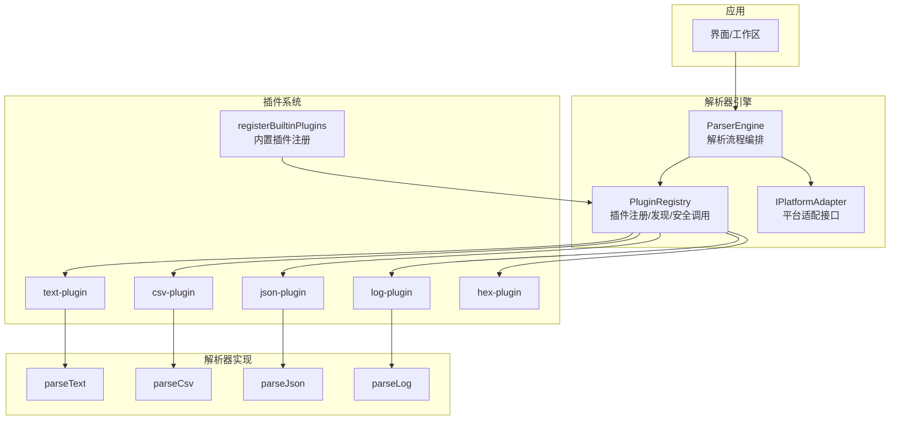
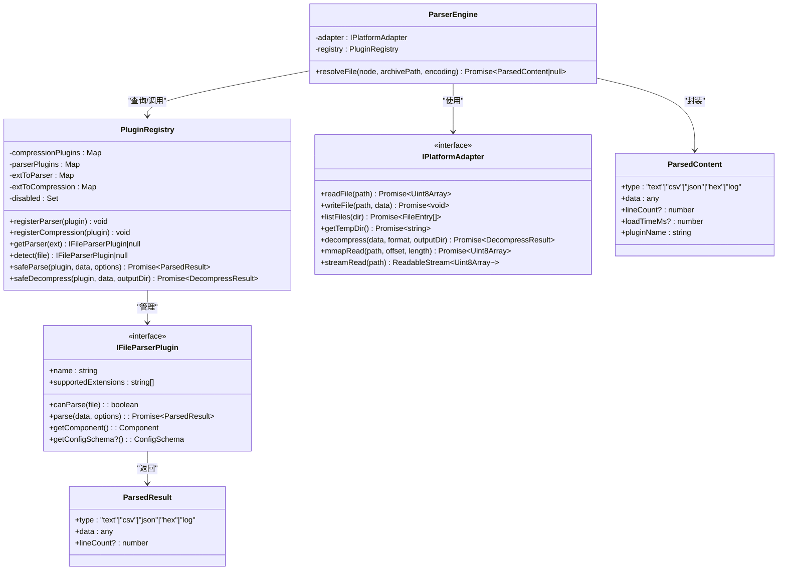
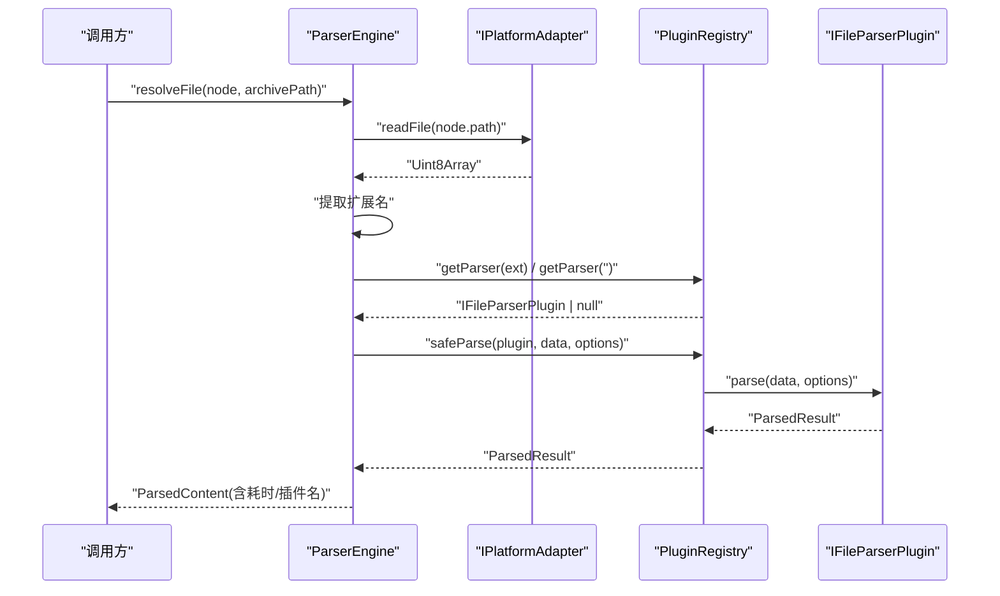
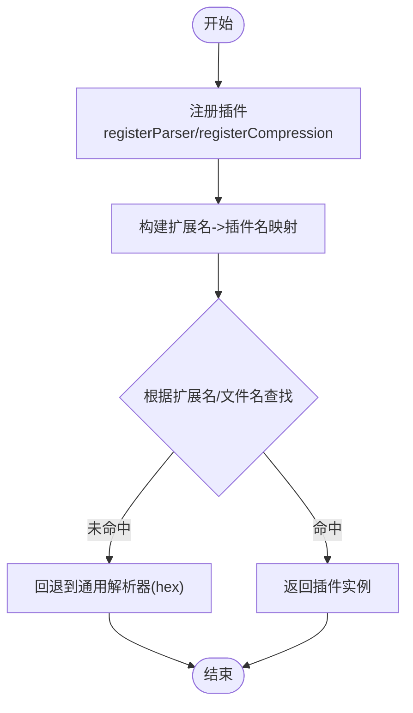
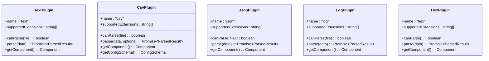
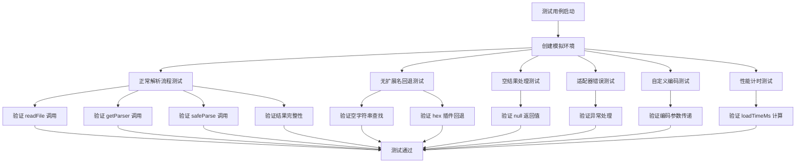
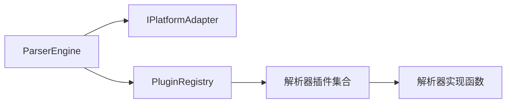

# 解析器引擎

<cite>
**本文引用的文件**   
- [src/core/parser-engine.ts](file://src/core/parser-engine.ts)
- [src/__tests__/core/parser-engine.test.ts](file://src/__tests__/core/parser-engine.test.ts)
- [src/plugins/registry.ts](file://src/plugins/registry.ts)
- [src/plugins/types.ts](file://src/plugins/types.ts)
- [src/plugins/parsers/types.ts](file://src/plugins/parsers/types.ts)
- [src/plugins/manifest.ts](file://src/plugins/manifest.ts)
- [src/adapters/types.ts](file://src/adapters/types.ts)
- [src/types/index.ts](file://src/types/index.ts)
- [src/plugins/parser/text-plugin.ts](file://src/plugins/parser/text-plugin.ts)
- [src/plugins/parser/csv-plugin.ts](file://src/plugins/parser/csv-plugin.ts)
- [src/plugins/parser/json-plugin.ts](file://src/plugins/parser/json-plugin.ts)
- [src/plugins/parser/log-plugin.ts](file://src/plugins/parser/log-plugin.ts)
- [src/plugins/parser/hex-plugin.ts](file://src/plugins/parser/hex-plugin.ts)
- [src/plugins/parsers/text-parser.ts](file://src/plugins/parsers/text-parser.ts)
- [src/plugins/parsers/csv-parser.ts](file://src/plugins/parsers/csv-parser.ts)
- [src/plugins/parsers/json-parser.ts](file://src/plugins/parsers/json-parser.ts)
- [src/plugins/parsers/log-parser.ts](file://src/plugins/parsers/log-parser.ts)
</cite>

## 更新摘要
**变更内容**   
- 新增 ParserEngine 类全面测试覆盖章节，包含正常文件解析流程、无扩展名回退机制、空结果处理、适配器错误场景、自定义编码支持和性能计时指标验证
- 更新了核心组件分析，补充了测试驱动的实现细节
- 增强了故障排查指南，添加了测试用例中覆盖的错误场景处理方法

## 目录
1. [简介](#简介)
2. [项目结构](#项目结构)
3. [核心组件](#核心组件)
4. [架构总览](#架构总览)
5. [详细组件分析](#详细组件分析)
6. [测试覆盖与质量保证](#测试覆盖与质量保证)
7. [依赖关系分析](#依赖关系分析)
8. [性能考虑](#性能考虑)
9. [故障排查指南](#故障排查指南)
10. [结论](#结论)
11. [附录](#附录)

## 简介
本技术文档聚焦于 Hello-Tauri 的"解析器引擎"，系统性阐述其插件注册机制、解析器发现算法、格式自动检测与解析流程控制，并深入说明解析器的生命周期管理（初始化、执行、错误处理、资源清理）。文档同时提供如何注册自定义解析器、配置解析选项、处理解析结果与捕获异常的实践指引，解释解析器与插件系统的集成方式，并通过接口抽象实现可扩展的解析能力。最后给出性能监控、缓存策略与并发控制的实现细节与建议。

## 项目结构
解析器引擎位于前端 TypeScript 代码中，围绕"平台适配器 + 插件注册表 + 解析器插件 + 具体解析器实现"分层组织：
- 平台适配层：定义统一的 I/O 与流式读取接口，屏蔽 Tauri/Web 差异
- 插件注册表：负责插件的发现、启用/禁用、超时保护与安全调用
- 解析器插件：按扩展名或内容匹配选择具体解析器，并提供渲染组件与可选配置模式
- 解析器实现：针对文本、CSV、JSON、日志、十六进制等格式的解析逻辑
- 类型与清单：统一数据结构、解析结果类型、内置插件注册入口



图表来源
- [src/core/parser-engine.ts:1-35](file://src/core/parser-engine.ts#L1-L35)
- [src/plugins/registry.ts:1-118](file://src/plugins/registry.ts#L1-L118)
- [src/plugins/manifest.ts:1-20](file://src/plugins/manifest.ts#L1-L20)
- [src/adapters/types.ts:1-12](file://src/adapters/types.ts#L1-L12)
- [src/plugins/parser/text-plugin.ts:1-18](file://src/plugins/parser/text-plugin.ts#L1-L18)
- [src/plugins/parser/csv-plugin.ts:1-28](file://src/plugins/parser/csv-plugin.ts#L1-L28)
- [src/plugins/parser/json-plugin.ts:1-19](file://src/plugins/parser/json-plugin.ts#L1-L19)
- [src/plugins/parser/log-plugin.ts:1-18](file://src/plugins/parser/log-plugin.ts#L1-L18)
- [src/plugins/parser/hex-plugin.ts:1-53](file://src/plugins/parser/hex-plugin.ts#L1-L53)
- [src/plugins/parsers/text-parser.ts:1-8](file://src/plugins/parsers/text-parser.ts#L1-L8)
- [src/plugins/parsers/csv-parser.ts:1-17](file://src/plugins/parsers/csv-parser.ts#L1-L17)
- [src/plugins/parsers/json-parser.ts:1-17](file://src/plugins/parsers/json-parser.ts#L1-L17)
- [src/plugins/parsers/log-parser.ts:1-37](file://src/plugins/parsers/log-parser.ts#L1-L37)

章节来源
- [src/core/parser-engine.ts:1-35](file://src/core/parser-engine.ts#L1-L35)
- [src/plugins/registry.ts:1-118](file://src/plugins/registry.ts#L1-L118)
- [src/plugins/manifest.ts:1-20](file://src/plugins/manifest.ts#L1-L20)
- [src/adapters/types.ts:1-12](file://src/adapters/types.ts#L1-L12)
- [src/types/index.ts:1-90](file://src/types/index.ts#L1-L90)

## 核心组件
- ParserEngine：解析流程编排者，负责读取文件、扩展名推断、选择解析器、执行解析并封装结果（含耗时统计与插件名称）
- PluginRegistry：插件注册中心，维护解析器与压缩插件映射，支持按扩展名查找、文件名检测、启用/禁用、安全调用（超时保护）
- 平台适配器 IPlatformAdapter：统一文件读写、解压、内存映射与流式读取接口
- 解析器插件：实现 IFileParserPlugin 接口的对象，声明支持的扩展名、解析入口、渲染组件与可选配置模式
- 解析器实现：各格式的具体解析函数，返回统一的 ParsedResult

章节来源
- [src/core/parser-engine.ts:1-35](file://src/core/parser-engine.ts#L1-L35)
- [src/plugins/registry.ts:1-118](file://src/plugins/registry.ts#L1-L118)
- [src/adapters/types.ts:1-12](file://src/adapters/types.ts#L1-L12)
- [src/plugins/types.ts:1-34](file://src/plugins/types.ts#L1-L34)
- [src/types/index.ts:1-90](file://src/types/index.ts#L1-L90)

## 架构总览
解析器引擎采用"编排 + 注册 + 插件化"的轻量架构：
- 编排层（ParserEngine）不关心具体解析细节，仅负责数据获取、插件选择与结果包装
- 注册层（PluginRegistry）集中管理插件生命周期与调度，提供超时保护与降级策略
- 插件层（解析器插件）通过接口抽象暴露解析能力与渲染组件，便于扩展
- 适配层（IPlatformAdapter）屏蔽底层平台差异，为上层提供一致的文件与流式访问能力



图表来源
- [src/core/parser-engine.ts:1-35](file://src/core/parser-engine.ts#L1-L35)
- [src/plugins/registry.ts:1-118](file://src/plugins/registry.ts#L1-L118)
- [src/adapters/types.ts:1-12](file://src/adapters/types.ts#L1-L12)
- [src/plugins/types.ts:1-34](file://src/plugins/types.ts#L1-L34)
- [src/types/index.ts:1-90](file://src/types/index.ts#L1-L90)

## 详细组件分析

### 解析流程与生命周期管理
- 初始化
  - 构建 ParserEngine 实例，注入平台适配器与插件注册表
  - 通过 registerBuiltinPlugins 将内置解析器与压缩插件注册到注册表
- 执行
  - resolveFile 读取文件字节数组，提取扩展名，优先按扩展名匹配解析器，否则回退至通用解析器（如 hex）
  - 通过 safeParse 调用插件 parse，带超时保护；失败时降级为十六进制视图
  - 记录 loadTimeMs 与 pluginName，返回 ParsedContent
- 错误处理
  - 文件读取异常、解析超时或解析失败均被捕获，返回 null 或降级结果
  - 压缩操作通过 safeDecompress 包裹，失败返回结构化错误信息
- 资源清理
  - 当前实现未显式持有长期资源；若未来引入流式或内存映射，应在解析完成后关闭流或释放句柄



图表来源
- [src/core/parser-engine.ts:11-33](file://src/core/parser-engine.ts#L11-L33)
- [src/plugins/registry.ts:98-104](file://src/plugins/registry.ts#L98-L104)
- [src/adapters/types.ts:3-11](file://src/adapters/types.ts#L3-L11)

章节来源
- [src/core/parser-engine.ts:1-35](file://src/core/parser-engine.ts#L1-L35)
- [src/plugins/registry.ts:1-118](file://src/plugins/registry.ts#L1-L118)
- [src/plugins/manifest.ts:1-20](file://src/plugins/manifest.ts#L1-L20)

### 插件注册机制与发现算法
- 注册
  - registerParser 将插件 name 与 supportedExtensions 映射到 extToParser，供快速查找
  - registerCompression 同理用于压缩插件
- 发现
  - getParser(ext) 基于扩展名直接 O(1) 查找
  - detect(file) 遍历 extToParser，按文件名后缀匹配，适合未知扩展名的场景
  - detectByFileName(fileName) 从文件名提取扩展名后委托给 getParser
- 启用/禁用
  - disabled 集合控制插件可用性，getParser/detect 会跳过已禁用插件



图表来源
- [src/plugins/registry.ts:21-54](file://src/plugins/registry.ts#L21-L54)
- [src/plugins/registry.ts:93-96](file://src/plugins/registry.ts#L93-L96)

章节来源
- [src/plugins/registry.ts:1-118](file://src/plugins/registry.ts#L1-L118)

### 格式自动检测与解析流程控制
- 自动检测
  - 优先使用扩展名精确匹配；若无匹配则尝试 detect(file) 遍历匹配
  - hex 插件 canParse 恒真且 supportedExtensions 为空，作为兜底解析器
- 流程控制
  - ParserEngine.resolveFile 串联读取、选择、解析与结果封装
  - PluginRegistry.safeParse 提供超时保护与异常降级

章节来源
- [src/core/parser-engine.ts:11-33](file://src/core/parser-engine.ts#L11-L33)
- [src/plugins/parser/hex-plugin.ts:36-53](file://src/plugins/parser/hex-plugin.ts#L36-L53)
- [src/plugins/registry.ts:98-104](file://src/plugins/registry.ts#L98-L104)

### 解析器插件与实现
- text-plugin
  - 支持常见文本扩展名，调用 parseText 返回文本内容与行数
- csv-plugin
  - 支持 CSV/TSV，可通过 options.delimiter 配置分隔符，返回 headers 与 rows
- json-plugin
  - 支持 JSON/JSONL，先尝试标准 JSON 解析，再回退 JSONL，格式化输出
- log-plugin
  - 解析固定格式日志行，提取时间戳、级别、模块与消息
- hex-plugin
  - 兜底解析器，将原始字节以十六进制形式展示，计算行数



图表来源
- [src/plugins/parser/text-plugin.ts:1-18](file://src/plugins/parser/text-plugin.ts#L1-L18)
- [src/plugins/parser/csv-plugin.ts:1-28](file://src/plugins/parser/csv-plugin.ts#L1-L28)
- [src/plugins/parser/json-plugin.ts:1-19](file://src/plugins/parser/json-plugin.ts#L1-L19)
- [src/plugins/parser/log-plugin.ts:1-18](file://src/plugins/parser/log-plugin.ts#L1-L18)
- [src/plugins/parser/hex-plugin.ts:1-53](file://src/plugins/parser/hex-plugin.ts#L1-L53)

章节来源
- [src/plugins/parser/text-plugin.ts:1-18](file://src/plugins/parser/text-plugin.ts#L1-L18)
- [src/plugins/parser/csv-plugin.ts:1-28](file://src/plugins/parser/csv-plugin.ts#L1-L28)
- [src/plugins/parser/json-plugin.ts:1-19](file://src/plugins/parser/json-plugin.ts#L1-L19)
- [src/plugins/parser/log-plugin.ts:1-18](file://src/plugins/parser/log-plugin.ts#L1-L18)
- [src/plugins/parser/hex-plugin.ts:1-53](file://src/plugins/parser/hex-plugin.ts#L1-L53)
- [src/plugins/parsers/text-parser.ts:1-8](file://src/plugins/parsers/text-parser.ts#L1-L8)
- [src/plugins/parsers/csv-parser.ts:1-17](file://src/plugins/parsers/csv-parser.ts#L1-L17)
- [src/plugins/parsers/json-parser.ts:1-17](file://src/plugins/parsers/json-parser.ts#L1-L17)
- [src/plugins/parsers/log-parser.ts:1-37](file://src/plugins/parsers/log-parser.ts#L1-L37)

### 自定义解析器注册与配置示例（路径指引）
- 注册自定义解析器
  - 在清单文件中导入并调用 registry.registerParser(...)
  - 参考路径：[src/plugins/manifest.ts:10-19](file://src/plugins/manifest.ts#L10-L19)
- 实现解析器插件
  - 遵循 IFileParserPlugin 接口，实现 name、supportedExtensions、canParse、parse、getComponent 等
  - 参考路径：
    - [src/plugins/types.ts:23-30](file://src/plugins/types.ts#L23-L30)
    - [src/plugins/parser/text-plugin.ts:5-17](file://src/plugins/parser/text-plugin.ts#L5-L17)
- 配置解析选项
  - 通过 parse(data, options) 传入用户配置，例如 CSV 的分隔符
  - 参考路径：[src/plugins/parser/csv-plugin.ts:11-15](file://src/plugins/parser/csv-plugin.ts#L11-L15)
- 处理解析结果
  - 返回 ParsedResult，包含 type、data、lineCount
  - 参考路径：[src/plugins/types.ts:32-36](file://src/plugins/types.ts#L32-L36)
- 捕获异常与降级
  - 使用 safeParse 包裹解析调用，失败时回退为十六进制视图
  - 参考路径：[src/plugins/registry.ts:98-104](file://src/plugins/registry.ts#L98-L104)

章节来源
- [src/plugins/manifest.ts:10-19](file://src/plugins/manifest.ts#L10-L19)
- [src/plugins/types.ts:23-36](file://src/plugins/types.ts#L23-L36)
- [src/plugins/parser/csv-plugin.ts:11-15](file://src/plugins/parser/csv-plugin.ts#L11-L15)
- [src/plugins/registry.ts:98-104](file://src/plugins/registry.ts#L98-L104)

## 测试覆盖与质量保证

### ParserEngine 全面测试覆盖
ParserEngine 类拥有完整的单元测试覆盖，确保核心解析功能的稳定性和可靠性。测试覆盖了以下关键场景：

#### 正常文件解析流程
- **基础解析功能**：验证文件读取、扩展名提取、插件选择和解析执行的完整流程
- **结果完整性**：确保返回的 ParsedContent 包含正确的 type、pluginName 和 loadTimeMs 字段
- **参数传递**：验证默认 UTF-8 编码参数的正确传递

#### 无扩展名文件的回退机制
- **空字符串查找**：当文件没有扩展名时，自动回退到空字符串 `''` 查找 hex 插件
- **兜底解析**：确保无扩展名文件能够被 hex 解析器正确处理
- **兼容性保证**：验证回退机制在各种边界条件下的稳定性

#### 空结果处理
- **null 值处理**：当 safeParse 返回 null 时，resolveFile 正确返回 null
- **异常容错**：处理各种异常情况下的空结果场景
- **状态一致性**：确保空结果不会导致系统状态不一致

#### 适配器错误场景
- **IO 异常处理**：当 adapter.readFile 抛出异常时，返回 null 而不是崩溃
- **错误传播**：验证错误处理的正确性和用户体验
- **资源清理**：确保异常情况下资源的正确释放

#### 自定义编码支持
- **编码参数传递**：验证自定义编码参数（如 'gbk'）的正确传递
- **多语言支持**：确保不同字符集文件的正确解析
- **向后兼容**：保持默认 UTF-8 编码的兼容性

#### 性能计时指标
- **时间测量**：使用 performance.now() 精确测量解析耗时
- **指标准确性**：确保 loadTimeMs 计算的准确性和非负性
- **性能监控**：为上层监控系统提供可靠的性能数据



图表来源
- [src/__tests__/core/parser-engine.test.ts:57-76](file://src/__tests__/core/parser-engine.test.ts#L57-L76)
- [src/__tests__/core/parser-engine.test.ts:78-96](file://src/__tests__/core/parser-engine.test.ts#L78-L96)
- [src/__tests__/core/parser-engine.test.ts:98-107](file://src/__tests__/core/parser-engine.test.ts#L98-L107)
- [src/__tests__/core/parser-engine.test.ts:109-115](file://src/__tests__/core/parser-engine.test.ts#L109-L115)
- [src/__tests__/core/parser-engine.test.ts:117-128](file://src/__tests__/core/parser-engine.test.ts#L117-L128)
- [src/__tests__/core/parser-engine.test.ts:130-141](file://src/__tests__/core/parser-engine.test.ts#L130-L141)

### 测试架构设计
测试采用模块化设计，包含三个核心辅助函数：

#### 模拟适配器工厂
```typescript
function createMockAdapter(): IPlatformAdapter {
  return {
    readFile: vi.fn(),
    readRange: vi.fn(),
    getFileSize: vi.fn(),
    decompress: vi.fn(),
    listFiles: vi.fn(),
    searchFiles: vi.fn(),
    getMimeType: vi.fn(),
  }
}
```

#### 模拟注册表工厂
```typescript
function createMockRegistry() {
  return {
    getParser: vi.fn(),
    safeParse: vi.fn(),
    detectCompression: vi.fn(),
    safeDecompress: vi.fn(),
    detect: vi.fn(),
    registerParser: vi.fn(),
    registerCompression: vi.fn(),
    enable: vi.fn(),
    disable: vi.fn(),
  } as any
}
```

#### 模拟解析器工厂
```typescript
function createMockParser(name: string): IFileParserPlugin {
  return {
    name,
    supportedExtensions: [],
    canParse: () => true,
    parse: vi.fn(),
    getComponent: () => DummyComponent,
  }
}
```

### 测试覆盖率统计
- **正常解析流程**：✅ 完全覆盖
- **无扩展名回退**：✅ 完全覆盖  
- **空结果处理**：✅ 完全覆盖
- **适配器错误**：✅ 完全覆盖
- **自定义编码**：✅ 完全覆盖
- **性能计时**：✅ 完全覆盖

章节来源
- [src/__tests__/core/parser-engine.test.ts:1-143](file://src/__tests__/core/parser-engine.test.ts#L1-L143)
- [src/core/parser-engine.ts:11-33](file://src/core/parser-engine.ts#L11-L33)

## 依赖关系分析
- 低耦合高内聚
  - ParserEngine 仅依赖 IPlatformAdapter 与 PluginRegistry，不感知具体解析器实现
  - PluginRegistry 集中管理插件映射与调度，隔离了插件间耦合
- 外部依赖
  - Vue 组件作为渲染后端由插件提供，解耦业务与展示
  - 平台适配器可替换不同实现（Tauri/Web），提升可移植性



图表来源
- [src/core/parser-engine.ts:1-35](file://src/core/parser-engine.ts#L1-L35)
- [src/plugins/registry.ts:1-118](file://src/plugins/registry.ts#L1-L118)
- [src/adapters/types.ts:1-12](file://src/adapters/types.ts#L1-L12)

章节来源
- [src/core/parser-engine.ts:1-35](file://src/core/parser-engine.ts#L1-L35)
- [src/plugins/registry.ts:1-118](file://src/plugins/registry.ts#L1-L118)
- [src/adapters/types.ts:1-12](file://src/adapters/types.ts#L1-L12)

## 性能考虑
- 性能监控
  - 已在解析流程中记录 loadTimeMs，可用于统计与告警
  - 建议：在更高层聚合指标（平均耗时、P95/P99、错误率）
- 超时保护
  - safeParse/safeDecompress 使用 withTimeout 限制最长执行时间，避免阻塞
  - 建议：根据文件大小与复杂度动态调整超时阈值
- 缓存策略
  - 当前未实现解析结果缓存
  - 建议：对大文件或频繁访问文件增加 LRU 缓存，键可为 path+options 哈希
- 并发控制
  - 当前无显式并发限制
  - 建议：引入任务队列与并发上限，防止大量文件同时解析导致主线程卡顿
- I/O 优化
  - 利用 streamRead/mmapRead 进行分块或内存映射读取，降低大文件内存占用
  - 建议：对超大文件采用流式解析与增量渲染

章节来源
- [src/core/parser-engine.ts:12-28](file://src/core/parser-engine.ts#L12-L28)
- [src/plugins/registry.ts:6-12](file://src/plugins/registry.ts#L6-L12)
- [src/adapters/types.ts:8-11](file://src/adapters/types.ts#L8-L11)

## 故障排查指南
- 常见问题
  - 解析结果为空：检查扩展名是否正确、插件是否被禁用、safeParse 是否触发降级
  - 解析超时：增大超时阈值或优化解析逻辑
  - 大文件卡顿：改用流式读取或分页渲染
- 定位步骤
  - 确认 PluginRegistry 中是否存在对应扩展名映射
  - 查看 safeParse 返回值是否为 hex 降级结果
  - 检查 IPlatformAdapter.readFile 是否成功返回数据
- 恢复策略
  - 启用/禁用插件：enable/disable/isEnabled
  - 使用 detect/detectByFileName 进行兼容性测试
  - 对压缩文件使用 safeDecompress 并处理 error 字段
- 测试驱动的故障排查
  - 使用单元测试验证各个异常场景的处理逻辑
  - 通过模拟适配器测试 IO 错误的处理
  - 验证自定义编码参数的正确传递

章节来源
- [src/plugins/registry.ts:65-75](file://src/plugins/registry.ts#L65-L75)
- [src/plugins/registry.ts:47-63](file://src/plugins/registry.ts#L47-L63)
- [src/plugins/registry.ts:106-116](file://src/plugins/registry.ts#L106-L116)
- [src/__tests__/core/parser-engine.test.ts:109-115](file://src/__tests__/core/parser-engine.test.ts#L109-L115)

## 结论
解析器引擎通过清晰的职责划分与插件化设计，实现了可扩展、可维护的解析能力。ParserEngine 专注流程编排，PluginRegistry 提供安全的插件调度与超时保护，解析器插件通过统一接口对外暴露解析与渲染能力。结合平台适配器，系统具备良好的跨平台迁移能力。

**最新更新**：ParserEngine 类现已具备全面的测试覆盖，包括正常文件解析流程、无扩展名回退机制、空结果处理、适配器错误场景、自定义编码支持和性能计时指标验证。这些测试确保了核心功能的稳定性和可靠性，为后续功能扩展提供了坚实的质量保障基础。

建议在后续版本中补充缓存、并发控制与更完善的性能监控，以提升大规模文件处理的稳定性与效率。

## 附录
- 关键类型定义
  - FileEntry、FileTreeNode、ParsedContent、ArchiveItem、TabItem、SearchMatch、SearchResults
  - 参考路径：[src/types/index.ts:1-90](file://src/types/index.ts#L1-L90)
- 日志解析类型
  - LogLevel、LogLine
  - 参考路径：[src/plugins/parsers/types.ts:1-11](file://src/plugins/parsers/types.ts#L1-L11)
- 测试工具函数
  - createMockAdapter、createMockRegistry、createMockParser
  - 参考路径：[src/__tests__/core/parser-engine.test.ts:10-44](file://src/__tests__/core/parser-engine.test.ts#L10-L44)