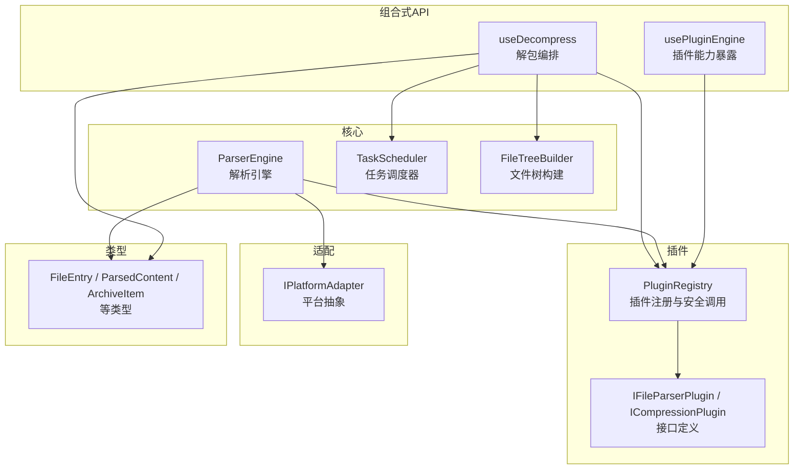
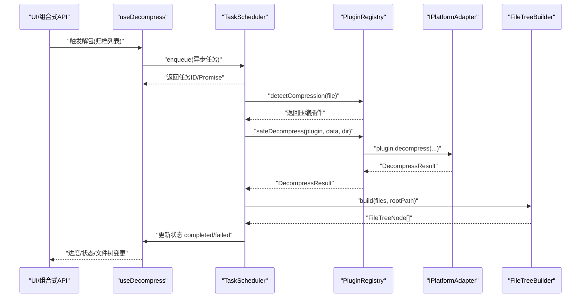
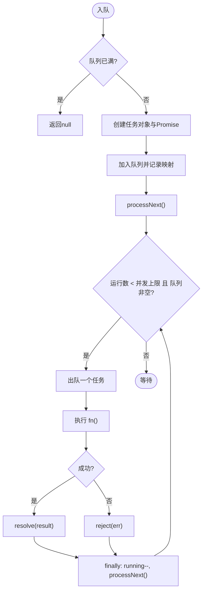
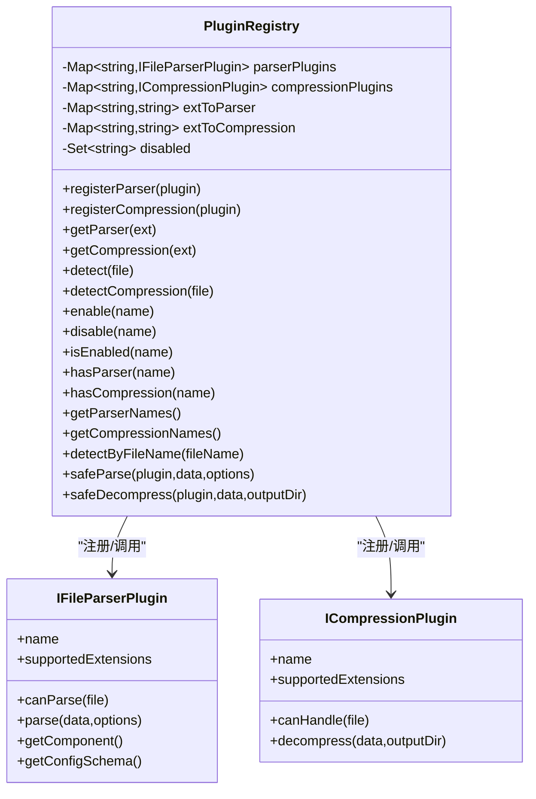
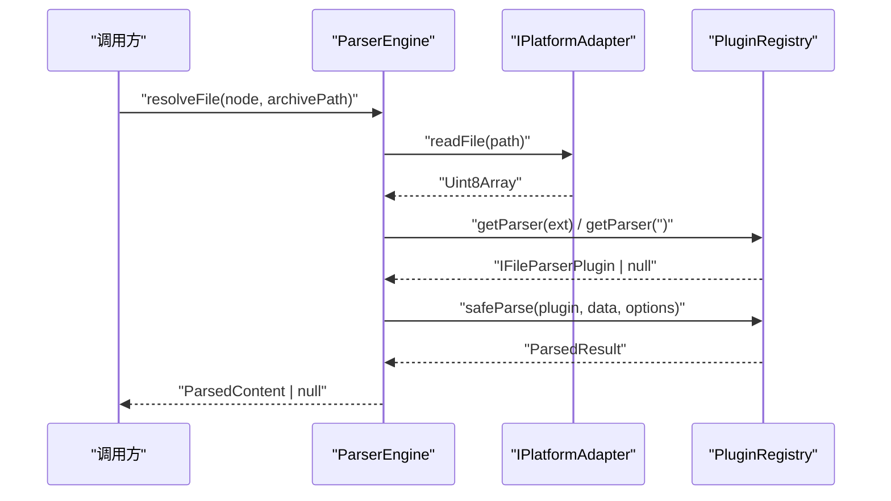
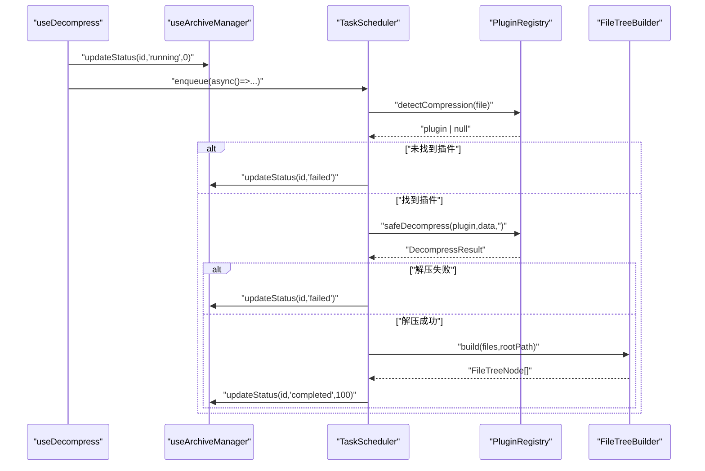
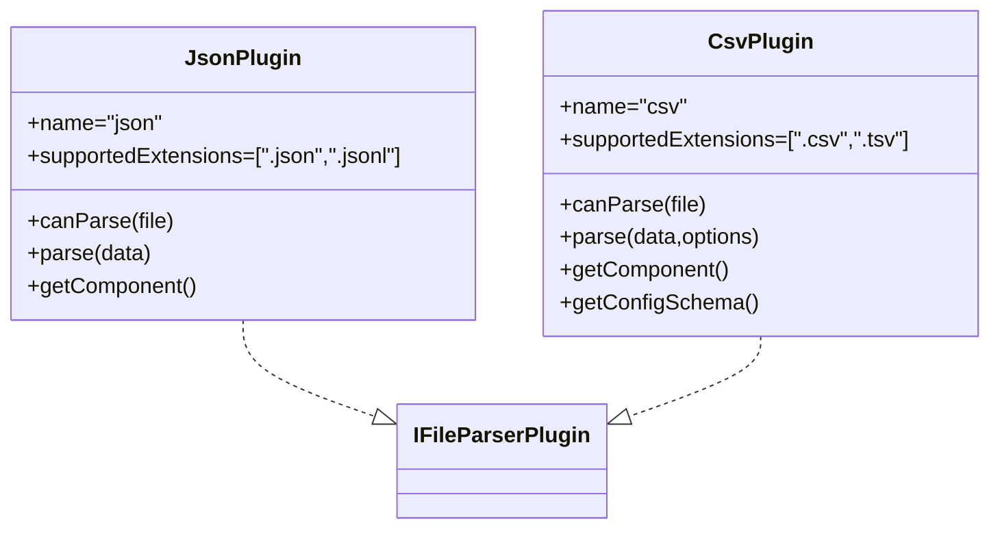
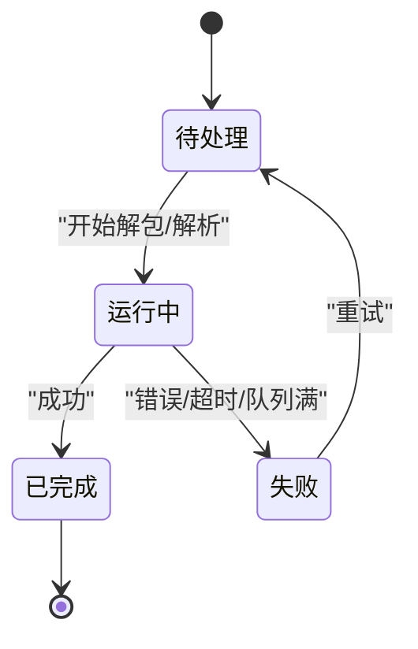
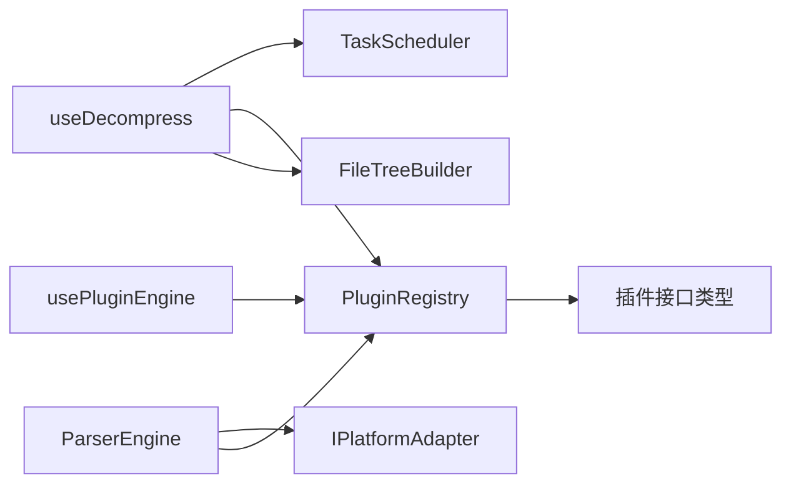

# 解析流程控制

<cite>
**本文引用的文件**   
- [src/core/parser-engine.ts](file://src/core/parser-engine.ts)
- [src/core/task-scheduler.ts](file://src/core/task-scheduler.ts)
- [src/plugins/registry.ts](file://src/plugins/registry.ts)
- [src/plugins/types.ts](file://src/plugins/types.ts)
- [src/adapters/types.ts](file://src/adapters/types.ts)
- [src/types/index.ts](file://src/types/index.ts)
- [src/composables/use-decompress.ts](file://src/composables/use-decompress.ts)
- [src/composables/use-plugins.ts](file://src/composables/use-plugins.ts)
- [src/core/file-tree.ts](file://src/core/file-tree.ts)
- [src/plugins/parser/json-plugin.ts](file://src/plugins/parser/json-plugin.ts)
- [src/plugins/parser/csv-plugin.ts](file://src/plugins/parser/csv-plugin.ts)
- [src/plugins/parsers/json-parser.ts](file://src/plugins/parsers/json-parser.ts)
- [src/plugins/parsers/csv-parser.ts](file://src/plugins/parsers/csv-parser.ts)
- [src/__tests__\core\task-scheduler.test.ts](file://src/__tests__/core/task-scheduler.test.ts)
</cite>

## 目录
1. [简介](#简介)
2. [项目结构](#项目结构)
3. [核心组件](#核心组件)
4. [架构总览](#架构总览)
5. [详细组件分析](#详细组件分析)
6. [依赖关系分析](#依赖关系分析)
7. [性能考量](#性能考量)
8. [故障排查指南](#故障排查指南)
9. [结论](#结论)
10. [附录](#附录)

## 简介
本技术文档聚焦于 Hello-Tauri 的“解析流程控制”，围绕解析任务的生命周期管理展开，涵盖任务调度、并发控制、错误处理与状态同步；并深入解释解析流程的状态机设计、中断恢复机制与资源清理策略。同时提供配置解析选项、监控进度、处理超时异常、实现批量解析的实践路径，以及并行执行模型、负载均衡与故障转移的实现细节。最后给出性能监控、内存优化与用户体验反馈的可操作建议。

## 项目结构
本项目采用分层与插件化组织：
- 核心层：解析引擎、任务调度器、文件树构建
- 插件层：解析器与压缩器的注册、发现与安全调用
- 适配层：平台抽象（读写、流式读取、解压等）
- 组合式 API：面向 UI 的解包与插件能力暴露
- 类型定义：统一的数据结构与结果契约

图表来源
- [src/core/parser-engine.ts:1-35](file://src/core/parser-engine.ts#L1-L35)
- [src/core/task-scheduler.ts:1-79](file://src/core/task-scheduler.ts#L1-L79)
- [src/plugins/registry.ts:1-118](file://src/plugins/registry.ts#L1-L118)
- [src/adapters/types.ts:1-12](file://src/adapters/types.ts#L1-L12)
- [src/composables/use-decompress.ts:1-74](file://src/composables/use-decompress.ts#L1-L74)
- [src/composables/use-plugins.ts:1-17](file://src/composables/use-plugins.ts#L1-L17)
- [src/core/file-tree.ts:1-69](file://src/core/file-tree.ts#L1-L69)
- [src/types/index.ts:1-71](file://src/types/index.ts#L1-L71)

章节来源
- [src/core/parser-engine.ts:1-35](file://src/core/parser-engine.ts#L1-L35)
- [src/core/task-scheduler.ts:1-79](file://src/core/task-scheduler.ts#L1-L79)
- [src/plugins/registry.ts:1-118](file://src/plugins/registry.ts#L1-L118)
- [src/adapters/types.ts:1-12](file://src/adapters/types.ts#L1-L12)
- [src/composables/use-decompress.ts:1-74](file://src/composables/use-decompress.ts#L1-L74)
- [src/composables/use-plugins.ts:1-17](file://src/composables/use-plugins.ts#L1-L17)
- [src/core/file-tree.ts:1-69](file://src/core/file-tree.ts#L1-L69)
- [src/types/index.ts:1-71](file://src/types/index.ts#L1-L71)

## 核心组件
- 解析引擎 ParserEngine：负责根据文件扩展名选择解析器，读取数据并返回标准化解析结果，附带耗时统计与插件名称。
- 任务调度器 TaskScheduler：基于队列与并发上限的任务执行器，支持重试、计数查询与 Promise 追踪。
- 插件注册表 PluginRegistry：维护解析器与压缩器插件，提供按扩展名检测、安全调用（含超时保护）、启用/禁用能力。
- 平台适配器 IPlatformAdapter：抽象文件读写、流式读取、临时目录与解压等跨平台能力。
- 组合式 useDecompress：编排归档文件的解包流程，驱动任务调度、状态更新与文件树构建。
- 文件树构建 FileTreeBuilder：将扁平文件列表构造成层级树结构，便于前端展示与导航。

章节来源
- [src/core/parser-engine.ts:1-35](file://src/core/parser-engine.ts#L1-L35)
- [src/core/task-scheduler.ts:1-79](file://src/core/task-scheduler.ts#L1-L79)
- [src/plugins/registry.ts:1-118](file://src/plugins/registry.ts#L1-L118)
- [src/adapters/types.ts:1-12](file://src/adapters/types.ts#L1-L12)
- [src/composables/use-decompress.ts:1-74](file://src/composables/use-decompress.ts#L1-L74)
- [src/core/file-tree.ts:1-69](file://src/core/file-tree.ts#L1-L69)

## 架构总览
下图展示了从“添加归档”到“解析完成”的关键交互链路，包括任务调度、插件安全调用、状态同步与结果组装。

图表来源
- [src/composables/use-decompress.ts:1-74](file://src/composables/use-decompress.ts#L1-L74)
- [src/core/task-scheduler.ts:1-79](file://src/core/task-scheduler.ts#L1-L79)
- [src/plugins/registry.ts:1-118](file://src/plugins/registry.ts#L1-L118)
- [src/adapters/types.ts:1-12](file://src/adapters/types.ts#L1-L12)
- [src/core/file-tree.ts:1-69](file://src/core/file-tree.ts#L1-L69)

## 详细组件分析

### 任务调度器 TaskScheduler
- 并发控制：通过 maxConcurrency 限制同时运行的任务数，内部使用 running 计数器与 while 循环在空闲时拉取下一个任务。
- 队列管理：maxQueueSize 限制排队长度，超出则 enqueue 返回 null，避免无限堆积。
- 生命周期：每个任务包含 id、fn、promise、resolve/reject；完成后清理 promises 与 taskFns 映射，防止泄漏。
- 重试机制：retry(id) 可复用原始函数重新入队，适合失败重试场景。
- 可观测性：pendingCount/runningCount 暴露队列与运行中任务数量，便于监控。

图表来源
- [src/core/task-scheduler.ts:1-79](file://src/core/task-scheduler.ts#L1-L79)

章节来源
- [src/core/task-scheduler.ts:1-79](file://src/core/task-scheduler.ts#L1-L79)
- [src/__tests__/core/task-scheduler.test.ts:1-57](file://src/__tests__/core/task-scheduler.test.ts#L1-L57)

### 插件注册表 PluginRegistry
- 插件注册：分别维护解析器与压缩器 Map，并建立扩展名到插件名的索引，支持快速查找。
- 检测与过滤：getParser/getCompression/detect/detectCompression 均考虑 disabled 集合，支持运行时启用/禁用。
- 安全调用：safeParse/safeDecompress 内置 withTimeout 超时保护，失败时回退为 hex 或错误结果，保证整体稳定性。
- 超时策略：默认 30 秒超时，避免阻塞主线程与任务队列。

图表来源
- [src/plugins/registry.ts:1-118](file://src/plugins/registry.ts#L1-L118)
- [src/plugins/types.ts:1-37](file://src/plugins/types.ts#L1-37)

章节来源
- [src/plugins/registry.ts:1-118](file://src/plugins/registry.ts#L1-L118)
- [src/plugins/types.ts:1-37](file://src/plugins/types.ts#L1-37)

### 解析引擎 ParserEngine
- 文件解析流程：读取字节 -> 提取扩展名 -> 选择解析器 -> 安全解析 -> 封装结果（类型、数据、行数、耗时、插件名）。
- 错误处理：捕获异常后返回 null，上层可据此降级或提示用户。
- 性能指标：loadTimeMs 用于前端渲染与性能监控。

图表来源
- [src/core/parser-engine.ts:1-35](file://src/core/parser-engine.ts#L1-L35)
- [src/adapters/types.ts:1-12](file://src/adapters/types.ts#L1-L12)
- [src/plugins/registry.ts:1-118](file://src/plugins/registry.ts#L1-L118)

章节来源
- [src/core/parser-engine.ts:1-35](file://src/core/parser-engine.ts#L1-L35)
- [src/adapters/types.ts:1-12](file://src/adapters/types.ts#L1-L12)
- [src/plugins/registry.ts:1-118](file://src/plugins/registry.ts#L1-L118)

### 解包编排 useDecompress
- 任务编排：遍历 pending 状态的归档，逐个入队；任务内读取 ArrayBuffer、检测压缩插件、安全解压、构建文件树、更新状态。
- 状态同步：通过 updateStatus 将进度与最终状态写入 archives，供 UI 消费。
- 错误处理：无插件、解压失败、异常均标记 failed 并记录 error。
- 队列满处理：当 enqueue 返回 null 时直接标记失败，避免悬挂。

图表来源
- [src/composables/use-decompress.ts:1-74](file://src/composables/use-decompress.ts#L1-L74)
- [src/plugins/registry.ts:1-118](file://src/plugins/registry.ts#L1-L118)
- [src/core/file-tree.ts:1-69](file://src/core/file-tree.ts#L1-L69)

章节来源
- [src/composables/use-decompress.ts:1-74](file://src/composables/use-decompress.ts#L1-L74)
- [src/core/file-tree.ts:1-69](file://src/core/file-tree.ts#L1-L69)

### 解析器插件示例（JSON/CSV）
- JSON 插件：支持 .json/.jsonl，解析文本并返回结构化数据与行数；提供渲染组件。
- CSV 插件：支持 .csv/.tsv，支持分隔符配置项，返回 headers/rows 与行数；提供配置 Schema 以动态生成表单。

图表来源
- [src/plugins/parser/json-plugin.ts:1-19](file://src/plugins/parser/json-plugin.ts#L1-L19)
- [src/plugins/parser/csv-plugin.ts:1-28](file://src/plugins/parser/csv-plugin.ts#L1-L28)
- [src/plugins/types.ts:1-37](file://src/plugins/types.ts#L1-37)

章节来源
- [src/plugins/parser/json-plugin.ts:1-19](file://src/plugins/parser/json-plugin.ts#L1-L19)
- [src/plugins/parser/csv-plugin.ts:1-28](file://src/plugins/parser/csv-plugin.ts#L1-L28)
- [src/plugins/parsers/json-parser.ts:1-17](file://src/plugins/parsers/json-parser.ts#L1-L17)
- [src/plugins/parsers/csv-parser.ts:1-17](file://src/plugins/parsers/csv-parser.ts#L1-17)
- [src/plugins/types.ts:1-37](file://src/plugins/types.ts#L1-37)

### 状态机设计与中断恢复
- 归档状态机：pending -> running -> completed/failed；running 阶段记录 startTime，completed 记录 endTime，便于计算耗时与进度。
- 中断恢复：
  - 任务级：TaskScheduler 支持 retry(id)，结合外部持久化（如 IndexedDB）保存任务 ID 与进度，重启后可恢复。
  - 插件级：safeParse/safeDecompress 的超时保护确保长时间阻塞被中断，避免死锁。
- 资源清理：
  - 任务完成后清理 promises 与 taskFns 映射，避免内存泄漏。
  - 文件树构建前清空 nodeMap/placed，避免重复挂载导致的内存增长。

[此图为概念性状态机示意，不直接映射具体源码文件]

### 并行执行模型、负载均衡与故障转移
- 并行模型：TaskScheduler 基于单线程事件循环，通过并发上限控制同时执行的异步任务数，避免 UI 卡顿。
- 负载均衡：当前实现为 FIFO 队列，可按需引入优先级或权重策略（例如大文件优先、小文件先走）。
- 故障转移：
  - 插件级：safeParse 失败回退为 hex 显示，保障可用性。
  - 任务级：retry 支持失败重试；可在外层增加指数退避与最大重试次数。

章节来源
- [src/core/task-scheduler.ts:1-79](file://src/core/task-scheduler.ts#L1-L79)
- [src/plugins/registry.ts:1-118](file://src/plugins/registry.ts#L1-L118)

## 依赖关系分析
- 低耦合：解析引擎仅依赖平台适配器与插件注册表；解包编排通过组合式 API 聚合各模块。
- 明确边界：类型集中在 types/index.ts 与 plugins/types.ts，减少跨模块耦合。
- 潜在环依赖：当前未见循环导入；若新增模块需注意保持单向依赖。

图表来源
- [src/composables/use-decompress.ts:1-74](file://src/composables/use-decompress.ts#L1-L74)
- [src/core/parser-engine.ts:1-35](file://src/core/parser-engine.ts#L1-L35)
- [src/plugins/registry.ts:1-118](file://src/plugins/registry.ts#L1-L118)
- [src/adapters/types.ts:1-12](file://src/adapters/types.ts#L1-L12)
- [src/plugins/types.ts:1-37](file://src/plugins/types.ts#L1-37)
- [src/composables/use-plugins.ts:1-17](file://src/composables/use-plugins.ts#L1-17)

章节来源
- [src/composables/use-decompress.ts:1-74](file://src/composables/use-decompress.ts#L1-L74)
- [src/core/parser-engine.ts:1-35](file://src/core/parser-engine.ts#L1-L35)
- [src/plugins/registry.ts:1-118](file://src/plugins/registry.ts#L1-L118)
- [src/adapters/types.ts:1-12](file://src/adapters/types.ts#L1-L12)
- [src/plugins/types.ts:1-37](file://src/plugins/types.ts#L1-37)
- [src/composables/use-plugins.ts:1-17](file://src/composables/use-plugins.ts#L1-17)

## 性能考量
- 并发上限：合理设置 TaskScheduler 的 maxConcurrency，避免过多任务导致上下文切换开销过大。
- 超时保护：插件解析/解压默认 30 秒超时，可根据文件大小与复杂度调整。
- 内存优化：
  - 大文件优先使用 streamRead/mmapRead 进行分块处理（由 IPlatformAdapter 提供），降低峰值内存占用。
  - 文件树构建前后及时清空中间结构，避免累积。
- 指标采集：
  - 解析耗时：ParserEngine 已记录 loadTimeMs，可上报至监控系统。
  - 任务指标：pendingCount/runningCount 可用于仪表盘展示。
- 渲染优化：对超大数据集采用虚拟滚动与分页加载，避免一次性渲染导致卡顿。

[本节为通用指导，无需特定源码引用]

## 故障排查指南
- 常见错误定位：
  - 无对应插件：检查 detect/detectByFileName 是否匹配扩展名，确认插件已注册且未被禁用。
  - 超时失败：查看 safeParse/safeDecompress 的超时阈值与插件耗时，必要时提升阈值或拆分任务。
  - 队列满：当 enqueue 返回 null 时，说明队列已达上限，应增大 maxQueueSize 或降低入队速率。
- 日志与调试：
  - 利用 updateStatus 的错误字段 archive.error 定位失败原因。
  - 通过 pendingCount/runningCount 观察任务积压情况。
- 恢复策略：
  - 使用 retry(id) 重放失败任务；结合持久化存储恢复未完成的任务 ID 与进度。

章节来源
- [src/plugins/registry.ts:1-118](file://src/plugins/registry.ts#L1-L118)
- [src/composables/use-decompress.ts:1-74](file://src/composables/use-decompress.ts#L1-L74)
- [src/core/task-scheduler.ts:1-79](file://src/core/task-scheduler.ts#L1-L79)

## 结论
Hello-Tauri 的解析流程通过“任务调度 + 插件注册 + 平台抽象”的分层设计，实现了高内聚、低耦合的解析管线。TaskScheduler 提供可控的并发与重试能力，PluginRegistry 提供安全的插件调用与超时保护，useDecompress 将解包与状态同步串联起来，形成稳定可靠的端到端体验。在此基础上，可通过流式读取、虚拟渲染与指标上报进一步提升性能与可观测性。

## 附录

### 实践清单（配置/监控/超时/批量）
- 配置解析选项
  - 在插件 parse 方法中接收 options，并通过 getConfigSchema 暴露给 UI 表单（参考 CSV 插件）。
  - 参考路径：[src/plugins/parser/csv-plugin.ts:11-15](file://src/plugins/parser/csv-plugin.ts#L11-L15)、[src/plugins/parser/csv-plugin.ts:19-26](file://src/plugins/parser/csv-plugin.ts#L19-L26)
- 监控解析进度
  - 使用 updateStatus 更新 progress 与状态，结合 pendingCount/runningCount 做全局监控。
  - 参考路径：[src/composables/use-decompress.ts:14-55](file://src/composables/use-decompress.ts#L14-L55)、[src/core/task-scheduler.ts:51-57](file://src/core/task-scheduler.ts#L51-L57)
- 处理超时异常
  - 通过 safeParse/safeDecompress 的超时保护自动降级；必要时调整超时阈值。
  - 参考路径：[src/plugins/registry.ts:98-116](file://src/plugins/registry.ts#L98-L116)
- 实现批量解析
  - 使用 TaskScheduler.enqueue 批量入队，配合 retry 实现失败重试。
  - 参考路径：[src/core/task-scheduler.ts:23-49](file://src/core/task-scheduler.ts#L23-L49)

章节来源
- [src/plugins/parser/csv-plugin.ts:11-15](file://src/plugins/parser/csv-plugin.ts#L11-L15)
- [src/plugins/parser/csv-plugin.ts:19-26](file://src/plugins/parser/csv-plugin.ts#L19-L26)
- [src/composables/use-decompress.ts:14-55](file://src/composables/use-decompress.ts#L14-L55)
- [src/core/task-scheduler.ts:51-57](file://src/core/task-scheduler.ts#L51-L57)
- [src/plugins/registry.ts:98-116](file://src/plugins/registry.ts#L98-L116)
- [src/core/task-scheduler.ts:23-49](file://src/core/task-scheduler.ts#L23-L49)