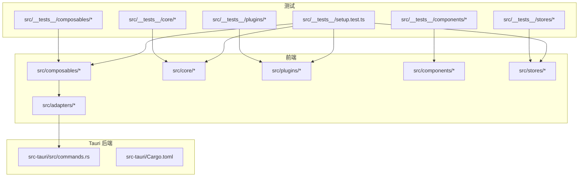
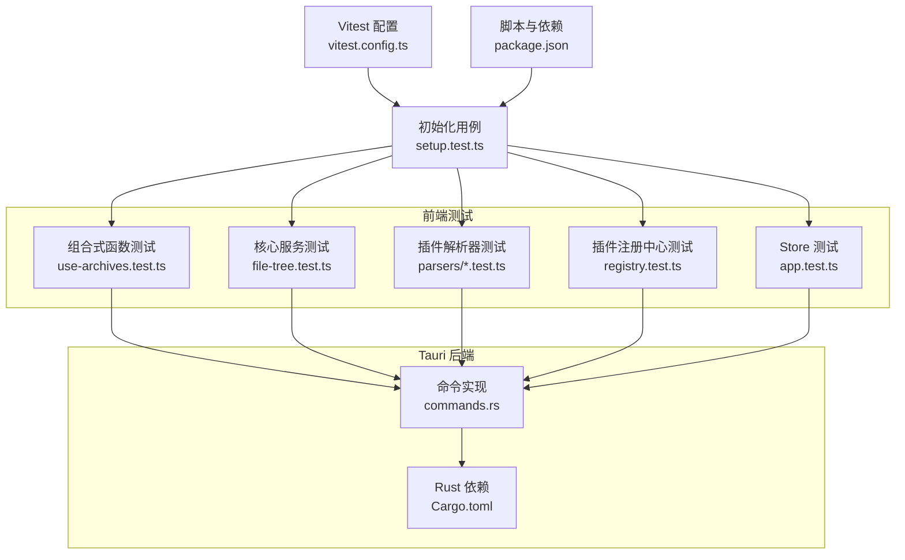
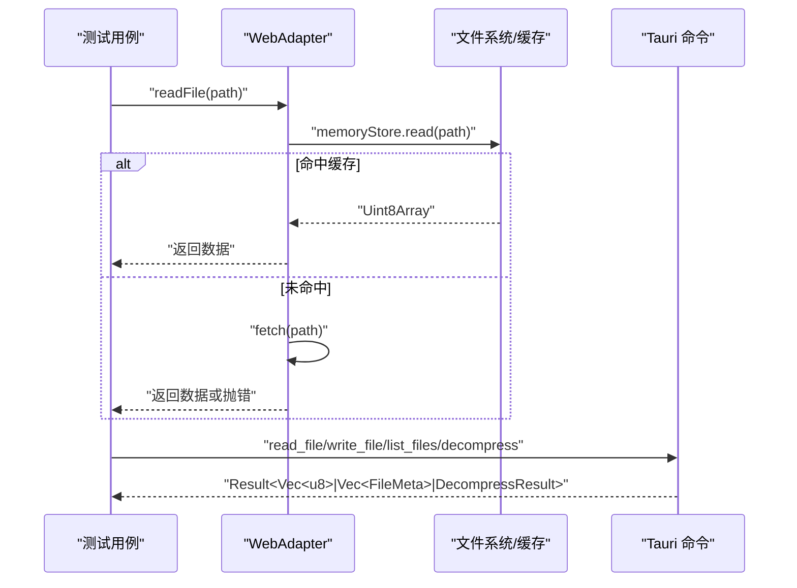
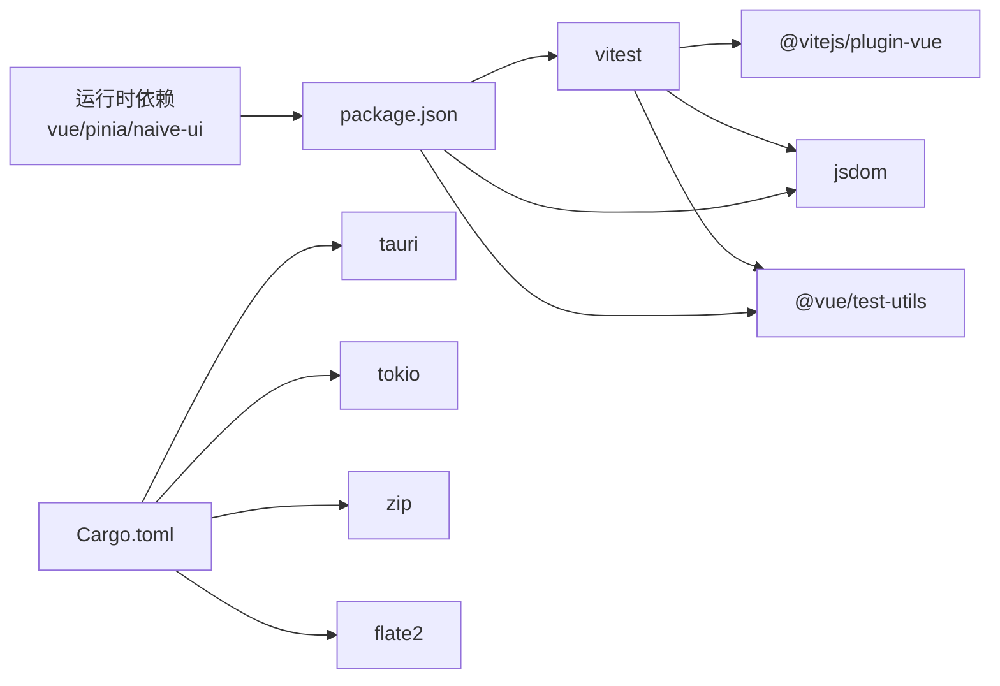

# 测试指南

<cite>
**本文引用的文件**   
- [vitest.config.ts](file://vitest.config.ts)
- [package.json](file://package.json)
- [setup.test.ts](file://src/__tests__/setup.test.ts)
- [use-archives.test.ts](file://src/__tests__/composables/use-archives.test.ts)
- [file-tree.test.ts](file://src/__tests__/core/file-tree.test.ts)
- [csv-parser.test.ts](file://src/__tests__/plugins/parsers/csv-parser.test.ts)
- [json-parser.test.ts](file://src/__tests__/plugins/parsers/json-parser.test.ts)
- [log-parser.test.ts](file://src/__tests__/plugins/parsers/log-parser.test.ts)
- [text-parser.test.ts](file://src/__tests__/plugins/parsers/text-parser.test.ts)
- [registry.test.ts](file://src/__tests__/plugins/registry.test.ts)
- [app.test.ts](file://src/__tests__/stores/app.test.ts)
- [web-adapter.ts](file://src/adapters/web-adapter.ts)
- [commands.rs](file://src-tauri/src/commands.rs)
- [Cargo.toml](file://src-tauri/Cargo.toml)
</cite>

## 目录
1. [简介](#简介)
2. [项目结构](#项目结构)
3. [核心组件](#核心组件)
4. [架构总览](#架构总览)
5. [详细组件分析](#详细组件分析)
6. [依赖分析](#依赖分析)
7. [性能考虑](#性能考虑)
8. [故障排查指南](#故障排查指南)
9. [结论](#结论)
10. [附录](#附录)

## 简介
本指南面向 Hello-Tauri 项目的测试实践，围绕 Vitest 框架在项目中的配置与使用展开，覆盖测试环境设置、模拟对象创建、异步测试处理、单元测试最佳实践（组件、组合式函数、核心服务、插件）、Tauri 命令与异步操作的测试策略、端到端测试建议以及持续集成中的自动化与报告生成。文档以仓库现有测试用例为依据，提供可落地的规范与示例路径，帮助团队建立稳定高效的测试体系。

## 项目结构
项目采用前端 Vue + Tauri 的混合架构：
- 前端代码位于 src，包含组件、组合式函数、核心逻辑、插件与适配器；
- 测试代码集中于 src/__tests__，按功能域组织；
- Tauri 后端位于 src-tauri，暴露命令供前端调用；
- 测试配置在 vitest.config.ts，脚本入口在 package.json。

图表来源
- [vitest.config.ts:1-18](file://vitest.config.ts#L1-L18)
- [package.json:1-42](file://package.json#L1-L42)
- [setup.test.ts:1-8](file://src/__tests__/setup.test.ts#L1-L8)
- [use-archives.test.ts:1-65](file://src/__tests__/composables/use-archives.test.ts#L1-L65)
- [file-tree.test.ts:1-52](file://src/__tests__/core/file-tree.test.ts#L1-L52)
- [registry.test.ts:1-98](file://src/__tests__/plugins/registry.test.ts#L1-L98)
- [app.test.ts:1-56](file://src/__tests__/stores/app.test.ts#L1-L56)
- [web-adapter.ts:1-73](file://src/adapters/web-adapter.ts#L1-L73)
- [commands.rs:1-53](file://src-tauri/src/commands.rs#L1-L53)
- [Cargo.toml:1-19](file://src-tauri/Cargo.toml#L1-L19)

章节来源
- [vitest.config.ts:1-18](file://vitest.config.ts#L1-L18)
- [package.json:1-42](file://package.json#L1-L42)

## 核心组件
本节聚焦项目中已实现的测试样例，提炼出可复用的模式与最佳实践。

- 基础环境与全局断言
  - 通过 setup.test.ts 验证 Vitest 运行正常，确认 expect 等全局 API 可用。
  - 章节来源
    - [setup.test.ts:1-8](file://src/__tests__/setup.test.ts#L1-L8)

- 组合式函数测试（Composables）
  - useArchiveManager 的状态变更、统计计算、进度更新等场景均有覆盖，体现 beforeEach 重置状态、File 构造输入、响应式值断言等模式。
  - 章节来源
    - [use-archives.test.ts:1-65](file://src/__tests__/composables/use-archives.test.ts#L1-L65)

- 核心服务测试（Core）
  - FileTreeBuilder 的树构建、查找、扁平化等算法行为被充分验证，体现纯函数/类方法的确定性断言。
  - 章节来源
    - [file-tree.test.ts:1-52](file://src/__tests__/core/file-tree.test.ts#L1-L52)

- 插件解析器测试（Parsers）
  - CSV/JSON/Log/Text 解析器的边界条件、异常路径、编码与行数统计均被覆盖，体现对结构化数据与文本流的健壮性断言。
  - 章节来源
    - [csv-parser.test.ts:1-35](file://src/__tests__/plugins/parsers/csv-parser.test.ts#L1-L35)
    - [json-parser.test.ts:1-41](file://src/__tests__/plugins/parsers/json-parser.test.ts#L1-L41)
    - [log-parser.test.ts:1-58](file://src/__tests__/plugins/parsers/log-parser.test.ts#L1-L58)
    - [text-parser.test.ts:1-27](file://src/__tests__/plugins/parsers/text-parser.test.ts#L1-L27)

- 插件注册中心测试（Registry）
  - 插件注册、检测、启用/禁用、安全解析与安全解压的错误兜底策略得到验证，体现防御性编程与容错设计。
  - 章节来源
    - [registry.test.ts:1-98](file://src/__tests__/plugins/registry.test.ts#L1-L98)

- Store 测试（Pinia）
  - 主题切换、面板宽度钳制、插件禁用管理等状态操作被验证，体现 Pinia 实例隔离与副作用控制。
  - 章节来源
    - [app.test.ts:1-56](file://src/__tests__/stores/app.test.ts#L1-L56)

- Web 平台适配器测试要点
  - WebAdapter 的读取、流式读取、错误抛出等行为适合用 fetch 与 ReadableStream 进行模拟或替换，便于在无真实网络环境下进行单元测试。
  - 章节来源
    - [web-adapter.ts:1-73](file://src/adapters/web-adapter.ts#L1-L73)

## 架构总览
下图展示测试层如何覆盖前端各模块，并与 Tauri 命令形成前后端协同的测试闭环。

图表来源
- [vitest.config.ts:1-18](file://vitest.config.ts#L1-L18)
- [package.json:1-42](file://package.json#L1-L42)
- [setup.test.ts:1-8](file://src/__tests__/setup.test.ts#L1-L8)
- [use-archives.test.ts:1-65](file://src/__tests__/composables/use-archives.test.ts#L1-L65)
- [file-tree.test.ts:1-52](file://src/__tests__/core/file-tree.test.ts#L1-L52)
- [csv-parser.test.ts:1-35](file://src/__tests__/plugins/parsers/csv-parser.test.ts#L1-L35)
- [json-parser.test.ts:1-41](file://src/__tests__/plugins/parsers/json-parser.test.ts#L1-L41)
- [log-parser.test.ts:1-58](file://src/__tests__/plugins/parsers/log-parser.test.ts#L1-L58)
- [text-parser.test.ts:1-27](file://src/__tests__/plugins/parsers/text-parser.test.ts#L1-L27)
- [registry.test.ts:1-98](file://src/__tests__/plugins/registry.test.ts#L1-L98)
- [app.test.ts:1-56](file://src/__tests__/stores/app.test.ts#L1-L56)
- [commands.rs:1-53](file://src-tauri/src/commands.rs#L1-L53)
- [Cargo.toml:1-19](file://src-tauri/Cargo.toml#L1-L19)

## 详细组件分析

### Vitest 配置与环境设置
- 关键配置项
  - 测试环境：jsdom，用于 DOM 相关能力；
  - 全局 API：globals 开启，可直接使用 describe/it/expect；
  - 别名：@ 指向 src，@adapter 指向 web-adapter，便于测试中统一替换平台适配。
- 推荐实践
  - 为不同测试目标维护独立配置（如 node/jsdom/browser），按需启用 coverage；
  - 将平台差异通过 @adapter 别名注入，避免硬编码分支。

章节来源
- [vitest.config.ts:1-18](file://vitest.config.ts#L1-L18)

### 脚本与运行方式
- 常用脚本
  - test：一次性运行所有测试；
  - test:watch：监听模式；
  - typecheck：类型检查；
  - tauri*：Tauri 开发/构建。
- 覆盖率
  - 可通过添加 --coverage 参数或使用专用脚本执行，结合 @vitest/coverage-v8 或 istanbul 插件输出 HTML/JSON 报告。

章节来源
- [package.json:1-42](file://package.json#L1-L42)

### 组合式函数测试（useArchiveManager）
- 关注点
  - 状态初始化与重置（beforeEach）；
  - 文件输入构造（File）；
  - 响应式值断言（value 访问）；
  - 时间戳与进度字段校验。
- 建议
  - 对共享状态务必在 beforeEach 中 reset，避免用例间污染；
  - 对时间相关断言建议使用近似比较或冻结时间。

章节来源
- [use-archives.test.ts:1-65](file://src/__tests__/composables/use-archives.test.ts#L1-L65)

### 核心服务测试（FileTreeBuilder）
- 关注点
  - 从扁平列表构建层级树；
  - 空输入与缺失节点的处理；
  - 树遍历与叶子节点提取。
- 建议
  - 针对边界输入（空数组、单节点、深层嵌套）补充用例；
  - 对 findNode 的命中/未命中路径分别断言。

章节来源
- [file-tree.test.ts:1-52](file://src/__tests__/core/file-tree.test.ts#L1-L52)

### 插件解析器测试（CSV/JSON/LOG/TEXT）
- 关注点
  - 表头与数据行解析、分隔符自定义、空行过滤；
  - JSON 对象/数组/JSONL 解析与非法输入抛错；
  - 日志行匹配、未知级别归并、原始行保留；
  - UTF-8 解码、中文支持、空文件处理。
- 建议
  - 对异常路径增加错误消息片段断言；
  - 对大文件场景引入分块/流式处理的性能用例。

章节来源
- [csv-parser.test.ts:1-35](file://src/__tests__/plugins/parsers/csv-parser.test.ts#L1-L35)
- [json-parser.test.ts:1-41](file://src/__tests__/plugins/parsers/json-parser.test.ts#L1-L41)
- [log-parser.test.ts:1-58](file://src/__tests__/plugins/parsers/log-parser.test.ts#L1-L58)
- [text-parser.test.ts:1-27](file://src/__tests__/plugins/parsers/text-parser.test.ts#L1-L27)

### 插件注册中心测试（PluginRegistry）
- 关注点
  - 按扩展名注册与检索；
  - 文件类型自动检测；
  - 插件启用/禁用；
  - safeParse/safeDecompress 的错误兜底与回退。
- 建议
  - 对并发注册、重复注册、冲突扩展名等场景补充用例；
  - 对安全策略（如路径穿越）在 Rust 侧配合断言。

章节来源
- [registry.test.ts:1-98](file://src/__tests__/plugins/registry.test.ts#L1-L98)

### Store 测试（Pinia）
- 关注点
  - 主题切换、面板宽度钳制、插件禁用管理；
  - 使用 setActivePinia/createPinia 隔离实例。
- 建议
  - 对持久化策略（如 localStorage）进行 mock；
  - 对副作用（事件派发、网络请求）进行拦截。

章节来源
- [app.test.ts:1-56](file://src/__tests__/stores/app.test.ts#L1-L56)

### 平台适配器与 Tauri 命令测试
- 前端适配器（WebAdapter）
  - 读取/流式读取/Range 请求/错误抛出；
  - 建议在测试中通过 @adapter 别名替换为内存或本地文件实现。
- Tauri 命令（commands.rs）
  - 文件读写、临时目录获取、mmap 读取、解压流程；
  - 建议在后端使用 Rust 测试覆盖 IO 与错误分支，在前端通过命令调用进行集成测试。

图表来源
- [web-adapter.ts:1-73](file://src/adapters/web-adapter.ts#L1-L73)
- [commands.rs:1-53](file://src-tauri/src/commands.rs#L1-L53)

章节来源
- [web-adapter.ts:1-73](file://src/adapters/web-adapter.ts#L1-L73)
- [commands.rs:1-53](file://src-tauri/src/commands.rs#L1-L53)

### 异步测试处理
- 使用 async/await 与 Promise 断言；
- 对超时与重试场景使用 setTimeout 或定时器控制；
- 对网络与 I/O 使用 fetch/ReadableStream 的 mock 或替换实现。

章节来源
- [registry.test.ts:71-96](file://src/__tests__/plugins/registry.test.ts#L71-L96)
- [web-adapter.ts:31-69](file://src/adapters/web-adapter.ts#L31-L69)

### 组件测试（Vue 组件）
- 可使用 @vue/test-utils 挂载组件、触发交互、断言渲染结果；
- 建议结合 jsdom 环境模拟 DOM API 与路由/状态依赖。

[本节为通用指导，不直接分析具体文件]

### 测试命名约定与断言使用
- 命名约定
  - describe 描述被测单元；
  - it 描述具体场景，语义清晰且可定位问题；
  - 文件名与被测模块同名或对应子目录。
- 断言建议
  - 优先使用 toBe/toEqual 进行精确断言；
  - 对字符串内容使用 toContain 进行片段断言；
  - 对异常使用 toThrow 捕获错误信息。

章节来源
- [json-parser.test.ts:22-33](file://src/__tests__/plugins/parsers/json-parser.test.ts#L22-L33)
- [log-parser.test.ts:21-28](file://src/__tests__/plugins/parsers/log-parser.test.ts#L21-L28)

### 覆盖率要求
- 建议指标
  - 语句覆盖率 ≥ 80%；
  - 分支覆盖率 ≥ 75%；
  - 函数覆盖率 ≥ 80%；
  - 行覆盖率 ≥ 80%。
- 工具与报告
  - 使用 @vitest/coverage-v8 或 @vitest/coverage-istanbul；
  - 输出 HTML 与 JSON 报告，便于 CI 归档与阈值门禁。

章节来源
- [package.json:30-40](file://package.json#L30-L40)

### Tauri 命令与异步操作测试策略
- 前端侧
  - 通过 @adapter 别名替换 WebAdapter 为内存实现，避免真实网络；
  - 对 Tauri 命令调用进行 mock，返回预设结果或错误。
- 后端侧
  - 使用 Rust 测试覆盖命令分支（成功/失败/权限拒绝/不支持格式）；
  - 对 IO 与解压库进行隔离测试。

章节来源
- [vitest.config.ts:11-16](file://vitest.config.ts#L11-L16)
- [commands.rs:1-53](file://src-tauri/src/commands.rs#L1-L53)
- [Cargo.toml:1-19](file://src-tauri/Cargo.toml#L1-L19)

### 端到端测试（E2E）指导与工具推荐
- 推荐工具
  - Playwright / Cypress：跨浏览器 UI 自动化；
  - Tauri 官方 e2e 工具链：基于 Playwright 的 Tauri E2E 方案。
- 建议
  - 启动应用后，通过 UI 触发文件选择、解析、预览等主流程；
  - 断言界面状态、渲染内容与用户反馈；
  - 在 CI 中并行运行多平台用例。

[本节为通用指导，不直接分析具体文件]

### 持续集成中的测试自动化与报告
- 步骤建议
  - 安装依赖；
  - 运行类型检查；
  - 运行单元测试并生成覆盖率报告；
  - 上传报告至制品库或覆盖率平台；
  - 设置覆盖率阈值门禁。
- 参考脚本
  - 使用 package.json 中的 test 脚本作为入口；
  - 在 CI 中添加 --coverage 与 reporter 配置。

章节来源
- [package.json:9-18](file://package.json#L9-L18)

## 依赖分析
- 前端测试依赖
  - vitest、@vitejs/plugin-vue、jsdom、@vue/test-utils、typescript、vue-tsc；
  - 运行时依赖包括 vue、pinia、naive-ui 等。
- Tauri 后端依赖
  - tauri、tokio、memmap2、zip、flate2、rayon、serde、thiserror 等。

图表来源
- [package.json:20-40](file://package.json#L20-L40)
- [Cargo.toml:1-19](file://src-tauri/Cargo.toml#L1-L19)

章节来源
- [package.json:20-40](file://package.json#L20-L40)
- [Cargo.toml:1-19](file://src-tauri/Cargo.toml#L1-L19)

## 性能考虑
- 大数据量解析
  - 对 CSV/JSON/日志等大文件采用流式或分块处理，避免一次性加载导致内存峰值；
  - 在测试中使用小样本与边界样本组合，必要时加入性能基准用例。
- 并发与调度
  - 任务调度器与多线程解压需确保线程安全与资源释放；
  - 在测试中模拟高并发场景，验证无死锁与泄漏。
- 网络与 I/O
  - 使用内存缓存与 Range 请求减少带宽占用；
  - 在测试中模拟慢网络与中断，验证降级与重试策略。

[本节为通用指导，不直接分析具体文件]

## 故障排查指南
- 常见问题
  - 测试环境缺少 DOM API：确认 vitest 环境为 jsdom；
  - 全局 API 不可用：检查 globals 配置；
  - 别名失效：确认 resolve.alias 配置正确；
  - 异步用例超时：检查 await 与定时器控制；
  - 插件错误未捕获：检查 safeParse/safeDecompress 的 try/catch 与回退逻辑。
- 调试技巧
  - 使用 console 输出中间状态；
  - 缩小范围到最小用例复现；
  - 在 CI 中保存日志与产物以便回溯。

章节来源
- [vitest.config.ts:7-16](file://vitest.config.ts#L7-L16)
- [registry.test.ts:71-96](file://src/__tests__/plugins/registry.test.ts#L71-L96)

## 结论
本项目已具备较为完善的单元测试基础，覆盖了组合式函数、核心服务、插件解析器与注册中心、Store 等关键模块。通过合理的 Vitest 配置、清晰的测试结构与良好的模拟策略，能够有效保障代码质量与稳定性。建议在此基础上完善组件测试与端到端测试，并在持续集成中引入覆盖率门禁与报告归档，进一步提升交付可靠性。

## 附录
- 快速开始
  - 安装依赖：npm install；
  - 运行测试：npm run test；
  - 监听模式：npm run test:watch；
  - 类型检查：npm run typecheck。
- 覆盖率运行
  - npm run test -- --coverage；
  - 查看 HTML 报告：打开 coverage/index.html。

章节来源
- [package.json:9-18](file://package.json#L9-L18)