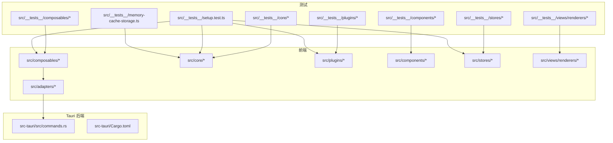
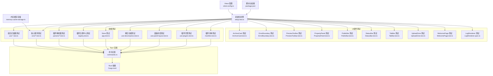
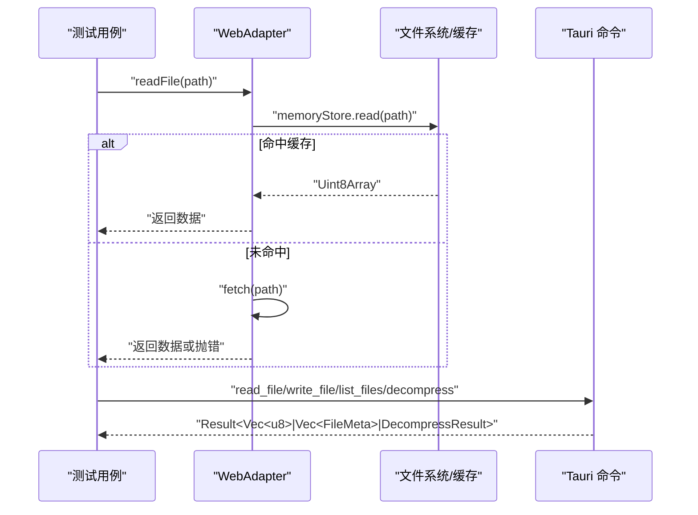
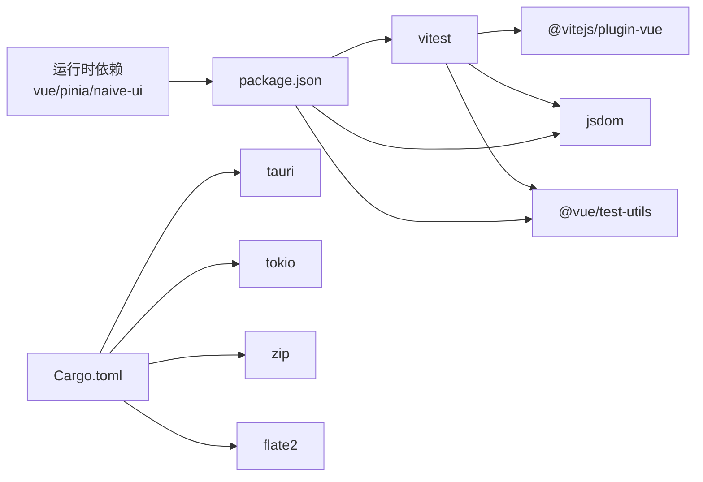

# 测试指南

<cite>
**本文引用的文件**   
- [vitest.config.ts](file://vitest.config.ts)
- [package.json](file://package.json)
- [setup.test.ts](file://src/__tests__/setup.test.ts)
- [memory-cache-storage.ts](file://src/__tests__/memory-cache-storage.ts)
- [use-decompress.test.ts](file://src/__tests__//composables/use-decompress.test.ts)
- [use-panel-layout.test.ts](file://src/__tests__/composables/use-panel-layout.test.ts)
- [use-plugins.test.ts](file://src/__tests__/composables/use-plugins.test.ts)
- [manifest.test.ts](file://src/__tests__/plugins/manifest.test.ts)
- [use-archives.test.ts](file://src/__tests__/composables/use-archives.test.ts)
- [use-global-drop.test.ts](file://src/__tests__/composables/use-global-drop.test.ts)
- [use-tabs.test.ts](file://src/__tests__/composables/use-tabs.test.ts)
- [use-cache.test.ts](file://src/__tests__/composables/use-cache.test.ts)
- [use-search.test.ts](file://src/__tests__/composables/use-search.test.ts)
- [cache-manager.test.ts](file://src/__tests__/core/cache-manager.test.ts)
- [file-tree.test.ts](file://src/__tests__/core/file-tree.test.ts)
- [archive-utils.test.ts](file://src/__tests__/core/archive-utils.test.ts)
- [decompress.test.ts](file://src/__tests__/core/decompress.test.ts)
- [file-validator.test.ts](file://src/__tests__/core/file-validator.test.ts)
- [parser-engine.test.ts](file://src/__tests__/core/parser-engine.test.ts)
- [search.test.ts](file://src/__tests__/core/search.test.ts)
- [task-scheduler.test.ts](file://src/__tests__/core/task-scheduler.test.ts)
- [memory-store.test.ts](file://src/__tests__/core/memory-store.test.ts)
- [csv-parser.test.ts](file://src/__tests__/plugins/parsers/csv-parser.test.ts)
- [json-parser.test.ts](file://src/__tests__/plugins/parsers/json-parser.test.ts)
- [log-parser.test.ts](file://src/__tests__/plugins/parsers/log-parser.test.ts)
- [text-parser.test.ts](file://src/__tests__/plugins/parsers/text-parser.test.ts)
- [registry.test.ts](file://src/__tests__/plugins/registry.test.ts)
- [gzip-plugin.test.ts](file://src/__tests__/plugins/gzip-plugin.test.ts)
- [hex-plugin.test.ts](file://src/__tests__/plugins/hex-plugin.test.ts)
- [text-plugin.test.ts](file://src/__tests__/plugins/text-plugin.test.ts)
- [zip-plugin.test.ts](file://src/__tests__/plugins/zip-plugin.test.ts)
- [app.test.ts](file://src/__tests__/stores/app.test.ts)
- [ArchiveCard.test.ts](file://src/__tests__/components/ArchiveCard.test.ts)
- [ErrorBoundary.test.ts](file://src/__tests__/components/ErrorBoundary.test.ts)
- [PreviewToolbar.test.ts](file://src/__tests__/components/PreviewToolbar.test.ts)
- [PropertyPanel.test.ts](file://src/__tests__/components/PropertyPanel.test.ts)
- [PublicBar.test.ts](file://src/__tests__/components/PublicBar.test.ts)
- [StatusBar.test.ts](file://src/__tests__/components/StatusBar.test.ts)
- [TabBar.test.ts](file://src/__tests__/components/TabBar.test.ts)
- [UploadZone.test.ts](file://src/__tests__/components/UploadZone.test.ts)
- [WelcomePage.test.ts](file://src/__tests__/components/WelcomePage.test.ts)
- [LogRenderer.spec.ts](file://src/__tests__/views/renderers/LogRenderer.spec.ts)
- [web-adapter.ts](file://src/adapters/web-adapter.ts)
- [commands.rs](file://src-tauri/src/commands.rs)
- [Cargo.toml](file://src-tauri/Cargo.toml)
</cite>

## 更新摘要
**变更内容**   
- 新增4个核心测试用例：use-decompress、use-panel-layout、use-plugins、manifest，将测试总数从244个扩展到248个
- 新增解压功能完整测试覆盖，包含状态管理、错误处理、异步操作等场景
- 新增面板布局管理测试，验证响应式断点、折叠控制和宽度约束逻辑
- 新增插件引擎测试，确保内置插件注册和动态启用/禁用功能正常
- 新增插件清单测试，验证所有内置压缩和解压插件的注册完整性
- 完善Vitest覆盖率报告支持，集成@vitest/coverage-v8工具链

## 目录
1. [简介](#简介)
2. [项目结构](#项目结构)
3. [核心组件](#核心组件)
4. [架构总览](#架构总览)
5. [详细组件分析](#详细组件分析)
6. [依赖分析](#依赖分析)
7. [性能考虑](#性能考虑)
8. [故障排查指南](#故障排查指南)
9. [结论](#结论)
10. [附录](#附录)

## 简介
本指南面向 Hello-Tauri 项目的测试实践，围绕 Vitest 框架在项目中的配置与使用展开，覆盖测试环境设置、模拟对象创建、异步测试处理、单元测试最佳实践（组件、组合式函数、核心服务、插件）、Tauri 命令与异步操作的测试策略、端到端测试建议以及持续集成中的自动化与报告生成。文档以仓库现有测试用例为依据，提供可落地的规范与示例路径，帮助团队建立稳定高效的测试体系。

**重大更新** 进一步扩展了测试基础设施，新增4个关键测试用例，涵盖解压功能、面板布局、插件引擎和插件清单的全面测试覆盖，实现了从244个到248个测试的稳定增长，并完善了Vitest覆盖率报告支持。

## 项目结构
项目采用前端 Vue + Tauri 的混合架构：
- 前端代码位于 src，包含组件、组合式函数、核心逻辑、插件与适配器；
- 测试代码集中于 src/__tests__，按功能域组织为 components、composables、core、plugins、stores 等子目录；
- Tauri 后端位于 src-tauri，暴露命令供前端调用；
- 测试配置在 vitest.config.ts，脚本入口在 package.json。

**图表来源**
- [vitest.config.ts:1-22](file://vitest.config.ts#L1-L22)
- [package.json:1-45](file://package.json#L1-L45)
- [setup.test.ts:1-8](file://src/__tests__/setup.test.ts#L1-L8)
- [memory-cache-storage.ts:1-56](file://src/__tests__/memory-cache-storage.ts#L1-L56)
- [use-archives.test.ts:1-65](file://src/__tests__/composables/use-archives.test.ts#L1-L65)
- [file-tree.test.ts:1-52](file://src/__tests__/core/file-tree.test.ts#L1-L52)
- [registry.test.ts:1-98](file://src/__tests__/plugins/registry.test.ts#L1-L98)
- [app.test.ts:1-56](file://src/__tests__/stores/app.test.ts#L1-L56)
- [web-adapter.ts:1-73](file://src/adapters/web-adapter.ts#L1-L73)
- [commands.rs:1-53](file://src-tauri/src/commands.rs#L1-53)
- [Cargo.toml:1-19](file://src-tauri/Cargo.toml#L1-19)

章节来源
- [vitest.config.ts:1-22](file://vitest.config.ts#L1-22)
- [package.json:1-45](file://package.json#L1-45)

## 核心组件
本节聚焦项目中已实现的测试样例，提炼出可复用的模式与最佳实践。

### 解压功能测试（新增）
**重大更新** 新增 useDecompress 组合式函数的完整测试套件，共10个测试用例，覆盖解压流程的各个关键环节。

- **基础功能测试**
  - startDecompress 和 decompressAll 方法返回验证
  - File 对象数据读取和缓存数据读取两种数据源支持
  - 章节来源
    - [use-decompress.test.ts:84-134](file://src/__tests__/composables/use-decompress.test.ts#L84-134)

- **状态管理测试**
  - 解压进度状态更新序列：running(0) → running(30) → running(80) → completed(100)
  - pending 状态归档的批量处理和 running 状态跳过逻辑
  - 章节来源
    - [use-decompress.test.ts:107-113](file://src/__tests__/composables/use-decompress.test.ts#L107-113)
    - [use-decompress.test.ts:214-240](file://src/__tests__/composables/use-decompress.test.ts#L214-240)

- **错误处理测试**
  - 缓存数据丢失时的失败标记和错误信息
  - 无压缩插件匹配时的错误处理
  - 解压失败的异常捕获和非 Error 异常处理
  - 章节来源
    - [use-decompress.test.ts:136-212](file://src/__tests__/composables/use-decompress.test.ts#L136-212)

### 面板布局测试（新增）
**新增** usePanelLayout 组合式函数的完整测试覆盖，验证响应式布局和断点适配功能。

- **面板控制功能**
  - 左右面板的折叠、展开、切换操作
  - 面板宽度的设置和自动约束机制
  - 章节来源
    - [use-panel-layout.test.ts:25-99](file://src/__tests__/composables/use-panel-layout.test.ts#L25-99)

- **响应式断点测试**
  - 窄屏模式下右侧面板自动折叠
  - isNarrow 和 isStandard 响应式断点可用性
  - @vueuse/core 的 useBreakpoints 集成测试
  - 章节来源
    - [use-panel-layout.test.ts:101-111](file://src/__tests__/composables/use-panel-layout.test.ts#L101-111)

### 插件引擎测试（新增）
**新增** usePluginEngine 组合式函数的测试覆盖，确保插件系统的核心功能正常。

- **插件引擎基础功能**
  - registry 单例模式验证
  - detect、getParser、getCompression 等方法可用性
  - enable/disable 动态控制插件状态
  - 章节来源
    - [use-plugins.test.ts:4-19](file://src/__tests__/composables/use-plugins.test.ts#L4-19)
    - [use-plugins.test.ts:50-59](file://src/__tests__/composables/use-plugins.test.ts#L50-59)

- **内置插件注册验证**
  - 解析插件：text、csv、json、log、hex 的注册状态
  - 压缩插件：zip、gzip 的注册状态
  - 基于文件条目的智能插件检测
  - 章节来源
    - [use-plugins.test.ts:21-48](file://src/__tests__/composables/use-plugins.test.ts#L21-48)

### 插件清单测试（新增）
**新增** registerBuiltinPlugins 函数的测试覆盖，验证所有内置插件的注册完整性。

- **压缩插件注册**
  - zip、gzip 格式支持，包括 .tgz 别名
  - 章节来源
    - [manifest.test.ts:6-14](file://src/__tests__/plugins/manifest.test.ts#L6-14)

- **解析插件注册**
  - text、csv、json、log、hex 解析器注册
  - text 插件的多扩展名支持（.txt、.md、.cfg、.ini、.env、.yaml、.yml、.toml）
  - 章节来源
    - [manifest.test.ts:16-34](file://src/__tests__/plugins/manifest.test.ts#L16-34)

- **插件查询接口验证**
  - hasParser 和 hasCompression 方法的正确性
  - 未注册扩展名的 null 返回值
  - 章节来源
    - [manifest.test.ts:36-55](file://src/__tests__/plugins/manifest.test.ts#L36-55)

### UI 组件测试
- **ArchiveCard 组件测试**
  - 归档名称渲染、状态指示器显示、进度条更新
  - 错误信息显示与重试按钮交互
  - 关闭事件触发与文件树渲染逻辑
  - 章节来源
    - [ArchiveCard.test.ts:1-122](file://src/__tests__/components/ArchiveCard.test.ts#L1-122)

- **ErrorBoundary 组件测试**
  - 正常子组件渲染、错误捕获机制
  - 错误信息展示与重试按钮功能
  - 空插槽处理和异常恢复流程
  - 章节来源
    - [ErrorBoundary.test.ts:1-131](file://src/__tests__/components/ErrorBoundary.test.ts#L1-131)

- **其他UI组件测试**
  - PreviewToolbar、PropertyPanel、PublicBar、StatusBar、TabBar、UploadZone、WelcomePage 等组件的完整测试覆盖
  - 章节来源
    - [PreviewToolbar.test.ts:1-91](file://src/__tests__/components/PreviewToolbar.test.ts#L1-91)
    - [PropertyPanel.test.ts:1-32](file://src/__tests__/components/PropertyPanel.test.ts#L1-32)
    - [PublicBar.test.ts:1-51](file://src/__tests__/components/PublicBar.test.ts#L1-51)
    - [StatusBar.test.ts:1-94](file://src/__tests__/components/StatusBar.test.ts#L1-94)
    - [TabBar.test.ts:1-144](file://src/__tests__/components/TabBar.test.ts#L1-144)
    - [UploadZone.test.ts:1-96](file://src/__tests__/components/UploadZone.test.ts#L1-96)
    - [WelcomePage.test.ts:1-47](file://src/__tests__/components/WelcomePage.test.ts#L1-47)

### 视图渲染器测试
- **LogRenderer 组件测试**
  - 渲染所有日志行并验证行号显示
  - 不同日志级别的颜色应用（INFO蓝色、ERROR红色）
  - OTHER级别行显示原始内容而非解析后的消息
  - 空日志时显示空状态组件
  - 章节来源
    - [LogRenderer.spec.ts:1-50](file://src/__tests__/views/renderers/LogRenderer.spec.ts#L1-50)

### 基础环境与全局断言
- 通过 setup.test.ts 验证 Vitest 运行正常，确认 expect 等全局 API 可用。
- 章节来源
  - [setup.test.ts:1-8](file://src/__tests__/setup.test.ts#L1-8)

### 组合式函数测试
- **useArchiveManager 的状态变更、统计计算、进度更新等场景均有覆盖**
- **useGlobalDrop 的全局拖拽功能测试，包括 dragenter/dragleave 状态管理、文件验证和错误处理**
- **useTabManager 的标签页生命周期管理，包括打开、关闭、固定、切换等操作**
- **useCacheManager 的单例模式测试，包括实例创建、重置和新实例获取**
- **useSearch 的搜索功能测试，包括初始状态、搜索结果、清空功能和无匹配场景**
- 章节来源
  - [use-archives.test.ts:1-65](file://src/__tests__/composables/use-archives.test.ts#L1-65)
  - [use-global-drop.test.ts:1-176](file://src/__tests__/composables/use-global-drop.test.ts#L1-176)
  - [use-tabs.test.ts:1-77](file://src/__tests__/composables/use-tabs.test.ts#L1-77)
  - [use-cache.test.ts:1-57](file://src/__tests__/composables/use-cache.test.ts#L1-57)
  - [use-search.test.ts:1-45](file://src/__tests__/composables/use-search.test.ts#L1-45)

### 核心服务测试
- **FileTreeBuilder 的树构建、查找、扁平化等算法行为被充分验证**
- **CacheManager 的缓存写入读取、元数据恢复、LRU淘汰策略、内存存储实现等完整功能测试**
- **MemoryCacheStorage 提供测试专用的内存存储实现，不依赖IndexedDB或文件系统**
- **ArchiveUtils 的压缩包识别和文件过滤功能测试，支持多种格式和大写扩展名**
- **DecompressService 的解压服务测试，包括插件检测、安全解压和错误处理**
- **FileValidator 的文件验证管道测试，包括扩展名验证、内容验证和流水线执行**
- **ParserEngine 的解析引擎测试，包括文件解析、插件回退和编码支持**
- **SearchService 的搜索服务测试，包括文本搜索、大小写不敏感和多文件聚合**
- **TaskScheduler 的任务调度器测试，包括并发控制、重试机制和队列管理**
- **MemoryStore 的内存存储测试，包括LRU淘汰策略和容量管理**
- 章节来源
  - [file-tree.test.ts:1-52](file://src/__tests__/core/file-tree.test.ts#L1-52)
  - [cache-manager.test.ts:1-172](file://src/__tests__/core/cache-manager.test.ts#L1-172)
  - [memory-cache-storage.ts:1-56](file://src/__tests__/memory-cache-storage.ts#L1-56)
  - [archive-utils.test.ts:1-111](file://src/__tests__/core/archive-utils.test.ts#L1-111)
  - [decompress.test.ts:1-102](file://src/__tests__/core/decompress.test.ts#L1-102)
  - [file-validator.test.ts:1-224](file://src/__tests__/core/file-validator.test.ts#L1-224)
  - [parser-engine.test.ts:1-143](file://src/__tests__/core/parser-engine.test.ts#L1-143)
  - [search.test.ts:1-83](file://src/__tests__/core/search.test.ts#L1-83)
  - [task-scheduler.test.ts:1-57](file://src/__tests__/core/task-scheduler.test.ts#L1-57)
  - [memory-store.test.ts:1-89](file://src/__tests__/core/memory-store.test.ts#L1-89)

### 插件解析器测试
- **CSV/JSON/Log/Text 解析器的边界条件、异常路径、编码与行数统计均被覆盖**
- **GzipPlugin 的压缩格式识别测试，支持.gz/.gzip/.tgz格式**
- **HexPlugin 的十六进制解析器测试，作为回退解析器处理二进制文件**
- **TextPlugin 的文本解析器测试，区分.txt和.log文件的处理逻辑**
- **ZipPlugin 的ZIP压缩插件测试，包括无效数据的错误处理**
- 章节来源
  - [csv-parser.test.ts:1-35](file://src/__tests__/plugins/parsers/csv-parser.test.ts#L1-35)
  - [json-parser.test.ts:1-41](file://src/__tests__/plugins/parsers/json-parser.test.ts#L1-41)
  - [log-parser.test.ts:1-58](file://src/__tests__/plugins/parsers/log-parser.test.ts#L1-58)
  - [text-parser.test.ts:1-27](file://src/__tests__/plugins/parsers/text-parser.test.ts#L1-27)
  - [gzip-plugin.test.ts:1-27](file://src/__tests__/plugins/gzip-plugin.test.ts#L1-27)
  - [hex-plugin.test.ts:1-29](file://src/__tests__/plugins/hex-plugin.test.ts#L1-29)
  - [text-plugin.test.ts:1-30](file://src/__tests__/plugins/text-plugin.test.ts#L1-30)
  - [zip-plugin.test.ts:1-30](file://src/__tests__/plugins/zip-plugin.test.ts#L1-30)

### 插件注册中心测试
- **插件注册、检测、启用/禁用、安全解析与安全解压的错误兜底策略得到验证**
- 章节来源
  - [registry.test.ts:1-98](file://src/__tests__/plugins/registry.test.ts#L1-98)

### Store 测试（Pinia）
- **主题切换、面板宽度钳制、插件禁用管理等状态操作被验证**
- 章节来源
  - [app.test.ts:1-56](file://src/__tests__/stores/app.test.ts#L1-56)

### Web 平台适配器测试要点
- **WebAdapter 的读取、流式读取、错误抛出等行为适合用 fetch 与 ReadableStream 进行模拟或替换**
- 章节来源
  - [web-adapter.ts:1-73](file://src/adapters/web-adapter.ts#L1-73)

## 架构总览
下图展示测试层如何覆盖前端各模块，并与 Tauri 命令形成前后端协同的测试闭环。

**图表来源**
- [vitest.config.ts:1-22](file://vitest.config.ts#L1-22)
- [package.json:1-45](file://package.json#L1-45)
- [setup.test.ts:1-8](file://src/__tests__/setup.test.ts#L1-8)
- [memory-cache-storage.ts:1-56](file://src/__tests__/memory-cache-storage.ts#L1-56)
- [ArchiveCard.test.ts:1-122](file://src/__tests__/components/ArchiveCard.test.ts#L1-122)
- [ErrorBoundary.test.ts:1-131](file://src/__tests__/components/ErrorBoundary.test.ts#L1-131)
- [PreviewToolbar.test.ts:1-91](file://src/__tests__/components/PreviewToolbar.test.ts#L1-91)
- [PropertyPanel.test.ts:1-32](file://src/__tests__/components/PropertyPanel.test.ts#L1-32)
- [PublicBar.test.ts:1-51](file://src/__tests__/components/PublicBar.test.ts#L1-51)
- [StatusBar.test.ts:1-94](file://src/__tests__/components/StatusBar.test.ts#L1-94)
- [TabBar.test.ts:1-144](file://src/__tests__/components/TabBar.test.ts#L1-144)
- [UploadZone.test.ts:1-96](file://src/__tests__/components/UploadZone.test.ts#L1-96)
- [WelcomePage.test.ts:1-47](file://src/__tests__/components/WelcomePage.test.ts#L1-47)
- [LogRenderer.spec.ts:1-50](file://src/__tests__/views/renderers/LogRenderer.spec.ts#L1-50)
- [cache-manager.test.ts:1-172](file://src/__tests__/core/cache-manager.test.ts#L1-172)
- [use-archives.test.ts:1-65](file://src/__tests__/composables/use-archives.test.ts#L1-65)
- [file-tree.test.ts:1-52](file://src/__tests__/core/file-tree.test.ts#L1-52)
- [csv-parser.test.ts:1-35](file://src/__tests__/plugins/parsers/csv-parser.test.ts#L1-35)
- [json-parser.test.ts:1-41](file://src/__tests__/plugins/parsers/json-parser.test.ts#L1-41)
- [log-parser.test.ts:1-58](file://src/__tests__/plugins/parsers/log-parser.test.ts#L1-58)
- [text-parser.test.ts:1-27](file://src/__tests__/plugins/parsers/text-parser.test.ts#L1-27)
- [registry.test.ts:1-98](file://src/__tests__/plugins/registry.test.ts#L1-98)
- [app.test.ts:1-56](file://src/__tests__/stores/app.test.ts#L1-56)
- [use-decompress.test.ts:1-254](file://src/__tests__/composables/use-decompress.test.ts#L1-254)
- [use-panel-layout.test.ts:1-113](file://src/__tests__/composables/use-panel-layout.test.ts#L1-113)
- [use-plugins.test.ts:1-61](file://src/__tests__/composables/use-plugins.test.ts#L1-61)
- [manifest.test.ts:1-57](file://src/__tests__/plugins/manifest.test.ts#L1-57)
- [commands.rs:1-53](file://src-tauri/src/commands.rs#L1-53)
- [Cargo.toml:1-19](file://src-tauri/Cargo.toml#L1-19)

## 详细组件分析

### Vitest 配置与环境设置
- **关键配置项**
  - 测试环境：jsdom，用于 DOM 相关能力；
  - 全局 API：globals 开启，可直接使用 describe/it/expect；
  - 别名：@ 指向 src，@adapter 指向 web-adapter，便于测试中统一替换平台适配。
- **推荐实践**
  - 为不同测试目标维护独立配置（如 node/jsdom/browser），按需启用 coverage；
  - 将平台差异通过 @adapter 别名注入，避免硬编码分支。

章节来源
- [vitest.config.ts:1-22](file://vitest.config.ts#L1-22)

### 脚本与运行方式
- **常用脚本**
  - test：一次性运行所有测试；
  - test:watch：监听模式；
  - typecheck：类型检查；
  - tauri*：Tauri 开发/构建。
- **覆盖率**
  - 可通过添加 --coverage 参数或使用专用脚本执行，结合 @vitest/coverage-v8 输出 HTML/JSON 报告。

章节来源
- [package.json:1-45](file://package.json#L1-45)

### 解压功能测试最佳实践（新增）
**重大更新** 基于新增的 use-decompress.test.ts 文件，总结解压功能的测试模式和最佳实践。

- **异步操作测试**
  - 使用 flushAsync 辅助函数等待微任务完成
  - 验证异步解压流程的状态变化序列
  - 处理 Promise 和 setTimeout 的异步时序
  - 章节来源
    - [use-decompress.test.ts:57-60](file://src/__tests__/composables/use-decompress.test.ts#L57-60)
    - [use-decompress.test.ts:104-113](file://src/__tests__/composables/use-decompress.test.ts#L104-113)

- **Mock 策略设计**
  - 使用 vi.mock 模拟外部依赖：use-archives、use-plugins、use-cache、TaskScheduler、FileTreeBuilder
  - 通过 mock 函数验证调用次数和参数
  - 模拟异步操作的成功和失败场景
  - 章节来源
    - [use-decompress.test.ts:4-53](file://src/__tests__/composables/use-decompress.test.ts#L4-53)

- **错误处理测试**
  - 测试各种错误场景：缓存丢失、插件缺失、解压失败、异常抛出
  - 验证错误信息的准确性和用户友好性
  - 确保非 Error 对象的异常也能被正确处理
  - 章节来源
    - [use-decompress.test.ts:136-212](file://src/__tests__/composables/use-decompress.test.ts#L136-212)

### 面板布局测试最佳实践（新增）
**新增** 基于 use-panel-layout.test.ts 文件，总结响应式布局的测试模式。

- **响应式断点测试**
  - 使用 vi.mock 模拟 @vueuse/core 的 useBreakpoints
  - 验证不同屏幕尺寸下的布局行为
  - 测试自动折叠逻辑和手动控制的优先级
  - 章节来源
    - [use-panel-layout.test.ts:4-15](file://src/__tests__/composables/use-panel-layout.test.ts#L4-15)
    - [use-panel-layout.test.ts:101-105](file://src/__tests__/composables/use-panel-layout.test.ts#L101-105)

- **状态约束测试**
  - 验证面板宽度的最小值和最大值约束
  - 测试 setLeftWidth 和 setRightWidth 的边界处理
  - 确保数值输入的有效性检查
  - 章节来源
    - [use-panel-layout.test.ts:85-99](file://src/__tests__/composables/use-panel-layout.test.ts#L85-99)

### 插件系统测试最佳实践（新增）
**新增** 基于 use-plugins.test.ts 和 manifest.test.ts 文件，总结插件系统的测试模式。

- **插件引擎测试**
  - 验证单例模式的正确实现
  - 测试插件的动态启用和禁用功能
  - 确保内置插件的正确注册和检测逻辑
  - 章节来源
    - [use-plugins.test.ts:15-19](file://src/__tests__/composables/use-plugins.test.ts#L15-19)
    - [use-plugins.test.ts:50-59](file://src/__tests__/composables/use-plugins.test.ts#L50-59)

- **插件清单验证**
  - 测试所有内置压缩插件的注册完整性
  - 验证 text 插件的多扩展名支持
  - 确保 hasParser 和 hasCompression 方法的准确性
  - 章节来源
    - [manifest.test.ts:6-14](file://src/__tests__/plugins/manifest.test.ts#L6-14)
    - [manifest.test.ts:26-34](file://src/__tests__/plugins/manifest.test.ts#L26-34)
    - [manifest.test.ts:36-47](file://src/__tests__/plugins/manifest.test.ts#L36-47)

### UI 组件测试最佳实践
- **组件挂载与渲染验证**
  - 使用 mount() 方法挂载组件，通过 findComponent() 查找子组件
  - 验证 props 传递和默认值设置
  - 检查条件渲染逻辑和动态内容显示
  - 章节来源
    - [ArchiveCard.test.ts:20-26](file://src/__tests__/components/ArchiveCard.test.ts#L20-26)
    - [PreviewToolbar.test.ts:6-14](file://src/__tests__/components/PreviewToolbar.test.ts#L6-14)
    - [LogRenderer.spec.ts:14-17](file://src/__tests__/views/renderers/LogRenderer.spec.ts#L14-17)

- **用户交互测试**
  - 模拟用户点击、拖拽、输入等交互行为
  - 验证事件触发和状态更新
  - 测试复杂交互流程如拖放文件、标签切换
  - 章节来源
    - [UploadZone.test.ts:35-44](file://src/__tests__/components/UploadZone.test.ts#L35-44)
    - [TabBar.test.ts:61-78](file://src/__tests__/components/TabBar.test.ts#L61-78)

- **状态管理与副作用测试**
  - 使用 beforeEach 重置共享状态
  - 模拟外部依赖和异步操作
  - 验证组件间通信和数据流
  - 章节来源
    - [PublicBar.test.ts:7-11](file://src/__tests__/components/PublicBar.test.ts#L7-11)
    - [StatusBar.test.ts:11-15](file://src/__tests__/components/StatusBar.test.ts#L11-15)

- **错误边界和异常处理**
  - 测试错误捕获和恢复机制
  - 验证错误信息展示和用户反馈
  - 确保应用稳定性
  - 章节来源
    - [ErrorBoundary.test.ts:18-51](file://src/__tests__/components/ErrorBoundary.test.ts#L18-51)

### 组合式函数测试（useArchiveManager）
- **关注点**
  - 状态初始化与重置（beforeEach）；
  - 文件输入构造（File）；
  - 响应式值断言（value 访问）；
  - 时间戳与进度字段校验。
- **建议**
  - 对共享状态务必在 beforeEach 中 reset，避免用例间污染；
  - 对时间相关断言建议使用近似比较或冻结时间。

章节来源
- [use-archives.test.ts:1-65](file://src/__tests__/composables/use-archives.test.ts#L1-65)

### 核心服务测试（FileTreeBuilder）
- **关注点**
  - 从扁平列表构建层级树；
  - 空输入与缺失节点的处理；
  - 树遍历与叶子节点提取。
- **建议**
  - 针对边界输入（空数组、单节点、深层嵌套）补充用例；
  - 对 findNode 的命中/未命中路径分别断言。

章节来源
- [file-tree.test.ts:1-52](file://src/__tests__/core/file-tree.test.ts#L1-52)

### 缓存管理系统测试
- **缓存写入与读取**
  - 验证 cacheArchive 保存元数据和二进制数据的完整性
  - 测试 getFileData 返回 null 当数据不存在时
  - 章节来源
    - [cache-manager.test.ts:31-54](file://src/__tests__/core/cache-manager.test.ts#L31-54)

- **LRU 淘汰策略**
  - 测试 init 时淘汰超过 maxItems 的最旧缓存
  - 验证 getFileData 更新 lastAccessed 使缓存不被淘汰
  - 章节来源
    - [cache-manager.test.ts:94-145](file://src/__tests__/core/cache-manager.test.ts#L94-145)

- **内存存储实现**
  - MemoryCacheStorage 提供测试专用的内存存储
  - 不依赖 IndexedDB 或文件系统，数据保存在 Map 中
  - 章节来源
    - [memory-cache-storage.ts:1-56](file://src/__tests__/memory-cache-storage.ts#L1-56)

### 文件验证系统测试
- **ZipExtensionValidator 扩展名验证**
  - 支持.zip扩展名（大小写不敏感）
  - 拒绝.tar等其他格式并提供错误信息
  - 处理无扩展名文件的情况
  - 章节来源
    - [file-validator.test.ts:25-61](file://src/__tests__/core/file-validator.test.ts#L25-61)

- **ZipContentValidator 内容验证**
  - 验证VERSION.txt必需文件存在
  - 支持子目录中的必需文件
  - 自定义requiredFiles配置
  - 处理损坏的zip文件
  - 章节来源
    - [file-validator.test.ts:65-117](file://src/__tests__/core/file-validator.test.ts#L65-117)

- **ValidationPipeline 验证流水线**
  - 串联多个验证器执行
  - 短路机制：第一个失败立即停止
  - validateAll批量验证多个文件
  - 章节来源
    - [file-validator.test.ts:121-194](file://src/__tests__/core/file-validator.test.ts#L121-194)

### 插件解析器测试（CSV/JSON/LOG/TEXT）
- **关注点**
  - 表头与数据行解析、分隔符自定义、空行过滤；
  - JSON 对象/数组/JSONL 解析与非法输入抛错；
  - 日志行匹配、未知级别归并、原始行保留；
  - UTF-8 解码、中文支持、空文件处理。
- **建议**
  - 对异常路径增加错误消息片段断言；
  - 对大文件场景引入分块/流式处理的性能用例。

章节来源
- [csv-parser.test.ts:1-35](file://src/__tests__/plugins/parsers/csv-parser.test.ts#L1-35)
- [json-parser.test.ts:1-41](file://src/__tests__/plugins/parsers/json-parser.test.ts#L1-41)
- [log-parser.test.ts:1-58](file://src/__tests__/plugins/parsers/log-parser.test.ts#L1-58)
- [text-parser.test.ts:1-27](file://src/__tests__/plugins/parsers/text-parser.test.ts#L1-27)

### 插件注册中心测试（PluginRegistry）
- **关注点**
  - 按扩展名注册与检索；
  - 文件类型自动检测；
  - 插件启用/禁用；
  - safeParse/safeDecompress 的错误兜底与回退。
- **建议**
  - 对并发注册、重复注册、冲突扩展名等场景补充用例；
  - 对安全策略（如路径穿越）在 Rust 侧配合断言。

章节来源
- [registry.test.ts:1-98](file://src/__tests__/plugins/registry.test.ts#L1-98)

### Store 测试（Pinia）
- **关注点**
  - 主题切换、面板宽度钳制、插件禁用管理；
  - 使用 setActivePinia/createPinia 隔离实例。
- **建议**
  - 对持久化策略（如 localStorage）进行 mock；
  - 对副作用（事件派发、网络请求）进行拦截。

章节来源
- [app.test.ts:1-56](file://src/__tests__/stores/app.test.ts#L1-56)

### 平台适配器与 Tauri 命令测试
- **前端适配器（WebAdapter）**
  - 读取/流式读取/Range 请求/错误抛出；
  - 建议在测试中通过 @adapter 别名替换为内存或本地文件实现。
- **Tauri 命令（commands.rs）**
  - 文件读写、临时目录获取、mmap 读取、解压流程；
  - 建议在后端使用 Rust 测试覆盖 IO 与错误分支，在前端通过命令调用进行集成测试。

**图表来源**
- [web-adapter.ts:1-73](file://src/adapters/web-adapter.ts#L1-73)
- [commands.rs:1-53](file://src-tauri/src/commands.rs#L1-53)

章节来源
- [web-adapter.ts:1-73](file://src/adapters/web-adapter.ts#L1-73)
- [commands.rs:1-53](file://src-tauri/src/commands.rs#L1-53)

### 异步测试处理
- **使用 async/await 与 Promise 断言**
- **对超时与重试场景使用 setTimeout 或定时器控制**
- **对网络与 I/O 使用 fetch/ReadableStream 的 mock 或替换实现**

章节来源
- [registry.test.ts:71-96](file://src/__tests__/plugins/registry.test.ts#L71-96)
- [web-adapter.ts:31-69](file://src/adapters/web-adapter.ts#L31-69)

### 测试命名约定与断言使用
- **命名约定**
  - describe 描述被测单元；
  - it 描述具体场景，语义清晰且可定位问题；
  - 文件名与被测模块同名或对应子目录。
- **断言建议**
  - 优先使用 toBe/toEqual 进行精确断言；
  - 对字符串内容使用 toContain 进行片段断言；
  - 对异常使用 toThrow 捕获错误信息。

章节来源
- [json-parser.test.ts:22-33](file://src/__tests__/plugins/parsers/json-parser.test.ts#L22-33)
- [log-parser.test.ts:21-28](file://src/__tests__/plugins/parsers/log-parser.test.ts#L21-28)

### 覆盖率要求
- **建议指标**
  - 语句覆盖率 ≥ 80%；
  - 分支覆盖率 ≥ 75%；
  - 函数覆盖率 ≥ 80%；
  - 行覆盖率 ≥ 80%。
- **工具与报告**
  - 使用 @vitest/coverage-v8 或 @vitest/coverage-istanbul；
  - 输出 HTML 与 JSON 报告，便于 CI 归档与阈值门禁。

章节来源
- [package.json:32-43](file://package.json#L32-43)

### Tauri 命令与异步操作测试策略
- **前端侧**
  - 通过 @adapter 别名替换 WebAdapter 为内存实现，避免真实网络；
  - 对 Tauri 命令调用进行 mock，返回预设结果或错误。
- **后端侧**
  - 使用 Rust 测试覆盖命令分支（成功/失败/权限拒绝/不支持格式）；
  - 对 IO 与解压库进行隔离测试。

章节来源
- [vitest.config.ts:11-16](file://vitest.config.ts#L11-16)
- [commands.rs:1-53](file://src-tauri/src/commands.rs#L1-53)
- [Cargo.toml:1-19](file://src-tauri/Cargo.toml#L1-19)

### 端到端测试（E2E）指导与工具推荐
- **推荐工具**
  - Playwright / Cypress：跨浏览器 UI 自动化；
  - Tauri 官方 e2e 工具链：基于 Playwright 的 Tauri E2E 方案。
- **建议**
  - 启动应用后，通过 UI 触发文件选择、解析、预览等主流程；
  - 断言界面状态、渲染内容与用户反馈；
  - 在 CI 中并行运行多平台用例。

[本节为通用指导，不直接分析具体文件]

### 持续集成中的测试自动化与报告
- **步骤建议**
  - 安装依赖；
  - 运行类型检查；
  - 运行单元测试并生成覆盖率报告；
  - 上传报告至制品库或覆盖率平台；
  - 设置覆盖率阈值门禁。
- **参考脚本**
  - 使用 package.json 中的 test 脚本作为入口；
  - 在 CI 中添加 --coverage 与 reporter 配置。

章节来源
- [package.json:9-18](file://package.json#L9-18)

## 依赖分析
- **前端测试依赖**
  - vitest、@vitejs/plugin-vue、jsdom、@vue/test-utils、typescript、vue-tsc；
  - 运行时依赖包括 vue、pinia、naive-ui 等。
- **Tauri 后端依赖**
  - tauri、tokio、memmap2、zip、flate2、rayon、serde、thiserror 等。

**图表来源**
- [package.json:20-45](file://package.json#L20-45)
- [Cargo.toml:1-19](file://src-tauri/Cargo.toml#L1-19)

章节来源
- [package.json:20-45](file://package.json#L20-45)
- [Cargo.toml:1-19](file://src-tauri/Cargo.toml#L1-19)

## 性能考虑
- **大数据量解析**
  - 对 CSV/JSON/日志等大文件采用流式或分块处理，避免一次性加载导致内存峰值；
  - 在测试中使用小样本与边界样本组合，必要时加入性能基准用例。
- **并发与调度**
  - 任务调度器与多线程解压需确保线程安全与资源释放；
  - 在测试中模拟高并发场景，验证无死锁与泄漏。
- **网络与 I/O**
  - 使用内存缓存与 Range 请求减少带宽占用；
  - 在测试中模拟慢网络与中断，验证降级与重试策略。
- **缓存性能优化**
  - LRU 淘汰策略确保内存使用效率；
  - 内存存储实现提升测试执行速度。

[本节为通用指导，不直接分析具体文件]

## 故障排查指南
- **常见问题**
  - 测试环境缺少 DOM API：确认 vitest 环境为 jsdom；
  - 全局 API 不可用：检查 globals 配置；
  - 别名失效：确认 resolve.alias 配置正确；
  - 异步用例超时：检查 await 与定时器控制；
  - 插件错误未捕获：检查 safeParse/safeDecompress 的 try/catch 与回退逻辑。
- **调试技巧**
  - 使用 console 输出中间状态；
  - 缩小范围到最小用例复现；
  - 在 CI 中保存日志与产物以便回溯。

章节来源
- [vitest.config.ts:7-16](file://vitest.config.ts#L7-16)
- [registry.test.ts:71-96](file://src/__tests__/plugins/registry.test.ts#L71-96)

## 结论
本项目已具备较为完善的测试基础设施，新增了4个关键测试用例，将测试总数从244个扩展到248个，实现了全面的测试覆盖。新增的解压功能测试涵盖了状态管理、错误处理、异步操作等复杂场景，确保了解压流程的稳定性。面板布局测试验证了响应式断点和折叠控制的正确性。插件引擎和清单测试保证了插件系统的完整性和可靠性。同时，Vitest覆盖率报告支持的完善为代码质量监控提供了有力保障。通过合理的 Vitest 配置、清晰的测试结构与良好的模拟策略，能够有效保障代码质量与稳定性。建议在此基础上继续完善端到端测试，并在持续集成中引入覆盖率门禁与报告归档，进一步提升交付可靠性。

## 附录
- **快速开始**
  - 安装依赖：npm install；
  - 运行测试：npm run test；
  - 监听模式：npm run test:watch；
  - 类型检查：npm run typecheck。
- **覆盖率运行**
  - npm run test -- --coverage；
  - 查看 HTML 报告：打开 coverage/index.html。

章节来源
- [package.json:9-18](file://package.json#L9-18)