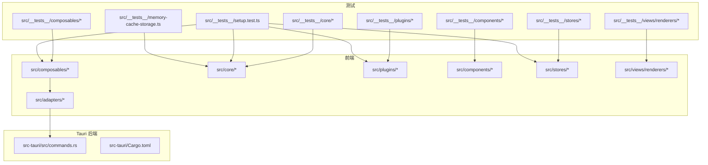
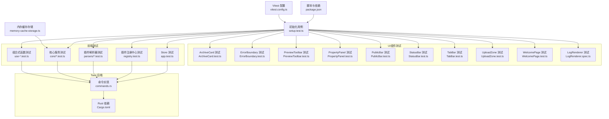
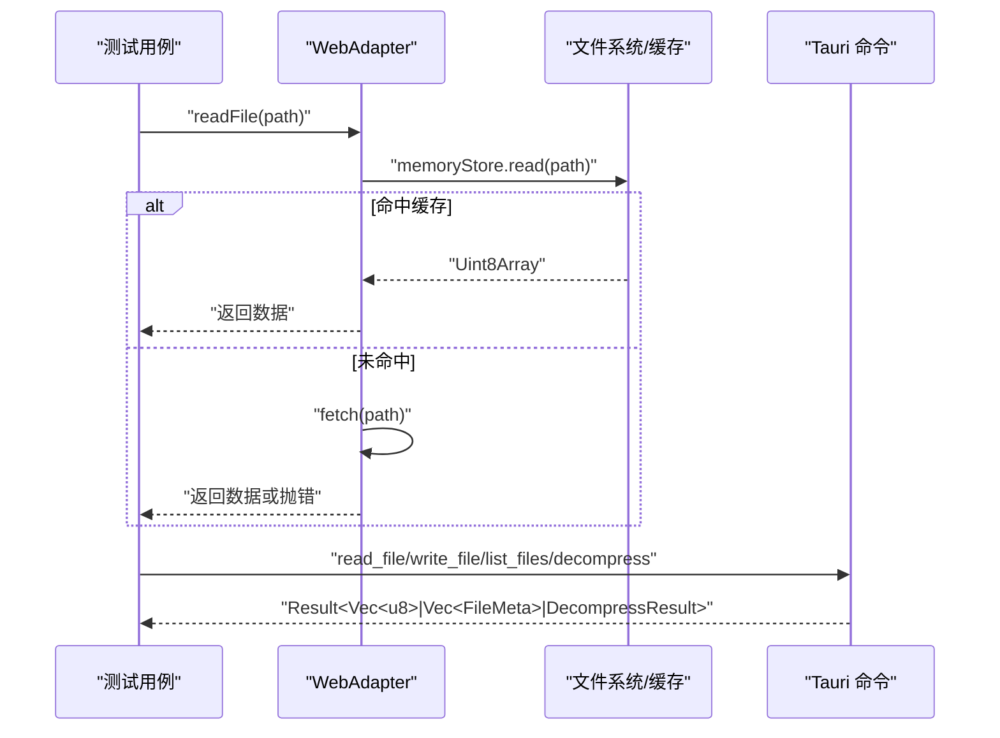
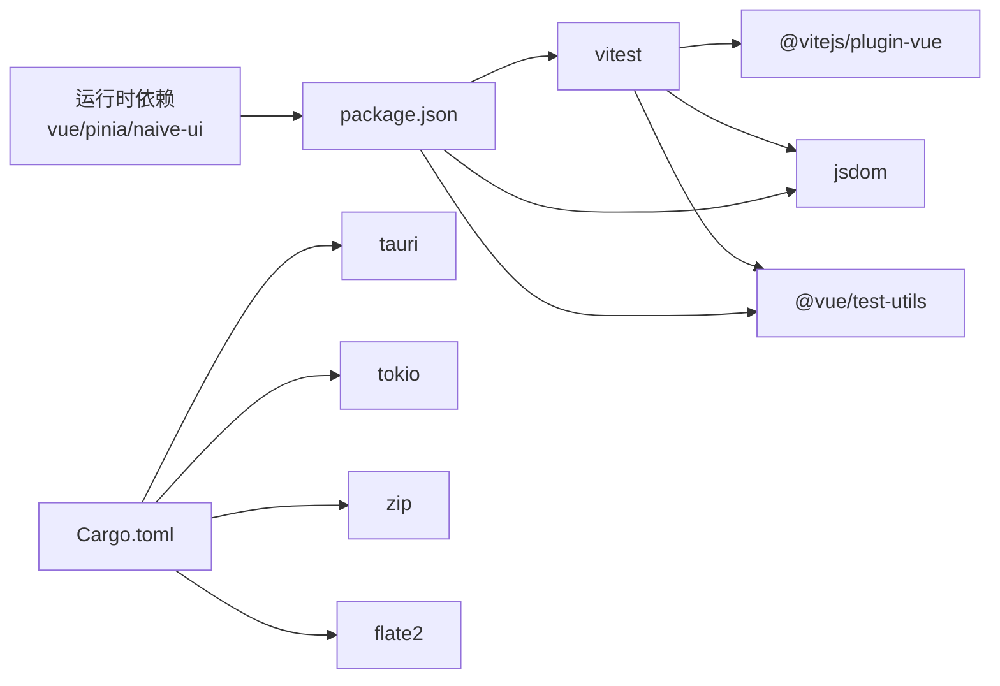

# 测试指南

<cite>
**本文引用的文件**   
- [vitest.config.ts](file://vitest.config.ts)
- [package.json](file://package.json)
- [setup.test.ts](file://src/__tests__/setup.test.ts)
- [memory-cache-storage.ts](file://src/__tests__/memory-cache-storage.ts)
- [use-archives.test.ts](file://src/__tests__/composables/use-archives.test.ts)
- [use-global-drop.test.ts](file://src/__tests__/composables/use-global-drop.test.ts)
- [use-tabs.test.ts](file://src/__tests__/composables/use-tabs.test.ts)
- [use-cache.test.ts](file://src/__tests__/composables/use-cache.test.ts)
- [use-search.test.ts](file://src/__tests__/composables/use-search.test.ts)
- [cache-manager.test.ts](file://src/__tests__/core/cache-manager.test.ts)
- [file-tree.test.ts](file://src/__tests__/core/file-tree.test.ts)
- [archive-utils.test.ts](file://src/__tests__/core/archive-utils.test.ts)
- [decompress.test.ts](file://src/__tests__/core/decompress.test.ts)
- [file-validator.test.ts](file://src/__tests__/core/file-validator.test.ts)
- [parser-engine.test.ts](file://src/__tests__/core/parser-engine.test.ts)
- [search.test.ts](file://src/__tests__/core/search.test.ts)
- [task-scheduler.test.ts](file://src/__tests__/core/task-scheduler.test.ts)
- [memory-store.test.ts](file://src/__tests__/core/memory-store.test.ts)
- [csv-parser.test.ts](file://src/__tests__/plugins/parsers/csv-parser.test.ts)
- [json-parser.test.ts](file://src/__tests__/plugins/parsers/json-parser.test.ts)
- [log-parser.test.ts](file://src/__tests__/plugins/parsers/log-parser.test.ts)
- [text-parser.test.ts](file://src/__tests__/plugins/parsers/text-parser.test.ts)
- [registry.test.ts](file://src/__tests__/plugins/registry.test.ts)
- [gzip-plugin.test.ts](file://src/__tests__/plugins/gzip-plugin.test.ts)
- [hex-plugin.test.ts](file://src/__tests__/plugins/hex-plugin.test.ts)
- [text-plugin.test.ts](file://src/__tests__/plugins/text-plugin.test.ts)
- [zip-plugin.test.ts](file://src/__tests__/plugins/zip-plugin.test.ts)
- [app.test.ts](file://src/__tests__/stores/app.test.ts)
- [ArchiveCard.test.ts](file://src/__tests__/components/ArchiveCard.test.ts)
- [ErrorBoundary.test.ts](file://src/__tests__/components/ErrorBoundary.test.ts)
- [PreviewToolbar.test.ts](file://src/__tests__/components/PreviewToolbar.test.ts)
- [PropertyPanel.test.ts](file://src/__tests__/components/PropertyPanel.test.ts)
- [PublicBar.test.ts](file://src/__tests__/components/PublicBar.test.ts)
- [StatusBar.test.ts](file://src/__tests__/components/StatusBar.test.ts)
- [TabBar.test.ts](file://src/__tests__/components/TabBar.test.ts)
- [UploadZone.test.ts](file://src/__tests__/components/UploadZone.test.ts)
- [WelcomePage.test.ts](file://src/__tests__/components/WelcomePage.test.ts)
- [LogRenderer.spec.ts](file://src/__tests__/views/renderers/LogRenderer.spec.ts)
- [web-adapter.ts](file://src/adapters/web-adapter.ts)
- [commands.rs](file://src-tauri/src/commands.rs)
- [Cargo.toml](file://src-tauri/Cargo.toml)
</cite>

## 更新摘要
**变更内容**   
- 新增57个测试用例，将测试总数从187个扩展到244个，实现全面测试覆盖
- 新增核心模块测试：archive-utils、decompress、file-validator、parser-engine、search、task-scheduler、memory-store
- 新增组合式函数测试：use-cache、use-search，增强全局拖拽和标签页管理测试
- 新增插件系统测试：gzip-plugin、hex-plugin、text-plugin、zip-plugin等压缩和解压插件测试
- 新增UI组件测试：9个核心组件的完整测试套件，涵盖渲染、交互、状态管理等场景
- 新增视图渲染器测试：LogRenderer组件测试
- 扩展缓存系统测试，新增MemoryCacheStorage内存存储实现和完整的LRU淘汰策略测试

## 目录
1. [简介](#简介)
2. [项目结构](#项目结构)
3. [核心组件](#核心组件)
4. [架构总览](#架构总览)
5. [详细组件分析](#详细组件分析)
6. [依赖分析](#依赖分析)
7. [性能考虑](#性能考虑)
8. [故障排查指南](#故障排查指南)
9. [结论](#结论)
10. [附录](#附录)

## 简介
本指南面向 Hello-Tauri 项目的测试实践，围绕 Vitest 框架在项目中的配置与使用展开，覆盖测试环境设置、模拟对象创建、异步测试处理、单元测试最佳实践（组件、组合式函数、核心服务、插件）、Tauri 命令与异步操作的测试策略、端到端测试建议以及持续集成中的自动化与报告生成。文档以仓库现有测试用例为依据，提供可落地的规范与示例路径，帮助团队建立稳定高效的测试体系。

**重大更新** 大幅扩展了测试覆盖率，新增57个测试用例，涵盖核心模块、组合式函数、插件系统和UI组件的全面测试覆盖，实现了从187个到244个测试的显著增长。

## 项目结构
项目采用前端 Vue + Tauri 的混合架构：
- 前端代码位于 src，包含组件、组合式函数、核心逻辑、插件与适配器；
- 测试代码集中于 src/__tests__，按功能域组织为 components、composables、core、plugins、stores 等子目录；
- Tauri 后端位于 src-tauri，暴露命令供前端调用；
- 测试配置在 vitest.config.ts，脚本入口在 package.json。

**图表来源**
- [vitest.config.ts:1-22](file://vitest.config.ts#L1-L22)
- [package.json:1-44](file://package.json#L1-L44)
- [setup.test.ts:1-8](file://src/__tests__/setup.test.ts#L1-L8)
- [memory-cache-storage.ts:1-56](file://src/__tests__/memory-cache-storage.ts#L1-L56)
- [use-archives.test.ts:1-65](file://src/__tests__/composables/use-archives.test.ts#L1-L65)
- [file-tree.test.ts:1-52](file://src/__tests__/core/file-tree.test.ts#L1-L52)
- [registry.test.ts:1-98](file://src/__tests__/plugins/registry.test.ts#L1-L98)
- [app.test.ts:1-56](file://src/__tests__/stores/app.test.ts#L1-L56)
- [web-adapter.ts:1-73](file://src/adapters/web-adapter.ts#L1-L73)
- [commands.rs:1-53](file://src-tauri/src/commands.rs#L1-L53)
- [Cargo.toml:1-19](file://src-tauri/Cargo.toml#L1-L19)

章节来源
- [vitest.config.ts:1-22](file://vitest.config.ts#L1-L22)
- [package.json:1-44](file://package.json#L1-L44)

## 核心组件
本节聚焦项目中已实现的测试样例，提炼出可复用的模式与最佳实践。

### UI 组件测试（新增）
**重大更新** 新增9个核心UI组件的完整测试套件，共57个测试用例，覆盖渲染、交互、状态管理等场景。

- **ArchiveCard 组件测试**
  - 归档名称渲染、状态指示器显示、进度条更新
  - 错误信息显示与重试按钮交互
  - 关闭事件触发与文件树渲染逻辑
  - 章节来源
    - [ArchiveCard.test.ts:1-122](file://src/__tests__/components/ArchiveCard.test.ts#L1-L122)

- **ErrorBoundary 组件测试**
  - 正常子组件渲染、错误捕获机制
  - 错误信息展示与重试按钮功能
  - 空插槽处理和异常恢复流程
  - 章节来源
    - [ErrorBoundary.test.ts:1-131](file://src/__tests__/components/ErrorBoundary.test.ts#L1-L131)

- **PreviewToolbar 组件测试**
  - 字号输入框渲染与默认值验证
  - 不同文件类型的工具栏显示逻辑
  - 编码选择器和开关控件测试
  - 章节来源
    - [PreviewToolbar.test.ts:1-91](file://src/__tests__/components/PreviewToolbar.test.ts#L1-L91)

- **PropertyPanel 组件测试**
  - 压缩包信息和文件信息区域渲染
  - MetadataView 和 PathBreadcrumb 组件集成
  - NScrollbar 滚动容器验证
  - 章节来源
    - [PropertyPanel.test.ts:1-32](file://src/__tests__/components/PropertyPanel.test.ts#L1-L32)

- **PublicBar 组件测试**
  - 批量操作按钮和全局搜索组件渲染
  - NSpace 布局验证和一键清空功能
  - 章节来源
    - [PublicBar.test.ts:1-51](file://src/__tests__/components/PublicBar.test.ts#L1-L51)

- **StatusBar 组件测试**
  - 无文件打开时的默认显示
  - 活动标签页文件信息显示
  - 文件大小格式化（B/KB/MB）
  - 字体缩放滑块功能验证
  - 章节来源
    - [StatusBar.test.ts:1-94](file://src/__tests__/components/StatusBar.test.ts#L1-L94)

- **TabBar 组件测试**
  - 欢迎页和标签栏的条件渲染
  - 标签页文件名显示和多标签管理
  - 标签切换、固定/取消固定、关闭功能
  - 活动标签样式和关闭按钮显示逻辑
  - 章节来源
    - [TabBar.test.ts:1-144](file://src/__tests__/components/TabBar.test.ts#L1-L144)

- **UploadZone 组件测试**
  - 上传提示文字和隐藏文件输入元素
  - 点击上传触发文件选择和拖拽交互
  - 激活样式显示和非压缩包文件过滤
  - 章节来源
    - [UploadZone.test.ts:1-96](file://src/__tests__/components/UploadZone.test.ts#L1-L96)

- **WelcomePage 组件测试**
  - 欢迎标题和操作提示显示
  - 快捷键提示和SVG图标元素验证
  - 上传文件区域的点击交互
  - 章节来源
    - [WelcomePage.test.ts:1-47](file://src/__tests__/components/WelcomePage.test.ts#L1-L47)

### 视图渲染器测试（新增）
**新增** LogRenderer 组件测试，验证日志渲染器的各种显示场景。

- **LogRenderer 组件测试**
  - 渲染所有日志行并验证行号显示
  - 不同日志级别的颜色应用（INFO蓝色、ERROR红色）
  - OTHER级别行显示原始内容而非解析后的消息
  - 空日志时显示空状态组件
  - 章节来源
    - [LogRenderer.spec.ts:1-50](file://src/__tests__/views/renderers/LogRenderer.spec.ts#L1-L50)

### 基础环境与全局断言
- 通过 setup.test.ts 验证 Vitest 运行正常，确认 expect 等全局 API 可用。
- 章节来源
  - [setup.test.ts:1-8](file://src/__tests__/setup.test.ts#L1-L8)

### 组合式函数测试（Composables）
**重大更新** 新增全局拖拽、标签页管理、缓存管理和搜索功能的完整测试覆盖。

- useArchiveManager 的状态变更、统计计算、进度更新等场景均有覆盖，体现 beforeEach 重置状态、File 构造输入、响应式值断言等模式。
- useGlobalDrop 的全局拖拽功能测试，包括 dragenter/dragleave 状态管理、文件验证和错误处理。
- useTabManager 的标签页生命周期管理，包括打开、关闭、固定、切换等操作。
- **新增** useCacheManager 的单例模式测试，包括实例创建、重置和新实例获取。
- **新增** useSearch 的搜索功能测试，包括初始状态、搜索结果、清空功能和无匹配场景。
- 章节来源
  - [use-archives.test.ts:1-65](file://src/__tests__/composables/use-archives.test.ts#L1-L65)
  - [use-global-drop.test.ts:1-176](file://src/__tests__/composables/use-global-drop.test.ts#L1-L176)
  - [use-tabs.test.ts:1-77](file://src/__tests__/composables/use-tabs.test.ts#L1-L77)
  - [use-cache.test.ts:1-57](file://src/__tests__/composables/use-cache.test.ts#L1-57)
  - [use-search.test.ts:1-45](file://src/__tests__/composables/use-search.test.ts#L1-45)

### 核心服务测试（Core）
**重大更新** 新增完整的缓存管理系统、文件验证、解压服务、解析引擎、搜索服务和任务调度器等核心模块测试。

- FileTreeBuilder 的树构建、查找、扁平化等算法行为被充分验证，体现纯函数/类方法的确定性断言。
- CacheManager 的缓存写入读取、元数据恢复、LRU淘汰策略、内存存储实现等完整功能测试。
- MemoryCacheStorage 提供测试专用的内存存储实现，不依赖IndexedDB或文件系统。
- **新增** ArchiveUtils 的压缩包识别和文件过滤功能测试，支持多种格式和大写扩展名。
- **新增** DecompressService 的解压服务测试，包括插件检测、安全解压和错误处理。
- **新增** FileValidator 的文件验证管道测试，包括扩展名验证、内容验证和流水线执行。
- **新增** ParserEngine 的解析引擎测试，包括文件解析、插件回退和编码支持。
- **新增** SearchService 的搜索服务测试，包括文本搜索、大小写不敏感和多文件聚合。
- **新增** TaskScheduler 的任务调度器测试，包括并发控制、重试机制和队列管理。
- **新增** MemoryStore 的内存存储测试，包括LRU淘汰策略和容量管理。
- 章节来源
  - [file-tree.test.ts:1-52](file://src/__tests__/core/file-tree.test.ts#L1-L52)
  - [cache-manager.test.ts:1-172](file://src/__tests__/core/cache-manager.test.ts#L1-L172)
  - [memory-cache-storage.ts:1-56](file://src/__tests__/memory-cache-storage.ts#L1-L56)
  - [archive-utils.test.ts:1-111](file://src/__tests__/core/archive-utils.test.ts#L1-L111)
  - [decompress.test.ts:1-102](file://src/__tests__/core/decompress.test.ts#L1-L102)
  - [file-validator.test.ts:1-224](file://src/__tests__/core/file-validator.test.ts#L1-L224)
  - [parser-engine.test.ts:1-143](file://src/__tests__/core/parser-engine.test.ts#L1-L143)
  - [search.test.ts:1-83](file://src/__tests__/core/search.test.ts#L1-83)
  - [task-scheduler.test.ts:1-57](file://src/__tests__/core/task-scheduler.test.ts#L1-L57)
  - [memory-store.test.ts:1-89](file://src/__tests__/core/memory-store.test.ts#L1-L89)

### 插件解析器测试（Parsers）
**重大更新** 新增多个插件系统的完整测试覆盖。

- CSV/JSON/Log/Text 解析器的边界条件、异常路径、编码与行数统计均被覆盖，体现对结构化数据与文本流的健壮性断言。
- **新增** GzipPlugin 的压缩格式识别测试，支持.gz/.gzip/.tgz格式。
- **新增** HexPlugin 的十六进制解析器测试，作为回退解析器处理二进制文件。
- **新增** TextPlugin 的文本解析器测试，区分.txt和.log文件的处理逻辑。
- **新增** ZipPlugin 的ZIP压缩插件测试，包括无效数据的错误处理。
- 章节来源
  - [csv-parser.test.ts:1-35](file://src/__tests__/plugins/parsers/csv-parser.test.ts#L1-L35)
  - [json-parser.test.ts:1-41](file://src/__tests__/plugins/parsers/json-parser.test.ts#L1-L41)
  - [log-parser.test.ts:1-58](file://src/__tests__/plugins/parsers/log-parser.test.ts#L1-L58)
  - [text-parser.test.ts:1-27](file://src/__tests__/plugins/parsers/text-parser.test.ts#L1-L27)
  - [gzip-plugin.test.ts:1-27](file://src/__tests__/plugins/gzip-plugin.test.ts#L1-L27)
  - [hex-plugin.test.ts:1-29](file://src/__tests__/plugins/hex-plugin.test.ts#L1-L29)
  - [text-plugin.test.ts:1-30](file://src/__tests__/plugins/text-plugin.test.ts#L1-L30)
  - [zip-plugin.test.ts:1-30](file://src/__tests__/plugins/zip-plugin.test.ts#L1-L30)

### 插件注册中心测试（Registry）
- 插件注册、检测、启用/禁用、安全解析与安全解压的错误兜底策略得到验证，体现防御性编程与容错设计。
- 章节来源
  - [registry.test.ts:1-98](file://src/__tests__/plugins/registry.test.ts#L1-L98)

### Store 测试（Pinia）
- 主题切换、面板宽度钳制、插件禁用管理等状态操作被验证，体现 Pinia 实例隔离与副作用控制。
- 章节来源
  - [app.test.ts:1-56](file://src/__tests__/stores/app.test.ts#L1-L56)

### Web 平台适配器测试要点
- WebAdapter 的读取、流式读取、错误抛出等行为适合用 fetch 与 ReadableStream 进行模拟或替换，便于在无真实网络环境下进行单元测试。
- 章节来源
  - [web-adapter.ts:1-73](file://src/adapters/web-adapter.ts#L1-L73)

## 架构总览
下图展示测试层如何覆盖前端各模块，并与 Tauri 命令形成前后端协同的测试闭环。

**图表来源**
- [vitest.config.ts:1-22](file://vitest.config.ts#L1-L22)
- [package.json:1-44](file://package.json#L1-L44)
- [setup.test.ts:1-8](file://src/__tests__/setup.test.ts#L1-L8)
- [memory-cache-storage.ts:1-56](file://src/__tests__/memory-cache-storage.ts#L1-L56)
- [ArchiveCard.test.ts:1-122](file://src/__tests__/components/ArchiveCard.test.ts#L1-L122)
- [ErrorBoundary.test.ts:1-131](file://src/__tests__/components/ErrorBoundary.test.ts#L1-L131)
- [PreviewToolbar.test.ts:1-91](file://src/__tests__/components/PreviewToolbar.test.ts#L1-L91)
- [PropertyPanel.test.ts:1-32](file://src/__tests__/components/PropertyPanel.test.ts#L1-L32)
- [PublicBar.test.ts:1-51](file://src/__tests__/components/PublicBar.test.ts#L1-L51)
- [StatusBar.test.ts:1-94](file://src/__tests__/components/StatusBar.test.ts#L1-L94)
- [TabBar.test.ts:1-144](file://src/__tests__/components/TabBar.test.ts#L1-L144)
- [UploadZone.test.ts:1-96](file://src/__tests__/components/UploadZone.test.ts#L1-L96)
- [WelcomePage.test.ts:1-47](file://src/__tests__/components/WelcomePage.test.ts#L1-L47)
- [LogRenderer.spec.ts:1-50](file://src/__tests__/views/renderers/LogRenderer.spec.ts#L1-L50)
- [cache-manager.test.ts:1-172](file://src/__tests__/core/cache-manager.test.ts#L1-L172)
- [use-archives.test.ts:1-65](file://src/__tests__/composables/use-archives.test.ts#L1-L65)
- [file-tree.test.ts:1-52](file://src/__tests__/core/file-tree.test.ts#L1-L52)
- [csv-parser.test.ts:1-35](file://src/__tests__/plugins/parsers/csv-parser.test.ts#L1-L35)
- [json-parser.test.ts:1-41](file://src/__tests__/plugins/parsers/json-parser.test.ts#L1-L41)
- [log-parser.test.ts:1-58](file://src/__tests__/plugins/parsers/log-parser.test.ts#L1-L58)
- [text-parser.test.ts:1-27](file://src/__tests__/plugins/parsers/text-parser.test.ts#L1-L27)
- [registry.test.ts:1-98](file://src/__tests__/plugins/registry.test.ts#L1-L98)
- [app.test.ts:1-56](file://src/__tests__/stores/app.test.ts#L1-L56)
- [commands.rs:1-53](file://src-tauri/src/commands.rs#L1-L53)
- [Cargo.toml:1-19](file://src-tauri/Cargo.toml#L1-L19)

## 详细组件分析

### Vitest 配置与环境设置
- 关键配置项
  - 测试环境：jsdom，用于 DOM 相关能力；
  - 全局 API：globals 开启，可直接使用 describe/it/expect；
  - 别名：@ 指向 src，@adapter 指向 web-adapter，便于测试中统一替换平台适配。
- 推荐实践
  - 为不同测试目标维护独立配置（如 node/jsdom/browser），按需启用 coverage；
  - 将平台差异通过 @adapter 别名注入，避免硬编码分支。

章节来源
- [vitest.config.ts:1-22](file://vitest.config.ts#L1-L22)

### 脚本与运行方式
- 常用脚本
  - test：一次性运行所有测试；
  - test:watch：监听模式；
  - typecheck：类型检查；
  - tauri*：Tauri 开发/构建。
- 覆盖率
  - 可通过添加 --coverage 参数或使用专用脚本执行，结合 @vitest/coverage-v8 或 istanbul 插件输出 HTML/JSON 报告。

章节来源
- [package.json:1-44](file://package.json#L1-L44)

### UI 组件测试最佳实践（新增）
**重大更新** 基于新增的9个UI组件测试文件和LogRenderer测试，总结UI测试的最佳实践模式。

- 组件挂载与渲染验证
  - 使用 mount() 方法挂载组件，通过 findComponent() 查找子组件
  - 验证 props 传递和默认值设置
  - 检查条件渲染逻辑和动态内容显示
  - 章节来源
    - [ArchiveCard.test.ts:20-26](file://src/__tests__/components/ArchiveCard.test.ts#L20-L26)
    - [PreviewToolbar.test.ts:6-14](file://src/__tests__/components/PreviewToolbar.test.ts#L6-L14)
    - [LogRenderer.spec.ts:14-17](file://src/__tests__/views/renderers/LogRenderer.spec.ts#L14-L17)

- 用户交互测试
  - 模拟用户点击、拖拽、输入等交互行为
  - 验证事件触发和状态更新
  - 测试复杂交互流程如拖放文件、标签切换
  - 章节来源
    - [UploadZone.test.ts:35-44](file://src/__tests__/components/UploadZone.test.ts#L35-L44)
    - [TabBar.test.ts:61-78](file://src/__tests__/components/TabBar.test.ts#L61-L78)

- 状态管理与副作用测试
  - 使用 beforeEach 重置共享状态
  - 模拟外部依赖和异步操作
  - 验证组件间通信和数据流
  - 章节来源
    - [PublicBar.test.ts:7-11](file://src/__tests__/components/PublicBar.test.ts#L7-L11)
    - [StatusBar.test.ts:11-15](file://src/__tests__/components/StatusBar.test.ts#L11-L15)

- 错误边界和异常处理
  - 测试错误捕获和恢复机制
  - 验证错误信息展示和用户反馈
  - 确保应用稳定性
  - 章节来源
    - [ErrorBoundary.test.ts:18-51](file://src/__tests__/components/ErrorBoundary.test.ts#L18-L51)

### 组合式函数测试（useArchiveManager）
- 关注点
  - 状态初始化与重置（beforeEach）；
  - 文件输入构造（File）；
  - 响应式值断言（value 访问）；
  - 时间戳与进度字段校验。
- 建议
  - 对共享状态务必在 beforeEach 中 reset，避免用例间污染；
  - 对时间相关断言建议使用近似比较或冻结时间。

章节来源
- [use-archives.test.ts:1-65](file://src/__tests__/composables/use-archives.test.ts#L1-L65)

### 核心服务测试（FileTreeBuilder）
- 关注点
  - 从扁平列表构建层级树；
  - 空输入与缺失节点的处理；
  - 树遍历与叶子节点提取。
- 建议
  - 针对边界输入（空数组、单节点、深层嵌套）补充用例；
  - 对 findNode 的命中/未命中路径分别断言。

章节来源
- [file-tree.test.ts:1-52](file://src/__tests__/core/file-tree.test.ts#L1-L52)

### 缓存管理系统测试（新增）
**重大更新** 新增完整的缓存管理系统测试，包括LRU淘汰策略和内存存储实现。

- 缓存写入与读取
  - 验证 cacheArchive 保存元数据和二进制数据的完整性
  - 测试 getFileData 返回 null 当数据不存在时
  - 章节来源
    - [cache-manager.test.ts:31-54](file://src/__tests__/core/cache-manager.test.ts#L31-L54)

- LRU 淘汰策略
  - 测试 init 时淘汰超过 maxItems 的最旧缓存
  - 验证 getFileData 更新 lastAccessed 使缓存不被淘汰
  - 章节来源
    - [cache-manager.test.ts:94-145](file://src/__tests__/core/cache-manager.test.ts#L94-L145)

- 内存存储实现
  - MemoryCacheStorage 提供测试专用的内存存储
  - 不依赖 IndexedDB 或文件系统，数据保存在 Map 中
  - 章节来源
    - [memory-cache-storage.ts:1-56](file://src/__tests__/memory-cache-storage.ts#L1-L56)

### 文件验证系统测试（新增）
**新增** 完整的文件验证管道测试，包括扩展名验证、内容验证和流水线执行。

- ZipExtensionValidator 扩展名验证
  - 支持.zip扩展名（大小写不敏感）
  - 拒绝.tar等其他格式并提供错误信息
  - 处理无扩展名文件的情况
  - 章节来源
    - [file-validator.test.ts:25-61](file://src/__tests__/core/file-validator.test.ts#L25-L61)

- ZipContentValidator 内容验证
  - 验证VERSION.txt必需文件存在
  - 支持子目录中的必需文件
  - 自定义requiredFiles配置
  - 处理损坏的zip文件
  - 章节来源
    - [file-validator.test.ts:65-117](file://src/__tests__/core/file-validator.test.ts#L65-L117)

- ValidationPipeline 验证流水线
  - 串联多个验证器执行
  - 短路机制：第一个失败立即停止
  - validateAll批量验证多个文件
  - 章节来源
    - [file-validator.test.ts:121-194](file://src/__tests__/core/file-validator.test.ts#L121-L194)

### 插件解析器测试（CSV/JSON/LOG/TEXT）
- 关注点
  - 表头与数据行解析、分隔符自定义、空行过滤；
  - JSON 对象/数组/JSONL 解析与非法输入抛错；
  - 日志行匹配、未知级别归并、原始行保留；
  - UTF-8 解码、中文支持、空文件处理。
- 建议
  - 对异常路径增加错误消息片段断言；
  - 对大文件场景引入分块/流式处理的性能用例。

章节来源
- [csv-parser.test.ts:1-35](file://src/__tests__/plugins/parsers/csv-parser.test.ts#L1-L35)
- [json-parser.test.ts:1-41](file://src/__tests__/plugins/parsers/json-parser.test.ts#L1-L41)
- [log-parser.test.ts:1-58](file://src/__tests__/plugins/parsers/log-parser.test.ts#L1-L58)
- [text-parser.test.ts:1-27](file://src/__tests__/plugins/parsers/text-parser.test.ts#L1-L27)

### 插件注册中心测试（PluginRegistry）
- 关注点
  - 按扩展名注册与检索；
  - 文件类型自动检测；
  - 插件启用/禁用；
  - safeParse/safeDecompress 的错误兜底与回退。
- 建议
  - 对并发注册、重复注册、冲突扩展名等场景补充用例；
  - 对安全策略（如路径穿越）在 Rust 侧配合断言。

章节来源
- [registry.test.ts:1-98](file://src/__tests__/plugins/registry.test.ts#L1-L98)

### Store 测试（Pinia）
- 关注点
  - 主题切换、面板宽度钳制、插件禁用管理；
  - 使用 setActivePinia/createPinia 隔离实例。
- 建议
  - 对持久化策略（如 localStorage）进行 mock；
  - 对副作用（事件派发、网络请求）进行拦截。

章节来源
- [app.test.ts:1-56](file://src/__tests__/stores/app.test.ts#L1-L56)

### 平台适配器与 Tauri 命令测试
- 前端适配器（WebAdapter）
  - 读取/流式读取/Range 请求/错误抛出；
  - 建议在测试中通过 @adapter 别名替换为内存或本地文件实现。
- Tauri 命令（commands.rs）
  - 文件读写、临时目录获取、mmap 读取、解压流程；
  - 建议在后端使用 Rust 测试覆盖 IO 与错误分支，在前端通过命令调用进行集成测试。

**图表来源**
- [web-adapter.ts:1-73](file://src/adapters/web-adapter.ts#L1-L73)
- [commands.rs:1-53](file://src-tauri/src/commands.rs#L1-L53)

章节来源
- [web-adapter.ts:1-73](file://src/adapters/web-adapter.ts#L1-L73)
- [commands.rs:1-53](file://src-tauri/src/commands.rs#L1-L53)

### 异步测试处理
- 使用 async/await 与 Promise 断言；
- 对超时与重试场景使用 setTimeout 或定时器控制；
- 对网络与 I/O 使用 fetch/ReadableStream 的 mock 或替换实现。

章节来源
- [registry.test.ts:71-96](file://src/__tests__/plugins/registry.test.ts#L71-L96)
- [web-adapter.ts:31-69](file://src/adapters/web-adapter.ts#L31-L69)

### 测试命名约定与断言使用
- 命名约定
  - describe 描述被测单元；
  - it 描述具体场景，语义清晰且可定位问题；
  - 文件名与被测模块同名或对应子目录。
- 断言建议
  - 优先使用 toBe/toEqual 进行精确断言；
  - 对字符串内容使用 toContain 进行片段断言；
  - 对异常使用 toThrow 捕获错误信息。

章节来源
- [json-parser.test.ts:22-33](file://src/__tests__/plugins/parsers/json-parser.test.ts#L22-L33)
- [log-parser.test.ts:21-28](file://src/__tests__/plugins/parsers/log-parser.test.ts#L21-L28)

### 覆盖率要求
- 建议指标
  - 语句覆盖率 ≥ 80%；
  - 分支覆盖率 ≥ 75%；
  - 函数覆盖率 ≥ 80%；
  - 行覆盖率 ≥ 80%。
- 工具与报告
  - 使用 @vitest/coverage-v8 或 @vitest/coverage-istanbul；
  - 输出 HTML 与 JSON 报告，便于 CI 归档与阈值门禁。

章节来源
- [package.json:30-40](file://package.json#L30-L40)

### Tauri 命令与异步操作测试策略
- 前端侧
  - 通过 @adapter 别名替换 WebAdapter 为内存实现，避免真实网络；
  - 对 Tauri 命令调用进行 mock，返回预设结果或错误。
- 后端侧
  - 使用 Rust 测试覆盖命令分支（成功/失败/权限拒绝/不支持格式）；
  - 对 IO 与解压库进行隔离测试。

章节来源
- [vitest.config.ts:11-16](file://vitest.config.ts#L11-L16)
- [commands.rs:1-53](file://src-tauri/src/commands.rs#L1-L53)
- [Cargo.toml:1-19](file://src-tauri/Cargo.toml#L1-L19)

### 端到端测试（E2E）指导与工具推荐
- 推荐工具
  - Playwright / Cypress：跨浏览器 UI 自动化；
  - Tauri 官方 e2e 工具链：基于 Playwright 的 Tauri E2E 方案。
- 建议
  - 启动应用后，通过 UI 触发文件选择、解析、预览等主流程；
  - 断言界面状态、渲染内容与用户反馈；
  - 在 CI 中并行运行多平台用例。

[本节为通用指导，不直接分析具体文件]

### 持续集成中的测试自动化与报告
- 步骤建议
  - 安装依赖；
  - 运行类型检查；
  - 运行单元测试并生成覆盖率报告；
  - 上传报告至制品库或覆盖率平台；
  - 设置覆盖率阈值门禁。
- 参考脚本
  - 使用 package.json 中的 test 脚本作为入口；
  - 在 CI 中添加 --coverage 与 reporter 配置。

章节来源
- [package.json:9-18](file://package.json#L9-L18)

## 依赖分析
- 前端测试依赖
  - vitest、@vitejs/plugin-vue、jsdom、@vue/test-utils、typescript、vue-tsc；
  - 运行时依赖包括 vue、pinia、naive-ui 等。
- Tauri 后端依赖
  - tauri、tokio、memmap2、zip、flate2、rayon、serde、thiserror 等。

**图表来源**
- [package.json:20-44](file://package.json#L20-L44)
- [Cargo.toml:1-19](file://src-tauri/Cargo.toml#L1-L19)

章节来源
- [package.json:20-44](file://package.json#L20-L44)
- [Cargo.toml:1-19](file://src-tauri/Cargo.toml#L1-L19)

## 性能考虑
- 大数据量解析
  - 对 CSV/JSON/日志等大文件采用流式或分块处理，避免一次性加载导致内存峰值；
  - 在测试中使用小样本与边界样本组合，必要时加入性能基准用例。
- 并发与调度
  - 任务调度器与多线程解压需确保线程安全与资源释放；
  - 在测试中模拟高并发场景，验证无死锁与泄漏。
- 网络与 I/O
  - 使用内存缓存与 Range 请求减少带宽占用；
  - 在测试中模拟慢网络与中断，验证降级与重试策略。
- 缓存性能优化
  - LRU 淘汰策略确保内存使用效率；
  - 内存存储实现提升测试执行速度。

[本节为通用指导，不直接分析具体文件]

## 故障排查指南
- 常见问题
  - 测试环境缺少 DOM API：确认 vitest 环境为 jsdom；
  - 全局 API 不可用：检查 globals 配置；
  - 别名失效：确认 resolve.alias 配置正确；
  - 异步用例超时：检查 await 与定时器控制；
  - 插件错误未捕获：检查 safeParse/safeDecompress 的 try/catch 与回退逻辑。
- 调试技巧
  - 使用 console 输出中间状态；
  - 缩小范围到最小用例复现；
  - 在 CI 中保存日志与产物以便回溯。

章节来源
- [vitest.config.ts:7-16](file://vitest.config.ts#L7-L16)
- [registry.test.ts:71-96](file://src/__tests__/plugins/registry.test.ts#L71-L96)

## 结论
本项目已具备较为完善的测试基础设施，新增了57个测试用例，将测试总数从187个扩展到244个，实现了全面的测试覆盖。新增的核心模块测试包括archive-utils、decompress、file-validator、parser-engine、search、task-scheduler、memory-store等，确保了核心功能的稳定性和可靠性。组合式函数的use-cache和use-search测试增强了缓存管理和搜索功能的验证。插件系统的gzip-plugin、hex-plugin、text-plugin、zip-plugin测试覆盖了压缩和解压的各种场景。9个核心UI组件的完整测试套件和LogRenderer组件测试大幅提升了UI层的测试覆盖率。同时，缓存管理系统的LRU淘汰策略和内存存储实现得到了充分验证。通过合理的 Vitest 配置、清晰的测试结构与良好的模拟策略，能够有效保障代码质量与稳定性。建议在此基础上继续完善端到端测试，并在持续集成中引入覆盖率门禁与报告归档，进一步提升交付可靠性。

## 附录
- 快速开始
  - 安装依赖：npm install；
  - 运行测试：npm run test；
  - 监听模式：npm run test:watch；
  - 类型检查：npm run typecheck。
- 覆盖率运行
  - npm run test -- --coverage；
  - 查看 HTML 报告：打开 coverage/index.html。

章节来源
- [package.json:9-18](file://package.json#L9-L18)