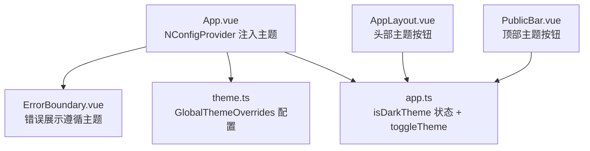
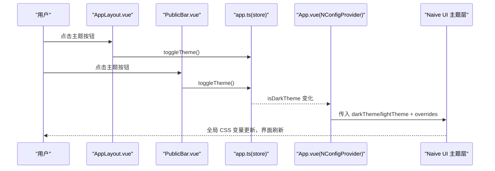
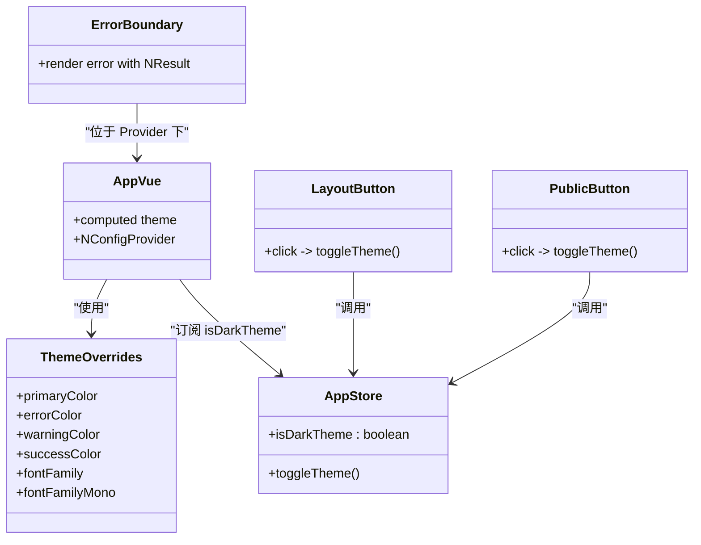

# 主题定制

<cite>
**本文引用的文件**
- [src/styles/theme.ts](file://src/styles/theme.ts)
- [src/App.vue](file://src/App.vue)
- [src/stores/app.ts](file://src/stores/app.ts)
- [src/layout/AppLayout.vue](file://src/layout/AppLayout.vue)
- [src/components/public-bar/PublicBar.vue](file://src/components/public-bar/PublicBar.vue)
- [src/components/shared/ErrorBoundary.vue](file://src/components/shared/ErrorBoundary.vue)
- [src/__tests__/stores/app.test.ts](file://src/__tests__/stores/app.test.ts)
</cite>

## 目录
1. [简介](#简介)
2. [项目结构](#项目结构)
3. [核心组件](#核心组件)
4. [架构总览](#架构总览)
5. [详细组件分析](#详细组件分析)
6. [依赖关系分析](#依赖关系分析)
7. [性能与可访问性](#性能与可访问性)
8. [故障排查指南](#故障排查指南)
9. [结论](#结论)
10. [附录：自定义主题开发指南](#附录自定义主题开发指南)

## 简介
本文件聚焦 Hello-Tauri 的主题系统，围绕明暗主题切换的实现机制、CSS 变量使用、主题状态管理与动态样式应用进行系统化说明。文档同时覆盖 theme.ts 中的主题配置项（颜色方案、字体设置等）、错误边界的主题集成与样式隔离策略，并提供测试方法与跨平台兼容性建议。

## 项目结构
主题相关代码主要分布在以下位置：
- 主题配置：src/styles/theme.ts
- 全局主题注入：src/App.vue
- 主题状态管理：src/stores/app.ts
- 主题切换入口：src/layout/AppLayout.vue、src/components/public-bar/PublicBar.vue
- 错误边界：src/components/shared/ErrorBoundary.vue
- 主题行为测试：src/__tests__/stores/app.test.ts

图表来源
- [src/App.vue:1-24](file://src/App.vue#L1-L24)
- [src/styles/theme.ts:1-13](file://src/styles/theme.ts#L1-L13)
- [src/stores/app.ts:1-57](file://src/stores/app.ts#L1-L57)
- [src/layout/AppLayout.vue:54-70](file://src/layout/AppLayout.vue#L54-L70)
- [src/components/public-bar/PublicBar.vue:31-35](file://src/components/public-bar/PublicBar.vue#L31-L35)
- [src/components/shared/ErrorBoundary.vue:1-30](file://src/components/shared/ErrorBoundary.vue#L1-L30)

章节来源
- [src/App.vue:1-24](file://src/App.vue#L1-L24)
- [src/styles/theme.ts:1-13](file://src/styles/theme.ts#L1-L13)
- [src/stores/app.ts:1-57](file://src/stores/app.ts#L1-L57)
- [src/layout/AppLayout.vue:54-70](file://src/layout/AppLayout.vue#L54-L70)
- [src/components/public-bar/PublicBar.vue:31-35](file://src/components/public-bar/PublicBar.vue#L31-L35)
- [src/components/shared/ErrorBoundary.vue:1-30](file://src/components/shared/ErrorBoundary.vue#L1-L30)

## 核心组件
- 主题配置（theme.ts）
  - 通过 GlobalThemeOverrides 定义全局主题覆盖，包括主色、错误/警告/成功色、通用字体与等宽字体。这些值会被 Naive UI 的 CSS 变量体系消费，从而驱动全应用色彩与字体风格。
- 全局主题注入（App.vue）
  - 使用 NConfigProvider 提供主题实例与覆盖配置；根据 store 的 isDarkTheme 计算当前主题（darkTheme/lightTheme）。
- 主题状态（app.ts）
  - 使用 Pinia 维护 isDarkTheme 布尔状态，并暴露 toggleTheme 方法用于切换。
- 主题切换入口
  - AppLayout.vue 顶部右侧按钮与 PublicBar.vue 顶部按钮均调用 store.toggleTheme 触发切换。
- 错误边界（ErrorBoundary.vue）
  - 基于 Naive UI 的 NResult 渲染错误信息，自动继承当前主题。

章节来源
- [src/styles/theme.ts:1-13](file://src/styles/theme.ts#L1-L13)
- [src/App.vue:1-24](file://src/App.vue#L1-L24)
- [src/stores/app.ts:1-57](file://src/stores/app.ts#L1-L57)
- [src/layout/AppLayout.vue:54-70](file://src/layout/AppLayout.vue#L54-L70)
- [src/components/public-bar/PublicBar.vue:31-35](file://src/components/public-bar/PublicBar.vue#L31-L35)
- [src/components/shared/ErrorBoundary.vue:1-30](file://src/components/shared/ErrorBoundary.vue#L1-L30)

## 架构总览
主题系统的运行流程如下：
- 用户点击主题按钮 → 调用 store.toggleTheme → 更新 isDarkTheme → App.vue 中 computed 重新计算主题 → NConfigProvider 下发新主题 → 子组件与布局通过 CSS 变量即时响应。

图表来源
- [src/layout/AppLayout.vue:54-70](file://src/layout/AppLayout.vue#L54-L70)
- [src/components/public-bar/PublicBar.vue:31-35](file://src/components/public-bar/PublicBar.vue#L31-L35)
- [src/stores/app.ts:12-20](file://src/stores/app.ts#L12-L20)
- [src/App.vue:9-14](file://src/App.vue#L9-L14)

## 详细组件分析

### 主题配置（theme.ts）
- 作用：集中定义全局主题覆盖，包含颜色与字体等基础设计令牌。
- 关键项：
  - 颜色方案：主色、错误色、警告色、成功色。
  - 字体设置：通用字体族与等宽字体族。
- 影响范围：被 NConfigProvider 的 theme-overrides 注入后，Naive UI 内部组件及业务组件通过 CSS 变量消费这些值，实现统一视觉。

章节来源
- [src/styles/theme.ts:1-13](file://src/styles/theme.ts#L1-L13)

### 全局主题注入（App.vue）
- 职责：
  - 引入 darkTheme/lightTheme 与 themeOverrides。
  - 根据 store.isDarkTheme 选择主题实例。
  - 将主题与覆盖配置提供给整个应用树。
- 关键点：
  - 使用 computed 保证主题随状态实时切换。
  - 所有子组件无需感知主题切换逻辑，直接消费 CSS 变量。

章节来源
- [src/App.vue:1-24](file://src/App.vue#L1-L24)

### 主题状态管理（app.ts）
- 职责：
  - 维护 isDarkTheme 布尔状态。
  - 暴露 toggleTheme 方法供任意组件调用。
- 扩展点：
  - 可在初始化时读取本地存储或系统偏好，恢复上次主题。
  - 可扩展持久化策略（如 localStorage）。

章节来源
- [src/stores/app.ts:1-57](file://src/stores/app.ts#L1-L57)

### 主题切换入口（AppLayout.vue 与 PublicBar.vue）
- AppLayout.vue：
  - 在顶部右侧提供圆形图标按钮，点击调用 store.toggleTheme。
  - 使用过渡动画增强切换体验。
- PublicBar.vue：
  - 在顶部工具栏提供文本按钮，同样调用 store.toggleTheme。
- 共同点：
  - 仅负责触发状态变更，不关心具体渲染细节。

章节来源
- [src/layout/AppLayout.vue:54-70](file://src/layout/AppLayout.vue#L54-L70)
- [src/components/public-bar/PublicBar.vue:31-35](file://src/components/public-bar/PublicBar.vue#L31-L35)

### 错误边界的主题集成（ErrorBoundary.vue）
- 行为：
  - 捕获子树异常并以 NResult 展示。
  - 由于处于 NConfigProvider 之下，错误提示自动继承当前主题。
- 样式隔离：
  - 错误提示由 Naive UI 组件渲染，遵循主题变量，避免额外样式污染。

章节来源
- [src/components/shared/ErrorBoundary.vue:1-30](file://src/components/shared/ErrorBoundary.vue#L1-L30)

### 主题相关的 CSS 变量使用
- 布局与组件广泛使用以 --n- 前缀的 CSS 变量（例如背景、边框、文字颜色、字体族），这些变量由 Naive UI 根据当前主题与覆盖配置生成。
- 示例用法（节选路径）：
  - 背景与边框：[src/layout/AppLayout.vue:135-148](file://src/layout/AppLayout.vue#L135-L148)、[src/layout/AppLayout.vue:260-277](file://src/layout/AppLayout.vue#L260-L277)
  - 字体族：[src/layout/AppLayout.vue:215-221](file://src/layout/AppLayout.vue#L215-L221)
  - 品牌色衍生：[src/layout/AppLayout.vue:166-192](file://src/layout/AppLayout.vue#L166-L192)

章节来源
- [src/layout/AppLayout.vue:135-148](file://src/layout/AppLayout.vue#L135-L148)
- [src/layout/AppLayout.vue:215-221](file://src/layout/AppLayout.vue#L215-L221)
- [src/layout/AppLayout.vue:260-277](file://src/layout/AppLayout.vue#L260-L277)
- [src/layout/AppLayout.vue:166-192](file://src/layout/AppLayout.vue#L166-L192)

## 依赖关系分析
- 组件耦合：
  - App.vue 依赖 theme.ts 与 app.ts，作为主题注入中心。
  - AppLayout.vue 与 PublicBar.vue 仅依赖 app.ts 的状态与方法，低耦合。
  - ErrorBoundary.vue 依赖 Naive UI 组件，受 NConfigProvider 主题影响。
- 外部依赖：
  - Naive UI 提供主题系统与 CSS 变量。
  - Pinia 提供响应式状态。

图表来源
- [src/styles/theme.ts:1-13](file://src/styles/theme.ts#L1-L13)
- [src/stores/app.ts:12-20](file://src/stores/app.ts#L12-L20)
- [src/App.vue:9-14](file://src/App.vue#L9-L14)
- [src/layout/AppLayout.vue:54-70](file://src/layout/AppLayout.vue#L54-L70)
- [src/components/public-bar/PublicBar.vue:31-35](file://src/components/public-bar/PublicBar.vue#L31-L35)
- [src/components/shared/ErrorBoundary.vue:1-30](file://src/components/shared/ErrorBoundary.vue#L1-L30)

章节来源
- [src/styles/theme.ts:1-13](file://src/styles/theme.ts#L1-L13)
- [src/stores/app.ts:1-57](file://src/stores/app.ts#L1-L57)
- [src/App.vue:1-24](file://src/App.vue#L1-L24)
- [src/layout/AppLayout.vue:54-70](file://src/layout/AppLayout.vue#L54-L70)
- [src/components/public-bar/PublicBar.vue:31-35](file://src/components/public-bar/PublicBar.vue#L31-L35)
- [src/components/shared/ErrorBoundary.vue:1-30](file://src/components/shared/ErrorBoundary.vue#L1-L30)

## 性能与可访问性
- 性能
  - 主题切换通过 CSS 变量更新，浏览器层面高效重绘，避免大规模 DOM 重建。
  - 仅在 NConfigProvider 层级切换主题，减少重复计算。
- 可访问性
  - 主题按钮具备 Tooltip 提示，提升交互可理解性。
  - 建议使用对比度良好的配色，确保可读性与无障碍体验。

章节来源
- [src/layout/AppLayout.vue:54-70](file://src/layout/AppLayout.vue#L54-L70)

## 故障排查指南
- 问题：切换主题后部分区域未变色
  - 检查是否使用了硬编码颜色而非 CSS 变量。
  - 确认组件是否在 NConfigProvider 之下。
- 问题：字体未生效
  - 检查 theme.ts 中的字体族配置是否正确加载。
  - 确认浏览器是否支持指定字体。
- 问题：错误提示样式异常
  - 确认 ErrorBoundary 未被包裹在非主题上下文内。
  - 检查是否存在覆盖样式冲突。

章节来源
- [src/components/shared/ErrorBoundary.vue:1-30](file://src/components/shared/ErrorBoundary.vue#L1-L30)
- [src/App.vue:14-22](file://src/App.vue#L14-L22)

## 结论
Hello-Tauri 的主题系统以 Naive UI 的 CSS 变量为核心，结合 Pinia 状态管理与 NConfigProvider 的全局注入，实现了简洁高效的明暗主题切换。通过集中化的 theme.ts 配置与统一的 CSS 变量消费方式，保证了主题的一致性与可维护性。错误边界与布局组件均自然融入主题体系，具备良好的可扩展性与跨平台兼容性。

## 附录：自定义主题开发指南

### 主题变量扩展
- 新增设计令牌
  - 在 theme.ts 的 GlobalThemeOverrides 中添加新的颜色或字体属性，确保被 Naive UI 消费。
- 自定义 CSS 变量
  - 在业务组件中使用 --n-* 系列变量，或通过 var(--n-color-target, ...) 形式提供回退值，保持兼容。

章节来源
- [src/styles/theme.ts:1-13](file://src/styles/theme.ts#L1-L13)
- [src/layout/AppLayout.vue:166-192](file://src/layout/AppLayout.vue#L166-L192)

### 品牌色定制
- 修改主色与语义色（错误/警告/成功）以匹配品牌规范。
- 利用 color-mix 与渐变效果在布局中体现品牌层次（参考布局中的 logo 与徽章样式）。

章节来源
- [src/layout/AppLayout.vue:166-192](file://src/layout/AppLayout.vue#L166-L192)

### 组件样式重写方法
- 优先使用 CSS 变量与主题覆盖，避免直接覆盖组件类名。
- 若需局部覆盖，建议在组件作用域内谨慎使用，并确保不影响其他主题模式。

章节来源
- [src/App.vue:14-22](file://src/App.vue#L14-L22)
- [src/styles/theme.ts:1-13](file://src/styles/theme.ts#L1-L13)

### 主题测试方法
- 单元测试
  - 验证 toggleTheme 能正确翻转 isDarkTheme。
  - 断言初始状态与切换后的状态符合预期。
- 端到端测试（可选）
  - 断言页面根节点或主题按钮的可见状态与文案随主题切换而变化。

章节来源
- [src/__tests__/stores/app.test.ts:10-15](file://src/__tests__/stores/app.test.ts#L10-L15)

### 跨平台兼容性考虑
- 字体回退
  - 为等宽字体提供多套回退，确保在不同操作系统上显示一致。
- 系统偏好
  - 可在应用启动时检测 prefers-color-scheme，并据此初始化 isDarkTheme。
- 滚动条与阴影
  - 注意不同平台的滚动条与阴影表现差异，必要时提供降级样式。

章节来源
- [src/styles/theme.ts:9-11](file://src/styles/theme.ts#L9-L11)
- [src/layout/AppLayout.vue:215-221](file://src/layout/AppLayout.vue#L215-L221)