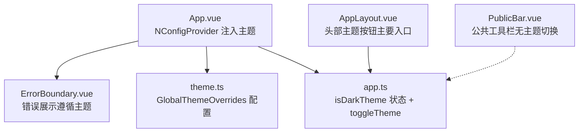
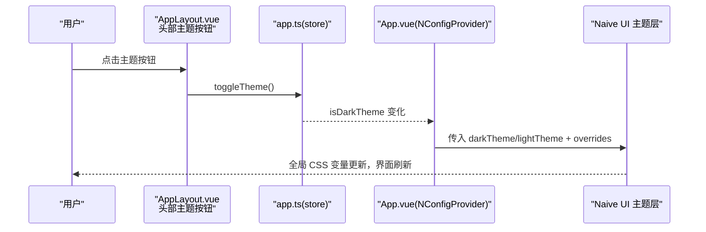
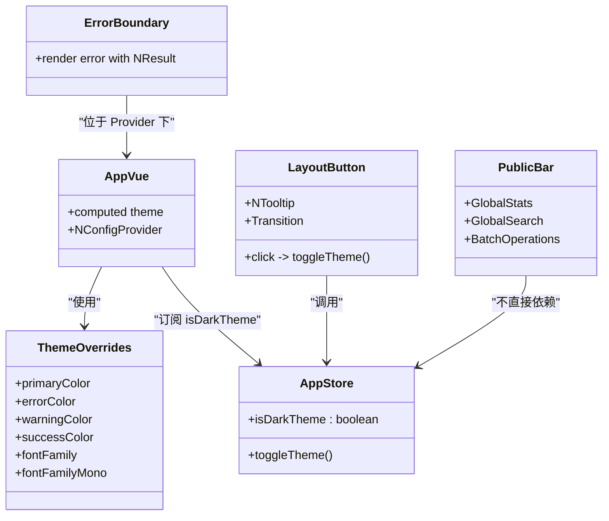

# 主题定制

<cite>
**本文引用的文件**
- [src/styles/theme.ts](file://src/styles/theme.ts)
- [src/App.vue](file://src/App.vue)
- [src/stores/app.ts](file://src/stores/app.ts)
- [src/layout/AppLayout.vue](file://src/layout/AppLayout.vue)
- [src/components/public-bar/PublicBar.vue](file://src/components/public-bar/PublicBar.vue)
- [src/components/shared/ErrorBoundary.vue](file://src/components/shared/ErrorBoundary.vue)
- [src/__tests__/stores/app.test.ts](file://src/__tests__/stores/app.test.ts)
</cite>

## 更新摘要
**变更内容**
- 主题切换按钮从 PublicBar 移动到 AppLayout 头部，提供更一致的设计系统样式
- 新增动画图标过渡效果，使用 Transition 组件实现平滑的主题图标切换
- 集成 Tooltip 提示功能，提升用户交互体验
- 移除未使用的导入和 store 引用，优化代码结构
- 增强主题按钮的视觉反馈和可访问性

## 目录
1. [简介](#简介)
2. [项目结构](#项目结构)
3. [核心组件](#核心组件)
4. [架构总览](#架构总览)
5. [详细组件分析](#详细组件分析)
6. [依赖关系分析](#依赖关系分析)
7. [性能与可访问性](#性能与可访问性)
8. [故障排查指南](#故障排查指南)
9. [结论](#结论)
10. [附录：自定义主题开发指南](#附录自定义主题开发指南)

## 简介
本文件聚焦 Hello-Tauri 的主题系统，围绕明暗主题切换的实现机制、CSS 变量使用、主题状态管理与动态样式应用进行系统化说明。文档同时覆盖 theme.ts 中的主题配置项（颜色方案、字体设置等）、错误边界的主题集成与样式隔离策略，并提供测试方法与跨平台兼容性建议。

**更新** 主题切换机制已显著改进，主题切换按钮现在位于应用头部右侧，提供动画图标过渡、Tooltip 集成和一致的设计系统样式。

## 项目结构
主题相关代码主要分布在以下位置：
- 主题配置：src/styles/theme.ts
- 全局主题注入：src/App.vue
- 主题状态管理：src/stores/app.ts
- 主题切换入口：src/layout/AppLayout.vue（主要入口）
- 公共工具栏：src/components/public-bar/PublicBar.vue（不含主题切换）
- 错误边界：src/components/shared/ErrorBoundary.vue
- 主题行为测试：src/__tests__/stores/app.test.ts

**图表来源**
- [src/App.vue:1-24](file://src/App.vue#L1-L24)
- [src/styles/theme.ts:1-13](file://src/styles/theme.ts#L1-L13)
- [src/stores/app.ts:1-57](file://src/stores/app.ts#L1-L57)
- [src/layout/AppLayout.vue:54-70](file://src/layout/AppLayout.vue#L54-L70)
- [src/components/public-bar/PublicBar.vue:1-33](file://src/components/public-bar/PublicBar.vue#L1-L33)
- [src/components/shared/ErrorBoundary.vue:1-30](file://src/components/shared/ErrorBoundary.vue#L1-L30)

**章节来源**
- [src/App.vue:1-24](file://src/App.vue#L1-L24)
- [src/styles/theme.ts:1-13](file://src/styles/theme.ts#L1-L13)
- [src/stores/app.ts:1-57](file://src/stores/app.ts#L1-L57)
- [src/layout/AppLayout.vue:54-70](file://src/layout/AppLayout.vue#L54-L70)
- [src/components/public-bar/PublicBar.vue:1-33](file://src/components/public-bar/PublicBar.vue#L1-L33)
- [src/components/shared/ErrorBoundary.vue:1-30](file://src/components/shared/ErrorBoundary.vue#L1-L30)

## 核心组件
- 主题配置（theme.ts）
  - 通过 GlobalThemeOverrides 定义全局主题覆盖，包括主色、错误/警告/成功色、通用字体与等宽字体。这些值会被 Naive UI 的 CSS 变量体系消费，从而驱动全应用色彩与字体风格。
- 全局主题注入（App.vue）
  - 使用 NConfigProvider 提供主题实例与覆盖配置；根据 store 的 isDarkTheme 计算当前主题（darkTheme/lightTheme）。
- 主题状态（app.ts）
  - 使用 Pinia 维护 isDarkTheme 布尔状态，并暴露 toggleTheme 方法用于切换。
- 主题切换入口（AppLayout.vue）
  - **更新** 在应用头部右侧提供圆形图标按钮，包含动画过渡效果和 Tooltip 提示，点击调用 store.toggleTheme 触发切换。
- 错误边界（ErrorBoundary.vue）
  - 基于 Naive UI 的 NResult 渲染错误信息，自动继承当前主题。

**章节来源**
- [src/styles/theme.ts:1-13](file://src/styles/theme.ts#L1-L13)
- [src/App.vue:1-24](file://src/App.vue#L1-L24)
- [src/stores/app.ts:1-57](file://src/stores/app.ts#L1-L57)
- [src/layout/AppLayout.vue:54-70](file://src/layout/AppLayout.vue#L54-L70)
- [src/components/public-bar/PublicBar.vue:1-33](file://src/components/public-bar/PublicBar.vue#L1-L33)
- [src/components/shared/ErrorBoundary.vue:1-30](file://src/components/shared/ErrorBoundary.vue#L1-L30)

## 架构总览
主题系统的运行流程如下：
- 用户点击头部主题按钮 → 调用 store.toggleTheme → 更新 isDarkTheme → App.vue 中 computed 重新计算主题 → NConfigProvider 下发新主题 → 子组件与布局通过 CSS 变量即时响应。

**图表来源**
- [src/layout/AppLayout.vue:54-70](file://src/layout/AppLayout.vue#L54-L70)
- [src/stores/app.ts:12-20](file://src/stores/app.ts#L12-L20)
- [src/App.vue:9-14](file://src/App.vue#L9-L14)

## 详细组件分析

### 主题配置（theme.ts）
- 作用：集中定义全局主题覆盖，包含颜色与字体等基础设计令牌。
- 关键项：
  - 颜色方案：主色、错误色、警告色、成功色。
  - 字体设置：通用字体族与等宽字体族。
- 影响范围：被 NConfigProvider 的 theme-overrides 注入后，Naive UI 内部组件及业务组件通过 CSS 变量消费这些值，实现统一视觉。

**章节来源**
- [src/styles/theme.ts:1-13](file://src/styles/theme.ts#L1-L13)

### 全局主题注入（App.vue）
- 职责：
  - 引入 darkTheme/lightTheme 与 themeOverrides。
  - 根据 store.isDarkTheme 选择主题实例。
  - 将主题与覆盖配置提供给整个应用树。
- 关键点：
  - 使用 computed 保证主题随状态实时切换。
  - 所有子组件无需感知主题切换逻辑，直接消费 CSS 变量。

**章节来源**
- [src/App.vue:1-24](file://src/App.vue#L1-L24)

### 主题状态管理（app.ts）
- 职责：
  - 维护 isDarkTheme 布尔状态。
  - 暴露 toggleTheme 方法供任意组件调用。
- 扩展点：
  - 可在初始化时读取本地存储或系统偏好，恢复上次主题。
  - 可扩展持久化策略（如 localStorage）。

**章节来源**
- [src/stores/app.ts:1-57](file://src/stores/app.ts#L1-L57)

### 主题切换入口（AppLayout.vue）
- **更新** 主要主题切换入口已移至应用头部右侧：
  - 使用 NButton quaternary circle 样式创建圆形按钮
  - 集成 NTooltip 提供悬停提示，显示当前主题模式
  - 使用 Transition 组件实现图标切换动画效果
  - 根据 isDarkTheme 状态动态显示太阳/月亮图标
  - 统一的尺寸和样式，与应用设计系统保持一致
- 动画效果：
  - 图标旋转过渡：rotate(-90deg) 到 rotate(90deg)
  - 缩放效果：scale(0.4) 到 scale(1)
  - 透明度渐变：opacity 0 到 1
- 交互体验：
  - 悬停显示 Tooltip 提示当前操作
  - 点击立即切换主题状态
  - 平滑的视觉反馈

**章节来源**
- [src/layout/AppLayout.vue:54-70](file://src/layout/AppLayout.vue#L54-L70)
- [src/layout/AppLayout.vue:255-277](file://src/layout/AppLayout.vue#L255-L277)

### 公共工具栏（PublicBar.vue）
- **更新** 移除了主题切换功能，专注于数据归档相关的批量操作：
  - 全局统计信息显示
  - 全局搜索功能
  - 批量操作菜单（清空、导出、重新解压）
- 职责分离：主题切换集中在应用头部，工具栏专注于核心业务功能

**章节来源**
- [src/components/public-bar/PublicBar.vue:1-33](file://src/components/public-bar/PublicBar.vue#L1-L33)

### 错误边界的主题集成（ErrorBoundary.vue）
- 行为：
  - 捕获子树异常并以 NResult 展示。
  - 由于处于 NConfigProvider 之下，错误提示自动继承当前主题。
- 样式隔离：
  - 错误提示由 Naive UI 组件渲染，遵循主题变量，避免额外样式污染。

**章节来源**
- [src/components/shared/ErrorBoundary.vue:1-30](file://src/components/shared/ErrorBoundary.vue#L1-L30)

### 主题相关的 CSS 变量使用
- 布局与组件广泛使用以 --n- 前缀的 CSS 变量（例如背景、边框、文字颜色、字体族），这些变量由 Naive UI 根据当前主题与覆盖配置生成。
- 示例用法（节选路径）：
  - 背景与边框：[src/layout/AppLayout.vue:124-150](file://src/layout/AppLayout.vue#L124-L150)、[src/layout/AppLayout.vue:294-317](file://src/layout/AppLayout.vue#L294-L317)
  - 字体族：[src/layout/AppLayout.vue:247-253](file://src/layout/AppLayout.vue#L247-L253)
  - 品牌色衍生：[src/layout/AppLayout.vue:193-219](file://src/layout/AppLayout.vue#L193-L219)

**章节来源**
- [src/layout/AppLayout.vue:124-150](file://src/layout/AppLayout.vue#L124-L150)
- [src/layout/AppLayout.vue:247-253](file://src/layout/AppLayout.vue#L247-L253)
- [src/layout/AppLayout.vue:294-317](file://src/layout/AppLayout.vue#L294-L317)
- [src/layout/AppLayout.vue:193-219](file://src/layout/AppLayout.vue#L193-L219)

## 依赖关系分析
- 组件耦合：
  - App.vue 依赖 theme.ts 与 app.ts，作为主题注入中心。
  - AppLayout.vue 仅依赖 app.ts 的状态与方法，低耦合且职责单一。
  - PublicBar.vue 不再依赖主题相关功能，专注于业务逻辑。
  - ErrorBoundary.vue 依赖 Naive UI 组件，受 NConfigProvider 主题影响。
- 外部依赖：
  - Naive UI 提供主题系统与 CSS 变量。
  - Pinia 提供响应式状态。

**图表来源**
- [src/styles/theme.ts:1-13](file://src/styles/theme.ts#L1-L13)
- [src/stores/app.ts:12-20](file://src/stores/app.ts#L12-L20)
- [src/App.vue:9-14](file://src/App.vue#L9-L14)
- [src/layout/AppLayout.vue:54-70](file://src/layout/AppLayout.vue#L54-L70)
- [src/components/public-bar/PublicBar.vue:1-33](file://src/components/public-bar/PublicBar.vue#L1-L33)
- [src/components/shared/ErrorBoundary.vue:1-30](file://src/components/shared/ErrorBoundary.vue#L1-L30)

**章节来源**
- [src/styles/theme.ts:1-13](file://src/styles/theme.ts#L1-L13)
- [src/stores/app.ts:1-57](file://src/stores/app.ts#L1-L57)
- [src/App.vue:1-24](file://src/App.vue#L1-L24)
- [src/layout/AppLayout.vue:54-70](file://src/layout/AppLayout.vue#L54-L70)
- [src/components/public-bar/PublicBar.vue:1-33](file://src/components/public-bar/PublicBar.vue#L1-L33)
- [src/components/shared/ErrorBoundary.vue:1-30](file://src/components/shared/ErrorBoundary.vue#L1-L30)

## 性能与可访问性
- 性能
  - 主题切换通过 CSS 变量更新，浏览器层面高效重绘，避免大规模 DOM 重建。
  - 仅在 NConfigProvider 层级切换主题，减少重复计算。
  - 动画过渡使用 GPU 加速的 transform 属性，确保流畅的视觉效果。
- 可访问性
  - **更新** 主题按钮具备 Tooltip 提示，提升交互可理解性。
  - 建议使用对比度良好的配色，确保可读性与无障碍体验。
  - 图标切换动画提供视觉反馈，帮助用户理解当前状态。

**章节来源**
- [src/layout/AppLayout.vue:54-70](file://src/layout/AppLayout.vue#L54-L70)
- [src/layout/AppLayout.vue:265-277](file://src/layout/AppLayout.vue#L265-L277)

## 故障排查指南
- 问题：切换主题后部分区域未变色
  - 检查是否使用了硬编码颜色而非 CSS 变量。
  - 确认组件是否在 NConfigProvider 之下。
- 问题：字体未生效
  - 检查 theme.ts 中的字体族配置是否正确加载。
  - 确认浏览器是否支持指定字体。
- 问题：错误提示样式异常
  - 确认 ErrorBoundary 未被包裹在非主题上下文内。
  - 检查是否存在覆盖样式冲突。
- **新问题**：主题按钮动画不工作
  - 检查 Transition 组件的 name 属性是否与 CSS 类名匹配。
  - 确认图标元素有正确的 key 属性用于区分不同状态。

**章节来源**
- [src/components/shared/ErrorBoundary.vue:1-30](file://src/components/shared/ErrorBoundary.vue#L1-L30)
- [src/App.vue:14-22](file://src/App.vue#L14-L22)
- [src/layout/AppLayout.vue:54-70](file://src/layout/AppLayout.vue#L54-L70)

## 结论
Hello-Tauri 的主题系统以 Naive UI 的 CSS 变量为核心，结合 Pinia 状态管理与 NConfigProvider 的全局注入，实现了简洁高效的明暗主题切换。**更新后的主题切换机制**将主题控制按钮移至应用头部，提供了更好的用户体验和一致的视觉设计。通过动画图标过渡、Tooltip 集成和设计系统样式的统一，主题切换变得更加直观和专业。错误边界与布局组件均自然融入主题体系，具备良好的可扩展性与跨平台兼容性。

## 附录：自定义主题开发指南

### 主题变量扩展
- 新增设计令牌
  - 在 theme.ts 的 GlobalThemeOverrides 中添加新的颜色或字体属性，确保被 Naive UI 消费。
- 自定义 CSS 变量
  - 在业务组件中使用 --n-* 系列变量，或通过 var(--n-color-target, ...) 形式提供回退值，保持兼容。

**章节来源**
- [src/styles/theme.ts:1-13](file://src/styles/theme.ts#L1-L13)
- [src/layout/AppLayout.vue:193-219](file://src/layout/AppLayout.vue#L193-L219)

### 品牌色定制
- 修改主色与语义色（错误/警告/成功）以匹配品牌规范。
- 利用 color-mix 与渐变效果在布局中体现品牌层次（参考布局中的 logo 与徽章样式）。

**章节来源**
- [src/layout/AppLayout.vue:193-219](file://src/layout/AppLayout.vue#L193-L219)

### 组件样式重写方法
- 优先使用 CSS 变量与主题覆盖，避免直接覆盖组件类名。
- 若需局部覆盖，建议在组件作用域内谨慎使用，并确保不影响其他主题模式。

**章节来源**
- [src/App.vue:14-22](file://src/App.vue#L14-L22)
- [src/styles/theme.ts:1-13](file://src/styles/theme.ts#L1-L13)

### 主题测试方法
- 单元测试
  - 验证 toggleTheme 能正确翻转 isDarkTheme。
  - 断言初始状态与切换后的状态符合预期。
- 端到端测试（可选）
  - 断言页面根节点或主题按钮的可见状态与文案随主题切换而变化。

**章节来源**
- [src/__tests__/stores/app.test.ts:10-15](file://src/__tests__/stores/app.test.ts#L10-L15)

### 跨平台兼容性考虑
- 字体回退
  - 为等宽字体提供多套回退，确保在不同操作系统上显示一致。
- 系统偏好
  - 可在应用启动时检测 prefers-color-scheme，并据此初始化 isDarkTheme。
- 滚动条与阴影
  - 注意不同平台的滚动条与阴影表现差异，必要时提供降级样式。

**章节来源**
- [src/styles/theme.ts:9-11](file://src/styles/theme.ts#L9-L11)
- [src/layout/AppLayout.vue:247-253](file://src/layout/AppLayout.vue#L247-L253)