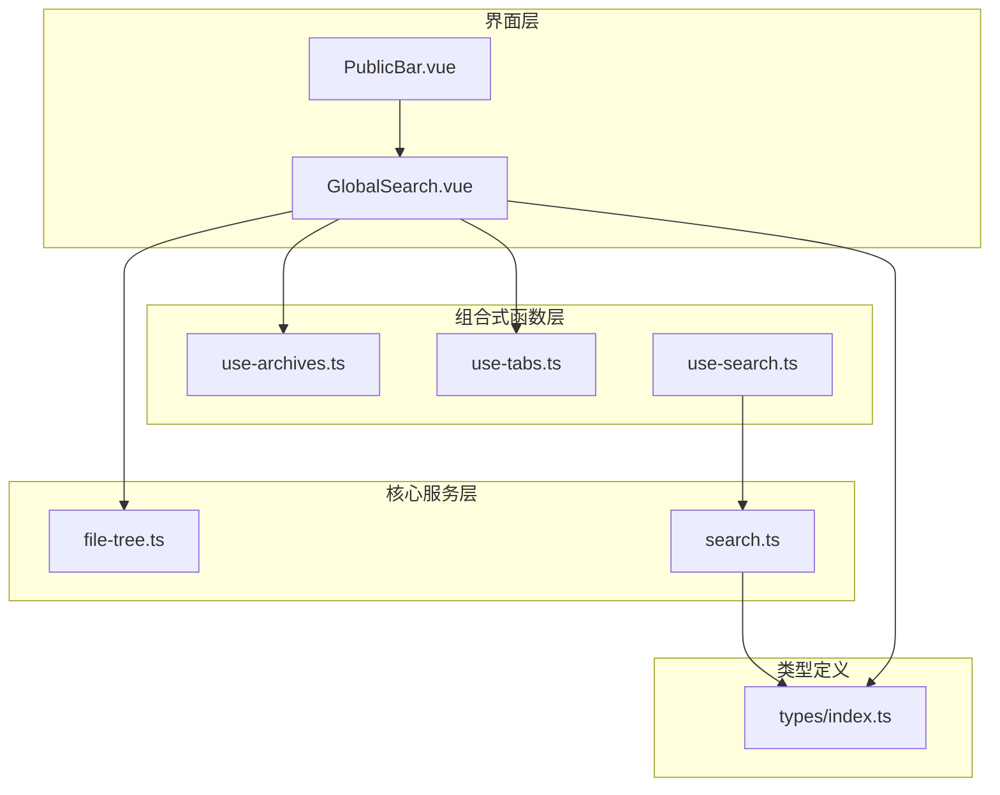
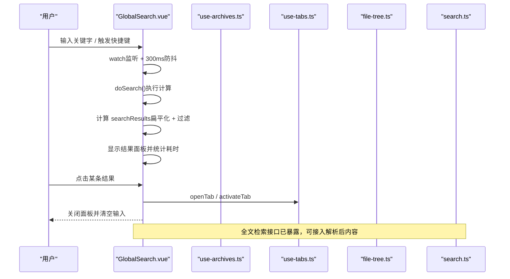
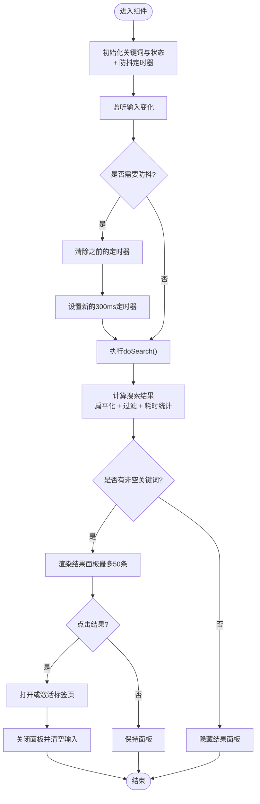
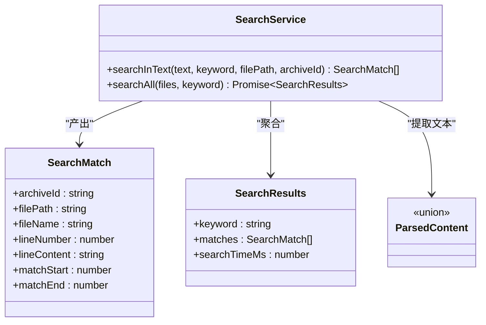
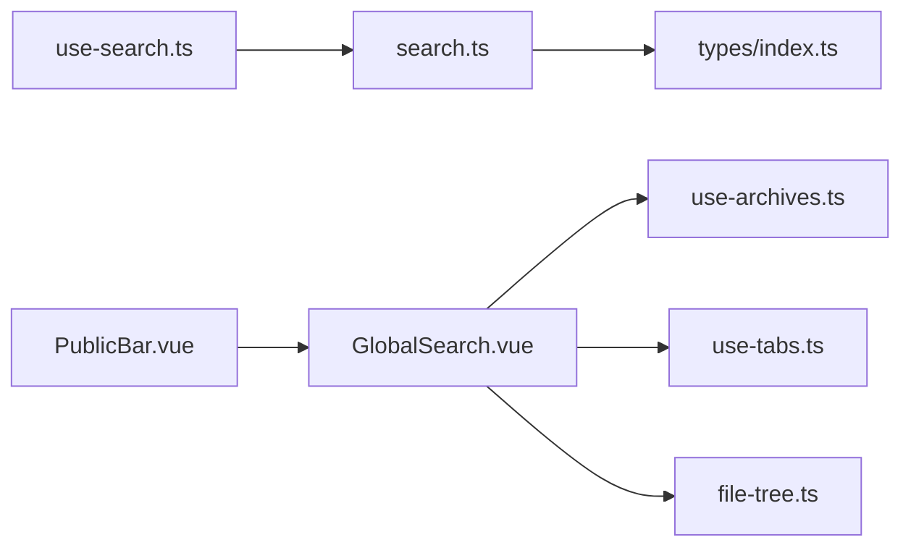

# 全局搜索增强功能

<cite>
**本文引用的文件列表**
- [GlobalSearch.vue](file://src/components/public-bar/GlobalSearch.vue)
- [PublicBar.vue](file://src/components/public-bar/PublicBar.vue)
- [use-search.ts](file://src/composables/use-search.ts)
- [search.ts](file://src/core/search.ts)
- [file-tree.ts](file://src/core/file-tree.ts)
- [use-archives.ts](file://src/composables/use-archives.ts)
- [use-tabs.ts](file://src/composables/use-tabs.ts)
- [index.ts](file://src/types/index.ts)
- [GlobalSearch.test.ts](file://src/__tests__/components/GlobalSearch.test.ts)
- [use-search.test.ts](file://src/__tests__/composables/use-search.test.ts)
- [search.test.ts](file://src/__tests__/core/search.test.ts)
</cite>

## 更新摘要
**变更内容**
- 优化了全局搜索的性能实现，将响应式computed属性替换为手动watch防抖机制
- 引入300ms防抖定时器，显著减少快速输入时的计算开销
- 降低了CPU使用率，提升了用户输入体验
- 更新了相关测试用例以验证防抖功能的正确性

## 目录
1. [简介](#简介)
2. [项目结构](#项目结构)
3. [核心组件](#核心组件)
4. [架构总览](#架构总览)
5. [详细组件分析](#详细组件分析)
6. [依赖关系分析](#依赖关系分析)
7. [性能考量](#性能考量)
8. [故障排查指南](#故障排查指南)
9. [结论](#结论)
10. [附录](#附录)

## 简介
本章节聚焦于"全局搜索增强功能"的实现与扩展点。该功能提供：
- 基于文件名与路径的跨归档快速定位（当前实现）
- 面向未来可扩展的全文检索能力（服务层已就绪）
- 快捷键拦截、结果高亮、标签页联动等交互体验优化
- **新增**：300ms防抖机制，优化快速输入时的性能表现

## 项目结构
全局搜索相关代码主要分布在以下位置：
- 组件层：顶部公共栏中的搜索输入与结果面板
- 组合式函数层：封装搜索状态与服务调用
- 核心服务层：文本提取与多文件匹配聚合
- 数据模型：统一的类型定义，支撑搜索结果与文件树节点
- 测试用例：覆盖组件交互、组合式函数行为与核心算法

图表来源
- [PublicBar.vue:1-50](file://src/components/public-bar/PublicBar.vue#L1-L50)
- [GlobalSearch.vue:1-272](file://src/components/public-bar/GlobalSearch.vue#L1-L272)
- [use-archives.ts:1-198](file://src/composables/use-archives.ts#L1-L198)
- [use-tabs.ts:1-171](file://src/composables/use-tabs.ts#L1-L171)
- [use-search.ts:1-48](file://src/composables/use-search.ts#L1-L48)
- [file-tree.ts:1-93](file://src/core/file-tree.ts#L1-L93)
- [search.ts:1-84](file://src/core/search.ts#L1-L84)
- [index.ts:1-148](file://src/types/index.ts#L1-L148)

章节来源
- [PublicBar.vue:1-50](file://src/components/public-bar/PublicBar.vue#L1-L50)
- [GlobalSearch.vue:1-272](file://src/components/public-bar/GlobalSearch.vue#L1-L272)
- [use-archives.ts:1-198](file://src/composables/use-archives.ts#L1-L198)
- [use-tabs.ts:1-171](file://src/composables/use-tabs.ts#L1-L171)
- [use-search.ts:1-48](file://src/composables/use-search.ts#L1-L48)
- [file-tree.ts:1-93](file://src/core/file-tree.ts#L1-L93)
- [search.ts:1-84](file://src/core/search.ts#L1-L84)
- [index.ts:1-148](file://src/types/index.ts#L1-L148)

## 核心组件
- 全局搜索组件：负责输入监听、结果计算、导航到标签页、快捷键处理与结果展示
- 搜索组合式函数：封装异步搜索流程与结果状态管理
- 搜索核心服务：提供单文本匹配与多文件聚合搜索能力
- 文件树工具：扁平化树结构以支持按文件名/路径快速过滤
- 归档与标签页管理器：提供数据源与打开/激活标签页的能力

章节来源
- [GlobalSearch.vue:1-272](file://src/components/public-bar/GlobalSearch.vue#L1-L272)
- [use-search.ts:1-48](file://src/composables/use-search.ts#L1-L48)
- [search.ts:1-84](file://src/core/search.ts#L1-L84)
- [file-tree.ts:1-93](file://src/core/file-tree.ts#L1-L93)
- [use-archives.ts:1-198](file://src/composables/use-archives.ts#L1-L198)
- [use-tabs.ts:1-171](file://src/composables/use-tabs.ts#L1-L171)

## 架构总览
全局搜索由"界面层—组合式函数层—核心服务层"三层协作完成。当前版本优先实现"文件名/路径级"的快速定位；同时预留"内容级"全文检索接口，便于后续接入解析后的内容。

图表来源
- [GlobalSearch.vue:1-272](file://src/components/public-bar/GlobalSearch.vue#L1-L272)
- [use-archives.ts:1-198](file://src/composables/use-archives.ts#L1-L198)
- [use-tabs.ts:1-171](file://src/composables/use-tabs.ts#L1-L171)
- [file-tree.ts:1-93](file://src/core/file-tree.ts#L1-L93)
- [search.ts:1-84](file://src/core/search.ts#L1-L84)

## 详细组件分析

### 全局搜索组件（GlobalSearch.vue）
- 输入与状态
  - 使用响应式变量保存关键词与是否显示结果面板
  - 通过 watch 在输入变化时控制面板显隐
  - **新增**：300ms防抖定时器，避免每次按键都触发全量计算
- 结果计算
  - 遍历所有已完成状态的归档，利用文件树扁平化工具获取全部叶子节点
  - 对文件名与路径进行大小写不敏感包含匹配，生成结果集
  - 记录搜索耗时用于界面反馈
  - **优化**：使用setTimeout延迟执行，减少频繁重算
- 导航与标签页联动
  - 若目标文件已在标签页中则直接激活，否则打开新标签页
  - 导航完成后自动关闭结果面板并清空输入
- 快捷键与交互
  - 监听 Ctrl/Cmd + K/F 组合键，阻止浏览器默认搜索，聚焦到应用内输入框
  - 支持 Escape 关闭结果面板
  - 点击外部区域关闭结果面板
- 结果展示
  - 显示匹配总数与耗时
  - 对匹配片段进行高亮，显示目录路径与归档来源
  - 限制最多显示前 50 条结果，避免渲染压力

**更新** 实现了防抖优化机制，显著提升快速输入时的性能表现

图表来源
- [GlobalSearch.vue:1-272](file://src/components/public-bar/GlobalSearch.vue#L1-L272)
- [file-tree.ts:1-93](file://src/core/file-tree.ts#L1-L93)
- [use-tabs.ts:1-171](file://src/composables/use-tabs.ts#L1-L171)

章节来源
- [GlobalSearch.vue:1-272](file://src/components/public-bar/GlobalSearch.vue#L1-L272)
- [file-tree.ts:1-93](file://src/core/file-tree.ts#L1-L93)
- [use-tabs.ts:1-171](file://src/composables/use-tabs.ts#L1-L171)

### 搜索组合式函数（use-search.ts）
- 职责
  - 维护搜索结果与搜索中状态
  - 对外暴露 search/clear 方法，内部委托给核心服务
- 设计要点
  - 模块级单例的服务实例，避免重复创建
  - 异步搜索完成后统一恢复 searching 状态
  - 返回结构化结果对象，便于上层渲染与交互

章节来源
- [use-search.ts:1-48](file://src/composables/use-search.ts#L1-L48)

### 搜索核心服务（search.ts）
- 文本提取器
  - 将不同解析类型的结构化内容转换为纯文本，以便统一检索
- 单文本匹配
  - 逐行扫描，大小写不敏感，记录匹配起止位置与上下文
- 多文件聚合
  - 遍历文件集合，汇总匹配项并统计耗时
- 扩展性
  - 为后续接入解析引擎与缓存机制提供清晰边界

图表来源
- [search.ts:1-84](file://src/core/search.ts#L1-L84)
- [index.ts:1-148](file://src/types/index.ts#L1-L148)

章节来源
- [search.ts:1-84](file://src/core/search.ts#L1-L84)
- [index.ts:1-148](file://src/types/index.ts#L1-L148)

### 文件树工具（file-tree.ts）
- 扁平化
  - 递归遍历树节点，输出线性数组，便于快速过滤
- 查找
  - 根据 key 定位节点，配合标签页打开逻辑
- 构建
  - 将扁平文件条目组装为层级树，供其他模块复用

章节来源
- [file-tree.ts:1-93](file://src/core/file-tree.ts#L1-L93)

### 归档与标签页管理器（use-archives.ts / use-tabs.ts）
- 归档管理器
  - 提供归档列表、状态更新、统计信息与缓存恢复
  - 仅对已完成归档执行搜索，避免无效计算
- 标签页管理器
  - 打开/关闭/激活标签页，固定策略与淘汰策略
  - 记录最近文件与光标位置，辅助导航与展示

章节来源
- [use-archives.ts:1-198](file://src/composables/use-archives.ts#L1-L198)
- [use-tabs.ts:1-171](file://src/composables/use-tabs.ts#L1-L171)

## 依赖关系分析
- 组件依赖
  - GlobalSearch 依赖归档管理器获取数据源，依赖标签页管理器进行导航
  - 依赖文件树工具进行扁平化与过滤
- 服务依赖
  - use-search 依赖 core/search 提供匹配与聚合能力
  - core/search 依赖 types 提供的数据结构
- 集成点
  - PublicBar 作为容器引入 GlobalSearch，形成顶层入口

图表来源
- [GlobalSearch.vue:1-272](file://src/components/public-bar/GlobalSearch.vue#L1-L272)
- [use-archives.ts:1-198](file://src/composables/use-archives.ts#L1-L198)
- [use-tabs.ts:1-171](file://src/composables/use-tabs.ts#L1-L171)
- [use-search.ts:1-48](file://src/composables/use-search.ts#L1-L48)
- [search.ts:1-84](file://src/core/search.ts#L1-L84)
- [index.ts:1-148](file://src/types/index.ts#L1-L148)
- [PublicBar.vue:1-50](file://src/components/public-bar/PublicBar.vue#L1-L50)

章节来源
- [GlobalSearch.vue:1-272](file://src/components/public-bar/GlobalSearch.vue#L1-L272)
- [use-archives.ts:1-198](file://src/composables/use-archives.ts#L1-L198)
- [use-tabs.ts:1-171](file://src/composables/use-tabs.ts#L1-L171)
- [use-search.ts:1-48](file://src/composables/use-search.ts#L1-L48)
- [search.ts:1-84](file://src/core/search.ts#L1-L84)
- [index.ts:1-148](file://src/types/index.ts#L1-L148)
- [PublicBar.vue:1-50](file://src/components/public-bar/PublicBar.vue#L1-L50)

## 性能考量
- 计算范围限定
  - 仅对已完成归档进行搜索，跳过未完成任务，减少无效计算
- 结果数量限制
  - 前端仅渲染前 50 条结果，降低 DOM 压力
- 耗时统计
  - 使用高精度计时反馈搜索耗时，便于监控与优化
- **新增**：防抖优化
  - 300ms防抖定时器，避免快速输入时频繁触发全量计算
  - 显著降低CPU使用率，提升用户体验
  - 通过clearTimeout确保定时器正确清理
- 可扩展优化方向
  - 对大文件内容采用分块或增量匹配
  - 结合索引或倒排表提升大规模数据检索效率

**更新** 引入了防抖机制，大幅改善了快速输入场景下的性能表现

[本节为通用指导，无需特定文件引用]

## 故障排查指南
- 快捷键无响应
  - 检查键盘事件监听是否在文档级别注册且捕获阶段生效
  - 确认平台修饰键判断（Mac 与非 Mac）正确
- 结果面板不显示
  - 确认关键词非空且存在匹配
  - 检查归档状态是否为已完成
- 点击结果未跳转
  - 验证标签页是否存在相同 key 与 archiveId 的组合
  - 确认 openTab/activateTab 调用参数正确
- 全文搜索无结果
  - 确认传入的文件内容已正确提取为纯文本
  - 检查关键字是否为空或大小写不一致导致匹配失败
- **新增**：防抖相关问题
  - 如果搜索结果更新延迟，检查300ms防抖定时器是否正确设置
  - 确认定时器在组件卸载时被正确清理
  - 验证多次快速输入时定时器被正确重置

章节来源
- [GlobalSearch.vue:1-272](file://src/components/public-bar/GlobalSearch.vue#L1-L272)
- [use-search.ts:1-48](file://src/composables/use-search.ts#L1-L48)
- [search.ts:1-84](file://src/core/search.ts#L1-L84)

## 结论
当前全局搜索实现了高效的文件名/路径级定位，并与标签页系统深度集成，具备良好的用户体验与扩展基础。**经过性能优化后，通过300ms防抖机制显著减少了快速输入时的计算开销，降低了CPU使用率**。核心服务层已具备全文检索能力，后续可在解析引擎与缓存机制完善后平滑接入内容级搜索，进一步提升检索能力与性能。

[本节为总结性内容，无需特定文件引用]

## 附录

### 单元测试概览
- 组件测试
  - 覆盖渲染、快捷键、结果面板显隐、导航与高亮等场景
  - **新增**：验证防抖定时器的正确性与300ms延迟效果
- 组合式函数测试
  - 验证初始状态、搜索完成后的结果与状态恢复、清空逻辑
- 核心服务测试
  - 验证大小写不敏感、同一行多次匹配、空输入与空文件列表等边界情况

**更新** 增加了防抖相关的测试用例，确保性能优化功能的稳定性

章节来源
- [GlobalSearch.test.ts:1-336](file://src/__tests__/components/GlobalSearch.test.ts#L1-L336)
- [use-search.test.ts:1-79](file://src/__tests__/composables/use-search.test.ts#L1-L79)
- [search.test.ts:1-83](file://src/__tests__/core/search.test.ts#L1-L83)